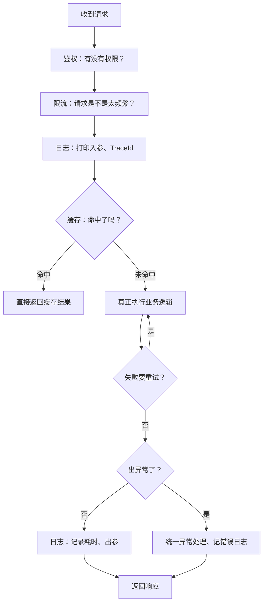
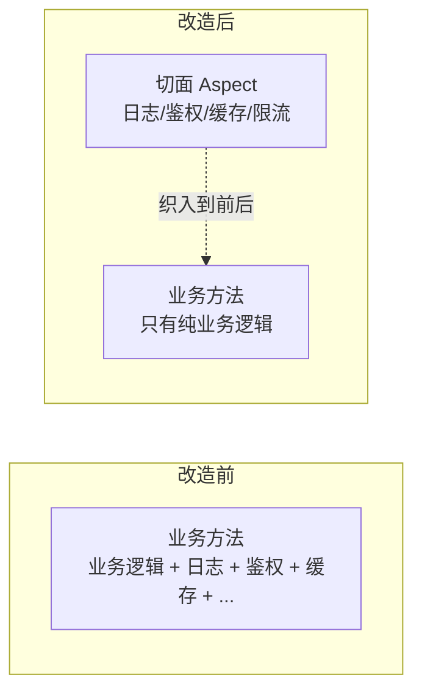

在写后端接口时，你一定见过这样的代码：方法开头打印入参、中间校验权限、结尾记录耗时、出错再 catch 一下记日志。这些逻辑跟「业务是什么」关系不大，却像牛皮癣一样粘在每一个 Controller、Service 方法上——复制粘贴几十遍，改一处要改几十处。

这篇文章，我们用 **AOP（面向切面编程）** 把这堆横切逻辑一次性收拢起来，让接口调用回归纯粹。

## 接口调用里的「横切关注点」

先盘点一下，一次典型接口调用，除了真正的业务逻辑外，还藏着哪些重复代码：



这一圈看下来，真正的业务逻辑其实只有中间那一步「执行业务」。其余的**鉴权、限流、日志、缓存、重试、异常处理**，与具体业务无关，却在大量接口上重复出现——这就是典型的「横切关注点（cross-cutting concern）」。

如果不处理，代码会变成这样：

```java
@RestController
public class OrderController {

    @PostMapping("/order")
    public Result<Order> create(@RequestBody Order order) {
        long start = System.currentTimeMillis();
        log.info("create 入参: {}", order);              // 日志

        if (!authService.hasPermission("order:create")) { // 鉴权
            throw new BizException("无权限");
        }
        if (rateLimiter.tryAcquire() == false) {          // 限流
            throw new BizException("请求过于频繁");
        }

        Order cached = cache.get("order:" + order.getId());// 缓存
        if (cached != null) return Result.ok(cached);

        try {
            Order result = orderService.create(order);     // 业务（唯一重要的一行）
            cache.put("order:" + order.getId(), result);
            log.info("create 耗时 {}ms 出参: {}", System.currentTimeMillis() - start, result);
            return Result.ok(result);
        } catch (Exception e) {
            log.error("create 失败", e);                   // 异常
            return Result.fail("系统繁忙");
        }
    }
}
```

业务只有一行，横切逻辑却有十几行。当你有 50 个这样的接口，就是 50 份重复——这是维护噩梦的起点。

## AOP 如何解决这个问题

AOP 的核心思想一句话：**把横切逻辑「织入」到目标方法的前后，而目标方法本身对这一切无感知**。



几个核心概念先对齐（Spring 语境下）：

- **切面（Aspect）**：横切逻辑的载体，比如 `ApiLogAspect`、`AuthAspect`。
- **切点（Pointcut）**：定义「在哪些方法上生效」，是切面的瞄准镜。
- **通知（Advice）**：切面在切点处执行的时机与动作，如 `@Before`、`@Around`。
- **织入（Weaving）**：把切面缝进目标代码。Spring AOP 在**运行时通过代理**完成。

> [!TIP]
> Spring AOP 本质是「为 Bean 生成代理对象」，调用时代理先拦截，执行完切面逻辑再放行到原方法。所以 AOP 只对**经过 Spring 容器管理的 Bean** 生效，自己 `new` 出来的对象不受影响。

## 设计思路：自定义注解驱动切面

要让「哪些接口需要增强」可声明、可控制，最优雅的方式是**自定义注解驱动**：给需要增强的方法打上注解，切面用 `@annotation` 匹配它。

```java
// 一个注解，代表「这个接口需要记录日志」
@Target(ElementType.METHOD)
@Retention(RetentionPolicy.RUNTIME)
public @interface ApiLog {
    String value() default "";   // 业务描述，如 "创建订单"
}
```

这样业务方只需一行注解即可声明：

```java
@ApiLog("创建订单")
public Order create(Order order) { /* 纯业务 */ }
```

切面则完全与业务解耦，收拢到独立的类里维护。

## 实战：一个完整的接口日志切面

下面是一个可直接落地的「接口日志切面」，用 `@Around` 环绕通知，同时记录入参、耗时、出参和异常：

```java
@Slf4j
@Aspect
@Component
@Order(10)                       // 数字越小越先执行
public class ApiLogAspect {

    // 切点：任意标了 @ApiLog 的方法
    @Pointcut("@annotation(com.example.anno.ApiLog)")
    public void apiLog() {}

    @Around("apiLog() && @annotation(anno)")
    public Object around(ProceedingJoinPoint pjp, ApiLog anno) throws Throwable {
        String method = pjp.getSignature().toShortString();
        Object[] args = pjp.getArgs();
        long start = System.currentTimeMillis();

        // 前置：打印入参 + TraceId
        log.info("[{}] 开始调用 method={} 入参={} traceId={}",
                 anno.value(), method, args, MDC.get("traceId"));

        try {
            Object result = pjp.proceed();              // 放行，执行原方法
            long cost = System.currentTimeMillis() - start;
            log.info("[{}] 调用成功 method={} 耗时={}ms 出参={}",
                     anno.value(), method, cost, result);
            return result;
        } catch (Throwable t) {
            long cost = System.currentTimeMillis() - start;
            log.error("[{}] 调用失败 method={} 耗时={}ms", anno.value(), method, cost, t);
            throw t;                                     // 原样抛出，交给上层处理
        }
    }
}
```

几个要点：

- **`ProceedingJoinPoint.proceed()`** 是环绕通知的「开关」，不调用它原方法就不会执行；它的返回值就是原方法的返回值，必须 `return` 出去。
- **`&& @annotation(anno)`** 能把方法上的注解实例绑定到参数 `anno`，从而拿到注解的属性值（如 `value()`）。
- 异常要 `throw t` 原样抛出，不要吞掉，否则会破坏上层的异常处理与事务回滚。

## 用 AOP 统一做「接口限流 + 鉴权」

日志是最基础的例子。AOP 更强大的价值在于把**跨接口的通用控制逻辑**也收拢进来。比如「限流」和「鉴权」，用切面后业务方法里一行都不用写：

```java
@Aspect
@Component
@Order(1)   // 鉴权/限流应该最先执行，先于日志
public class AccessControlAspect {

    @Pointcut("@annotation(com.example.anno.RateLimit)")
    public void rateLimited() {}

    @Around("rateLimited() && @annotation(anno)")
    public Object rateLimit(ProceedingJoinPoint pjp, RateLimit anno) throws Throwable {
        if (!rateLimiter.tryAcquire(anno.key(), anno.qps())) {
            throw new BizException(429, "请求过于频繁");
        }
        return pjp.proceed();
    }

    @Pointcut("@annotation(com.example.anno.RequireRole)")
    public void requireRole() {}

    @Before("requireRole() && @annotation(anno)")
    public void checkRole(JoinPoint jp, RequireRole anno) {
        String role = SecurityContext.getCurrentRole();
        if (!Arrays.asList(anno.value()).contains(role)) {
            throw new BizException(403, "无权限");
        }
    }
}
```

业务方法变得干干净净：

```java
@ApiLog("创建订单")
@RateLimit(key = "order", qps = 100)
@RequireRole("ADMIN")
public Order create(Order order) { /* 只有业务 */ }
```

> [!NOTE]
> 用 `@Order` 控制多个切面的执行顺序：鉴权/限流这类「门卫」切面应排最前（`@Order` 值最小），日志等观测性切面靠后。否则可能出现「先打了成功日志，才发现没权限」的错乱顺序。

## 用 AOP 做「缓存 + 重试」

环绕通知的另一个杀手锏是：**可以在 `proceed()` 前后插入「短路」逻辑**。缓存命中就压根不执行原方法，失败就自动重试。

```java
@Aspect
@Component
public class CacheAspect {

    @Around("@annotation(com.example.anno.Cacheable)")
    public Object cache(ProceedingJoinPoint pjp) throws Throwable {
        String key = buildKey(pjp);          // 用方法 + 参数拼出缓存 key
        Object cached = cache.get(key);
        if (cached != null) {
            return cached;                    // 命中：短路，不执行原方法
        }
        Object result = pjp.proceed();        // 未命中：执行并回填
        cache.put(key, result);
        return result;
    }
}
```

```java
@Aspect
@Component
public class RetryAspect {

    @Around("@annotation(com.example.anno.Retryable)")
    public Object retry(ProceedingJoinPoint pjp) throws Throwable {
        Retryable anno = pjp.getTarget().getClass()
            .getMethod(pjp.getSignature().getName())
            .getAnnotation(Retryable.class);
        int attempts = anno == null ? 3 : anno.value();

        for (int i = 1; ; i++) {
            try {
                return pjp.proceed();
            } catch (Exception e) {
                if (i >= attempts) throw e;   // 用完重试次数，抛出
                log.warn("第 {} 次调用失败，重试中...", i, e);
            }
        }
    }
}
```

> [!WARNING]
> 重试要格外谨慎：**只有幂等操作（查询、无副作用的读）才适合自动重试**。写操作重试可能造成重复下单、重复扣款。且重试要配合退避（backoff）避免雪崩，生产上更推荐用 Spring Retry 或 Resilience4j 这类成熟库，而不是手写。

## 统一异常与返回值包装

接口调用还有一个常见的横切需求：**把异常统一转成规范的响应结构**。用 `@AfterThrowing` 或 `@Around` 里的 catch 都能做，但更推荐用 Spring 的 `@ControllerAdvice` 做全局异常处理——它本质上也是 AOP 的一种应用：

```java
@RestControllerAdvice
public class GlobalExceptionHandler {

    @ExceptionHandler(BizException.class)
    public Result<Void> handleBiz(BizException e) {
        return Result.fail(e.getCode(), e.getMessage());
    }

    @ExceptionHandler(Exception.class)
    public Result<Void> handleOther(Exception e) {
        log.error("未预期异常", e);
        return Result.fail(500, "系统繁忙");
    }
}
```

这样 Controller 层彻底告别 `try-catch`，业务方法只 `throw`，由全局处理器统一兜底。日志切面（观测）与异常处理（兜底）各司其职、互不干扰。

## 必须警惕的三个坑

AOP 虽好，但有三个经典陷阱，写的时候务必记住：

**1. 自调用失效**：同一个类内部，`this.xxx()` 直接调用不会经过代理，切面不生效。

```java
@Service
public class OrderService {
    public void register(Order o) {
        this.create(o);   // ❌ create 上的 @ApiLog 不生效！
    }

    @ApiLog("创建订单")
    public Order create(Order o) { return o; }
}
```

解法：把需要增强的方法拆到**另一个 Bean** 里跨 Bean 调用，或注入自身代理（自依赖），或用 `AopContext.currentProxy()`。

**2. 代理方式限制**：Spring Boot 3.x 默认用 CGLIB（基于子类继承），因此 `final` 类、`final` 方法、`private` 方法**无法被代理**。需要增强的方法别声明成 final。

**3. 异常别乱吞**：切面里的 catch 若吞掉异常而不 `throw`，会导致上层 `@Transactional` 感知不到异常、事务不回滚。观测型切面应 `throw t` 原样抛出。

## 小结

- 接口调用里散落的**日志、鉴权、限流、缓存、重试、异常处理**都是横切关注点，用 AOP 收拢成切面，业务方法回归纯粹。
- 用**自定义注解**声明「哪些方法需要增强」，切面通过 `@annotation` 匹配，业务与横切逻辑彻底解耦。
- `@Around` 最强大：能记录耗时、短路缓存、实现重试；`@Before` 适合鉴权等前置校验；`@Order` 控制多切面先后。
- 谨记三大坑：**自调用失效、final 方法无法代理、异常别乱吞**。

AOP 的价值不在「少写几行重复代码」，而在于**让横切关注点有一处唯一的、可维护的归属**。当你下次准备在接口方法里复制第 51 份日志代码时，想一想：这难道不该是一个切面吗？
