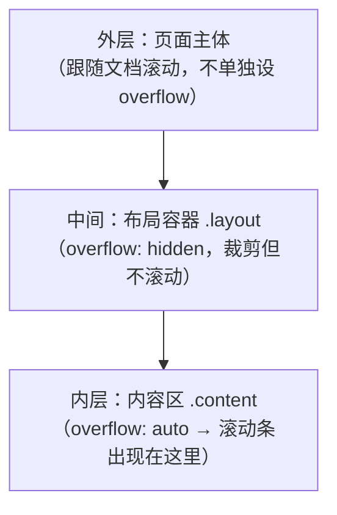

滚动条是网页里最不起眼、却无处不在的元素。它的出现不是偶然，而是 CSS 盒模型与内容溢出共同作用的结果。这篇文章从「滚动为什么会出现」讲起，一直讲到如何用 CSS 和少量 JS 彻底控制、美化滚动条，把开发中用得到的知识点一次讲全。

## 一、滚动为什么会出现

### 1. 盒模型与 overflow

每个元素在页面上都占据一个矩形盒子。当内容尺寸**超过**盒子尺寸时，多出来的部分就叫「溢出（overflow）」。默认情况下，`overflow` 的初始值是 `visible`，也就是溢出的内容会**直接画出来**，并不产生滚动条：

```css
.box {
  width: 200px;
  height: 100px;
  /* 默认 overflow: visible —— 内容溢出但不滚动，直接溢出显示 */
}
```

只有当 `overflow` 被设为 `auto`、`scroll` 或 `hidden` 时，浏览器才需要处理溢出，其中 `auto` 和 `scroll` 会引入滚动条：

| 值 | 行为 |
| --- | --- |
| `visible`（默认） | 内容溢出直接显示，不裁剪、不滚动 |
| `hidden` | 溢出内容被裁剪，不可滚动（编程仍可滚动） |
| `scroll` | 无论是否溢出都**强制显示滚动条** |
| `auto` | 仅当内容溢出时才显示滚动条（最常用） |
| `clip` | 类似 hidden，但彻底禁止编程滚动 |

```css
/* 只有内容真的溢出时才出现滚动条 */
.scroll-area {
  overflow: auto;   /* 或 overflow-y: auto */
}
```

### 2. 两个独立的溢出方向

`overflow` 其实是个简写，背后是 `overflow-x` 和 `overflow-y` 两个独立属性：

```css
/* 横向滚动，纵向溢出隐藏 */
.table-wrap {
  overflow-x: auto;
  overflow-y: hidden;
}
```

需要注意一个坑：**当一个方向设为非 `visible`，另一个方向会被强制变成 `auto`**（规范要求 `visible` 不能与非 `visible` 组合）。所以想让 `overflow-x: visible` + `overflow-y: auto` 同时生效是做不到的，实际会得到 `overflow-x: auto`。

### 3. 滚动容器（scroll container）

设了非 `visible` 的 `overflow`，这个元素就成为一个「滚动容器」。它的内部是「滚动内容」，超出盒子的部分通过滚动条来查看。浏览器的滚动条本质上就是一个「查看窗口」的控制器——**滚动条的存在，说明这个盒子里还有看不见的内容**。

### 4. 嵌套容器的滚动条归属

页面里经常是**容器层层嵌套**的：外层是页面主体，中间是布局区，内层才是真正放内容的盒子。这时候滚动条出现在**哪一层**，完全由「**哪个盒子设了 `overflow` 且内容溢出**」决定——**滚动条只会出现在你指定了滚动能力的那个容器上**，而不是统一出现在最外层。



典型需求是「**整页不滚，只有中间的内容区自己滚**」，常见于后台管理、聊天窗口、弹窗等场景。做法很直接：**给内层容器设固定高度 + `overflow: auto`，同时让外层不产生滚动**。

```css
/* 整页不滚：html/body 高度锁死 */
html, body {
  height: 100%;
  margin: 0;
  overflow: hidden;      /* 关掉文档级滚动 */
}

/* 布局层：占满视口，但不产生自己的滚动条 */
.layout {
  height: 100%;
  display: flex;
  flex-direction: column;
}

/* 内容层：这一层才滚动 */
.content {
  flex: 1;               /* 撑满剩余高度 */
  overflow-y: auto;      /* 滚动条出现在这里 */
}
```

几个关键点：

1. **滚动条跟着「设置了 overflow 且内容溢出的那个盒子」走**。上面例子里，`.layout` 虽然 `overflow: hidden`，但它的内容是 `.content`，本身没溢出，所以不滚动；真正滚动的是 `.content`。
2. **要让内层容器能滚，它必须有确定的高度**（`flex: 1`、固定 `height` 或 `max-height`）。否则内容会把盒子撑高，`overflow` 无从谈起——这是「设了 overflow 却不滚动」的最常见原因。
3. **每一层都能独立滚动**：如果 `.content` 内部还有一个更小的 `.list` 也设了 `overflow: auto`，那 `.list` 会有**自己的**滚动条，与外层的滚动互不影响，形成「嵌套滚动」。

```css
/* 嵌套滚动：内层 .list 和外层 .content 各自独立滚动 */
.content {
  height: 400px;
  overflow-y: auto;      /* 外层滚动条 */
}
.content .list {
  height: 200px;
  overflow-y: auto;      /* 内层还有自己的滚动条 */
}
```

> 嵌套滚动时，内层滚到底后，继续滚会触发外层的「滚动链」。如果想让内层滚到底就停住、不带动外层，配合 `overscroll-behavior: contain` 即可（见下文第三节）。

### 5. 文档级滚动

整个页面的滚动是**根元素**（`<html>` / viewport）上的滚动，和普通元素滚动是同一套机制，只是容器换成了视口。可以用 `document.documentElement.scrollTop` 或 `window.scrollY` 读取。

## 二、滚动条的结构与相关尺寸

了解滚动相关的尺寸属性，才能精确控制滚动。核心区分两类：**可滚动的「内容」尺寸** 和 **可见的「容器」尺寸**。

| 属性 | 含义 |
| --- | --- |
| `clientHeight` / `clientWidth` | 容器的可见尺寸（含 padding，不含边框与滚动条） |
| `scrollHeight` / `scrollWidth` | 内容的完整尺寸（含溢出部分） |
| `scrollTop` / `scrollLeft` | 已滚动的距离（可读可写） |
| `offsetHeight` | 含边框的盒子尺寸 |

判断「是否还能往下滚」的经典公式：

```javascript
const el = document.querySelector('.scroll-area');
const atBottom = el.scrollTop + el.clientHeight >= el.scrollHeight;
const atTop = el.scrollTop === 0;
```

## 三、用 CSS 控制滚动行为

### 1. scroll-behavior：平滑滚动

锚点跳转默认是「瞬移」，加一行就能变平滑：

```css
html {
  scroll-behavior: smooth;   /* 全局锚点平滑滚动 */
}
```

也可以只针对某个容器：

```css
.chat-box {
  overflow-y: auto;
  scroll-behavior: smooth;
}
```

### 2. scroll-padding / scroll-margin：滚动定位偏移

锚点跳转时元素会顶到视口最上方，被 `position: fixed` 的吸顶导航挡住。用 `scroll-padding-top`（加在滚动容器上）或 `scroll-margin-top`（加在目标元素上）留出偏移：

```css
html {
  scroll-padding-top: 70px;   /* 给 70px 高的吸顶导航留空间 */
}

/* 或写在目标元素上 */
h2 {
  scroll-margin-top: 70px;
}
```

### 3. scroll-snap：滚动吸附

做轮播图、卡片流时，让滚动「自动对齐」到某个位置：

```css
.carousel {
  display: flex;
  overflow-x: auto;
  scroll-snap-type: x mandatory;   /* 横向强制吸附 */
}
.carousel > .item {
  scroll-snap-align: start;        /* 每个 item 吸附到起点 */
}
```

`scroll-snap-type` 的 `mandatory`（强制）与 `proximity`（就近）控制吸附强度；`scroll-snap-align` 控制对齐位置（`start`/`center`/`end`）。

### 4. overscroll-behavior：阻止滚动链

当内层滚动容器滚到底时，继续滚动会把滚动「传递」给外层页面（滚动链/scroll chaining）。这在弹窗、抽屉里体验很糟：

```css
.modal-body {
  overflow-y: auto;
  overscroll-behavior: contain;   /* 阻断滚动链，滚到底就停 */
}
```

`contain` 阻断滚动链但保留原生「下拉回弹」，`none` 则连回弹也禁用。

## 四、美化滚动条

### 1. 跨浏览器标准属性：scrollbar-width / scrollbar-color

Firefox 及新版 Chromium 支持的标准方案，简洁但能力有限：

```css
.scroll-area {
  scrollbar-width: thin;          /* auto | thin | none */
  scrollbar-color: #888 transparent;  /* 滑块色 轨道色 */
}
```

### 2. WebKit 伪元素：::-webkit-scrollbar

Chrome、Safari、Edge（Chromium 内核）支持，能力最全，是当前主流做法：

```css
/* 整个滚动条 */
.scroll-area::-webkit-scrollbar {
  width: 8px;          /* 纵向滚动条宽度 */
  height: 8px;         /* 横向滚动条高度 */
}

/* 滚动条轨道（背景） */
.scroll-area::-webkit-scrollbar-track {
  background: #f1f1f1;
  border-radius: 4px;
}

/* 滑块（可拖动部分） */
.scroll-area::-webkit-scrollbar-thumb {
  background: #c1c1c1;
  border-radius: 4px;
}

/* 滑块 hover 态 */
.scroll-area::-webkit-scrollbar-thumb:hover {
  background: #a8a8a8;
}

/* 两端的按钮（默认不显示） */
.scroll-area::-webkit-scrollbar-button {
  display: none;
}
```

一个「细窄、半透明、圆角」的现代滚动条完整写法：

```css
.scroll-area::-webkit-scrollbar {
  width: 6px;
}
.scroll-area::-webkit-scrollbar-thumb {
  background: rgba(0, 0, 0, 0.2);
  border-radius: 3px;
}
.scroll-area::-webkit-scrollbar-thumb:hover {
  background: rgba(0, 0, 0, 0.35);
}
.scroll-area::-webkit-scrollbar-track {
  background: transparent;
}
```

> 提示：`::-webkit-scrollbar` 只能用在**自身会产生滚动条的元素**上，不能隔代指定。想要全局美化，直接写在 `*` 或 `html` 上即可。

### 3. 隐藏滚动条但保留滚动

常见的需求：区域要能滚，但不想要滚动条占位或显示。三种方式：

```css
/* 方式一：标准属性（Firefox/新版 Chrome） */
.scroll-area {
  scrollbar-width: none;
}

/* 方式二：WebKit 隐藏 */
.scroll-area::-webkit-scrollbar {
  display: none;
}

/* 方式三：负 margin 撑出可视区外（老浏览器兜底） */
.scroll-area {
  overflow: hidden;
}
.scroll-area > .inner {
  overflow-y: scroll;
  margin-right: -17px;   /* 把滚动条挤出可视区 */
}
```

## 五、用 JS 控制滚动

### 1. 基础滚动 API

```javascript
// 相对当前位置滚动
el.scrollBy({ top: 100, behavior: 'smooth' });

// 滚动到绝对位置
el.scrollTo({ top: 0, behavior: 'smooth' });

// 滚动到页面顶部
window.scrollTo({ top: 0, behavior: 'smooth' });

// 滚动到页面某个元素（现代标准，推荐）
el.scrollIntoView({ behavior: 'smooth', block: 'start' });
```

### 2. 监听滚动事件

```javascript
// 容器滚动
el.addEventListener('scroll', () => {
  if (el.scrollTop + el.clientHeight >= el.scrollHeight - 5) {
    console.log('已滚到底，加载更多');
  }
});

// 页面滚动
window.addEventListener('scroll', () => {
  console.log('当前滚动距离：', window.scrollY);
});
```

滚动事件触发非常频繁，直接在里面做重计算会卡顿，务必用 `requestAnimationFrame` 或节流（throttle）优化。

### 3. 吸顶 / 回顶按钮实战

```javascript
const backTop = document.querySelector('#back-top');

window.addEventListener('scroll', () => {
  // 滚过 300px 显示回顶按钮
  backTop.style.display = window.scrollY > 300 ? 'block' : 'none';
});

backTop.addEventListener('click', () => {
  window.scrollTo({ top: 0, behavior: 'smooth' });
});
```

## 六、性能与无障碍要点

1. **别在 scroll 里做重活**：布局/重绘操作用 `requestAnimationFrame` 或节流包裹，能显著减少卡顿。
2. **不要隐藏必要的滚动条**：`scrollbar-width: none` 隐藏后，用户可能不知道内容还能滚，需要配合视觉提示（如渐变遮罩、箭头）。
3. **保持足够的滚动条对比度**：滑块颜色与轨道、背景要有区分，满足 WCAG 可读性要求。
4. **`scroll-behavior: smooth` 尊重用户偏好**：有些用户会关闭系统动画，可用 `prefers-reduced-motion` 覆盖：

```css
@media (prefers-reduced-motion: reduce) {
  html {
    scroll-behavior: auto;
  }
}
```

## 小结

- **滚动出现的根源**：内容溢出盒子，`overflow` 从默认的 `visible` 变成 `auto`/`scroll`，元素成为滚动容器，浏览器就渲染出滚动条。
- **控制滚动**：`scroll-behavior` 平滑、`scroll-padding`/`scroll-margin` 定位偏移、`scroll-snap` 吸附、`overscroll-behavior` 阻断滚动链。
- **美化滚动条**：标准 `scrollbar-width`/`scrollbar-color`（简洁跨浏览器），或 `::-webkit-scrollbar` 系列伪元素（能力最全、主流方案）；隐藏滚动条用 `scrollbar-width: none` 或 `::-webkit-scrollbar{display:none}`。
- **JS 控制**：`scrollTo`/`scrollBy`/`scrollIntoView` + `scroll` 事件，配合节流实现回顶、吸顶、无限加载。

掌握滚动条的原理与控制，能让界面细节更精致、交互更顺滑——这正是前端工程师「把普通功能做出质感」的功力所在。
