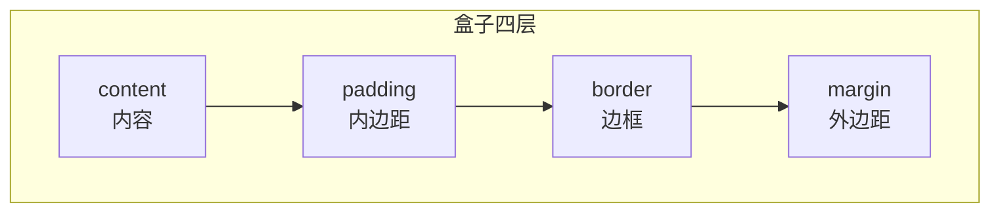

# 选择器与层叠

CSS 的核心是「**选中元素，应用样式**」。要写出可维护的样式，必须先搞懂**选择器**怎么选、**优先级**怎么算、**层叠**怎么决定最终生效值。

## 一、选择器类型

从简单到复杂，常用的选择器有这些：

```css
/* 1. 基础选择器 */
* { }                    /* 通配符：选中所有元素 */
p { }                    /* 标签（元素）选择器 */
.title { }               /* 类选择器（最常用） */
#app { }                 /* ID 选择器 */

/* 2. 属性选择器 */
[type="text"] { }        /* 属性等于某值 */
[class^="btn-"] { }      /* 属性以 btn- 开头 */
[class$="-active"] { }   /* 属性以 -active 结尾 */
[class*="icon"] { }      /* 属性包含 icon */

/* 3. 组合选择器 */
div p { }                /* 后代：div 内所有 p（任意层级） */
div > p { }              /* 子代：div 直接子元素 p */
h1 + p { }               /* 相邻兄弟：紧跟在 h1 后的 p */
h1 ~ p { }               /* 通用兄弟：h1 之后所有同级 p */

/* 4. 伪类与伪元素 */
a:hover { }              /* 伪类：元素的状态 */
li:first-child { }       /* 第一个子元素 */
li:nth-child(2n) { }     /* 偶数项 */
p::before { content: "→"; }  /* 伪元素：创建虚拟内容 */
p::first-letter { }      /* 首字母 */
```

> 伪类 `:` 描述**状态**（hover、focus、第 n 个），伪元素 `::` 创建**虚拟元素**（before、after、首字母）。

## 二、优先级（Specificity）

当多个规则同时命中一个元素时，浏览器按「优先级」决定谁赢。优先级是一个四元组 `(a, b, c, d)`，从高到低：

| 层级 | 内容 | 示例 |
| --- | --- | --- |
| a | 内联样式 `style=""` | `style="color:red"` |
| b | ID 选择器数量 | `#app` |
| c | 类 / 属性 / 伪类数量 | `.title`、`[type]`、`:hover` |
| d | 标签 / 伪元素数量 | `div`、`::before` |

比较规则：**从左到右逐位比较**，先比 a，相同再比 b，以此类推。注意：**b 级再多个 ID 也比不过 a 级一个内联**，因为 a 位优先级更高。

```css
/* 优先级对比 */
#nav .link {}            /* (0,1,1,0) ID 1 个 + 类 1 个 */
div.box a:hover {}       /* (0,0,2,2) 类1+伪类1=2，标签2 */
```

几个易混淆点：

- `!important` **凌驾于一切之上**（包括内联），但**滥用是万恶之源**，应尽量避免。
- 通配符 `*`、组合器（`>`、`+`、`~`）、`:where()` 都**不增加优先级**。
- `:is()` 取**参数中最高**的那个选择器的优先级。

```css
/* :where 优先级为 0，方便被覆盖 */
.section :where(p) { margin: 0; }   /* 优先级只有 .section */

/* :is 取参数最高优先级 */
:is(#app, .box) p { }               /* 按 #app 算，优先级很高 */
```

## 三、层叠（Cascade）规则

「层叠」就是多条规则冲突时的裁决顺序，共四步：

1. **来源与重要性**：用户代理样式 < 用户样式 < 作者样式 < 作者 `!important` < 用户 `!important`。
2. **优先级**：按上面的四元组比较。
3. **源码顺序**：优先级相同时，**后写的覆盖先写的**。
4. **内联样式**：优先级最高（除非有 `!important`）。

记住这个口诀：**先看来源，再看优先级，最后看顺序**。

## 四、继承（Inheritance）

部分属性会从父元素**继承**到子元素，主要是**文本相关**的属性：

- 会继承：`color`、`font-family`、`font-size`、`line-height`、`text-align`、`visibility` 等。
- 不继承：`margin`、`padding`、`border`、`width`、`height`、`background`、`position` 等（盒模型相关大多不继承）。

```css
body { color: #333; }   /* 所有后代文字都变 #333，除非被覆盖 */
```

用关键词显式控制继承：

```css
.child {
  color: inherit;   /* 强制继承父元素 */
  color: initial;   /* 回到属性初始值 */
  color: unset;     /* 有继承性=inherit，无继承性=initial */
}
```

## 五、盒模型总览

在进入下一章详细讲解前，先建立全局认知：**CSS 里每个元素都是一个矩形盒子**，由四层组成，从内到外是：



- **content**：内容区，放文字、图片，由 `width`/`height` 决定（受 box-sizing 影响）。
- **padding**：内边距，内容与边框之间，背景色会填充到这里。
- **border**：边框，包裹 padding。
- **margin**：外边距，盒子与外界之间的空白，背景不填充。

理解了「层叠决定值、盒子决定尺寸」，下一章我们深入盒模型的每个细节。

## 小结

- 选择器优先级四元组 `(内联, ID, 类/属性/伪类, 标签/伪元素)`，**从左到右逐位比较**。
- `!important` 优先级最高但应慎用；`:where()` 不计优先级、`:is()` 取参数最高。
- 层叠顺序：**来源 → 优先级 → 源码顺序**。
- 文本属性会继承，盒模型属性不会。
- 每个元素都是「内容 + padding + border + margin」四层盒子。
