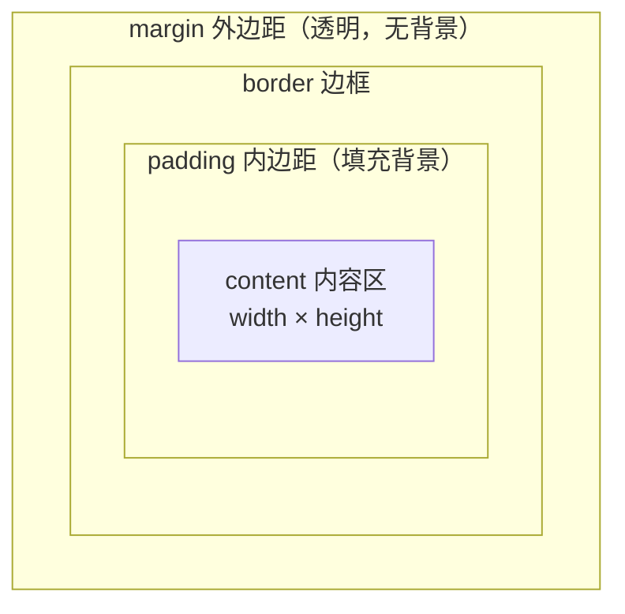
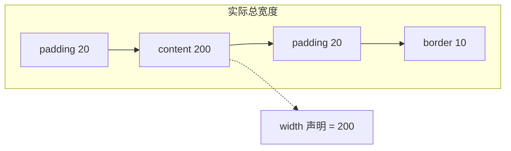
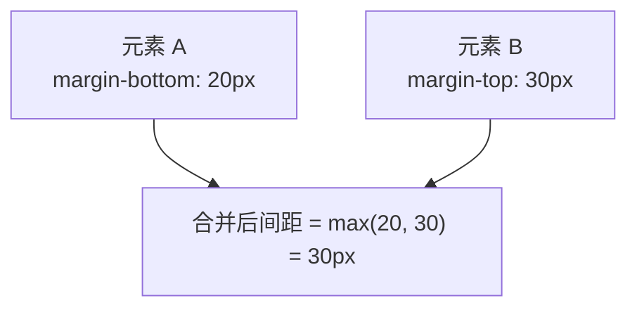
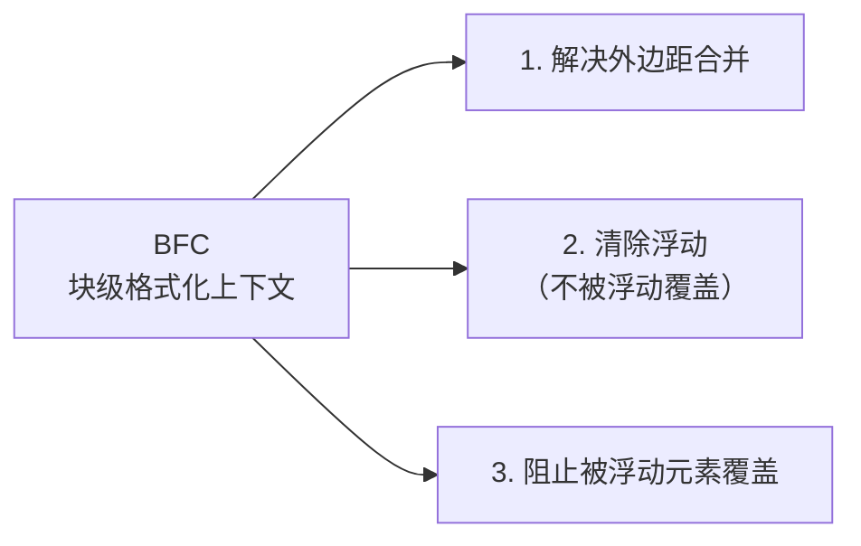
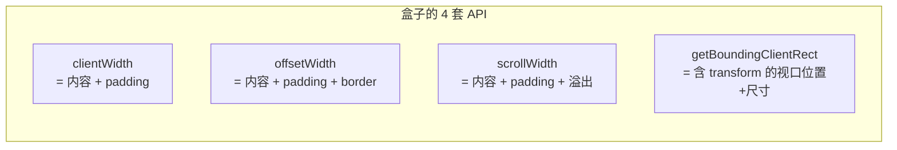

# 盒子模型详解

盒子模型是 CSS 布局的**基石**。理解它，才能理解元素为什么比预期宽、外边距为什么「合并」、`box-sizing` 为什么能救命。

## 一、盒子的四层结构

每个元素都是一个盒子，从内到外四层：



```css
.box {
  width: 200px;        /* 内容区宽度 */
  height: 100px;
  padding: 20px;       /* 内边距 */
  border: 10px solid #333;   /* 边框 */
  margin: 30px;        /* 外边距 */
}
```

## 二、标准盒模型 vs 怪异盒模型（box-sizing）

这是**最容易踩的坑**，也是最实用的知识点。

### 标准盒模型（默认 `content-box`）

`width` 只指**内容区**的宽度，`padding` 和 `border` 是**额外加上去**的：



```css
.box {
  box-sizing: content-box;   /* 默认值 */
  width: 200px;
  padding: 20px;
  border: 10px solid #333;
}
/* 实际渲染宽度 = 200 + 20*2 + 10*2 = 260px */
```

> 你以为盒子宽 200px，实际是 260px——**这就是布局「莫名变宽」的元凶**。

### 怪异盒模型（`border-box`）

`width` 指**从 border 到 border 的总宽度**，`padding` 和 `border` 都**包含在内**，内容区自动收缩：

```css
.box {
  box-sizing: border-box;
  width: 200px;
  padding: 20px;
  border: 10px solid #333;
}
/* 实际渲染宽度 = 200px（含 padding 和 border），内容区只有 140px */
```

**几乎所有现代项目都会全局开启 `border-box`**，因为它更符合直觉：

```css
/* 业界通行的全局设置 */
*,
*::before,
*::after {
  box-sizing: border-box;
}
```

对比总结：

| | `content-box`（默认） | `border-box`（推荐） |
| --- | --- | --- |
| `width` 含义 | 仅内容区 | 含 padding + border |
| 实际宽度 | `width + padding + border` | 就是 `width` |
| 加 padding 后 | 盒子变大，可能撑破布局 | 盒子不变，内容区收缩 |
| 使用场景 | 少数需要精确内容尺寸时 | 绝大多数布局 |

## 三、padding 与 margin 的取值

### padding：内边距

背景色会填充到 padding 区域，所以常用于**扩大可点击区域**：

```css
.btn {
  padding: 10px 20px;   /* 上下 10px，左右 20px */
}
/* 简写规则（和 margin 完全一致） */
padding: 10px;              /* 四边都是 10px */
padding: 10px 20px;         /* 上下 10px，左右 20px */
padding: 10px 20px 30px;    /* 上 10，左右 20，下 30 */
padding: 10px 20px 30px 40px; /* 上 右 下 左（顺时针） */
```

#### padding 的几条特殊规则

- **不支持负值**（margin 可以）：`padding: -10px` 无效，会被忽略。这点在写代码调试时容易混淆。
- **百分比基于父元素宽度计算**（不是内容区，也不是高度！）。这是一个常被忽略的细节，是早期实现「宽高比盒子」的 hack：

```css
/* 经典 hack：16:9 响应式视频框 */
.video-box {
  width: 100%;
  padding-top: 56.25%;  /* 9/16 = 56.25%，相对父宽度算出高度 */
  position: relative;
}
.video-box iframe {
  position: absolute;   /* 子元素绝对定位撑满 */
  inset: 0;
}
```

> [!TIP]
> 这个 padding-top 百分比 hack 已经被现代的 `aspect-ratio` 替代（见下文第八节），不再推荐。

### margin：外边距

背景不填充，用于拉开元素间距。**支持负值**（可用于制造重叠或微调位置），也支持 `auto`（用于水平居中）：

```css
.box {
  margin: 0 auto;      /* 上下 0，左右 auto → 水平居中 */
}
```

#### longhand 单边属性

简写是 `margin`/`padding`，单边属性可以单独设置：

```css
.card {
  margin-top: 20px;
  margin-right: auto;     /* 单独设置右边 */
  margin-bottom: 20px;
  margin-left: auto;      /* 单独设置左边 */
}
/* 简写等价（顺时针 上右下左） */
.card { margin: 20px auto; }
```

#### margin 负值的三大用途

1. **元素微调位置**：用 `-2px` 做 1px 偏移等细节调整。
2. **制造元素重叠**：让两个元素叠加（如下拉菜单盖住下方元素）。
3. **经典布局技巧**：圣杯布局、双飞翼布局用负 margin 把元素「拉」回上一行。

```css
/* 经典双飞翼：中间列宽度自适应 */
.layout { display: flex; }
.main {
  flex: 1;
  margin: 0 -200px;   /* 负边距让左右两列能"挤进来" */
}
```

#### margin: auto 的生效规则

`auto` 会让浏览器自动计算外边距。**但生效条件和方向密切相关**：

```css
/* ✅ 水平居中：经典写法 */
.box { width: 200px; margin: 0 auto; }

/* ❌ 普通块级元素垂直方向 auto 无效 */
.box { height: 200px; margin: auto 0; }   /* 垂直不会居中 */

/* ✅ 垂直居中需要 Flex/Grid 父容器 */
.parent { display: flex; }
.child  { margin: auto; }   /* 上下左右都居中 */
```

> [!NOTE]
> 普通文档流的块级元素垂直方向 `margin: auto` 不会居中——因为纵向高度被内容撑开，没有可分配的剩余空间。只有在 Flex/Grid 容器（剩余空间会分配给子项）或绝对定位（已知高度 + 四方向 auto）时才生效。

## 四、外边距合并（Margin Collapse）

这是一个隐蔽但高频的坑：**相邻的垂直外边距会合并成一个，取较大值**（不是相加）。



三种触发场景：

```css
/* 1. 相邻兄弟元素 */
.first  { margin-bottom: 20px; }
.second { margin-top: 30px; }
/* 两者间距是 30px，不是 50px */

/* 2. 父子元素：父没有 border/padding 时，子的 margin-top 会「穿透」到父 */
.parent { }
.child  { margin-top: 40px; }
/* 结果父子一起往下移 40px，而不是子相对父下移 */

/* 3. 空元素自身的上下 margin 合并 */
```

**常见解决办法**（给父元素制造隔离，或改布局）：

```css
/* 方法一：给父元素加 border 或 padding */
.parent { padding: 1px; }

/* 方法二：触发 BFC（块级格式化上下文） */
.parent { overflow: hidden; }

/* 方法三：改用 Flex/Grid 布局（子项 margin 不合并） */
.parent { display: flex; }
```

> 只有**垂直方向**会合并，水平方向（左右 margin）**从不合并**。Flex/Grid 容器的子项之间也不合并。

### 哪些情况不会合并

不是所有元素都会发生外边距合并。以下情况**不会**合并：

| 情况 | 原因 |
| --- | --- |
| 行内元素（`inline`/`inline-block`） | 垂直 margin 对它们无效 |
| 浮动元素（`float`） | 已脱离文档流 |
| 绝对/固定定位元素（`absolute`/`fixed`） | 已脱离文档流 |
| Flex/Grid 容器的子项 | 在 Flex/Grid 上下文里渲染 |
| 父元素有 `overflow` 不为 `visible` | 已触发 BFC（见下节） |
| 父元素有 border/padding/inline content | 父子边界已建立 |

## 五、BFC 块级格式化上下文 {#bfc}

**BFC（Block Formatting Context，块级格式化上下文）**是 CSS 布局中的一个重要概念。它是一个**独立的渲染区域**，内部的元素布局不会影响外部，反之亦然。

### BFC 的三大作用



### 触发 BFC 的常见方式

```css
/* 1. overflow 不为 visible（最常用） */
.parent { overflow: hidden; }      /* 或 auto、scroll */

/* 2. display: flow-root（语义最清晰，专为触发 BFC 设计） */
.parent { display: flow-root; }    /* 推荐，副作用最小 */

/* 3. 浮动元素 */
.float-box { float: left; }        /* 自己会创建 BFC */

/* 4. 绝对/固定定位 */
.abs { position: absolute; }

/* 5. display: inline-block / table-cell / table-caption */
.cell { display: table-cell; }

/* 6. contain: layout / paint / strict */
.box { contain: layout; }
```

> [!TIP]
> 早期常用 `overflow: hidden` 触发 BFC，但**副作用是会裁剪溢出内容**——如果子元素用了 box-shadow 或负 margin 跑到容器外，会被裁掉。**推荐用 `display: flow-root`**——专为创建 BFC 而生，没有任何副作用，语义清晰。

### 实战：解决外边距合并

```css
/* 父子 margin-top「穿透」问题 */
.parent {
  display: flow-root;    /* 触发 BFC，隔离父子 margin */
}
.child {
  margin-top: 40px;      /* 现在只会让子相对父下移 40px */
}
```

### 实战：清除浮动塌陷

```css
/* 父容器不设高度，子元素全 float 会导致父塌陷为 0 */
.parent { display: flow-root; }  /* 父会"包住"浮动的子 */

/* 传统 clearfix hack（仍兼容老代码） */
.parent::after {
  content: '';
  display: block;
  clear: both;
}
```

## 六、width / height 与百分比

- `width: 100%` 是**相对父元素内容区**的百分比（父是 `border-box` 时注意差异）。
- `height: 100%` 要生效，**父元素必须有明确高度**，否则会塌陷为 0。这是「`height: 100%` 不生效」的常见原因。
- `min-width` / `max-width` 常用于响应式：`max-width: 100%` 让图片不溢出容器。

```css
img {
  max-width: 100%;    /* 图片不超容器，缩放不放大 */
  height: auto;
}
```

## 七、内在尺寸与 aspect-ratio {#intrinsic}

现代 CSS 提供了一组**基于内容自动决定尺寸**的关键字，非常实用：

### 内在尺寸关键字

```css
.box {
  width: max-content;   /* 撑到内容最大宽度（不换行） */
  width: min-content;   /* 压到内容最小宽度（最长的不可断单词） */
  width: fit-content;   /* 类似 auto，但不会超过 max-content */
}
```

**直观对比**（同一段文本配三种宽度）：

| 关键字 | 表现 |
| --- | --- |
| `max-content` | 文字一行显示，盒子超宽（不被截断） |
| `min-content` | 按最长的单词宽度决定（中文场景下 ≈ `max-content`） |
| `fit-content` | 容器宽度内能装下就装下，最多不超过 `max-content` |

**典型应用**：让按钮、表单字段宽度刚好包裹文字，又不超容器：

```css
.btn {
  width: fit-content;   /* 按钮根据内容自适应 */
  padding: 8px 16px;
}
```

### aspect-ratio：现代宽高比属性

过去用 `padding-top` 百分比 hack 实现响应式视频框。现在直接用 **`aspect-ratio`**（2021 年全面支持）：

```css
/* 16:9 视频容器 */
.video-box {
  width: 100%;
  aspect-ratio: 16 / 9;   /* 高度自动按比例算出 */
}

/* 1:1 头像 */
.avatar {
  width: 200px;
  aspect-ratio: 1;        /* 高度自动等于宽度 */
}
```

> [!NOTE]
> `aspect-ratio` 会被显式的 `height` 覆盖。所以适合「宽度自适应、高度按比例」的场景；如果想锁定宽高比例又允许独立设宽高，需结合 `min-*`/`max-*` 使用。

## 八、替换元素 vs 非替换元素 {#replaced}

### 概念区分

- **替换元素**：内容由浏览器根据属性「替换」出来的元素，CSS 控制的是它的「盒子」，对内部内容无能为力。常见如 ``、`<video>`、`<input>`、`<textarea>`、`<select>`。
- **非替换元素**：内容由用户/作者直接写在标签里，CSS 可以控制内部文字。如 `<div>`、`<p>`、`<span>`。

### 盒模型上的差异

```css
/* 替换元素的尺寸由内容属性或 CSS 决定 */
img { width: 200px; height: 100px; }   /* 图片会拉伸/压缩显示 */
img { width: 200px; height: auto; }    /* 按原比例缩放 */

/* 非替换元素：width/height 决定内容区尺寸 */
div { width: 200px; height: 100px; }
```

**替换元素的特殊点**：

- 默认有「内在尺寸」（图片原尺寸、视频时长等），不设 CSS 时按原内容显示。
- `width: auto` 会用原图的宽高比。
- **垂直 margin 对行内替换元素有效**（与一般行内元素不同）。
- 表单元素（`<input>`、`<button>`、`<select>`）的盒模型行为可通过 `appearance: none` 重置成普通元素。

> [!TIP]
> 想知道某个元素是不是替换元素，MDN 文档每个元素页都有明确标注。常见替换元素清单：img、picture、video、audio、iframe、embed、object、input、textarea、select、button、canvas、svg。

## 九、display 与盒子的关系

`display` 决定了元素生成**哪种盒子**，进而影响盒模型的表现：

| display | 盒子类型 | 特点 |
| --- | --- | --- |
| `block` | 块级盒 | 独占一行，可设宽高，`margin` 全方向生效 |
| `inline` | 行内盒 | 不换行，**宽高和上下 margin/padding 不生效** |
| `inline-block` | 行内块盒 | 不换行，但**可设宽高**，保留行内布局 |
| `none` | 不生成盒 | 元素完全移除，不占空间 |
| `flex` / `grid` | 弹性/网格容器 | 子项按弹性/网格规则排列 |
| `flow-root` | BFC 容器 | 不改变布局，专门触发 BFC（见第五节） |

```css
/* inline 元素无法设宽高，但 inline-block 可以 */
span { display: inline-block; width: 100px; height: 40px; }
```

> `visibility: hidden` 与 `display: none` 的区别：前者**占位但不显示**，后者**不占位**。隐藏按钮保留布局用前者，彻底移除用后者。

## 十、盒阴影 box-shadow {#box-shadow}

盒子阴影画在 `border-box` 之外（或之内），是盒模型概念的延伸。

### 基础语法

```css
box-shadow: <offset-x> <offset-y> <blur> <spread> <color>;
/* 偏移 X  偏移 Y  模糊半径  扩散半径  颜色 */

.card {
  box-shadow: 0 2px 8px rgba(0, 0, 0, 0.1);
  /* 水平 0、垂直下移 2、模糊 8、无扩散、黑色 10% 透明 */
}
```

### 常用组合

```css
/* 悬浮卡片（轻） */
.btn { box-shadow: 0 2px 4px rgba(0,0,0,.1); }
/* 悬浮卡片（中） */
.btn:hover { box-shadow: 0 4px 12px rgba(0,0,0,.15); }
/* 悬浮卡片（重） */
.modal { box-shadow: 0 10px 30px rgba(0,0,0,.2); }
```

### 内阴影与多重阴影

```css
/* inset：内阴影（向内凹陷） */
.inset {
  box-shadow: inset 0 2px 4px rgba(0,0,0,.2);
}

/* 多重阴影：逗号分隔，可叠加任意多层 */
.glow {
  box-shadow:
    0 0 10px rgba(0,150,255,.5),       /* 主光晕 */
    0 0 20px rgba(0,150,255,.3);       /* 外层更淡 */
}
```

> [!NOTE]
> `box-shadow` 画在元素**外**（不影响布局），所以可以叠加任意多层而不撑大容器。这点和 `border` 不同——`border` 会改变盒模型的尺寸。

## 十一、JS 获取盒模型尺寸 {#js-api}

盒模型的几何信息，JS 可以读出 4 组 API，常用于布局计算、滚动监听、动画等场景：

```js
const el = document.querySelector('.box');

// 1. clientWidth / clientHeight：内容区 + padding（不含 border、margin）
el.clientWidth;        // → 220（200 内容 + 10×2 padding）
el.clientHeight;

// 2. offsetWidth / offsetHeight：内容 + padding + border（不含 margin）
el.offsetWidth;        // → 240（220 + 10×2 border）
el.offsetHeight;

// 3. scrollWidth / scrollHeight：内容 + padding + 溢出部分
el.scrollWidth;        // → 超出可视区的内容总尺寸
el.scrollHeight;
el.scrollTop;          // 垂直滚动距离（可读写）
el.scrollLeft;         // 水平滚动距离

// 4. getBoundingClientRect：相对视口的位置和尺寸
const rect = el.getBoundingClientRect();
rect.width;            // 渲染宽度（≈ offsetWidth，但含 transform 缩放）
rect.height;
rect.top;              // 距视口顶部的距离
rect.left;             // 距视口左边的距离
```



> [!TIP]
> `getBoundingClientRect` 返回的 `width`/`height` 是**渲染后的尺寸**，包含了 `transform: scale()` 这类变换——而 `offsetWidth` 是不含变换的「布局尺寸」。需要做动画/碰撞检测时用前者，常规布局计算用后者。

## 小结

- **盒子四层**：content → padding → border → margin，背景填充到 padding。
- **`box-sizing: border-box`** 让 `width` 包含 padding/border，**全局开启是行业标准**。
- **垂直方向相邻 `margin` 会合并取大值**，用 BFC、border/padding 或 Flex/Grid 规避。
- **BFC** 是独立渲染区域，用 `display: flow-root` 触发最干净，可解决外边距合并、清浮动、防覆盖三大问题。
- **padding 百分比基于父宽度**，**padding 不支持负值**。
- **`margin: auto`** 垂直居中只在 Flex/Grid 或绝对定位下生效。
- **内在尺寸** `min-content`/`max-content`/`fit-content` 让容器按内容自适应。
- **`aspect-ratio`** 替代旧的 padding-top hack 写法。
- **替换元素**（img/video/input）的盒模型表现与普通元素不同。
- **`box-shadow`** 画在 border 之外，不影响布局，可多层叠加。
- JS 用 **clientWidth/offsetWidth/scrollWidth/getBoundingClientRect** 读取盒子几何信息。
