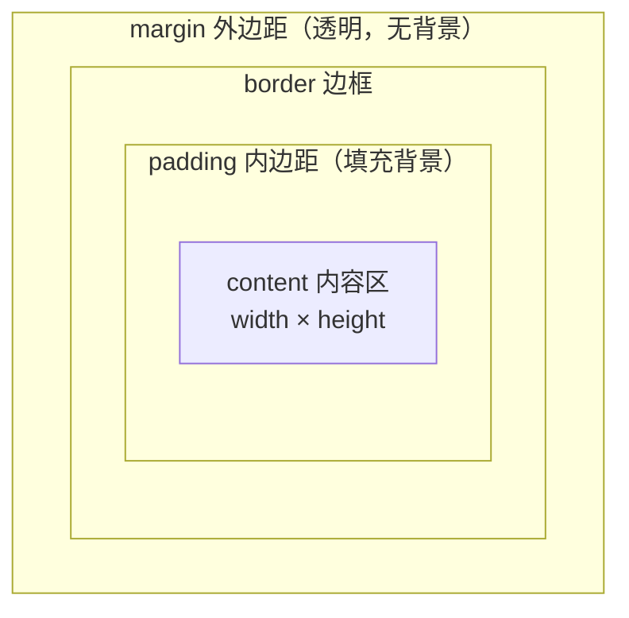
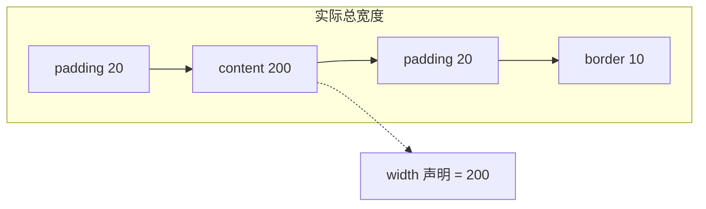
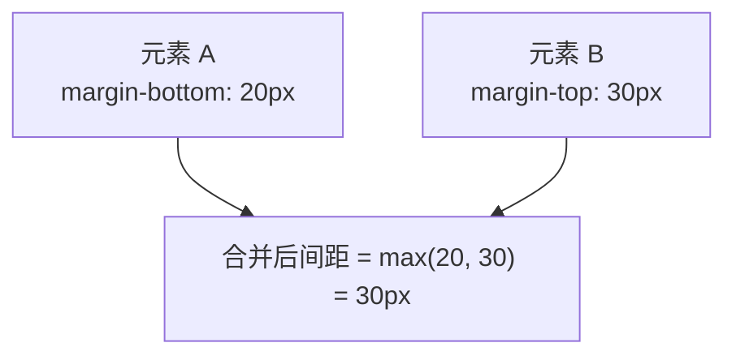

# 盒子模型详解

盒子模型是 CSS 布局的**基石**。理解它，才能理解元素为什么比预期宽、外边距为什么「合并」、`box-sizing` 为什么能救命。

## 一、盒子的四层结构

每个元素都是一个盒子，从内到外四层：



```css
.box {
  width: 200px;        /* 内容区宽度 */
  height: 100px;
  padding: 20px;       /* 内边距 */
  border: 10px solid #333;   /* 边框 */
  margin: 30px;        /* 外边距 */
}
```

## 二、标准盒模型 vs 怪异盒模型（box-sizing）

这是**最容易踩的坑**，也是最实用的知识点。

### 标准盒模型（默认 `content-box`）

`width` 只指**内容区**的宽度，`padding` 和 `border` 是**额外加上去**的：



```css
.box {
  box-sizing: content-box;   /* 默认值 */
  width: 200px;
  padding: 20px;
  border: 10px solid #333;
}
/* 实际渲染宽度 = 200 + 20*2 + 10*2 = 260px */
```

> 你以为盒子宽 200px，实际是 260px——**这就是布局「莫名变宽」的元凶**。

### 怪异盒模型（`border-box`）

`width` 指**从 border 到 border 的总宽度**，`padding` 和 `border` 都**包含在内**，内容区自动收缩：

```css
.box {
  box-sizing: border-box;
  width: 200px;
  padding: 20px;
  border: 10px solid #333;
}
/* 实际渲染宽度 = 200px（含 padding 和 border），内容区只有 140px */
```

**几乎所有现代项目都会全局开启 `border-box`**，因为它更符合直觉：

```css
/* 业界通行的全局设置 */
*,
*::before,
*::after {
  box-sizing: border-box;
}
```

对比总结：

| | `content-box`（默认） | `border-box`（推荐） |
| --- | --- | --- |
| `width` 含义 | 仅内容区 | 含 padding + border |
| 实际宽度 | `width + padding + border` | 就是 `width` |
| 加 padding 后 | 盒子变大，可能撑破布局 | 盒子不变，内容区收缩 |
| 使用场景 | 少数需要精确内容尺寸时 | 绝大多数布局 |

## 三、padding 与 margin 的取值

### padding：内边距

背景色会填充到 padding 区域，所以常用于**扩大可点击区域**：

```css
.btn {
  padding: 10px 20px;   /* 上下 10px，左右 20px */
}
/* 简写规则（和 margin 完全一致） */
padding: 10px;              /* 四边都是 10px */
padding: 10px 20px;         /* 上下 10px，左右 20px */
padding: 10px 20px 30px;    /* 上 10，左右 20，下 30 */
padding: 10px 20px 30px 40px; /* 上 右 下 左（顺时针） */
```

### margin：外边距

背景不填充，用于拉开元素间距。**支持负值**（可用于制造重叠或微调位置），也支持 `auto`（用于水平居中）：

```css
.box {
  margin: 0 auto;      /* 上下 0，左右 auto → 水平居中 */
}
```

## 四、外边距合并（Margin Collapse）

这是一个隐蔽但高频的坑：**相邻的垂直外边距会合并成一个，取较大值**（不是相加）。



三种触发场景：

```css
/* 1. 相邻兄弟元素 */
.first  { margin-bottom: 20px; }
.second { margin-top: 30px; }
/* 两者间距是 30px，不是 50px */

/* 2. 父子元素：父没有 border/padding 时，子的 margin-top 会「穿透」到父 */
.parent { }
.child  { margin-top: 40px; }
/* 结果父子一起往下移 40px，而不是子相对父下移 */

/* 3. 空元素自身的上下 margin 合并 */
```

**常见解决办法**（给父元素制造隔离，或改布局）：

```css
/* 方法一：给父元素加 border 或 padding */
.parent { padding: 1px; }

/* 方法二：触发 BFC（块级格式化上下文） */
.parent { overflow: hidden; }

/* 方法三：改用 Flex/Grid 布局（子项 margin 不合并） */
.parent { display: flex; }
```

> 只有**垂直方向**会合并，水平方向（左右 margin）**从不合并**。Flex/Grid 容器的子项之间也不合并。

## 五、width / height 与百分比

- `width: 100%` 是**相对父元素内容区**的百分比（父是 `border-box` 时注意差异）。
- `height: 100%` 要生效，**父元素必须有明确高度**，否则会塌陷为 0。这是「`height: 100%` 不生效」的常见原因。
- `min-width` / `max-width` 常用于响应式：`max-width: 100%` 让图片不溢出容器。

```css
img {
  max-width: 100%;    /* 图片不超容器，缩放不放大 */
  height: auto;
}
```

## 六、display 与盒子的关系

`display` 决定了元素生成**哪种盒子**，进而影响盒模型的表现：

| display | 盒子类型 | 特点 |
| --- | --- | --- |
| `block` | 块级盒 | 独占一行，可设宽高，`margin` 全方向生效 |
| `inline` | 行内盒 | 不换行，**宽高和上下 margin/padding 不生效** |
| `inline-block` | 行内块盒 | 不换行，但**可设宽高**，保留行内布局 |
| `none` | 不生成盒 | 元素完全移除，不占空间 |
| `flex` / `grid` | 弹性/网格容器 | 子项按弹性/网格规则排列 |

```css
/* inline 元素无法设宽高，但 inline-block 可以 */
span { display: inline-block; width: 100px; height: 40px; }
```

> `visibility: hidden` 与 `display: none` 的区别：前者**占位但不显示**，后者**不占位**。隐藏按钮保留布局用前者，彻底移除用后者。

## 小结

- 盒子四层：**content → padding → border → margin**，背景填充到 padding。
- `box-sizing: border-box` 让 `width` 包含 padding/border，**全局开启是行业标准**。
- 垂直方向相邻 `margin` 会**合并取大值**，用 BFC、border/padding 或 Flex/Grid 规避。
- `height: 100%` 需要父元素有明确高度。
- `display` 决定盒子类型，`inline` 不认宽高，`inline-block` 认。
