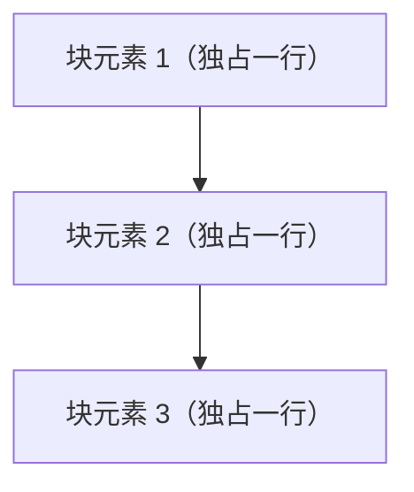
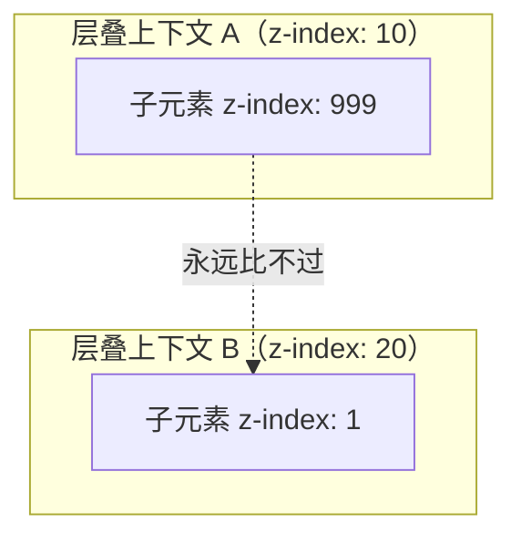

# 定位与文档流

理解「文档流」和 `position`，是控制元素位置的关键。这一章讲清元素默认如何排列，以及如何「脱离文档流」自由定位。

## 一、文档流（Normal Flow）

默认情况下，块级元素**自上而下**排列，行内元素**从左到右**排列，这就是「文档流」。元素按书写顺序自然堆叠，各占其位。



`float`（浮动）和 `position: absolute/fixed` 会让元素**脱离文档流**，此时其他元素会「当它不存在」而占据它原来的位置。

## 二、position 五种取值

```css
position: static | relative | absolute | fixed | sticky;
```

### 1. static（默认）

元素处于正常文档流，`top/left/right/bottom` 和 `z-index` **均不生效**。

### 2. relative（相对定位）

元素**仍在文档流中占位**，但可相对**自己原本的位置**偏移，原位置保留空白：

```css
.box {
  position: relative;
  top: 10px;    /* 相对原位置向下移 10px，原位置留空 */
  left: 20px;
}
```

> `relative` 最常用的场景不是自己移动，而是**给 `absolute` 子元素当「定位锚点」**。

### 3. absolute（绝对定位）

元素**脱离文档流**，不占位，相对**最近的已定位祖先**（`position` 非 `static` 的祖先）定位；若没有，则相对 `<html>` 根元素。

```css
.wrapper {
  position: relative;   /* 锚点 */
}
.badge {
  position: absolute;
  top: 0;
  right: 0;   /* 相对 wrapper 右上角定位 */
}
```

### 4. fixed（固定定位）

相对**视口（浏览器窗口）**定位，滚动也不动，常用于吸顶导航、回到顶部按钮、弹窗遮罩：

```css
.navbar {
  position: fixed;
  top: 0;
  left: 0;
  width: 100%;
}
```

> 注意：若某个祖先设置了 `transform`、`filter`、`perspective` 等属性，`fixed` 会**改为相对该祖先定位**，这是常见的「fixed 失效」陷阱。

### 5. sticky（粘性定位）

元素在滚动到阈值前**像 relative**，超过阈值后**像 fixed 粘住**，常用于吸顶表头：

```css
.thead {
  position: sticky;
  top: 0;   /* 滚动到距顶部 0 时粘住 */
}
```

`sticky` 生效需要两个条件：① 设置了 `top/left` 等阈值；② 父容器足够高（否则没有滚动空间，粘不住）。

## 三、定位总结对比

| 取值 | 是否脱离文档流 | 定位参考 | 典型用途 |
| --- | --- | --- | --- |
| `static` | 否 | 文档流 | 默认 |
| `relative` | 否（保留占位） | 自己原位置 | 做 absolute 的锚点 |
| `absolute` | 是 | 最近的已定位祖先 | 角标、下拉、气泡 |
| `fixed` | 是 | 视口 | 吸顶、回顶、遮罩 |
| `sticky` | 否（粘住时视觉脱离） | 滚动容器 | 吸顶表头、侧边栏 |

## 四、z-index 与层叠上下文

定位元素会「浮起来」，可能互相重叠。`z-index` 控制**同级定位元素**的上下顺序：

```css
.a { position: absolute; z-index: 2; }   /* 在上层 */
.b { position: absolute; z-index: 1; }   /* 在下层 */
```

规则：

- `z-index` 只对**定位元素**（或 flex/grid 子项）生效，`static` 元素无效。
- 数值越大越靠上；相同值时**后写的在上**。
- 一个设置了 `z-index` 的定位元素会创建「层叠上下文」，其内部子元素的 z-index 只在**该上下文内部**比较，不会和外部元素比。



> 上面例子中，虽然 A 的子元素 z-index 是 999，但它**困在 A 的上下文里**，整体在 B（z-index 20）之下。理解「层叠上下文隔离」能解释很多「z-index 设很大却没用」的现象。

创建层叠上下文的常见方式：`position` + `z-index`（非 auto）、`opacity < 1`、`transform`、`filter`、`will-change` 等。

## 五、float 与清除浮动

`float` 是老牌布局方式（如今已被 Flex/Grid 取代，但遗留代码和图文混排仍会用到）：

```css
img {
  float: left;      /* 图片左浮动，文字环绕 */
  margin-right: 12px;
}
```

浮动元素脱离文档流，会导致**父容器高度塌陷**（父不包裹浮动的子元素）。解决办法是「清除浮动」：

```css
/* 经典 clearfix 技巧 */
.clearfix::after {
  content: "";
  display: block;
  clear: both;
}
```

现代更简洁的做法：给父元素设 `overflow: hidden` 或 `display: flow-root`（BFC 自动清除）。

## 小结

- 文档流是块级从上到下、行内从左到右的自然排列。
- `absolute`/`fixed` 脱离文档流；`relative` 保留占位；`sticky` 是两者的「滚动切换」。
- `absolute` 相对最近的**已定位祖先**，`fixed` 相对视口（但会被祖先 `transform` 劫持）。
- `z-index` 只在定位元素（及 flex/grid 子项）上生效，且受「层叠上下文」隔离。
- 浮动会让父容器高度塌陷，用 clearfix 或 BFC 清除。
