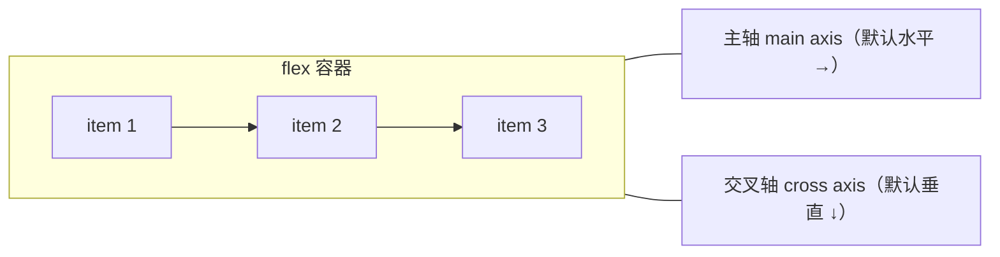
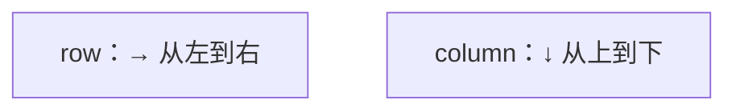
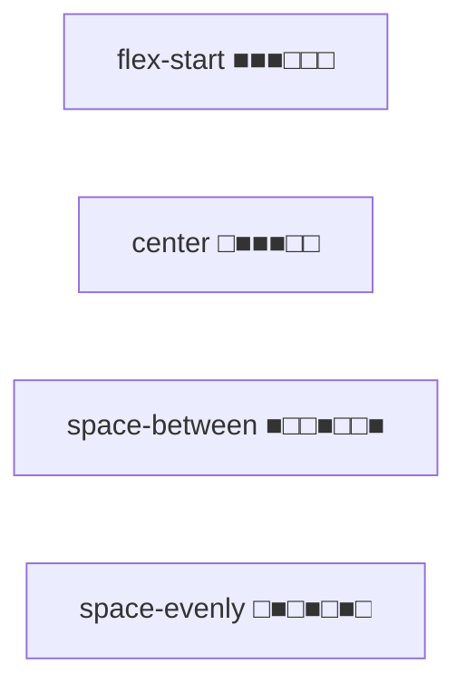

# Flex 布局详解

Flex（弹性布局）是现代**一维布局**的主力，能轻松实现水平/垂直居中、等分布局、自适应伸缩，是前端面试和日常开发都绕不开的核心技能。

## 一、核心概念：主轴与交叉轴

Flex 把容器分成**两根轴**：



- **主轴（main axis）**：项目排列的方向，由 `flex-direction` 决定（默认水平向右）。
- **交叉轴（cross axis）**：垂直于主轴的方向。
- 一个元素设 `display: flex` 后，它成为**容器（container）**，直接子元素成为**项目（item）**。

```css
.container {
  display: flex;          /* 块级 flex 容器 */
  /* display: inline-flex;  行内 flex 容器 */
}
```

> 开启 Flex 后，子项的 `float`、`clear`、`vertical-align` 全部失效。

## 二、容器的六个属性

### 1. flex-direction：主轴方向

```css
.container {
  flex-direction: row;            /* 默认，主轴水平向右 */
  /* row-reverse：水平向左（反向） */
  /* column：垂直向下 */
  /* column-reverse：垂直向上 */
}
```



### 2. flex-wrap：是否换行

```css
.container {
  flex-wrap: nowrap;      /* 默认，不换行（会压缩项目） */
  /* wrap：换行，第一行在上 */
  /* wrap-reverse：换行，第一行在下 */
}
```

`nowrap` 时项目过多会被压缩，`wrap` 时超出的项目换到下一行。

### 3. flex-flow：前两者的简写

```css
.container {
  flex-flow: row wrap;    /* flex-direction + flex-wrap */
}
```

### 4. justify-content：主轴对齐

控制项目在**主轴**上的分布（默认从左到右）：

```css
.container {
  justify-content: flex-start;      /* 默认，起点对齐 */
  /* flex-end：终点对齐 */
  /* center：居中 */
  /* space-between：两端对齐，中间均分 */
  /* space-around：每个项目两侧间距相等 */
  /* space-evenly：所有间距完全相等 */
}
```



### 5. align-items：交叉轴对齐

控制项目在**交叉轴**上的对齐（默认拉伸）：

```css
.container {
  align-items: stretch;     /* 默认，拉伸填满交叉轴 */
  /* flex-start：交叉轴起点对齐 */
  /* center：交叉轴居中（垂直居中神器） */
  /* flex-end：交叉轴终点对齐 */
  /* baseline：文字基线对齐 */
}
```

### 6. align-content：多行交叉轴对齐

只有 `flex-wrap: wrap` 且有多行时生效，控制**行与行之间**在交叉轴的分布：

```css
.container {
  flex-wrap: wrap;
  align-content: space-between;   /* 行之间两端对齐 */
  /* 取值同 justify-content + stretch */
}
```

## 三、项目的属性

### 1. flex：增长、收缩、基准的简写

这是 Flex 的**灵魂属性**，控制项目如何分配剩余空间或收缩：

```css
.item {
  flex: 1;              /* flex: 1 1 0% 的简写 */
  /* 完整写法：flex-grow flex-shrink flex-basis */
  flex: 1 0 auto;       /* grow=1, shrink=0, basis=auto */
}
```

三个子属性：

- **flex-grow**（放大比例）：有剩余空间时，按比例瓜分。默认 0（不放大）。
- **flex-shrink**（缩小比例）：空间不足时，按比例收缩。默认 1（会收缩）。
- **flex-basis**（基准尺寸）：分配空间前项目的初始大小。默认 `auto`。

```css
/* 等分三列（经典用法） */
.col { flex: 1; }        /* 三个都 flex:1，剩余空间三等分 */

/* 左侧固定、右侧自适应 */
.sidebar { flex: 0 0 200px; }   /* 不放大不缩小，固定 200px */
.main    { flex: 1; }            /* 占满剩余空间 */
```

> `flex: 1` 等价 `flex: 1 1 0%`，`flex: auto` 等价 `flex: 1 1 auto`。两者在分配剩余空间时几乎等价，但基准不同（0% vs auto），在含内容宽度时表现略有差异。

### 2. align-self：单独覆盖对齐

覆盖容器 `align-items`，让某个项目单独对齐：

```css
.item-special {
  align-self: center;    /* 其他项目顶部对齐，它居中 */
}
```

### 3. order：排列顺序

数值越小越靠前（默认 0），可用于不改变 DOM 的情况下调整显示顺序：

```css
.first { order: -1; }    /* 排到最前 */
```

## 四、经典布局实战

### 1. 水平垂直居中（最常用）

```css
.center {
  display: flex;
  justify-content: center;   /* 主轴（水平）居中 */
  align-items: center;       /* 交叉轴（垂直）居中 */
}
```

这一句解决了 CSS 历史难题——`margin: auto` 只能水平居中，Flex 的 `align-items: center` 补上了垂直方向。

### 2. 左侧固定、右侧自适应

```css
.layout {
  display: flex;
}
.layout .sidebar {
  flex: 0 0 240px;    /* 固定 240px */
}
.layout .main {
  flex: 1;             /* 占满剩余 */
}
```

### 3. 圣杯/双飞翼式三栏

```css
.layout {
  display: flex;
}
.layout .left,
.layout .right {
  flex: 0 0 200px;
}
.layout .center {
  flex: 1;
  order: 2;            /* 中间列排到视觉中间 */
}
.layout .left  { order: 1; }
.layout .right { order: 3; }
```

### 4. 等宽卡片流（自动换行）

```css
.card-grid {
  display: flex;
  flex-wrap: wrap;
  gap: 16px;           /* gap 控制间距，比 margin 更优雅 */
}
.card-grid .card {
  flex: 1 1 200px;     /* 基准 200px，可放大缩小 */
}
```

### 5. 底部对齐（footer 贴底）

```css
.page {
  display: flex;
  flex-direction: column;
  min-height: 100vh;
}
.page .content {
  flex: 1;             /* 内容撑满，footer 被推到最底 */
}
```

## 五、gap 与常见坑

### gap：统一间距

`gap` 是 Flex 项目间距的现代写法，替代了「给每个项目加 margin 再处理首尾」的老办法：

```css
.container {
  display: flex;
  gap: 20px;           /* 行和列间距都是 20px */
  /* gap: 20px 10px;  行间距 20，列间距 10 */
}
```

### 常见坑

1. **`justify-content` 和 `align-items` 记混**：前者是**主轴**，后者是**交叉轴**。主轴方向会随 `flex-direction` 改变，所以「水平居中」在 `row` 下用 `justify-content`，在 `column` 下要用 `align-items`。
2. **`flex: 1` 不生效**：多半是容器没有设 `display: flex`，或项目是容器**非直接子元素**。
3. **`flex-basis` 与 `width` 冲突**：`flex-basis` 优先于 `width`，设了 `flex-basis` 就别再纠结 `width`。
4. **`nowrap` 导致内容溢出**：忘了设 `flex-wrap: wrap` 或 `min-width: 0`（长文本/图片会撑破 flex 项目）。

## 小结

- 核心是**主轴 + 交叉轴**，`flex-direction` 决定主轴方向。
- 容器 6 属性：`flex-direction`、`flex-wrap`、`flex-flow`、`justify-content`（主轴）、`align-items`（交叉轴）、`align-content`（多行交叉轴）。
- 项目属性：`flex`（grow/shrink/basis）、`align-self`、`order`。
- 记忆：**justify 管主轴，align 管交叉轴**。
- 常用实战：水平垂直居中、左固定右自适应、三栏布局、等宽卡片流、底部对齐。
