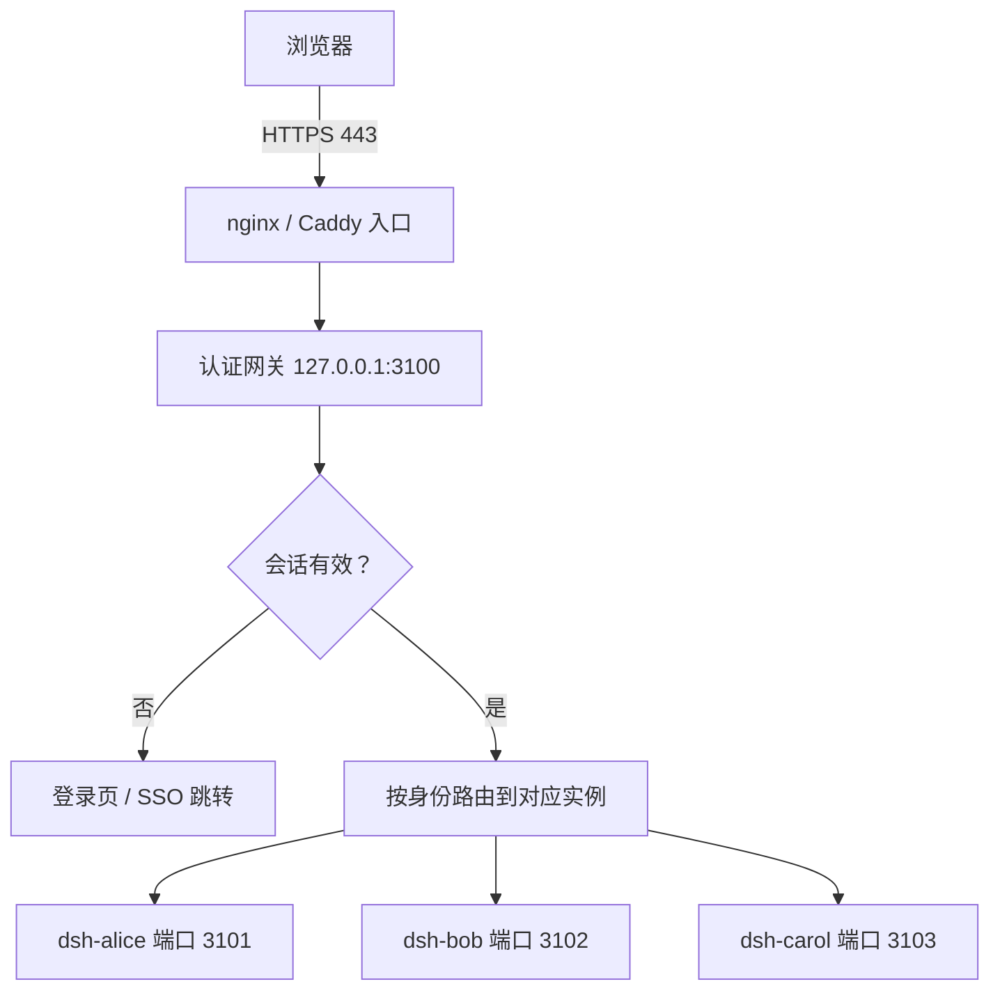

# 多用户部署与密码认证

dsh 是一个**能读写文件、能执行 shell** 的 Agent——把它的 Web UI 直接暴露出去，等价于把服务器交出去。它默认只监听 `127.0.0.1` 且**没有登录功能**，所以要让它从「只在我这台机器上跑」变成「团队通过浏览器各自登录」，必须自己补上两层：

- **认证**：谁能进来；
- **隔离**：进来之后，他只能看见自己的会话、文件、模型凭据。

这两件事经常被混为一谈。只做认证不做隔离，等于给所有人发同一把钥匙。



## 四个硬约束 {#constraints}

任何方案都要先接受这四条事实，否则会在实现到一半时推倒重来。

**约束一：Web UI 只监听回环，且明确拒绝绑定所有网卡。**

```bash
$ dsh --profile web --port 8080 --host 0.0.0.0
error: --host 0.0.0.0 is intentionally not supported yet for safety:
it would expose remote code execution to the network; use 127.0.0.1 instead
```

这不是 bug，是刻意设计——守卫写在 `node_modules/@deepseek-ai/dsh-web-app/lib/startup.js` 里。社区确有「改一行源码解禁」的做法，但那正是官方要防的事。**正解是前置反向代理**，让 dsh 继续只听回环。

**约束二：官方版没有内置登录。** 社区插件 `dsh-webui-auth` 提供的是「首次访问设一个密码」——单账号，所有人共用身份，不构成多用户。

**约束三：特权接口逐字校验 Host。** `settings` / `credentials` / `agentPreset` 这类接口有 browser-trust fence，且 Host 是**逐字比对**：`myhost` 与 `myhost.example.com` 不是一回事。漏配的典型症状是**页面壳能开，但所有 `/api/*` 返回 403**，会话列表和模型选择永远是空的。

**约束四：必须走 HTTPS。** 只有 HTTPS、`localhost`、`file://` 属于浏览器的安全上下文。用 `http://内网IP:3080` 访问时 Web Crypto 会被禁用，页面直接白屏并报 `crypto.randomUUID is not a function`。临时办法是浏览器 flag 放行，正式方案是配证书（自签也行）。

| 约束 | 应对 |
| --- | --- |
| 只监听回环、拒绝 `0.0.0.0` | 前置反向代理，端口永不对外 |
| 无内置登录 | 认证网关，或前置 SSO |
| 特权接口校验 Host/Origin | 网关把上游 `Host` 改写成回环地址 + 配好 `trustedHosts` |
| 必须走 HTTPS | 非安全上下文下 Web Crypto 被禁用，页面白屏 |

## 认证 ≠ 隔离：五个问题 {#five-questions}

「多用户密码认证访问」这句话里藏着五件事，只回答第一件就会在真实使用中翻车：

| # | 问题 | 只做密码认证的后果 |
| --- | --- | --- |
| 1 | 谁能进来 | — |
| 2 | 进来之后他是谁 | 所有人共享一个身份，操作无法归属 |
| 3 | 他只能看到自己的会话与文件吗 | 互相看到代码、对话历史、生成物 |
| 4 | 他只能用自己那份模型凭据吗 | 共用一把 API Key，账单无法分摊，泄露无处追责 |
| 5 | 他跑不动时会拖垮别人吗 | 一个人跑满 CPU/内存，全员卡死 |

**核心结论：第 1 件是认证，第 2~5 件是隔离。隔离边界必须落在操作系统（进程、文件、网络、资源），而不是落在网关代码里的一堆 `if`。网关可能被绕过，内核不会。**

## 路线与选型：四条基础 + 一条叠加 {#routes}

**A~D 是互斥的基础路线，选一条；E 是叠加层，可以加在任何一条之上**（所以表格是五行，但真正做选型时只从 A~D 里挑一个）。

| 路线 | 做法 | 认证 | 运行时 | 成本 |
| --- | --- | --- | --- | --- |
| **A 单密码反代** | 在 dsh 前面套一层密码 | 单一共享密码 | 单个 dsh 进程 | 10 分钟 |
| **B 裸机多用户** | 系统账号 + 认证网关 + 每用户一个 systemd 实例 | 每人一账号 | 每用户独立进程与账号 | 半天 |
| **C 单容器多用户** | 容器内建多个 Linux 用户，各自一个 dsh 进程 | 每人一账号 | 每用户独立容器内 uid | 半天 |
| **D 一用户一容器** | 网关容器 + 每用户一个容器 | 每人一账号 | 每用户独立容器 | 半天到一天 |
| **E 叠加 SSO** | 在 B/C/D 前面再挂一层统一身份 | 组织级单点登录 | 同被叠加的方案 | 1~2 天 |

隔离强度对照（★ 越多越强，— 表示没有）：

| 隔离维度 | A 单密码 | B 裸机多用户 | C 单容器多用户 | D 一用户一容器 |
| --- | --- | --- | --- | --- |
| 会话/文件隔离 | — | ★★★ | ★★★ | ★★★ |
| 模型凭据隔离 | — | ★★★ | ★★★ | ★★★ |
| 进程隔离 | — | ★★★ | ★★ | ★★★ |
| 网络隔离（防互访端口） | — | ★★★ | ★★ | ★★ |
| 资源配额 | — | ★★★ | ★ | ★★★ |
| 故障域 | 全员一起挂 | ★★★ | ★ | ★★★ |

```text
需要几个人用？
├─ ≤3 人且完全互信，只是别被外人扫到
│    → 路线 A（Caddy/nginx 单密码，10 分钟）
└─ ≥4 人，或需要区分身份、账单、数据
     │
     └─ 有 Docker 且希望环境可复现吗？
        ├─ 否 → 路线 B（隔离与配额最强，运维靠 systemd）
        └─ 是
           │
           └─ 能接受「整体重启 / 单人跑满影响他人」吗？
              ├─ 能   → 路线 C（务必补配额 + 回环隔离）
              └─ 不能 → 路线 D（容器化路线的推荐默认）
```

这是 A~D 的选型。E 是叠加层，单独判断、与前四项不冲突：

```text
组织已有统一身份（Keycloak / LDAP / 企业微信）吗？
└─ 有 → 在 A~D 选出的任何一条前面，再叠加路线 E
```

> [!TIP]
> **只有 ≤3 人且完全互信时才用路线 A。** dsh 是能读写文件、能跑 shell 的 Agent，共用运行时等于共用服务器权限——工作区里的 `.credentials.yaml` 谁都能读到。

## 认证网关：所有路线共用的那一层 {#gateway}

网关是唯一需要自己写代码的部分，用 Node 标准库约 400 行即可，零依赖。本章不铺开全部代码，只给出**最关键、也最容易写错的三段**：会话签名、CSRF、上游 Host 改写。剩下的路由转发、登录页渲染、用户表读写按常规 HTTP 服务写法补全即可。

### 会话：为什么不做服务端会话表

会话 Cookie 只需 signed 三个字段：`uid`（谁）、`exp`（何时过期）、`pwdVer`（口令版本号）。做法是整段 JSON 先 base64url 编码得到 `<payload>`，再用 HMAC-SHA256 签出 `<mac>`：

```js
function sign(uid, exp, pwdVer) {
  const payload = Buffer.from(JSON.stringify({ uid, exp, pwdVer })).toString('base64url');
  const mac = crypto.createHmac('sha256', SECRET).update(payload).digest('base64url');
  return `${payload}.${mac}`;   // Cookie: dsh_sid=<payload>.<mac>，HttpOnly + Secure + SameSite=Lax
}
```

最终 Cookie 的完整形态是 `dsh_sid=eyJ1aWQiOi...（base64url 的 JSON）.cGFj...（HMAC）`——**注意点号分隔的是「载荷」和「签名」这两段，不是 `uid.exp.pwdVer` 三个字段**。验签时先按最后一个点切开，再对左半边重算 HMAC 并用 `timingSafeEqual` 比对。

三个设计点：

1. **改密即踢下线**：改密时把 `pwdVer` 加一，所有旧 Cookie 立刻对不上。不需要服务端会话表，也不需要 Redis。
2. **载荷编码存放**：签名覆盖原文，但 Cookie 里不出现明文用户名，避免用户名随 Cookie 落进访问日志。
3. **禁用账号即时生效**：每次请求回查用户表（按 mtime 缓存），`enabled: false` 立即拒绝。

### 口令、防枚举与 CSRF

- 口令用 `scrypt(N=131072, r=8, p=1)` 保存，格式 `scrypt$N$r$p$salt$hash`，比对用 `timingSafeEqual`。参数取 OWASP 首选档：N=2^17 时每 hash 约 128MiB 内存硬度。**不要为了省内存把 N 降到 2^14 却只配 p=1**——OWASP 的最低一档要求 N=2^14 配 p=5，p=1 只在 N=2^17 时才达标，降配后抗 GPU 能力会大幅缩水。
- **账号不存在时也做一次等价开销的散列**，抹平响应时间差，避免被用来枚举账号。
- 限流做 **IP 维度 + 账号维度**两套。账号维度锁定可被恶意用来做 DoS，必须配合 IP 限流与强口令。
- CSRF 用**双提交 Cookie**：登录页下发 `dsh_csrf`，表单带同值隐藏域。**登出只接受 `POST` 且必须带 CSRF**，否则攻击者能构造跨站请求把你登出。

### 上游 Host / Origin 改写（那个 403 的根因）

转发时统一做三件事：

```js
headers.host = `127.0.0.1:${user.port}`;      // 上游 Host 固定为回环地址
delete headers['x-dsh-remote'];               // 剥掉浏览器可能带来的信任标记
headers['x-forwarded-for'] = clientIp(req);   // 用可信来源重写，不透传浏览器的值
```

再给实例配上 `DSH_TRUSTED_HOSTS=127.0.0.1,127.0.0.1:3101,dsh.example.com`。

> [!IMPORTANT]
> 反向代理必须**覆盖**而不是**追加** `X-Forwarded-For`（nginx 写 `$remote_addr`）。否则攻击者自带一个 XFF 头就能伪造来源 IP，直接绕过网关的 IP 限流。

## 路线 A：单密码反代 {#route-a}

```caddyfile
# Caddy：自动 HTTPS，最省事
dsh.example.com {
    basic_auth {
        alice $2a$14$REPLACE_WITH_BCRYPT_HASH   # caddy hash-password --plaintext '密码'
    }
    reverse_proxy 127.0.0.1:3080
}
```

```nginx
# 放在 http{} 里，用于区分「普通请求」与「要升级成 WebSocket 的请求」
map $http_upgrade $connection_upgrade {
    default upgrade;
    ''      close;
}

server {
    location / {
        auth_basic           "DeepSeek Harness";
        auth_basic_user_file /etc/nginx/.htpasswd;
        proxy_pass http://127.0.0.1:3080;
        proxy_http_version 1.1;
        proxy_set_header Host 127.0.0.1:3080;   # 关键：改写 Host，否则特权接口 403
        proxy_buffering off;                    # 关键：关缓冲，否则流式回答「攒够了才出现」
        proxy_set_header X-Forwarded-For $remote_addr;

        # 关键：dsh 的会话通道是 WebSocket，缺这三行会连不上（表现为会话列表空白）
        proxy_set_header Upgrade    $http_upgrade;
        proxy_set_header Connection $connection_upgrade;
        proxy_read_timeout 3600s;               # 关键：默认 60s 会掐断空闲的 WS
    }
}
```

> [!NOTE]
> `proxy_buffering off` 不能省。开着响应缓冲时，Agent 的流式输出会攒成一大段才出现，看起来像「卡住了」。
>
> WebSocket 的三行同样不能省：dsh 用 WebSocket 维持会话通道，而 `Upgrade` 头**不会被 nginx 自动转发**——少了它，页面能打开但会话列表永远是空的，很容易被误判成后端故障。另外默认的 `proxy_read_timeout 60s` 会在 Agent 思考或长任务静默期间掐断连接，必须放宽。
>
> Caddy 不需要这些：`reverse_proxy` 原生支持 WebSocket 升级，上面的 Caddyfile 直接可用。

## 路线 B：每用户独立实例 {#route-b}

```text
nginx/Caddy(443) ──▶ 认证网关 127.0.0.1:3100
                        │
      ┌─────────────────┼─────────────────┐
      ▼                 ▼                 ▼
 dsh-user@alice    dsh-user@bob     dsh-user@carol    ← systemd 模板单元
 uid: dsh-alice    uid: dsh-bob     uid: dsh-carol
 /opt/deepseek-harness/users/<name>  (0700)
```

加一个用户要做四件事：建系统账号 → 分配端口（3101 起）→ 写实例环境文件 → 写用户表（`port`/`uid`/`pwdHash`/`pwdVer`/`enabled`）。下面把它封装成 `userctl`（**这个脚本要自己写，dsh 不提供**），下面给出 `userctl add` 的等价命令，照抄即可跑通：

```bash
# /usr/local/bin/userctl —— add 子命令的核心四步
NAME="$2"; PORT="$3"          # 用法：userctl add alice 3101

# ① 建系统账号，家目录即私有工作区
useradd -r -m -d "/opt/deepseek-harness/users/$NAME" -s /sbin/nologin "dsh-$NAME"
chmod 0700 "/opt/deepseek-harness/users/$NAME"

# ② 写实例环境文件（systemd 模板单元会读它）
cat > "/opt/deepseek-harness/instances/$NAME.env" <<EOF
PORT=$PORT
HOME=/opt/deepseek-harness/users/$NAME
DSH_HOME=/opt/deepseek-harness/users/$NAME
DSH_TRUSTED_HOSTS=127.0.0.1,127.0.0.1:$PORT,dsh.example.com
NODE_OPTIONS=--max-old-space-size=1024
EOF

# ③ 写用户表（网关按 mtime 缓存，改完立即生效）
#    {"alice":{"port":3101,"uid":"dsh-alice","pwdHash":"scrypt$...","pwdVer":1,"enabled":true}}
userctl-set-user "$NAME" "$PORT" "$(id -u "dsh-$NAME")"

# ④ 起实例
systemctl enable --now "dsh-user@$NAME"
systemctl is-active "dsh-user@$NAME"      # 应输出 active
```

> [!IMPORTANT]
> **第 ④ 步之后还要重跑一次回环隔离规则**（见下一章），否则新用户会带着未受保护的端口上线。这是「加人」最容易被漏掉的第五步——`userctl` 的最佳实践是把隔离脚本的调用也内置进去，避免靠人记。

```ini
# /etc/systemd/system/dsh-user@.service
[Unit]
Description=DeepSeek Harness instance for %i
After=network-online.target

[Service]
Type=simple
User=dsh-%i
EnvironmentFile=/opt/deepseek-harness/instances/%i.env
ExecStart=/usr/local/bin/dsh --profile web --port ${PORT}
Restart=on-failure
RestartSec=3

# 配额：让「一个人跑满」只影响他自己
MemoryMax=1.5G
MemoryHigh=1.2G
CPUQuota=50%
TasksMax=512

[Install]
WantedBy=multi-user.target
```

实例环境文件（由 `userctl` 生成）：

```bash
# /opt/deepseek-harness/instances/alice.env
PORT=3101
HOME=/opt/deepseek-harness/users/alice
DSH_HOME=/opt/deepseek-harness/users/alice
DSH_TRUSTED_HOSTS=127.0.0.1,127.0.0.1:3101,dsh.example.com
NODE_OPTIONS=--max-old-space-size=1024
```

> [!IMPORTANT]
> **`HOME` 与 `DSH_HOME` 必须同时指向该用户私有目录。** 只设一个会出现最经典的故障——「Agent 说它生成了文件，但用户在工作区里找不到」，因为文件写到了另一个家目录。

> [!NOTE]
> dsh 的启动参数名可能随版本变化，先用 `dsh --help` 对齐，再把参数集中到环境文件里，以后只改一处。

## 小结 {#summary}

认证与隔离是两件不同的事，必须分别回答。认证做在网关（或前置 SSO），隔离做在操作系统。路线 A 到 E 的选择依据是三件事：人数、有没有统一身份体系、能接受多强的故障与配额隔离。

下一章处理这套架构里最容易漏掉、也最容易在规模上炸掉的一环——**所有实例都监听回环，其实是假隔离**——以及扩到上千用户时的选型与容量规划。
