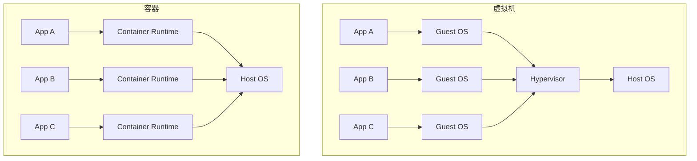
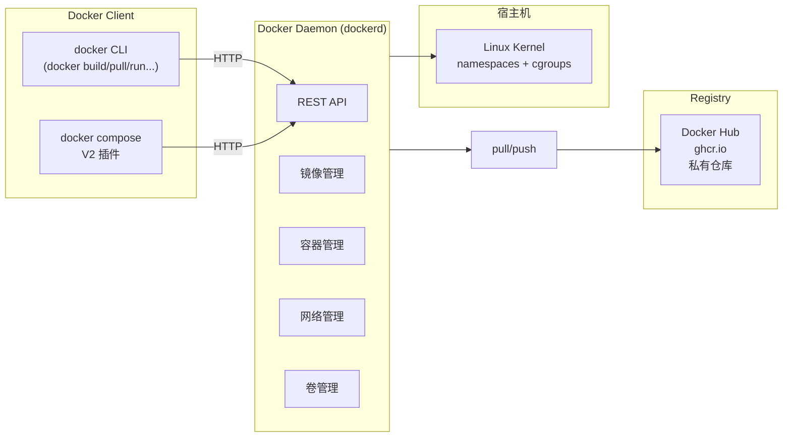

# Docker 概述与安装

本章先理解 Docker 解决什么问题、容器与传统虚拟机的差异，再讲解 Docker 引擎的整体架构，最后动手在 macOS / Linux / Windows 三大平台安装 Docker。

## 为什么需要 Docker {#why}

在没有容器化之前，应用的部署面临三大经典问题：

- **环境不一致**：开发用 macOS + Python 3.11，测试用 Linux + Python 3.9，生产用 CentOS 7 + Python 2.7，代码到处跑不起来。
- **依赖冲突**：项目 A 依赖 Node 14，项目 B 依赖 Node 18，操作系统只能装一个。
- **运维繁琐**：上线一台机器要手动装运行时、装依赖、配环境变量、配 Nginx，每台机器重复一遍。

Docker 用「**镜像**」这一标准化打包格式，把代码 + 运行时 + 系统库 + 配置全部封进一个文件里，配合「**容器**」这一轻量隔离运行时，做到：

- **一次构建，到处运行**：开发机、测试机、生产机、云服务器跑同一个镜像，行为完全一致。
- **秒级启动**：容器共享宿主机内核，没有虚拟机「启动操作系统」的开销。
- **资源利用率高**：相比传统虚拟机，容器密度可提升 5-10 倍。
- **可移植**：Dockerfile 即文档，任何能跑 Docker 的环境都能复现。

## 容器 vs 虚拟机 {#container-vs-vm}

二者都提供「隔离的运行环境」，但底层机制完全不同：



| 维度 | 虚拟机 | 容器 |
|------|--------|------|
| 隔离级别 | 硬件级（每台 VM 独立 OS） | 进程级（共享宿主机内核） |
| 启动时间 | 30 秒 - 几分钟 | 毫秒 - 秒 |
| 镜像体积 | GB 级（含完整 Guest OS） | MB 级（只含应用 + 依赖） |
| 性能损耗 | 5-15%（虚拟化层） | <2%（接近原生） |
| 密度 | 一台物理机跑 10-20 个 VM | 一台物理机跑 100-500 个容器 |
| 安全性 | 高（OS 级隔离） | 中（共享内核，逃逸风险需关注） |
| 适用场景 | 多 OS、强隔离、传统应用 | 微服务、CI/CD、云原生 |

## Docker 引擎架构 {#architecture}

Docker 引擎是 C/S 架构，由三大组件构成：



- **Docker Client**：用户交互入口，通过 REST API 与 daemon 通信。可以是 CLI、`docker compose`、CI 插件（如 GitHub Actions 的 docker/build-push-action）。
- **Docker Daemon（dockerd）**：常驻进程，负责管理镜像、容器、网络、卷等所有对象。
- **Registry**：镜像仓库，公开的有 Docker Hub、GitHub Container Registry；私有可以自建 Harbor。
- **底层**：通过 Linux 的 `namespaces`（进程/网络/挂载点隔离）和 `cgroups`（资源限制）实现容器隔离。

> ⚠️ Docker 在 macOS / Windows 上跑的不是原生 Linux 内核，而是通过一个轻量 Linux 虚拟机（Docker Desktop 用 Apple Virtualization Framework 或 Hyper-V）跑 daemon。所以你在 macOS 终端 `docker run` 时，CLI 通过 socket 把请求转发到那个 VM 里的 daemon。

## 安装 Docker {#install}

### macOS

```bash
# 方式一：Docker Desktop（推荐，图形化界面）
# 从 https://www.docker.com/products/docker-desktop/ 下载安装包
# 包含 docker CLI、dockerd、docker compose、Docker Scout

# 方式二：Homebrew（仅命令行工具，需自己安装 colima 等运行时）
brew install docker docker-compose colima
colima start
```

### Linux（以 Ubuntu 22.04 为例）

```bash
# 1. 卸载旧版本
sudo apt-get remove docker docker-engine docker.io containerd runc

# 2. 添加 Docker 官方仓库
sudo apt-get update
sudo apt-get install ca-certificates curl gnupg
sudo install -m 0755 -d /etc/apt/keyrings
curl -fsSL https://download.docker.com/linux/ubuntu/gpg | \
  sudo gpg --dearmor -o /etc/apt/keyrings/docker.gpg
sudo chmod a+r /etc/apt/keyrings/docker.gpg

echo \
  "deb [arch=$(dpkg --print-architecture) signed-by=/etc/apt/keyrings/docker.gpg] \
  https://download.docker.com/linux/ubuntu \
  $(. /etc/os-release && echo "$VERSION_CODENAME") stable" | \
  sudo tee /etc/apt/sources.list.d/docker.list > /dev/null

sudo apt-get update

# 3. 安装最新版本
sudo apt-get install docker-ce docker-ce-cli containerd.io \
  docker-buildx-plugin docker-compose-plugin

# 4. 把当前用户加入 docker 组（免 sudo）
sudo usermod -aG docker $USER
newgrp docker                          # 立即生效，或重新登录

# 5. 验证
docker --version
docker run hello-world
```

### Windows

Docker Desktop for Windows 要求：

- Windows 10/11 专业版或企业版（开启 Hyper-V 或 WSL 2）
- 安装 WSL 2：`wsl --install`
- 下载 Docker Desktop Installer 并运行
- 安装完后重启

> Windows 上推荐使用 WSL 2 后端（性能接近 Linux 原生），不要用旧的 Hyper-V 后端。

## 配置镜像加速器 {#registry-mirror}

国内拉取 Docker Hub 镜像经常超时，需要配置镜像加速：

```bash
# 编辑 /etc/docker/daemon.json（Linux）
sudo mkdir -p /etc/docker
sudo tee /etc/docker/daemon.json <<-'EOF'
{
  "registry-mirrors": [
    "https://docker.m.daocloud.io",
    "https://dockerproxy.com",
    "https://docker.mirrors.ustc.edu.cn",
    "https://hub-mirror.c.163.com"
  ],
  "max-concurrent-downloads": 10,
  "log-driver": "json-file",
  "log-opts": {
    "max-size": "100m",
    "max-file": "3"
  }
}
EOF

sudo systemctl daemon-reload
sudo systemctl restart docker

# 验证是否生效
docker info | grep -A 5 "Registry Mirrors"
```

macOS / Windows 在 Docker Desktop → Settings → Docker Engine 里修改同样配置。

## 验证安装 {#verify}

```bash
# 查看版本
docker --version
# Docker version 26.1.0, build 9714adb

# 查看系统信息（确认镜像加速器、存储驱动等）
docker info

# 运行第一个容器
docker run hello-world
# 看不到镜像会自动从 Docker Hub 拉取，看到「Hello from Docker!」即成功

# 查看刚才拉取的镜像与容器
docker images
docker ps -a
```

## Docker Desktop vs Docker Engine

| 项目 | Docker Desktop | Docker Engine（仅 CLI + daemon） |
|------|----------------|----------------------------------|
| 价格 | 商业使用需付费（个人 / 教育免费） | 完全免费 |
| 适用 | 开发机、本地多容器测试 | 服务器、生产环境 |
| 包含 | CLI + daemon + Compose + Kubernetes + Scout | 仅 daemon + CLI，需自装 Compose |
| 安装 | 一键安装包 | 包管理器 |

> 服务器上**不要**装 Docker Desktop，那是给本地开发用的。生产服务器装 Docker Engine + docker-compose-plugin 即可。

## 常用概念速览 {#concepts}

| 术语 | 含义 | 类比 |
|------|------|------|
| 镜像（Image） | 只读模板，包含应用代码 + 运行时 + 依赖 | 类的定义 / ISO 文件 |
| 容器（Container） | 镜像的运行实例 | 类的实例 / 启动后的进程 |
| 仓库（Repository） | 同名镜像的不同版本集合 | Git 仓库 |
| 标签（Tag） | 镜像的版本标识，如 `nginx:1.27` | Git tag |
| 镜像层（Layer） | 镜像由多层只读层叠加而成 | Git commit 链 |
| 卷（Volume） | Docker 管理的持久化存储 | 外部硬盘 |
| 网络（Network） | 容器间通信的虚拟网络 | 交换机 |
| Dockerfile | 构建镜像的脚本 | Makefile |
| Compose | 多容器编排文件 | docker run 的 YAML 版本 |

## 小结 {#summary}

Docker 用镜像 + 容器解决了「环境不一致」这一运维难题，相比虚拟机更轻量、更快、资源利用率更高。Docker 引擎由 Client / Daemon / Registry 三部分组成，底层依赖 Linux 内核的 namespaces 和 cgroups 实现隔离。下一章开始动手学最常用的容器与镜像命令。
