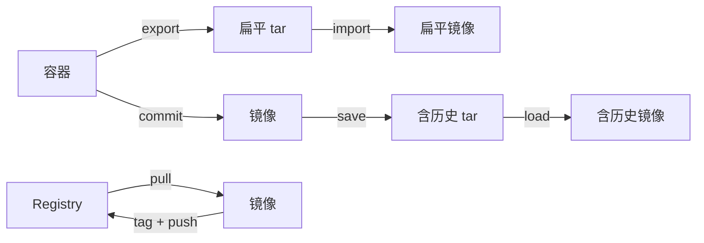

# 镜像构建与导入导出

镜像（Image）是 Docker 的核心交付物。本章先讲解如何构建自定义镜像（Dockerfile + commit 两种方式），再系统对比**四种镜像迁移手段**（`commit` / `import` / `export` / `save`），最后讲清如何与 Registry 交互，以及镜像瘦身的实战技巧。

## Dockerfile 与构建 {#dockerfile}

### 一个最简单的 Dockerfile

```dockerfile
# 基础镜像
FROM node:20-alpine

# 工作目录
WORKDIR /app

# 复制依赖文件先安装（利用层缓存）
COPY package*.json ./
RUN npm ci --only=production

# 复制源码
COPY . .

# 暴露端口
EXPOSE 3000

# 启动命令
CMD ["node", "server.js"]
```

构建：

```bash
docker build -t my-app:1.0.0 .
# -t  镜像名:标签
# .   Dockerfile 所在目录（构建上下文）
```

### Dockerfile 常用指令 {#instructions}

| 指令 | 用途 | 示例 |
|------|------|------|
| `FROM` | 指定基础镜像 | `FROM node:20-alpine` |
| `WORKDIR` | 设置后续命令的工作目录（自动创建） | `WORKDIR /app` |
| `COPY` | 复制构建上下文到镜像 | `COPY ./src /app/src` |
| `ADD` | 同 COPY，但支持 URL 与自动解压 tar | `ADD https://x.com/a.tar.gz /tmp/` |
| `RUN` | 构建时执行的命令（生成新层） | `RUN apt-get update && apt-get install -y curl` |
| `CMD` | 容器启动默认命令（可被 `docker run` 覆盖） | `CMD ["node", "app.js"]` |
| `ENTRYPOINT` | 容器启动入口（不易被覆盖） | `ENTRYPOINT ["nginx"]` |
| `ENV` | 设置环境变量 | `ENV NODE_ENV=production` |
| `ARG` | 构建参数（仅构建时可用） | `ARG VERSION=1.0` |
| `EXPOSE` | 声明容器监听的端口（仅文档作用） | `EXPOSE 80` |
| `VOLUME` | 声明匿名卷挂载点 | `VOLUME ["/data"]` |
| `USER` | 切换运行用户 | `USER node` |
| `HEALTHCHECK` | 健康检查 | `HEALTHCHECK CMD curl -f http://localhost/ \|\| exit 1` |
| `LABEL` | 元数据（键值对） | `LABEL version="1.0"` |

### CMD vs ENTRYPOINT {#cmd-vs-entrypoint}

```dockerfile
# CMD 形式：可被 docker run 后的命令覆盖
CMD ["node", "app.js"]
# docker run my-image           → node app.js
# docker run my-image node test.js → node test.js（CMD 被替换）

# ENTRYPOINT 形式：参数会被追加，不替换
ENTRYPOINT ["node", "app.js"]
# docker run my-image             → node app.js
# docker run my-image --version   → node app.js --version

# 推荐组合：ENTRYPOINT + CMD（CMD 作为默认参数，可被覆盖）
ENTRYPOINT ["node"]
CMD ["app.js"]
# docker run my-image        → node app.js
# docker run my-image test.js → node test.js
```

### COPY vs ADD {#copy-vs-add}

- **`COPY`**：纯复制文件/目录，可预测，是首选。
- **`ADD`**：除了复制，还支持自动解压 tar 归档和远程 URL。**除非确实需要这两个特性，否则用 COPY**——它语义更清晰。

### 利用层缓存加速构建 {#layer-cache}

Docker 按指令逐层构建，每层有缓存。修改一层会导致其后所有层失效。**把不常变的放在前面**：

```dockerfile
# ✅ 推荐顺序：依赖文件先复制 → 安装 → 复制代码
FROM node:20-alpine
WORKDIR /app
COPY package*.json ./        # 改 package.json 才失效
RUN npm ci                    # 改 node_modules 才失效
COPY . .                      # 改源码就只失效这一层
CMD ["node", "server.js"]

# ❌ 反例：源代码先复制导致每次都重装依赖
COPY . .
RUN npm ci
```

`.dockerignore` 也至关重要——它告诉 Docker 在构建上下文里排除哪些文件：

```gitignore
node_modules
.git
dist
*.log
.env
.DS_Store
```

## docker commit：从容器生成镜像 {#commit}

在运行的容器里做了一些临时改动，可以直接打包成新镜像：

```bash
# 1. 启动一个基础容器
docker run -it --name my-ubuntu ubuntu:22.04 bash

# 2. 在容器内安装东西
apt-get update && apt-get install -y curl vim

# 3. 退出容器，把它打成新镜像
docker commit -m "install curl & vim" -a "yourname" my-ubuntu my-ubuntu:custom

# 4. 用新镜像启动容器，验证
docker run --rm my-ubuntu:custom curl --version
```

`docker commit` 本质是把容器当前的**文件系统差异**连同元数据打包。**不推荐**作为生产环境构建镜像的方式：

- 不可复现：别人不知道你做了哪些改动
- 镜像臃肿：所有操作累积成一个完整镜像，没有缓存复用
- 没有审计：Dockerfile 是审计入口，commit 后只是一坨层

只在调试、临时保存场景使用。生产一律用 Dockerfile。

## 镜像导入导出：四种方案对比 {#four-ways}

这是本章的重点。**镜像迁移**有 4 种手段，混用会非常混乱。下表先给出全景对比，再分别讲解。

| 操作 | 命令 | 对象 | 输出格式 | 保留层/历史 | 适用场景 |
|------|------|------|----------|------------|----------|
| 容器→镜像 | `docker commit` | 容器 | 镜像 | ✅ 完整 | 调试临时保存 |
| 容器→文件 | `docker export` | 容器 | tar（扁平文件系统） | ❌ 丢弃 | 备份运行时快照 |
| 文件→镜像 | `docker import` | tar | 镜像 | ❌ 单层 | 把 export 的 tar 还原 |
| 镜像→文件 | `docker save` | 镜像 | tar（含元数据） | ✅ 完整 | 镜像分发、离线传输 |
| 文件→镜像 | `docker load` | tar | 镜像 | ✅ 完整 | load save 的 tar |



### 方案 1：commit + save + load（推荐）{#save-load}

最常用的**离线分发**方案，保留完整层与历史：

```bash
# 在 A 机：保存镜像到 tar 文件
docker save -o my-app-1.0.0.tar my-app:1.0.0

# 也可以一次保存多个镜像到一个 tar
docker save -o bundle.tar my-app:1.0.0 my-app:1.0.1 nginx:1.27

# 在 B 机：从 tar 加载
docker load -i my-app-1.0.0.tar

# 加载后查看
docker images
# REPOSITORY   TAG       IMAGE ID       CREATED          SIZE
# my-app       1.0.0     abc123def456   10 minutes ago   180MB
```

### 方案 2：export + import（容器快照）{#export-import}

适合备份容器的**运行时文件系统状态**，但会丢失镜像历史：

```bash
# A 机：导出容器文件系统
docker export my-running-app > my-app-snapshot.tar

# B 机：导入为镜像（默认没有 tag，可以加 -c 改元数据）
docker import my-app-snapshot.tar my-app:snapshot
# 或一条命令
docker import -c "CMD ['node','app.js']" my-app-snapshot.tar my-app:snapshot

# 验证
docker run --rm my-app:snapshot node -v
```

### save vs export 的关键区别 {#save-vs-export}

| 维度 | save | export |
|------|------|--------|
| 输入 | 镜像 | 容器 |
| 输出 | tar（保留所有层与元数据） | tar（扁平文件系统，无层概念） |
| 历史 | 保留（`docker history` 可见） | 丢弃（一个单层） |
| 体积 | 通常稍大 | 略小（去重压缩） |
| 可执行命令 | 保留 | 需手动 `-c "CMD ..."` 指定 |
| 典型场景 | 镜像分发、跨主机同步 | 容器快照、迁移部署好的运行时 |

> 一句话记忆：**save 是给镜像搬家，export 是给容器拍快照**。

### 方案 3：Registry 推送与拉取（推荐生产）{#registry}

把镜像推到远程 Registry（Docker Hub / 阿里云 ACR / 私有 Harbor）：

```bash
# 1. 登录
docker login                          # 默认登录 Docker Hub
docker login registry.cn-hangzhou.aliyuncs.com   # 阿里云
# 输入用户名与密码（或 AccessKey）

# 2. 给镜像打上完整 tag（含仓库地址）
docker tag my-app:1.0.0 registry.cn-hangzhou.aliyuncs.com/my-ns/my-app:1.0.0

# 3. 推送
docker push registry.cn-hangzhou.aliyuncs.com/my-ns/my-app:1.0.0

# 4. 登出
docker logout

# 在其他机器拉取
docker pull registry.cn-hangzhou.aliyuncs.com/my-ns/my-app:1.0.0
```

不同 Registry 的 tag 命名规则：

| Registry | 镜像名格式 |
|----------|-----------|
| Docker Hub | `username/my-app:1.0.0`（官方镜像无 `username/`） |
| 阿里云 ACR | `registry.cn-<region>.aliyuncs.com/<namespace>/my-app:1.0.0` |
| GitHub GHCR | `ghcr.io/<user>/my-app:1.0.0` |
| 自建 Harbor | `harbor.example.com/<project>/my-app:1.0.0` |

### 方案 4：离线网络导入（特殊场景）{#offline}

完全离线的内网环境：

```bash
# A 机（有网）：保存带多镜像的 tar
docker save -o offline-images.tar my-app:1.0.0 mysql:8 redis:7 nginx:1.27

# 用 U 盘或内网共享把 tar 拷到内网

# B 机（内网）：批量加载
docker load -i offline-images.tar
```

可以用 `gzip` 进一步压缩：

```bash
docker save my-app:1.0.0 | gzip > my-app.tar.gz
docker load < my-app.tar.gz
```

## 多阶段构建：镜像瘦身的杀手锏 {#multi-stage}

Go / Node / Java 应用往往构建时依赖大量工具（编译器、构建工具链），但运行时只需要产物。多阶段构建把「构建」与「运行」分到不同阶段，最终镜像只保留产物。

### Node.js 多阶段构建

```dockerfile
# 阶段 1：构建
FROM node:20 AS builder
WORKDIR /app
COPY package*.json ./
RUN npm ci
COPY . .
RUN npm run build                       # 产出 dist/

# 阶段 2：运行（只复制构建产物，基础镜像小很多）
FROM nginx:1.27-alpine
COPY --from=builder /app/dist /usr/share/nginx/html
```

最终镜像只有 nginx + dist（几十 MB），不包含 node_modules 与构建工具链。

### Go 多阶段构建

```dockerfile
# 阶段 1：编译
FROM golang:1.23 AS builder
WORKDIR /src
COPY go.mod go.sum ./
RUN go mod download
COPY . .
RUN CGO_ENABLED=0 go build -o /out/app .

# 阶段 2：极小的运行镜像（scratch 是空镜像，零字节）
FROM scratch
COPY --from=builder /out/app /app
ENTRYPOINT ["/app"]
```

最终镜像**只有编译出的二进制文件**，通常 10-20 MB。

### Java 多阶段构建

```dockerfile
# 阶段 1：构建（带 Maven）
FROM maven:3.9-eclipse-temurin-21 AS builder
WORKDIR /build
COPY pom.xml .
RUN mvn -B dependency:go-offline
COPY src ./src
RUN mvn -B package -DskipTests

# 阶段 2：运行（只带 JRE）
FROM eclipse-temurin:21-jre-alpine
WORKDIR /app
COPY --from=builder /build/target/*.jar app.jar
EXPOSE 8080
ENTRYPOINT ["java","-jar","/app/app.jar"]
```

## 镜像瘦身技巧 {#slim-down}

```bash
# 1. 选择小基础镜像
#    ❌ FROM ubuntu:22.04        (~70MB)
#    ✅ FROM alpine:3.20         (~7MB)
#    ✅ FROM debian:bookworm-slim (~30MB)
#    ✅ FROM scratch             (0 MB，纯静态二进制)

# 2. 合并 RUN 指令减少层
RUN apt-get update \
    && apt-get install -y --no-install-recommends curl vim \
    && rm -rf /var/lib/apt/lists/*      # 安装后立即清理缓存

# 3. 使用 .dockerignore 减少构建上下文
# 4. 多阶段构建
# 5. 使用 dive 工具分析镜像层
docker run --rm -it -v /var/run/docker.sock:/var/run/docker.sock \
  wagoodman/dive my-app:1.0.0
```

## 小结 {#summary}

本章系统讲解了镜像的「构建」与「迁移」。构建方式首选 Dockerfile，commit 仅用于临时调试。迁移镜像的四种手段**用途各不相同**：`commit` 调试、`export` 拍快照、`save` 离线分发、`push` 上 Registry。最后用多阶段构建 + 小基础镜像可以让镜像体积从 GB 降到几十 MB。下一章进入数据卷与 Docker 网络，理解容器间如何通信、网络隔离是怎么实现的。
