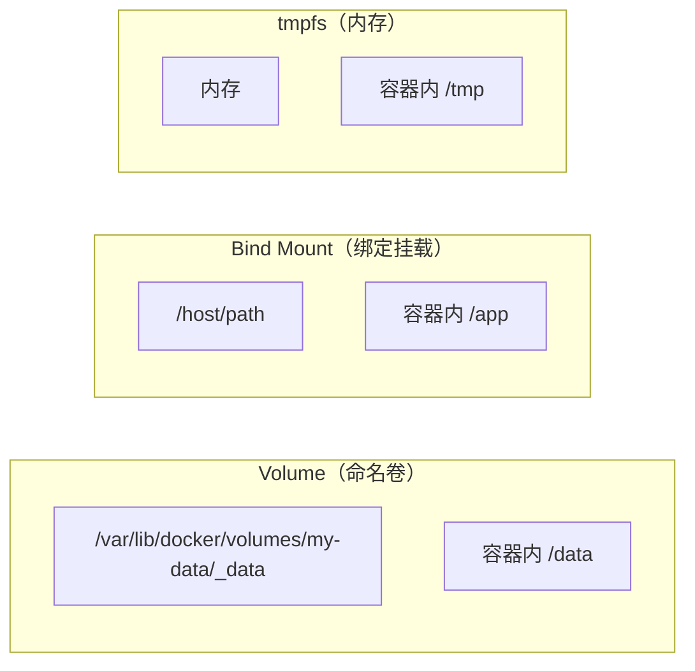
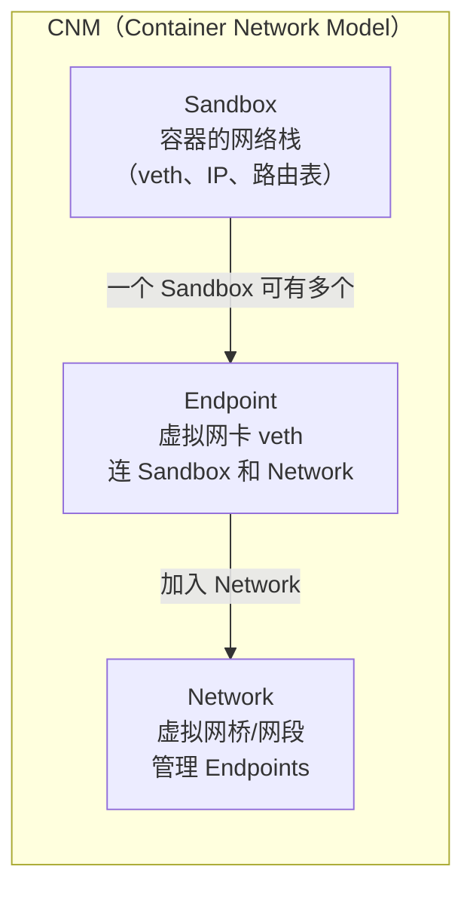
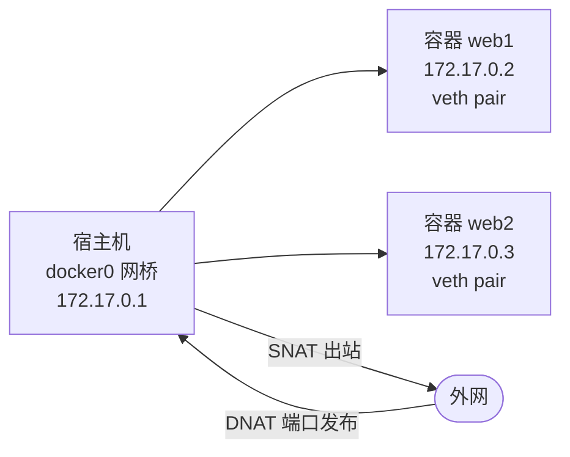
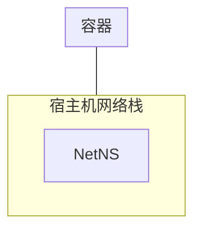
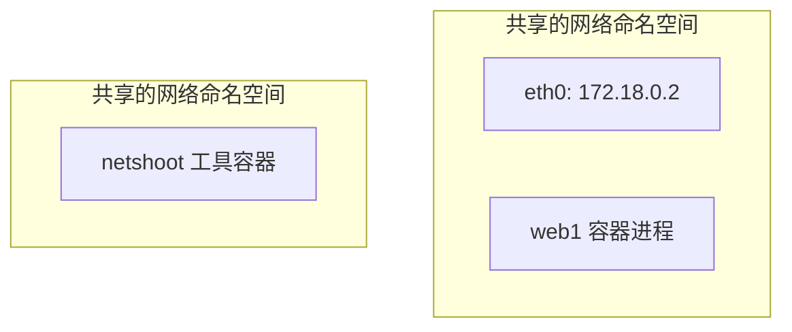
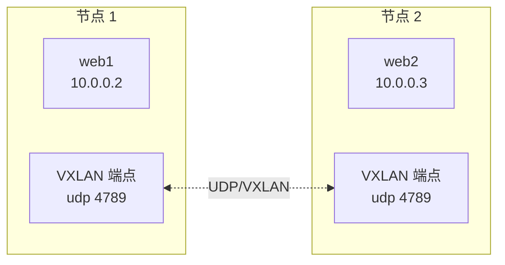

# 数据卷与 Docker 网络模式原理

容器是无状态的——一旦删除，容器内的所有文件也跟着消失。**数据卷**解决持久化问题，**网络**解决容器间与外部通信问题。本章先讲卷，再深入讲解 Docker 的网络架构与 6 种网络模式的底层原理。

## 数据卷：持久化存储 {#volume}

Docker 提供三种把宿主机的存储挂到容器的方式：



### 三种挂载方式对比 {#mount-types}

| 特性 | Volume（命名卷） | Bind Mount | tmpfs |
|------|-----------------|------------|-------|
| 宿主机路径 | Docker 管理（默认 `/var/lib/docker/volumes/`） | **任意宿主机路径**（需写绝对路径） | 内存 |
| 跨平台 | ✅ 路径无关 | ❌ Linux 路径，Windows/macOS 语义不同 | ✅ |
| 容器删除后数据 | **保留** | 保留 | 丢失 |
| 性能 | 高 | 高（接近原生） | 极高（内存） |
| 适合 | 数据库、共享数据 | 开发期挂代码、配置 | 临时缓存、敏感凭证 |
| 可被 `docker volume` 命令管理 | ✅ | ❌ | ❌ |

### Volume 用法 {#volume-usage}

```bash
# 创建命名卷
docker volume create my-data

# 启动容器挂载
docker run -d -v my-data:/var/lib/mysql mysql:8
# 左侧是「卷名」，右侧是「容器内路径」

# 自动创建匿名卷（不显式 docker volume create）
docker run -d -v /var/lib/mysql mysql:8
# 卷名是随机 hash

# 只读挂载（容器不能写）
docker run -d -v my-data:/data:ro nginx

# 查看卷
docker volume ls
docker volume inspect my-data

# 删除卷（容器删除后才能删卷）
docker volume rm my-data
docker volume prune                  # 清理所有未用卷
```

### Bind Mount 用法 {#bind-mount}

```bash
# 开发期最常用：把宿主机代码目录挂到容器里
docker run -d \
  -v $(pwd)/src:/app/src \
  -v $(pwd)/package.json:/app/package.json:ro \
  node:20-alpine \
  sh -c "cd /app && node src/server.js"

# 挂载单个配置文件
docker run -d -v /host/path/nginx.conf:/etc/nginx/nginx.conf:ro nginx

# ⚠️ bind mount 文件不存在时，Docker 自动创建为目录
# 解决：先用 touch 创建文件再挂载，或用 --mount 严格模式
```

### tmpfs 用法 {#tmpfs}

```bash
# 适合敏感凭证、临时文件（重启即丢）
docker run -d --tmpfs /run/secrets:rw,size=64m nginx

# 或用 --mount 语法
docker run -d --mount type=tmpfs,destination=/tmp,tmpfs-size=100m nginx
```

### 实战：MySQL 数据持久化

```bash
# 1. 创建数据卷
docker volume create mysql-data

# 2. 启动 MySQL
docker run -d \
  --name mysql \
  -e MYSQL_ROOT_PASSWORD=123456 \
  -v mysql-data:/var/lib/mysql \
  -p 3306:3306 \
  mysql:8

# 3. 写入数据，验证持久化
docker exec -it mysql mysql -uroot -p123456 -e "CREATE DATABASE test;"

# 4. 删除容器
docker rm -f mysql

# 5. 用同一卷启动新容器，数据还在
docker run -d \
  --name mysql2 \
  -e MYSQL_ROOT_PASSWORD=123456 \
  -v mysql-data:/var/lib/mysql \
  -p 3306:3306 \
  mysql:8

docker exec -it mysql2 mysql -uroot -p123456 -e "SHOW DATABASES;"
# 应该能看到 test 数据库
```

## Docker 网络架构 {#network-architecture}

在深入各模式之前，先理解 Docker 网络的整体设计——CNM（Container Network Model）。

### CNM 三个核心对象 {#cnm}



- **Sandbox**：每个容器有自己的网络命名空间（Net NS），包含独立的 veth 接口、IP、路由、`iptables` 规则。
- **Endpoint**：虚拟网卡（veth pair 的一端），从 Sandbox 伸向 Network，承载容器网络流量。
- **Network**：连接一组 Endpoint 的虚拟网络（背后由网桥、vlan、overlay 等实现）。

这套设计的好处：**网络实现与容器解耦**。可以用本地网桥（bridge），也可以换成 VXLAN overlay、Macvlan、第三方插件（Calico、Cilium 等）。

### libnetwork：CNM 的实现 {#libnetwork}

Docker 用 Go 写的 `libnetwork` 库实现 CNM，并通过 **Driver** 机制支持不同的网络实现：

| Driver | 用途 | 适用 |
|--------|------|------|
| `bridge` | 默认本地网桥 | 单主机容器互联 |
| `host` | 共享宿主机网络 | 性能敏感场景 |
| `null` / `none` | 无网络 | 完全隔离 |
| `container` | 共享其他容器网络 | sidecar 模式 |
| `overlay` | 跨主机 VXLAN | Swarm、K8s |
| `macvlan` | 给容器分配独立 MAC | 容器需要直接出现在物理网络 |
| `ipvlan` | 共享父接口 MAC | 类似 macvlan 但共享 MAC |
| 第三方插件 | Calico、Cilium、Flannel | 生产级网络策略 |

## 网络模式详解 {#network-modes}

### 1. bridge（默认）{#bridge}

最常用。Docker 启动时自动创建 `docker0` 网桥（默认网段 `172.17.0.0/16`），所有未指定网络的容器都连到这。

```bash
# 默认 bridge 网络
docker run -d --name web1 nginx

# 容器自动获得 172.17.0.2 之类的 IP
docker inspect web1 | grep IPAddress
# "172.17.0.2"

# 宿主机角度能看到网桥
ip addr show docker0
```



**端口发布（`-p`）的工作原理**：用 iptables 做 DNAT。

```bash
# 把宿主机的 8080 转到容器的 80
docker run -d -p 8080:80 nginx
# iptables 自动添加规则：
# -A DOCKER -p tcp --dport 8080 -j DNAT --to-destination 172.17.0.2:80
```

**默认 bridge 的局限**：

- 容器之间通过 IP 互通，但**不能通过容器名解析**
- 不支持自定义 DNS、不支持网络策略

### 2. 自定义 bridge（推荐）{#custom-bridge}

强烈推荐用 `docker network create` 创建自定义 bridge，解决默认 bridge 的所有缺陷：

```bash
# 创建自定义网络
docker network create my-net

# 启动容器加入自定义网络
docker run -d --name web1 --network my-net nginx
docker run -d --name api1 --network my-net my-api

# 在 web1 容器里能直接用容器名访问 api1
docker exec -it web1 curl http://api1:3000
# ✅ 自定义网络内置 DNS 解析

# 查看网络
docker network inspect my-net
```

| 维度 | 默认 bridge `bridge` | 自定义 bridge `my-net` |
|------|--------------------|-----------------------|
| DNS 解析（容器名 → IP） | ❌ | ✅（Docker 内置 DNS） |
| 容器互联 | 只能用 IP | 用容器名/服务名 |
| 隔离 | 所有容器共享一个 | 按网络划分 |
| 配置灵活 | 改 daemon.json | docker network create 时指定 |

### 3. host {#host}

容器**不创建独立网络命名空间**，直接共享宿主机的网络栈：

```bash
docker run -d --network host nginx
# 容器里 nginx 直接监听宿主机的 80 端口
# 不需要 -p，直接访问 http://localhost 就行
```



**优点**：性能最好（无 NAT 开销）；适合网络监控、抓包等需要看到宿主机流量的工具。

**缺点**：

- 端口冲突：宿主机 80 已被占用，容器里的 nginx 启动失败
- 安全性低：容器完全暴露在宿主机网络

### 4. none {#none}

容器有自己的网络命名空间，但**没有任何网络接口**：

```bash
docker run -d --network none alpine
docker exec -it <id> ip addr
# 只有 lo（127.0.0.1），没有 eth0
```

适用于完全不需要网络的批处理任务（如纯计算、数据处理）。

### 5. container {#container}

新容器**共享指定容器的网络命名空间**，两者网络完全相同（同一 IP、同一端口）：

```bash
# 启动一个工具容器（共享 web1 的网络）
docker run -d --name web1 nginx
docker run -it --network container:web1 alpine sh
# 第二个容器能直接 curl localhost 访问 web1，无需知道 web1 的 IP

# 实战：网络调试 sidecar
docker run -it --rm --network container:web1 nicolaka/netshoot sh
# netshoot 是一个带 curl/dig/tcpdump 等工具的镜像，常作为 sidecar 排查网络
```



### 6. overlay（跨主机）{#overlay}

用于**多台 Docker 主机之间的容器互联**（Swarm 集群、K8s 集群底层都用 VXLAN overlay）：

```bash
# 创建 overlay 网络（需先初始化 Swarm，见第六章）
docker swarm init
docker network create -d overlay my-overlay

# 任意节点启动容器加入
docker run -d --network my-overlay --name web1 nginx
# 另一台节点的容器也能直接通过容器名访问 web1
```

原理简述：每个节点创建一个 VXLAN 隧道，数据包封装在 UDP 里跨主机传输，对容器透明。



### 7. macvlan {#macvlan}

让容器**直接获得物理网络上的 MAC 地址**，看起来就像一台独立的物理设备：

```bash
# 创建 macvlan 网络
docker network create -d macvlan \
  --subnet=192.168.1.0/24 \
  --gateway=192.168.1.1 \
  -o parent=eth0 \
  macvlan-net

# 启动容器（容器会获得 192.168.1.x 的 IP，从局域网直接 ping 通）
docker run -d --network macvlan-net --ip 192.168.1.100 nginx
```

**适用场景**：IoT、边缘计算、需要容器直接被局域网设备发现的场景（如某些旧设备只支持 IP 白名单）。

**局限**：

- 宿主机 ping 不通容器（这是 macvlan 的著名特性，因为宿主机和 macvlan 子接口在同一个二层网段有反向路径过滤）
- 需要交换机开启混杂模式

## DNS 与容器互联 {#dns}

### 内置 DNS 服务器

Docker daemon 启动一个内置 DNS（默认 `127.0.0.11:53`），为自定义网络提供**自动服务发现**：

```bash
# 自定义网络中的容器可以通过容器名访问彼此
docker network create my-net
docker run -d --name db --network my-net postgres
docker run -d --name api --network my-net my-api

# 在 api 容器里
docker exec api getent hosts db
# 172.18.0.2      db

docker exec api nslookup db
# Server:    127.0.0.11
# Address:   127.0.0.11#53
# Non-authoritative answer:
# Name: db
# Address: 172.18.0.2
```

### `--link`（已过时，不推荐）

```bash
# 旧语法：手动注入 /etc/hosts
docker run -d --name db postgres
docker run -d --name api --link db:database my-api
# api 容器的 /etc/hosts 里会多一行「172.18.0.2 database」

# ⚠️ --link 已不推荐，原因是：
# 1. 不能跨网络（仅默认 bridge 可用）
# 2. 不支持服务扩展
# 3. 不能像 Compose 一样批量管理
# 现在一律用自定义网络 + Docker Compose
```

### 用容器名访问的实战 {#connect-by-name}

```bash
# 1. 启动 Redis
docker network create backend
docker run -d --name redis --network backend redis:7

# 2. 启动应用容器（通过 --network backend 加入网络）
docker run -d --name app \
  --network backend \
  -e REDIS_HOST=redis \
  -e REDIS_PORT=6379 \
  my-app

# 3. 应用内直接连接 redis:6379 即可（无需写 IP）
```

## 网络命令速查 {#network-commands}

```bash
docker network ls                              # 列出所有网络
docker network inspect bridge                 # 查看网络详情
docker network create my-net                  # 创建（默认 bridge 驱动）
docker network create -d overlay my-overlay    # 指定驱动
docker network connect my-net my-container    # 把运行中容器接入网络
docker network disconnect my-net my-container # 断开
docker network rm my-net                      # 删除
docker network prune                          # 清理无用网络
```

## 网络故障排查 {#troubleshooting}

```bash
# 1. 容器间连不通，先看是否在同一网络
docker network inspect my-net | grep Containers

# 2. DNS 不通，确认是否在自定义网络（默认 bridge 不支持容器名解析）
docker exec api cat /etc/resolv.conf
# nameserver 127.0.0.11   ← 自定义网络
# nameserver 8.8.8.8      ← 默认网络（无内置 DNS）

# 3. 端口发布没生效
docker port web1                            # 查看实际映射
docker exec web1 ss -tlnp                   # 容器内确认服务监听
docker network inspect bridge | grep web1   # 查看 veth pair

# 4. 用 netshoot 容器当万能工具
docker run -it --rm --network container:web1 nicolaka/netshoot sh
# 进容器后可用 curl / dig / tcpdump / iperf / nslookup / mtr
```

## 小结 {#summary}

本章系统讲解了数据卷（Volume / Bind Mount / tmpfs）和 Docker 网络架构。**容器间通信首选自定义 bridge**（带内置 DNS、能用容器名）；**生产环境跨主机**用 overlay（Swarm/K8s）；**特殊性能场景**用 host；**调试 sidecar** 用 `container:xxx`。理解 CNM 的 Sandbox / Endpoint / Network 三个对象，是理解所有网络模式与第三方网络插件的共同基础。下一章用 Docker Compose 把多服务一次性启动。
