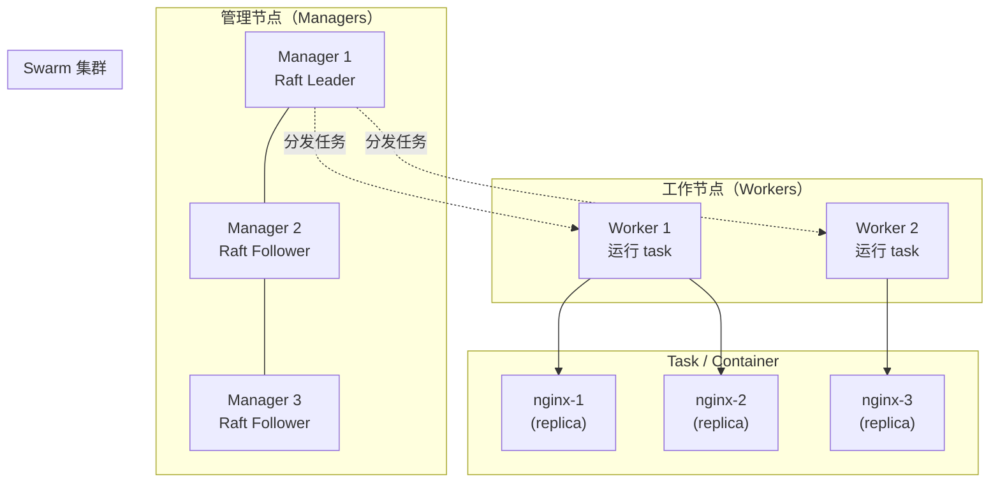
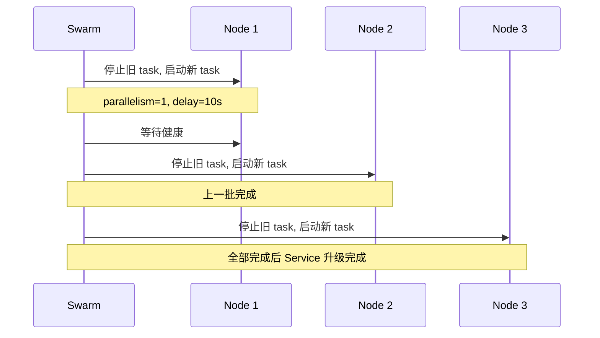
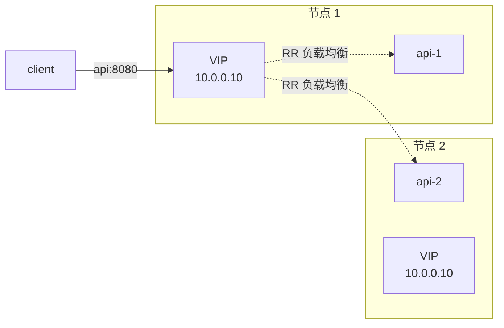

# Docker Swarm 集群编排

单台机器 Compose 已经够用，但生产环境往往需要**多机部署、滚动升级、自动故障转移**。Docker Swarm 是 Docker 自带的集群模式：用一组 Docker 引擎组成集群，跨主机调度容器，并提供声明式服务、自愈、滚动更新等能力。本章系统讲解 Swarm 的架构与实战。

## Swarm vs Compose vs Kubernetes {#positioning}

在讲 Swarm 之前，先明确它的定位：

| 特性 | Compose | Swarm | Kubernetes |
|------|---------|-------|-----------|
| 范围 | 单机 | 多机集群 | 多机集群 |
| 学习曲线 | 低 | 中 | 高 |
| 自带负载均衡 | ❌ | ✅（ingress network） | ✅ |
| 滚动更新 | ❌ | ✅ | ✅ |
| 自动故障转移 | ❌ | ✅ | ✅ |
| 服务发现 | 容器名 | VIP / DNS | Service + DNS |
| 集群状态存储 | 无（YAML 即状态） | Raft 共识 | etcd |
| 生态 | 一般 | 一般 | 极丰富（CRD、Operator） |
| 适用规模 | 个人/小团队 | 中小团队（数十节点） | 中大型（数百+节点） |

> 一句话选型：**单机构建用 Compose → 跨主机用 Swarm → 规模与生态要求高用 K8s**。

## Swarm 架构 {#architecture}



### 三个角色 {#roles}

- **Manager**：集群管理节点。负责调度、接收请求、存储集群状态。建议奇数个（1/3/5/7），通过 Raft 共识选举 Leader。Manager 默认也跑 task（可关闭）。
- **Worker**：纯工作节点。只跑 task，不参与调度。
- **Leader**：由 Manager 选举产生，所有调度决策由它做出。其他 Manager 是 Follower。

### 关键概念 {#concepts}

| 术语 | 含义 |
|------|------|
| **Node** | 加入集群的一台 Docker 引擎（物理机/虚拟机） |
| **Service** | 声明「跑某个镜像 N 个副本」的定义 |
| **Task** | Service 的一个具体实例（实际调度的最小单元），一个 task 对应一个容器 |
| **Replicated Service** | 指定副本数（如 3 个 nginx） |
| **Global Service** | 每个节点跑一个（如日志收集、监控 agent） |
| **Stack** | 一组 Service（用 Compose 文件部署） |
| **Overlay Network** | 跨主机容器互联的虚拟网络（VXLAN 实现） |
| **Raft** | 分布式共识算法，集群状态在 Managers 间同步 |

## 初始化集群 {#init}

### 单节点 Swarm（学习用）

```bash
# 在一台机器上初始化（同时作为 manager）
docker swarm init --advertise-addr <本机IP>
# 输出一段 join 命令，类似：
# docker swarm join --token SWMTKN-xxx <manager-ip>:2377
```

### 多节点 Swarm（生产） {#init-multi}

```bash
# 在 manager 机器（假设 IP 192.168.1.10）
docker swarm init --advertise-addr 192.168.1.10

# 拿到 worker join token
docker swarm join-token worker
# 输出：
# docker swarm join --token SWMTKN-xxx 192.168.1.10:2377

# 拿到 manager join token
docker swarm join-token manager

# 在 worker 机器（192.168.1.20）执行 join
docker swarm join --token SWMTKN-xxx 192.168.1.10:2377

# 在另一台 manager 机器（192.168.1.11）
docker swarm join --token <manager-token> 192.168.1.10:2377

# 在 manager 节点查看集群
docker node ls
# ID                            HOSTNAME   STATUS    AVAILABILITY   MANAGER STATUS
# xxxx *   manager1   Ready     Active         Leader
# yyyy     worker1    Ready     Active
# zzzz     manager2   Ready     Active         Reachable
```

> 端口要求：2377（集群管理）、7946（节点间通信）、4789（overlay VXLAN）这三个端口在所有节点间必须可达。

## Service：声明式部署 {#service}

### 创建第一个 service

```bash
# 部署 3 副本 nginx（会在集群中选 3 个节点各跑一个）
docker service create --name web --replicas 3 --publish 8080:80 nginx:1.27

# 查看
docker service ls
# ID      NAME   MODE        REPLICAS   IMAGE       PORTS
# abc123  web    replicated  3/3        nginx:1.27  *:8080->80/tcp

docker service ps web
# ID      NAME   IMAGE       NODE      DESIRED STATE   CURRENT STATE
# xxx1    web.1  nginx:1.27  worker1   Running         Running 5 minutes
# xxx2    web.2  nginx:1.27  manager2  Running         Running 5 minutes
# xxx3    web.3  nginx:1.27  worker2   Running         Running 5 minutes
```

### 访问入口（Ingress Network）

Swarm 自动创建 `ingress` overlay 网络，所有发布端口的服务挂载到这个网络。任意节点 IP + 8080 都能访问，自动负载均衡到任意副本：

```bash
# 测试（在集群外任意机器）
curl http://192.168.1.10:8080   # 走 manager1
curl http://192.168.1.20:8080   # 走 worker1
curl http://192.168.1.11:8080   # 走 manager2
# 三个请求会被负载均衡到 3 个副本
```

### Global Service：每个节点一个

```bash
# 日志收集、监控 agent 适合这种模式
docker service create --name node-exporter \
  --mode global \
  prom/node-exporter
# 每个节点都会跑一个实例，新增节点会自动补上
```

### 扩缩容（scale） {#scale}

```bash
# 把 web service 扩到 5 副本
docker service scale web=5
# 自动在节点间重新分配

# 缩到 2 副本
docker service scale web=2

# 移除某个副本（强制重新调度）
docker service update --force web
```

### 滚动更新（Rolling Update）{#rolling-update}

```bash
# 镜像升级（默认滚动更新策略）
docker service update --image nginx:1.27.1 web

# 查看滚动更新过程
docker service ps web

# 自定义更新策略
docker service update \
  --update-parallelism 2 \
  --update-delay 10s \
  --update-failure-action rollback \
  --image nginx:1.27.1 web
# --update-parallelism  一次更新几个副本
# --update-delay        每批之间的间隔
# --update-failure-action rollback  失败自动回滚
```



### 回滚 {#rollback}

```bash
# 立即回滚到上一个版本
docker service rollback web

# 查看 service 历史
docker service inspect --pretty web
```

## Overlay 网络 {#overlay-network}

Swarm 模式下，跨主机容器通信用 overlay 网络（VXLAN 封装）：

```bash
# 创建 overlay 网络
docker network create --driver overlay my-overlay

# 部署服务并加入 overlay
docker service create \
  --name api \
  --network my-overlay \
  my-api:latest

docker service create \
  --name db \
  --network my-overlay \
  postgres:16
# api 容器可以直接通过「db:5432」访问 db 容器
# DNS 解析由 Swarm 内置 DNS 提供
```

### 服务发现与负载均衡



每个 service 在 overlay 网络里都有**一个 VIP（虚拟 IP）**，Docker 内置 DNS 把 `api` 域名解析到这个 VIP，VIP 通过 iptables/IPVS 在副本间轮询。客户端无需关心有几个副本。

## Stack：用 Compose 文件部署到 Swarm {#stack}

Swarm 支持直接用 Compose 文件部署一组服务（叫 Stack），这在生产里非常常用：

```yaml
# docker-stack.yml
version: "3.8"

services:
  nginx:
    image: nginx:1.27-alpine
    ports:
      - "80:80"
    networks:
      - frontend
    deploy:
      replicas: 3
      update_config:
        parallelism: 1
        delay: 10s
      restart_policy:
        condition: on-failure

  api:
    image: my-registry.com/my-api:1.0.0
    networks:
      - frontend
      - backend
    environment:
      DB_HOST: db
    deploy:
      replicas: 2
      placement:
        constraints:
          - node.role == worker    # 只调度到 worker
    secrets:
      - db_password

  db:
    image: postgres:16-alpine
    networks:
      - backend
    environment:
      POSTGRES_PASSWORD_FILE: /run/secrets/db_password
    volumes:
      - db-data:/var/lib/postgresql/data
    deploy:
      placement:
        constraints:
          - node.labels.storage == ssd
    secrets:
      - db_password

volumes:
  db-data:

networks:
  frontend:
  backend:

secrets:
  db_password:
    external: true               # 用 docker secret create 预先创建
```

```bash
# 部署
docker stack deploy -c docker-stack.yml my-app

# 查看
docker stack ls
docker stack services my-app
docker stack ps my-app           # 查看所有 task

# 升级（修改 compose 文件后再次 deploy 即滚动更新）
docker stack deploy -c docker-stack.yml my-app

# 删除
docker stack rm my-app           # 不会删 volume
docker stack rm my-app && docker volume rm my-app_db-data
```

### `deploy:` 字段专属 Swarm

Compose 文件里的 `deploy:` 配置只对 Swarm / Stack 生效，本机 `docker compose up` 会忽略：

| 字段 | 用途 |
|------|------|
| `replicas` | 副本数 |
| `update_config` | 滚动更新配置 |
| `restart_policy` | 重启策略 |
| `placement.constraints` | 节点调度约束 |
| `placement.preferences` | 调度偏好（spread/anti-affinity） |
| `resources.limits` | CPU/内存限制 |

## Secret 管理 {#secrets}

生产环境的密码、证书不要写在环境变量或文件里，用 Swarm secrets（加密存储 + 内存挂载）：

```bash
# 创建 secret（从标准输入）
echo "my-secret-password" | docker secret create db_password -

# 或从文件
docker secret create db_password ./password.txt

# 列出 secrets
docker secret ls

# 在 service 中使用（容器内挂载到 /run/secrets/<name>）
docker service create \
  --name db \
  --secret db_password \
  postgres:16
# 容器内读取：cat /run/secrets/db_password
# 得到 my-secret-password
```

Secret 在 Manager 节点上加密存储，通过 TLS 加密分发到 worker 节点的内存中（**不写入磁盘**）。

## Config 管理（类似 Secret，但非敏感）{#configs}

```bash
# 从文件创建 config
docker config create nginx_config ./nginx.conf

# 在 service 中使用（容器内挂载到 /<config-name>）
docker service create \
  --name web \
  --config source=nginx_config,target=/etc/nginx/nginx.conf \
  nginx:1.27
```

## 节点标签与调度 {#node-labels}

通过标签把节点分组，服务按标签调度：

```bash
# 给节点打标签
docker node update --label-add storage=ssd worker1
docker node update --label-add env=production manager1

# 查看标签
docker node ls -q | xargs -I {} docker node inspect {} --format '{{.Description.Hostname}}: {{.Spec.Labels}}'

# 服务只调度到 SSD 节点
docker service create \
  --name db \
  --constraint 'node.labels.storage == ssd' \
  postgres
```

## 实战：部署一个高可用 Web 服务 {#example-ha}

```bash
# 1. 初始化集群（前面已完成）

# 2. 推送镜像到 Registry（所有节点都能拉取）
docker tag my-web:1.0.0 registry.example.com/my-web:1.0.0
docker push registry.example.com/my-web:1.0.0

# 3. 创建 secret（如有敏感配置）
echo "my-app-secret" | docker secret create app_secret -

# 4. 创建 overlay 网络
docker network create --driver overlay web-net

# 5. 部署 service
docker service create \
  --name web \
  --network web-net \
  --replicas 5 \
  --publish 80:80 \
  --update-parallelism 2 \
  --update-delay 5s \
  --update-failure-action rollback \
  --secret app_secret \
  --env DATABASE_URL=postgres://user:pass@db:5432/mydb \
  registry.example.com/my-web:1.0.0

# 6. 查看部署
docker service ls
docker service ps web
docker service logs -f web

# 7. 升级到新版本
docker service update --image registry.example.com/my-web:1.0.1 web
# 自动滚动更新：先停 2 个旧实例，启动 2 个新实例，确认健康后再继续

# 8. 验证高可用
docker node drain worker1    # 把 worker1 标记为不可调度并驱逐 task
docker service ps web        # web 的 task 会自动调度到其他节点
```

## Swarm 故障排查 {#troubleshooting}

```bash
# 查看集群状态
docker node ls
docker info | grep -A 20 "Swarm"

# 查看 manager 是否健康
docker node ls --format "{{.Hostname}}: {{.ManagerStatus.Reachability}}/{{.ManagerStatus.Status}}"

# 查看某个 service 为什么没启动
docker service ps --no-trunc web

# 查看 task 详细日志
docker service logs web

# 进入 service 的容器
docker service exec web sh   # 注意：Swarm V2 仅支持在指定节点执行

# 重置集群（慎用）
docker swarm leave --force
```

## Swarm 与 Kubernetes 选型 {#vs-k8s}

| 维度 | Swarm | Kubernetes |
|------|-------|------------|
| 学习成本 | 低（懂 Docker 即可） | 高（Pod/Service/Deployment/Ingress…） |
| 功能完整性 | 基础够用 | 非常丰富（CRD、Operator、自动扩缩容） |
| 生态 | 弱 | 极强（Helm、Istio、Argo CD 等） |
| 性能 | 中（适合中小规模） | 调度灵活、百万级 Pod |
| 调试 | 简单（仍是 Docker CLI） | 复杂（kubectl 多层抽象） |
| 适用 | 中小团队、过渡方案、边缘计算 | 中大型企业、云原生 |

**选型建议**：

- 个人项目 / 小团队 / 内部系统：**Swarm**（5 分钟上手）
- 已有 K8s 运维团队：**K8s**
- 大规模（100+ 节点）：**K8s**（Swarm 不适合）
- 边缘计算 / IoT：**K8s (K3s)** 或 Swarm

## 小结 {#summary}

Docker Swarm 是 Docker 内置的集群模式，用 Raft 共识组织 Manager 节点，通过 Service / Task 实现声明式部署与滚动更新。**单主机 Compose 起 → 跨主机 Swarm** 是平滑的扩展路径：用 `docker stack deploy` 直接把 Compose 文件部署到 Swarm，加上 `deploy:` 字段控制副本数与调度约束。Secret 与 Config 提供敏感数据的安全分发。**面对 K8s 选型时**：Swarm 学习曲线低、够用就好；规模/生态要求高就上 K8s，不必死守 Swarm。至此 Docker 教程六章全部完成，覆盖了从基础命令到集群编排的完整技能栈。
