# 第一章 Drools 概述与第一个规则

在动手写规则之前,先理解**规则引擎解决了什么问题、为什么是 Drools**。

本章讲清楚规则引擎的核心概念、Drools 的能力边界、与同类方案的对比,然后**带你跑通第一个规则**——Hello World。

## 本章知识点地图

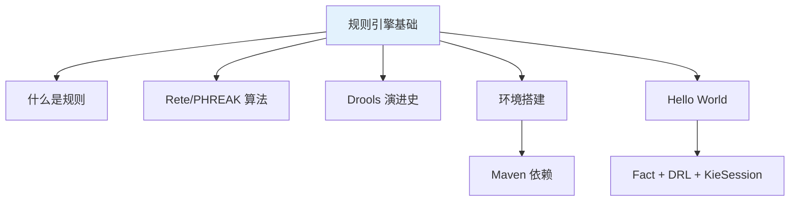

## 1.1 什么是规则引擎

### 1.1.1 规则与代码的本质区别

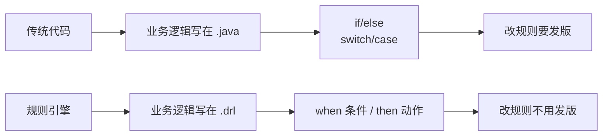

**规则引擎的本质**:**把决策逻辑从代码里抽出来**,用一种"声明式语言"(DRL、DMN)表达,**引擎负责匹配、执行、优化**。

### 1.1.2 规则引擎的三个核心组件

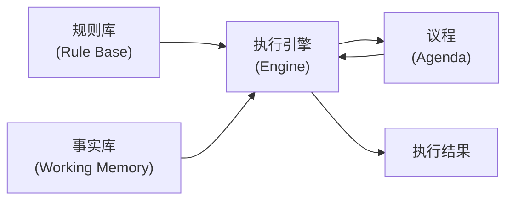

| 组件 | 含义 | 类比 |
|------|------|------|
| **规则库(Rule Base)** | 所有 DRL 规则编译后的规则集 | 法律条文 |
| **事实库(Working Memory)** | 当前传入的事实数据(Fact) | 现实案件 |
| **议程(Agenda)** | 引擎分析出来的"待执行规则列表" | 庭审待办 |

### 1.1.3 RETE 算法

Drools 底层使用 **RETE 算法**(1974 年由 Charles Forgy 提出)做模式匹配。

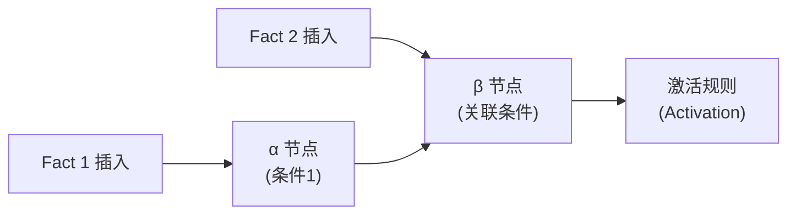

**RETE 的核心思想**:
- 把 DRL 的 when 条件编译成**网络节点**
- Fact 进入时**增量传播**,避免重复扫描
- 重复匹配时**记忆**(避免重复计算)

**优势**:**规则多 + Fact 多**时,RETE 比 `if-else` 快几个数量级。

### 1.1.4 PHREAK 算法(Drools 7+)

**PHREAK** 是 Drools 7 引入的 **RETE 升级版**,核心改进:

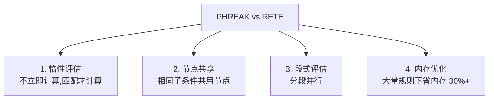

**结论**:**Drools 8 默认使用 PHREAK**——性能比 RETE 好,且更省内存。

## 1.2 Drools 演进史

### 1.2.1 版本时间线

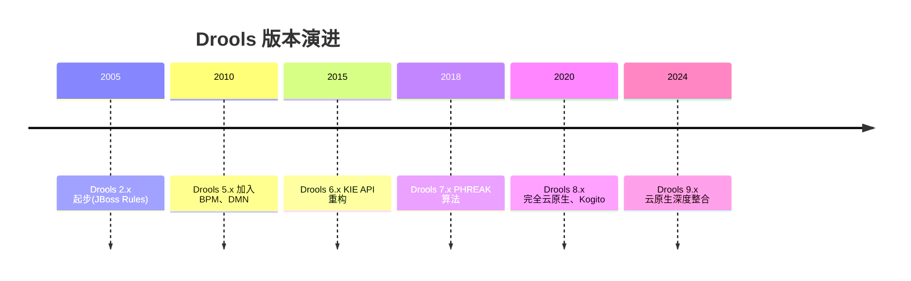

### 1.2.2 重大版本特性

| 版本 | 关键特性 |
|------|----------|
| **5.x** | 引入 BPMN、DMN、子网 |
| **6.x** | KIE 模块化、API 重构 |
| **7.x** | PHREAK 算法、RuleUnit API |
| **8.x** | 云原生、与 Kogito 整合 |
| **9.x** | Drools + OptaPlanner 合并、运行时优化 |

### 1.2.3 版本选型建议

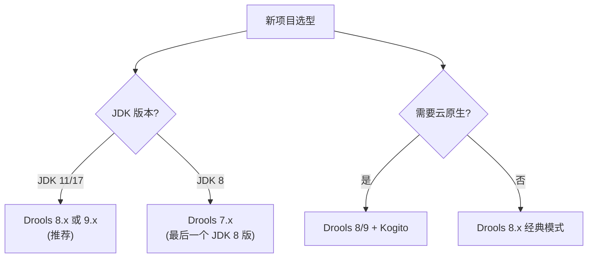

**本教程基于 Drools 8.x**(Java 11+ 推荐)。

## 1.3 与同类规则引擎对比

### 1.3.1 Java 生态主要规则引擎

| 引擎 | 语言 | 性能 | 易用性 | 维护状态 |
|------|------|------|--------|----------|
| **Drools** | DRL/Java | 高(RETE/PHREAK) | 中等 | 活跃 |
| **Easy Rules** | Java/注解 | 低 | 高 | 活跃 |
| **Avrete** | JSON/Aviator | 中 | 高 | 活跃 |
| **OpenL Tablets** | Excel | 中 | 高 | 活跃 |
| **Jess** | CLIPS | 中 | 中 | 已停更 |
| **JRuleEngine** | XML | 低 | 低 | 已停更 |

### 1.3.2 Easy Rules vs Drools

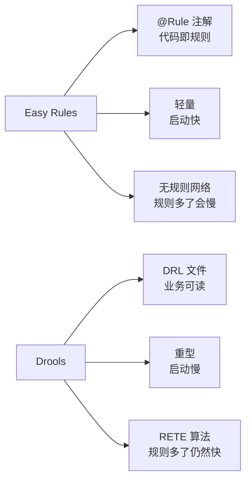

**选型建议**:

| 场景 | 推荐 |
|------|------|
| **< 10 条规则**、简单场景 | Easy Rules |
| **> 50 条规则**、复杂条件 | **Drools** |
| **规则需要业务人员维护** | **Drools**(DRL 易读) |
| **规则需要热加载** | **Drools** |
| **Spring Boot 项目** | 两者皆可 |

### 1.3.3 Drools vs Avrete

| 维度 | Drools | Avrete |
|------|--------|--------|
| 语法 | DRL(类 SQL) | JSON/Aviator |
| 学习曲线 | 中等 | 平缓 |
| 性能 | 高 | 中 |
| 适用 | 企业级 | 中小型 |
| 热部署 | 内置 | 需自实现 |

## 1.4 环境搭建

### 1.4.1 Maven 依赖

```xml
<properties>
    <drools.version>8.44.0.Final</drools.version>
</properties>

<dependencies>
    <!-- Drools 核心 -->
    <dependency>
        <groupId>org.drools</groupId>
        <artifactId>drools-core</artifactId>
        <version>${drools.version}</version>
    </dependency>

    <!-- Drools 编译器(可选,动态编译时需要) -->
    <dependency>
        <groupId>org.drools</groupId>
        <artifactId>drools-compiler</artifactId>
        <version>${drools.version}</version>
    </dependency>

    <!-- Drools 模型 -->
    <dependency>
        <groupId>org.drools</groupId>
        <artifactId>drools-model</artifactId>
        <version>${drools.version}</version>
    </dependency>

    <!-- 测试支持 -->
    <dependency>
        <groupId>org.drools</groupId>
        <artifactId>drools-xml-support</artifactId>
        <version>${drools.version}</version>
        <scope>test</scope>
    </dependency>

    <!-- 日志(可选) -->
    <dependency>
        <groupId>org.slf4j</groupId>
        <artifactId>slf4j-simple</artifactId>
        <version>2.0.13</version>
    </dependency>
</dependencies>
```

### 1.4.2 依赖精简建议

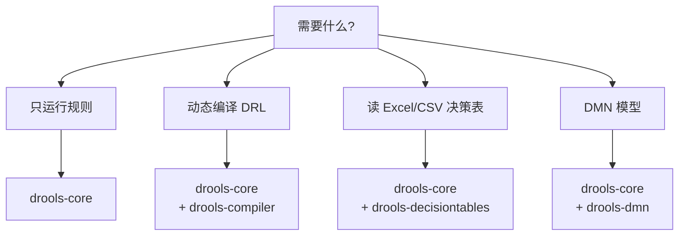

### 1.4.3 Gradle 依赖

```groovy
plugins {
    id 'java'
}

dependencies {
    implementation 'org.drools:drools-core:8.44.0.Final'
    implementation 'org.drools:drools-compiler:8.44.0.Final'
    implementation 'org.slf4j:slf4j-simple:2.0.13'
}
```

### 1.4.4 JDK 与 Drools 版本对应

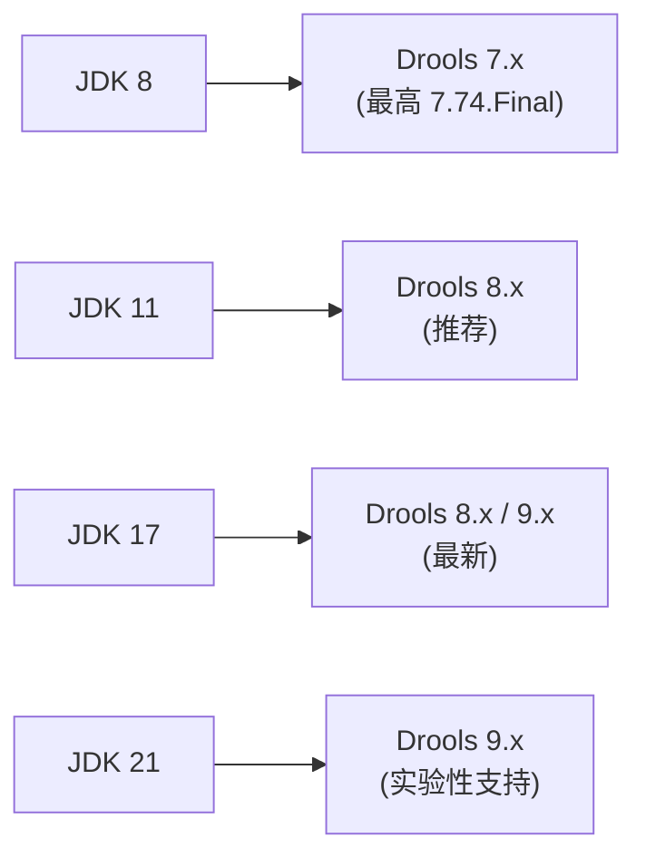

## 1.5 第一个 Hello World

### 1.5.1 业务场景

**规则**:**当订单金额 ≥ 1000 元时,打 9 折**。

### 1.5.2 项目结构

```text
drools-demo/
├── pom.xml
└── src/
    └── main/
        ├── java/
        │   └── com/example/drools/
        │       ├── Order.java           # Fact 类
        │       └── HelloWorldApp.java   # 主程序
        └── resources/
            └── rules/
                └── order.drl            # 规则文件
```

### 1.5.3 Fact 类:Order.java

```java
package com.example.drools;

public class Order {
    private String id;
    private double amount;
    private double discount;  // 折扣率(0.9 表示 9 折)

    public Order() {}

    public Order(String id, double amount) {
        this.id = id;
        this.amount = amount;
    }

    // getter/setter 必须有,规则引擎要访问
    public String getId() { return id; }
    public void setId(String id) { this.id = id; }

    public double getAmount() { return amount; }
    public void setAmount(double amount) { this.amount = amount; }

    public double getDiscount() { return discount; }
    public void setDiscount(double discount) { this.discount = discount; }

    @Override
    public String toString() {
        return "Order{id='" + id + "', amount=" + amount + ", discount=" + discount + '}';
    }
}
```

**关键点**:
- **POJO** 即可,无需继承
- 必须有 **getter**(Drools 通过 getter 访问属性)
- 字段命名遵循 **JavaBean 规范**

### 1.5.4 规则文件:order.drl

```drools
package com.example.drools

import com.example.drools.Order

rule "大额订单9折"
    salience 10
    when
        $order: Order(amount >= 1000)
    then
        $order.setDiscount(0.9);
        System.out.println("规则触发:订单 " + $order.getId() + " 享 9 折优惠");
end
```

**DRL 语法简述**(后续章节详解):
- `package`:包路径(与 Java 一致)
- `import`:导入 Fact 类
- `rule "规则名"`:`when` 条件 + `then` 动作
- `$order: Order(...)`:**模式匹配**,把 Order 实例绑定到 `$order`
- `amount >= 1000`:**条件约束**

### 1.5.5 主程序:HelloWorldApp.java

```java
package com.example.drools;

import org.kie.api.KieServices;
import org.kie.api.builder.KieFileSystem;
import org.kie.api.builder.Message;
import org.kie.api.builder.Results;
import org.kie.api.builder.model.KieModuleModel;
import org.kie.api.runtime.KieContainer;
import org.kie.api.runtime.KieSession;
import org.kie.api.runtime.StatelessKieSession;

public class HelloWorldApp {

    public static void main(String[] args) {
        // 1. 获取 KieServices(工厂)
        KieServices kieServices = KieServices.Factory.get();

        // 2. 创建 KieFileSystem(虚拟文件系统)
        KieFileSystem kieFileSystem = kieServices.newKieFileSystem();

        // 3. 写入规则文件
        kieFileSystem.write(
            kieServices.getResources()
                .newClassPathResource("rules/order.drl", HelloWorldApp.class)
        );

        // 4. 构建 KieModule(编译)
        org.kie.api.builder.KieBuilder kieBuilder =
            kieServices.newKieBuilder(kieFileSystem).buildAll();

        // 5. 检查编译错误
        Results results = kieBuilder.getResults();
        if (results.hasMessages(Message.Level.ERROR)) {
            System.err.println("编译错误:");
            results.getMessages().forEach(m -> System.err.println(m.getText()));
            throw new RuntimeException("Drools 编译失败");
        }

        // 6. 创建 KieContainer
        KieContainer kieContainer =
            kieServices.newKieContainer(
                kieServices.getRepository().getDefaultReleaseId()
            );

        // 7. 创建 KieSession(创建会话实例)
        KieSession kieSession = kieContainer.newKieSession();

        try {
            // 8. 准备 Fact(订单数据)
            Order order = new Order("ORD-001", 1500.0);
            System.out.println("原始订单: " + order);

            // 9. 把 Fact 插入引擎
            kieSession.insert(order);

            // 10. 触发所有规则
            int fired = kieSession.fireAllRules();
            System.out.println("触发了 " + fired + " 条规则");

            // 11. 查看执行结果
            System.out.println("处理后订单: " + order);
        } finally {
            // 12. 关闭 Session(释放内存)
            kieSession.dispose();
        }
    }
}
```

### 1.5.6 运行结果

```text
原始订单: Order{id='ORD-001', amount=1500.0, discount=0.0}
规则触发:订单 ORD-001 享 9 折优惠
触发了 1 条规则
处理后订单: Order{id='ORD-001', amount=1500.0, discount=0.9}
```

**解读**:
1. 订单金额 1500 > 1000,触发规则
2. 规则的 then 块修改了 `discount = 0.9`
3. 引擎返回触发规则数

## 1.6 核心 API 速览

### 1.6.1 KieServices 体系

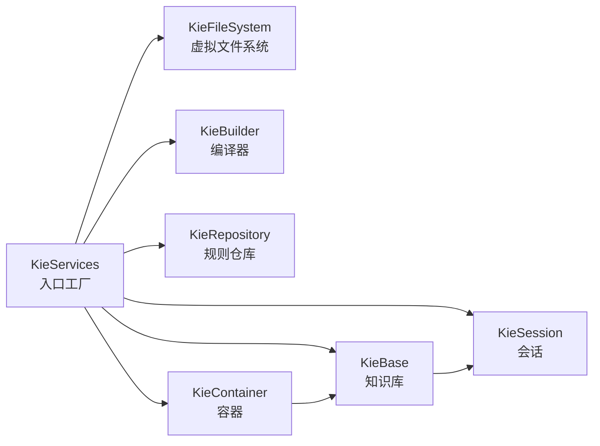

### 1.6.2 主要 API 清单

| 类 | 作用 | 创建方式 |
|-----|------|----------|
| **KieServices** | 工厂单例 | `KieServices.Factory.get()` |
| **KieFileSystem** | 内存文件系统 | `kieServices.newKieFileSystem()` |
| **KieBuilder** | 编译器 | `kieServices.newKieBuilder(fs)` |
| **KieContainer** | 加载 KieModule | `kieServices.newKieContainer(releaseId)` |
| **KieBase** | 已编译的规则库 | `kieContainer.getKieBase()` |
| **KieSession** | 有状态会话 | `kContainer.newKieSession()` |
| **StatelessKieSession** | 无状态会话 | `kContainer.newStatelessKieSession()` |

### 1.6.3 KieSession vs StatelessKieSession

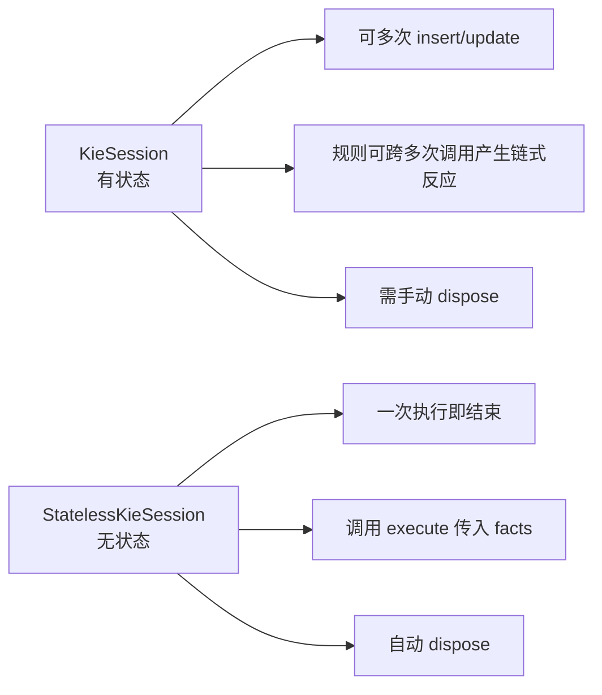

| 场景 | 推荐 |
|------|------|
| **决策/计算**(一次性) | Stateless |
| **复杂业务流**(多步骤) | Stateful |
| **规则可能修改 Fact 触发其他规则** | Stateful |

### 1.6.4 KieContainer 与 KieBase

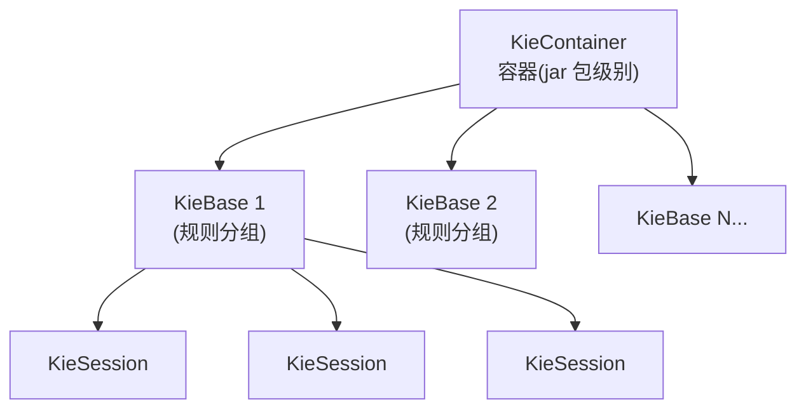

**关系**:**一个 KieContainer 包含多个 KieBase,每个 KieBase 可创建多个 KieSession**。

### 1.6.5 KieModule 概念

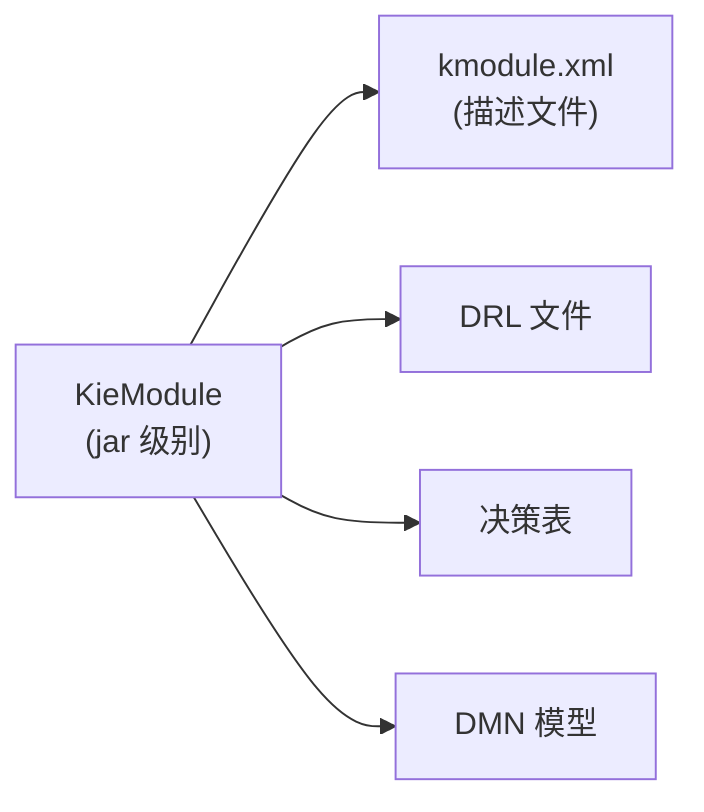

**kmodule.xml** 是 KieModule 的描述文件,声明 KieBase 和 KieSession 配置。

## 1.7 用 KieContainer 简化加载

### 1.7.1 资源组织(Maven 规范)

```text
src/main/resources/
├── META-INF/
│   └── kmodule.xml                # KieModule 配置
└── rules/
    ├── order.drl
    └── discount.drl
```

### 1.7.2 kmodule.xml

```xml
<?xml version="1.0" encoding="UTF-8"?>
<kmodule xmlns="http://www.drools.org/xsd/kmodule">
    <kbase name="rulesBase" packages="rules">
        <ksession name="rulesSession"/>
        <ksession name="statelessSession" type="stateless"/>
    </kbase>
</kmodule>
```

**解读**:
- `name="rulesBase"`:KieBase 名
- `packages="rules"`:扫描 resources/rules 目录
- `<ksession name="rulesSession"/>`:默认是有状态 Session
- `type="stateless"`:无状态 Session

### 1.7.3 加载方式对比

**方式 1:动态编译(本章 Hello World 用法)**

```java
KieFileSystem kfs = kieServices.newKieFileSystem();
kfs.write(...);
KieBuilder kbuilder = kieServices.newKieBuilder(kfs).buildAll();
KieContainer kContainer = kieServices.newKieContainer(...);
```

**方式 2:从 classpath 加载(项目常用)**

```java
KieServices ks = KieServices.Factory.get();
KieContainer kContainer = ks.getKieClasspathContainer();
KieSession session = kContainer.newKieSession("rulesSession");
```

**对比**:

| 维度 | 动态编译 | classpath 加载 |
|------|----------|----------------|
| **场景** | 运行时动态规则 | 编译期固定规则 |
| **速度** | 启动慢(编译耗时) | 启动快 |
| **热部署** | 容易 | 需自定义 |
| **生产推荐** | 高级用法 | **首选** |

## 1.8 常用调试技巧

### 1.8.1 日志查看规则匹配过程

```properties
# logback.xml 或 log4j.properties
logger.org.drools.core=DEBUG
```

**DEBUG 日志输出**:

```text
==>[ActivationCreatedEventImpl: rule=大额订单9折]
==>[ActivationFiredEventImpl: rule=大额订单9折]
```

### 1.8.2 开启 KieRuntimeEventLogger

```java
import org.drools.core.event.DebugRuntimeEventListener;

KieSession session = ...;
session.addEventListener(new DebugRuntimeEventListener());
```

**输出详细的事件流**(适合调试复杂规则)。

### 1.8.3 Audit Logging(审计日志)

```java
import org.kie.api.event.KieRuntimeEventManager;
import org.drools.audit.WorkingMemoryLogger;

KieSession session = ...;
session.addEventListener(new WorkingMemoryLogger(session));
```

**审计日志特点**:
- 记录**所有 Fact 变化**
- 记录**所有规则触发**
- 适合**生产问题排查**

### 1.8.4 IDE 插件

**IntelliJ IDEA Drools 插件**:
- 路径:`Settings → Plugins → Marketplace`
- 搜索:`Drools`
- 功能:DRL 语法高亮、自动补全、调试支持

**VS Code 插件**:
- 搜索:`Drools DSL`(社区维护)
- 功能有限,推荐 IntelliJ

### 1.8.5 单元测试

**Drools 提供专用测试 API**:

```java
import org.drools.ruleunit.api.RuleUnitHelper;

public class OrderTest {
    @Test
    public void testBigOrderDiscount() {
        Order order = new Order("ORD-001", 1500.0);

        try (KieSession session = ...) {
            session.insert(order);
            int fired = session.fireAllRules();
            assertEquals(1, fired);
            assertEquals(0.9, order.getDiscount());
        }
    }
}
```

## 1.9 常见问题

### 1.9.1 启动慢

```text
❌ 现象:应用启动慢 5~10 秒
✅ 原因:Drools 编译 DRL 耗时
✅ 解决:
   1. 预编译(KieScanner 提前编译到 M2 仓库)
   2. 使用 classpath 加载(编译期完成)
   3. Kogito 编译到原生镜像
```

### 1.9.2 规则不触发

```text
❌ 现象:fireAllRules 返回 0
✅ 排查:
   1. 检查 Fact 是否真的 insert 了
   2. 检查 when 条件是否正确
   3. 开启 DEBUG 日志看匹配过程
   4. 检查 Fact 字段是否 public 或有 getter
```

### 1.9.3 ClassNotFoundException

```text
❌ 现象:Drools 找不到 Fact 类
✅ 解决:
   1. DRL 的 import 必须正确
   2. Fact 类必须在 classpath 中
   3. kmodule.xml 的 packages 配置正确
```

### 1.9.4 Maven 依赖冲突

```text
❌ 现象:运行时 NoSuchMethodError / ClassNotFoundException
✅ 解决:
   1. drools-core / drools-compiler / drools-model 版本必须一致
   2. 排除冲突的旧版依赖(如旧版 drools-core)
   3. 用 mvn dependency:tree 查看冲突
```

## 小结 {#summary}

- **规则引擎核心**:把决策逻辑从代码抽出,DRL 声明式表达,引擎负责匹配执行。
- **RETE/PHREAK**:Drools 底层算法,Fact 增量传播,规则多时性能远优于 `if-else`。
- **Drools 8.x** 是当前主流,**JDK 11/17 + Spring Boot** 是常见组合。
- **Hello World 流程**:`KieServices → KieFileSystem → KieBuilder → KieContainer → KieSession → insert → fireAllRules → dispose`。
- **Stateless vs Stateful**:决策/计算用 Stateless,业务流用 Stateful。
- **首选 classpath 加载**:编译期完成 Kie 编译,启动快。

下一章讲 **DRL 语法基础**——把规则文件的每个元素掰开讲透:package、import、when、then、规则属性(salience、no-loop 等),为写复杂规则打下基础。