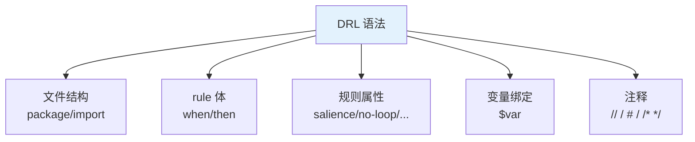
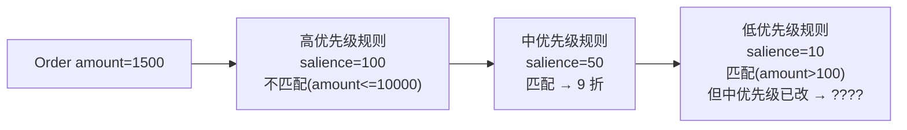
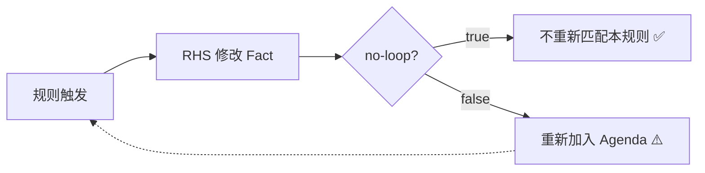
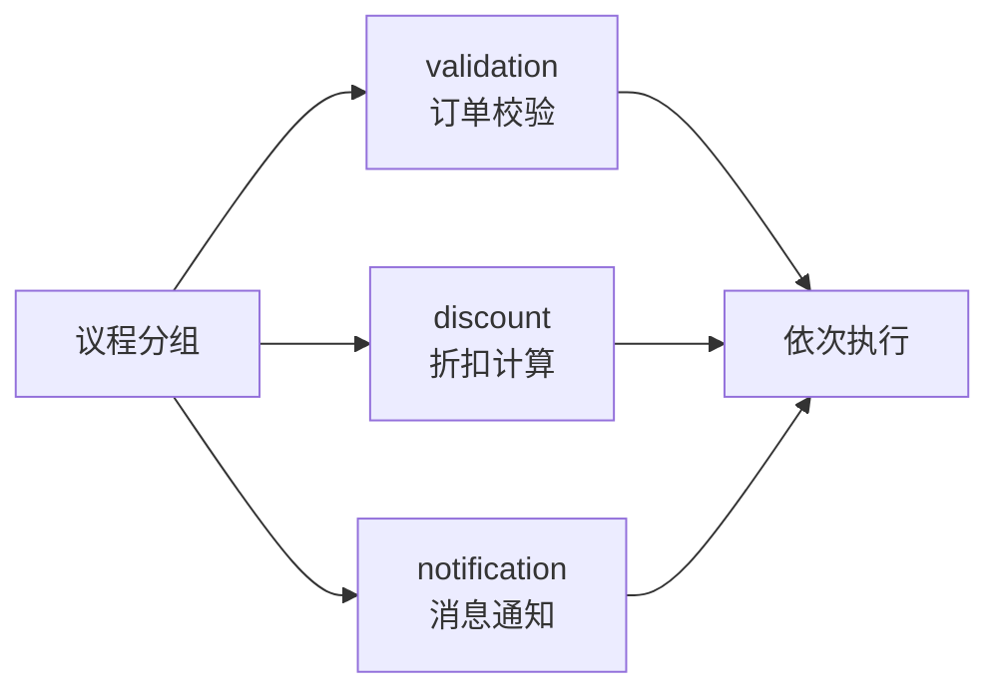
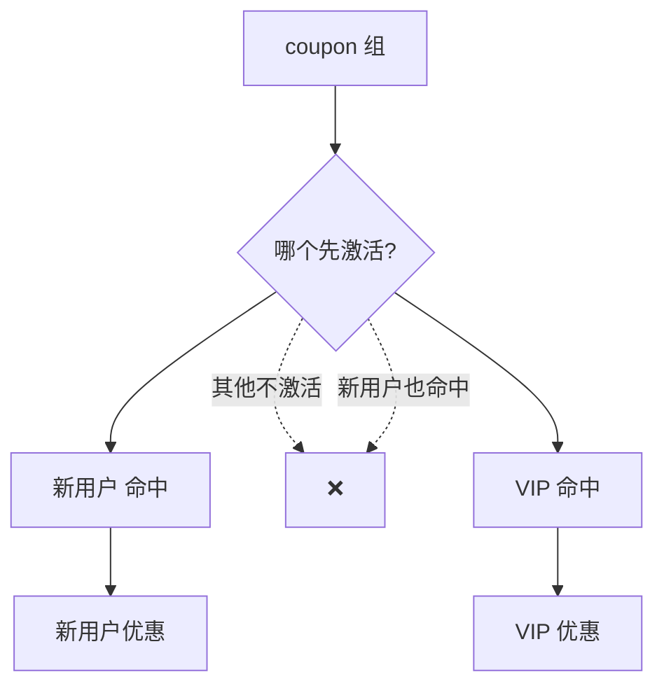
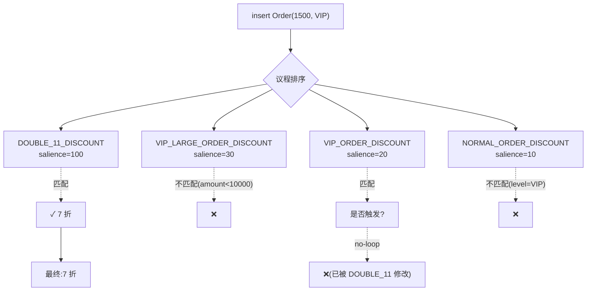

# 第二章 DRL 语法基础

DRL(Drools Rule Language)是 Drools 的规则描述语言,**类 SQL 风格**——`when` 是条件,`then` 是动作。

这一章把 DRL 的语法骨架讲透。看完你能写**最常见的规则**(条件 + 动作 + 属性)。

## 本章知识点地图



## 2.1 DRL 文件结构

### 2.1.1 完整结构

```drools
package  // 包名(必须)
import   // 导入(可多个)
function // 函数(可选)
query    // 查询(可选)
declare  // 类型声明(可选)
rule     // 规则(可多个)
```

### 2.1.2 完整示例

```drools
// 1. 包名(必须),与 Fact 类包路径对应
package com.example.drools.rules

// 2. 导入 Fact 类
import com.example.drools.Order
import com.example.drools.Customer

// 3. 全局变量(可选)
global com.example.drools.service.RuleResultService resultService

// 4. 函数(可选)
function double calculateTax(double amount) {
    return amount * 0.06;
}

// 5. 查询(可选)
query "getAllOrders"
    $order: Order()
end

// 6. 规则
rule "rule1"
    salience 10
    when
        $order: Order(amount > 1000)
    then
        $order.setDiscount(0.9);
end
```

### 2.1.3 包名(package)

```drools
package com.example.drools.rules
```

**规则**:
- **必须**写在第一行(注释除外)
- **不**与 Java 的 `package` 关键字含义一致——它只是**逻辑分组**
- 同一个 KieBase 的所有 DRL 文件,**包名共享**(可省略 import,直接引用其他 DRL 类型)
- **包名冲突**会报错

### 2.1.4 import 导入

```drools
import com.example.drools.Order
import static com.example.drools.OrderStatus.PAID
import java.util.List
import java.util.ArrayList
import java.math.BigDecimal
```

**支持的导入类型**:
- Java 类
- 静态导入(static)
- 同包其他 DRL 中声明的类型
- Java 标准库类

**import 注意**:
- `java.lang.*` 默认自动导入
- 同一包内的类**无需 import**

### 2.1.5 文件命名

| 命名方式 | 是否推荐 |
|----------|----------|
| `order-discount.drl` | ✅ 推荐 |
| `order_discount.drl` | ✅ 可用 |
| `rules.drl` | ✅ 单文件时 |
| `OrderDiscount.DRL` | ❌ 部分平台区分大小写 |

**后缀必须是 `.drl`**。

## 2.2 rule 规则体

### 2.2.1 基本结构

```drools
rule "规则名"
    // 属性(可选,多个)
    salience 10
    no-loop true
    when
        // 条件(Pattern + 约束)
    then
        // 动作
end
```

### 2.2.2 规则命名规范

```drools
rule "ORDER_DISCOUNT_LARGE"        // 大额订单折扣
rule "RISK_CHECK_HIGH_AMOUNT"      // 高金额风控
rule "vip-level-gold-promotion"    // 金牌 VIP 促销
```

**命名建议**:
- **业务**含义清晰
- **作用域**明确(订单/风控/积分)
- **行为**具体(大额/折扣/VIP)

### 2.2.3 when 条件

**Pattern + 约束**:

```drools
when
    // 多个 Pattern 表示"and"关系
    $order: Order(amount > 1000)
    $customer: Customer(level == "GOLD")
```

**支持的运算符**:

| 类型 | 运算符 |
|------|--------|
| **比较** | `==`, `!=`, `>`, `>=`, `<`, `<=` |
| **字符串** | `matches`(正则), `contains`, `startsWith`, `endsWith` |
| **集合** | `in`, `not in`, `memberOf` |
| **范围** | `in (1..100)`, `not in (1..100)` |
| **空判断** | `== null`, `!= null` |
| **逻辑** | `&&`, `\|\|`, `!` |

### 2.2.4 then 动作

```drools
then
    $order.setDiscount(0.9);
    System.out.println("订单 " + $order.getId() + " 享 9 折");
    update($order);  // 通知引擎 Fact 已变更
end
```

**then 块中可用**:

| 操作 | 说明 |
|------|------|
| **修改 Fact** | 直接调用 setter |
| **调用 Java 方法** | 任意 Java 代码 |
| **insert / update / delete / retract** | 操作 Working Memory |
| **modify** | 修改 Fact 并通知(推荐) |

### 2.2.5 modify 关键字(推荐)

```drools
then
    modify($order) {
        setDiscount(0.9),
        setStatus("DISCOUNTED")
    }
end
```

**等价于**:

```drools
then
    $order.setDiscount(0.9);
    $order.setStatus("DISCOUNTED");
    update($order);
end
```

**优势**:**一次操作完成修改 + 通知**,避免遗漏。

## 2.3 规则属性

### 2.3.1 完整属性清单

| 属性 | 含义 |
|------|------|
| `salience` | 优先级(数字越大越先执行) |
| `no-loop` | 单次 fireAllRules 中只触发一次 |
| `lock-on-active` | 同 agenda-group 中只触发一次 |
| `agenda-group` | 议程分组 |
| `activation-group` | 激活组(互斥) |
| `ruleflow-group` | 规则流分组 |
| `duration` | 延迟执行(毫秒) |
| `timer` | 定时执行(cron) |
| `date-effective` | 生效时间 |
| `date-expires` | 失效时间 |
| `enabled` | 是否启用 |
| `dialect` | 表达式语言(java/mvel) |

### 2.3.2 salience 优先级

```drools
rule "高优先级规则"
    salience 100
    when
        $order: Order(amount > 10000)
    then
        $order.setDiscount(0.7);  // 7 折
end

rule "中优先级规则"
    salience 50
    when
        $order: Order(amount > 1000)
    then
        $order.setDiscount(0.9);  // 9 折
end

rule "低优先级规则"
    salience 10
    when
        $order: Order(amount > 100)
    then
        $order.setDiscount(0.95);  // 95 折
end
```

**执行顺序**:**salience 高的先执行**。



**坑点**:**默认 salience=0**;同名规则可能执行顺序混乱——**用 salience 显式声明顺序**。

### 2.3.3 no-loop 防自循环

```drools
rule "积分计算"
    no-loop true  // 关键!
    when
        $u: User(points > 0)
        $c: Coupon(category == $u.favoriteCategory)
    then
        modify($u) {
            setRecommendedCoupon($c)
        }
        // 不加 no-loop 会死循环:
        // update($u) 触发本规则再次匹配
end
```

**no-loop 作用**:**同一规则的 RHS 内对同一个 Fact 的修改不会再次触发本规则**。



**典型场景**:规则改 Fact,改完 Fact 仍满足条件——没 no-loop 就死循环。

### 2.3.4 lock-on-active 防重入

```drools
rule "VIP 折扣"
    lock-on-active true
    agenda-group "discount"
    when
        $order: Order(amount >= 1000, customerLevel == "VIP")
    then
        modify($order) {
            setDiscount(0.8)
        }
        // 不加 lock-on-active:
        // update($order) 触发本规则再次匹配 → discount 已设置但 amount 没变,继续触发?
end
```

**lock-on-active vs no-loop**:

| 维度 | no-loop | lock-on-active |
|------|---------|----------------|
| **粒度** | 单个规则 | agenda-group 内所有规则 |
| **作用范围** | 仅本规则 RHS 修改触发 | 整个 group 内任何修改 |
| **强度** | 弱 | 强 |

**推荐**:**复杂场景用 lock-on-active**,简单场景用 no-loop。

### 2.3.5 agenda-group 议程分组

```drools
rule "订单校验"
    agenda-group "validation"
    when
        $order: Order()
    then
        // 校验逻辑
end

rule "订单折扣"
    agenda-group "discount"
    when
        $order: Order(amount > 1000)
    then
        $order.setDiscount(0.9);
end

rule "订单通知"
    agenda-group "notification"
    when
        $order: Order()
    then
        // 通知逻辑
end
```

**用法**:

```java
ksession.getAgenda().getAgendaGroup("validation").setFocus();
// 执行 validation 组的所有规则
ksession.fireAllRules();
ksession.getAgenda().getAgendaGroup("discount").setFocus();
ksession.fireAllRules();
```



**适用场景**:**业务流程分阶段**(校验→折扣→通知→日志)。

### 2.3.6 activation-group 激活组(互斥)

```drools
rule "新用户优惠"
    activation-group "coupon"
    when
        $u: User(isNew == true)
    then
        $u.setCoupon("NEW_USER");
end

rule "VIP 优惠"
    activation-group "coupon"
    when
        $u: User(level == "VIP")
    then
        $u.setCoupon("VIP");
end

rule "生日优惠"
    activation-group "coupon"
    when
        $u: User(birthday == today)
    then
        $u.setCoupon("BIRTHDAY");
end
```

**规则**:**同一 activation-group 中,只会有一个规则被激活**(先匹配先得)。



**坑点**:**activation-group 内规则的执行顺序也受 salience 影响**。

### 2.3.7 duration 延迟执行

```drools
rule "订单超时取消"
    duration 30000  // 30 秒后执行
    when
        $order: Order(status == "PENDING_PAYMENT")
    then
        $order.setStatus("CANCELLED");
        System.out.println("订单超时取消");
end
```

**适用场景**:**超时处理**(30 分钟未支付自动取消)。

**注意**:
- 需要**时钟事件**支持——Drools 内部用伪时钟推进
- 配合 `calendars` 处理节假日

### 2.3.8 timer 定时执行

```drools
rule "每日报表生成"
    timer (cron:0 0 2 * * ?)  // 每天凌晨 2 点
    when
        // 任何订单都可触发
    then
        // 生成日报
end

rule "每分钟心跳"
    timer (cron:0 * * * * ?)  // 每分钟
    when
    then
        System.out.println("心跳");
end
```

**timer 表达式**:

| 类型 | 语法 | 示例 |
|------|------|------|
| **cron** | `cron:0 0 2 * * ?` | 每天 2 点 |
| **interval** | `int:30s` | 每 30 秒 |
| **time** | `time:14:30` | 一次,14:30 执行 |

### 2.3.9 date-effective / date-expires

```drools
rule "双11大促"
    date-effective "2026-11-11 00:00"
    date-expires "2026-11-12 00:00"
    when
        $order: Order(amount > 100)
    then
        $order.setDiscount(0.5);
end
```

**适用范围**:**限时活动**——只在时间段内生效。

**格式**:字符串形式的时间(支持 ISO 8601)。

### 2.3.10 enabled 开关

```drools
rule "试用规则"
    enabled false  // 禁用
    when
        $order: Order()
    then
        // 不会执行
end
```

**用法**:从数据库读取 enabled 标志,动态启用/禁用:

```java
KieBase kbase = ...;
boolean enabled = configService.isRuleEnabled("试用规则");
((RuleImpl) kbase.getRule("...", "试用规则")).setEnabled(enabled);
```

## 2.4 变量绑定

### 2.4.1 基本绑定

```drools
when
    $order: Order(amount > 1000)
then
    // $order 是匹配到的 Order 实例
    System.out.println($order.getId());
end
```

**约定**:**以 `$` 开头的变量**是绑定变量,在 then 中可用。

### 2.4.2 多变量绑定

```drools
when
    $order: Order(amount > 1000)
    $customer: Customer(id == $order.customerId, level == "VIP")
    $coupon: Coupon(category == $customer.favoriteCategory)
then
    $order.setDiscount($coupon.getDiscount());
end
```

**引用关系**:
- `$order.customerId` 引用 $order 的字段
- `$customer.id == $order.customerId` 通过字段关联

### 2.4.3 字段访问规则

```drools
when
    $o: Order(amount > 1000)             // 直接访问字段
    $o: Order(getAmount() > 1000)        // 调用 getter(等价)
    $o: Order(this.amount > 1000)        // this 关键字
then
    System.out.println($o.getId());
    System.out.println($o.getCustomer().getName());  // 链式访问
end
```

### 2.4.4 隐式绑定(字段访问)

```drools
when
    Order(amount > 1000)  // 无显式绑定
then
    // 无法在 then 中获取 Order 对象!
end
```

**对比**:
- `$o: Order(...)`:绑定变量,可在 then 中用
- `Order(...)`:不绑定,仅匹配,不暴露给 then

### 2.4.5 嵌套对象访问

```java
// Java 类
public class Order {
    private Customer customer;
    private List<OrderItem> items;
}
```

```drools
when
    $order: Order(customer.level == "VIP")
    $order: Order(items.size() > 0)
    $order: Order(items[0].product.price > 100)  // 数组/集合下标
then
    modify($order) {}
end
```

**支持的访问方式**:
- `customer.level`:链式
- `items.size()`:集合大小
- `items[0]`:下标(数组/List)
- `items["key"]`:Map

## 2.5 注释

### 2.5.1 单行注释

```drools
// 单行注释

rule "规则" // 行末注释
    when
        $o: Order()  // 字段注释
    then
        // 动作注释
end
```

### 2.5.2 多行注释

```drools
/*
 多行注释
 可以跨越多行
*/
rule "规则"
    when
        /* 中间注释 */
        $o: Order()
    then
end
```

### 2.5.3 元数据(metadata)

```drools
rule "规则"
    salience 10
    when
        $o: Order()
    then
end
```

**自定义元数据**(@metadata):

```drools
rule "规则"
    @author(alice)
    @date(2026-09-06)
    @priority(high)
    when
        $o: Order()
    then
end
```

**读取元数据**:

```java
Rule rule = kbase.getRule("pkg", "规则");
Map<String, Object> meta = rule.getMetaData();
String author = (String) meta.get("author");
```

## 2.6 综合示例

### 2.6.1 订单折扣系统

**业务规则**:
1. 普通订单满 1000 打 95 折
2. VIP 订单满 1000 打 9 折
3. VIP 订单满 10000 打 8 折
4. 双 11 期间所有订单满 1000 打 7 折

```drools
package com.example.drools.rules

import com.example.drools.Order
import java.time.LocalDate

global com.example.drools.service.NotificationService notificationService

// 工具函数
function boolean isDoubleEleven() {
    LocalDate today = LocalDate.now();
    return today.getMonthValue() == 11 && today.getDayOfMonth() == 11;
}

// 规则 1: 普通订单折扣
rule "NORMAL_ORDER_DISCOUNT"
    salience 10
    when
        $o: Order(amount >= 1000, customerLevel == "NORMAL")
    then
        modify($o) {
            setDiscount(0.95)
        }
        notificationService.notify("普通订单折扣", $o.getId());
end

// 规则 2: VIP 订单折扣
rule "VIP_ORDER_DISCOUNT"
    salience 20
    when
        $o: Order(amount >= 1000 && < 10000, customerLevel == "VIP")
    then
        modify($o) {
            setDiscount(0.9)
        }
        notificationService.notify("VIP 折扣", $o.getId());
end

// 规则 3: VIP 大额折扣
rule "VIP_LARGE_ORDER_DISCOUNT"
    salience 30
    when
        $o: Order(amount >= 10000, customerLevel == "VIP")
    then
        modify($o) {
            setDiscount(0.8)
        }
        notificationService.notify("VIP 大额折扣", $o.getId());
end

// 规则 4: 双 11 大促
rule "DOUBLE_11_DISCOUNT"
    salience 100
    no-loop true
    when
        $o: Order(amount >= 1000)
        eval(isDoubleEleven())
    then
        modify($o) {
            setDiscount(0.7)
        }
        notificationService.notify("双 11 折扣", $o.getId());
end
```

### 2.6.2 规则执行流程



## 2.7 规则编写最佳实践

### 2.7.1 命名规范

```drools
// ✅ 推荐
rule "ORDER_DISCOUNT_LARGE_AMOUNT"
rule "RISK_CHECK_HIGH_VALUE"

// ❌ 不推荐
rule "rule1"
rule "test"
rule "新规则"
```

### 2.7.2 一个规则只做一件事

```drools
// ✅ 推荐:一个规则一个职责
rule "SET_LARGE_DISCOUNT"
    when
        $o: Order(amount >= 10000)
    then
        $o.setDiscount(0.7);
end

// ❌ 不推荐:一个规则做多件事
rule "BIG_ORDER"
    when
        $o: Order(amount >= 10000)
    then
        $o.setDiscount(0.7);
        notificationService.send(...);
        auditService.log(...);
        // 复杂业务混在一起
end
```

### 2.7.3 避免深度条件嵌套

```drools
// ✅ 推荐:扁平条件
when
    $o: Order(amount > 1000, status == "PENDING")
    $c: Customer(level == "VIP", id == $o.customerId)
then
end

// ❌ 不推荐:嵌套
when
    $o: Order(amount > 1000)
    $c: Customer(id == $o.customerId)
    Customer(this.level == "VIP" && this.active == true && ...)  // 复杂
then
end
```

### 2.7.4 使用 salience 显式排序

```drools
// ✅ 所有规则都声明 salience
rule "RULE_A"
    salience 100
rule "RULE_B"
    salience 50
rule "RULE_C"
    salience 10
```

### 2.7.5 修改 Fact 必用 modify

```drools
// ✅ 推荐:modify
modify($o) {
    setDiscount(0.9),
    setStatus("DISCOUNTED")
}

// ❌ 不推荐:setter + update
$o.setDiscount(0.9);
$o.setStatus("DISCOUNTED");
update($o);  // 容易遗漏
```

### 2.7.6 no-loop 的必要性

```drools
// 修改 Fact 的规则必须加 no-loop 或 lock-on-active
rule "AUTO_CALCULATE_BONUS"
    no-loop true          // ✅ 必备
    when
        $e: Employee(performance > 90)
    then
        modify($e) {
            setBonus($e.getSalary() * 0.1)
        }
end
```

## 2.8 常见错误

### 2.8.1 语法错误

```text
❌ 大小写错误
rule "r1" instead of rule "r1"
when instead of when

❌ 标点错误
when
    $o: Order(amount > 1000)  // ✓
    $o: Order(amount > 1000.) // ❌ 多余点
```

### 2.8.2 编译错误

```text
❌ 当量表达式错误
Amount: amount > "1000"  // 字符串 vs 数字

❌ 类型不匹配
Order(id == 123)  // id 是 String,123 是 int
```

### 2.8.3 运行时错误

```text
❌ Fact 字段没 getter
class Order {
    public String id;  // 字段 public 但没 getter
}
❌ 规则访问不到
```

## 小结 {#summary}

- **DRL 文件结构**:`package`(必)→`import`→`global`→`function/query/declare`(可选)→`rule`(可多个)。
- **rule 体**:`rule "名字" + 属性 + when 条件 + then 动作 + end`。
- **规则属性**:`salience`(优先级)、`no-loop`(防自循环)、`lock-on-active`(防重入)、`agenda-group`(分组)、`activation-group`(互斥)、`timer`(定时)、`date-effective`(限时)。
- **变量绑定**:`$var: ClassName(条件)`——绑定可在 then 中使用。
- **modify 优于 setter+update**:**一次性完成修改 + 通知**。
- **最佳实践**:**显式命名 + 一个规则一件事 + 显式 salience + 必须 no-loop**。

下一章讲 **模式匹配与条件构造**——这是写复杂规则的核心:`exists`/`not`/`forall`、复合条件、`collect`/`accumulate` 聚合。掌握这些,你才能写出生产可用的规则。