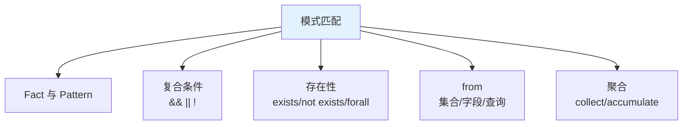
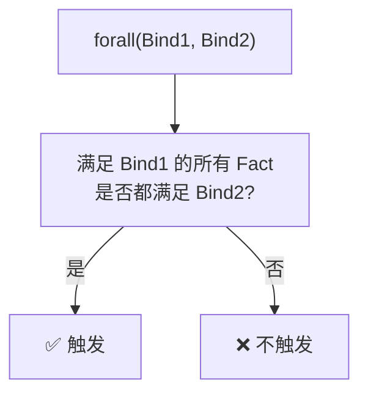
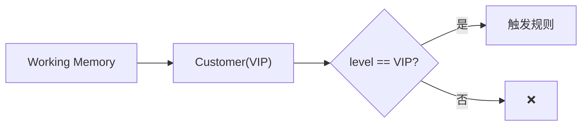
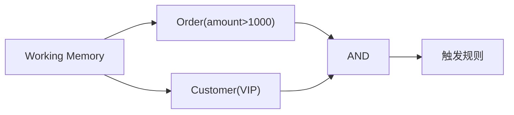
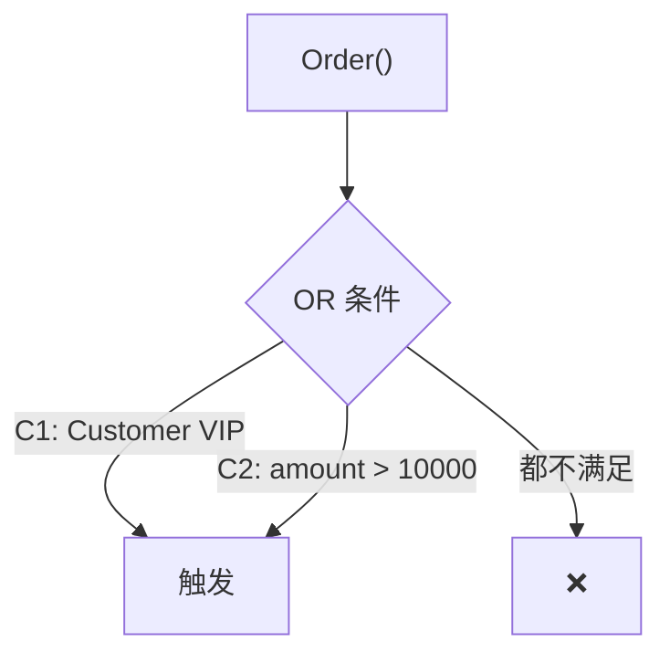
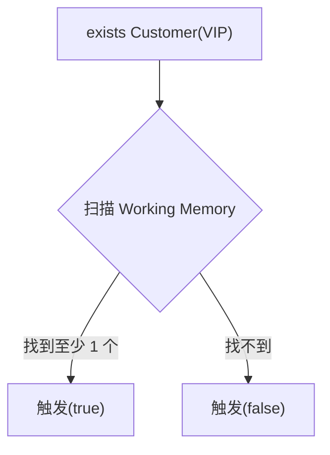
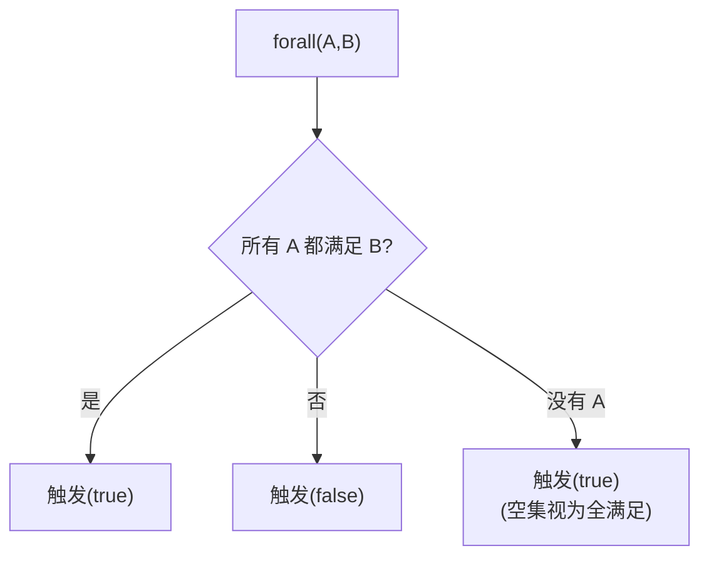
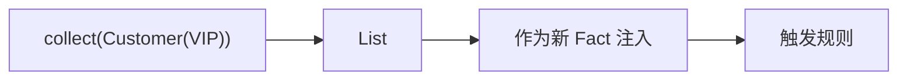

# 第三章 模式匹配与条件构造

第二章讲了 DRL 的骨架(规则体、属性、变量绑定),这一章讲 **when 条件内部如何组织**——这是写复杂规则的**核心难点**。

掌握本章,你才能写**多条件、嵌套、聚合**的真实业务规则。

## 本章知识点地图



## 3.1 Fact 模型与 Pattern

### 3.1.1 什么是 Pattern

**Pattern** 是 when 条件中的基本单元——**一个 Fact + 约束**。

```drools
when
    $order: Order(amount > 1000)  // 一个 Pattern
    $customer: Customer(level == "VIP")  // 另一个 Pattern
```

**Pattern 构成**:
- **Fact 类型**:`Order`、`Customer` 等
- **约束**(可选):`amount > 1000`、`level == "VIP"`
- **绑定变量**(可选):`$order:`

### 3.1.2 多个 Pattern 默认 AND

```drools
when
    $o: Order(amount > 1000)   // Pattern 1
    $c: Customer(level == "VIP")  // Pattern 2
    $c: Customer(this == $c, age > 18)  // Pattern 3(补充约束)
then
end
```

**等价**:**Pattern 1 AND Pattern 2 AND Pattern 3**。

### 3.1.3 Fact 类型约束

```drools
when
    $o: Order(amount > 1000)
    // Order 必须是 class/interface 的全限定名
    // 或通过 import 简化
```

**匹配规则**:**引擎扫描 Working Memory 中所有 Order 类型的 Fact**,看是否满足约束。

### 3.1.4 Pattern 修饰符

```drools
when
    $o: Order()  // 默认匹配所有 Order
    $o: Order(?)  // 等价于 $o: Order()
    $o: Order(_)  // 等价于 $o: Order()
    $o: Order(!= null)  // 不为 null
    $o: Order(this != null)  // 同上
then
end
```

## 3.2 复合条件

### 3.2.1 单字段多约束

```drools
when
    // 写法 1:逗号分隔(AND)
    $o: Order(amount >= 100, amount <= 5000)
    
    // 写法 2:&& 显式 AND
    $o: Order(amount >= 100 && amount <= 5000)
    
    // 写法 3:OR
    $o: Order(amount < 100 || amount > 5000)
    
    // 写法 4:混合
    $o: Order((amount > 1000 && status == "PENDING") || vip == true)
then
end
```

### 3.2.2 范围匹配(in)

```drools
when
    $o: Order(amount in (100, 200, 500, 1000))  // 离散值
    $o: Order(amount in (100..5000))  // 区间(100~5000)
    $o: Order(status in ("NEW", "PAID", "SHIPPED"))  // 字符串范围
    $o: Order(amount not in (100..500))  // 不在范围
then
end
```

### 3.2.4 字符串方法

```drools
when
    $o: Order(remark not matches "[Ff]raud.*")  // 正则不匹配
    $c: Customer(name matches "[A-Z][a-z]+")  // 姓名首字母大写
    $u: User(email contains "@gmail.com")  // 包含
    $f: File(path startsWith "/data/")  // 前缀
    $f: File(name endsWith ".csv")  // 后缀
then
end
```

### 3.2.5 集合包含

```drools
when
    $o: Order(tags contains "vip")  // List/Set 包含
    $o: Order(products["key-001"] != null)  // Map 取值
    $o: Order(products["key-001"].price > 100)  // 嵌套
then
end
```

### 3.2.6 null 检查

```drools
when
    $o: Order(remark == null)
    $o: Order(remark != null)
    $o: Order(remark == "")  // 空字符串(不是 null)
then
end
```

**坑点**:`== null` 是引用比较,`""` 是空字符串比较,**两者不同**。

### 3.2.7 嵌套字段访问

```drools
when
    // 单层
    $o: Order(customer.level == "VIP")
    
    // 多层
    $o: Order(customer.address.city == "Beijing")
    
    // 调用方法
    $o: Order(items.size() >= 3)
    
    // 安全调用(Drools 8+)
    $o: Order(customer?.address?.city == "Beijing")
then
end
```

## 3.3 复合条件进阶

### 3.3.1 eval 表达式

```drools
when
    $o: Order(amount > 1000)
    eval(LocalDate.now().getDayOfWeek() == DayOfWeek.FRIDAY)  // 周五
then
end
```

**eval 用法**:
- **执行 Java 表达式**
- 返回 boolean
- **慎用**:每次匹配都执行,性能敏感场景避免

### 3.3.2 not Pattern(不存在)

```drools
when
    $o: Order(amount > 1000)
    not Customer(id == $o.customerId, vip == false)  // 客户不是非 VIP
then
    // 没有"该客户的非 VIP 记录"时触发
end
```

**含义**:**匹配所有 Order,只要 Working Memory 中没有满足条件的 Customer**。

### 3.3.3 exists Pattern(存在)

```drools
when
    $o: Order(amount > 10000)
    exists RiskRecord(orderId == $o.id, level == "HIGH")  // 存在高风险记录
then
    // 大额订单且存在高风险记录 → 风控拦截
    $o.setApproved(false);
end
```

**exists vs 普通 Pattern**:

```dermaid
flowchart LR
    A["普通 Pattern:<br/>Customer(level == 'VIP')"] --> B["每个 VIP 都触发"]
    C["exists Pattern:<br/>exists Customer(level == 'VIP')"] --> D["只要有一个就触发"]
```

**exists 的特点**:**只关心是否存在,不关心具体是哪个**——**性能更好**(只需检测到一个即可)。

### 3.3.4 forall(全满足)

```drools
when
    $o: Order(amount > 10000)
    forall(Customer(id == $o.customerId, level == "VIP"))  // 所有相关客户都是 VIP
then
    // 大额订单 + 所有相关客户都是 VIP → 放行
    $o.setApproved(true);
end
```

**forall 含义**:**所有满足 Pattern 1 的 Fact 都满足 Pattern 2**。



### 3.3.5 from 子句(从某处获取数据)

```drools
when
    $o: Order(amount > 1000)
    $c: Customer() from $o.getCustomer()  // 从订单的客户字段
    $p: Product() from $o.getItems()  // 从订单的 item 列表(每个 item 都触发)
then
    // $p 是每个商品
end
```

**from 关键点**:
- `from $o.getItems()`:对 List/Collection,**每个元素**触发一次
- `from $o.getCustomer()`:对单对象,只触发一次

### 3.3.6 from entry-point(从外部数据源)

```drools
when
    $e: Event() from entry-point "stream"
then
    // 处理 Kafka 流
end
```

**适用场景**:**复杂事件处理(CEP)**——从 Kafka 等外部流接收事件。

## 3.4 集合与聚合

### 3.4.1 collect 收集

```drools
when
    $orders: List() from collect(Order(customerId == 100))  // 该客户所有订单
then
    modify($orders.get(0)) {
        setStatus("PROCESSED")
    }
end
```

**collect**:**收集所有满足条件的 Fact 到一个集合**。

**支持的集合类型**:
- `List`
- `Set`
- `Collection`

### 3.4.2 accumulate 自定义聚合

```dermaid
flowchart LR
    A["accumulate"] --> B["SQL-like 聚合"]
    A --> C["sum/avg/count/min/max"]
    A --> D["自定义聚合函数"]
```

**基本语法**:

```drools
when
    // 累计求和
    $total: Double() from accumulate(
        Order(customerId == 100, $amount: amount),
        sum($amount)
    )
then
    if ($total > 50000) {
        // VIP 判定
    }
end
```

### 3.4.3 accumulate 函数清单

| 函数 | 含义 |
|------|------|
| `sum($field)` | 求和 |
| `avg($field)` | 平均值 |
| `count()` | 计数 |
| `min($field)` | 最小值 |
| `max($field)` | 最大值 |
| `collectList()` | 收集到 List |
| `collectSet()` | 收集到 Set |
| `median($field)` | 中位数 |

### 3.4.4 多字段聚合

```drools
when
    $stats: OrderStats() from accumulate(
        Order(customerId == 100, $amount: amount, $count: itemCount),
        init(sumAmount = 0; totalItems = 0;),
        action(sumAmount += $amount; totalItems += $count;),
        reverse(sumAmount -= $amount; totalItems -= $count;),
        result(sumAmount, totalItems)
    )
then
    System.out.println($stats.getSumAmount());
end
```

**四个段**:
- `init`:初始化(每次匹配时调用)
- `action`:每个 Fact 到达时累加
- `reverse`:Fact 离开时(撤回)
- `result`:输出结果对象

### 3.4.5 自定义累加器(自定义类)

```java
public class OrderStats implements AccumulateFunction<OrderStats> {
    @Override
    public void accumulate(OrderStats data, Order order) {
        data.totalAmount += order.getAmount();
        data.orderCount++;
    }
    // ...
}
```

```drools
when
    $stats: OrderStats() from accumulate(
        Order(customerId == 100),
        myCustom.OrderStats()
    )
then
    System.out.println("总额: " + $stats.totalAmount);
end
```

**注册累加器**(Java 代码):

```java
KieBase kbase = ...;
((InternalRuleBase) kbase).registerAccumulateFunction(
    new OrderStats()
);
```

## 3.5 模式匹配的可视化

### 3.5.1 简单匹配



### 3.5.2 多 Pattern AND



### 3.5.3 OR

```drools
when
    $o: Order() and (
        Customer(level == "VIP") or
        $o.amount > 10000
    )
then
end
```



### 3.5.4 exists



### 3.5.5 forall



### 3.5.6 from collect



## 3.6 综合实战

### 3.6.1 业务场景:VIP 自动升级

**业务**:
- 客户近 30 天订单累计 ≥ 10000 元 → 自动升 VIP
- 近 30 天累计 ≥ 50000 元 → 升 SVIP
- 累计订单数 ≥ 20 → 也升 VIP

```drools
package com.example.drools.rules

import com.example.drools.Customer
import com.example.drools.Order
import java.time.LocalDate
import java.time.temporal.ChronoUnit

rule "AUTO_UPGRADE_VIP"
    salience 30
    no-loop true
    when
        $c: Customer(level != "VIP" && != "SVIP")
        $total: Number() from accumulate(
            Order(customerId == $c.id, 
                  createDate >= LocalDate.now().minusDays(30)),
            sum(amount)
        )
        eval($total.doubleValue() >= 50000)
    then
        modify($c) {
            setLevel("SVIP")
        }
        System.out.println($c.getName() + " 升级为 SVIP");
end

rule "AUTO_UPGRADE_NORMAL_VIP"
    salience 20
    no-loop true
    when
        $c: Customer(level == "NORMAL")
        $total: Number() from accumulate(
            Order(customerId == $c.id,
                  createDate >= LocalDate.now().minusDays(30)),
            sum(amount)
        )
        eval($total.doubleValue() >= 10000)
    then
        modify($c) {
            setLevel("VIP")
        }
end

rule "AUTO_UPGRADE_BY_COUNT"
    salience 10
    no-loop true
    when
        $c: Customer(level == "NORMAL")
        $count: Number() from accumulate(
            Order(customerId == $c.id),
            count()
        )
        eval($count.intValue() >= 20)
    then
        modify($c) {
            setLevel("VIP")
        }
end
```

### 3.6.2 风控场景:异常订单识别

**业务**:
- 同一 IP 1 小时内下单 ≥ 10 次 → 标记为异常
- 大额订单且没有历史订单 → 风险高

```drools
package com.example.drools.rules

import com.example.drools.Order
import com.example.drools.RiskRecord

rule "高频下单风控"
    salience 100
    no-loop true
    when
        $first: Order($ip: ip, $time: createTime)
        $count: Long() from accumulate(
            Order(ip == $ip, 
                  createTime >= $time.minusHours(1)),
            count()
        )
        eval($count >= 10)
        not RiskRecord(orderId == $first.id)
    then
        insert(new RiskRecord($first.getId(), "HIGH_FREQ"));
        System.out.println("风控:高频下单 - " + $first.getId());
end

rule "大额首单风控"
    salience 50
    when
        $o: Order(amount >= 50000)
        not Order(customerId == $o.customerId, id != $o.id)
        not RiskRecord(orderId == $o.id)
    then
        insert(new RiskRecord($o.getId(), "LARGE_FIRST_ORDER"));
end
```

## 3.7 性能陷阱

### 3.7.1 避免 eval

```text
❌ 反例:eval 中执行复杂 Java 逻辑
when
    $o: Order()
    eval(complexBusinessLogic($o))
then

✅ 推荐:把逻辑表达成 Pattern
when
    $o: Order(amount > 1000, status == "PENDING", customerLevel in ("VIP", "SVIP"))
then
```

**eval 性能差**:**引擎不知道 expr 何时变化**,每次 Fact 变更都要重跑 eval。

### 3.7.2 exists vs 普通 Pattern

```text
❌ 反例:用普通 Pattern 检测存在性
when
    $o: Order()
    $c: Customer(id == $o.customerId, vip == true)  // 多匹配浪费
then

✅ 推荐:用 exists
when
    $o: Order()
    exists Customer(id == $o.customerId, vip == true)
then
```

**exists 性能更好**:**匹配到一个即可**,不需要继续匹配。

### 3.7.3 范围 in 优于 ||

```text
❌ 反例:用 || 连接多个条件
when
    $o: Order(status == "NEW" || status == "PAID" || status == "SHIPPED")
then

✅ 推荐:用 in
when
    $o: Order(status in ("NEW", "PAID", "SHIPPED"))
then
```

### 3.7.4 from 不要返回大集合

```text
❌ 反例:from 返回的集合过大
when
    $o: Order(customerId == 100)
    $items: List() from $o.getItems()  // 每个 item 都触发,10 个 item 10 次匹配
then

✅ 推荐:聚合操作
when
    $o: Order(customerId == 100)
    $count: Number() from accumulate(
        OrderItem(orderId == $o.id),
        count()
    )
then
```

### 3.7.5 accumulate 索引优化

```text
✅ 推荐:为常用匹配字段建索引(MVEL 索引)
when
    $o: Order(customerId == 100)  // customerId 是高频字段
then
```

## 3.8 调试技巧

### 3.8.1 打印 Working Memory

```java
for (FactHandle handle : ksession.getFactHandles()) {
    Object fact = ksession.getObject(handle);
    System.out.println(fact);
}
```

### 3.8.2 统计匹配数

```java
// 添加事件监听器
session.addEventListener(new DefaultRuleRuntimeEventListener() {
    @Override
    public void objectInserted(ObjectInsertedEvent event) {
        System.out.println("Fact 插入: " + event.getObject());
    }
    @Override
    public void activationCreated(ActivationCreatedEvent event) {
        System.out.println("规则激活: " + event.getRule().getName());
    }
});
```

### 3.8.3 临时注释规则

```drools
rule "DEBUG_RULE"
    enabled false  // 临时禁用
    when
        $o: Order()
    then
        System.out.println("调试:" + $o);
end
```

## 3.9 常见错误

### 3.9.1 Pattern 写法错误

```text
❌ 错误:多个 Pattern 间无逻辑
when
    $o: Order(amount > 1000)
    Order()  // 无变量名 = 仍匹配所有 Order,但没绑定
then

✅ 正确:每个 Pattern 都要有约束
when
    $o: Order(amount > 1000)
    $c: Customer(id == $o.customerId)
then
```

### 3.9.2 类型不匹配

```text
❌ 错误:String 与 int 比较
when
    Order(id == 123)  // id 是 String
then

✅ 正确
when
    Order(id == "123")
then
```

### 3.9.3 嵌套对象空指针

```text
❌ 错误:嵌套对象可能 null
when
    Order(customer.address.city == "Beijing")  // address 可能 null
then

✅ 正确:加 null 检查
when
    Order(customer != null, customer.address != null, customer.address.city == "Beijing")
then
```

## 小结 {#summary}

- **Pattern** 是 when 条件的基本单元:**Fact 类型 + 约束**。
- **复合条件**:`&&`/`||`/`!`、`in`、`not in`、`contains`、`matches`。
- **存在性**:`exists`(检测存在)、`not`(检测不存在)、`forall`(全满足)。
- **from**:**从集合/字段获取数据**,每个元素触发一次。
- **collect**:**收集满足条件的 Fact 到集合**。
- **accumulate**:**SQL-like 聚合**(sum/avg/count/min/max),支持 init/action/reverse/result。
- **最佳实践**:**exists > 普通 Pattern**,**in > ||**,**避免 eval 中的复杂逻辑**。

下一章讲 **高级特性**——Query、Function、RuleUnit、自定义 Operator、Trait。这些是写"工程化规则"的关键。