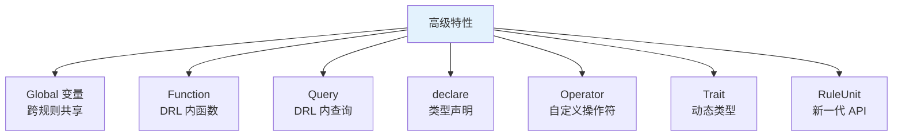
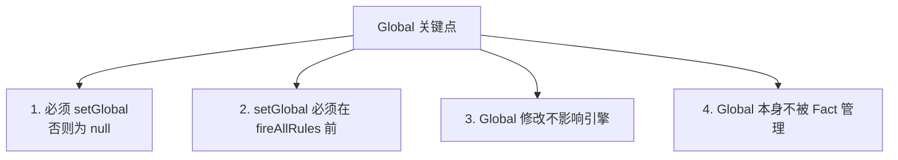
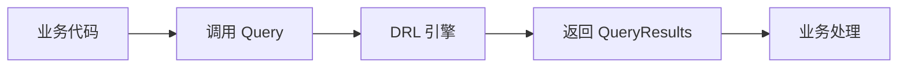
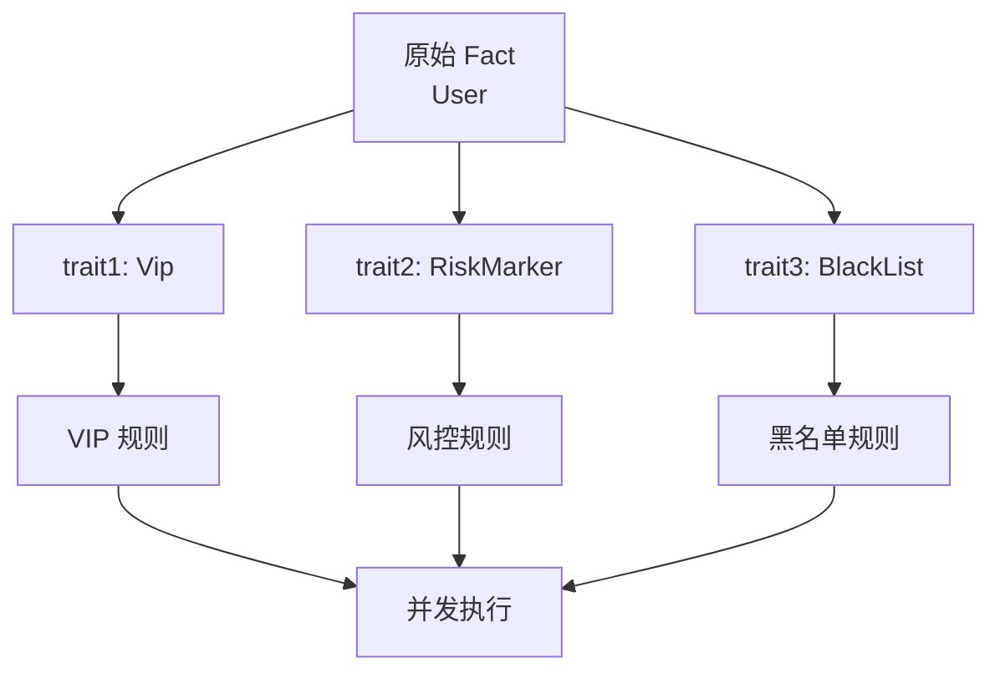
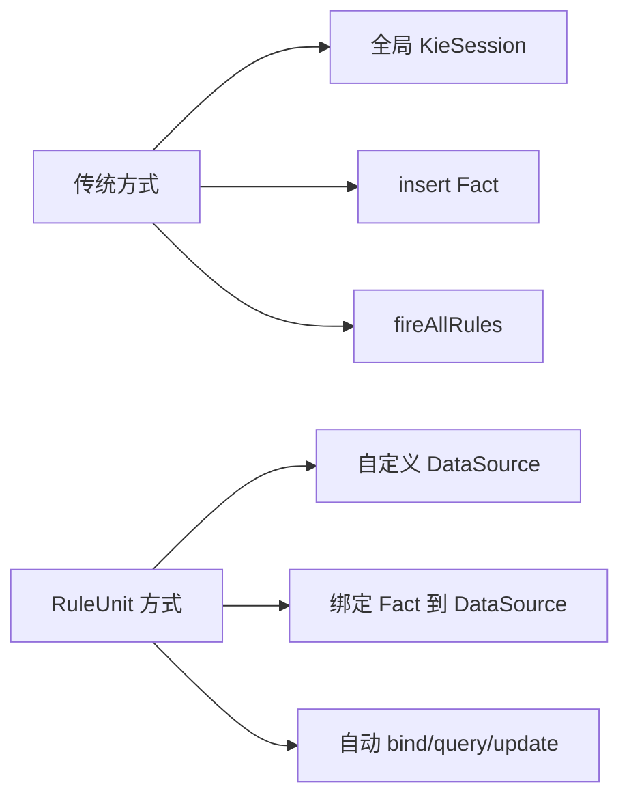

# 第四章 高级特性:Query、Function、RuleUnit

第二章讲了 DRL 的骨架,第三章讲了模式匹配。这一章讲 **DRL 的高级特性**——让你的规则文件能组织大型业务,能复用代码,能定义查询,能用更优雅的 RuleUnit 模式。

掌握本章,你才能写出**工程化、可维护、可测试**的规则集。

## 本章知识点地图



## 4.1 Global 全局变量

### 4.1.1 什么是 Global

**Global** 是 DRL 规则中**跨规则共享的对象引用**。

```drools
package com.example.rules

global com.example.service.NotificationService notificationService
global java.util.List globalResultList
```

### 4.1.2 声明与赋值

**DRL 中声明**:

```drools
global com.example.service.NotificationService notificationService
```

**Java 代码中赋值**:

```java
KieSession session = ...;
NotificationService notifService = new NotificationServiceImpl();

session.setGlobal("notificationService", notifService);
session.setGlobal("globalResultList", new ArrayList<>());
```

### 4.1.3 在 then 块中使用

```drools
rule "通知订单折扣"
    when
        $o: Order(amount > 1000)
    then
        notificationService.notify("订单 " + $o.getId() + " 享折扣");
        globalResultList.add($o);
end
```

### 4.1.4 Global 注意事项



**坑点**:

```text
❌ 反例:在 then 中修改 Global 想触发重算
rule "RULE"
    when
        notificationService.flag == true  // 这是绑定到 Global 的字段
    then
        notificationService.flag = false;  // 引擎不会重新评估!
end

✅ 正确:用 Fact 替代 Global 实现可变性
```

### 4.1.5 Global vs Fact

| 维度 | Global | Fact |
|------|--------|------|
| **可变性** | 直接修改不触发 | 修改+update 触发重匹配 |
| **持久性** | 在 Session 中存活 | 显式 insert/retract |
| **共享性** | 全 Session 共享 | 所有规则可见 |
| **使用场景** | 服务/工具类引用 | 业务数据 |

**最佳实践**:**Global 用于"工具/服务引用",Fact 用于"业务数据"**。

### 4.1.6 全局变量集合(返回结果)

```drools
global java.util.List results
```

```java
session.setGlobal("results", new ArrayList<>());
session.insert(order);
session.fireAllRules();
// results 中会包含规则执行时 add 的元素
```

**用途**:在 Stateless 场景下,收集规则执行的"输出结果"。

## 4.2 Function 函数

### 4.2.1 什么是 Function

DRL 内的**静态函数**,可被规则或 Java 代码调用。

```drools
function double calculateTax(double amount) {
    return amount * 0.06;
}

function boolean isVip(String level) {
    return "VIP".equals(level) || "SVIP".equals(level);
}
```

### 4.2.2 在规则中调用

```drools
rule "计算税金"
    when
        $o: Order(amount > 100)
    then
        double tax = calculateTax($o.getAmount());
        $o.setTax(tax);
end

rule "VIP 折扣"
    when
        $o: Order()
        eval(isVip($o.getCustomerLevel()))
    then
        $o.setDiscount(0.9);
end
```

### 4.2.3 在 Java 中调用

```java
import static com.example.drools.rules.Rules.*;  // 静态导入
// 或直接通过 KieBase 调用
```

**注意**:DRL Function 在编译后成为 Java 静态方法。

### 4.2.4 Function 的用途

| 场景 | 是否用 Function |
|------|-----------------|
| 简单工具函数(计算、判断) | ✅ 推荐 |
| 复杂业务逻辑 | ❌ 用 Java 类 |
| 调用静态工具类 | ❌ 直接 import |
| 需要被规则反复调用 | ✅ |

### 4.2.5 替代方案:静态方法直接 import

```java
// Java 类
public class MathUtil {
    public static double calculateTax(double amount) {
        return amount * 0.06;
    }
}
```

```drools
import com.example.util.MathUtil

rule "税金"
    when
        $o: Order()
    then
        $o.setTax(MathUtil.calculateTax($o.getAmount()));
end
```

**结论**:**简单计算用 Function(纯 DRL 工具),复杂业务用 Java 类(在 DRL 中 import)**。

## 4.3 Query 查询

### 4.3.1 什么是 Query

**Query** 是 DRL 中**预定义的查询**——从 Working Memory 中检索数据。

```drools
query "getVipOrders"
    $o: Order(customerLevel == "VIP")
end

query "getHighValueOrders"
    $o: Order(amount >= 10000)
end
```

### 4.3.2 在 Java 中调用

```java
KieSession session = ...;

QueryResults results = session.getQueryResults("getVipOrders");
for (QueryResultsRow row : results) {
    Order order = (Order) row.get("$o");
    System.out.println(order.getId());
}
```

### 4.3.3 带参数查询

```drools
query "getOrdersByCustomer" (String customerId)
    $o: Order(customerId == customerId)
end
```

**调用**:

```java
QueryResults results = session.getQueryResults("getOrdersByCustomer", "CUST-001");
```

### 4.3.4 多结果查询

```drools
query "getCustomerWithOrders" (String customerId)
    $c: Customer(id == customerId)
    $o: Order(customerId == customerId)
end
```

**调用**:

```java
QueryResults results = session.getQueryResults("getCustomerWithCustomer", "CUST-001");
for (QueryResultsRow row : results) {
    Customer customer = (Customer) row.get("$c");
    Order order = (Order) row.get("$o");
    // 一对多结果
}
```

### 4.3.5 Query 实际应用



**典型用法**:
- **业务代码查询符合规则的事实**(而不只是规则触发)
- **报表生成**(查询所有 VIP 订单)
- **业务校验**(查询历史订单,检查风控)

### 4.3.6 Query vs 普通 Pattern

| 维度 | Query | Pattern |
|------|-------|---------|
| **用途** | 查询数据 | 触发规则 |
| **执行时机** | 主动调用 | 引擎触发 |
| **返回值** | QueryResults | 规则副作用 |
| **性能** | 一次扫描 | 增量 |

**结论**:**Query 是"查询接口",Pattern 是"触发条件"**。

## 4.4 declare 类型声明

### 4.4.1 什么是 declare

**declare** 在 DRL 中**定义新的 Fact 类型**,无需 Java 类。

```drools
declare Order
    id : String
    amount : double
    status : String
end
```

**自动生成 Java 类** `Order`(在编译时)。

### 4.4.2 完整语法

```drools
declare Order
    @role(event)         // 元数据
    @timestamp(createTime)
    id : String @key     // 字段元数据
    amount : double
    status : String = "NEW"  // 默认值
end
```

### 4.4.3 元数据

| 元数据 | 含义 |
|--------|------|
| `@role(event)` | 标记为事件(CEP) |
| `@timestamp(fieldName)` | 时间戳字段 |
| `@expires(time)` | 过期时间 |
| `@key` | 唯一键(用于 join) |
| `@duration(fieldName)` | 持续时间 |

### 4.4.4 declare 与 Java 类的对比

| 维度 | declare | Java 类 |
|------|---------|---------|
| **位置** | DRL 内 | Java 文件 |
| **编译产物** | 自动生成 | 手动编写 |
| **IDE 支持** | 弱 | 强 |
| **类型安全** | 编译期检查 | 编译期检查 |
| **复用性** | 仅 DRL 内 | 全工程 |

**最佳实践**:**Fact 类用 Java(IDE 友好、IDE 补全),简单数据结构用 declare**。

### 4.4.5 enum 声明

```drools
declare enum OrderStatus
    NEW("新建"), 
    PAID("已支付"), 
    SHIPPED("已发货"), 
    CANCELLED("已取消")
end
```

**使用**:

```drools
when
    $o: Order(status == OrderStatus.PAID)
then
end
```

## 4.5 自定义 Operator(Evaluator)

### 4.5.1 什么是 Operator

**Operator** 是 DRL 中**自定义的比较运算符**——比如"在 5 公里内"、"年龄近似"、"字符串相似"。

### 4.5.2 实现自定义 Operator

```java
public class NearByEvaluator extends BaseEvaluator {
    public NearByEvaluator() {
        super();
    }

    @Override
    protected boolean test(Object value, String operator, Object target) {
        if ("nearby".equals(operator)) {
            // 检查 value 是否在 target 的 5 公里内
            Location loc1 = (Location) value;
            Location loc2 = (Location) target;
            return loc1.distanceTo(loc2) <= 5.0;
        }
        throw new IllegalArgumentException("不支持的操作符:" + operator);
    }

    @Override
    public String getType() {
        return Location.class.getName();
    }
}
```

### 4.5.3 注册 Operator

```java
KieBase kbase = ...;
((InternalRuleBase) kbase).addEvaluator(new NearByEvaluator());
```

### 4.5.4 在 DRL 中使用

```drools
when
    $user: User(homeAddress nearby $store.address)  // 检查家是否在店附近
then
    // 推荐附近门店
end
```

### 4.5.5 实际应用

```text
✅ 自定义 Operator 适用场景:
- 地理范围判断(附近、距离)
- 时间范围(最近 N 分钟内)
- 模糊匹配(相似度)
- 业务特定比较(优先级高于阈值)

❌ 不适用场景:
- 简单比较(直接用 ==、>=)
- 复杂逻辑(用 eval)
```

## 4.6 Trait 动态类型

### 4.6.1 什么是 Trait

**Trait** 让你**在运行时给 Fact 动态添加新类型**——同一对象可有多种"角色"。

```drools
declare trait RiskMarker
    riskLevel : int
end

declare trait Vip
    level : String
end
```

### 4.6.2 给 Fact 赋予 Trait

```drools
rule "标记 VIP"
    when
        $u: User(level == "VIP")
    then
        don($u, Vip, "GOLD")  // 给 User 添加 Vip Trait
end

rule "标记风险用户"
    when
        $u: User(riskScore > 80)
    then
        don($u, RiskMarker, 90)  // 给 User 添加 RiskMarker Trait
end
```

### 4.6.3 查询带 Trait 的 Fact

```drools
rule "处理 VIP 风险用户"
    when
        $u: User() // 默认 User
        $v: Vip() from $u  // 通过 from 拿到 Vip Trait
        $r: RiskMarker() from $u  // 拿到 RiskMarker
    then
        // VIP 但有风险 → 特殊审核
        System.out.println("VIP 用户有风险");
end
```

### 4.6.4 Trait 实战场景



**适用场景**:**同一 Fact 有多个角色**(VIP、风险用户、黑名单等)。

### 4.6.5 shad 属性

```drools
declare Vip
    @propertyReactive
    level : String
end

rule "VIP 升级"
    when
        $u: User(this == $v)
        $v: Vip(level == "GOLD")
    then
        modify($v) {
            setLevel("PLATINUM")
        }
end
```

## 4.7 RuleUnit API(Drools 7+)

### 4.7.1 什么是 RuleUnit

**RuleUnit** 是 Drools 7 引入的**新一代 API**——**面向对象**的规则组织方式。



### 4.7.2 定义 RuleUnit

```java
public class OrderUnit implements RuleUnitData {
    private final DataStore<Order> orders;
    private final DataStore<Customer> customers;

    public OrderUnit() {
        this.orders = DataSource.createStore();
        this.customers = DataSource.createStore();
    }

    public DataStore<Order> getOrders() { return orders; }
    public DataStore<Customer> getCustomers() { return customers; }
}
```

### 4.7.3 单元化规则

```drools
package com.example.units

unit OrderUnit

rule "VIP 订单折扣"
    when
        $o: Order(customerLevel == "VIP", amount > 1000) from $orders
    then
        modify($o) {
            setDiscount(0.9)
        }
end

rule "新客户优惠"
    when
        $o: Order() from $orders
        not Customer(id == $o.customerId) from $customers
    then
        modify($o) {
            setDiscount(0.95)
        }
end
```

**`unit OrderUnit` 标记本文件的所有规则属于 OrderUnit**。

### 4.7.4 Java 中调用

```java
public class RuleEngine {
    public void execute(OrderUnit unit) {
        KieSession session = ...;
        RuleUnitExecutor<OrderUnit> executor = RuleUnitExecutor.create(session);
        executor.run(unit);
    }

    public static void main(String[] args) {
        OrderUnit unit = new OrderUnit();

        Order order1 = new Order("ORD-001", 1500, "VIP");
        Order order2 = new Order("ORD-002", 500, "NORMAL");
        Customer cust = new Customer("CUST-001");

        unit.getOrders().add(order1);
        unit.getOrders().add(order2);
        unit.getCustomers().add(cust);

        new RuleEngine().execute(unit);
    }
}
```

### 4.7.5 RuleUnit vs 传统方式

| 维度 | 传统 KieSession | RuleUnit |
|------|-----------------|----------|
| **Fact 管理** | `session.insert()` | DataStore |
| **数据隔离** | 全 Session 共享 | 单元独立 |
| **类型安全** | 弱 | 强 |
| **测试性** | 中 | 高 |
| **学习曲线** | 简单 | 中等 |

### 4.7.6 DataSource 类型

| DataSource | 用途 |
|-----------|------|
| `DataSource.createStore()` | 单值存储(每个 rule 一次) |
| `DataSource.createStore()` | 集合存储 |
| `DataSource.createBufferedStore()` | 缓冲,所有数据触发一次 |
| `DataSource.createEntryPointStore(name)` | 从 entry-point 接收 |

### 4.7.7 适合用 RuleUnit 的场景

```text
✅ 推荐:
- 多数据源,需要隔离
- 复杂业务流,单元化设计
- 需要单元测试

❌ 不推荐:
- 简单场景(过度设计)
- 全局性规则(如"所有订单")
- 与现有代码耦合深
```

## 4.8 综合示例:电商规则集

### 4.8.1 项目结构

```text
src/main/resources/
├── com/example/rules/
│   ├── package-info.java
│   ├── order/
│   │   ├── OrderUnit.java        # Java 类
│   │   └── order-discount.drl    # unit OrderUnit
│   ├── customer/
│   │   ├── CustomerUnit.java
│   │   └── customer-tier.drl
│   └── risk/
│       └── risk-check.drl
└── META-INF/kmodule.xml
```

### 4.8.2 Java RuleUnit

```java
public class OrderUnit implements RuleUnitData {
    private final DataStore<Order> orders;
    private final DataStore<Coupon> coupons;
    private final DataStore<Result> results;

    public OrderUnit() {
        this.orders = DataSource.createStore();
        this.coupons = DataSource.createStore();
        this.results = DataSource.createStore();
    }

    // getters
    public DataStore<Order> getOrders() { return orders; }
    public DataStore<Coupon> getCoupons() { return coupons; }
    public DataStore<Result> getResults() { return results; }
}
```

### 4.8.3 规则文件

```drools
package com.example.rules.order

unit OrderUnit

query "results"
    $r: Result() from $results
end

rule "新用户首单优惠"
    when
        $o: Order() from $orders
        not Order(this != $o, customerId == $o.customerId) from $orders
    then
        Result r = new Result();
        r.setOrderId($o.getId());
        r.setDiscount(0.95);
        $results.add(r);
end

rule "VIP 大额折扣"
    when
        $o: Order(customerLevel == "VIP", amount > 10000) from $orders
    then
        Result r = new Result();
        r.setOrderId($o.getId());
        r.setDiscount(0.7);
        $results.add(r);
end
```

### 4.8.4 业务调用

```java
@Service
public class OrderService {
    @Autowired
    private KieSession session;

    public OrderResultDto process(Order order) {
        OrderUnit unit = new OrderUnit();
        unit.getOrders().add(order);

        RuleUnitExecutor<OrderUnit> executor = RuleUnitExecutor.create(session);
        executor.run(unit);

        // 收集结果
        OrderResultDto dto = new OrderResultDto();
        for (Result r : unit.getResults()) {
            if (r.getOrderId().equals(order.getId())) {
                dto.setDiscount(r.getDiscount());
            }
        }
        return dto;
    }
}
```

## 4.9 调试技巧

### 4.9.1 查看 Function 编译产物

DRL Function → 编译成 `静态方法`,class 名通常为 `<PackageName>.<RulePackageName>`。

### 4.9.2 单元测试 Query

```java
@Test
public void testQuery() {
    KieSession session = ...;
    session.insert(new Order("ORD-001", 1500, "VIP"));
    session.insert(new Order("ORD-002", 500, "NORMAL"));

    QueryResults results = session.getQueryResults("getVipOrders");
    assertEquals(1, results.size());
}
```

### 4.9.3 测试 RuleUnit

```java
@Test
public void testOrderUnit() {
    OrderUnit unit = new OrderUnit();
    unit.getOrders().add(new Order("ORD-001", 1500, "VIP"));

    KieSession session = ...;
    RuleUnitExecutor.create(session).run(unit);

    assertFalse(unit.getResults().isEmpty());
}
```

## 4.10 常见错误

### 4.10.1 Global 顺序

```text
❌ 反例:setGlobal 在 fireAllRules 之后
ksession.insert(order);
ksession.fireAllRules();
ksession.setGlobal("svc", service);  // 太晚!规则已执行完

✅ 正确:先 setGlobal 再 fire
ksession.setGlobal("svc", service);
ksession.insert(order);
ksession.fireAllRules();
```

### 4.10.2 Function 命名冲突

```text
❌ 反例:Function 名与 Java 类方法同名
function int max(int a, int b) {  // 与 Math.max 冲突
    return a > b ? a : b;
}

✅ 正确:用命名空间或不同名
function int myMax(int a, int b) {
    return a > b ? a : b;
}
```

### 4.10.3 RuleUnit Fact 未绑定

```text
❌ 反例:未在 DRL 中 from $orders
rule "RULE"
    when
        $o: Order()  // ❌ 未指定 from $orders
    then
end

✅ 正确
rule "RULE"
    when
        $o: Order() from $orders  // ✅
    then
end
```

## 小结 {#summary}

- **Global**:**跨规则共享的服务引用**(NotificationService 等),在 setGlobal 后可用。
- **Function**:**DRL 内的工具函数**,编译成 Java 静态方法。
- **Query**:**预定义查询**,用 `session.getQueryResults()` 调用,支持参数。
- **declare**:**DRL 内声明类型**,自动生成 Java 类,适合简单数据结构。
- **Operator**:**自定义比较符**(距离、模糊匹配等)。
- **Trait**:**运行时动态类型**,同一 Fact 可多重"角色"。
- **RuleUnit**:**面向对象的规则组织**,用 DataStore 隔离数据,**适合大型项目**。

下一章讲 **KIE 容器与 KieSession**——这是把规则**加载、运行、销毁**的核心机制,以及 Stateless vs Stateful 的选型、KieScanner 热加载等。