# 第五章 KIE 容器与 KieSession

第四章讲了 DRL 的高级语法。本章讲 **KIE API 的体系**——怎么加载、编译、运行规则,**Stateless 和 Stateful 的差异**,以及 Session 的完整生命周期。

掌握本章,你能把规则**正确加载到生产环境**,并理解每个 API 的角色。

## 本章知识点地图

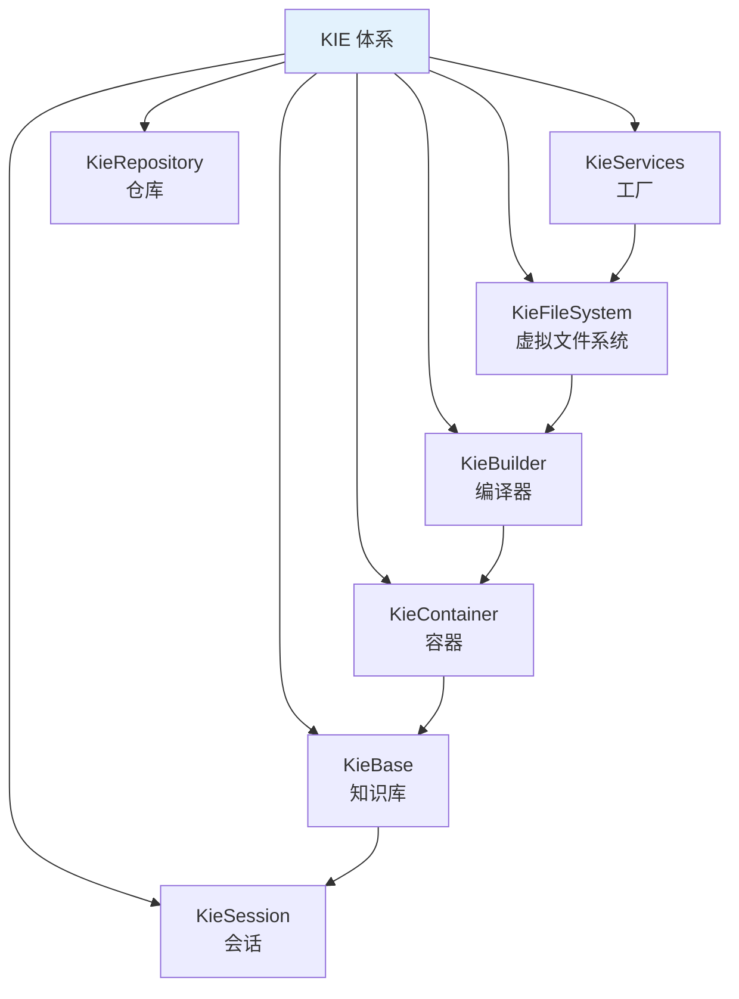

## 5.1 KIE 体系架构

### 5.1.1 完整类关系

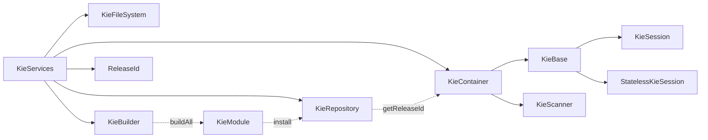

### 5.1.2 核心 API 角色

| API | 角色 | 生命周期 |
|-----|------|----------|
| **KieServices** | 工厂入口 | 单例 |
| **KieFileSystem** | 内存文件系统 | 单次构建 |
| **KieBuilder** | 编译器 | 单次构建 |
| **KieRepository** | KieModule 仓库 | 应用级 |
| **KieContainer** | KieModule 容器 | 应用级 |
| **KieBase** | 已编译规则库 | 应用级 |
| **KieSession** | 工作会话 | 请求级 |
| **StatelessKieSession** | 无状态会话 | 请求级 |

### 5.1.3 KieContainer 与 KieBase 关系

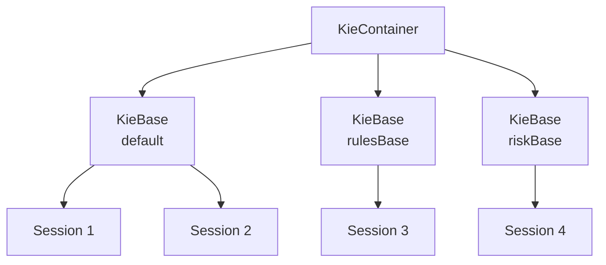

**理解**:**KieContainer 是 jar 级别,KieBase 是规则分组,KieSession 是会话实例**。

## 5.2 KieServices

### 5.2.1 获取 KieServices

```java
KieServices ks = KieServices.Factory.get();
```

**KieServices 是单例**——整个 JVM 只有一个实例。

### 5.2.2 KieServices 主要方法

```java
KieServices ks = KieServices.Factory.get();

// 创建文件系统
KieFileSystem kfs = ks.newKieFileSystem();

// 创建编译器
KieBuilder kb = ks.newKieBuilder(kfs);

// 创建容器(从已加载的 KieModule)
KieContainer kc = ks.newKieContainer(releaseId);

// 创建容器(从 classpath)
KieContainer kc = ks.getKieClasspathContainer();

// 创建 ReleaseId
ReleaseId releaseId = ks.newReleaseId(groupId, artifactId, version);
```

### 5.2.3 ReleaseId 版本标识

```java
ReleaseId releaseId = ks.newReleaseId(
    "com.example",      // groupId
    "my-rules",         // artifactId
    "1.0.0"             // version
);
```

**用途**:**唯一标识一个 KieModule**,配合 KieScanner 实现热加载。

## 5.3 KieFileSystem 虚拟文件系统

### 5.5.1 概念

**KieFileSystem** 是**内存中的文件系统**——把 DRL 文件、kmodule.xml 等"写"进来,再编译。

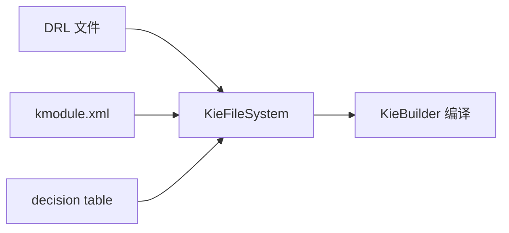

### 5.3.2 写入资源

```java
KieFileSystem kfs = ks.newKieFileSystem();

// 方式 1:从 classpath 资源
kfs.write(ks.getResources()
    .newClassPathResource("rules/order.drl"));

// 方式 2:从字节流
byte[] drlBytes = "...".getBytes();
kfs.write("src/main/resources/rules/order.drl", drlBytes);

// 方式 3:从字符串
kfs.write("src/main/resources/rules/order.drl",
    ks.getResources().newByteArrayResource(drlContent.getBytes()));

// 方式 4:从 URL
kfs.write(ks.getResources()
    .newURLResource("http://..."));
```

### 5.3.3 写入 kmodule.xml

```java
String kmoduleXml =
    "<?xml version=\"1.0\"?>\n" +
    "<kmodule xmlns=\"http://www.drools.org/xsd/kmodule\">\n" +
    "  <kbase name=\"rulesBase\" packages=\"rules\">\n" +
    "    <ksession name=\"rulesSession\"/>\n" +
    "  </kbase>\n" +
    "</kmodule>";

kfs.write("META-INF/kmodule.xml",
    ks.getResources().newByteArrayResource(kmoduleXml.getBytes()));
```

### 5.3.4 完整动态构建示例

```java
public KieContainer buildContainer() {
    KieServices ks = KieServices.Factory.get();
    KieFileSystem kfs = ks.newKieFileSystem();

    // 写入 DRL 文件
    String drl = "...";  // 从 DB 或 HTTP 加载
    kfs.write("src/main/resources/rules/order.drl",
        ks.getResources().newByteArrayResource(drl.getBytes()));

    // 写入 kmodule.xml
    kfs.write("META-INF/kmodule.xml",
        ks.getResources().newByteArrayResource(KMODULE_XML.getBytes()));

    // 编译
    KieBuilder kb = ks.newKieBuilder(kfs).buildAll();

    Results results = kb.getResults();
    if (results.hasMessages(Message.Level.ERROR)) {
        throw new RuntimeException("编译错误:" + results.getMessages());
    }

    // 安装到仓库
    KieModule kmodule = kb.getKieModule();
    ReleaseId releaseId = kmodule.getReleaseId();

    // 创建容器
    KieContainer kc = ks.newKieContainer(releaseId);
    return kc;
}
```

## 5.4 KieBuilder 编译器

### 5.4.1 用法

```java
KieBuilder kb = ks.newKieBuilder(kfs).buildAll();
```

**buildAll()** 编译所有资源。

### 5.4.2 检查编译结果

```java
Results results = kb.getResults();

if (results.hasMessages(Message.Level.ERROR)) {
    // 错误
    results.getMessages(Message.Level.ERROR).forEach(m ->
        System.err.println("ERROR: " + m.getText() + " @ " + m.getLine()));
}

if (results.hasMessages(Message.Level.WARNING)) {
    // 警告
    results.getMessages(Message.Level.WARNING).forEach(m ->
        System.out.println("WARN: " + m.getText()));
}
```

### 5.4.3 编译级别

```java
// 全编译
ks.newKieBuilder(kfs).buildAll();

// 编译指定类型
ks.newKieBuilder(kfs).build(
    BuildOption.UPDATE,           // 增量
    BuildOption.GENERATE_DESCRIPTOR,  // 生成描述符
    BuildOption.INTERNAL_JAVAPROJECT
);
```

### 5.4.4 编译产物

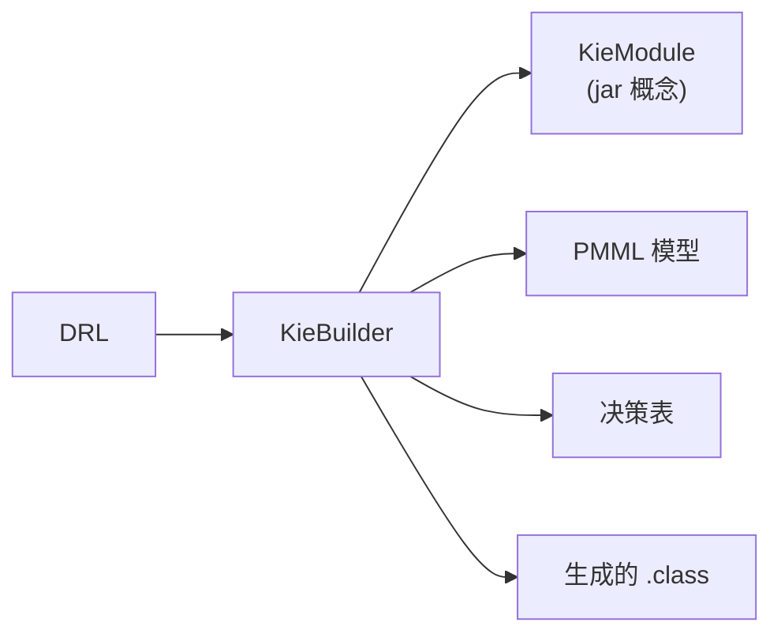

**KieModule** 是编译后的逻辑 jar,包含所有编译后的规则和元数据。

## 5.5 KieRepository 仓库

### 5.5.1 概念

**KieRepository** 是**KieModule 的中央仓库**,根据 ReleaseId 索引。

```java
// 查看仓库
KieRepository repo = ks.getRepository();
Collection<KieModule> modules = repo.getKieModules();
```

### 5.5.2 默认 KieModule

```java
KieRepository repo = ks.getRepository();
ReleaseId defaultReleaseId = repo.getDefaultReleaseId();  // 默认 ReleaseId
KieModule defaultModule = repo.getDefaultKieModule();      // 默认 KieModule
```

**默认 KieModule** 用于 classpath 加载(最常见)。

## 5.6 KieContainer 容器

### 5.6.1 三种创建方式

**方式 1:从 classpath 加载(最常见)**

```java
KieContainer kc = ks.getKieClasspathContainer();
```

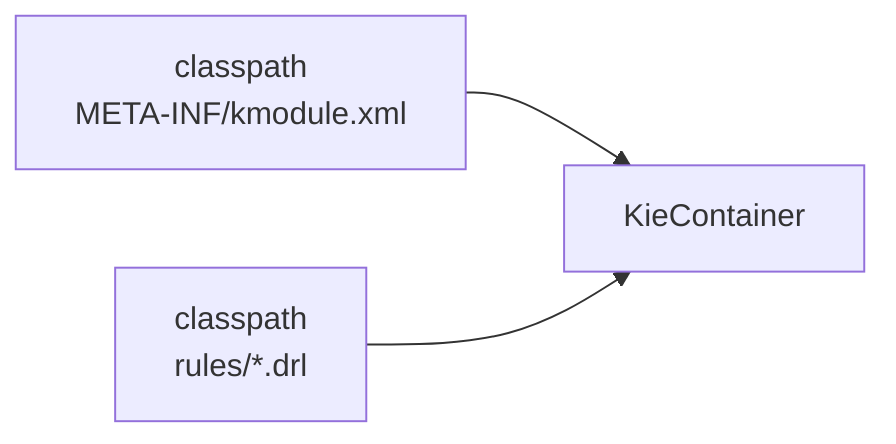

**方式 2:从 KieModule 创建**

```java
// 先编译得到 KieModule
KieModule module = ks.newKieBuilder(kfs).getKieModule();

// 创建容器
KieContainer kc = ks.newKieContainer(module.getReleaseId());
```

**方式 3:从 KieRepository 创建**

```java
KieRepository repo = ks.getRepository();
KieModule module = repo.getKieModule(releaseId);
KieContainer kc = ks.newKieContainer(releaseId);
```

### 5.6.2 从 KieContainer 获取 KieBase

```java
KieBase kbase = kc.getKieBase();  // 默认 KieBase
KieBase rulesBase = kc.getKieBase("rulesBase");  // 命名 KieBase
KieBase allBases = kc.getKieBaseFromKModule("...");  // 从 KieModule 获取
```

### 5.6.3 从 KieContainer 创建 Session

```java
KieSession ksession = kc.newKieSession();  // 默认 Session
StatelessKieSession stateless = kc.newStatelessKieSession();  // 默认无状态
KieSession ksession2 = kc.newKieSession("rulesSession");  // 命名 Session
```

### 5.6.4 KieContainer 与 KieBase 关系

```java
KieContainer kc = ...;

// 多个 KieBase 共享同一个 KieContainer
KieBase ordersBase = kc.getKieBase("orders");
KieBase riskBase = kc.getKieBase("risk");

// 不同 KieBase 的 Session 独立
KieSession orderSession = ordersBase.newKieSession();
KieSession riskSession = riskBase.newKieSession();
```

### 5.6.5 KieContainer 的代价

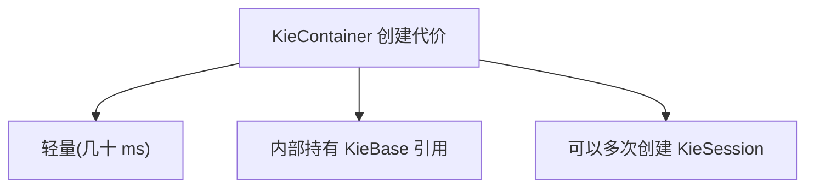

**KieContainer 是线程安全的**——可以全局共享一个 KieContainer,多个线程分别创建 KieSession。

## 5.7 KieBase 知识库

### 5.7.1 概念

**KieBase** 是**已编译的规则集合**——创建 Session 的"模板"。

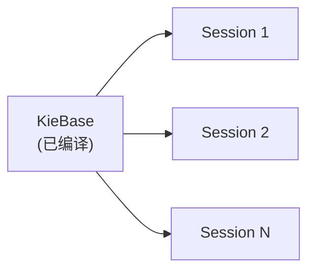

### 5.7.2 KieBase 主要功能

```java
KieBase kbase = ...;

// 创建 Session
KieSession session = kbase.newKieSession();

// 获取规则
Rule rule = kbase.getRule("com.example.rules", "RULE_NAME");
Collection<Rule> rules = kbase.getRules();

// Fact 类型
Collection<Class<?>> factTypes = kbase.getFactClasses();

// Process
KieBaseConfiguration config = kbase.getKieBaseConfiguration();
```

### 5.7.3 KieBaseConfiguration 配置

```java
KieBaseConfiguration config = ks.newKieBaseConfiguration();
// alpha 节点哈希
config.setOption(EqualityBehaviorOption.EQUALITY);
// 顺序断言
config.setOption(AssertBehaviorOption.EQUALITY);
// 执行顺序
config.setOption(ExecutionControlOption.STREAM);
```

**常用配置**:

| Option | 含义 |
|--------|------|
| `EqualityBehaviorOption.EQUALITY` | 对象相等性用 equals(默认) |
| `EqualityBehaviorOption.IDENTITY` | 对象相等性用 == |
| `SequentialOption.SEQUENTIAL` | 顺序模式(单线程优化) |
| `SequentialOption.DYNAMIC` | 动态模式(默认) |

### 5.7.4 顺序模式(性能优化)

```java
config.setOption(SequentialOption.SEQUENTIAL);
KieBase seqBase = kc.newKieBase(config);
```

**顺序模式**:只支持单线程,但性能提升明显(2-3 倍)。

```text
✅ 适用:
- 单线程处理
- 大数据量规则
- 性能要求高

❌ 不适用:
- 多线程并发
- 规则依赖网络效应
```

## 5.8 KieSession 有状态会话

### 5.8.1 概念

**KieSession** 是**有状态的工作会话**——可以多次 insert Fact,Fact 在 Session 中持续存在,直到显式 retract。

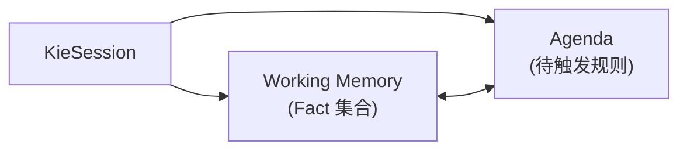

### 5.8.2 创建 Session

```java
KieSession session = kc.newKieSession();
// 或
KieSession session = kc.newKieSession("sessionName");
```

### 5.8.3 Fact 操作

```java
// 插入 Fact
FactHandle handle = session.insert(order);

// 更新 Fact(通知引擎 Fact 已变)
session.update(handle, modifiedOrder);
// 或 session.update(handle);  // 引用未变

// 删除 Fact
session.delete(handle);
// 或 session.retract(handle);  // 旧 API

// 通过对象删除
session.delete(order);

// 获取 Fact
Order retrieved = (Order) session.getObject(handle);
FactHandle lookupHandle = session.getFactHandle(order);
```

### 5.8.4 Session 方法

```java
// 执行规则
int fired = session.fireAllRules();          // 全部
int fired2 = session.fireAllRules(match);    // 指定 match
session.fireUntilHalt();                     // 一直触发(配合 until)

// 获取 Fact
Collection<FactHandle> handles = session.getFactHandles();
Object object = session.getObject(handle);
int size = session.getFactCount();

// Global 操作
session.setGlobal("name", value);
session.getGlobal("name");

// 销毁
session.dispose();
```

### 5.8.5 Session 生命周期

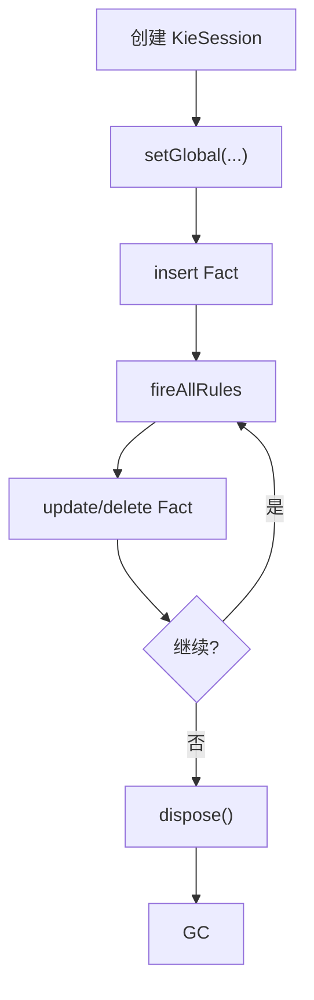

**关键点**:**必须 dispose**——释放 FactHandle、Agenda、Working Memory 等资源。

### 5.8.6 try-with-resources

Drools 7.57+ KieSession 实现 `AutoCloseable`:

```java
try (KieSession session = kc.newKieSession()) {
    session.insert(order);
    session.fireAllRules();
}  // 自动 dispose
```

### 5.8.7 KieSession 线程安全

```text
❌ KieSession 不是线程安全的
一个 Session 不能被多个线程并发访问

✅ KieContainer 是线程安全的
多个线程可以各自创建 KieSession

✅ StatelessKieSession 是线程安全的(每次执行独立)
```

**多线程场景**:

```java
// ❌ 错误:共享 KieSession
KieSession sharedSession = ...;
executor.submit(() -> sharedSession.insert(...));  // 危险!
executor.submit(() -> sharedSession.fireAllRules());  // 危险!

// ✅ 正确:每个线程独立 KieSession
KieContainer kc = ...;  // 线程安全
executor.submit(() -> {
    try (KieSession session = kc.newKieSession()) {
        session.insert(order);
        session.fireAllRules();
    }
});
```

## 5.9 StatelessKieSession 无状态会话

### 5.9.1 概念

**StatelessKieSession** 是**无状态**的——调用 `execute` 时传入 Fact,**内部自动 insert + fireAllRules + dispose**。

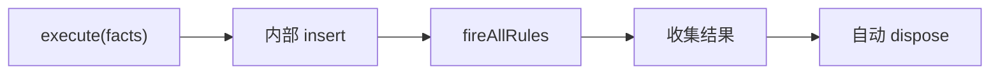

### 5.9.2 用法

```java
StatelessKieSession stateless = kc.newStatelessKieSession();

// 单次执行
stateless.execute(order);

// 批量执行(共享同一 KieBase 实例)
stateless.execute(Lists.newArrayList(order1, order2, order3));

// 链式
stateless.execute(order)
          .insert(order2)
          .execute();

// 回调
stateless.addEventListener(new RuleRuntimeEventListener() {
    @Override
    public void activationFired(ActivationFiredEvent event) {
        // 规则触发事件
    }
});
```

### 5.9.3 Stateless 的限制

```text
✅ Stateless 能做的:
- 一次传入所有 Fact
- 触发规则
- 收集 Global 结果

❌ Stateless 不能做的:
- 在多次调用间共享 Fact
- 手动 update/delete Fact
- fireUntilHalt
- 复杂业务流(需要 Stateful)
```

### 5.9.4 Stateless vs Stateful 对比

| 维度 | Stateless | Stateful |
|------|-----------|----------|
| **生命周期** | execute 后自动销毁 | 手动 dispose |
| **多次调用** | ❌ 每次独立 | ✅ 可多次 insert |
| **状态保留** | ❌ | ✅ |
| **适用场景** | 决策/计算 | 业务流 |
| **性能** | 略快 | 略慢 |
| **线程安全** | ✅ | ❌ |

**选择策略**:

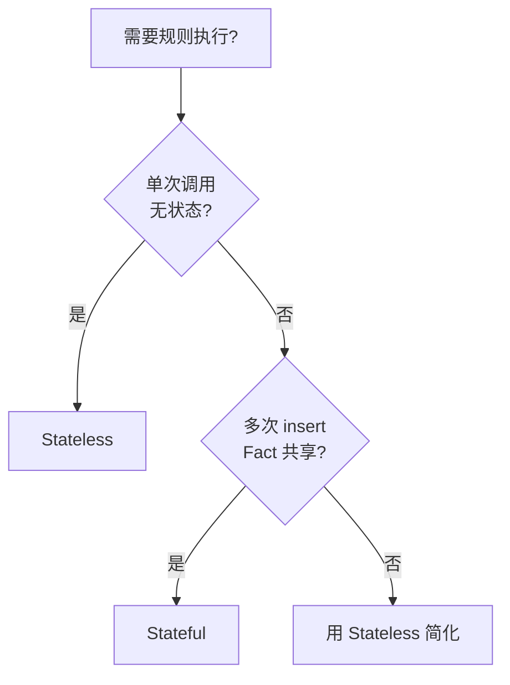

## 5.10 KieScanner 热加载

### 5.10.1 什么是 KieScanner

**KieScanner** 是 **Maven 仓库轮询器**——定时检查新版本 KieModule,有更新就重新加载。

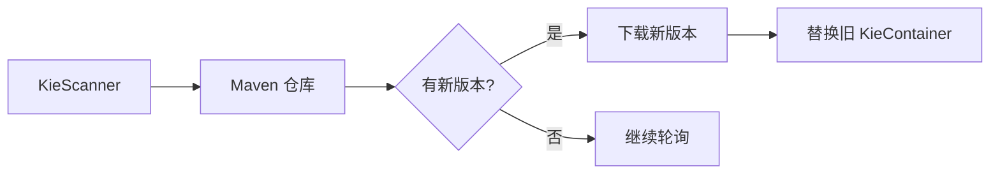

### 5.10.2 用法

```java
KieContainer kc = ks.newKieContainer(releaseId);
KieScanner scanner = ks.newKieScanner(kc);

// 启动后台轮询(每 60 秒检查一次)
scanner.start(60_000L);  // 60 秒

// 立即检查
scanner.scanNow();
```

### 5.10.3 KieScanner 配置

```java
KieScanner scanner = ks.newKieScanner(kc);
scanner.start(10_000L);  // 10 秒一次

// 性能优化
scanner.setPollOnlyOnChange(true);  // 仅在变更时回调
```

### 5.10.4 与 Maven 版本集成

**pom.xml**:

```xml
<groupId>com.example</groupId>
<artifactId>order-rules</artifactId>
<version>1.0.0-SNAPSHOT</version>
```

**Java 调用**:

```java
ReleaseId releaseId = ks.newReleaseId(
    "com.example",
    "order-rules",
    "1.0.0-SNAPSHOT"
);
KieContainer kc = ks.newKieContainer(releaseId);
KieScanner scanner = ks.newKieScanner(kc);
scanner.start(60_000L);
```

**部署新版本**:
1. 编译并 `mvn install` 新的 rules jar
2. KieScanner 检测到版本变更
3. 自动替换 KieContainer 内容

### 5.10.5 热加载替代方案

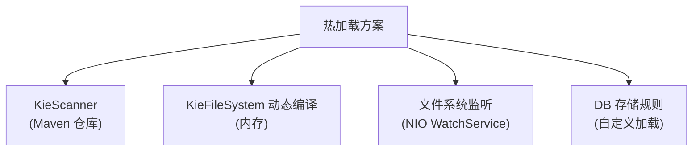

**方案对比**:

| 方案 | 适用场景 | 复杂度 |
|------|----------|--------|
| **KieScanner** | 已有 Maven 工程 | 低 |
| **动态 KieFileSystem** | 动态拼接规则 | 中 |
| **文件系统监听** | 规则文件独立部署 | 中 |
| **DB 存储** | 业务人员维护规则 | 高 |

## 5.11 KIE 与 Spring Boot

### 5.11.1 声明式 Kie 容器

```java
@Configuration
public class DroolsConfig {

    @Bean
    public KieContainer kieContainer() {
        KieServices ks = KieServices.Factory.get();
        return ks.getKieClasspathContainer();
    }
}
```

### 5.11.2 注入使用

```java
@Service
public class OrderService {

    @Autowired
    private KieContainer kieContainer;

    public OrderResultDto process(Order order) {
        try (KieSession session = kieContainer.newKieSession()) {
            session.insert(order);
            session.fireAllRules();
            // ...
        }
    }
}
```

**详细 Spring Boot 集成见第七章**。

## 5.12 实战:订单规则引擎

### 5.12.1 项目结构

```text
src/main/resources/
├── META-INF/kmodule.xml
└── rules/
    ├── order-discount.drl
    └── risk-check.drl
```

### 5.12.2 kmodule.xml

```xml
<?xml version="1.0" encoding="UTF-8"?>
<kmodule xmlns="http://www.drools.org/xsd/kmodule">
    <kbase name="orderRules" packages="rules">
        <ksession name="orderSession" type="stateful"/>
        <ksession name="orderStateless" type="stateless"/>
    </kbase>
</kmodule>
```

### 5.12.3 业务代码

```java
@Service
public class OrderRuleService {

    private final KieContainer kieContainer;

    public OrderRuleService(KieContainer kieContainer) {
        this.kieContainer = kieContainer;
    }

    public OrderResultDto applyDiscount(Order order) {
        try (KieSession session = kieContainer.newKieSession("orderSession")) {
            // 1. 设置 Global
            session.setGlobal("discountService", discountService);

            // 2. 插入 Fact
            FactHandle handle = session.insert(order);

            // 3. 触发规则
            int fired = session.fireAllRules();

            // 4. 收集结果
            return new OrderResultDto(order.getDiscount(), fired);
        }
    }
}
```

### 5.12.4 Stateless 简化

```java
public OrderResultDto applyDiscountStateless(Order order) {
    StatelessKieSession stateless =
        kieContainer.newStatelessKieSession("orderStateless");
    stateless.setGlobal("discountService", discountService);
    stateless.execute(order);
    return new OrderResultDto(order.getDiscount(), 0);
}
```

## 5.13 常见错误

### 5.13.1 忘记 dispose

```text
❌ 反例:不 dispose 导致内存泄漏
KieSession session = kc.newKieSession();
session.insert(order);
session.fireAllRules();
// 忘记 dispose!

✅ 正确:try-with-resources
try (KieSession session = kc.newKieSession()) {
    session.insert(order);
    session.fireAllRules();
}  // 自动 dispose
```

### 5.13.2 KieContainer 反复创建

```text
❌ 反例:每次请求都创建 KieContainer
@GetMapping("/check")
public void check() {
    KieContainer kc = KieServices.Factory.get().getKieClasspathContainer();  // 慢!
    // ...
}

✅ 正确:全局共享 KieContainer,按需创建 KieSession
@Autowired private KieContainer kc;  // Spring 管理
@GetMapping("/check")
public void check() {
    try (KieSession session = kc.newKieSession()) {
        session.insert(order);
        session.fireAllRules();
    }
}
```

### 5.13.3 KieSession 并发问题

```text
❌ 多线程共享 KieSession
KieSession session = ...;
new Thread(() -> session.insert(o1)).start();
new Thread(() -> session.fireAllRules()).start();

✅ 每线程独立 KieSession
KieContainer kc = ...;  // 共享容器
new Thread(() -> {
    try (KieSession session = kc.newKieSession()) {  // 独立 Session
        session.insert(o1);
        session.fireAllRules();
    }
}).start();
```

### 5.13.4 Stateless 的误解

```text
❌ 在 Stateless 上多次 insert
StatelessKieSession s = ...;
s.execute(order1);
s.insert(order2);  // ⚠️ Stateless 也支持 insert,但仅本次 execute 有效

✅ Stateless 只用于单次决策
// 多次决策用 Stateful
```

## 5.14 性能优化技巧

### 5.14.1 KieContainer 全局单例

```java
// Spring 中
@Bean
public KieContainer kieContainer() {
    return KieServices.Factory.get().getKieClasspathContainer();
}
```

### 5.14.2 Session 复用池

```java
public class KieSessionPool {
    private final BlockingQueue<KieSession> pool;
    private final KieContainer kc;

    public KieSession borrowSession() throws InterruptedException {
        KieSession s = pool.poll(100, TimeUnit.MILLISECONDS);
        if (s == null) {
            s = kc.newKieSession();
        }
        return s;
    }

    public void returnSession(KieSession s) {
        s.dispose();  // ⚠️ 不要复用有状态的 Session(数据污染)
        // Stateless 可复用
    }
}
```

**注意**:**Stateful Session 不建议复用**——上次的 Fact 会污染下次。

### 5.14.3 顺序模式

```java
KieBaseConfiguration config = ks.newKieBaseConfiguration();
config.setOption(SequentialOption.SEQUENTIAL);
KieBase seqBase = kc.newKieBase(config);
```

**性能提升**:简单规则集 2~3 倍。

### 5.14.4 assert behaviour

```java
config.setOption(AssertBehaviorOption.EQUALITY);
```

**Equality 模式**:**关闭 assert 检查**(假设 Fact 不变),性能更好。

## 小结 {#summary}

- **KIE 体系**:**KieServices → KieFileSystem → KieBuilder → KieContainer → KieBase → KieSession**。
- **KieContainer** 全局单例,**线程安全**;**KieBase** 由 KieContainer 创建;**KieSession** 按请求创建。
- **KieSession(有状态)**:**多次 insert/update/delete**,手动或自动 dispose。
- **StatelessKieSession(无状态)**:**execute 即结束**,自动 dispose,**适合一次性决策**。
- **KieScanner**:**Maven 仓库热加载**,60 秒轮询一次。
- **try-with-resources**:**自动 dispose**,推荐使用(Drools 7.57+)。

下一章讲 **实战案例:业务规则应用**——用一个完整的电商订单折扣系统,把前面所有知识点串起来,加上**热加载**、**版本管理**、**规则组织**等生产级实践。