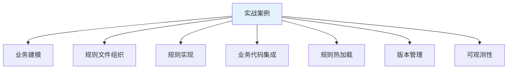
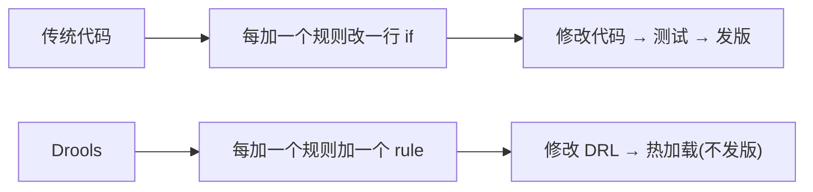
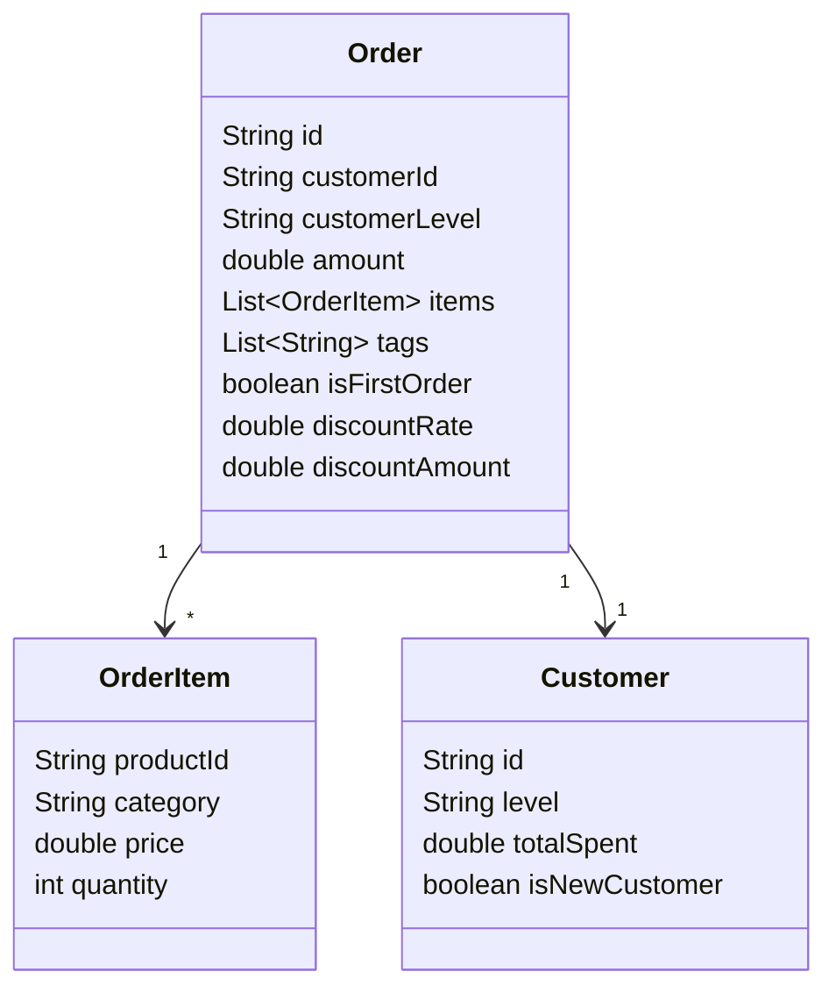
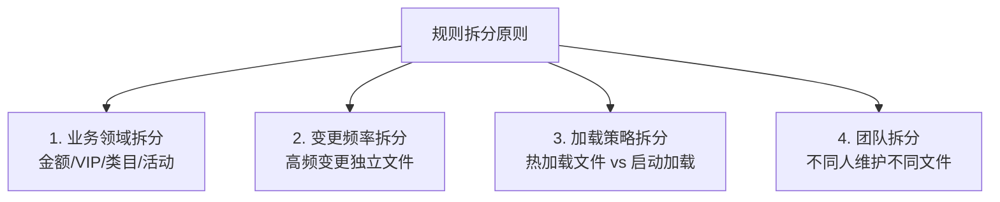
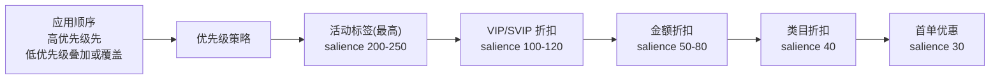
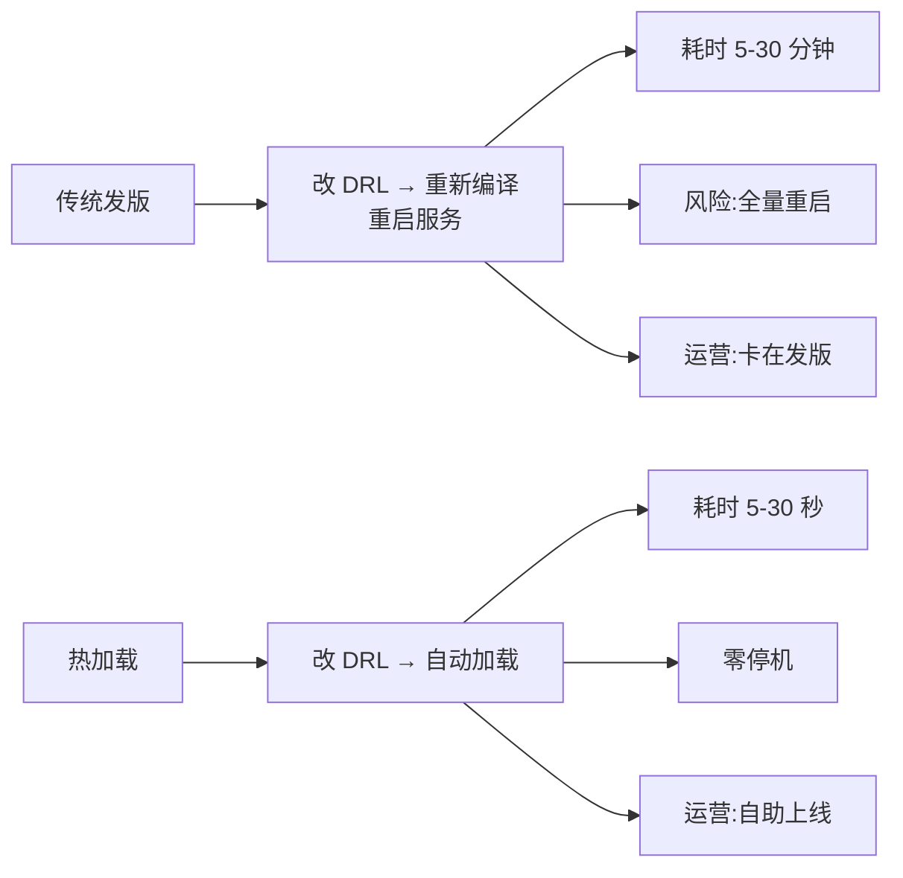
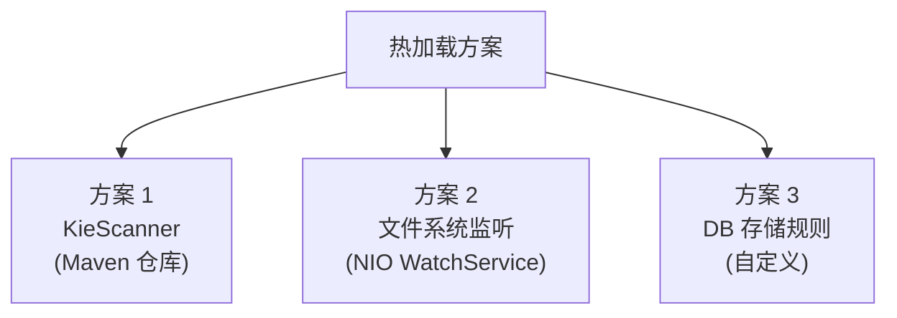
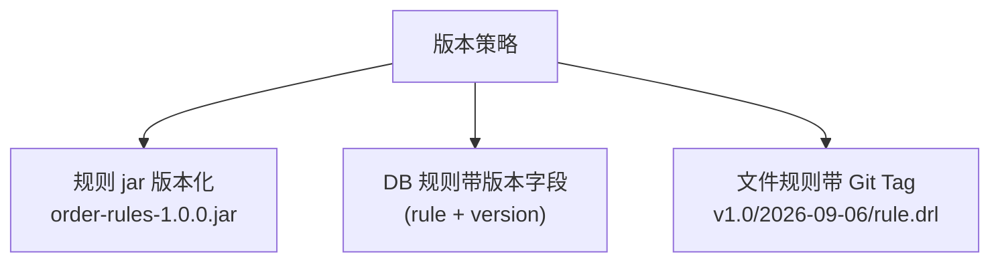
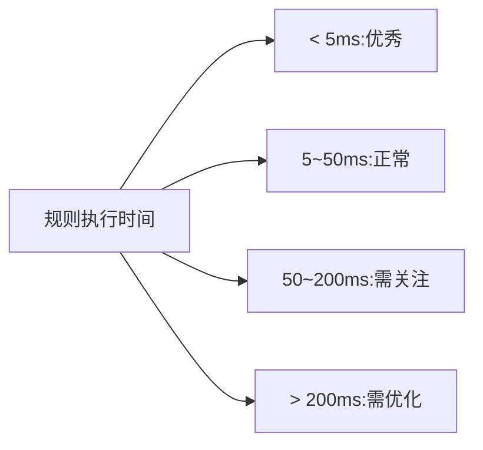
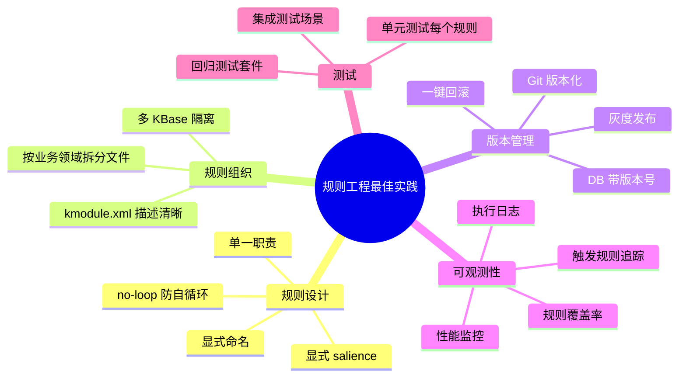

# 第六章 实战案例:业务规则应用

前五章讲了 DRL 语法、KIE 体系、模式匹配、RuleUnit。本章用**一个完整的电商订单折扣系统**把知识点串起来——**从需求分析、规则设计、规则组织、热加载、版本管理**,到**生产级工程实践**。

## 本章知识点地图



## 6.1 业务需求

### 6.1.1 业务背景

**电商订单折扣系统**:
- 多维度折扣:订单金额、用户等级、商品类目、活动标签
- 多种活动:满减、折扣、优惠券、限时特价
- 规则多变:运营每周更新活动策略

### 6.1.2 业务规则清单

| 规则类型 | 优先级 | 触发条件 | 输出 |
|----------|--------|----------|------|
| **满减** | 高 | 订单金额 ≥ 满减门槛 | 减免金额 |
| **VIP 折扣** | 中 | VIP 客户 | 折扣率 |
| **类目折扣** | 中 | 商品类目在促销列表 | 折扣率 |
| **新人优惠** | 低 | 新客户首单 | 折扣率 |
| **活动标签** | 高 | 订单含活动标签 | 折扣率 |

### 6.1.3 传统代码 vs 规则引擎

**传统 if-else 写法**:

```java
double discount = 1.0;
if (order.getAmount() >= 500 && order.getCustomerLevel().equals("NORMAL")) {
    discount = 0.95;
} else if (order.getAmount() >= 1000 && order.getCustomerLevel().equals("NORMAL")) {
    discount = 0.9;
} else if (order.getAmount() >= 1000 && order.getCustomerLevel().equals("VIP")) {
    discount = 0.8;
} else if (...) {  // 50 行代码
    ...
}
```

**Drools 写法**:

```drools
rule "NORMAL_500_DISCOUNT"
    salience 50
    when
        $o: Order(amount >= 500, amount < 1000, customerLevel == "NORMAL")
    then
        $o.setDiscount(0.95);
end
```

**对比**:



## 6.2 业务建模

### 6.2.1 Fact 类设计

**订单**:

```java
package com.example.shop.fact;

import java.time.LocalDateTime;
import java.util.List;

public class Order {
    private String id;
    private String customerId;
    private String customerLevel;  // NORMAL/VIP/SVIP
    private double amount;
    private List<OrderItem> items;
    private List<String> tags;  // 活动标签
    private LocalDateTime createTime;
    private boolean isFirstOrder;  // 是否首单

    // 折扣结果(由规则填充)
    private double discountRate = 1.0;  // 0.9 = 9 折
    private double discountAmount;       // 减免金额
    private String appliedRule;         // 应用的规则名

    // getter / setter / constructor / toString
}
```

**订单项**:

```java
public class OrderItem {
    private String productId;
    private String category;  // ELECTRONICS/CLOTHES/BOOK
    private double price;
    private int quantity;
}
```

**客户**:

```java
public class Customer {
    private String id;
    private String level;  // NORMAL/VIP/SVIP
    private double totalSpent;  // 历史累计消费
    private int orderCount;  // 历史订单数
    private boolean isNewCustomer;  // 是否新客户
}
```

**折扣规则(DTO)**:

```java
public class DiscountRule {
    private String name;
    private String type;  // AMOUNT/PERCENTAGE/COUPON
    private double threshold;
    private double value;
    private String[] applicableCategories;
    private String[] applicableLevels;
}
```

### 6.2.2 类关系图



## 6.3 规则文件组织

### 6.3.1 目录结构

```text
src/main/resources/
├── META-INF/
│   └── kmodule.xml
└── rules/
    ├── common.drl                    # 公共规则(全局)
    ├── order-amount.drl              # 金额折扣
    ├── order-vip.drl                 # VIP 折扣
    ├── order-category.drl            # 类目折扣
    ├── order-first.drl               # 首单优惠
    ├── order-coupon.drl              # 优惠券
    └── order-promotion.drl           # 限时活动
```

### 6.3.2 拆分的原则



### 6.3.3 kmodule.xml

```xml
<?xml version="1.0" encoding="UTF-8"?>
<kmodule xmlns="http://www.drools.org/xsd/kmodule">
    <!-- 订单规则 KBase -->
    <kbase name="orderRules" packages="rules">
        <ksession name="orderSession" type="stateful" clock-type="realtime"/>
        <ksession name="orderStateless" type="stateless"/>
    </kbase>

    <!-- 风控规则 KBase(独立) -->
    <kbase name="riskRules" packages="rules.risk">
        <ksession name="riskSession" type="stateful"/>
    </kbase>
</kmodule>
```

**设计要点**:
- **业务与风控拆分 KBase**:不同生命周期、不同访问权限
- **多个 Session**:不同业务场景可独立 Session

## 6.4 规则实现

### 6.4.1 common.drl(全局规则)

```drools
package com.example.shop.rules

import com.example.shop.fact.Order
import com.example.shop.fact.Customer
import com.example.shop.fact.OrderItem
import com.example.shop.service.NotificationService

// 全局服务引用
global NotificationService notificationService

// 工具函数
function double calculateAmount(List items) {
    return items.stream()
        .mapToDouble(item -> item.getPrice() * item.getQuantity())
        .sum();
}

function boolean hasTag(Order order, String tag) {
    return order.getTags() != null && order.getTags().contains(tag);
}

// 查询:大额订单
query "getLargeOrders"
    $o: Order(amount >= 10000)
end
```

### 6.4.2 order-amount.drl(金额折扣)

```drools
package com.example.shop.rules

import com.example.shop.fact.Order
import java.time.LocalDateTime
import java.time.DayOfWeek

rule "AMOUNT_500_DISCOUNT"
    salience 50
    no-loop true
    when
        $o: Order(amount >= 500, amount < 1000, discountRate == 1.0)
    then
        modify($o) {
            setDiscountRate(0.95),
            setAppliedRule("AMOUNT_500_DISCOUNT")
        }
        System.out.println("订单 " + $o.getId() + " 享 95 折(满 500)");
end

rule "AMOUNT_1000_DISCOUNT"
    salience 60
    no-loop true
    when
        $o: Order(amount >= 1000, amount < 5000, discountRate == 1.0)
    then
        modify($o) {
            setDiscountRate(0.9),
            setAppliedRule("AMOUNT_1000_DISCOUNT")
        }
end

rule "AMOUNT_5000_DISCOUNT"
    salience 70
    no-loop true
    when
        $o: Order(amount >= 5000, amount < 10000, discountRate == 1.0)
    then
        modify($o) {
            setDiscountRate(0.85),
            setAppliedRule("AMOUNT_5000_DISCOUNT")
        }
end

rule "AMOUNT_10000_DISCOUNT"
    salience 80
    no-loop true
    when
        $o: Order(amount >= 10000, discountRate == 1.0)
    then
        modify($o) {
            setDiscountRate(0.8),
            setAppliedRule("AMOUNT_10000_DISCOUNT")
        }
end
```

### 6.4.3 order-vip.drl(VIP 折扣)

```drools
package com.example.shop.rules

import com.example.shop.fact.Order
import com.example.shop.fact.Customer

// VIP 折扣优先级高于普通金额折扣
rule "VIP_BASIC_DISCOUNT"
    salience 100
    no-loop true
    when
        $o: Order(customerLevel == "VIP", discountRate >= 0.95)
    then
        modify($o) {
            setDiscountRate(0.9),
            setAppliedRule("VIP_BASIC_DISCOUNT")
        }
end

rule "SVIP_BASIC_DISCOUNT"
    salience 110
    no-loop true
    when
        $o: Order(customerLevel == "SVIP", discountRate >= 0.9)
    then
        modify($o) {
            setDiscountRate(0.85),
            setAppliedRule("SVIP_BASIC_DISCOUNT")
        }
end

rule "VIP_LARGE_ORDER_DISCOUNT"
    salience 120
    no-loop true
    when
        $o: Order(customerLevel in ("VIP", "SVIP"), amount >= 5000, discountRate >= 0.85)
    then
        modify($o) {
            setDiscountRate($o.getDiscountRate() * 0.95),
            setAppliedRule("VIP_LARGE_ORDER_DISCOUNT")
        }
end
```

### 6.4.4 order-first.drl(首单优惠)

```drools
package com.example.shop.rules

import com.example.shop.fact.Order
import com.example.shop.fact.Customer

rule "NEW_CUSTOMER_FIRST_ORDER"
    salience 30
    no-loop true
    when
        $o: Order(isFirstOrder == true, customerLevel == "NORMAL")
        $c: Customer(id == $o.customerId, isNewCustomer == true)
        eval($o.getAmount() < 10000)  // 大额不算首单优惠
    then
        modify($o) {
            setDiscountRate(0.8),
            setAppliedRule("NEW_CUSTOMER_FIRST_ORDER")
        }
        System.out.println("新客户首单优惠: " + $o.getId());
end
```

### 6.4.5 order-category.drl(类目折扣)

```drools
package com.example.shop.rules

import com.example.shop.fact.Order
import com.example.shop.fact.OrderItem
import java.util.List

// 类目折扣规则:电子产品 9 折
rule "ELECTRONICS_CATEGORY_DISCOUNT"
    salience 40
    no-loop true
    when
        $o: Order()
        $items: List() from collect(
            OrderItem(orderId == $o.id, category == "ELECTRONICS")
        )
        eval($items.size() > 0 && $o.getDiscountRate() > 0.9)
    then
        modify($o) {
            setDiscountRate(0.9),
            setAppliedRule("ELECTRONICS_CATEGORY_DISCOUNT")
        }
end
```

### 6.4.6 order-promotion.drl(限时活动)

```drools
package com.example.shop.rules

import com.example.shop.fact.Order
import java.time.LocalDate
import java.time.LocalDateTime

// 双 11 大促
rule "DOUBLE_11_PROMOTION"
    salience 200
    no-loop true
    when
        $o: Order(discountRate > 0.7)
        eval(LocalDate.now().getMonthValue() == 11 && 
             LocalDate.now().getDayOfMonth() == 11)
    then
        modify($o) {
            setDiscountRate($o.getDiscountRate() * 0.8),
            setAppliedRule("DOUBLE_11_PROMOTION")
        }
end

// 618 大促
rule "618_PROMOTION"
    salience 200
    no-loop true
    when
        $o: Order(discountRate > 0.7)
        eval(LocalDate.now().getMonthValue() == 6 && 
             LocalDate.now().getDayOfMonth() == 18)
    then
        modify($o) {
            setDiscountRate($o.getDiscountRate() * 0.85),
            setAppliedRule("618_PROMOTION")
        }
end

// 标签活动
rule "TAG_FLASH_SALE"
    salience 250
    no-loop true
    when
        $o: Order(tags contains "FLASH_SALE")
    then
        modify($o) {
            setDiscountRate(0.7),
            setAppliedRule("TAG_FLASH_SALE")
        }
end
```

### 6.4.7 规则冲突避免



**关键设计**:
- **条件约束** `discountRate == 1.0` 或 `discountRate >= 0.95`:避免规则反复触发
- **no-loop**:同一 Session 内规则不重复触发
- **discountRate 累加**:某些活动以叠加形式生效

## 6.5 业务代码集成

### 6.5.1 Service 层

```java
@Service
public class OrderDiscountService {

    private final KieContainer kieContainer;
    private final CustomerRepository customerRepository;
    private final NotificationService notificationService;

    public OrderDiscountService(
            KieContainer kieContainer,
            CustomerRepository customerRepository,
            NotificationService notificationService) {
        this.kieContainer = kieContainer;
        this.customerRepository = customerRepository;
        this.notificationService = notificationService;
    }

    public OrderResultDto calculateDiscount(Order order) {
        // 1. 查询客户信息(实际项目从 DB 查)
        Customer customer = customerRepository.findById(order.getCustomerId())
            .orElseThrow();

        // 2. 设置首单标记
        order.setFirstOrder(customer.isNewCustomer());

        // 3. 执行规则
        try (KieSession session = kieContainer.newKieSession("orderSession")) {
            // 全局服务
            session.setGlobal("notificationService", notificationService);

            // 插入 Fact
            session.insert(order);
            session.insert(customer);

            // 触发
            int fired = session.fireAllRules();

            // 4. 构造结果
            OrderResultDto result = new OrderResultDto();
            result.setOriginalAmount(order.getAmount());
            result.setDiscountRate(order.getDiscountRate());
            result.setDiscountAmount(order.getAmount() * (1 - order.getDiscountRate()));
            result.setFinalAmount(order.getAmount() * order.getDiscountRate());
            result.setAppliedRule(order.getAppliedRule());
            result.setRulesFired(fired);

            return result;
        }
    }
}
```

### 6.5.2 Controller 层

```java
@RestController
@RequestMapping("/orders")
public class OrderController {

    @Autowired
    private OrderDiscountService discountService;

    @PostMapping("/calculate")
    public OrderResultDto calculate(@RequestBody OrderRequest request) {
        Order order = new Order();
        order.setId(UUID.randomUUID().toString());
        order.setCustomerId(request.getCustomerId());
        order.setCustomerLevel(request.getCustomerLevel());
        order.setAmount(request.getAmount());
        order.setItems(request.getItems());
        order.setTags(request.getTags());
        order.setCreateTime(LocalDateTime.now());

        return discountService.calculateDiscount(order);
    }
}
```

### 6.5.3 测试用例

```java
@SpringBootTest
class OrderDiscountServiceTest {

    @Autowired
    private OrderDiscountService service;

    @Test
    void testNormalOrder500() {
        Order order = new Order();
        order.setCustomerId("CUST-001");
        order.setCustomerLevel("NORMAL");
        order.setAmount(800);

        OrderResultDto result = service.calculateDiscount(order);
        assertEquals(0.95, result.getDiscountRate());
        assertTrue(result.getAppliedRule().contains("AMOUNT_500"));
    }

    @Test
    void testVipOrder5000() {
        Order order = new Order();
        order.setCustomerId("CUST-VIP");
        order.setCustomerLevel("VIP");
        order.setAmount(5000);

        OrderResultDto result = service.calculateDiscount(order);
        // 金额折扣 + VIP 折扣
        assertTrue(result.getDiscountRate() <= 0.85);
    }
}
```

## 6.6 规则热加载

### 6.6.1 热加载的必要性



### 6.6.2 热加载三种方案



### 6.6.3 方案 1:KieScanner

**适用场景**:已有 Maven 工程,规则作为独立 jar。

**Maven pom**:

```xml
<groupId>com.example</groupId>
<artifactId>order-rules</artifactId>
<version>1.0.0-SNAPSHOT</version>
```

**Java 配置**:

```java
@Configuration
public class DroolsConfig {

    @Bean
    public KieContainer kieContainer() {
        KieServices ks = KieServices.Factory.get();
        ReleaseId releaseId = ks.newReleaseId(
            "com.example",
            "order-rules",
            "1.0.0-SNAPSHOT"
        );

        KieContainer kc = ks.newKieContainer(releaseId);

        // 启动 KieScanner
        KieScanner scanner = ks.newKieScanner(kc);
        scanner.start(10_000L);  // 10 秒轮询

        return kc;
    }
}
```

**更新流程**:
1. 修改 DRL 文件
2. `mvn install`(规则 jar 部署到本地仓库)
3. KieScanner 自动检测,10 秒内替换

### 6.6.4 方案 2:文件系统监听(NIO)

**适用场景**:规则以文件形式部署,运维友好。

```java
@Component
public class RuleFileWatcher {

    private final Path watchDir;
    private final KieServices ks = KieServices.Factory.get();
    private KieContainer kieContainer;

    @PostConstruct
    public void init() throws IOException {
        this.watchDir = Paths.get("/etc/drools/rules");

        WatchService watchService = FileSystems.getDefault().newWatchService();
        watchDir.register(watchService,
            StandardWatchEventKinds.ENTRY_MODIFY,
            StandardWatchEventKinds.ENTRY_CREATE);

        // 启动监听线程
        Thread.ofVirtual().name("rule-watcher").start(() -> watch(watchService));

        // 初始加载
        reload();
    }

    private void watch(WatchService watchService) {
        while (true) {
            try {
                WatchKey key = watchService.take();
                for (WatchEvent<?> event : key.pollEvents()) {
                    if (event.kind() == StandardWatchEventKinds.ENTRY_MODIFY) {
                        reload();  // 重新加载
                    }
                }
                key.reset();
            } catch (Exception e) {
                e.printStackTrace();
            }
        }
    }

    private synchronized void reload() throws IOException {
        KieFileSystem kfs = ks.newKieFileSystem();

        // 扫描所有 .drl 文件
        Files.walk(watchDir)
            .filter(p -> p.toString().endsWith(".drl"))
            .forEach(p -> {
                try {
                    String content = Files.readString(p);
                    String kmodulePath = p.toString().replace('\\', '/');
                    kfs.write("src/main/resources/" + kmodulePath,
                        ks.getResources().newByteArrayResource(content.getBytes()));
                } catch (IOException e) {
                    throw new RuntimeException(e);
                }
            });

        // 写入 kmodule.xml
        kfs.write("META-INF/kmodule.xml",
            ks.getResources().newByteArrayResource(KMODULE_XML.getBytes()));

        KieBuilder kb = ks.newKieBuilder(kfs).buildAll();
        if (kb.getResults().hasMessages(Message.Level.ERROR)) {
            throw new RuntimeException("规则编译失败");
        }

        KieModule module = kb.getKieModule();
        KieContainer newContainer = ks.newKieContainer(module.getReleaseId());

        // 原子替换
        KieContainer old = this.kieContainer;
        this.kieContainer = newContainer;
        if (old != null) old.dispose();
    }

    public KieContainer getKieContainer() {
        return kieContainer;
    }
}
```

### 6.6.5 方案 3:DB 存储规则

**适用场景**:业务人员可在线编辑规则。

```sql
CREATE TABLE drools_rule (
    id BIGINT PRIMARY KEY,
    name VARCHAR(200),
    rule_content TEXT,
    version INT,
    enabled BOOLEAN,
    created_at DATETIME,
    updated_at DATETIME
);
```

**加载器**:

```java
@Service
public class DbRuleLoader {

    @Autowired
    private DroolsRuleRepository ruleRepository;

    public KieContainer loadContainer() {
        KieServices ks = KieServices.Factory.get();
        KieFileSystem kfs = ks.newKieFileSystem();

        // 从 DB 加载所有启用的规则
        List<DroolsRule> rules = ruleRepository.findByEnabledTrue();

        for (DroolsRule rule : rules) {
            String path = "src/main/resources/db-rules/" + rule.getName() + ".drl";
            kfs.write(path,
                ks.getResources().newByteArrayResource(
                    rule.getRuleContent().getBytes()));
        }

        // kmodule.xml
        kfs.write("META-INF/kmodule.xml",
            ks.getResources().newByteArrayResource(KMODULE_XML.getBytes()));

        // 编译
        KieBuilder kb = ks.newKieBuilder(kfs).buildAll();
        if (kb.getResults().hasMessages(Message.Level.ERROR)) {
            throw new RuntimeException("规则编译失败");
        }

        return ks.newKieContainer(kb.getKieModule().getReleaseId());
    }

    public void refresh() {
        // 重新从 DB 加载,替换 KieContainer
    }
}
```

**后台定时刷新**:

```java
@Scheduled(fixedRate = 30_000)  // 30 秒
public void scheduleRefresh() {
    try {
        refresh();
    } catch (Exception e) {
        log.error("规则刷新失败,继续使用旧版本", e);
    }
}
```

### 6.6.6 热加载对比

| 方案 | 部署方式 | 热加载延迟 | 运维难度 | 业务友好 |
|------|----------|------------|----------|----------|
| **KieScanner** | Maven | 10 秒 | 中 | 中 |
| **文件系统** | 文件 | 实时 | 低 | 中 |
| **DB** | DB | 30 秒 | 中 | **高** |

### 6.6.7 热加载注意事项

```text
✅ 必备:
- 异常处理(规则编译失败时保留旧版本)
- 灰度发布(部分机器先加载)
- 回滚机制(保留历史版本)

❌ 避坑:
- 不在生产用本地文件路径
- 不允许编辑历史版本
- 不放过编译警告
```

## 6.7 规则版本管理

### 6.7.1 版本控制策略



### 6.7.2 DB 版本管理实现

```java
@Entity
@Table(name = "drools_rule")
public class DroolsRule {
    @Id
    private Long id;
    private String name;
    private String ruleContent;
    private Integer version;
    private Boolean enabled;
    private Boolean active;  // 当前激活版本
    private LocalDateTime createdAt;
    private LocalDateTime updatedAt;
}
```

**激活流程**:

```java
public void activateRule(Long ruleId) {
    // 1. 查询规则
    DroolsRule rule = ruleRepository.findById(ruleId).orElseThrow();

    // 2. 同名规则置为不激活
    ruleRepository.deactivateByName(rule.getName());

    // 3. 当前规则置为激活
    rule.setActive(true);
    ruleRepository.save(rule);

    // 4. 触发重新加载
    ruleLoader.refresh();
}
```

### 6.7.3 灰度发布

```java
public void enableRuleWithGray(Long ruleId, int grayPercent) {
    // 灰度开启(部分流量生效)
    DroolsRule rule = ruleRepository.findById(ruleId).orElseThrow();
    rule.setGrayPercent(grayPercent);
    ruleRepository.save(rule);

    // 改造 KieSession:基于灰度比例决定是否加载规则
}
```

### 6.7.4 回滚

```java
public void rollbackTo(Long versionId) {
    // 找到该版本的 rule
    // 重新激活
    // 重新加载 KieContainer
}
```

## 6.8 规则可观测性

### 6.8.1 规则执行日志

```java
public class AuditListener implements RuleRuntimeEventListener {

    private static final Logger log = LoggerFactory.getLogger(AuditListener.class);

    @Override
    public void activationFired(ActivationFiredEvent event) {
        log.info("规则触发: rule={}, facts={}",
            event.getRule().getName(),
            event.getFactHandles());
    }

    @Override
    public void objectInserted(ObjectInsertedEvent event) {
        log.debug("Fact 插入: {}", event.getObject());
    }
}

// 注册
session.addEventListener(new AuditListener());
```

### 6.8.2 监控指标(Micrometer)

```java
@Component
public class DroolsMetrics {

    private final MeterRegistry registry;
    private final Map<String, Counter> ruleCounters = new ConcurrentHashMap<>();

    public DroolsMetrics(MeterRegistry registry) {
        this.registry = registry;
    }

    public void recordRuleFired(String ruleName) {
        ruleCounters.computeIfAbsent(ruleName, k ->
            Counter.builder("drools.rule.fired")
                .tag("rule", k)
                .register(registry)
        ).increment();
    }

    public void recordSessionTime(long ms) {
        Timer.builder("drools.session.duration")
            .register(registry)
            .record(ms, TimeUnit.MILLISECONDS);
    }
}
```

### 6.8.3 规则执行追踪

```java
public class RuleExecutionContext {
    private String orderId;
    private List<String> firedRules;
    private long startTime;
    private long endTime;

    public void recordRule(String ruleName) {
        if (firedRules == null) firedRules = new ArrayList<>();
        firedRules.add(ruleName);
    }
}
```

```drools
rule "..."
    when
        ...
    then
        modify(...) {
            setRuleTrace(... + "RULE_A,")
        }
end
```

## 6.9 规则测试

### 6.9.1 单元测试模板

```java
@SpringBootTest
class OrderDiscountIntegrationTest {

    @Autowired
    private KieContainer kieContainer;

    @Test
    void testComplexScenario() {
        try (KieSession session = kieContainer.newKieSession()) {
            Order order = new Order();
            order.setId("ORD-TEST-001");
            order.setCustomerId("CUST-VIP");
            order.setCustomerLevel("VIP");
            order.setAmount(8000);
            order.setTags(List.of("FLASH_SALE"));

            Customer customer = new Customer();
            customer.setId("CUST-VIP");
            customer.setLevel("VIP");
            customer.setTotalSpent(50000);
            customer.setNewCustomer(false);

            session.insert(order);
            session.insert(customer);

            int fired = session.fireAllRules();

            // 断言
            assertEquals(0.7 * 0.85, order.getDiscountRate(), 0.001);  // FLASH + VIP + 金额
            assertEquals("TAG_FLASH_SALE", order.getAppliedRule());
        }
    }
}
```

### 6.9.2 回归测试套件

```java
@Suite
@SelectClasses({
    OrderAmountDiscountTest.class,
    OrderVipDiscountTest.class,
    OrderFirstOrderTest.class,
    OrderCategoryTest.class,
    OrderPromotionTest.class
})
class DroolsRegressionSuite {
}
```

### 6.9.3 规则覆盖率

```java
@Test
void testRuleCoverage() {
    Set<String> allRules = getAllRuleNames(kieContainer);
    Set<String> firedRules = new HashSet<>();

    // 跑各种测试
    for (TestCase test : testCases) {
        firedRules.addAll(runTest(test));
    }

    // 输出未触发的规则
    allRules.removeAll(firedRules);
    log.warn("未触发的规则: {}", allRules);
}
```

## 6.10 性能监控

### 6.10.1 规则执行时间

```java
public OrderResultDto calculateDiscount(Order order) {
    long start = System.currentTimeMillis();
    try {
        // ... 执行规则 ...
        long cost = System.currentTimeMillis() - start;
        metrics.recordSessionTime(cost);
        return result;
    } finally {
        // 记录
    }
}
```

### 6.10.2 性能基准



### 6.10.3 优化技巧

```text
✅ 优化手段:
1. 减少 Pattern 数量(大 Pattern 拆小)
2. 用 in 替代 ||
3. 用 exists 替代普通 Pattern
4. 避免 eval 中的复杂逻辑
5. 为高频字段建索引(@Indexed)
6. 启用 sequential 模式(单线程)
```

## 6.11 经验教训

### 6.11.1 常见项目陷阱

```text
❌ 1. 规则越写越多,变成屎山
✅ 拆分规则文件,按业务领域

❌ 2. 修改规则影响其他业务
✅ 用 agenda-group 隔离

❌ 3. 规则冲突,运营反馈"折扣不对"
✅ 显式 salience,明确优先级

❌ 4. 规则上线不通知开发
✅ 版本管理 + 发布审批

❌ 5. 规则性能差
✅ 监控 + 基准测试
```

### 6.11.2 推荐实践



## 小结 {#summary}

- **业务建模**:**Fact 类设计 + 类关系**,覆盖所有字段。
- **规则拆分**:**按业务领域 + 变更频率 + 加载策略**。
- **规则优先级**:**显式 salience + 条件约束 + no-loop**,避免冲突。
- **业务集成**:**Service 注入 KieContainer,try-with-resources 关闭 Session**。
- **热加载**:**KieScanner(Maven)/文件系统(NIO)/DB(自定义)** 三种方案按场景选。
- **版本管理**:**jar 版本号 / DB version / Git Tag**。
- **可观测性**:**执行日志 + 监控指标 + 规则追踪**。

下一章讲 **Drools 与 Spring Boot 集成**——生产级 Spring Boot 项目的完整配置,包括热加载、声明式 Kie、RuleRuntime Bean 等。