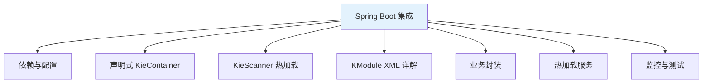
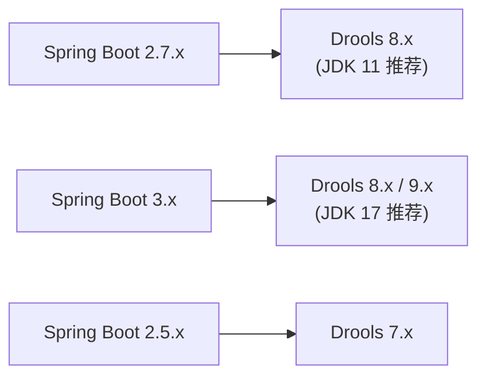
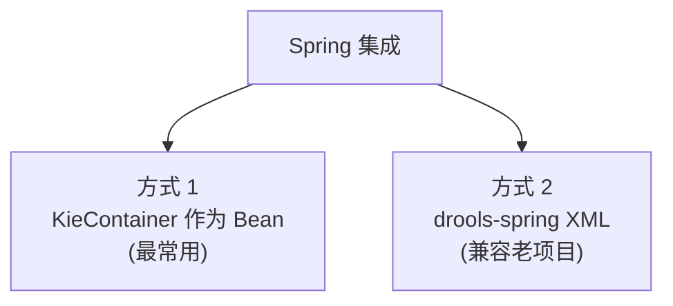
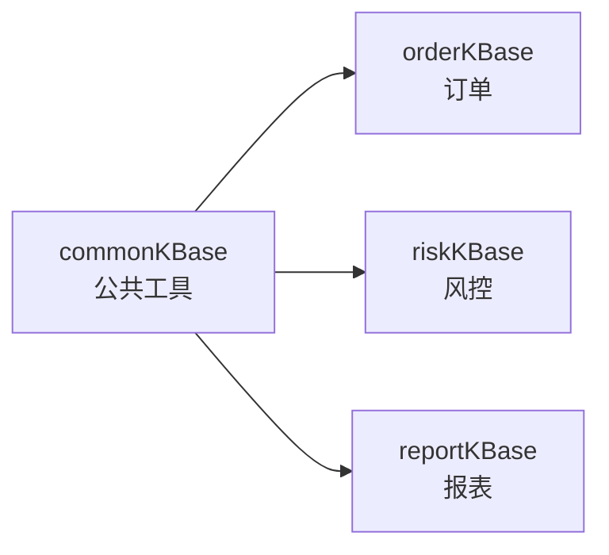
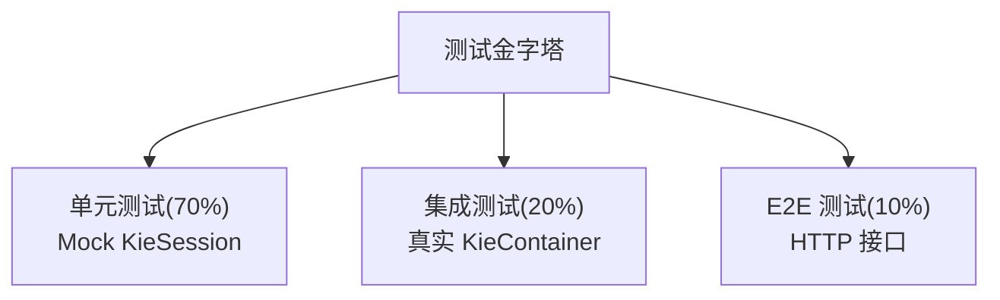

# 第七章 Drools 与 Spring Boot 集成

生产环境几乎都是 Spring Boot。这一章讲 **Drools + Spring Boot 的工程化集成**——从依赖、配置、声明式 Kie,到**热加载、单元测试、监控**的完整实现。

## 本章知识点地图



## 7.1 依赖与版本

### 7.1.1 Maven 依赖

```xml
<properties>
    <drools.version>8.44.0.Final</drools.version>
</properties>

<dependencies>
    <!-- Drools 核心 -->
    <dependency>
        <groupId>org.drools</groupId>
        <artifactId>drools-core</artifactId>
        <version>${drools.version}</version>
    </dependency>

    <dependency>
        <groupId>org.drools</groupId>
        <artifactId>drools-compiler</artifactId>
        <version>${drools.version}</version>
    </dependency>

    <!-- Spring Boot 集成 -->
    <dependency>
        <groupId>org.drools</groupId>
        <artifactId>drools-spring-2</artifactId>
        <version>${drools.version}</version>
    </dependency>

    <!-- 可选:决策表 -->
    <dependency>
        <groupId>org.drools</groupId>
        <artifactId>drools-decisiontables</artifactId>
        <version>${drools.version}</version>
    </dependency>

    <!-- 可选:DMN -->
    <dependency>
        <groupId>org.drools</groupId>
        <artifactId>drools-dmn</artifactId>
        <version>${drools.version}</version>
    </dependency>
</dependencies>
```

### 7.1.2 Spring Boot Starter(社区版)

```xml
<dependency>
    <groupId>com.github.hongvanyo</groupId>
    <artifactId>drools-spring-boot-starter</artifactId>
    <version>2.0.0</version>
</dependency>
```

**注意**:**官方没有提供 Spring Boot Starter**——社区维护。

### 7.1.3 版本对应



## 7.2 Spring 集成方式

### 7.2.1 两种集成方式



**推荐**:**方式 1(Spring Boot Java Config)**,简洁、可控。

### 7.2.2 传统 drools-spring XML(了解即可)

```xml
<beans xmlns="http://www.springframework.org/schema/beans"
       xmlns:drools="http://drools.org/schema/drools-spring"
       xsi:schemaLocation="...">

    <drools:kbase id="kbase">
        <drools:resources>
            <drools:resource type="DRL" source="classpath:rules/order.drl"/>
        </drools:resources>
    </drools:kbase>

    <drools:ksession id="ksession" type="stateful" kbase="kbase"/>
</beans>
```

**现状**:**Spring Boot 时代已少用**,Java Config 更灵活。

## 7.3 Java Config 声明式 KieContainer

### 7.3.1 基础配置

```java
@Configuration
public class DroolsConfig {

    @Bean
    public KieContainer kieContainer() {
        return KieServices.Factory.get().getKieClasspathContainer();
    }
}
```

**这是最简形式**——从 classpath 加载 `META-INF/kmodule.xml`。

### 7.3.2 多 KBase 配置

```java
@Configuration
public class DroolsConfig {

    @Bean
    @Primary
    public KieContainer orderKieContainer() {
        return loadContainer("order-rules");
    }

    @Bean("riskKieContainer")
    public KieContainer riskKieContainer() {
        return loadContainer("risk-rules");
    }

    private KieContainer loadContainer(String moduleName) {
        KieServices ks = KieServices.Factory.get();
        ReleaseId releaseId = ks.newReleaseId(
            "com.example",
            moduleName,
            "1.0.0-SNAPSHOT"
        );
        return ks.newKieContainer(releaseId);
    }
}
```

### 7.3.3 KieBaseConfiguration

```java
@Configuration
public class DroolsConfig {

    @Bean
    public KieBase orderKieBase(KieContainer kieContainer) {
        KieBaseConfiguration config = KieServices.Factory.get()
            .newKieBaseConfiguration();
        config.setOption(SequentialOption.SEQUENTIAL);
        return kieContainer.newKieBase(config);
    }
}
```

### 7.3.4 KieScanner 集成

```java
@Configuration
public class DroolsConfig {

    @Bean
    public KieContainer kieContainer() {
        KieServices ks = KieServices.Factory.get();
        ReleaseId releaseId = ks.newReleaseId(
            "com.example", "order-rules", "1.0.0-SNAPSHOT"
        );

        KieContainer kieContainer = ks.newKieContainer(releaseId);

        // 启动 KieScanner
        KieScanner kieScanner = ks.newKieScanner(kieContainer);
        kieScanner.start(10_000L);  // 10 秒扫描一次

        return kieContainer;
    }
}
```

### 7.3.5 Spring Boot 启动事件

```java
@Component
public class DroolsStartupListener implements ApplicationListener<ApplicationReadyEvent> {

    private static final Logger log = LoggerFactory.getLogger(DroolsStartupListener.class);

    @Autowired
    private KieContainer kieContainer;

    @Override
    public void onApplicationEvent(ApplicationReadyEvent event) {
        // 应用启动完成,执行一次规则预热
        warmupRules();
    }

    private void warmupRules() {
        log.info("Drools 规则预热开始");
        try (KieSession session = kieContainer.newKieSession()) {
            // 预热:触发所有规则的初始化(JIT 编译)
            KieBase kieBase = kieContainer.getKieBase();
            for (Rule rule : kieBase.getRules()) {
                log.info("加载规则: {}", rule.getName());
            }
        }
        log.info("Drools 规则预热完成");
    }
}
```

## 7.4 业务封装

### 7.4.1 KieService 封装

```java
@Service
public class KieRuleService {

    private final KieContainer kieContainer;

    public KieRuleService(KieContainer kieContainer) {
        this.kieContainer = kieContainer;
    }

    /**
     * 执行有状态规则(业务流)
     */
    public <T> T executeStateful(String sessionName,
                                  List<Object> facts,
                                  Function<KieSession, T> action) {
        try (KieSession session = kieContainer.newKieSession(sessionName)) {
            facts.forEach(session::insert);
            return action.apply(session);
        }
    }

    /**
     * 执行无状态规则(决策/计算)
     */
    public void executeStateless(String sessionName, List<Object> facts) {
        StatelessKieSession session = kieContainer.newStatelessKieSession(sessionName);
        session.execute(facts);
    }
}
```

### 7.4.2 业务 Service 使用

```java
@Service
public class OrderDiscountService {

    private final KieRuleService ruleService;

    public OrderDiscountService(KieRuleService ruleService) {
        this.ruleService = ruleService;
    }

    public OrderResultDto calculateDiscount(Order order) {
        return ruleService.executeStateful(
            "orderSession",
            List.of(order),
            session -> {
                session.setGlobal("notificationService", notificationService);
                session.fireAllRules();

                OrderResultDto result = new OrderResultDto();
                result.setDiscountRate(order.getDiscountRate());
                result.setFinalAmount(order.getAmount() * order.getDiscountRate());
                return result;
            }
        );
    }
}
```

### 7.4.3 Global 注入

```java
@Component
public class DroolsGlobalInjector implements ApplicationContextAware {

    @Autowired
    private KieContainer kieContainer;

    private ApplicationContext context;

    @Override
    public void setApplicationContext(ApplicationContext context) {
        this.context = context;
    }

    public KieSession createSession(String sessionName) {
        KieSession session = kieContainer.newKieSession(sessionName);

        // 自动注入所有标注了 @DroolsGlobal 的 Bean
        Map<String, Object> globals = context.getBeansWithAnnotation(DroolsGlobal.class);
        for (Map.Entry<String, Object> entry : globals.entrySet()) {
            DroolsGlobal annotation = entry.getValue().getClass()
                .getAnnotation(DroolsGlobal.class);
            session.setGlobal(annotation.value(), entry.getValue());
        }

        return session;
    }
}

// 自定义注解
@Target(ElementType.TYPE)
@Retention(RetentionPolicy.RUNTIME)
public @interface DroolsGlobal {
    String value();
}

// 使用
@DroolsGlobal("notificationService")
@Service
public class NotificationServiceImpl implements NotificationService {
    // ...
}
```

## 7.5 KModule 详解

### 7.5.1 完整 kmodule.xml

```xml
<?xml version="1.0" encoding="UTF-8"?>
<kmodule xmlns="http://www.drools.org/xsd/kmodule">

    <!-- 订单规则 KBase -->
    <kbase name="orderKBase"
           packages="rules.order"
           includes=""
           default="true">

        <!-- 状态配置 -->
        <configuration>
            <property key="equalityBehavior" value="EQUALITY"/>
            <property key="sequential" value="false"/>
        </configuration>

        <!-- 有状态 Session -->
        <ksession name="orderSession"
                  type="stateful"
                  default="true"
                  clockType="realtime">
            <consoleLogger/>
        </ksession>

        <!-- 无状态 Session -->
        <ksession name="orderStateless"
                  type="stateless"
                  default="false"/>
    </kbase>

    <!-- 风控规则 KBase -->
    <kbase name="riskKBase"
           packages="rules.risk">

        <ksession name="riskSession"
                  type="stateful"
                  clockType="pseudo">
            <workItemHandlers>
                <workItemHandler name="Notify" type="com.example.RiskNotifyHandler"/>
            </workItemHandlers>
        </ksession>
    </kbase>

    <!-- 公共规则 KBase(被其他 KBase 引用) -->
    <kbase name="commonKBase"
           packages="rules.common"
           includes="">
        <ksession name="commonSession" type="stateless"/>
    </kbase>
</kmodule>
```

### 7.5.2 关键属性

| 属性 | 含义 | 示例 |
|------|------|------|
| `name` | KieBase 名字 | "orderKBase" |
| `packages` | 扫描的包名 | "rules.order" |
| `includes` | 引用的其他 KBase | "commonKBase" |
| `default` | 是否默认 KieBase | "true" |
| `eventProcessingMode` | 事件处理模式 | "stream" / "cloud" |
| `equalityBehavior` | 相等性 | "EQUALITY" / "IDENTITY" |

### 7.5.3 多个 KBase 共享规则

```xml
<!-- 公共规则 -->
<kbase name="commonKBase" packages="rules.common"/>

<!-- 业务规则引用公共 -->
<kbase name="orderKBase" packages="rules.order" includes="commonKBase"/>
<kbase name="riskKBase" packages="rules.risk" includes="commonKBase"/>
```



**好处**:**公共函数、查询、规则**多个 KBase 共享。

### 7.5.4 clockType 类型

| 类型 | 含义 |
|------|------|
| `realtime` | 实时时钟(默认) |
| `pseudo` | 伪时钟(可手动推进) |

**伪时钟**:适合回测/历史场景模拟。

```java
SessionPseudoClock clock = ksession.getSessionClock();
clock.advanceTime(1000, TimeUnit.MILLISECONDS);
```

## 7.6 KieScanner 热加载

### 7.6.1 Spring Boot 集成

```java
@Configuration
public class DroolsHotReloadConfig {

    private static final Logger log = LoggerFactory.getLogger(DroolsHotReloadConfig.class);

    @Bean
    public KieContainer kieContainer() {
        KieServices ks = KieServices.Factory.get();
        ReleaseId releaseId = ks.newReleaseId(
            "com.example", "order-rules", "1.0.0-SNAPSHOT"
        );
        KieContainer kc = ks.newKieContainer(releaseId);
        return kc;
    }

    @Bean(destroyMethod = "stop")
    public KieScanner kieScanner(KieContainer kieContainer) {
        KieServices ks = KieServices.Factory.get();
        KieScanner scanner = ks.newKieScanner(kieContainer);
        scanner.start(10_000L);  // 10 秒
        log.info("KieScanner 已启动,10 秒扫描一次");
        return scanner;
    }
}
```

### 7.6.2 手动触发扫描

```java
@RestController
@RequestMapping("/admin/rules")
public class RuleAdminController {

    @Autowired
    private KieScanner kieScanner;

    @PostMapping("/reload")
    public ResponseEntity<String> reload() {
        kieScanner.scanNow();
        return ResponseEntity.ok("reload triggered");
    }
}
```

### 7.6.3 自定义热加载(不依赖 Maven)

```java
@Component
public class CustomRuleHotLoader {

    private final KieServices ks = KieServices.Factory.get();
    private volatile KieContainer kieContainer;

    @Autowired
    private RuleFileService ruleFileService;

    @Value("${drools.rules.path:classpath:rules}")
    private String rulesPath;

    @PostConstruct
    public void init() throws IOException {
        reload();
    }

    /**
     * 重新加载所有规则
     */
    public synchronized void reload() throws IOException {
        KieFileSystem kfs = ks.newKieFileSystem();

        // 1. 加载所有 .drl 文件
        List<RuleFile> files = ruleFileService.findEnabled();
        for (RuleFile file : files) {
            String path = "src/main/resources/rules/" + file.getName();
            kfs.write(path,
                ks.getResources().newByteArrayResource(
                    file.getContent().getBytes()));
        }

        // 2. 写入 kmodule.xml
        String kmoduleXml = buildKmoduleXml(files);
        kfs.write("META-INF/kmodule.xml",
            ks.getResources().newByteArrayResource(kmoduleXml.getBytes()));

        // 3. 编译
        KieBuilder kb = ks.newKieBuilder(kfs).buildAll();
        Results results = kb.getResults();
        if (results.hasMessages(Message.Level.ERROR)) {
            log.error("规则编译失败: {}", results.getMessages());
            throw new RuntimeException("规则编译失败");
        }

        // 4. 原子替换 KieContainer
        KieContainer newContainer = ks.newKieContainer(
            kb.getKieModule().getReleaseId());

        KieContainer old = this.kieContainer;
        this.kieContainer = newContainer;
        if (old != null) old.dispose();

        log.info("规则重新加载完成,共 {} 条规则",
            newContainer.getKieBase().getRules().size());
    }

    public KieContainer getKieContainer() {
        return kieContainer;
    }
}
```

### 7.6.4 HTTP 接口触发热加载

```java
@RestController
@RequestMapping("/admin/rules")
public class RuleAdminController {

    @Autowired
    private CustomRuleHotLoader loader;

    @PostMapping("/reload")
    public ResponseEntity<Map<String, Object>> reload() {
        try {
            loader.reload();
            return ResponseEntity.ok(Map.of(
                "status", "success",
                "rulesCount", loader.getKieContainer().getKieBase().getRules().size()
            ));
        } catch (Exception e) {
            return ResponseEntity.status(500).body(Map.of(
                "status", "error",
                "message", e.getMessage()
            ));
        }
    }

    @GetMapping("/status")
    public ResponseEntity<Map<String, Object>> status() {
        KieContainer kc = loader.getKieContainer();
        return ResponseEntity.ok(Map.of(
            "rulesCount", kc.getKieBase().getRules().size(),
            "kbaseCount", kc.getKieBases().size()
        ));
    }
}
```

### 7.6.5 定时热加载(可选)

```java
@Configuration
@EnableScheduling
public class ScheduleConfig {}

@Component
public class RuleHotReloadScheduler {

    @Autowired
    private CustomRuleHotLoader loader;

    @Scheduled(fixedRate = 60_000)  // 每分钟
    public void schedule() {
        try {
            loader.reload();
        } catch (Exception e) {
            log.error("定时重载规则失败", e);
        }
    }
}
```

## 7.7 KIE 异常处理

### 7.7.1 全局异常捕获

```java
@ControllerAdvice
public class DroolsExceptionHandler {

    private static final Logger log = LoggerFactory.getLogger(DroolsExceptionHandler.class);

    @ExceptionHandler(Exception.class)
    public ResponseEntity<Map<String, Object>> handle(Exception e) {
        if (e instanceof RuntimeException && e.getCause() instanceof ConsequenceException) {
            log.error("规则 then 块异常", e);
            return ResponseEntity.status(500).body(Map.of(
                "error", "RuleConsequenceException",
                "message", e.getMessage()
            ));
        }
        // ...
    }
}
```

### 7.7.2 Session 内异常处理

```java
try (KieSession session = kc.newKieSession()) {
    session.addEventListener(new DefaultRuleRuntimeEventListener() {
        @Override
        public void activationFired(ActivationFiredEvent event) {
            try {
                log.debug("规则触发: {}", event.getRule().getName());
            } catch (Exception e) {
                log.error("监听异常", e);
            }
        }
    });

    session.insert(order);
    session.fireAllRules();
}
```

## 7.8 监控集成

### 7.8.1 Micrometer 监控

```java
@Component
public class DroolsMetrics {

    private final MeterRegistry registry;
    private final Counter rulesFiredCounter;
    private final Timer sessionDurationTimer;

    public DroolsMetrics(MeterRegistry registry) {
        this.registry = registry;
        this.rulesFiredCounter = Counter.builder("drools.rules.fired")
            .description("Total rules fired")
            .register(registry);
        this.sessionDurationTimer = Timer.builder("drools.session.duration")
            .description("Session execution time")
            .register(registry);
    }

    public void recordRuleFired(String ruleName) {
        Counter.builder("drools.rules.fired")
            .tag("rule", ruleName)
            .register(registry)
            .increment();
    }

    public void recordDuration(long ms) {
        sessionDurationTimer.record(ms, TimeUnit.MILLISECONDS);
    }
}
```

**业务 Service 集成**:

```java
@Service
public class OrderDiscountService {

    @Autowired
    private KieContainer kieContainer;

    @Autowired
    private DroolsMetrics metrics;

    public OrderResultDto calculateDiscount(Order order) {
        long start = System.currentTimeMillis();
        try (KieSession session = kieContainer.newKieSession("orderSession")) {
            session.addEventListener(new DefaultRuleRuntimeEventListener() {
                @Override
                public void activationFired(ActivationFiredEvent event) {
                    metrics.recordRuleFired(event.getRule().getName());
                }
            });

            session.insert(order);
            int fired = session.fireAllRules();

            metrics.recordDuration(System.currentTimeMillis() - start);

            return convert(order, fired);
        }
    }
}
```

### 7.8.2 Actuator 端点

```java
@Component
@Endpoint(id = "drools")
public class DroolsEndpoint {

    @Autowired
    private KieContainer kieContainer;

    @ReadOperation
    public Map<String, Object> status() {
        Map<String, Object> status = new HashMap<>();
        status.put("kbaseCount", kieContainer.getKieBases().size());

        List<Map<String, Object>> kbaseDetails = new ArrayList<>();
        for (KieBase kbase : kieContainer.getKieBases()) {
            Map<String, Object> detail = new HashMap<>();
            detail.put("name", kbase.getName());
            detail.put("ruleCount", kbase.getRules().size());
            kbaseDetails.add(detail);
        }
        status.put("kbases", kbaseDetails);
        return status;
    }

    @ReadOperation
    public List<String> rules() {
        KieBase kbase = kieContainer.getKieBase();
        return kbase.getRules().stream()
            .map(Rule::getName)
            .collect(Collectors.toList());
    }
}
```

**application.yml**:

```yaml
management:
  endpoints:
    web:
      exposure:
        include: drools,health,info
```

**访问**:`/actuator/drools/rules`。

## 7.9 单元测试

### 7.9.1 Spring Boot 测试

```java
@SpringBootTest
class DroolsSpringIntegrationTest {

    @Autowired
    private KieContainer kieContainer;

    @Autowired
    private OrderDiscountService discountService;

    @Test
    void testAutowireKieContainer() {
        assertNotNull(kieContainer);
        assertFalse(kieContainer.getKieBase().getRules().isEmpty());
    }

    @Test
    void testDiscountService() {
        Order order = new Order();
        order.setAmount(1500);
        order.setCustomerLevel("VIP");

        OrderResultDto result = discountService.calculateDiscount(order);

        assertTrue(result.getDiscountRate() < 1.0);
    }
}
```

### 7.9.2 Mock KieContainer

```java
@ExtendWith(MockitoExtension.class)
class OrderDiscountServiceTest {

    @Mock
    private KieContainer kieContainer;

    @Mock
    private KieSession kieSession;

    @Test
    void testWithMock() throws Exception {
        // given
        when(kieContainer.newKieSession(anyString())).thenReturn(kieSession);
        when(kieSession.fireAllRules()).thenReturn(1);

        // when
        new OrderDiscountService(kieContainer).calculateDiscount(new Order());

        // then
        verify(kieSession).insert(any(Order.class));
        verify(kieSession).fireAllRules();
        verify(kieSession).dispose();  // try-with-resources 自动 dispose
    }
}
```

### 7.9.3 集成测试(ApplicationContext)

```java
@SpringBootTest
@ActiveProfiles("test")
class DroolsEndToEndTest {

    @Autowired
    private OrderDiscountService service;

    @Test
    void testEndToEnd() {
        Order order = new Order();
        order.setId("ORD-TEST");
        order.setAmount(800);
        order.setCustomerLevel("NORMAL");

        OrderResultDto result = service.calculateDiscount(order);

        assertNotNull(result);
        assertTrue(result.getDiscountRate() < 1.0);
    }
}
```

## 7.10 完整工程模板

### 7.10.1 项目结构

```text
order-service/
├── pom.xml
├── src/main/java/com/example/shop/
│   ├── ShopApplication.java
│   ├── config/
│   │   └── DroolsConfig.java
│   ├── fact/
│   │   ├── Order.java
│   │   ├── OrderItem.java
│   │   └── Customer.java
│   ├── service/
│   │   ├── OrderDiscountService.java
│   │   ├── KieRuleService.java
│   │   └── NotificationService.java
│   ├── controller/
│   │   ├── OrderController.java
│   │   └── RuleAdminController.java
│   ├── monitoring/
│   │   ├── DroolsMetrics.java
│   │   └── DroolsEndpoint.java
│   └── exception/
│       └── DroolsExceptionHandler.java
└── src/main/resources/
    ├── application.yml
    ├── META-INF/kmodule.xml
    └── rules/
        ├── order-amount.drl
        ├── order-vip.drl
        ├── order-first.drl
        ├── order-category.drl
        └── order-promotion.drl
```

### 7.10.2 application.yml

```yaml
spring:
  application:
    name: order-service

drools:
  kiescanner:
    enabled: true
    interval: 10000  # 10 秒
  rules:
    path: classpath:rules/

management:
  endpoints:
    web:
      exposure:
        include: drools,health,info,metrics
  endpoint:
    drools:
      enabled: true

logging:
  level:
    org.drools: INFO
```

### 7.10.3 ShopApplication.java

```java
@SpringBootApplication
public class ShopApplication {
    public static void main(String[] args) {
        SpringApplication.run(ShopApplication.class, args);
    }
}
```

### 7.10.4 DroolsConfig.java(完整)

```java
@Configuration
public class DroolsConfig {

    @Bean
    public KieContainer kieContainer() {
        KieServices ks = KieServices.Factory.get();
        return ks.getKieClasspathContainer();
    }

    @Bean(destroyMethod = "stop")
    public KieScanner kieScanner(KieContainer kieContainer) {
        KieScanner scanner = KieServices.Factory.get()
            .newKieScanner(kieContainer);
        scanner.start(10_000L);
        return scanner;
    }
}
```

## 7.11 经验教训

### 7.11.1 KieContainer 启动慢

```text
❌ 反例:启动加载所有规则(包括热加载的)
KieContainer kc = ks.newKieClasspathContainer();
// 启动 5~30 秒

✅ 解决:
1. KieContainer 创建异步化(@Async / 启动后初始化)
2. 用 Spring Lazy 初始化
3. 预编译(打包时编译好)
```

**Spring Lazy 初始化**:

```java
@Configuration
public class DroolsConfig {

    @Bean
    @Lazy
    public KieContainer kieContainer() {
        return KieServices.Factory.get().getKieClasspathContainer();
    }
}
```

### 7.11.2 Session 内存泄漏

```text
❌ 不 dispose
KieSession session = kc.newKieSession();
session.insert(order);
session.fireAllRules();
// 忘记 dispose → 内存累积

✅ try-with-resources 或 finally
try (KieSession session = kc.newKieSession()) {
    // ...
}
```

### 7.11.3 规则覆盖不全

```text
❌ 灰度:100% 启用,故障影响范围大
✅ 灰度:先 10% 流量,再 50%,最后 100%
```

**灰度实现**:

```java
public boolean isRuleEnabled(Long ruleId, int grayPercent) {
    // 灰度百分比
    if (grayPercent >= 100) return true;
    int hash = Math.abs(ruleId.hashCode() % 100);
    return hash < grayPercent;
}
```

### 7.11.4 规则改动影响范围

```text
❌ 改了规则 → 不知道影响了哪些业务
✅ 完整的单元测试 + 集成测试
✅ 规则改动日志 + 操作审计
```

## 7.12 性能调优要点

### 7.12.1 KieContainer 启动优化

```java
@Bean
@Lazy
public KieContainer kieContainer() {
    return KieServices.Factory.get().getKieClasspathContainer();
}
```

### 7.12.2 KieBase 顺序模式

```java
@Bean
public KieBase orderKieBase(KieContainer kieContainer) {
    KieBaseConfiguration config = KieServices.Factory.get()
        .newKieBaseConfiguration();
    config.setOption(SequentialOption.SEQUENTIAL);  // 单线程优化
    return kieContainer.newKieBase(config);
}
```

### 7.12.3 Session 池化

```java
@Component
public class StatelessKieSessionPool {

    private final Queue<StatelessKieSession> pool = new ConcurrentLinkedQueue<>();
    private final KieContainer kieContainer;

    public StatelessKieSessionPool(KieContainer kieContainer) {
        this.kieContainer = kieContainer;
    }

    public StatelessKieSession borrow() {
        StatelessKieSession session = pool.poll();
        if (session == null) {
            session = kieContainer.newStatelessKieSession();
        }
        return session;
    }

    public void release(StatelessKieSession session) {
        pool.offer(session);
    }
}
```

**注意**:**StatefulKieSession 不能池化**(有数据污染)。

### 7.12.4 全局变量预加载

```java
@PostConstruct
public void preInit() {
    // 应用启动时,把 Global 准备好
    // 避免每次 fire 都重新设置
}
```

## 7.13 测试策略

### 7.13.1 测试金字塔



### 7.13.2 规则覆盖率

```java
public class RuleCoverageTest {

    @Autowired
    private KieContainer kieContainer;

    @Test
    void printRuleCoverage() {
        Collection<Rule> allRules = kieContainer.getKieBase().getRules();

        Set<String> firedRules = new HashSet<>();
        // 跑一系列场景
        for (Order order : testOrders()) {
            try (KieSession session = kieContainer.newKieSession()) {
                session.addEventListener(new DefaultRuleRuntimeEventListener() {
                    @Override
                    public void activationFired(ActivationFiredEvent event) {
                        firedRules.add(event.getRule().getName());
                    }
                });
                session.insert(order);
                session.fireAllRules();
            }
        }

        // 输出
        System.out.println("规则覆盖率:" + firedRules.size() + "/" + allRules.size());
        for (Rule rule : allRules) {
            if (!firedRules.contains(rule.getName())) {
                System.out.println("未触发:" + rule.getName());
            }
        }
    }
}
```

## 小结 {#summary}

- **依赖**:`drools-core + drools-compiler + drools-spring-2`,版本对齐。
- **Java Config**:`@Bean KieContainer` + `@Bean KieScanner`。
- **kmodule.xml**:**多 KBase 共享 + includes 复用**。
- **业务封装**:**KieRuleService 封装 Session 创建与销毁**。
- **热加载**:**KieScanner(Maven) / 自定义(文件/DB)** + HTTP 接口触发。
- **监控**:**Micrometer + Actuator endpoint**。
- **测试**:**Mock + 集成 + E2E** 三层覆盖。

下一章是最后一章——**性能调优与疑难排错**:PHREAK 算法原理、JVM 调优、Stateless vs Stateful 选型、常见异常清单。