# 第八章 性能调优与疑难排错

最后一章讲**两个关键主题**:**性能调优**(让 Drools 在生产环境跑得快)和**疑难排错**(常见异常和性能问题的根因)。

掌握本章,你能**诊断 Drools 性能瓶颈**、**优化规则配置**、**快速定位异常**。

## 本章知识点地图

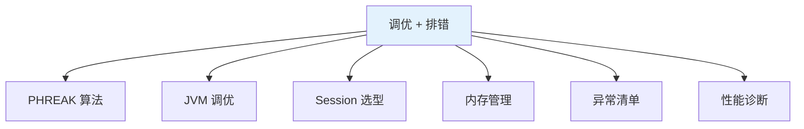

## 8.1 PHREAK 算法

### 8.1.1 PHREAK vs RETE

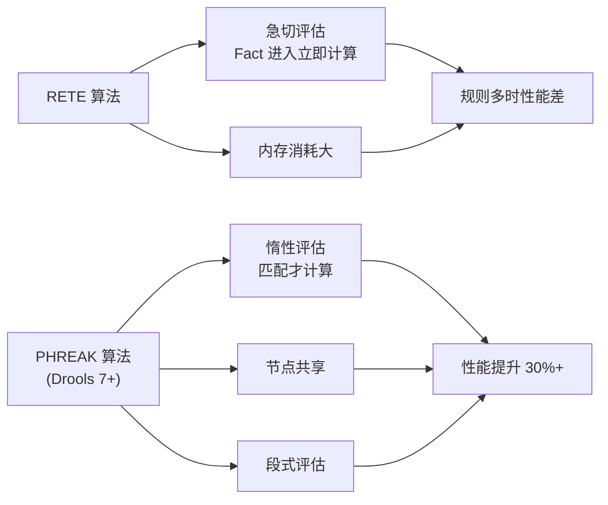

### 8.1.2 PHREAK 关键改进

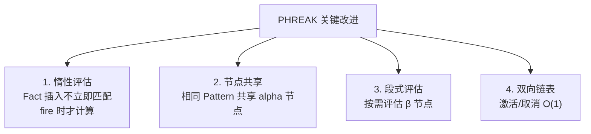

### 8.1.3 Alpha 节点与 Beta 节点

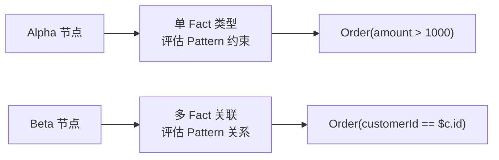

### 8.1.4 节点共享示例

```drools
when
    $o: Order(amount > 1000)
    $c: Customer(id == $o.customerId, level == "VIP")
then
end

// 多个规则可能共享 alpha 节点:
// - "Order(amount > 1000)" 在多个规则中
// - "Customer(level == VIP)" 在多个规则中
```

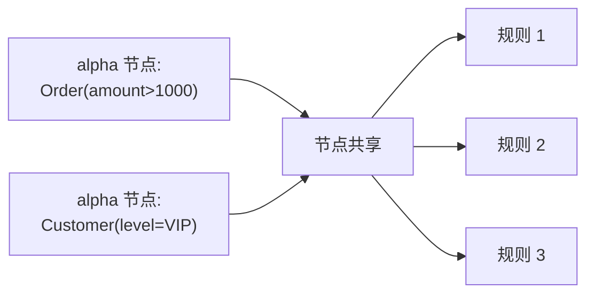

**共享收益**:**减少内存 + 减少计算**。

### 8.1.5 段式评估

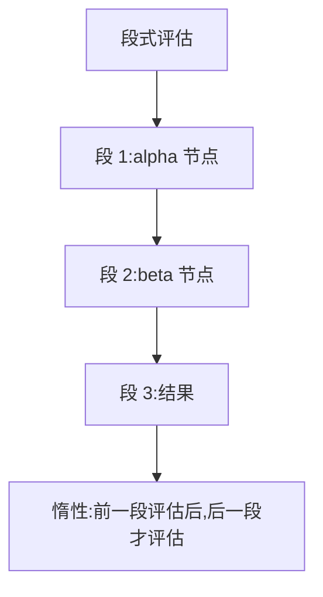

## 8.2 性能诊断

### 8.2.1 性能数据收集

```java
// 启用 Drools 性能监控
KieSession session = kc.newKieSession();
session.addEventListener(new DebugRuntimeEventListener());  // DEBUG 日志
```

**DEBUG 日志输出**:

```text
[ObjectInsertEvent: handle=1 fact=Order]
[ActivationCreatedEvent: rule=VIP_DISCOUNT]
[ActivationFiredEvent: rule=VIP_DISCOUNT]
```

### 8.2.2 KieRuntimeEventLogger

```java
import org.drools.audit.WorkingMemoryFileLogger;
import org.drools.audit.WorkingMemoryLogger;

WorkingMemoryFileLogger logger = new WorkingMemoryFileLogger(session);
logger.setFileName("audit-log");
session.fireAllRules();
logger.writeToDisk();
```

**生成审计日志**,可事后分析。

### 8.2.3 KieRuntimeEventListener 自定义指标

```java
public class PerformanceListener implements RuleRuntimeEventListener {

    private final AtomicLong totalRulesFired = new AtomicLong();
    private final Map<String, AtomicLong> ruleCounters = new ConcurrentHashMap<>();
    private final Timer sessionTimer = new Timer();

    @Override
    public void activationFired(ActivationFiredEvent event) {
        String ruleName = event.getRule().getName();
        totalRulesFired.incrementAndGet();
        ruleCounters.computeIfAbsent(ruleName, k -> new AtomicLong()).incrementAndGet();
    }

    public Map<String, Long> getRuleStats() {
        return ruleCounters.entrySet()
                .stream()
                .collect(Collectors.toMap(Map.Entry::getKey, e -> e.getValue().get()));
    }
}
```

### 8.2.4 性能数据可视化

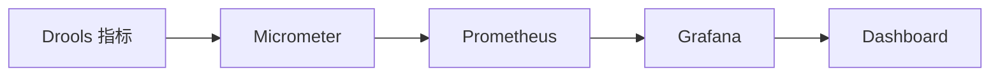

**Micrometer 接入**(详见第七章):

```java
Counter.builder("drools.rule.fired")
    .tag("rule", ruleName)
    .register(meterRegistry)
    .increment();
```

## 8.3 规则级优化

### 8.3.1 减少 Pattern 数量

```text
❌ 反例:过多 Pattern
when
    $o: Order()
    Customer(id == $o.customerId)  // Pattern 但没绑定
    $c: Customer()  // 重复 Pattern
then

✅ 正确:一个 Pattern 绑定
when
    $o: Order()
    $c: Customer(id == $o.customerId)
then
```

### 8.3.2 用 exists 替代普通 Pattern

```text
❌ 反例
when
    $o: Order()
    $c: Customer(id == $o.customerId, level == "VIP")  // 多匹配浪费
then

✅ 正确
when
    $o: Order()
    exists Customer(id == $o.customerId, level == "VIP")
then
```

### 8.3.3 用 in 替代多个 ||

```text
❌ 反例
when
    $o: Order(status == "NEW" || status == "PAID" || status == "SHIPPED")
then

✅ 正确
when
    $o: Order(status in ("NEW", "PAID", "SHIPPED"))
then
```

### 8.3.4 避免 eval

```text
❌ 反例
when
    $o: Order()
    eval(LocalDate.now().getDayOfWeek() == DayOfWeek.FRIDAY)
then

✅ 正确:用 Pattern + 全局日期 Fact
when
    $o: Order()
    Date(isFriday == true)
then
```

### 8.3.5 范围检查用区间

```text
❌ 反例
when
    $o: Order(amount >= 1000 && amount <= 5000)
then

✅ 正确
when
    $o: Order(amount in (1000..5000))
then
```

### 8.3.6 索引字段(@Indexed)

```java
public class Order {
    @Indexed
    private String customerId;

    @Indexed
    private String status;
}
```

**索引字段** 在 Working Memory 中建哈希,**查找 O(1)**——大幅提升性能。

### 8.3.7 Property Reactive

```java
public class Order {
    private String id;
    private String status;
    private double amount;
}
```

**Drools 8 默认开启 Property Reactive**——只有修改的字段触发重匹配。

**手动监听字段变化**:

```drools
when
    $o: Order(status == "VIP")  // 只监听 status 字段变化
then
end
```

## 8.4 Stateless vs Stateful 选型

### 8.4.1 对比

| 维度 | Stateless | Stateful |
|------|-----------|----------|
| **执行模型** | 单次执行 | 多次执行 |
| **状态** | 无 | 保留 |
| **性能** | 略快 | 略慢 |
| **线程安全** | ✅ | ❌ |
| **典型场景** | 决策/计算 | 业务流 |

### 8.4.2 选型决策

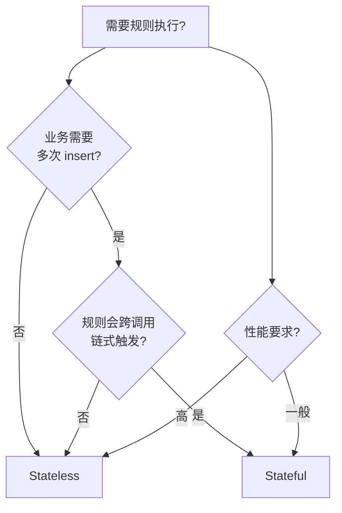

### 8.4.3 典型场景

| 场景 | 推荐 | 理由 |
|------|------|------|
| **订单折扣计算** | Stateless | 一次决策 |
| **风控审核** | Stateful | 多步审核,可能多次更新 |
| **积分计算** | Stateless | 一次性 |
| **游戏技能链** | Stateful | 多次触发链式效果 |
| **实时推荐** | Stateless | 实时计算 |
| **审批工作流** | Stateful | 长时间会话 |

### 8.4.4 Stateless 的复用

**StatelessKieSession 可复用**:

```java
@Component
public class StatelessKieSessionPool {
    private final Queue<StatelessKieSession> pool = new ConcurrentLinkedQueue<>();
    private final KieContainer kieContainer;

    public StatelessKieSession borrow() {
        StatelessKieSession s = pool.poll();
        return s != null ? s : kieContainer.newStatelessKieSession();
    }

    public void release(StatelessKieSession s) {
        pool.offer(s);  // Stateless 是干净的,可以复用
    }
}
```

### 8.4.5 Stateful 不能复用

```text
❌ Stateful 复用会导致:
- 上次执行的 Fact 仍在 Working Memory
- 上次的 Agenda 状态可能污染
- 必须每次 dispose 或用 try-with-resources
```

**每次重新创建**(轻量级):

```java
try (KieSession session = kc.newKieSession()) {
    session.insert(order);
    session.fireAllRules();
}
```

## 8.5 KieBase 配置优化

### 8.5.1 Sequential 模式

```java
KieBaseConfiguration config = ks.newKieBaseConfiguration();
config.setOption(SequentialOption.SEQUENTIAL);
KieBase kbase = kc.newKieBase(config);
```

**适用场景**:单线程 + 大量规则。

**性能提升**:2~3 倍。

**限制**:
- **单线程**:不能并发
- **规则相互独立**:规则触发顺序不影响最终结果

### 8.5.2 Equality 模式

```java
config.setOption(EqualityBehaviorOption.EQUALITY);
```

**EQUALITY**(默认):用 `equals()` 比较 Fact。
**IDENTITY**:用 `==` 比较对象引用。

**IDENTITY 更快**,但要求同一逻辑对象只被 insert 一次。

### 8.5.3 Alpha 哈希

```properties
# drools.alphaNodeHashingThreshold=3
# 优化 alpha 节点哈希阈值
```

### 8.5.4 共享 KieBase

```java
// 全局共享 KieContainer
@Autowired private KieContainer kieContainer;

// 各业务场景共享同一 KieBase
KieBase orderBase = kieContainer.getKieBase("orderRules");
KieBase riskBase = kieContainer.getKieBase("riskRules");
```

## 8.6 JVM 调优

### 8.6.1 堆内存

```bash
-Xms4g -Xmx4g
```

**经验**:
- **规则数 ≤ 100**:2~4 GB
- **规则数 100~500**:4~8 GB
- **规则数 > 500**:8 GB+

### 8.6.2 GC 选择

```bash
-XX:+UseG1GC
-XX:MaxGCPauseMillis=100
```

**G1GC 推荐**:低延迟,适合服务端。

### 8.6.3 元空间

```bash
-XX:MaxMetaspaceSize=512m
```

**元空间**:Drools 生成大量动态类(每条规则可能生成 class),元空间需充足。

### 8.6.4 OOM Dump

```bash
-XX:+HeapDumpOnOutOfMemoryError
-XX:HeapDumpPath=/var/log/drools-oom.hprof
```

**OOM 时自动 dump**,便于 MAT 分析。

### 8.6.5 JVM 调优模板

```bash
java -jar order-service.jar \
  -Xms4g -Xmx4g \
  -XX:+UseG1GC \
  -XX:MaxGCPauseMillis=100 \
  -XX:+ParallelRefProcEnabled \
  -XX:+HeapDumpOnOutOfMemoryError \
  -XX:HeapDumpPath=/var/log/oom.hprof \
  -XX:MaxMetaspaceSize=512m \
  -Dfile.encoding=UTF-8
```

### 8.6.6 Spring Boot 配置(application.yml)

```yaml
spring:
  application:
    name: order-service

server:
  tomcat:
    threads:
      max: 400

# 不通过 spring.* 直接配置 JVM 参数,通过启动脚本
```

**JVM 参数放在启动脚本**:

```bash
#!/bin/bash
export JAVA_OPTS="-Xms4g -Xmx4g -XX:+UseG1GC"
java $JAVA_OPTS -jar order-service.jar
```

## 8.7 内存管理

### 8.7.1 FactHandle 生命周期

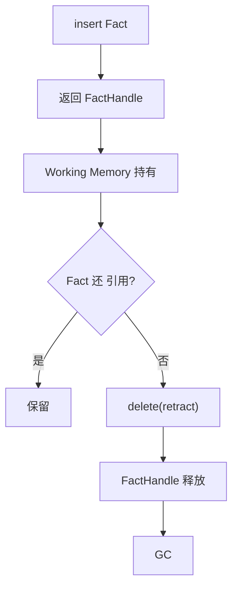

**关键**:**必须 delete(retract) 不再使用的 Fact**——否则内存泄漏。

### 8.7.2 FactHandle 模式

```java
FactHandle handle = session.insert(order);

// 不再使用时
session.delete(handle);
```

**批量删除**:

```java
Collection<FactHandle> handles = session.getFactHandles();
for (FactHandle h : handles) {
    session.delete(h);
}
```

### 8.7.3 Working Memory 监控

```java
public void monitorWorkingMemory(KieSession session) {
    int size = session.getFactCount();
    log.info("Working Memory 大小: {}", size);

    if (size > 10000) {
        log.warn("Working Memory 过大,可能存在内存泄漏");
    }
}
```

### 8.7.4 序列化大对象

```text
✅ 把大对象排除在 Fact 之外:
- 大量数据从外部查询,不 insert 到引擎
- 引擎只处理"规则需要的字段"
```

```java
// ❌ 反例:大对象全 insert
session.insert(new HugeOrder(...));  // 包含 N 个明细

// ✅ 正确:只 insert 必要字段
session.insert(orderSummary);  // 摘要数据
```

## 8.8 常见异常清单

### 8.8.1 编译期异常

| 异常 | 原因 | 解决 |
|------|------|------|
| `RuleConstructionException` | 规则语法错误 | 检查 DRL 语法 |
| `UnknownFactTypeException` | Fact 类找不到 | 检查 import |
| `RuleCompilationException` | 编译失败 | 看错误信息 |
| `PatternCompilationException` | Pattern 编译失败 | 检查字段名 |
| `PackageDescrBuildException` | package 解析失败 | 检查 package 声明 |

### 8.8.2 运行时异常

| 异常 | 原因 | 解决 |
|------|------|------|
| `NoFactHandleException` | FactHandle 已失效 | 检查是否已 delete |
| `ConsequenceException` | then 块执行异常 | 看 then 块代码 |
| `IllegalStateException` | Session 状态异常 | 检查 dispose 顺序 |
| `IllegalArgumentException` | 参数错误 | 检查 API 调用 |
| `NullPointerException` | Global 未设置 | setGlobal 在 fireAllRules 前 |

### 8.8.3 性能问题

| 现象 | 可能原因 | 排查方向 |
|------|----------|----------|
| 启动慢 | 编译 DRL 慢 | 拆分规则文件 |
| 规则执行慢 | Pattern 多 | 减少 Pattern |
| 内存占用大 | Working Memory 大 | delete 不用的 Fact |
| Full GC 频繁 | 元空间不足 | 调整 MaxMetaspaceSize |
| ClassNotFound | 依赖冲突 | 锁定版本 |

### 8.8.4 NoFactHandleException 详解

```text
错误:NoFactHandleException
原因:对已 retract 的 FactHandle 操作
```

**场景**:

```java
FactHandle handle = session.insert(order);
session.delete(handle);
session.update(handle, modifiedOrder);  // ❌ handle 已失效
```

**解决**:

```java
// 方案 1:重新 insert
FactHandle handle = session.insert(order);
// ... 修改 order
session.update(handle, modifiedOrder);  // ✅ handle 仍有效

// 方案 2:用对象引用(自动查找 handle)
session.update(session.getFactHandle(order), modifiedOrder);
```

### 8.8.5 ConsequenceException 详解

```text
错误:ConsequenceException: ...java.lang.NullPointerException
原因:then 块中空指针
```

**示例**:

```drools
rule "BAD_RULE"
    when
        $o: Order()  // 没绑 customerId 字段
    then
        $o.getCustomer().getName();  // customer 为 null → NPE
end
```

**解决**:

```drools
rule "GOOD_RULE"
    when
        $o: Order(customer != null)
    then
        String name = $o.getCustomer().getName();
        // ... 处理逻辑
end
```

### 8.8.6 MismatchedInputException(Drools 序列化)

```text
错误:MismatchedInputException
原因:Fact 类版本不一致(如加了字段)
```

**解决**:
1. 序列化版本固定(`serialVersionUID`)
2. 规则升级时确保 Fact 类兼容
3. 或全局重新加载 KieContainer

### 8.8.7 ClassCastException

```text
错误:ClassCastException
原因:Fact 类型转换错误
```

**示例**:

```java
FactHandle handle = session.getFactHandle(someObject);
Object fact = session.getObject(handle);
// fact 可能是任何 Fact 类型
String name = ((Order) fact).getId();  // ⚠️ ClassCastException 风险
```

**解决**:

```java
Object fact = session.getObject(handle);
if (fact instanceof Order) {
    String name = ((Order) fact).getId();
}
```

### 8.8.8 规则不触发排查

```text
现象:fireAllRules 返回 0,期望规则触发
```

**排查步骤**:

```java
// 1. 确认 Fact 已 insert
FactHandle h = session.insert(order);
System.out.println("Handle: " + h);

// 2. 检查 Fact 字段值
System.out.println("Amount: " + order.getAmount());

// 3. 启用 DEBUG 日志
session.addEventListener(new DebugRuntimeEventListener());

// 4. 查询匹配的 Fact
QueryResults results = session.getQueryResults("getVipOrders");
System.out.println("VIP 订单数: " + results.size());

// 5. 单独测试规则
```

### 8.8.9 规则反复触发(死循环)

```text
现象:fireAllRules 不返回 / CPU 100%
原因:then 块修改 Fact,触发本规则再次激活
```

**解决**:

```drools
// ✅ 加 no-loop
rule "RULE"
    no-loop true
    when
        $o: Order()
    then
        modify($o) {
            setAmount($o.getAmount() + 1)
        }
end

// ✅ 加 lock-on-active
rule "RULE"
    lock-on-active true
    agenda-group "group1"
    when
        $o: Order()
    then
        modify($o) {
            setAmount($o.getAmount() + 1)
        }
end

// ✅ 检查约束,不再匹配
rule "RULE"
    when
        $o: Order(amount < 1000)
    then
        modify($o) {
            setAmount($o.getAmount() + 1)
        }
        // amount 现在 ≥ 1000,不再匹配
end
```

## 8.9 性能压测与基准

### 8.9.1 JMH 微基准测试

```java
@BenchmarkMode(Mode.AverageTime)
@OutputTimeUnit(TimeUnit.MILLISECONDS)
@State(Scope.Benchmark)
public class DroolsBenchmark {

    private KieContainer kieContainer;
    private Order testOrder;

    @Setup
    public void setup() {
        kieContainer = KieServices.Factory.get().getKieClasspathContainer();
        testOrder = new Order();
        testOrder.setId("ORD-001");
        testOrder.setCustomerLevel("VIP");
        testOrder.setAmount(5000);
    }

    @Benchmark
    public OrderResultDto executeRules() {
        try (KieSession session = kieContainer.newKieSession()) {
            session.insert(testOrder);
            session.fireAllRules();
            // ...
        }
        return new OrderResultDto();
    }
}
```

### 8.9.2 负载测试

```java
public class LoadTest {

    public static void main(String[] args) throws InterruptedException {
        KieContainer kc = KieServices.Factory.get().getKieClasspathContainer();

        // 模拟 100 并发
        ExecutorService executor = Executors.newFixedThreadPool(100);
        CountDownLatch latch = new CountDownLatch(100);
        AtomicLong totalTime = new AtomicLong();
        AtomicInteger success = new AtomicInteger();

        for (int i = 0; i < 100; i++) {
            executor.submit(() -> {
                long start = System.currentTimeMillis();
                try (KieSession session = kc.newKieSession()) {
                    Order order = generateOrder();
                    session.insert(order);
                    session.fireAllRules();
                    success.incrementAndGet();
                }
                totalTime.addAndGet(System.currentTimeMillis() - start);
                latch.countDown();
            });
        }

        latch.await();
        System.out.println("平均耗时: " + totalTime.get() / 100 + " ms");
        System.out.println("成功率: " + success.get() + "/100");
    }
}
```

### 8.9.3 性能基准参考

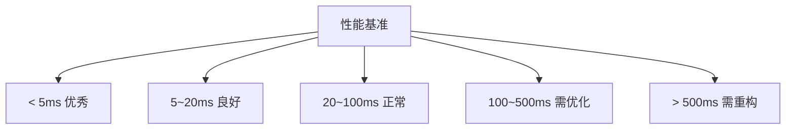

## 8.10 性能调优 CheckList

### 8.10.1 规则层优化

```text
✅ 减少 Pattern 数量
✅ 用 exists 替代普通 Pattern
✅ 用 in 替代 ||
✅ 避免 eval
✅ 用区间替代范围
✅ @Indexed 字段
✅ 拆分大 KieBase 为多个小 KieBase
```

### 8.10.2 Session 层优化

```text
✅ Stateless 优先
✅ Stateful 用 try-with-resources
✅ 不持有 Stateless 池
✅ 不复用 Stateful Session
```

### 8.10.3 KieBase 配置

```text
✅ Sequential 模式(单线程)
✅ EQUALITY 模式(默认)
✅ Property Reactive(Drools 8 默认)
```

### 8.10.4 JVM 调优

```text
✅ 堆 ≥ 4 GB
✅ G1GC + MaxGCPauseMillis=100
✅ MaxMetaspaceSize ≥ 512 MB
✅ OOM 时自动 dump
✅ 启用 JFR 或 VisualVM 监控
```

### 8.10.5 应用层优化

```text
✅ KieContainer 全局单例
✅ Fact 字段精简(避免大对象)
✅ 及时 delete(retract)
✅ 监控 Working Memory 大小
✅ 启用 Micrometer 监控
```

## 8.11 故障恢复

### 8.11.1 规则加载失败

```java
public void safeReload() {
    try {
        loader.reload();
    } catch (Exception e) {
        log.error("规则重新加载失败,继续使用旧版本", e);
        // 继续使用旧 KieContainer
    }
}
```

**原则**:**新规则失败不影响生产**——保留旧 KieContainer。

### 8.11.2 会话异常恢复

```java
public OrderResultDto calculateDiscount(Order order) {
    try {
        try (KieSession session = kc.newKieSession()) {
            session.insert(order);
            session.fireAllRules();
            return convert(order);
        }
    } catch (Exception e) {
        log.error("规则执行失败", e);
        // 降级:用默认规则
        return fallback(order);
    }
}

private OrderResultDto fallback(Order order) {
    // 简单折扣逻辑,不依赖 Drools
    OrderResultDto result = new OrderResultDto();
    result.setDiscountRate(1.0);
    return result;
}
```

### 8.11.3 健康检查

```java
@Component
public class DroolsHealthIndicator implements HealthIndicator {

    @Autowired
    private KieContainer kieContainer;

    @Override
    public Health health() {
        try {
            int ruleCount = kieContainer.getKieBase().getRules().size();
            return Health.up()
                .withDetail("ruleCount", ruleCount)
                .build();
        } catch (Exception e) {
            return Health.down()
                .withException(e)
                .build();
        }
    }
}
```

## 8.12 监控指标清单

### 8.12.1 必监控指标

| 指标 | 含义 | 阈值 |
|------|------|------|
| **规则执行次数** | 每条规则触发频次 | 突增需关注 |
| **Session 创建耗时** | KieSession 创建时间 | < 100ms |
| **fireAllRules 耗时** | 单次规则执行时间 | < 50ms |
| **Working Memory 大小** | Fact 数量 | < 10000 |
| **KieContainer 状态** | 是否可用 | 必须 up |
| **JVM 堆** | 堆使用率 | < 80% |
| **GC 暂停** | 暂停时间 | < 200ms |

### 8.12.2 Prometheus 暴露

```yaml
management:
  endpoints:
    web:
      exposure:
        include: drools,prometheus,health
  metrics:
    tags:
      application: ${spring.application.name}
```

### 8.12.3 Grafana Dashboard

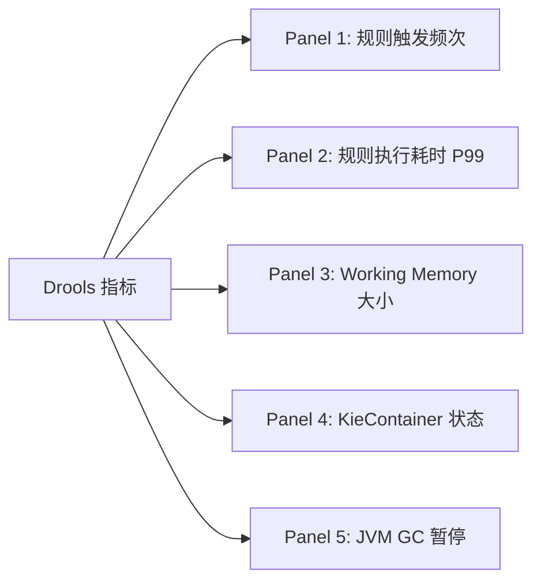

## 8.13 Drools 与同类方案对比

### 8.13.1 何时不用 Drools

```text
❌ 不适合 Drools:
1. 简单计算(< 5 条规则)
2. 极端性能要求(每条规则 < 1ms)
3. 业务非常稳定,不变更

✅ 适合 Drools:
1. 业务规则多(> 20 条)
2. 规则频繁变更
3. 需要业务人员参与
4. 中等性能要求(每条规则 < 50ms)
```

### 8.13.2 替代方案

| 场景 | 替代方案 |
|------|----------|
| < 10 条规则 | Easy Rules / Avrete |
| 决策表为主 | OpenL Tablets |
| 流程编排 | Camunda / Flowable |
| 机器学习 | 自研 / 框架 |

## 8.14 经验总结

### 8.14.1 性能优化金字塔

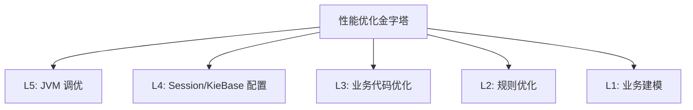

**优先级**:**L1(建模) > L2(规则) > L3(业务) > L4(配置) > L5(JVM)**——从下往上,优先解决底层。

### 8.14.2 性能调优步骤

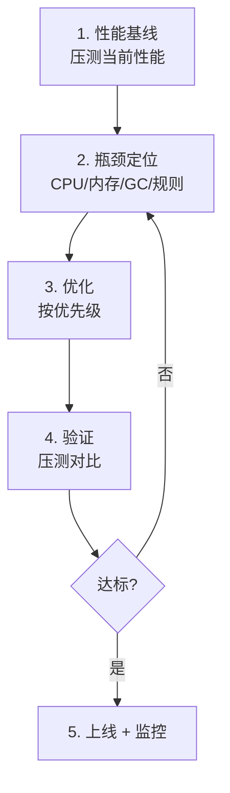

### 8.14.3 避坑清单

```text
❌ 1. 直接 fireAllRules 不返回结果
   ✅ 用 Stateful 跟踪结果

❌ 2. Global 设置在 fireAllRules 之后
   ✅ setGlobal 在前

❌ 3. 共享 Stateful Session
   ✅ 每线程独立

❌ 4. 忘记 dispose Stateful Session
   ✅ try-with-resources

❌ 5. 规则不写 no-loop,死循环
   ✅ 显式 no-loop 或约束条件

❌ 6. 大对象全 insert 到 Working Memory
   ✅ insert 摘要,详情按需查

❌ 7. 性能问题先调 JVM
   ✅ 先检查规则设计

❌ 8. 规则改了不测试
   ✅ 单元测试 + 回归测试
```

## 小结 {#summary}

- **PHREAK 算法**:**惰性评估 + 节点共享 + 段式评估**,Drools 8 默认。
- **规则优化**:**减少 Pattern + exists + in + 避免 eval + @Indexed 字段**。
- **Session 选型**:**Stateless 优先**(决策/计算);Stateful(业务流)。
- **JVM 调优**:**堆 ≥ 4G + G1GC + 元空间 ≥ 512M**。
- **异常清单**:**NoFactHandleException / ConsequenceException / NPE / 死循环** 是最常见。
- **内存管理**:**delete(retract) + Fact 精简 + 监控 Working Memory**。
- **故障恢复**:**降级方案 + 健康检查 + 新规则失败保留旧版本**。

---

到这里,整个 Drools 教程就结束了。

回顾全 8 章:

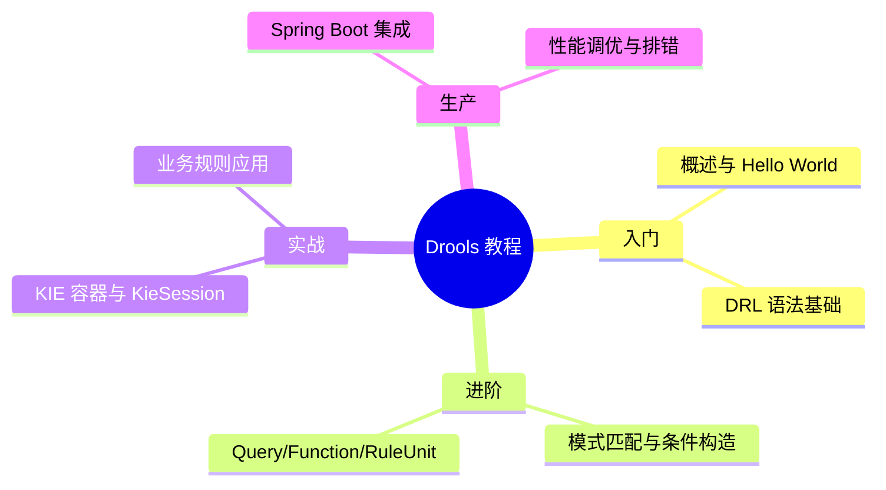

**关键里程碑**:
- **第 1~2 章**:能写规则、跑起来
- **第 3~4 章**:能写复杂规则
- **第 5~6 章**:能落地业务系统
- **第 7~8 章**:能上生产、扛得住

**核心思想**:**把频繁变更的业务规则从代码中抽出来**,用声明式 DRL 表达,让业务和技术解耦——这是 Drools 的核心价值。