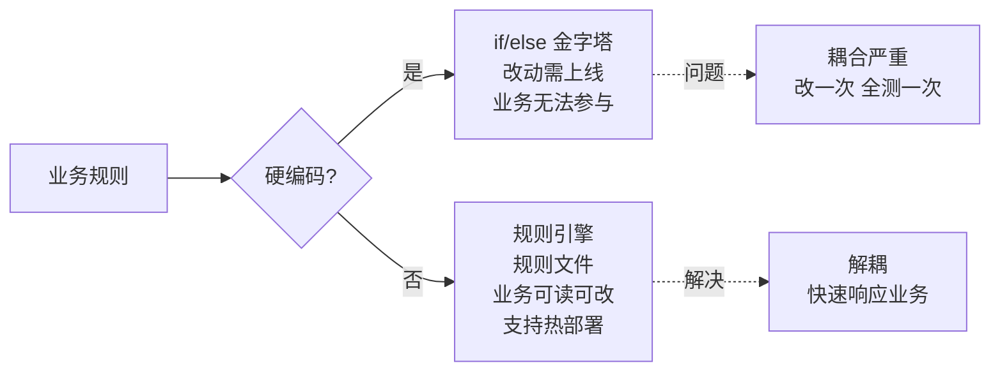
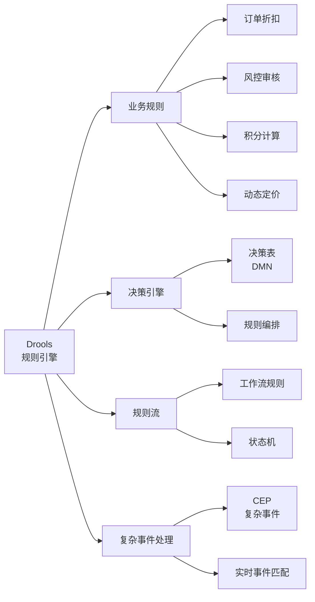
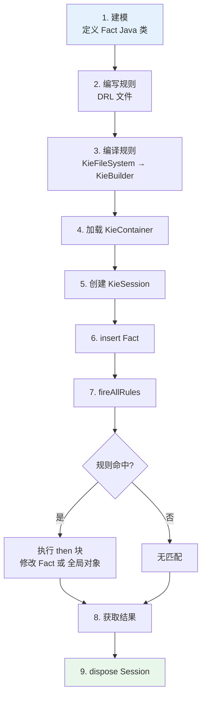

# Drools 规则引擎教程

Drools 是 **Java 生态最成熟的开源规则引擎**(BRMS,Business Rule Management System),出自 JBoss,被 Red Hat 维护。**把业务规则从代码里抽出来,让业务人员可读、可改、可热部署**——这是 Drools 的核心价值。

这份教程不讲"Drools 怎么安装",讲"**业务规则怎么写、怎么管、怎么用**"。从 DRL 语法到 PHREAK 算法,从内存 Session 到 Spring Boot 集成,**看完能直接落地项目**。

## 谁适合看这份教程

- 后端开发,业务里满是 `if-else if-else if-else` 的**规则金字塔**
- 业务规则经常变,每次都要**改代码 + 重新上线**
- 想把**业务和代码解耦**,让业务人员也能参与规则维护
- 在做风控、定价、计费、积分、活动促销这类**规则密集型系统**

## 为什么需要规则引擎

**对比传统代码**:
| 维度 | 硬编码 | 规则引擎 |
|------|--------|----------|
| 改规则 | 改代码→编译→测试→发布 | 改 DRL 文件→重载 |
| 可读性 | 业务看不懂 | 业务可读 |
| 执行速度 | 快(编译期优化) | 中等(解释执行/RETE) |
| 复杂逻辑 | 灵活 | 适合规则/决策逻辑 |
| 适用规模 | 小到中等 | 中到大 |

**结论**:**规则密集 + 多变**就用 Drools,**简单计算 + 性能极致**就用代码。

## Drools 能做什么

## 一次完整的 Drools 工作流

## 章节 {.cards}

- [第一章：Drools 概述与第一个规则](/docs/drools/01-overview-hello/) — 规则引擎原理、与同类对比、Maven 集成、第一个 `Hello World`
- [第二章：DRL 语法基础](/docs/drools/02-drl-basics/) — package/import/when-then、规则属性(salience/no-loop/lock-on-active)、变量绑定
- [第三章：模式匹配与条件构造](/docs/drools/03-pattern-matching/) — Fact 模型、复合条件、exists/not/exists、forall、collect/accumulate
- [第四章：高级特性:Query、Function、RuleUnit](/docs/drools/04-advanced-features/) — Global、Query、Function、RuleUnit API、自定义 Operator
- [第五章:KIE 容器与 KieSession](/docs/drools/05-kie-session/) — KieServices、KieContainer、有状态/无状态 Session、生命周期、Fact 操作
- [第六章:实战案例:业务规则应用](/docs/drools/06-practice/) — 订单折扣实战、规则组织、热加载、版本管理
- [第七章:Drools 与 Spring Boot 集成](/docs/drools/07-spring-boot/) — drools-spring、声明式 Kie、规则热加载
- [第八章:性能调优与疑难排错](/docs/drools/08-tuning-troubleshooting/) — PHREAK 算法、JVM 调优、常见异常、Stateless vs Stateful 选型

## 阅读建议

- **急着干活**:第 1、2、5 章能让你跑起来,跑通第一个业务规则。
- **想写复杂规则**:**第 3、4 章是核心**。Pattern 匹配、accumulate、RuleUnit 是真正的难点。
- **生产落地**:第 6、7 章的热加载、Spring Boot 集成是必备。
- **排查疑难**:第 8 章的 PHREAK 算法和常见异常清单。

## 技术栈

| 项 | 推荐 |
|------|--------|
| Drools 版本 | 8.x(当前主线,Java 8+) |
| JDK | 11 / 17 LTS |
| Spring Boot | 2.7+ / 3.x |
| Maven | 3.6+ |
| IDE | IntelliJ IDEA(插件支持) |

> 本教程基于 **Drools 8.x** 系列,代码示例兼容 7.x。涉及新特性时单独标注。