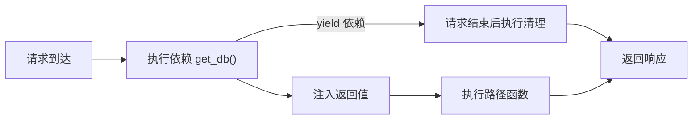

# 依赖注入与中间件

本章学习 FastAPI 的依赖注入系统 `Depends`，用它将数据库连接、公共逻辑等共享能力解耦复用；并了解中间件、CORS 配置与全局异常处理。

## 依赖注入基础 {#depends}

`Depends` 把可调用对象声明为依赖，FastAPI 会自动调用并注入返回值：

```python
from fastapi import Depends, FastAPI

app = FastAPI()


# 这是一个依赖函数
def get_query_token(q: str | None = None):
    return {"q": q}


@app.get("/items/")
def read_items(commons: dict = Depends(get_query_token)):
    # commons 即为依赖的返回值
    return {"items": [], "commons": commons}
```

## 依赖会自动执行 {#auto-execute}

关键问题：**依赖会自动执行吗？** 答案是**会**。只要在路径操作函数的参数里声明了 `Depends(xxx)`，FastAPI 就会在**每次请求到达时自动调用**该依赖函数，**先于路径函数**执行，并把返回值注入参数——你无需手动调用它。



### 1. 只对「声明了依赖」的路由生效

依赖不是全局的，只有参数里写了 `Depends(xxx)` 的路由才会触发执行，其他路由不受影响：

```python
def get_db():
    print("执行依赖")
    return SessionLocal()

@app.get("/users")
def users(db = Depends(get_db)):   # ✅ 会触发 get_db
    ...

@app.get("/health")
def health():                       # ❌ 不触发 get_db
    return {"status": "ok"}
```

### 2. 每次请求执行一次（默认缓存）

默认情况下，同一个依赖在**一条请求**里被多处引用时，只执行一次并缓存结果（`use_cache=True` 是默认值）：

```python
@app.get("/users")
def users(db = Depends(get_db), db2 = Depends(get_db)):
    # 同一次请求里 get_db 只执行一次，db 与 db2 是同一个对象
    ...
```

若希望每次都重新执行，用 `Depends(get_db, use_cache=False)`。

### 3. 嵌套依赖：依赖链自动层层执行

依赖函数自己也能声明依赖，形成依赖链，会按声明顺序自动解析执行：

```python
def get_token():
    return "token-123"

def get_current_user(token: str = Depends(get_token)):   # 依赖依赖
    return {"name": "Alice", "token": token}

@app.get("/me")
def me(user = Depends(get_current_user)):
    return user
```

请求 `/me` 的执行顺序：`get_token()` → `get_current_user(token)` → `me(user)`。

### 4. yield 依赖：自动清理

依赖函数用 `yield` 代替 `return` 时，请求处理完后会自动执行 `yield` 之后的清理代码，是管理数据库连接的标准写法：

```python
def get_db():
    db = SessionLocal()
    try:
        yield db          # 注入 db，请求期间使用
    finally:
        db.close()        # 请求结束后自动关闭
```

### 5. 依赖覆盖：测试时替换

`app.dependency_overrides` 可以在测试时替换依赖实现，无需改动业务代码：

```python
app.dependency_overrides[get_db] = lambda: fake_db
```

## 数据库依赖示例 {#db-dependency}

用依赖在请求级别管理数据库会话，保证每个请求独立且自动关闭：

```python
from typing import Annotated

from fastapi import Depends, FastAPI
from sqlalchemy import create_engine
from sqlalchemy.orm import Session, sessionmaker

app = FastAPI()

# 创建同步引擎与会话工厂
engine = create_engine("sqlite:///./app.db")
SessionLocal = sessionmaker(bind=engine)


# 依赖：为每个请求提供 Session，请求结束自动关闭
def get_db():
    db = SessionLocal()
    try:
        yield db
    finally:
        db.close()


@app.get("/users/")
def list_users(db: Annotated[Session, Depends(get_db)]):
    return db.execute(__import__("sqlalchemy").text("SELECT 1")).all()
```

## 类作为依赖 {#class-dependency}

依赖既可以是函数，也可以是类（FastAPI 会实例化它）：

```python
from fastapi import Depends, FastAPI

app = FastAPI()


class Pagination:
    def __init__(self, skip: int = 0, limit: int = 10):
        self.skip = skip
        self.limit = limit


@app.get("/items/")
def read_items(p: Annotated[Pagination, Depends()]):
    return {"skip": p.skip, "limit": p.limit}
```

## 中间件 {#middleware}

中间件在请求进入路由前、响应返回客户端前统一处理，常用于日志与耗时统计：

```python
import time

from fastapi import FastAPI, Request

app = FastAPI()


@app.middleware("http")
async def add_process_time_header(request: Request, call_next):
    start = time.perf_counter()
    # 调用后续处理链（路由或其他中间件）
    response = await call_next(request)
    cost = time.perf_counter() - start
    response.headers["X-Process-Time"] = str(cost)
    return response
```

## CORS 跨域配置 {#cors}

通过 `CORSMiddleware` 允许浏览器跨域访问：

```python
from fastapi import FastAPI
from fastapi.middleware.cors import CORSMiddleware

app = FastAPI()

# 允许的来源列表，生产环境应写具体域名
origins = ["https://example.com", "http://localhost:3000"]

app.add_middleware(
    CORSMiddleware,
    allow_origins=origins,
    allow_credentials=True,
    allow_methods=["*"],
    allow_headers=["*"],
)
```

## 异常处理 {#exception-handler}

用 `HTTPException` 主动抛出错误，并可用 `@app.exception_handler` 自定义返回格式：

```python
from fastapi import FastAPI, HTTPException, Request
from fastapi.responses import JSONResponse

app = FastAPI()


@app.get("/items/{item_id}")
def read_item(item_id: int):
    if item_id != 42:
        # 抛出 404 及错误信息
        raise HTTPException(status_code=404, detail="商品不存在")
    return {"item_id": item_id}


# 全局捕获未处理的异常，统一响应结构
@app.exception_handler(Exception)
async def handle_exception(request: Request, exc: Exception):
    return JSONResponse(status_code=500, content={"error": str(exc)})
```

## 小结 {#summary}

本章掌握了 `Depends` 依赖注入的核心——**依赖声明后会自动执行**（先于路径函数、每次请求执行、可缓存、可嵌套成链、yield 自动清理、可覆盖测试），并学会在数据库连接等场景中复用，通过中间件、CORS、异常处理器增强了 Web 服务的健壮性。下一章将基于这些能力实现 OAuth2、JWT 与密码哈希的认证体系。
