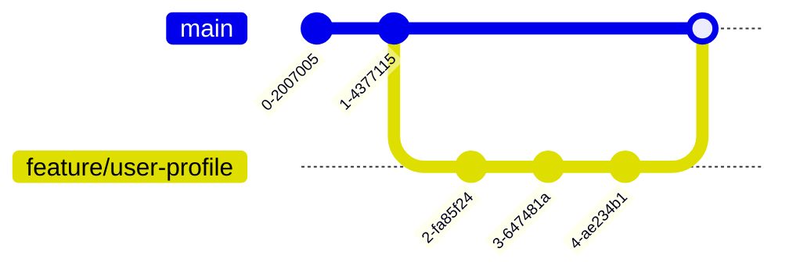
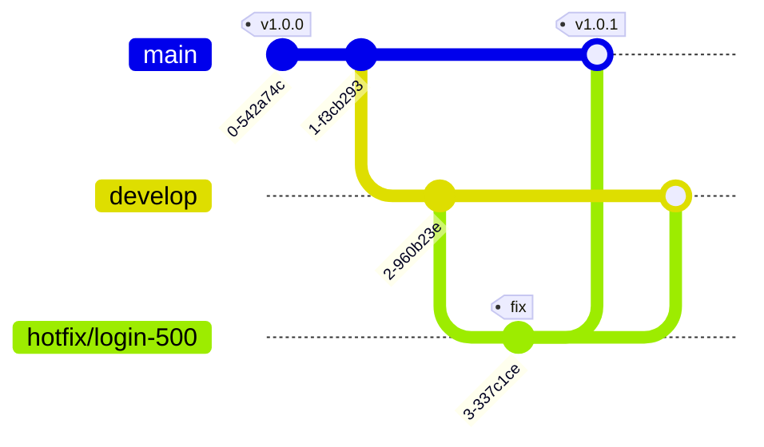
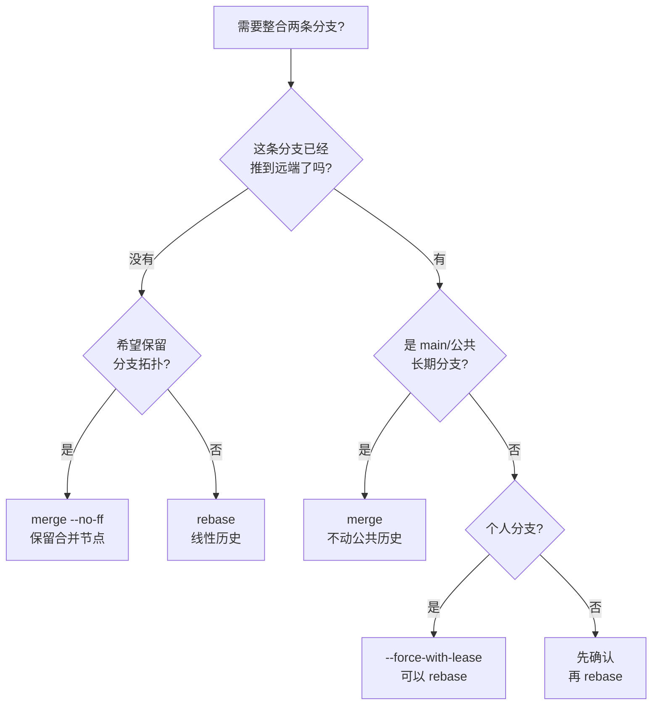

# 分支与合并

分支是 Git 最强大的特性之一，它让开发者可以安全地并行开发而不互相干扰。本章介绍分支的创建切换、合并、变基及冲突处理。

## 分支基础 {#branch-basics}

```bash
# 查看本地分支（* 表示当前分支）
git branch

# 查看所有分支（含远程）
git branch -a

# 创建新分支
git branch feature/login

# 切换分支
git switch feature/login

# 创建并切换到新分支（推荐）
git switch -c feature/login

# 删除已合并的分支
git branch -d feature/login

# 强制删除未合并分支（谨慎）
git branch -D feature/login
```

> 现代 Git 推荐使用 `git switch` / `git switch -c` 替代 `git checkout` 来切换分支，语义更清晰。

## 合并分支 {#merge}

将其他分支的改动合并到当前分支：

```bash
# 切换到目标分支
git switch main

# 合并 feature 分支
git merge feature/login
# 合并成功会生成一次新的合并提交

# 禁用快进合并，始终保留合并提交
git merge --no-ff feature/login

# 合并前预览差异
git diff main...feature/login
```

## 变基 {#rebase}

`rebase` 将当前分支的提交「重放」到目标分支之上，得到线性历史：

```bash
# 将当前分支变基到 main
git switch feature/login
git rebase main

# 变基过程中遇到冲突，解决后继续
# 编辑冲突文件 -> git add -> 继续
git add conflicted-file.txt
git rebase --continue

# 中止变基，回到操作前状态
git rebase --abort
```

merge 与 rebase 的区别：

| 操作 | 历史形态 | 适用场景 |
|------|----------|----------|
| merge | 保留分支拓扑，有合并提交 | 公共分支、需要完整历史 |
| rebase | 线性、整洁 | 本地分支整理后再合并 |

> 黄金法则：不要对已推送到远程的提交做 rebase，否则会改写他人历史。

## 冲突解决 {#conflict}

当两个分支修改了同一处内容，合并/变基时会产生冲突：

```bash
# 合并触发冲突
git merge feature/login
# CONFLICT (content): Merge conflict in src/app.js

# 冲突文件中的标记
# <<<<<<< HEAD
# 当前分支的内容
# =======
# 对方分支的内容
# >>>>>>> feature/login
```

解决步骤：

```bash
# 1. 手动编辑文件，保留正确内容并删除标记
# 2. 标记为已解决
git add src/app.js
# 3. 完成合并提交（merge 时）
git commit
# 或（rebase 时）
git rebase --continue

# 查看剩余未解决的冲突
git diff --name-only --diff-filter=U

# 使用图形化工具辅助解决
git mergetool
```

## 分支策略简介 {#strategy}

常见的分支管理模型：

```bash
# Git Flow：长期维护 main（生产）与 develop（开发）分支
main        o-----o-----------o----  (生产发布)
             \   /           /
develop      o-o-o-o-o-o-o-o-o
               \   / \   /
feature         f1  f2  f3

# GitHub Flow：只有一个 main，所有改动通过短生命周期分支 + PR
main   o--o--o--o--o
        \  \  \  \
feat    a  b  c  d

# Trunk-Based：大多数提交直接进 main， release 分支按需切出
```

常用约定：

- `main`：稳定可发布分支
- `feature/*`：功能开发分支
- `hotfix/*`：线上紧急修复
- `release/*`：发布准备分支

## 重命名与清理 {#rename-clean}

```bash
# 重命名本地分支
git branch -m old-name new-name

# 清理已失效的远程跟踪分支
git fetch --prune

# 查看各分支最后一次提交时间，便于清理
git branch -v

# 一键清理已合并到当前分支的所有分支
git branch --merged main | grep -v '^\*' | xargs git branch -d

# 查找长期未合并、可能已废弃的分支
git for-each-ref --sort=committerdate refs/heads/ --format='%(committerdate:short) %(refname:short)'
```

## 同步开发的分支实战流程 {#sync-workflow}

掌握分支命令只是第一步，**真正考验功底的是「团队协作中如何让本地与远端保持同步」**。下面按典型场景给出完整的命令流。

### 场景一：单人开发一个功能分支

```bash
# 1. 开工前先把 main 拉到最新
git switch main
git pull --rebase                      # rebase 让 main 线性干净

# 2. 基于最新 main 切出功能分支
git switch -c feature/user-profile

# 3. 多次小步提交（不要攒一大堆再提交）
git add . && git commit -m "feat: 用户主页骨架"
git add . && git commit -m "feat: 接入头像上传"
git add . && git commit -m "test: 补充表单校验用例"

# 4. 第一次推送：建立跟踪关系
git push -u origin feature/user-profile

# 5. 中途 main 上有别人合入的新改动，本地功能分支需要同步
git fetch origin
git rebase origin/main                 # 把本地提交重放到最新 main 之上
# 若有冲突：解决后 git add → git rebase --continue

# 6. 推送更新（rebase 改写了历史，必须用 --force-with-lease）
git push --force-with-lease

# 7. 在平台发 Pull Request → 评审通过 → 合并

# 8. 合并后切回 main 同步并清理
git switch main
git pull --rebase
git branch -d feature/user-profile
git push origin --delete feature/user-profile
```



### 场景二：多人协作同一功能分支

`feature/*` 通常由一人主导，但偶尔需要多人协作：

```bash
# 共同开发者 B：基于同一远程分支创建本地分支
git fetch origin
git switch -c feature/user-profile --track origin/feature/user-profile

# B 提交并推送
git commit -am "feat: 增加校验逻辑"
git push origin feature/user-profile

# 主开发者 A：每天开工前先同步 B 的提交
git switch feature/user-profile
git fetch origin
git merge origin/feature/user-profile   # 或 git pull --rebase

# 主开发者 A：本地整理历史再推送
git rebase -i HEAD~5                    # squash/fixup 合并临时提交
git push --force-with-lease             # 强制推送到共享分支
```

> 协作分支上的 `--force-with-lease` 是允许的（团队成员彼此知情），但仍然不要用 `--force`（不会校验远程是否被别人推过新提交）。

### 场景三：日常同步上游 main

这是**团队里每个开发者每天做几十次**的操作：

```bash
# 方式一：pull --rebase（推荐，线性历史）
git switch main
git pull --rebase

# 方式二：fetch + rebase（更清晰，便于检查）
git fetch origin
git rebase origin/main

# 方式三：本地 main 与远端彻底不一致时（罕见）
git fetch origin
git reset --hard origin/main           # 直接对齐，但会丢本地 main 的提交
```

把 `pull --rebase` 设为默认：

```bash
git config --global pull.rebase true
# 之后 git pull = fetch + rebase，无需每次都写 --rebase
```

### 场景四：紧急修复（hotfix）

线上出 bug，需要立刻从 main 切出修复分支：

```bash
# 1. 拉取最新 main，确保基于线上当前版本
git switch main
git pull

# 2. 切出 hotfix 分支（命名规范见下文）
git switch -c hotfix/login-500

# 3. 修复 → 提交
git add . && git commit -m "fix: 登录接口 500 错误"

# 4. 先合回 main 并推送（线上修复优先）
git switch main
git merge --no-ff hotfix/login-500     # --no-ff 保留 hotfix 痕迹
git push origin main

# 5. 再合回 develop（如有），让后续版本也带上修复
git switch develop
git merge --no-ff hotfix/login-500
git push origin develop

# 6. 给本次修复打 tag
git tag -a v1.0.1 -m "修复登录 500"
git push origin v1.0.1

# 7. 清理
git branch -d hotfix/login-500
```



### 场景五：rebase vs merge 决策树 {#rebase-merge-decision}

什么时候 rebase、什么时候 merge，遵循以下决策：



**经验法则**：

| 情况 | 推荐方式 | 原因 |
|------|---------|------|
| 个人功能分支整合到 main | `merge --no-ff` | 保留 feature 分支痕迹，便于追溯 |
| 推送前整理本地提交 | `rebase -i` | 把"WIP""fix typo"等合并掉 |
| main 上游有更新，想同步到本地 | `pull --rebase` | 避免额外合并提交 |
| 紧急 hotfix 合回主分支 | `merge --no-ff` + `tag` | 便于审计与回滚 |
| 误推到公共分支想撤回 | `revert` | 不改写公共历史 |

### 场景六：长期任务分支（多人协作 > 1 周）

```bash
# 主开发者：基于 main 切出 long-lived 分支
git switch main
git switch -c feature/big-refactor

# 协作者各自切出子任务分支，避免直接往 long-lived 分支推
# 协作者 A：
git switch -c refactor/api-client feature/big-refactor
# ... 改完
git push -u origin refactor/api-client
# 在平台向 feature/big-refactor 发 PR，合并

# 协作者 B：同样流程
git switch -c refactor/db-layer feature/big-refactor

# 主开发者：定期把 long-lived 分支同步 main
git switch feature/big-refactor
git fetch origin
git merge origin/main                  # 这里用 merge，因为这是「共享的长期分支」
git push origin feature/big-refactor
```

## 复用冲突解决方案：git rerere {#rerere}

长期维护多个分支时，每次 rebase/merge 都要重新解决相同的冲突非常痛苦。`git rerere`（**re**use **re**corded **re**solution）会自动记住你解决过的冲突：

```bash
# 启用 rerere
git config --global rerere.enabled true

# 之后每次解决冲突：
# 1. 手动编辑冲突文件
# 2. git add
# 3. Git 自动记住「这次冲突是怎么解决的」

# 下次遇到同样的冲突，Git 会自动复用上次的解决方案
# 查看 rerere 数据库
git rerere status
git rerere diff                        # 看当前冲突的「建议解决方案」
```

典型场景：长期 feature 分支每周 rebase main，相同冲突反复出现，启用 rerere 后**第二次开始全自动**。

## 分支命名规范 {#naming-convention}

推荐在团队内统一分支命名，便于追溯与自动化：

| 前缀 | 用途 | 示例 |
|------|------|------|
| `feature/` | 新功能 | `feature/user-profile` |
| `fix/` / `bugfix/` | 修复一般 bug | `fix/login-validation` |
| `hotfix/` | 紧急线上修复 | `hotfix/payment-500` |
| `release/` | 发布准备（版本号、changelog） | `release/v1.2.0` |
| `chore/` | 杂项（构建、依赖、文档） | `chore/upgrade-vite` |
| `refactor/` | 重构（不改功能） | `refactor/api-client` |
| `docs/` | 仅文档 | `docs/api-typo` |
| `experiment/` | 试验性，可能丢弃 | `experiment/new-orm` |

命名风格上：使用**小写 + 连字符**（GitHub/GitLab 默认样式），避免中文、避免下划线混用。

## 小结 {#summary}

本章掌握了分支的创建切换、merge 与 rebase 的差异、冲突解决流程，以及常见分支策略。下一章将进入远程协作，学习 remote、push/pull 与 Pull Request 工作流。
