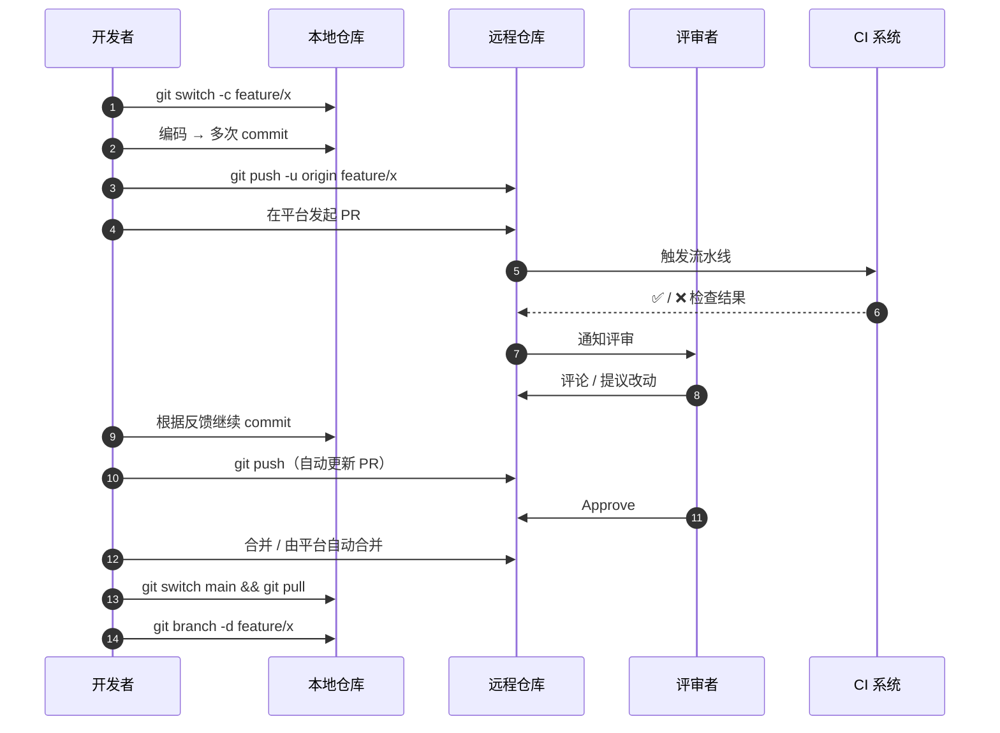

# 远程协作

Git 是分布式的，每个开发者都拥有完整仓库副本。本章介绍如何连接远程仓库、同步代码，以及基于 Pull Request 的协作流程。

## 管理远程仓库 {#remote}

```bash
# 查看已配置的远程（默认名为 origin）
git remote -v

# 添加远程仓库
git remote add origin git@github.com:user/repo.git

# 修改远程地址（如从 HTTPS 切换到 SSH）
git remote set-url origin git@github.com:user/repo.git

# 重命名与删除
git remote rename origin upstream
git remote remove upstream
```

## 推送与拉取 {#push-pull}

```bash
# 推送当前分支到 origin，并建立跟踪关系
git push -u origin main

# 推送后续提交（已建立跟踪后可简写）
git push

# 推送所有分支
git push --all origin

# 拉取并合并远程更新到本地
git pull

# 等价于 fetch + rebase，保持线性历史
git pull --rebase

# 仅获取远程更新，不自动合并
git fetch origin
```

`fetch` 与 `pull` 的区别：`fetch` 只下载数据不改动工作区；`pull` = `fetch` + 自动 `merge`/`rebase`。

## 配置 SSH {#ssh}

使用 SSH 协议可避免每次输入密码：

```bash
# 生成 ED25519 密钥（推荐）
ssh-keygen -t ed25519 -C "you@example.com"

# 查看公钥内容，复制到 Git 托管平台的 SSH 设置中
cat ~/.ssh/id_ed25519.pub

# 测试与 GitHub 的连接
ssh -T git@github.com
# Hi user! You've successfully authenticated.
```

配置多账号时的 `~/.ssh/config` 示例：

```sshconfig
# GitHub 个人账号
Host github.com
  HostName github.com
  User git
  IdentityFile ~/.ssh/id_ed25519

# 企业账号
Host github-work
  HostName github.com
  User git
  IdentityFile ~/.ssh/id_ed25519_work
```

## Pull Request 工作流 {#pr-workflow}

典型的分支协作流程：

```bash
# 1. 从最新的 main 切出功能分支
git switch main && git pull
git switch -c feature/search

# 2. 开发、提交
git add . && git commit -m "feat: 实现搜索功能"

# 3. 推送到远程
git push -u origin feature/search

# 4. 在平台发起 Pull Request / Merge Request
# 5. 评审通过后合并，删除远端分支
git push origin --delete feature/search
```

合并后保持本地 main 同步：

```bash
git switch main
git pull
git branch -d feature/search   # 合并后本地分支已可删除
```

## Fork 协作 {#fork}

为开源项目贡献代码时常用 fork 模式：

```bash
# 1. 在平台 Fork 仓库，然后克隆自己的副本
git clone git@github.com:yourname/repo.git
cd repo

# 2. 添加上游仓库（原始项目）为 upstream
git remote add upstream git@github.com:original/repo.git

# 3. 同步上游最新改动
git fetch upstream
git merge upstream/main

# 4. 在自己的分支开发并推送
git switch -c fix-typo
git commit -am "docs: 修正文档错别字"
git push -u origin fix-typo

# 5. 向上游仓库发起 Pull Request
```

## 跟踪分支 {#tracking}

```bash
# 查看本地分支与远程的跟踪关系
git branch -vv

# 基于远程分支创建本地跟踪分支
git switch -c develop --track origin/develop

# 将本地已有分支关联远程分支
git branch --set-upstream-to=origin/develop

# 取消跟踪关系
git branch --unset-upstream
```

## 协议选择：HTTPS vs SSH {#protocol}

两种协议各有适用场景，按需选择：

| 特性 | HTTPS | SSH |
|------|-------|-----|
| 防火墙/代理友好 | ✅ 只走 443 端口 | ⚠️ 22 端口常被封 |
| 凭证方式 | 账号密码 / Token | 公私钥 |
| 是否需每次输入凭证 | 取决于 credential helper | 配好公钥后无需 |
| 适合匿名克隆 | ✅ | ❌ |
| 推荐场景 | 公司内网、CI/CD、有代理环境 | 个人主力机、开源贡献 |

切换协议：

```bash
# 从 HTTPS 切到 SSH
git remote set-url origin git@github.com:user/repo.git

# 从 SSH 切到 HTTPS
git remote set-url origin https://github.com/user/repo.git
```

## 凭证存储：credential.helper {#credential}

不想每次输密码，把凭证缓存到本地：

```bash
# 内存缓存（默认 15 分钟）
git config --global credential.helper cache

# 内存缓存 1 小时
git config --global credential.helper 'cache --timeout=3600'

# 永久存储到磁盘（明文，注意权限）
git config --global credential.helper store

# macOS 钥匙串（推荐）
git config --global credential.helper osxkeychain

# Windows 凭据管理器（推荐）
git config --global credential.helper manager

# Linux GNOME Keyring
git config --global credential.helper gnome-keyring
```

> GitHub 已不支持账号密码推送，必须用 **Personal Access Token (PAT)** 替代。把 token 当密码填入凭证管理器即可。

## 强制推送的正确姿势 {#force-push}

`git push --force` 会**无条件覆盖**远端历史，可能把别人的提交一起擦掉。`--force-with-lease` 是更安全的版本：它会先检查远端是不是你预期的状态，不是则拒绝推送。

```bash
# 危险：覆盖远端历史
git push --force origin feature/login

# 安全：仅当你本地版本是「远端最新状态」时才允许覆盖
git push --force-with-lease origin feature/login

# 实际场景：本地 rebase 后推送
git rebase main
git push --force-with-lease
# 如果中间同事推了新提交到同一分支，Git 会拒绝推送并提示
```

三种强制推送场景的处理建议：

| 场景 | 推荐方式 | 理由 |
|------|---------|------|
| 个人分支 rebase 后 | `--force-with-lease` | 安全 |
| 共享分支重写历史 | **不要做**，改用 revert | 防止覆盖他人 |
| 已发布 tag 改指向 | 创建新 tag 并删除旧 tag | 不破坏下游 |

## 上游分支与多 remote 协作 {#upstream}

当本地仓库同时关联多个远程（如 fork 模式），需要明确哪个是「上游」、哪个是「自己」：

```bash
# 查看每个 remote 的角色
git remote -v
# origin    git@github.com:you/repo.git      (fetch)
# origin    git@github.com:you/repo.git      (push)
# upstream  git@github.com:original/repo.git (fetch)
# upstream  git@github.com:original/repo.git (push)

# 从 upstream 同步最新代码
git fetch upstream
git switch main
git merge upstream/main                 # 或 git rebase upstream/main

# 推到自己 fork
git push origin main
```

`@<remote>` 简写在 Git 2.20+ 可用：

```bash
git push origin HEAD                     # 推送当前分支到 origin
git fetch upstream                       # 完整写法
git fetch                                # 拉取默认 remote 的所有分支
```

## 代理配置 {#proxy}

公司网络常需要代理才能访问 GitHub：

```bash
# HTTP 代理（只对本协议生效）
git config --global http.proxy http://127.0.0.1:7890
git config --global https.proxy http://127.0.0.1:7890

# SOCKS5 代理
git config --global http.proxy socks5://127.0.0.1:1080

# 仅对 GitHub 生效（避免代理影响内网仓库）
git config --global http.https://github.com.proxy http://127.0.0.1:7890

# 取消代理
git config --global --unset http.proxy
git config --global --unset https.proxy
```

SSH 代理需写到 `~/.ssh/config`：

```sshconfig
Host github.com
  ProxyCommand nc -v -x 127.0.0.1:7890 %h %p
```

## PR 完整生命周期 {#pr-lifecycle}



PR 标题与描述最佳实践：

- 标题遵循 Conventional Commits：`feat:`, `fix:`, `chore:`, `refactor:`, `docs:` 等
- 描述里写清楚「背景」「改动」「影响面」「截图/GIF」
- 关联 Issue：`Closes #123` / `Refs #456`
- 拆分 PR：单个 PR 改动控制在 300-500 行，便于评审

合并方式选择（GitHub）：

| 合并方式 | 历史形态 | 何时用 |
|---------|---------|--------|
| Merge Commit | 保留分支拓扑 | 默认；需要追溯完整历史 |
| Squash and Merge | 单个合并提交 | 个人 feature 分支；历史简洁 |
| Rebase and Merge | 线性 | 长期 feature 分支；保持 main 线性 |

## 小结 {#summary}

本章掌握了 remote 管理、push/pull/fetch 同步、SSH 配置、Pull Request 与 fork 协作流程。下一章将学习历史管理与撤销技巧，包括 reset、revert、stash 等命令。
