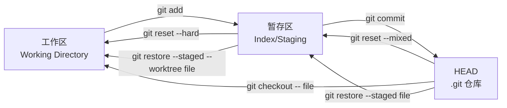

# 历史管理与撤销

本章介绍如何安全地撤销改动、整理提交历史，以及在误操作时找回丢失的提交。

## reset 三种模式 {#reset}

`git reset` 将当前分支指针移动到指定提交，不同模式影响工作区和暂存区：

```bash
# 软重置：仅移动分支指针，保留暂存区与工作区
git reset --soft HEAD~1

# 混合重置（默认）：移动指针并重置暂存区，保留工作区
git reset --mixed HEAD~1
git reset HEAD~1          # 等价于 --mixed

# 硬重置：彻底丢弃目标提交之后的所有改动（危险）
git reset --hard HEAD~1
```

三种模式对比：

| 模式 | 分支指针 | 暂存区 | 工作区 |
|------|----------|--------|--------|
| --soft | 移动 | 保留 | 保留 |
| --mixed | 移动 | 重置 | 保留 |
| --hard | 移动 | 重置 | 重置 |

> `--hard` 会永久删除未提交的改动，使用前务必确认工作区已保存。

## 撤销提交（revert） {#revert}

`revert` 通过生成一次**新的提交**来抵消历史提交，不改写已有历史，适合已推送的提交：

```bash
# 撤销某次提交（会生成反向提交）
git revert <commit-hash>

# 撤销最近一次提交
git revert HEAD

# 撤销多次提交（生成多个反向提交）
git revert HEAD~3..HEAD

# 撤销但不自动提交，便于合并处理
git revert --no-commit HEAD~2..HEAD
```

`reset` vs `revert`：本地未推送的改动用 `reset` 整理；已共享的历史用 `revert` 撤销。

## 暂存改动（stash） {#stash}

临时保存未完成的改动，以便切换分支或拉取更新：

```bash
# 暂存当前工作区与暂存区
git stash

# 暂存并附带描述
git stash push -m "正在进行登录重构"

# 查看所有 stash
git stash list
# stash@{0}: On main: 正在进行登录重构

# 恢复最近一次暂存并删除它
git stash pop

# 仅恢复不删除
git stash apply stash@{0}

# 删除指定暂存
git stash drop stash@{0}

# 清空全部暂存
git stash clear
```

## 找回丢失提交（reflog） {#reflog}

`reflog` 记录 HEAD 的每一次移动，是误删提交的「后悔药」：

```bash
# 查看 HEAD 变动历史
git reflog
# a1b2c3d HEAD@{0}: reset: moving to HEAD~1
# e4f5g6h HEAD@{1}: commit: feat: 完成支付模块

# 找回被 reset 掉的提交
git reset --hard e4f5g6h

# 仅查看某分支的 reflog
git reflog show main
```

> reflog 是本地记录，默认保留约 90 天，且不会同步到远程。

## 拣选提交（cherry-pick） {#cherry-pick}

将某个（或某些）提交复制到当前分支：

```bash
# 拣选单个提交
git cherry-pick <commit-hash>

# 拣选一段连续提交（不含起点）
git cherry-pick A..C     # 应用 B、C

# 含起点
git cherry-pick A^..C

# 冲突时解决后继续
git add conflicted.txt
git cherry-pick --continue
```

## 交互式变基整理 {#interactive-rebase}

在合并前整理本地提交历史：

```bash
# 对最近 3 次提交进行交互式变基
git rebase -i HEAD~3
```

编辑器中的常用指令：

```text
pick   a1b2c3d feat: 添加登录页
reword b2c3d4e fix: 修正样式      # 修改提交信息
squash c3d4e5f 补充细节          # 合并到上一条
edit   d4e5f6g 草稿              # 暂停以便修改
drop   e5f6g7h 无用提交          # 删除
```

继续或中止：

```bash
git rebase --continue
git rebase --abort
```

进阶用法：

```bash
# 1. 自动 squash：把"fix typo"等无意义提交合到主提交
git rebase -i --autosquash HEAD~5
# 配合提交时使用 `git commit --fixup=<commit>` 标记

# 2. 执行某次提交时暂停以做修改
# 在 rebase 列表里把 pick 改成 edit
# 修改文件 → git add → git commit --amend
git rebase --continue

# 3. 拆分提交
git rebase -i <commit>^
# 把要拆分的提交改成 edit
git reset HEAD^
git add <部分1>
git commit -m "第一部分"
git add <部分2>
git commit -m "第二部分"
git rebase --continue

# 4. 在 rebase 期间跳过一次（保留当前 commit 内容不动）
git rebase --skip

# 5. 仅修改最近 N 次的作者信息（统一更换邮箱）
git rebase -i HEAD~N --exec 'git commit --amend --no-edit --reset-author'
```

## stash 进阶用法 {#stash-advanced}

基础 stash 之外，几个高阶用法：

```bash
# 暂存未跟踪文件（默认 stash 不含新文件）
git stash push -u
git stash push --include-untracked

# 暂存被修改和被删除的文件，但保留新文件
git stash push --keep-index          # 暂存区与工作区分别处理

# 从指定分支应用 stash
git stash list                       # 找到 stash@{n}
git stash apply stash@{2}

# 基于 stash 创建新分支（避免冲突污染当前分支）
git stash branch feature/from-stash stash@{0}

# 查看 stash 的内容（不弹出）
git stash show -p stash@{0}

# 只暂存部分文件（交互式）
git stash push -- path/to/file1 path/to/file2

# 用 stash 做"临时切换分支做别的事"
git stash push -m "搜索功能半成品"
git switch main
git pull
git switch feature/search
git stash pop
```

> **常见坑**：`git stash pop` 遇到冲突时，stash 不会被自动删除（保留在 list 中），需要冲突解决后手动 `git stash drop`。

## reflog 找回误操作 {#reflog-detail}

`git reflog` 是误操作时的最后一道防线，几乎所有本地操作（commit、reset、rebase、merge）都会被记录：

```bash
# 查看 HEAD 变动
git reflog

# 查看所有引用（包括分支）的变动
git reflog --all

# 找回被误 reset --hard 丢掉的提交
git reflog
# a1b2c3d HEAD@{0}: reset: moving to HEAD~3
# e4f5g6h HEAD@{1}: commit: 完成支付模块
# f7g8h9i HEAD@{2}: commit: 添加支付路由

# 恢复到 e4f5g6h
git reset --hard e4f5g6h

# 找回被误删的分支
git reflog
# 找到该分支最后一次提交 hash
git switch -c feature/recovered <hash>

# 查看某个分支的 reflog
git reflog show feature/login

# 清理过期 reflog（默认保留 90 天）
git reflog expire --expire=30.days refs/heads/feature/old
git gc --prune=now
```

> ⚠️ reflog 是**纯本地**的，不会上传到远程，也不会帮你在协作仓库里找回别人的丢失提交。

## cherry-pick 进阶 {#cherry-pick-advanced}

```bash
# 拣选多个不连续的提交
git cherry-pick <hash1> <hash2> <hash3>

# 拣选一段连续提交（A 不含，A^ 含）
git cherry-pick A..C
git cherry-pick A^..C

# 拣选但不自动提交，便于合并多个
git cherry-pick --no-commit <hash1> <hash2>
git commit -m "feat: 批量合并多个 cherry-pick"

# 解决冲突后继续
git add conflicted.txt
git cherry-pick --continue

# 放弃并回到操作前
git cherry-pick --abort

# 跳过当前拣选（冲突太多）
git cherry-pick --skip

# 在拣选时记录原始提交信息（默认保留）
git cherry-pick -x <hash>             # 多一行 "(cherry picked from commit ...)"
```

典型场景：

- main 分支上发现一个 bug，想同步到仍在维护的 release 分支
- 多个 feature 分支共享某次重构提交

## 二分查找 bug：git bisect {#bisect}

当 bug 不确定是哪次提交引入时，用 `git bisect` 在历史里二分搜索：

```bash
# 开始二分
git bisect start

# 标记当前版本为「坏」
git bisect bad

# 标记某个已知正常的版本
git bisect good v1.0.0

# Git 会自动 checkout 到中间版本，检查后告诉 Git 结果
git bisect good   # 这个版本没问题
git bisect bad    # 这个版本也有 bug

# ... 重复几次后，Git 会定位到引入 bug 的提交

# 自动化：用脚本判定
git bisect start HEAD v1.0.0
git bisect run npm test                # 测试通过返回 0 表示 good，非 0 表示 bad

# 结束二分
git bisect reset
```

## 工作区 vs HEAD vs 暂存区 {#three-trees}

理解 Git 的「三个区域」是掌握撤销命令的关键：



每条命令影响的区域：

| 命令 | 工作区 | 暂存区 | HEAD |
|------|--------|--------|------|
| `git restore <file>` | ✏️ 改 | 不变 | 不变 |
| `git restore --staged <file>` | 不变 | ✏️ 改 | 不变 |
| `git reset --soft HEAD~1` | 不变 | 不变 | ⏪ |
| `git reset HEAD~1` | 不变 | ⏪ | ⏪ |
| `git reset --hard HEAD~1` | ⏪ | ⏪ | ⏪ |
| `git checkout <commit>` | ⏪ | ⏪ | ⏪（HEAD 分离） |

## 小结 {#summary}

本章覆盖了 reset 三模式、revert 安全撤销、stash 临时保存、reflog 找回丢失提交，以及 cherry-pick 与交互式变基整理。下一章将介绍标签、子模块、Git Hooks 与常见场景速查。
