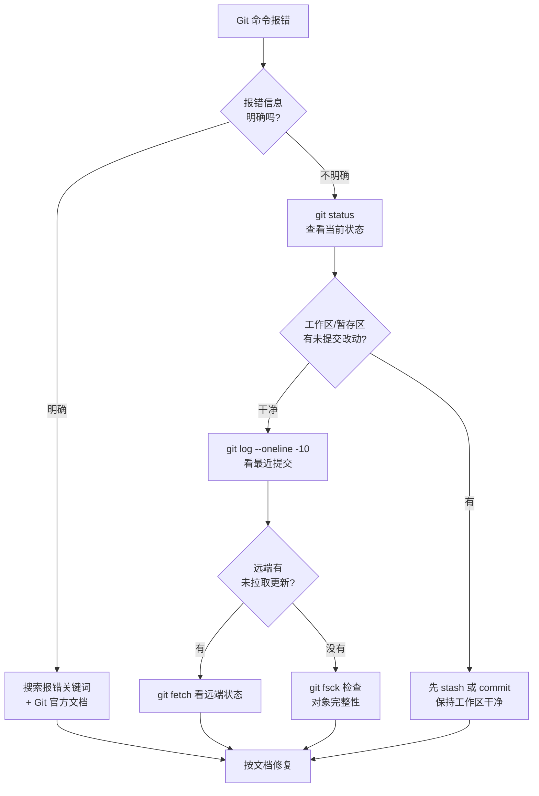

# 常见问题与故障排查

本章按「症状 → 原因 → 解决」的速查结构，覆盖 Git 使用中最高频的报错与误操作。每个问题给出**优先推荐方案**与**兜底方案**，并提示相关命令的章节链接。

## 一、误删与误操作的恢复

### 误删本地分支 {#recover-deleted-branch}

**症状**：`git branch -D feature/login` 后发现分支还有用。

**原因**：分支对象仍存在于 `.git/refs/` 与 reflog 中，删除只是移除了引用。

**解决**：从 reflog 找回：

```bash
# 1. 查看 HEAD 变动历史
git reflog | grep feature/login

# 输出形如：
# e4f5g6h HEAD@{5}: commit: feat: 登录接口完成
# ↑ 找到该分支最后一次提交的 hash

# 2. 重建分支
git switch -c feature/login e4f5g6h

# 3. 如果远端也删了，重新推送
git push -u origin feature/login
```

> reflog 默认保留约 90 天，过期后才真正无法恢复。

### 误 `reset --hard` 丢改动 {#recover-hard-reset}

**症状**：`git reset --hard HEAD~3` 后发现丢弃的提交里还有用。

**解决**：立刻查 reflog，越快越好（GC 之前都还能救）：

```bash
git reflog
# 找到 reset 之前的 hash，比如 e4f5g6h

# 恢复到该状态
git reset --hard e4f5g6h

# 或基于该提交创建新分支
git switch -c feature/recovered e4f5g6h
```

如果已经 GC（reflog 过期且 `git gc` 已运行），提交对象可能被清理，但只要 reflog 还在就有救。

### 找回被 drop 的 stash {#recover-stash}

**症状**：`git stash drop` 后发现还有用。

**解决**：stash 在 `git fsck` 中仍可识别：

```bash
# 查找悬空提交
git fsck --no-reflog | grep commit

# 输出形如：
# dangling commit e4f5g6h
# 查看内容
git show e4f5g6h

# 找回并恢复
git stash apply e4f5g6h
# 或新建分支
git switch -c feature/from-stash e4f5g6h
```

### 提交后想彻底删除（本地 + 远端）{#wipe-commit}

**症状**：提交了敏感信息（API Key、密码），希望**从所有历史中抹除**。

**解决**：

```bash
# 1. 用 BFG Repo-Cleaner（推荐，速度快）
# 下载：https://rtyley.github.io/bfg-repo-cleaner/
java -jar bfg.jar --delete-files credentials.json
java -jar bfg.jar --replace-text passwords.txt   # 把敏感字符串替换成 ***REMOVED***
git reflog expire --expire=now --all
git gc --prune=now --aggressive
git push --force

# 2. 用 git filter-repo（Git 官方推荐替代 filter-branch）
pip install git-filter-repo
git filter-repo --path credentials.json --invert-paths
git push --force

# 3. 用 filter-branch（老方法，慢但内置）
git filter-branch --force --index-filter \
  "git rm --cached --ignore-unmatch credentials.json" \
  --prune-empty -- --all
git push --force --all
```

> ⚠️ **改写历史后必须通知所有协作者重新克隆**。这是破坏性操作，需要团队达成共识。

### 误提交的敏感文件已推送，如何最小化影响？{#leaked-secret}

如果 token 真的暴露到了远端，**仅删除文件还不够**，必须：

1. **立刻吊销该 token/密码**（这是真正的修复，删除文件只是清理）
2. 走上面的 filter-repo/bfg 抹除历史
3. 通知团队成员重新克隆仓库
4. 检查 GitHub/GitLab 的「仓库安全告警」是否触发

## 二、推送与拉取相关错误

### `! [rejected] main -> main (non-fast-forward)` {#non-fast-forward}

**症状**：`git push` 被拒，提示「non-fast-forward」。

**原因**：本地 main 落后于远端（有人在你前面推了新提交）。

**解决**：先拉取并整合，再推送：

```bash
# 推荐：拉取并 rebase 保持线性
git pull --rebase
git push

# 或者：拉取并 merge（保留合并节点）
git pull
git push
```

> 永远不要在 main/master 上用 `--force`，否则会覆盖别人的提交。

### `fatal: refusing to merge unrelated histories` {#unrelated-histories}

**症状**：`git pull` 报「拒绝合并不相关的历史」。

**原因**：本地仓库与远端是两个独立创建的仓库，Git 默认拒绝合并。

**解决**：明确允许合并（仅当你确定两者是同一项目时）：

```bash
git pull origin main --allow-unrelated-histories
# 解决冲突 → git commit → git push
```

典型场景：

- 本地 `git init` 后再 `git remote add origin ...`
- 平台初始化仓库时勾选了 README，而本地也 `git init` 后准备 push

### `fatal: could not read Username for 'https://github.com'` {#auth-failed}

**症状**：HTTPS 协议拉取/推送时反复要求输入用户名密码，或直接报认证失败。

**原因**：

1. GitHub 已不支持账号密码推送，必须用 **Personal Access Token (PAT)**
2. 凭证没缓存

**解决**：

```bash
# 1. 在 GitHub 生成 PAT：Settings → Developer settings → Personal access tokens
# 2. 配置凭证存储
git config --global credential.helper store    # 永久存储（明文）
git config --global credential.helper manager   # Windows 推荐
git config --global credential.helper osxkeychain  # macOS 推荐

# 3. 第一次 push 时用户名填 GitHub 用户名，密码填 PAT（不是账号密码）

# 4. 验证
git push
```

### `Permission denied (publickey)` {#ssh-permission}

**症状**：SSH 协议推送/克隆报「公钥权限被拒绝」。

**排查步骤**：

```bash
# 1. 确认公钥是否添加到平台
cat ~/.ssh/id_ed25519.pub

# 2. 测试 SSH 连接（GitHub）
ssh -T git@github.com
# Hi username! You've successfully authenticated...  ← 成功
# Permission denied (publickey).                    ← 失败

# 3. 详细调试
ssh -vT git@github.com
# 看「Offering public key」「Authentications that can continue」等关键行

# 4. 检查文件权限（权限过宽会被拒）
chmod 700 ~/.ssh
chmod 600 ~/.ssh/id_ed25519
chmod 644 ~/.ssh/id_ed25519.pub

# 5. 检查 ssh-agent 是否加载了密钥
ssh-add -l                              # 列出已加载
ssh-add ~/.ssh/id_ed25519               # 重新加载
```

### 推送卡住、超时 {#push-hang}

**症状**：`git push` 卡在「Writing objects: XX%」很长时间。

**可能原因与解决**：

```bash
# 1. 网络慢或大对象多：开压缩
git config --global core.compression 9

# 2. 走 HTTP/2 长连接（Git 2.18+）
git config --global http.version HTTP/2

# 3. 公司代理问题：检查代理配置
git config --global --get http.proxy

# 4. 对象过大：考虑先 git gc
git gc
```

## 三、状态与工作区相关

### `detached HEAD` 状态 {#detached-head}

**症状**：终端提示「You are in 'detached HEAD' state」。

**含义**：HEAD 不在任何分支上，而是直接指向某个提交。

**应对**：

```bash
# 情况 1：只是想查看旧版本，看完想回到分支
git switch main                           # 直接切回分支即可

# 情况 2：在 detached 状态下做了实验性提交，想保留
git switch -c feature/experiment HEAD     # 基于当前 HEAD 拉新分支
# 或
git branch feature/experiment <commit-hash>

# 情况 3：不想保留
git switch main                           # 直接丢弃
```

### 工作区文件被错误覆盖 {#workdir-overwritten}

**症状**：`git pull` 报「Your local changes would be overwritten」。

**原因**：本地有未提交的改动，与远端冲突。

**解决（按优先级选择）**：

```bash
# 1. 先暂存再拉取
git stash push -m "暂存本地改动"
git pull
git stash pop

# 2. 丢弃本地改动（确认可以丢）
git restore .
git pull

# 3. 强制覆盖本地（极端情况）
git fetch && git reset --hard origin/main
```

### `.git/index.lock` 卡住 {#index-lock}

**症状**：所有 git 命令报「fatal: Unable to create '.git/index.lock': File exists」。

**原因**：上一次 git 进程异常退出，锁文件未清理。

**解决**：

```bash
# 1. 确认没有其他 git 进程在运行
ps aux | grep git

# 2. 删除锁文件
rm -f .git/index.lock

# Windows
del .git\index.lock
```

## 四、跨平台与编码问题

### 换行符混乱（CRLF vs LF）{#line-endings}

**症状**：

- 同一个文件在 Windows 与 Linux 上 diff 全是 `^M`
- PR 里整文件显示改动
- shell 脚本在 Linux 上无法执行（`\r` 命令未找到）

**原因**：Windows 默认用 CRLF，Linux/macOS 用 LF；Git 在不同平台检出策略不同。

**解决方案 A（推荐）**：仓库根加 `.gitattributes` 统一规则：

```gitattributes
# 源码统一 LF 存储
*.js   text eol=lf
*.ts   text eol=lf
*.json text eol=lf
*.md   text eol=lf
*.sh   text eol=lf
*.py   text eol=lf

# Windows 特定文件保持 CRLF
*.bat  text eol=crlf
*.cmd  text eol=crlf
*.sln  text eol=crlf
```

**解决方案 B**：禁用自动转换，让 Git 不修改换行：

```bash
git config --global core.autocrlf false
```

**清理已污染的仓库**：

```bash
# 一次性把全仓库改成 LF
git rm --cached -r .
git reset --hard
# 配合 .gitattributes 提交后，所有新克隆都会自动一致
```

### 中文文件名乱码 {#chinese-filename}

**症状**：`git status` 显示中文文件名乱码或 `\xxx\xxx` 转义。

**解决**：

```bash
# 1. 让 Git 显示原始 UTF-8（推荐）
git config --global core.quotepath off

# 2. Windows 下设置控制台编码为 UTF-8
chcp 65001

# 3. 如果文件名本身就是乱码（被错误转换过），用 fsck 找回正确名字
git fsck --lost-found
# 检查 .git/lost-found/ 里的文件
```

## 五、性能与仓库体积

### 仓库越来越大，clone 很慢 {#big-repo}

**原因**：历史里有大文件、太多提交，或二进制文件没有走 LFS。

**解决**：

```bash
# 1. 浅克隆（只拉最近一次提交，CI 友好）
git clone --depth=1 https://github.com/user/repo.git

# 2. 部分克隆（不下载 blob，按需拉取，Git 2.19+）
git clone --filter=blob:none https://github.com/user/repo.git

# 3. 找出历史中最大的文件（先分析）
git rev-list --objects --all | \
  git cat-file --batch-check='%(objecttype) %(objectname) %(objectsize) %(rest)' | \
  awk '/^blob/ && $3 > 1048576 {print $3/1048576 "MB", $4}' | sort -rn | head

# 4. 用 BFG 删除历史大文件
java -jar bfg.jar --strip-blobs-bigger-than 10M
git reflog expire --expire=now --all && git gc --prune=now --aggressive
```

### `git status` / `log` 很慢 {#slow-status}

**原因**：仓库里文件太多，或有未跟踪的巨型目录。

**排查与解决**：

```bash
# 1. 把生成目录加入 .gitignore
echo "node_modules/" >> .gitignore
echo "dist/" >> .gitignore
echo ".next/" >> .gitignore
git rm -r --cached node_modules

# 2. 启用 fsmonitor（Git 2.16+，监听文件变化而非轮询）
git config core.fsmonitor true

# 3. 启用 untrackedCache
git config core.untrackedCache true

# 4. 大型 monorepo 考虑 sparse-checkout（只检出部分目录）
git sparse-checkout init --cone
git sparse-checkout set src/ docs/
```

## 六、提交相关问题

### 提交信息写错了（未推送）{#fix-commit-msg}

```bash
# 修改最近一次提交信息
git commit --amend -m "新的提交信息"

# 仅修改信息，不改文件
git commit --amend --no-edit              # 保持原信息
git commit --amend --only -m "新信息"     # 仅改信息，不动暂存区
```

### 提交信息写错了（已推送到远端）{#fix-pushed-commit}

```bash
# 方案 A：仅修改信息，最优雅
git commit --amend -m "修正后的信息"
git push --force-with-lease               # 用 --force-with-lease 不要 --force
# 注意：仅当没人在你之后推送过该分支时才能这么做

# 方案 B：用 revert 撤销后重新提交
git revert <commit-hash>
# 然后再提一个新提交
```

### 想修改历史提交的作者邮箱 {#change-author}

```bash
# 仅修改最近 1 次
git commit --amend --reset-author --no-edit

# 批量修改历史全部提交
git rebase -i HEAD~N --exec 'git commit --amend --no-edit --reset-author'
```

更彻底的方案（重写全部历史）：

```bash
git filter-repo --mailmap my-mailmap.txt
# my-mailmap.txt 格式：
# Correct Name <correct@example.com> <old@example.com>
```

### 不小心把 `.env` 提交了 {#committed-env}

**症状**：把 `.env`（含数据库密码、API key）提交并推送了。

**立刻做**：

1. **先轮换所有泄露的凭证**（数据库密码、API key、token 等），这是真正的修复
2. 从 Git 历史中抹除 `.env`：

   ```bash
   # 用 filter-repo
   git filter-repo --path .env --invert-paths
   git push --force
   ```

3. 加入 `.gitignore`，防止再犯：

   ```gitignore
   .env
   .env.*
   !.env.example
   ```

4. **通知所有协作者重新克隆仓库**（仅靠 force-push 不够，他们本地还有 `.env`）

## 七、合并与冲突

### 冲突太多，无从下手 {#too-many-conflicts}

**策略**：

```bash
# 1. 先看冲突文件清单
git diff --name-only --diff-filter=U

# 2. 看冲突统计
git diff --diff-filter=U | grep '^Index:' | wc -l

# 3. 中止当前合并，换用 rebase 减少合并节点
git merge --abort
git rebase main

# 4. 用图形化工具
git mergetool                       # 需先配置 merge.tool

# 5. 用 rerere 自动复用上次的解决方案
git config --global rerere.enabled true
```

### 误合并了不该合并的分支 {#wrong-merge}

**未推送**：

```bash
# 撤销 merge commit（保留改动在暂存区）
git reset --hard HEAD~1             # 直接回退一步
# 或
git reset --merge ORIG_HEAD         # Git 记下了 merge 前的状态
```

**已推送**：

```bash
git revert -m 1 <merge-commit-hash>  # 生成一个反向合并
git push
```

`-m 1` 表示「保留主分支一侧」，数字是父提交编号（`git log --pretty=%P` 可看）。

## 八、子模块相关 {#submodule-issues}

### 克隆后子模块目录为空 {#empty-submodule}

**症状**：`git clone` 后 `vendor/lib/` 目录是空的。

**解决**：

```bash
# 初始化并拉取子模块
git submodule update --init --recursive

# 或在 clone 时一步到位
git clone --recurse-submodules https://github.com/user/repo.git
```

### 子模块与主项目不同步 {#submodule-out-of-sync}

**症状**：进入子模块目录，`git status` 提示「HEAD detached」或「commits ahead」。

**解决**：

```bash
# 在子模块目录内更新到最新
cd vendor/lib
git fetch
git checkout main
git pull

# 回到主项目，记录新指针
cd ../..
git add vendor/lib
git commit -m "chore: 更新 lib 子模块到最新"
```

### 删除子模块 {#remove-submodule}

```bash
# 1. 解除跟踪
git submodule deinit -f vendor/lib
git rm -f vendor/lib
rm -rf .git/modules/vendor/lib

# 2. 清理 .gitmodules
git add .gitmodules
git commit -m "chore: 删除 vendor/lib 子模块"
```

## 九、其他高频问题速查

| 症状 | 原因 | 解决 |
|------|------|------|
| `fatal: not a git repository` | 当前目录不是 Git 仓库 | `cd` 到正确目录，或 `git init` |
| `fatal: bad config variable ...` | `.git/config` 格式损坏 | 编辑 `.git/config` 修复对应行 |
| `warning: LF will be replaced by CRLF` | Windows 检出策略触发 | 配置 `.gitattributes` 或 `core.autocrlf` |
| `error: failed to push some refs` | 远端有更新未拉取 | `git pull --rebase` 后再 push |
| `Already up to date.` 但实际有冲突 | 远端 ref 与本地分支未对齐 | `git fetch && git status` 检查 |
| `git diff` 没输出但文件明明改了 | 改动只在已暂存区 | `git diff --staged` |
| `git log` 不显示新提交 | 可能在别的分支上 | `git log --all` 或 `git branch` |
| `git clean -fd` 把重要文件删了 | 未跟踪文件被误删 | 立刻 `git fsck --lost-found` 尝试恢复 |
| `error: src refspec X does not match any` | 本地分支不存在 | `git branch` 确认，或加 `--all` 推送 |
| `fatal: cannot lock ref` | 引用冲突（大小写敏感） | 用 `git update-ref -d refs/heads/...` 清理 |

## 十、自查清单

遇到问题时按以下顺序排查：



## 小结 {#summary}

本章覆盖了 Git 日常与协作中最常见的 30+ 个问题：**误删与误操作恢复、推送/拉取错误、状态异常、跨平台编码、性能优化、提交修复、合并冲突、子模块问题**。最关键的几个救命命令值得记牢：

- `git reflog` —— 几乎所有「误操作」都能从 reflog 找回
- `git stash` —— 临时保存工作区，切换上下文
- `git revert` —— 撤销已推送的提交（不动公共历史）
- `git reset --hard` —— 仅在本地未推送时使用
- `--force-with-lease` —— 强制推送的安全版本

至此 Git 教程全部完成——六章覆盖了安装配置、本地操作、分支协作、远程同步、历史管理、进阶工具，以及故障排查。下一步可以在真实项目中多加练习，遇到具体问题时回来对照本章速查。
