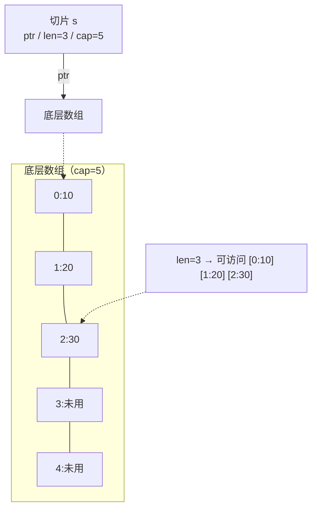
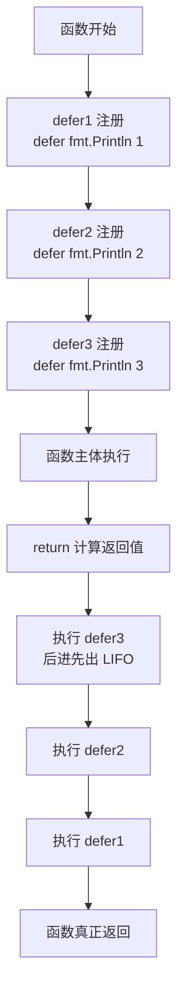

# 环境搭建与基础语法

## 安装与环境 {#install}

从 [golang.org/dl](https://golang.org/dl/) 下载安装，验证：

```bash
go version
# go version go1.27.0 linux/amd64
go env          # 查看全部环境配置
go env GOPATH GOMODCACHE GOPROXY   # 查看指定项
```

### 必须理解的环境变量 {#env-vars}

| 变量 | 含义 | 说明 |
|------|------|------|
| `GOROOT` | Go 安装目录 | 一般不用手动设置 |
| `GOPATH` | 工作区根目录 | 默认 `~/go`；**存放 `go install` 的二进制和模块缓存** |
| `GOMODCACHE` | 模块缓存目录 | `$GOPATH/pkg/mod`，下载的依赖都在这 |
| `GOPROXY` | 模块代理 | 国内务必换成 `https://goproxy.cn,direct` |
| `GOOS` / `GOARCH` | 交叉编译目标 | `GOOS=linux GOARCH=amd64 go build` |
| `GOFLAGS` | 默认构建参数 | 如 `-mod=mod` |
| `CGO_ENABLED` | 是否启用 cgo | 交叉编译静态二进制时设 `0` |

国内加速（务必配置，否则 `go get` 会卡死）：

```bash
go env -w GOPROXY=https://goproxy.cn,direct
go env -w GOSUMDB=sum.golang.google.cn   # 或 GOPRIVATE 跳过私有库校验
```

> [!TIP]
> `go env -w` 写入的是用户级配置（`go env GOENV` 指向的文件），不需要手动改 shell profile。

## 第一个程序 {#hello-world}

```go
package main

import "fmt"

func main() {
    fmt.Println("Hello, Go!")
}
```

```bash
go run main.go     # 编译并运行（不产出二进制）
go build -o app .  # 编译产出可执行文件
```

**硬性规则**（新手最容易踩）：

- 每个文件必须声明 `package`，可执行程序必须是 `package main` 且含 `func main()`
- **导入了就必须使用**，未使用的 import 和未使用的局部变量都是**编译错误**（不是警告）
- 大括号 `{` 不能换行（Go 自动插入分号的规则导致）
- 导出标识符首字母**大写**（跨包可见性由大小写决定，没有 `public`/`private` 关键字）

## 变量声明 {#variables}

```go
// 完整声明
var name string = "Alice"

// 类型推断
var age = 25

// 短变量声明（仅函数内可用）
count := 10

// 多变量
var x, y int = 1, 2
a, b := 3, 4

// 批量声明（常用于包级变量）
var (
    host = "localhost"
    port = 8080
)

// 空白标识符 _ 丢弃值
_, err := os.ReadFile("f.txt")
```

**`var` 与 `:=` 的区别**（面试高频）：

| | `var` | `:=` |
|---|---|---|
| 作用域 | 函数内 + 包级 | **仅函数内** |
| 类型 | 可显式指定或推断 | 必须能推断 |
| 重复声明 | 不允许 | 至少有一个新变量即可（**会导致意外的变量遮蔽**） |

> [!WARNING]
> `:=` 在 `if`/`for` 内层使用会**创建新变量遮蔽外层**，这是最常见的 bug 来源：
> ```go
> var err error
> if true {
>     data, err := os.ReadFile("f.txt")  // 新建了一个 err，外层的没被赋值！
>     _ = data
> }
> // 这里判断外层的 err 永远是 nil
> ```

## 零值体系 {#zero-value}

Go 的变量声明后**一定有初始值**，不存在"未初始化"：

| 类型 | 零值 |
|------|------|
| 数值（int/float/complex） | `0` |
| bool | `false` |
| string | `""` |
| 指针、函数、接口、slice、map、chan | `nil` |
| struct | 各字段的零值 |

**这个设计让 Go 代码更安全**——`var m map[string]int` 可以直接读（`m["k"]` 返回 0），但**写入 nil map 会 panic**，必须 `make` 后才能写。

## 基本类型 {#types}

```go
bool

string          // 不可变字节序列，默认 UTF-8

// 整数：int 的位数由平台决定（64 位系统是 int64）
int, int8, int16, int32, int64
uint, uint8, uint16, uint32, uint64, uintptr

float32, float64
complex64, complex128

byte   // uint8 的别名，处理字节
rune   // int32 的别名，表示一个 Unicode 码点
```

关键注意点：

```go
// 1. Go 没有隐式类型转换，必须显式转换
var i int = 42
var f float64 = float64(i)   // 不写转换是编译错误
var u uint = uint(f)

// 2. int 与 int64 是不同类型，不能直接运算/传参
var a int64 = 10
var b int = 20
// c := a + b        // ❌ 编译错误
c := a + int64(b)    // ✅

// 3. 整数溢出不会报错，会静默回绕
var x uint8 = 255
x++    // x == 0

// 4. 字符串索引拿到的是 byte，不是字符
s := "你好"
fmt.Println(len(s))      // 6（字节数），不是 2
fmt.Println(s[0])        // 228（第一个字节）
```

> [!IMPORTANT]
> `byte` vs `rune`：字符串底层是字节序列，处理中文等多字节字符时要用 `rune`。详见[字符串](#strings)一节。

## 常量与 iota {#constants}

```go
const Pi = 3.14159

// 类型化常量
const Timeout time.Duration = 5 * time.Second

// 常量表达式在编译期求值，可以是任意精度
const Big = 1 << 100          // 合法，远超任何整型
// var x int64 = Big          // ❌ 编译错误：溢出
```

### iota 进阶技巧 {#iota}

`iota` 是 const 块内的**行计数器**，从 0 开始：

```go
// 基础枚举
const (
    Sunday = iota   // 0
    Monday          // 1（重复上一行的表达式）
    Tuesday         // 2
)

// 跳过值
const (
    _ = iota        // 0 被丢弃
    KB = 1 << (10 * iota)  // 1 << 10
    MB                     // 1 << 20
    GB                     // 1 << 30
)

// 带表达式的枚举
const (
    FlagNone = 0
    FlagRead = 1 << iota   // 1 << 1 = 2
    FlagWrite              // 1 << 2 = 4
    FlagExec               // 1 << 3 = 8
)

// 实现 Stringer 让枚举有可读输出
type Weekday int
const (
    Sunday Weekday = iota
    Monday
)
func (w Weekday) String() string {
    return [...]string{"Sunday", "Monday"}[w]
}
```

## 数组与切片 {#array-slice}

**这是 Go 面试和日常开发最高频的知识点，必须理解底层。**

### 数组（固定长度） {#array}

数组是**值类型**，长度是类型的一部分：

```go
var a [3]int              // [0 0 0]
b := [3]int{1, 2, 3}
c := [...]int{1, 2, 3}    // 编译器推断长度
// b = a                  // ✅ 同类型可赋值（整体拷贝）
// b = c                  // ✅ 都是 [3]int
// var d [4]int = b       // ❌ [3]int 和 [4]int 是不同类型
```

因为数组是值拷贝，函数传参时开销大，所以**实际开发几乎不用数组，都用切片**。

### 切片底层结构 {#slice-internals}

切片是一个**描述符**（24 字节），指向底层数组：

```go
type SliceHeader struct {
    Data uintptr   // 指向底层数组的指针
    Len  int       // 当前长度
    Cap  int       // 容量（从 Data 起的可用空间）
}
```



```go
arr := [5]int{10, 20, 30, 40, 50}
s := arr[1:4]   // [20 30 40]，len=3，cap=4（从索引1到底层数组末尾）
```

### 切片操作 {#slice-ops}

```go
s := []int{1, 2, 3, 4, 5}

s[1:3]      // [2 3]          左闭右开
s[:2]       // [1 2]
s[2:]       // [3 4 5]
s[:]        // 全量

// 三索引切片：限制 cap，防止 append 污染原数组
s2 := s[1:3:3]   // [2 3]，len=2，cap=2（cap 上限设为 3-1=2）
```

### append 与扩容机制 {#append}

```go
s := make([]int, 0, 2)
s = append(s, 1, 2)    // len=2 cap=2
s = append(s, 3)       // 触发扩容，cap 变 4，底层数组换新
```

扩容规则（Go 1.18+ 平滑过渡，不再一刀切翻倍）：

- 需要的容量 > 旧 cap 的 2 倍 → 直接用需要的容量
- 旧 cap < 256 → 新 cap = 旧 cap × 2
- 旧 cap ≥ 256 → 新 cap = 旧 cap + (旧 cap + 3×256) / 4（约 1.25 倍增长）
- 之后还要按内存规格向上取整

**关键结论：append 可能导致底层数组搬迁，所以必须接收返回值**：

```go
s = append(s, x)   // ✅ 必须重新赋值
// append(s, x)    // ❌ 结果被丢弃，无意义
```

### 共享底层数组的陷阱（高频 bug） {#slice-pitfall}

切片是引用语义，**多个切片可能指向同一底层数组**：

```go
a := []int{1, 2, 3, 4, 5}
b := a[:3]       // b 和 a 共享底层数组
b[0] = 99
fmt.Println(a)   // [99 2 3 4 5]  ← a 被改了！
```

**最经典的坑：`append` 在 cap 足够时复用底层数组**

```go
a := make([]int, 3, 5)   // len=3 cap=5
a[0], a[1], a[2] = 1, 2, 3

b := append(a[:2], 99)   // 从 a[:2] 追加，cap 还够 → 直接写到底层数组
fmt.Println(a)           // [1 2 99]  ← a[2] 被覆盖成了 99！
fmt.Println(b)           // [1 2 99]
```

**解决方案**：用三索引切片限制 cap，强制 append 时拷贝：

```go
b := append(a[:2:2], 99)   // 限制 cap=2，append 必然分配新数组
fmt.Println(a)             // [1 2 3]  ← 原数组安全
```

**安全复制**：

```go
// 方式一：copy
dst := make([]int, len(src))
copy(dst, src)

// 方式二（Go 1.21+）：slices.Clone
dst := slices.Clone(src)
```

### 切片作为函数参数 {#slice-param}

切片是**描述符的值拷贝**——函数内改元素会影响原切片，但 `append` 不会影响原切片的长度：

```go
func modify(s []int) {
    s[0] = 999        // ✅ 影响外部（共享底层数组）
    s = append(s, 1)  // ❌ 只改了副本的 len，外部看不到
}

func appendTo(s []int) []int {
    return append(s, 1)   // ✅ 正确做法：返回新切片
}
```

## map {#map}

### 基本使用 {#map-basic}

```go
m := make(map[string]int)          // 必须用 make
m2 := map[string]int{"a": 1}       // 字面量
var m3 map[string]int              // nil map

m["b"] = 2                         // 写入
v := m["a"]                        // 读取，key 不存在返回零值 0
v, ok := m["c"]                    // comma-ok 惯用法，ok 表示是否存在
delete(m, "a")                     // 删除（key 不存在也不报错）
fmt.Println(len(m))                // 元素个数（cap 不适用于 map）
```

> [!WARNING]
> **向 nil map 写入会 panic**，读取和 `len()` 则安全。声明后务必 `make`。
> ```go
> var m map[string]int
> // m["a"] = 1   // ❌ panic: assignment to entry in nil map
> m = make(map[string]int)   // 必须先 make
> ```

### 为什么判断 key 存在要用 comma-ok {#map-comma-ok}

```go
m := map[string]int{"a": 0}

v := m["a"]
if v == 0 {
    // 无法区分：a 存在但值为 0，还是 a 根本不存在？
}

v, ok := m["a"]
if !ok {
    // 明确知道 key 不存在
}
```

map 的零值陷阱：`m[k]` 对不存在的 key 返回**值类型的零值**，这在 `map[string]*User`、`map[string]bool` 等场景尤其容易出错。

### map 的重要特性 {#map-features}

```go
// 1. 遍历顺序是随机的（Go 故意打乱，防止依赖顺序）
for k, v := range m {
    fmt.Println(k, v)
}
// 需要有序遍历：取 key 切片后排序
keys := make([]string, 0, len(m))
for k := range m {
    keys = append(keys, k)
}
sort.Strings(keys)
for _, k := range keys { /* ... */ }

// 2. map 不是并发安全的！并发读写会 fatal error
// fatal error: concurrent map read and map write

// 3. map 的 key 必须是「可比较」类型（== 有效）
// ✅ int, string, bool, 指针, struct（所有字段都可比较）, array, interface, chan
// ❌ slice, map, func（这三个不能用 == 比较，不能做 key）

// 4. 取地址不被允许
// p := &m["a"]   // ❌ 编译错误：map 元素地址会变（扩容搬迁）
```

### 并发安全的 map {#map-concurrent}

```go
// 方案一：读写锁（通用）
var mu sync.RWMutex
var m = map[string]int{}
func read(k string) int {
    mu.RLock()
    defer mu.RUnlock()
    return m[k]
}

// 方案二：sync.Map（适合读多写少 / key 写入后不再改）
var sm sync.Map
sm.Store("a", 1)
v, ok := sm.Load("a")
sm.LoadOrStore("b", 2)   // 不存在才写入
sm.Range(func(k, v any) bool { return true })
```

> [!TIP]
> `sync.Map` 不是万能的。官方建议场景：(1) key 写入一次、大量读取；(2) 多个 goroutine 各写各的**不相交**的 key 集合。普通场景用 `map + RWMutex` 性能更好。

## 字符串 {#strings}

### 不可变与遍历 {#string-immutable}

```go
s := "hello"
// s[0] = 'H'   // ❌ 字符串不可变

// 按字节遍历（中文会乱码）
for i := 0; i < len(s); i++ {
    fmt.Printf("%c ", s[i])
}

// 按 rune 遍历（正确方式）
s2 := "你好Go"
for i, r := range s2 {
    fmt.Printf("字节位置:%d 字符:%c\n", i, r)
}
// 字节位置:0 字符:你     （每个中文占 3 字节）
// 字节位置:3 字符:好
// 字节位置:6 字符:G

fmt.Println(len(s2))                    // 8（字节数）
fmt.Println(utf8.RuneCountInString(s2)) // 4（真正的字符数）
fmt.Println([]rune(s2))                 // 转成 rune 切片
```

### 字符串拼接性能 {#string-concat}

```go
// ❌ 循环内用 += ：每次都分配新字符串，O(n²)
var s string
for i := 0; i < 10000; i++ {
    s += "a"
}

// ✅ strings.Builder（推荐）
var b strings.Builder
b.Grow(10000)              // 预分配容量，避免扩容
for i := 0; i < 10000; i++ {
    b.WriteString("a")
}
s := b.String()

// ✅ 少量拼接用 fmt.Sprintf
s := fmt.Sprintf("%s-%d", name, id)
```

### string 与 []byte 转换有拷贝开销 {#string-conv}

```go
b := []byte(s)   // 拷贝一次
s2 := string(b)  // 再拷贝一次
```

在高频路径（如网络解析、大量日志）反复转换会成为性能瓶颈。Go 1.20+ 可用 `unsafe` 零拷贝转换，但**极不推荐在业务代码中使用**（原字符串不可变的假设被破坏会引发诡异 bug）。

### 常用 strings 操作 {#strings-ops}

```go
strings.Contains(s, "ab")         // 包含
strings.HasPrefix(s, "http")      // 前缀
strings.HasSuffix(s, ".go")       // 后缀
strings.Index(s, "=")             // 位置，不存在返回 -1
strings.Split(s, ",")             // 切分
strings.Join(parts, ",")          // 合并
strings.TrimSpace(s)              // 去首尾空白
strings.Replace(s, "a", "b", -1)  // 替换（-1 表示全部）
strings.ReplaceAll(s, "a", "b")   // 全部替换
strings.ToUpper(s) / ToLower(s)
strings.Fields(s)                 // 按空白切分
strings.Builder                   // 高效拼接
```

字符串 ↔ 数字：

```go
i, err := strconv.Atoi("42")        // string → int
s := strconv.Itoa(42)               // int → string
f, err := strconv.ParseFloat("3.14", 64)
b, err := strconv.ParseBool("true")
s := strconv.FormatFloat(3.14, 'f', 2, 64)
```

## 控制流 {#control-flow}

### if（支持初始化语句） {#if}

```go
// 初始化语句的变量作用域限于整个 if/else 块
if n := len(s); n > 0 {
    fmt.Println("长度", n)
} else if n == 0 {
    fmt.Println("空")
}

// 经典惯用法：先判错，减少嵌套
if err := doSomething(); err != nil {
    return err
}
```

### switch 的三种形态 {#switch}

```go
// 1. 表达式 switch（自带 break，不需要写）
switch day {
case 1, 2:                    // 多值匹配
    fmt.Println("工作日初")
case 3:
    fmt.Println("周三")
default:
    fmt.Println("其他")
}

// 2. 带初始化语句
switch n := len(s); {
case n > 100:
    fmt.Println("超长")
case n > 10:
    fmt.Println("中等")
}

// 3. 无表达式 switch（替代一长串 if-else，更清晰）
switch {
case score >= 90:
    return "A"
case score >= 80:
    return "B"
default:
    return "C"
}

// fallthrough：强制执行下一个 case（很少用，且必须是 case 的最后一句）
switch n := 2; n {
case 2:
    fmt.Println("two")
    fallthrough
case 3:
    fmt.Println("也会执行")   // 无条件执行，不判断 case 3 的条件
}
```

### for 的四种形态 {#for}

```go
// 1. 三段式
for i := 0; i < 10; i++ { }

// 2. 类似 while
for sum < 100 {
    sum += 10
}

// 3. 无限循环
for {
    if done { break }
}

// 4. for-range（遍历 slice/map/string/channel/数组）
for i, v := range slice { }      // 索引 + 值
for i := range slice { }         // 只要索引
for _, v := range slice { }      // 只要值
for k, v := range m { }          // map
for i, r := range "你好" { }      // string，r 是 rune
for v := range ch { }            // channel
```

> [!WARNING]
> **for-range 的 v 是副本**：修改 `v` 不会影响原元素，要改必须 `slice[i] = xxx`。
> ```go
> for _, u := range users {
>     u.Name = "x"        // ❌ 无效，u 是拷贝
> }
> for i := range users {
>     users[i].Name = "x" // ✅
> }
> ```

### 标签与跳转 {#label}

```go
outer:
for i := 0; i < 3; i++ {
    for j := 0; j < 3; j++ {
        if j == 2 {
            break outer       // 跳出外层循环
            // continue outer // 继续外层下一轮
        }
    }
}
```

`goto` 存在但**几乎不应使用**（Go 团队也不推荐），只在极少数错误处理集中跳转场景见过。

## defer {#defer}

`defer` 把函数调用推迟到**当前函数返回前**执行，是 Go 资源管理的基石。

### 三大规则 {#defer-rules}



**规则一：后进先出（LIFO）**

```go
func f() {
    defer fmt.Println("1")
    defer fmt.Println("2")
    defer fmt.Println("3")
}
// 输出：3 2 1
```

**规则二：参数在注册时立即求值（预计算）**

```go
func f() {
    i := 0
    defer fmt.Println(i)   // 此刻 i=0，参数已确定，之后 i 的变化不影响
    i++
    return
}
// 输出：0
```

**规则三：defer 可以修改命名返回值**

这是理解 `defer` 最关键的一点，分三种情况：

```go
// ① 匿名返回值：defer 改不了返回值
func f1() int {
    var i int
    defer func() { i++ }()
    return i        // 返回值已复制到临时变量，返回 0
}

// ② 命名返回值：defer 能改
func f2() (i int) {
    defer func() { i++ }()
    return i        // 等价于：先 return 0 → defer 把 i 改成 1 → 返回 1
}

// ③ 命名返回值 + defer 用闭包捕获：也能改
func f3() (i int) {
    defer func() { i = 100 }()
    return 1        // 返回 100（defer 覆盖了）
}
```

执行顺序的真相：`return xxx` 不是原子操作，它分为：
1. 计算返回值并赋给返回变量
2. **执行 defer**
3. 携带返回值跳转

> [!IMPORTANT]
> 这就是为什么「defer + 命名返回值」能修改返回结果——defer 在返回值确定之后、函数真正退出之前执行。

### defer 的典型用途 {#defer-usage}

```go
// 1. 资源释放（最常见）
f, err := os.Open("a.txt")
if err != nil {
    return err
}
defer f.Close()          // 紧跟着 Open 写，避免忘记

// 2. 解锁
mu.Lock()
defer mu.Unlock()

// 3. 捕获 panic
defer func() {
    if r := recover(); r != nil {
        log.Printf("recovered: %v", r)
    }
}()

// 4. 修改命名错误（统一错误日志）
func do() (err error) {
    defer func() {
        if err != nil {
            log.Printf("do failed: %v", err)
        }
    }()
    return someOp()
}

// 5. 记录耗时
func slow() {
    defer func(start time.Time) {
        log.Printf("耗时 %v", time.Since(start))
    }(time.Now())     // 注意：参数立即求值，这里传入的是调用时刻
    // ...
}
```

### defer 的坑 {#defer-pitfalls}

**坑一：循环里 defer 会堆积**

```go
// ❌ 循环 1000 次就堆积 1000 个 defer，函数结束前文件句柄不释放
for _, name := range files {
    f, _ := os.Open(name)
    defer f.Close()      // 全部推迟到函数结束才执行
}

// ✅ 用匿名函数包裹，每轮结束就释放
for _, name := range files {
    func() {
        f, _ := os.Open(name)
        defer f.Close()
        // 处理 f
    }()
}
```

**坑二：defer 在循环里引用循环变量**

```go
// Go 1.22 之前：所有 defer 捕获的都是同一个变量，输出 3 3 3
// Go 1.22 起：每轮循环创建新变量，输出 0 1 2 ✅
for i := 0; i < 3; i++ {
    defer fmt.Println(i)
}
```

**坑三：defer 的开销**

Go 1.14+ 引入了**开放编码（open-coded defer）**，把 defer 直接内联在函数末尾，性能大幅提升。但**循环内的 defer 无法内联**，仍有堆分配开销。所以热路径的循环体内要慎用 defer。

## 小结 {#summary}

本章覆盖了 Go 开发的地基：

- **零值体系**让变量永不"未初始化"，但 nil map / nil slice 的写入要格外小心
- **切片**是描述符，共享底层数组是高频 bug 源，用三索引切片或 `copy` 隔离
- **map** 遍历无序、并发不安全、零值需 comma-ok 判断
- **字符串**不可变，`len()` 是字节数，遍历中文用 `range`
- **defer** 是 LIFO、参数预求值、能改命名返回值，循环内使用要谨慎

下一章深入函数、方法与接口——尤其是**值/指针接收者的选择**和**nil 接口陷阱**。
