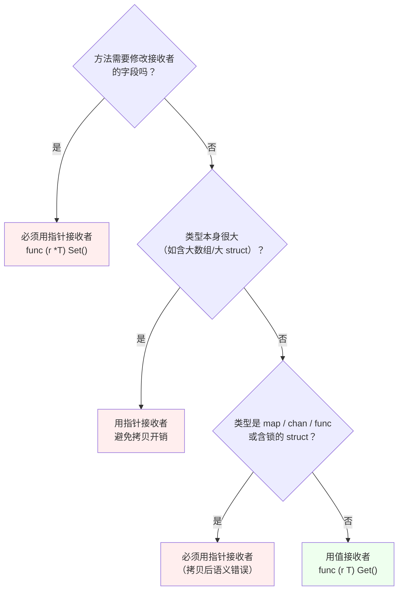
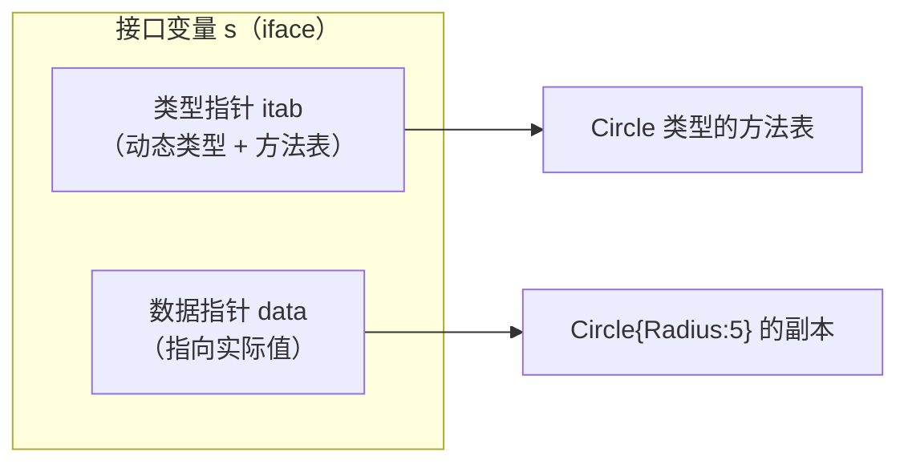

# 函数、方法与接口

## 函数 {#functions}

```go
func add(a, b int) int {      // 同类型参数可合并
    return a + b
}
```

### 多返回值 {#multiple-returns}

Go 函数可以返回多个值，这是其特色，也是错误处理的基础：

```go
func divide(a, b int) (int, error) {
    if b == 0 {
        return 0, errors.New("除数为零")
    }
    return a / b, nil
}

result, err := divide(10, 2)
if err != nil {
    // 处理错误
}
```

### 命名返回值 {#named-returns}

```go
func split(sum int) (x, y int) {
    x = sum * 4 / 9
    y = sum - x
    return   // 裸返回（naked return）
}
```

> [!WARNING]
> 裸返回（不带值的 `return`）会降低可读性，**短函数外不建议使用**。命名返回值真正的价值在于：
> 1. 让 `defer` 能修改返回值（见[第一章 defer](/docs/golang/01-basics/#defer-rules)）
> 2. 作为代码自文档，说明每个返回值是什么
>
> 另外要注意**变量遮蔽**：如果函数内声明了同名的局部变量，裸返回会返回那个局部变量。

### 可变参数 {#variadic}

```go
func sum(nums ...int) int {
    total := 0
    for _, n := range nums {
        total += n
    }
    return total
}

sum(1, 2, 3, 4)      // 10
nums := []int{1, 2, 3}
sum(nums...)         // 切片展开传入

// 固定参数必须在可变参数之前
func printf(format string, args ...any) {}
```

**注意**：可变参数在函数内部就是一个切片。如果把它再传给另一个可变参数函数，要用 `args...`。

### 函数是一等公民 {#first-class}

函数可以赋值给变量、作为参数、作为返回值：

```go
// 函数类型
type HandlerFunc func(w http.ResponseWriter, r *http.Request)
type FilterFunc func(int) bool

// 赋值给变量
var f func(int) int = func(x int) int { return x * 2 }

// 作为参数（回调/策略模式）
func Filter(nums []int, f FilterFunc) []int {
    var res []int
    for _, n := range nums {
        if f(n) {
            res = append(res, n)
        }
    }
    return res
}
Filter([]int{1, 2, 3, 4}, func(n int) bool { return n%2 == 0 })

// 作为返回值（闭包工厂）
func Multiplier(factor int) func(int) int {
    return func(x int) int { return x * factor }
}
double := Multiplier(2)
double(5)   // 10
```

### init 函数 {#init}

```go
func init() {
    // 包初始化时自动执行，不能被调用
}
```

特性：

- 每个包可以有**多个** `init`（同文件或不同文件都行），按出现顺序执行
- 执行时机：包级变量初始化之后、`main()` 之前
- 包的初始化顺序：**依赖包先于当前包**，`main` 包最后
- 典型用途：注册驱动（如 `database/sql` 的 driver）、初始化全局配置

> [!TIP]
> 不要滥用 `init`，它的执行是隐式的，会让代码难以测试和追踪。优先用显式的初始化函数。

## 闭包与匿名函数 {#closure}

闭包 = 函数 + 捕获的外部变量：

```go
func Counter() func() int {
    count := 0
    return func() int {
        count++          // 捕获并修改外部变量
        return count
    }
}

c := Counter()
c()   // 1
c()   // 2     每次调用共享同一个 count
```

### 循环变量捕获陷阱（经典坑） {#loop-capture}

**Go 1.22 之前**，循环变量在整轮循环中是**同一个变量**，goroutine 或闭包捕获的是它的引用：

```go
// Go 1.21 及更早：输出 3 3 3（或 5 5 5，取决于调度）
for i := 0; i < 3; i++ {
    go func() {
        fmt.Println(i)    // 捕获的是同一个 i
    }()
}
```

**修复方式（1.22 前的标准做法）**：

```go
// 方式一：作为参数传入
for i := 0; i < 3; i++ {
    go func(n int) {
        fmt.Println(n)
    }(i)
}

// 方式二：循环内创建副本
for i := 0; i < 3; i++ {
    i := i              // 显式创建本轮副本
    go func() {
        fmt.Println(i)
    }()
}
```

**Go 1.22 起**，每轮循环创建独立的循环变量，上面的问题**自动消失**：

```go
// Go 1.22+：输出 0 1 2（顺序不定但值正确）
for i := 0; i < 3; i++ {
    go func() {
        fmt.Println(i)
    }()
}
```

> [!IMPORTANT]
> 这个改动由 `go.mod` 里的 `go` 指令控制：只有 `go 1.22` 及以上的模块才生效。如果你维护老项目（go.mod 写着 `go 1.20`），即使装了 Go 1.27 编译器，仍是旧行为。

### 闭包的内存影响 {#closure-memory}

闭包会延长被捕获变量的生命周期，导致本可以在栈上分配的对象**逃逸到堆**：

```go
func LeakData() func() []byte {
    data := make([]byte, 1<<20)    // 1MB
    return func() []byte {
        return data[:10]           // 只用了 10 字节，但整个 1MB 被闭包持有，无法回收
    }
}
```

用 `go build -gcflags='-m'` 可以看到逃逸分析结果。

## 方法 {#methods}

方法是**带有接收者**的函数：

```go
type Rectangle struct {
    Width, Height float64
}

// 值接收者
func (r Rectangle) Area() float64 {
    return r.Width * r.Height
}

// 指针接收者（可修改字段）
func (r *Rectangle) Scale(f float64) {
    r.Width *= f
    r.Height *= f
}
```

### 值接收者 vs 指针接收者（核心决策） {#receiver-choice}

这是**Go 开发中最重要的设计决策之一**。



**选择规则速查**：

| 场景 | 选择 | 原因 |
|------|------|------|
| 需要修改接收者字段 | **指针** | 值接收者是副本，改了没用 |
| 类型含 `sync.Mutex` 等同步字段 | **指针** | 拷贝锁会导致锁失效 |
| 类型是 map/slice/chan/func | **值即可** | 它们本身就是引用语义的描述符 |
| 类型很大（struct 含大数组） | **指针** | 避免每次调用的拷贝开销 |
| 类型是基本类型、小 struct、不可变类型 | **值** | 简洁、并发安全、可链式调用 |
| **混用** | **统一用指针** | 同一类型的方法集要保持一致 |

> [!IMPORTANT]
> **一致性原则**：如果一个类型的大部分方法用指针接收者，那么**所有方法都用指针**，即使某些方法不需要修改。混用会让代码难以理解，也容易在接口实现上踩坑。

### 方法集（Method Set）——接口实现的关键 {#method-set}

方法集决定了一个类型**能实现哪些接口**。规则：

| 类型 T | 方法集包含 |
|--------|-----------|
| `T`（值类型） | 所有**值接收者**方法 |
| `*T`（指针类型） | 所有值接收者方法 **+** 所有指针接收者方法 |

即：**`*T` 的方法集是 `T` 的超集**。

```go
type User struct{ Name string }
func (u User) GetName() string { return u.Name }        // 值接收者
func (u *User) SetName(n string) { u.Name = n }         // 指针接收者

var u User
var p *User = &u

u.GetName()   // ✅
u.SetName("x") // ✅ ！编译器自动取地址 &(u).SetName("x")
p.GetName()   // ✅ 编译器自动解引用 (*p).GetName()
p.SetName("x") // ✅
```

**语法糖带来的错觉**：上面 `u.SetName()` 看起来能调用，但这是**编译器自动取地址**的结果，仅在 `u` 是**可寻址值**时才成立。

**方法集差异在接口赋值时暴露**：

```go
type Setter interface {
    SetName(string)
}

var s Setter
s = &User{}   // ✅ *User 的方法集包含 SetName
// s = User{} // ❌ 编译错误：User 的方法集不含 SetName（指针接收者方法）
```

**这就是"我的类型明明有这个方法，为什么不能赋给接口"的根源。**

### 值接收者的并发优势 {#receiver-concurrency}

值接收者在方法内操作副本，**天然线程安全**（前提是字段都是值类型）：

```go
type Counter struct{ n int }
func (c Counter) Value() int { return c.n }   // 只读，安全

// 但如果 Counter 含 map/slice，值接收者仍会共享底层数组，不安全！
```

## 接口 {#interfaces}

接口定义行为契约，Go 的接口是**隐式实现**的——不需要 `implements` 关键字。

```go
type Shape interface {
    Area() float64
}

type Circle struct {
    Radius float64
}

func (c Circle) Area() float64 {
    return 3.14 * c.Radius * c.Radius
}

// Circle 无需显式声明，只要实现 Area() 就满足 Shape
var s Shape = Circle{Radius: 5}
fmt.Println(s.Area())
```

### 接口值的内部结构（理解 nil 陷阱的前提） {#interface-internals}

接口变量在内存中是**两个字**（16 字节）：



**只有当 tab 和 data 都是 nil 时，接口值才等于 nil。** 这引出了下面这个著名陷阱。

### nil 接口陷阱（高频坑） {#nil-interface}

```go
type MyError struct{ Msg string }
func (e *MyError) Error() string { return e.Msg }

func doSomething() error {
    var err *MyError = nil     // err 是一个「值为 nil 的 *MyError 指针」
    // ... 某些逻辑，没有出错
    return err                 // ⚠️ 返回了非 nil 的 error 接口！
}

func main() {
    err := doSomething()
    if err != nil {
        fmt.Println("出错了：", err)   // 会执行！但 err 实际是 nil 指针
    } else {
        fmt.Println("成功")
    }
}
```

**为什么？** 因为 `return err` 把 `*MyError(nil)` 装箱成 `error` 接口：
- tab（类型指针）= `*MyError` 的 itab → **非 nil**
- data（数据指针）= nil

接口值 ≠ nil，所以 `err != nil` 成立。这就是 **typed nil** 问题。

**正确写法**：

```go
func doSomething() error {
    var err *MyError
    // ...
    if err != nil {          // 先判断具体类型
        return err           // 有错才返回
    }
    return nil               // 无错显式返回 nil
}
```

**通用原则**：函数返回 `error` 接口时，出错才返回具体错误，成功一定要 `return nil`，**绝不要返回"可能为 nil 的具体错误类型变量"**。

### 空接口与 any {#empty-interface}

```go
var x interface{}          // 空接口：方法集为空，任何类型都满足它
var y any                  // Go 1.18+，any 是 interface{} 的别名，等价

x = 42
x = "hello"
x = []int{1, 2}

// 空接口可以接收任何值，但使用前必须取出具体类型
```

**使用场景与代价**：

- ✅ 泛型容器、`fmt.Println` 这类接受任意值的 API、JSON 解码的中间态
- ❌ 不要滥用：空接口丢失了类型信息，把编译期错误推迟到运行期，等于放弃了 Go 的类型安全

> [!TIP]
> Go 1.18 之后，需要"任意类型"时**优先用泛型 `[T any]`** 而不是 `any`，泛型保留了类型信息且性能更好（无需装箱拆箱）。

### 类型断言 {#type-assertion}

```go
// 不安全形式：失败会 panic
c := s.(Circle)

// 安全形式（comma-ok，推荐）
c, ok := s.(Circle)
if ok {
    fmt.Println("是 Circle，半径", c.Radius)
}
```

断言的目标类型必须是**接口中可能存在的动态类型**，对空接口 `any` 可以断言成任何类型。

### 类型开关（type switch） {#type-switch}

```go
switch v := s.(type) {      // 注意这里是 (type) 不是 (Circle)
case Circle:
    fmt.Println("Circle", v.Radius)      // 此分支内 v 是 Circle 类型
case Rectangle:
    fmt.Println("Rectangle", v.Width)    // 此分支内 v 是 Rectangle 类型
case nil:
    fmt.Println("s 是 nil")
default:
    fmt.Println("未知类型")
}
```

**注意**：只有 `switch v := x.(type)` 这种写法合法，`v` 在每个 case 中会被自动转换为对应类型。

### 接口组合与嵌套 {#interface-embedding}

```go
// 接口可以嵌入其他接口（Go 1.14+ 允许方法名重叠，只要签名一致）
type Reader interface {
    Read(p []byte) (n int, err error)
}
type Writer interface {
    Write(p []byte) (n int, err error)
}
type ReadWriter interface {
    Reader
    Writer
    Close() error       // 额外方法
}
```

> [!TIP]
> Go 的哲学是「**小接口**」——接口通常只包含一两个方法，在使用方定义而非实现方。典型例子：
> ```go
> // 标准库的定义都很小
> type Stringer interface { String() string }
> type error interface { Error() string }
> type io.Reader interface { Read(p []byte) (n int, err error) }
> ```
> 小接口让实现成本低、组合灵活。

### 常用内置接口 {#builtin-interfaces}

| 接口 | 方法 | 作用 |
|------|------|------|
| `fmt.Stringer` | `String() string` | 自定义打印格式，`%v`/`%s` 时调用 |
| `error` | `Error() string` | 错误类型 |
| `io.Reader` | `Read(p []byte) (int, error)` | 数据读取源 |
| `io.Writer` | `Write(p []byte) (int, error)` | 数据写入目标 |
| `sort.Interface` | `Len/Less/Swap` | 自定义排序 |
| `json.Marshaler` | `MarshalJSON() ([]byte, error)` | 自定义 JSON 序列化 |
| `json.Unmarshaler` | `UnmarshalJSON([]byte) error` | 自定义 JSON 反序列化 |
| `context.Context` | `Deadline/Done/Err/Value` | 上下文传递（见第五章） |

实现 `Stringer` 的例子：

```go
type Money int
func (m Money) String() string {
    return fmt.Sprintf("￥%.2f", float64(m)/100)
}

fmt.Println(Money(1234))   // ￥12.34
```

## 小结 {#summary}

本章的四个核心决策点：

1. **接收者选择**：要改字段/含锁/大对象 → 指针；其余 → 值；同类型要保持一致
2. **方法集**：`*T` 的方法是 `T` 的超集，决定了接口能否赋值成功
3. **nil 接口**：接口 = 类型指针 + 数据指针，返回 `error` 时务必显式 `return nil`
4. **小接口哲学**：接口在使用方定义，越小越灵活

下一章深入结构体（嵌入与组合、tag 与反射）和错误处理体系（`errors.Is/As`、panic/recover）。
