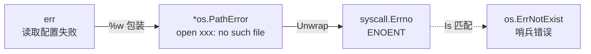
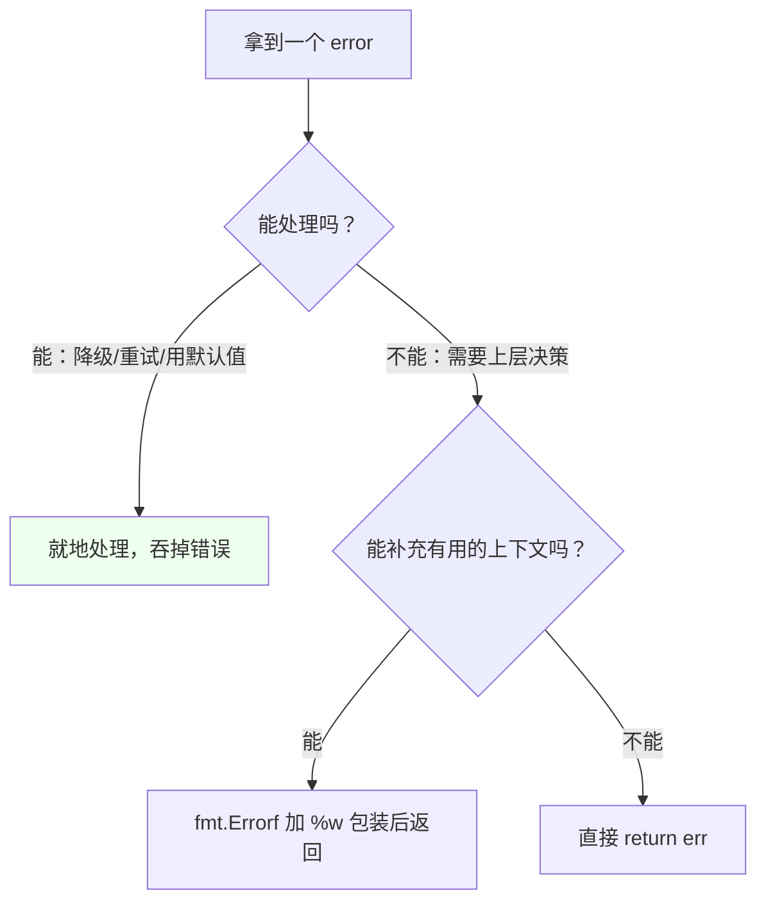

# 结构体与错误处理

## 结构体 {#structs}

### 定义与初始化 {#struct-basic}

```go
type User struct {
    ID     int
    Name   string
    Email  string
    Active bool
}

// 推荐：字段名初始化（不受字段顺序变化影响）
u1 := User{ID: 1, Name: "Alice", Email: "a@example.com", Active: true}

// 不推荐：按位置初始化（增删字段就会错位）
u2 := User{2, "Bob", "b@example.com", false}

// 零值
var u3 User    // {0 "" "" false}

// 指针（常用于构造后修改、或避免大对象拷贝）
u4 := &User{ID: 4}
```

### 构造函数惯例 {#constructor}

Go 没有构造函数关键字，惯例是写 `NewXxx` 函数：

```go
func NewUser(name, email string) (*User, error) {
    if name == "" {
        return nil, errors.New("name 不能为空")
    }
    return &User{
        Name:   name,
        Email:  email,
        Active: true,
    }, nil
}
```

> [!TIP]
> **何时返回指针、何时返回值**：
> - 返回指针：对象较大、需要修改、含 `sync.Mutex` 等不可拷贝字段、需要表达"无值"（返回 nil）
> - 返回值：小的不可变值对象（如 `time.Time`、`Money`），值语义更安全

### 匿名字段与嵌入（组合） {#embedding}

Go 没有继承，用**组合**实现代码复用：

```go
type Base struct {
    ID        int
    CreatedAt time.Time
}

func (b Base) Describe() string {
    return fmt.Sprintf("Base#%d", b.ID)
}

type User struct {
    Base              // 匿名字段（只写类型名，字段名默认是类型名）
    Name  string
    Email string
}

u := User{
    Base:  Base{ID: 1, CreatedAt: time.Now()},
    Name:  "Alice",
    Email: "a@example.com",
}

u.ID              // ✅ 提升字段（promoted field），等价于 u.Base.ID
u.Describe()      // ✅ 提升方法，等价于 u.Base.Describe()
```

**嵌入 vs 匿名字段的区别**：只有**嵌入**（写类型名）才有字段/方法提升，普通具名字段没有：

```go
type A struct {
    B Base      // 具名字段，无提升：必须 a.B.ID
    Base        // 嵌入，有提升：可以 a.ID
}
```

### 方法提升与"重写" {#method-override}

外层可以定义同名方法覆盖被提升的方法：

```go
func (u User) Describe() string {          // 覆盖了 Base.Describe
    return fmt.Sprintf("User#%d:%s", u.ID, u.Name)
}

u.Describe()          // 调用 User 的（外层优先）
u.Base.Describe()     // 显式指定，调用 Base 的
```

> [!IMPORTANT]
> 这不是多态！如果把 `u` 赋给某个接口变量，**调用的是编译期静态决定的方法**，外层的方法会覆盖内层的，被提升的内层方法无法在接口层面"回退"。Go 的组合是纯粹的静态语法糖，与 OOP 的继承/虚函数完全不同。

### 嵌入接口（常用技巧） {#embed-interface}

```go
type ReadWriteCloser interface {
    io.Reader
    io.Writer
    io.Closer
}

// 结构体嵌入接口：可以只实现部分方法，剩下的由注入的实现提供
type ReadTracer struct {
    io.Reader        // 嵌入接口，只包装 Read
    count int
}
func (r *ReadTracer) Read(p []byte) (int, error) {
    n, err := r.Reader.Read(p)    // 转调被包装的 Reader
    r.count += n
    return n, err
}
// ReadTracer 自动满足 io.Reader，无需实现其他方法
```

这个模式在做**装饰器/中间件**（如带计数的 Reader、带日志的 Writer）时非常有用。

### 结构体的可比较性 {#comparable}

```go
type P struct{ X, Y int }
a, b := P{1, 2}, P{1, 2}
fmt.Println(a == b)      // ✅ true（所有字段都可比较）

type S struct{ Data []int }
// c, d := S{}, S{}
// fmt.Println(c == d)   // ❌ 编译错误：含 slice 字段，不可比较
```

规则：

- **可比较**：所有字段都可比较（数值、string、bool、指针、数组、struct、chan、interface）
- **不可比较**：含 slice、map、func 字段

需要比较时用：

```go
reflect.DeepEqual(a, b)        // 深度比较，但性能差、对 nil/空 slice 有差异
slices.Equal(a, b)             // Go 1.21+，比较 slice
// 或自己实现 Equal 方法
```

> [!WARNING]
> `reflect.DeepEqual([]int{}, []int(nil))` 返回 **false**（一个空、一个 nil），这是常见误判点。

## 结构体标签与反射 {#struct-tags}

### 标签的作用 {#tag-basics}

标签是附在字段上的**元信息字符串**，本身不影响语言行为，由库通过反射读取：

```go
type User struct {
    ID        int       `json:"id"`
    Name      string    `json:"name"`
    Email     string    `json:"email,omitempty"`
    Password  string    `json:"-"`                       // - 表示完全忽略
    CreatedAt time.Time `json:"created_at"`
    Internal  string    `json:"internal,omitempty" db:"internal_col" validate:"max=10"`
}
```

**约定格式**：`key1:"value1" key2:"value2"`，多个标签用空格分隔，键值用冒号（**冒号后不能有空格**）。

### 用反射读取标签 {#tag-reflect}

```go
import "reflect"

t := reflect.TypeOf(User{})
field, ok := t.FieldByName("Email")
if ok {
    fmt.Println(field.Tag.Get("json"))      // "email,omitempty"
    fmt.Println(field.Tag.Get("validate"))  // ""
    fmt.Println(field.Tag.Lookup("db"))     // value, ok 形式
}

// 遍历所有字段
for i := 0; i < t.NumField(); i++ {
    f := t.Field(i)
    fmt.Printf("%s → json:%s\n", f.Name, f.Tag.Get("json"))
}
```

### 反射基础 {#reflect-basics}

反射让程序在运行时检查和操作类型，是 `encoding/json`、`orm`、`validator` 等库的底层机制。

```go
import "reflect"

var x float64 = 3.4

t := reflect.TypeOf(x)      // 静态类型信息：float64
v := reflect.ValueOf(x)     // 运行时值：3.4

fmt.Println(t.Kind())       // float64（Kind 是底层类别）
fmt.Println(v.Type())       // float64
fmt.Println(v.Float())      // 3.4
```

**Type vs Kind 的区别**（关键）：

```go
type MyInt int
var m MyInt = 5

reflect.TypeOf(m).Name()   // "MyInt"  ← 自定义类型名
reflect.TypeOf(m).Kind()   // int      ← 底层类别

// 判断时通常用 Kind（因为 Type 对用户自定义类型会不同）
if v.Kind() == reflect.Int { /* ... */ }
```

**反射三定律**：

1. 反射可以从接口值得到反射对象（`reflect.ValueOf(x)`）
2. 反射可以从反射对象得到接口值（`v.Interface().(float64)`）
3. **要修改反射对象，其值必须可设置（settable）**——必须传指针

```go
var x float64 = 3.4
p := reflect.ValueOf(&x)        // 传指针
v := p.Elem()                   // 取指针指向的值
fmt.Println(v.CanSet())         // true
v.SetFloat(7.1)
fmt.Println(x)                  // 7.1

// reflect.ValueOf(x).SetFloat(7.1)   // ❌ panic: 不可设置（传的是副本）
```

**反射的代价**（何时不该用）：

- 性能差（比直接调用慢 1~2 个数量级）
- 丧失编译期类型检查，错误推迟到运行期
- 代码可读性差

> [!TIP]
> 官方建议：**业务代码优先用接口和泛型，反射留给框架层**。详见[第七章泛型与反射](/docs/golang/07-generics-reflect/)。

## 指针深入 {#pointers}

### 基础 {#pointer-basic}

Go 的指针与 C 类似，但**没有指针运算**（不能 `p++`、不能指针相减），更安全：

```go
x := 42
p := &x           // p 是 *int，指向 x
fmt.Println(*p)   // 42，解引用

*p = 100          // 通过指针修改
fmt.Println(x)    // 100

// 结构体指针的字段访问可省略 *
up := &User{ID: 1}
up.Name = "Alice"     // 等价于 (*up).Name
```

### Go 只有值传递 {#pass-by-value}

**这是必须牢记的事实**：Go 的函数参数**永远是值传递**（拷贝），没有引用传递。

```go
func modify(x int) {
    x = 100       // 改的是副本
}
n := 1
modify(n)
fmt.Println(n)    // 还是 1

// 想修改外部变量，传指针（拷贝的是指针本身，但指向同一块内存）
func modifyPtr(x *int) {
    *x = 100
}
modifyPtr(&n)
fmt.Println(n)    // 100
```

**为什么传 slice/map 能"改到"外部？** 因为它们内部含指针，拷贝的是描述符，指向同一底层数组/哈希表：

```go
func modifySlice(s []int) {
    s[0] = 999          // ✅ 改到底层数组，外部可见
    s = append(s, 1)    // ❌ 只改了副本的 len，外部看不到
}
```

### 逃逸分析 {#escape-analysis}

Go 编译器决定变量分配在栈还是堆，由**逃逸分析**自动完成：

```go
// 未逃逸：返回副本，n 分配在栈上
func f1() int {
    n := 42
    return n
}

// 逃逸：返回指针，n 必须在堆上（否则函数返回后地址失效）
func f2() *int {
    n := 42
    return &n
}
```

查看逃逸分析：

```bash
go build -gcflags='-m' main.go
# ./main.go:10:2: moved to heap: n
```

常见逃逸原因：

- 返回局部变量指针
- 被闭包捕获
- 赋值给接口（`fmt.Println(x)` 会让 x 逃逸）
- 容器/goroutine 引用
- 栈空间不足（大对象）

> [!TIP]
> 逃逸不等于性能问题。栈分配快但生命周期受限；堆分配需要 GC。**不要为了"避免逃逸"牺牲代码可读性**，只在性能分析确认瓶颈后优化。

### new vs make {#new-make}

| | `new(T)` | `make(T, ...)` |
|---|---|---|
| 返回 | `*T`（指针） | `T`（值，仅 slice/map/chan） |
| 作用 | 分配零值内存 | 分配**并初始化**内部结构 |
| 适用 | 任意类型 | **仅** slice、map、channel |
| 结果 | 零值的指针，可直接用 | 可直接使用的容器 |

```go
p := new(int)            // *int，指向 0
// 等价于：tmp := 0; p := &tmp

m := make(map[string]int)        // 已初始化，可写
s := make([]int, 0, 10)          // len=0 cap=10
ch := make(chan int, 5)          // 缓冲 5

// make map 时可预分配容量，减少扩容
m2 := make(map[string]int, 1000)
```

> [!WARNING]
> `new(map[string]int)` 返回的是 `*map`，指向一个 **nil map**，写入仍会 panic。map 必须用 `make`（或字面量）初始化。

## 错误处理体系 {#error-handling}

### error 的本质 {#error-essence}

`error` 是一个内置接口：

```go
type error interface {
    Error() string
}
```

任何实现了 `Error() string` 的类型都是错误。标准库的 `errors.New` 返回一个简单的字符串错误：

```go
err := errors.New("连接失败")
fmt.Println(err.Error())    // 连接失败
```

### 错误包装 `%w`（Go 1.13+） {#error-wrap}

用 `fmt.Errorf` 加 `%w` 包装错误，**保留原始错误链**，附加上下文：

```go
func readConfig(path string) ([]byte, error) {
    data, err := os.ReadFile(path)
    if err != nil {
        return nil, fmt.Errorf("读取配置 %s 失败: %w", path, err)
    }
    return data, nil
}
```

`%w` 只能有**一个**（多个 `%w` 在 Go 1.20 之前只会保留最后的，1.20+ 支持多个配合 `errors.Join`）。

### errors.Is / errors.As {#errors-is-as}

包装后，直接比较 `==` 会失效，必须用配套工具：

```go
// errors.Is：判断错误链中是否包含「目标错误」（按 == 比较）
if errors.Is(err, os.ErrNotExist) {
    // 是「文件不存在」错误（可能已被包装多层）
}

// errors.As：从错误链中提取「指定类型」的错误
var pathErr *os.PathError
if errors.As(err, &pathErr) {
    fmt.Println("路径:", pathErr.Path)
    fmt.Println("操作:", pathErr.Op)
}
```

**对比**：

| 工具 | 用途 | 匹配方式 |
|------|------|---------|
| `err == target` | 直接比较 | 仅当未被包装时有效 |
| `errors.Is(err, target)` | 判断是否是某类错误 | 遍历 Unwrap 链，逐个 `==` |
| `errors.As(err, &target)` | 提取特定类型的错误 | 遍历 Unwrap 链，逐个类型断言 |
| `errors.Unwrap(err)` | 拆掉一层包装 | 调用 `Unwrap()` |



### 哨兵错误（Sentinel Error） {#sentinel-error}

预先定义好的错误变量，供调用方用 `errors.Is` 判断：

```go
var (
    ErrNotFound   = errors.New("资源不存在")
    ErrPermission = errors.New("无权限")
)

func Find(id int) (*User, error) {
    // ...
    return nil, ErrNotFound
}

// 调用方
if errors.Is(err, ErrNotFound) {
    return 404
}
```

命名惯例：`ErrXxx`（包级错误变量）或 `XxxError`（错误类型）。

### 自定义错误类型 {#custom-error}

需要携带额外信息时，定义错误结构体：

```go
type NotFoundError struct {
    Resource string
    ID       string
}

func (e *NotFoundError) Error() string {
    return fmt.Sprintf("%s %s 不存在", e.Resource, e.ID)
}

// 可选：实现 Unwrap，把底层错误挂进链
func (e *NotFoundError) Unwrap() error {
    return e.Err
}

// 可选：实现 Is，让 errors.Is 能匹配同类错误（即使字段不同）
func (e *NotFoundError) Is(target error) bool {
    t, ok := target.(*NotFoundError)
    if !ok {
        return false
    }
    return t.Resource == e.Resource || t.Resource == ""
}
```

**实现 `Is`/`As` 的场景**：当"是否是某类错误"不能靠简单的 `==` 判断时（例如按错误码匹配，忽略消息细节）：

```go
type APIError struct {
    Code int
    Msg  string
}
func (e *APIError) Error() string { return e.Msg }
func (e *APIError) Is(target error) bool {
    t, ok := target.(*APIError)
    return ok && t.Code == e.Code     // 只比较 Code，忽略 Msg
}

// 这样 errors.Is(err, &APIError{Code: 404}) 能匹配任何 404 的 APIError
```

### errors.Join（Go 1.20+） {#errors-join}

同时返回多个错误（如批量操作中收集所有失败）：

```go
var errs []error
for _, item := range items {
    if err := process(item); err != nil {
        errs = append(errs, err)
    }
}
if len(errs) > 0 {
    return errors.Join(errs...)       // 合并成一个错误
}

// 也可以用多个 %w
return fmt.Errorf("save failed: %w, %w", err1, err2)

// join 后的错误，errors.Is/As 会遍历所有子错误
if errors.Is(joined, ErrNotFound) { /* ... */ }

// 打印时多个错误用换行分隔
```

典型应用：`defer` 关闭多个资源时收集所有错误：

```go
func writeAll(fs []io.Closer) (err error) {
    defer func() {
        var errs []error
        for _, f := range fs {
            errs = append(errs, f.Close())
        }
        err = errors.Join(append(errs, err)...)   // 保留原错误 + 所有关闭错误
    }()
    // ...
}
```

### 错误处理最佳实践 {#error-best-practice}



**四条原则**：

1. **只处理一次**：要么处理，要么包装后返回，**不要既打日志又返回**（会导致重复记录）
2. **补充上下文**：用 `%w` 加上"在做什么"的信息，让错误可追溯
3. **不要忽略错误**：`_ = doSomething()` 是坏味道，至少要记录
4. **判断用 Is/As，不用字符串匹配**：`strings.Contains(err.Error(), "not found")` 极其脆弱

## panic 与 recover {#panic-recover}

### 基本机制 {#panic-basics}

`panic` 是**程序级的异常**，会中断正常流程并沿调用栈向上冒泡，逐层执行 `defer`，直到被 `recover` 捕获或程序崩溃。

```go
func safeDivide(a, b int) (result int) {
    defer func() {
        if r := recover(); r != nil {
            fmt.Println("捕获到 panic:", r)
            result = 0        // 修改命名返回值
        }
    }()
    return a / b              // b 为 0 时 panic
}
```

**三条铁律**：

1. `recover()` **必须在 `defer` 中直接调用**才有效（在嵌套函数里调用无效）
2. `panic` 触发后，只有 `defer` 语句会执行，后续代码全部跳过
3. `recover` 捕获后，程序从**触发 panic 的那个函数**的 `defer` 之后继续（不会回到 panic 点）

### panic 的典型触发场景 {#panic-cases}

```go
// 1. 显式 panic
panic("配置错误")

// 2. 运行时错误
var s []int
_ = s[0]                  // index out of range

var m map[string]int
m["a"] = 1                // assignment to entry in nil map

var p *int
*p = 1                    // nil pointer dereference

var i interface{} = "s"
_ = i.(int)               // interface conversion（不带 comma-ok 的断言）

ch := make(chan int, 1)
close(ch); close(ch)      // close of closed channel

// 3. 向已关闭的 channel 发送
```

### panic 不跨 goroutine {#panic-goroutine}

**极其重要的坑**：子 goroutine 里的 panic **不会**被父 goroutine 的 recover 捕获，会**直接导致整个程序崩溃**。

```go
func main() {
    defer func() {
        if r := recover(); r != nil {
            fmt.Println("主 goroutine 捕获:", r)   // ❌ 不会执行
        }
    }()
    
    go func() {
        panic("子 goroutine 崩溃")      // 整个程序挂掉，主 goroutine 的 recover 无能为力
    }()
    
    time.Sleep(time.Second)
}
```

**必须每个 goroutine 自己 recover**：

```go
func safeGo(fn func()) {
    go func() {
        defer func() {
            if r := recover(); r != nil {
                log.Printf("goroutine recovered: %v\n%s", r, debug.Stack())
            }
        }()
        fn()
    }()
}

safeGo(func() {
    // 业务代码
})
```

> [!IMPORTANT]
> 生产环境**任何**启动 goroutine 的封装都应该带 recover，否则一个意外 panic 会让整个服务进程退出（这是 Go 服务最常见的崩溃原因之一）。

### HTTP 中间件中的 recover（实战） {#http-recover}

```go
func RecoveryMiddleware(next http.Handler) http.Handler {
    return http.HandlerFunc(func(w http.ResponseWriter, r *http.Request) {
        defer func() {
            if rec := recover(); rec != nil {
                // 打印堆栈，便于排查
                log.Printf("panic: %v\n%s", rec, debug.Stack())
                
                // 防止 header 已写入导致的状态码无效
                w.Header().Set("Content-Type", "application/json")
                w.WriteHeader(http.StatusInternalServerError)
                json.NewEncoder(w).Encode(map[string]string{
                    "error": "internal server error",
                })
            }
        }()
        next.ServeHTTP(w, r)
    })
}

// 使用
http.ListenAndServe(":8080", RecoveryMiddleware(mux))
```

### panic vs error（何时用哪个） {#panic-vs-error}

| | `error` | `panic` |
|---|---|---|
| 语义 | 预期的、可恢复的问题 | 不该发生的程序 bug |
| 典型场景 | 文件不存在、网络超时、参数校验失败、权限不足 | 数组越界、nil 解引用、配置根本没加载、不可达分支 |
| 处理方式 | 显式 `if err != nil` | `recover`（通常在边界处） |
| 常见位置 | 业务代码 | 库代码（表示调用方用错了）、程序初始化 |

> [!WARNING]
> **不要用 panic 做常规错误处理**。`error` 才是 Go 的惯用方式。反例：某个库把"用户输入不合法"用 panic 抛出，会让调用方不得不写满屏的 recover。

**唯一建议用 panic 的业务场景**：程序启动时的**必需依赖缺失**（如配置文件读不到、数据库连不上），此时继续运行没有意义，快速失败（fail fast）比带病运行好。

## 小结 {#summary}

- **结构体**用嵌入实现组合（不是继承），方法提升是编译期语法糖，无多态
- **标签**是字符串元信息，靠反射读取；反射强大但慢，留给框架层
- Go **只有值传递**，指针是"拷贝地址"；逃逸分析自动决定栈/堆
- **错误**是值（接口），`%w` 包装 + `errors.Is/As` 判断；不要字符串匹配、不要重复处理
- **panic** 只用于真正的程序错误，且**不跨 goroutine**，每个 goroutine 要自己 recover

下一章进入 Go 的招牌——并发编程，从 GMP 调度模型讲起。
