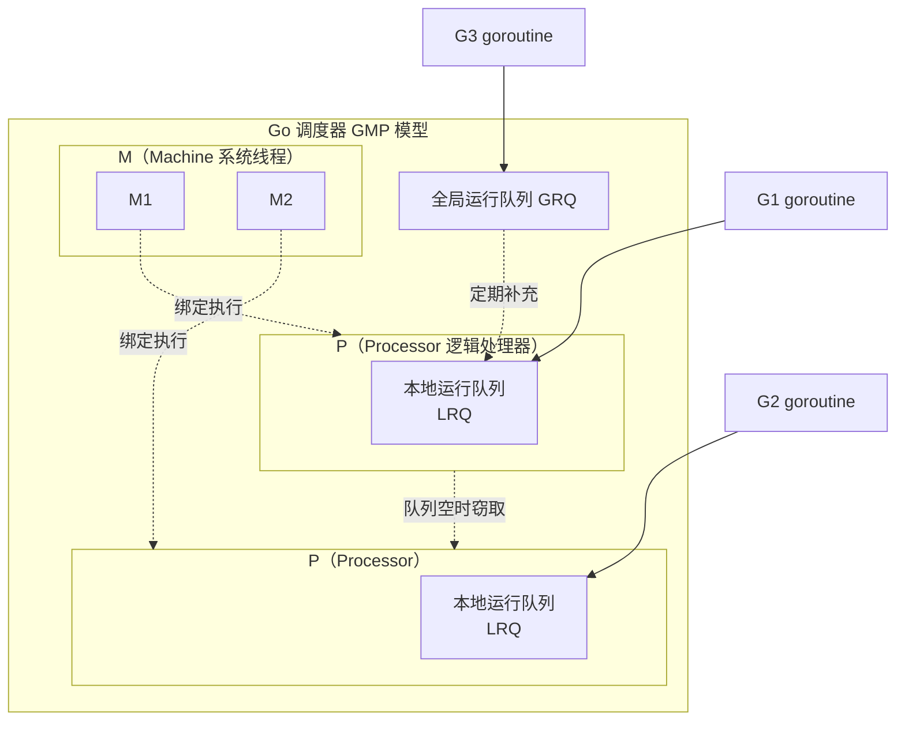
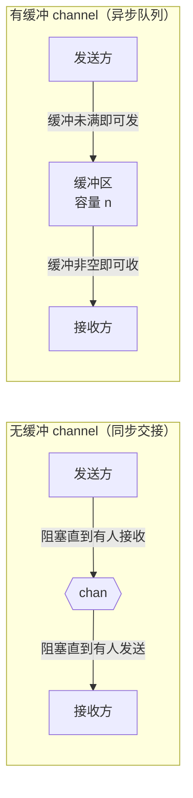
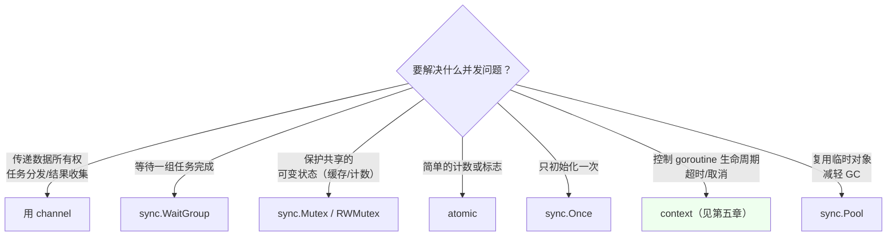

# 并发编程基础

Go 的并发是它的招牌特性，基于 **goroutine** 和 **channel**，遵循「**不要通过共享内存来通信，而要通过通信来共享内存**」。

## GMP 调度模型 {#gmp}

理解调度模型，才能真正理解为什么 goroutine 这么轻、为什么会有并发陷阱。



| 组件 | 全称 | 作用 |
|------|------|------|
| **G** | Goroutine | 待执行的 goroutine，保存栈和状态（约 2KB 初始栈） |
| **M** | Machine | 真实的**操作系统线程**，真正执行代码的实体 |
| **P** | Processor | **逻辑处理器**，持有运行队列，是 G 和 M 之间的桥梁 |

**核心机制**：

- `GOMAXPROCS` 决定 P 的数量（默认 = CPU 核数），即**同时并行执行的 goroutine 上限**
- 每个 P 维护一个本地队列（LRQ），M 绑定 P 后才能执行 G
- **工作窃取（work stealing）**：某个 P 的队列空了，会从其他 P 或全局队列偷任务，保持 CPU 饱和
- **G 阻塞时的移交（hand off）**：G 因系统调用/IO 阻塞时，M 会与 P 解绑，让其他 M 接管 P 继续执行队列里的 G，避免阻塞整个线程

**为什么 goroutine 轻**：

| 对比项 | 系统线程 | goroutine |
|--------|---------|-----------|
| 初始栈 | 1~8 MB（固定） | **约 2 KB**（按需增长/收缩，最大可达 1GB） |
| 创建/销毁 | 需系统调用，开销大 | 用户态操作，约 200ns |
| 调度 | 操作系统内核调度（抢占式，上下文切换约 1~2μs） | Go 运行时调度（协作+抢占，约 200ns） |
| 数量 | 通常数千个就到极限 | 轻松创建数十万甚至上百万 |

> [!TIP]
> 查看/调整并行度：
> ```go
> runtime.GOMAXPROCS(0)   // 查询当前值
> runtime.GOMAXPROCS(4)   // 设置（一般不用改）
> runtime.NumGoroutine()  // 当前 goroutine 数量，常用于监控
> ```

## goroutine {#goroutine}

### 启动与开销 {#goroutine-start}

```go
func say(s string) {
    for i := 0; i < 3; i++ {
        fmt.Println(s)
        time.Sleep(100 * time.Millisecond)
    }
}

func main() {
    go say("world")   // 并发执行
    say("hello")      // 主 goroutine
}
```

> [!WARNING]
> **主 goroutine 退出时，所有其他 goroutine 会被直接终止**（没有等待，没有清理）。所以上面的例子如果 `say("hello")` 很快执行完，可能看不到 "world" 的输出。生产中要用 `WaitGroup` 或 channel 等待。

### goroutine 泄漏（常见生产事故） {#goroutine-leak}

goroutine 一旦阻塞在无法被唤醒的操作上，就永远不会被回收，泄漏的 goroutine 会持续占用内存。

**典型泄漏场景**：

```go
// ① 向无人接收的 channel 发送
func leak1() {
    ch := make(chan int)      // 无缓冲
    go func() { ch <- 1 }()   // 永远阻塞：没人接收
    // 函数返回，goroutine 泄漏
}

// ② 从无人发送的 channel 接收
func leak2() <-chan int {
    ch := make(chan int)
    go func() {
        v := <-ch             // 永远阻塞：没人发送
        _ = v
    }()
    return ch                 // 调用方拿到后也无济于事
}

// ③ 死锁：主 goroutine 自己发自己收
func leak3() {
    ch := make(chan int)
    ch <- 1        // fatal error: all goroutines are asleep - deadlock!
    <-ch
}
```

**泄漏检测**：

```go
// 方式一：监控数量
go func() {
    for range time.Tick(10 * time.Second) {
        log.Println("goroutines:", runtime.NumGoroutine())
    }
}()

// 方式二：pprof
import _ "net/http/pprof"
// 访问 /debug/pprof/goroutine?debug=1

// 方式三（Go 1.27+）：goroutine leak profile 正式可用
// runtime/pprof 支持自动检测永久阻塞的 goroutine
```

**预防原则**：

1. 每个 goroutine 都要有**明确的退出路径**（channel 关闭、context 取消）
2. 用 `context` 控制生命周期（见[第五章](/docs/golang/05-context-patterns/)）
3. 有缓冲的 channel 能避免一时无人接收造成的阻塞（但不能根治）

### 栈增长 {#stack-growth}

goroutine 的栈是**可增长的**：初始约 2KB，需要时自动扩容（拷贝式扩容），不用时收缩。这就是为什么可以创建百万 goroutine 而不炸内存。

副作用：**栈上对象的地址会变**，所以 Go 禁止指针运算，且逃逸到堆的对象不受影响。

## channel {#channel}

channel 是 goroutine 之间通信的管道，是 Go 并发的核心抽象。

### 创建与基本操作 {#channel-basic}

```go
ch := make(chan int)        // 无缓冲 channel（同步）
ch2 := make(chan int, 10)   // 有缓冲 channel（容量 10）

ch <- 42        // 发送
value := <-ch   // 接收
v, ok := <-ch   // 接收 + 判断 channel 是否已关闭（ok=false 表示已关闭且无数据）
close(ch)       // 关闭
```

### 无缓冲 vs 有缓冲 {#buffered}

| | 无缓冲 `make(chan T)` | 有缓冲 `make(chan T, n)` |
|---|---|---|
| 语义 | **同步**：发送和接收必须同时就绪（ rendezvous ） | **异步**：缓冲未满可发，缓冲非空可收 |
| 发送阻塞条件 | 没有接收方在等 | 缓冲区满 |
| 接收阻塞条件 | 没有发送方在等 | 缓冲区空 |
| 用途 | 同步点、信号通知、交接所有权 | 解耦生产消费速度、限流 |



> [!TIP]
> 什么时候用缓冲？当生产者和消费者速度不匹配、需要"蓄水池"削峰时用。容量设为多少？通常按 QPS × 可容忍的延迟估算，**不要盲目设大**——大缓冲会掩盖背压问题，导致内存暴涨和延迟变高。

### 单向 channel（方向类型） {#directional}

限制 channel 在函数内只能发或只能收，**用类型系统表达意图，防止误用**：

```go
// 只发送
func producer(out chan<- int) {
    for i := 0; i < 5; i++ {
        out <- i
    }
    close(out)
}

// 只接收
func consumer(in <-chan int) {
    for v := range in {
        fmt.Println(v)
    }
}

func main() {
    ch := make(chan int, 5)
    go producer(ch)      // 双向 chan 可隐式转为单向
    consumer(ch)
}
```

> [!IMPORTANT]
> 转换是**单向的**：`chan int` → `chan<- int` / `<-chan int` 可以隐式转，反过来不行。这是 Go 里少见的利用类型系统约束行为的例子，强烈建议在函数签名中使用。

### 关闭 channel {#close-channel}

```go
ch := make(chan int)
go func() {
    for i := 0; i < 5; i++ {
        ch <- i
    }
    close(ch)      // 关闭后不能再发送
}()

for v := range ch {   // range 会循环接收直到 channel 关闭
    fmt.Println(v)
}
```

**关闭的规则与陷阱**：

| 操作 | 行为 |
|------|------|
| 向**已关闭**的 channel 发送 | **panic**: send on closed channel |
| 从**已关闭**的 channel 接收 | 立即返回**零值**，且不阻塞（可继续接收） |
| 从**已关闭**的 channel 接收（comma-ok） | `ok == false`，用于判断是否已关闭 |
| **重复关闭** | **panic**: close of closed channel |
| 关闭 **nil** channel | **panic**: close of nil channel |
| 从 **nil** channel 接收/发送 | **永久阻塞**（不是 panic！） |

```go
v, ok := <-ch
if !ok {
    fmt.Println("channel 已关闭，v 是零值")
}
```

> [!IMPORTANT]
> **谁关闭 channel？** 原则：**由发送方关闭，且只由唯一的发送方关闭**。多个 goroutine 都在发送时，不能由任何一个单独关闭（可能关闭后别人还在发）。正确做法是引入一个协调者，或用 `sync.WaitGroup` 等所有发送结束后统一关闭：
> ```go
> go func() {
>     wg.Wait()      // 等所有发送者完成
>     close(ch)      // 由协调者统一关闭
> }()
> ```

### nil channel 的妙用 {#nil-channel}

从 nil channel 收发会**永久阻塞**，这可以用来**禁用 select 的某个分支**：

```go
var ch1, ch2 chan int
ch1 = make(chan int)
// ch2 是 nil

go func() { time.Sleep(time.Second); ch1 <- 1 }()

for ch1 != nil || ch2 != nil {
    select {
    case v := <-ch1:
        fmt.Println("ch1:", v)
        ch1 = nil            // 置为 nil，禁用这个分支
    case v := <-ch2:
        fmt.Println("ch2:", v)
        ch2 = nil
    }
}
// ch1 处理完后被禁用，select 只等 ch2（nil 分支永不就绪）
```

## select {#select}

`select` 让 goroutine 同时等待多个 channel 操作，是并发控制的枢纽。

### 基本用法 {#select-basic}

```go
select {
case v := <-ch1:
    fmt.Println("从 ch1 收到", v)
case ch2 <- 100:              // select 里也可以发送
    fmt.Println("发送到 ch2")
case <-time.After(1 * time.Second):
    fmt.Println("超时")
default:
    fmt.Println("无数据可读，立即返回")
}
```

**四条关键规则**：

1. **随机选择**：多个 case 同时就绪时，**随机选一个**（不是按顺序！），避免饥饿
2. **无 default 且无就绪 case**：阻塞等待
3. **有 default**：永不阻塞，立即返回
4. **空 `select{}`**：永久阻塞（可用于阻塞主 goroutine）

### 超时控制 {#select-timeout}

```go
// 方式一：time.After（每次创建新 timer，频繁调用有开销）
select {
case v := <-ch:
    handle(v)
case <-time.After(3 * time.Second):
    return errors.New("超时")
}

// 方式二：复用 timer（循环内更优）
timer := time.NewTimer(3 * time.Second)
defer timer.Stop()
select {
case v := <-ch:
    handle(v)
case <-timer.C:
    return errors.New("超时")
}
```

> [!WARNING]
> 在**循环里**用 `time.After` 会创建大量 timer，直到超时才被回收。高频循环用 `time.NewTimer` + `Reset`。

### for-select 惯用法 {#for-select}

后台常驻 goroutine 的标准写法：

```go
func worker(ctx context.Context, jobs <-chan Job) {
    for {
        select {
        case <-ctx.Done():
            fmt.Println("收到退出信号")
            return                    // 用 return，配合 defer 清理
            
        case job, ok := <-jobs:
            if !ok {
                fmt.Println("任务通道关闭")
                return
            }
            process(job)
            
        case <-time.After(time.Second):
            fmt.Println("空闲心跳")
        }
    }
}
```

> [!TIP]
> 用 `for { select { ... } }` 时，退出分支里用 `return` 而不是 `break`——`break` 只会跳出 `select`，外层 `for` 会继续。要跳出循环得用标签 `break loop`。

## sync 包全家桶 {#sync}

虽然 Go 推荐用 channel 通信，但**共享状态**场景（缓存、计数器、连接池）用锁更直接。

### WaitGroup：等待一组 goroutine {#waitgroup}

```go
var wg sync.WaitGroup

for i := 0; i < 5; i++ {
    wg.Add(1)              // 计数 +1，必须在 goroutine 外调用
    go func(n int) {
        defer wg.Done()    // 完成时计数 -1（defer 保证 panic 也会执行）
        fmt.Println(n)
    }(i)
}

wg.Wait()                  // 阻塞直到计数归零
fmt.Println("全部完成")
```

**注意事项**：

- `Add` 要在启动 goroutine **之前**调用（否则可能 Wait 先返回）
- `Done` 用 `defer`，确保异常路径也能减计数
- `WaitGroup` 首次使用后**不可拷贝**（含 `noCopy` 字段），要传指针
- 计数器可以为负吗？不能——`Done` 多于 `Add` 会 panic

### Mutex / RWMutex {#mutex}

```go
var mu sync.Mutex
var counter int

func increment() {
    mu.Lock()
    defer mu.Unlock()      // 务必用 defer，防止忘记解锁
    counter++
}
```

**读写锁**（读多写少场景性能更好）：

```go
var rwmu sync.RWMutex
var cache = map[string]string{}

func Get(k string) string {
    rwmu.RLock()           // 读锁：多个读可并发
    defer rwmu.RUnlock()
    return cache[k]
}

func Set(k, v string) {
    rwmu.Lock()            // 写锁：独占，排斥一切读写
    defer rwmu.Unlock()
    cache[k] = v
}
```

| | 读锁 RLock | 写锁 Lock |
|---|---|---|
| 与读锁 | ✅ 可共存 | ❌ 排斥 |
| 与写锁 | ❌ 排斥 | ❌ 排斥 |

> [!WARNING]
> **拷贝锁是致命错误**。`sync.Mutex` 不能作为值传递（会拷贝锁状态），含锁的 struct 也不能值传递。
> ```go
> func f(mu sync.Mutex) {}     // ❌ 错误用法
> func f(mu *sync.Mutex) {}    // ✅
> ```
> `go vet` 会检测出这个问题。

### Once：只执行一次 {#once}

```go
var once sync.Once
var instance *DB

func GetDB() *DB {
    once.Do(func() {
        instance = newDB()      // 只会执行一次，并发安全
    })
    return instance
}
```

`Once` 保证函数在多 goroutine 下**只执行一次**，且其他调用会**阻塞等待**第一次执行完成。这是实现单例/懒初始化的标准方式。

Go 1.21+ 还提供了更明确的变体：

```go
var v any
var once sync.Once
// OnceFunc / OnceValue / OnceValues 返回值
f := sync.OnceValue(func() int { return expensive() })
v1 := f()   // 计算
v2 := f()   // 直接返回缓存
```

### Pool：对象复用 {#pool}

用于**减轻 GC 压力**——复用临时对象（如 `bytes.Buffer`、编解码器）：

```go
var bufPool = sync.Pool{
    New: func() any {
        return new(bytes.Buffer)
    },
}

func process() {
    buf := bufPool.Get().(*bytes.Buffer)
    defer func() {
        buf.Reset()               // 用完必须重置
        bufPool.Put(buf)          // 归还
    }()
    buf.WriteString("...")
}
```

> [!IMPORTANT]
> **Pool 不保证对象一定保留**——GC 时会清空 Pool。所以它只适合做**缓存优化**，不能用来保存必须持久的状态（比如连接池就不能用 Pool，因为连接可能被"GC 掉"）。

### Cond：条件变量 {#cond}

等待某个条件成立（比轮询优雅）：

```go
var mu sync.Mutex
var cond = sync.NewCond(&mu)
var ready bool

// 等待方
func wait() {
    cond.L.Lock()
    for !ready {              // 必须用 for 循环检查，不能用 if（防止虚假唤醒）
        cond.Wait()           // 释放锁并等待，被唤醒后重新加锁
    }
    cond.L.Unlock()
}

// 通知方
func signal() {
    cond.L.Lock()
    ready = true
    cond.L.Unlock()
    cond.Broadcast()          // 唤醒所有等待者（Signal 只唤醒一个）
}
```

日常开发中 `Cond` 用得较少，多数场景可以用 channel 或 context 更简单地表迖。

### Map / atomic（已在第一章提及，此处补充） {#sync-map-atomic}

```go
// sync.Map（见第一章）
var sm sync.Map
sm.Store("k", 1)
sm.LoadOrStore("k", 2)   // 不存在才写，返回 actual, loaded

// atomic：无锁原子操作，性能最高
var counter int64
atomic.AddInt64(&counter, 1)
atomic.LoadInt64(&counter)          // 读
atomic.StoreInt64(&counter, 0)      // 写
atomic.CompareAndSwapInt64(&counter, 0, 1)   // CAS

// Go 1.19+ 提供了类型化的原子类型
var c atomic.Int64
c.Add(1)
c.Load()
var b atomic.Bool
b.Store(true)
```

**选择建议**：

| 场景 | 推荐 |
|------|------|
| 简单计数/标志位 | `atomic` |
| 保护一小段临界区 | `sync.Mutex` |
| 读多写少 | `sync.RWMutex` |
| 读多写少 + key 稳定 | `sync.Map` |
| 复杂协调 | channel |

## 数据竞争与检测 {#race}

**数据竞争（data race）**：多个 goroutine 并发访问同一内存，且至少一个是写操作，又没有同步。

```go
// ❌ 典型数据竞争
var count int
for i := 0; i < 1000; i++ {
    go func() {
        count++      // 非原子：读-改-写三步，并发下会丢失更新
    }()
}
// 结果几乎肯定不是 1000
```

**检测**：Go 内置 race detector，一定要用！

```bash
go run -race main.go
go test -race ./...
go build -race -o app .
```

输出示例：

```
WARNING: DATA RACE
Write at 0x00c0000140a0 by goroutine 8:
  main.main.func1()
      /path/main.go:12 +0x3c
Previous read at 0x00c0000140a0 by goroutine 7:
  main.main.func1()
      /path/main.go:12 +0x2a
```

> [!IMPORTANT]
> - `-race` 会让程序慢 5~10 倍、内存涨 5~10 倍，**只用于测试环境**，不要上生产
> - **测试通过不代表没有竞争**——race detector 只能检测**实际执行到**的竞争路径。所以要在真实的并发负载下测试
> - CI 里建议加一步 `go test -race ./...`

**修复方式**：加锁 / 用 atomic / 用 channel 串行化访问。

## 并发原语选择决策 {#choose-primitive}



## 小结 {#summary}

- **GMP** 模型让 goroutine 极轻（2KB 栈、用户态调度），`GOMAXPROCS` 决定并行度
- **goroutine 泄漏**（阻塞在无人收发的操作上）是常见事故，每个 goroutine 都要有退出路径
- **channel** 无缓冲是同步交接、有缓冲是异步队列；**由唯一的发送方关闭**
- **select** 随机选择就绪 case，`for-select` 是后台 goroutine 的标准骨架
- **sync 全家桶**各司其职：WaitGroup 等待、Mutex 保护、Once 单例、Pool 复用
- 用 `go test -race` 检测数据竞争，这是 CI 必备步骤

下一章深入 **context 与并发模式**——控制 goroutine 生命周期、常见并发架构模式。
