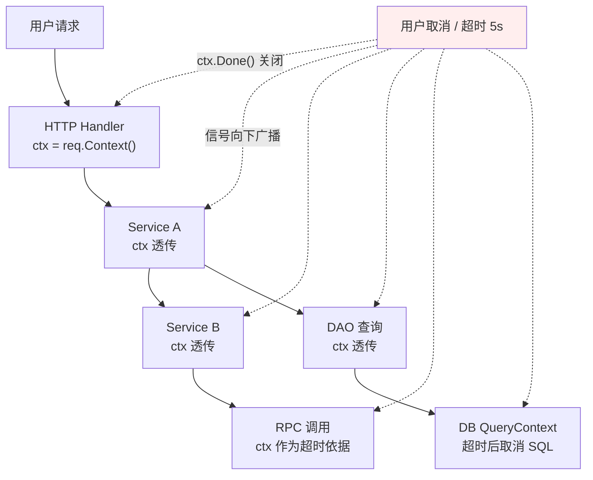
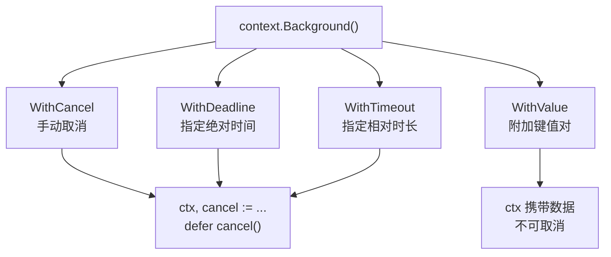
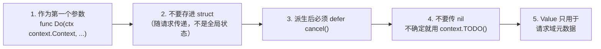
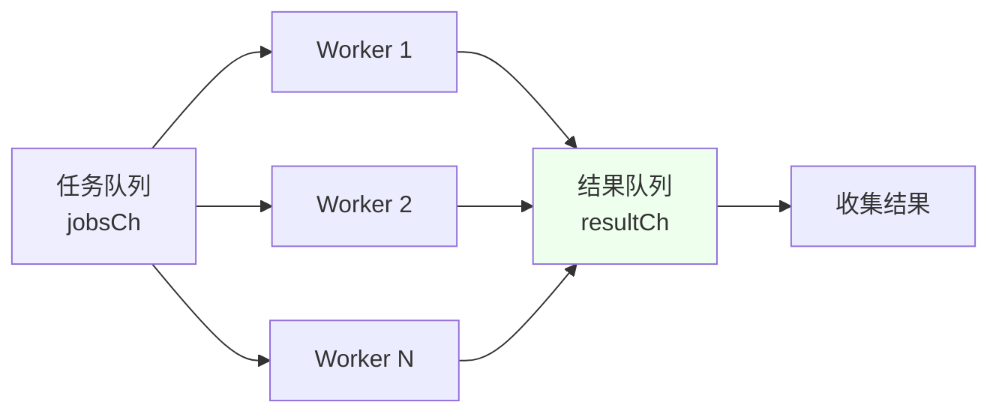
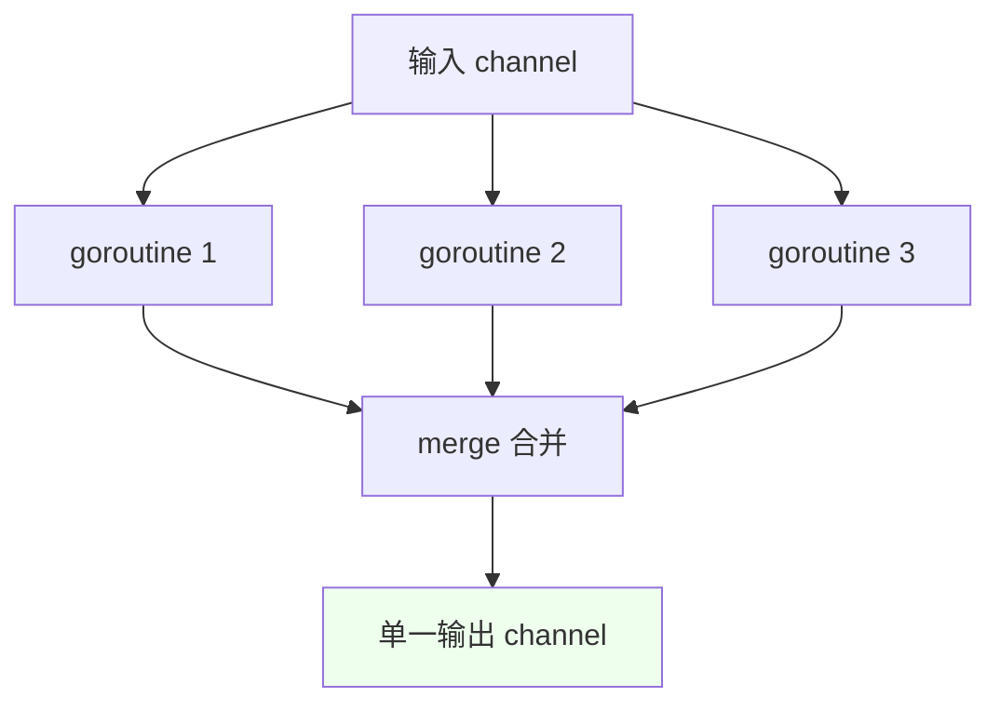

# Context 与并发模式

上一章讲了并发的原语。这一章解决两个实际问题：**如何优雅地控制 goroutine 的生死**，以及**生产中反复出现的并发架构模式**。

## context 包 {#context}

### 为什么需要 context {#why-context}

考虑一个场景：用户请求进来 → 服务 A 调用 B → B 调用 C 和 D → 每个都可能再往下调。如果**用户中途取消请求**（关掉页面/超时），所有下游调用都应该立即停止，释放资源。

没有 context 时，这个"取消信号"无法沿调用链传播。context 就是为此设计的：**在 goroutine 之间传递取消信号、截止时间和请求域数据**。



### Context 接口 {#context-interface}

```go
type Context interface {
    Deadline() (deadline time.Time, ok bool)  // 截止时间，ok=false 表示未设置
    Done() <-chan struct{}                    // 取消信号通道（只读），被关闭表示已取消
    Err() error                               // 取消原因：context.Canceled 或 DeadlineExceeded
    Value(key any) any                        // 请求域数据
}
```

**核心是 `Done()`**：它返回一个 channel，当 context 被取消或超时时，这个 channel 会被**关闭**（不是发送值），所有监听它的 goroutine 同时被唤醒。

### 根 Context {#root-context}

```go
context.Background()   // 空 context，永不取消，通常作为根
context.TODO()         // 语义上表示"还不确定用哪个"，功能等同 Background
```

> [!TIP]
> `TODO()` 不是"待办事项"的残留，而是给静态检查工具（如 `go vet`）的信号：这里应该用 context 但还没确定用哪个。**生产代码中不应长期保留 `TODO()`**。

### 四种派生 Context {#derive-context}



#### 1. WithCancel（手动取消） {#withcancel}

```go
ctx, cancel := context.WithCancel(context.Background())
defer cancel()        // ⚠️ 必须调用，否则泄漏资源

go func() {
    for {
        select {
        case <-ctx.Done():
            fmt.Println("收到取消:", ctx.Err())   // context.Canceled
            return
        default:
            doWork()
        }
    }
}()

time.Sleep(time.Second)
cancel()              // 主动取消，通知所有派生 goroutine
```

> [!IMPORTANT]
> **`defer cancel()` 是强制要求**。不调用 cancel，父 context 会一直持有子 context 的引用，直到父级取消或程序结束，造成内存和计时器泄漏。`go vet` 会检查这个（lostcancel）。

#### 2. WithTimeout（最常用） {#withtimeout}

```go
ctx, cancel := context.WithTimeout(context.Background(), 3*time.Second)
defer cancel()

// 传递 ctx 给支持 context 的 API
resp, err := http.NewRequestWithContext(ctx, "GET", url, nil)
rows, err := db.QueryContext(ctx, "SELECT ...")

// 或者自己监听
select {
case result := <-doSomethingSlow():
    handle(result)
case <-ctx.Done():
    return ctx.Err()      // context.DeadlineExceeded
}
```

#### 3. WithDeadline（绝对时间） {#withdeadline}

```go
deadline := time.Now().Add(5 * time.Second)
ctx, cancel := context.WithDeadline(context.Background(), deadline)
defer cancel()

// 查看剩余时间
if d, ok := ctx.Deadline(); ok {
    fmt.Println("剩余:", time.Until(d))
}
```

`WithTimeout` 内部就是 `WithDeadline(time.Now().Add(d))`，二者等价。

#### 4. WithValue（请求域数据） {#withvalue}

```go
type ctxKey string                    // 定义专用类型，避免 key 冲突

const UserIDKey ctxKey = "userID"

ctx := context.WithValue(parent, UserIDKey, 12345)

// 读取（要用 comma-ok，因为可能是零值）
if uid, ok := ctx.Value(UserIDKey).(int); ok {
    fmt.Println("用户:", uid)
}
```

> [!WARNING]
> **WithValue 的滥用**：
> - ✅ 适合：请求 ID、用户身份、追踪信息等**横切的、与请求生命周期绑定的元数据**
> - ❌ 不适合：函数可选参数（改用显式参数）、业务数据（应显式传递）
>
> **key 必须用自定义类型**（如 `type ctxKey string`），用内置 `string` 当 key 会与其他包冲突。

### context 使用铁律 {#context-rules}



**完整示例**：

```go
// ✅ 正确：ctx 作为第一个参数，一路透传
func HandleUser(w http.ResponseWriter, r *http.Request) {
    ctx := r.Context()                                  // 从请求拿根 context
    ctx, cancel := context.WithTimeout(ctx, 2*time.Second)  // 加超时
    defer cancel()
    
    user, err := userService.Get(ctx, userID)           // 透传给下层
    if err != nil {
        if errors.Is(err, context.DeadlineExceeded) {
            http.Error(w, "服务超时", http.StatusGatewayTimeout)
            return
        }
        http.Error(w, err.Error(), http.StatusInternalServerError)
        return
    }
    json.NewEncoder(w).Encode(user)
}

func (s *UserService) Get(ctx context.Context, id int64) (*User, error) {
    // 每一层都接收 ctx 并传给支持 ctx 的 API
    return s.repo.FindByID(ctx, id)
}

func (r *UserRepo) FindByID(ctx context.Context, id int64) (*User, error) {
    row := r.db.QueryRowContext(ctx, "SELECT ... WHERE id = ?", id)
    // ctx 取消时，数据库驱动会中断查询
}
```

## 并发模式 {#patterns}

### 模式一：Worker Pool（工作池） {#worker-pool}

控制并发数量，避免无限制创建 goroutine 打爆资源。

```go
func WorkerPool(jobs []Job, workerNum int) []Result {
    jobsCh := make(chan Job, len(jobs))
    resultCh := make(chan Result, len(jobs))
    
    // 启动固定数量的 worker
    var wg sync.WaitGroup
    for i := 0; i < workerNum; i++ {
        wg.Add(1)
        go func(id int) {
            defer wg.Done()
            for job := range jobsCh {          // 从任务池取任务
                resultCh <- process(job)       // 结果放入结果池
            }
        }(i)
    }
    
    // 分发任务
    for _, job := range jobs {
        jobsCh <- job
    }
    close(jobsCh)          // 任务发完，关闭，worker 的 range 会退出
    
    // 等所有 worker 完成后关闭结果通道
    go func() {
        wg.Wait()
        close(resultCh)
    }()
    
    // 收集结果
    var results []Result
    for r := range resultCh {
        results = append(results, r)
    }
    return results
}
```



**何时用**：批量处理（图片压缩、数据导入）、爬虫、需要限制并发的 RPC 调用。

### 模式二：Fan-out / Fan-in（扇出扇入） {#fan-out-in}

**Fan-out**：多个 goroutine 从同一个输入 channel 读取（分散任务）
**Fan-in**：把多个输出 channel 合并成一个（汇聚结果）

```go
// Fan-out：启动 N 个 worker 消费同一个 channel
func fanOut(in <-chan int, n int) []<-chan int {
    outs := make([]<-chan int, 0, n)
    for i := 0; i < n; i++ {
        out := make(chan int)
        outs = append(outs, out)
        go func(out chan<- int) {
            defer close(out)
            for v := range in {
                out <- heavyCompute(v)
            }
        }(out)
    }
    return outs
}

// Fan-in：合并多个 channel
func merge(cs ...<-chan int) <-chan int {
    var wg sync.WaitGroup
    out := make(chan int)
    
    for _, c := range cs {
        wg.Add(1)
        go func(c <-chan int) {
            defer wg.Done()
            for v := range c {
                out <- v
            }
        }(c)
    }
    
    go func() {
        wg.Wait()       // 所有输入结束后
        close(out)      // 关闭输出
    }()
    return out
}

// 使用
in := generate(1, 2, 3, 4, 5)
outs := fanOut(in, 4)
for result := range merge(outs...) {
    fmt.Println(result)
}
```



### 模式三：Pipeline（流水线） {#pipeline}

把处理拆成多个阶段，阶段之间用 channel 连接，像流水线一样：

```go
// 阶段1：生成数据
func gen(nums ...int) <-chan int {
    out := make(chan int)
    go func() {
        defer close(out)
        for _, n := range nums {
            out <- n
        }
    }()
    return out
}

// 阶段2：平方
func sq(in <-chan int) <-chan int {
    out := make(chan int)
    go func() {
        defer close(out)
        for n := range in {
            out <- n * n
        }
    }()
    return out
}

// 组装流水线
for n := range sq(sq(gen(2, 3))) {
    fmt.Println(n)    // 16, 81
}
```

**加上 context 控制**（生产必备）：

```go
func gen(ctx context.Context, nums ...int) <-chan int {
    out := make(chan int)
    go func() {
        defer close(out)
        for _, n := range nums {
            select {
            case out <- n:
            case <-ctx.Done():
                return          // 上游取消，立即退出
            }
        }
    }()
    return out
}
```

### 模式四：限流（Rate Limiting） {#rate-limit}

**方式一：time.Ticker（令牌桶思想）**

```go
// 每秒最多 10 次
limiter := time.NewTicker(100 * time.Millisecond)
defer limiter.Stop()

for _, req := range requests {
    <-limiter.C          // 等下一个"令牌"
    go handle(req)
}
```

**方式二：带缓冲 channel 做信号量（更灵活）**

```go
// 最多同时 10 个并发
sem := make(chan struct{}, 10)

for _, req := range requests {
    sem <- struct{}{}        // 获取令牌（满了就阻塞）
    go func(r Request) {
        defer func() { <-sem }()   // 释放令牌
        handle(r)
    }(req)
}
```

**方式三：官方扩展库（推荐用于复杂限流）**

```go
import "golang.org/x/time/rate"

limiter := rate.NewLimiter(rate.Limit(100), 200)  // 每秒 100 个，突发 200

if !limiter.Allow() {
    return errors.New("限流")
}

// 或阻塞等待
if err := limiter.Wait(ctx); err != nil {
    return err      // ctx 取消或超时
}
```

### 模式五：errgroup（带错误传播的并发） {#errgroup}

标准库的 `WaitGroup` 不能收集错误，`errgroup`（golang.org/x/sync/errgroup）补上了这块：

```go
import "golang.org/x/sync/errgroup"

// 基本用法：任一任务出错就返回
func fetchAll(ctx context.Context, urls []string) ([]string, error) {
    g, ctx := errgroup.WithContext(ctx)   // 带 cancel 的 ctx
    results := make([]string, len(urls))
    
    for i, url := range urls {
        i, url := i, url           // Go 1.22 前需要，1.22+ 可省略
        g.Go(func() error {
            body, err := fetchWithContext(ctx, url)
            if err != nil {
                return err        // 第一个错误会被返回，其他任务的 ctx 被取消
            }
            results[i] = body
            return nil
        })
    }
    
    if err := g.Wait(); err != nil {
        return nil, err          // 返回第一个非 nil 错误
    }
    return results, nil
}
```

**限制并发数的 errgroup**（Go 官方扩展库 1.20+ 支持 `SetLimit`）：

```go
g, ctx := errgroup.WithContext(ctx)
g.SetLimit(10)        // 最多 10 个并发

for _, task := range tasks {
    g.Go(func() error {
        return doTask(ctx, task)
    })
}
g.Wait()
```

> [!TIP]
> `errgroup.WithContext` 返回的 ctx 会在**第一个任务返回错误时自动取消**，非常适合"全部成功才算成功"的批量场景（如并行调用多个下游服务）。

### 模式六：超时与重试 {#timeout-retry}

```go
func WithRetry(ctx context.Context, maxRetries int, fn func() error) error {
    var err error
    for i := 0; i < maxRetries; i++ {
        select {
        case <-ctx.Done():
            return ctx.Err()        // 整体超时，停止重试
        default:
        }
        
        if err = fn(); err == nil {
            return nil              // 成功
        }
        
        // 指数退避
        backoff := time.Duration(1<<i) * 100 * time.Millisecond
        select {
        case <-time.After(backoff):
        case <-ctx.Done():
            return ctx.Err()
        }
    }
    return fmt.Errorf("重试 %d 次后仍失败: %w", maxRetries, err)
}
```

### 模式七：定期任务与优雅退出 {#graceful-shutdown}

```go
func main() {
    ctx, cancel := context.WithCancel(context.Background())
    defer cancel()
    
    // 启动后台任务
    go func() {
        ticker := time.NewTicker(5 * time.Second)
        defer ticker.Stop()
        for {
            select {
            case <-ticker.C:
                doPeriodicWork()
            case <-ctx.Done():
                log.Println("后台任务退出")
                return
            }
        }
    }()
    
    // 监听退出信号
    sigCh := make(chan os.Signal, 1)
    signal.Notify(sigCh, syscall.SIGINT, syscall.SIGTERM)
    <-sigCh
    
    log.Println("收到退出信号，开始优雅关闭...")
    cancel()                    // 通知所有 goroutine
    
    // 给 HTTP 服务器时间处理完在途请求
    shutdownCtx, sc := context.WithTimeout(context.Background(), 10*time.Second)
    defer sc()
    if err := server.Shutdown(shutdownCtx); err != nil {
        log.Printf("强制关闭: %v", err)
    }
    log.Println("已退出")
}
```

> [!IMPORTANT]
> 生产服务的标准姿势：
> 1. 用 `signal.Notify` 捕获 SIGINT/SIGTERM
> 2. 收到信号后 `cancel()` 通知所有 goroutine
> 3. 服务器 `Shutdown(ctx)` 给在途请求一个宽限期
> 4. 超时后强制退出

## goroutine 生命周期检查清单 {#lifecycle-checklist}

写并发代码时，逐条对照：

- [ ] 每个 goroutine 都有明确的**退出条件**（`ctx.Done()`、channel 关闭、任务完成）
- [ ] 用了 `WithCancel/WithTimeout` 的地方，都调用了 `defer cancel()`
- [ ] channel **由唯一的发送方关闭**，或由协调者在所有发送者结束后关闭
- [ ] `for-select` 循环中用 `return`（而非 `break`）退出 goroutine
- [ ] 启动了 goroutine 的封装函数内部有 `recover`（防止 panic 打挂进程）
- [ ] 通过 `go test -race` 验证无数据竞争
- [ ] 有 goroutine 数量监控（`runtime.NumGoroutine()`），泄漏时能观察到增长

## 小结 {#summary}

- **context** 是控制 goroutine 生命周期的标准方案：`Done()` 是核心，`WithTimeout` 最常用，**派生后必须 `defer cancel()`**
- **Worker Pool** 控制并发量、**Fan-out/in** 分散汇聚、**Pipeline** 分阶段处理
- **限流**用信号量 channel 或 `golang.org/x/time/rate`
- **errgroup** 补上了 WaitGroup 缺的错误传播，配合 `SetLimit` 还能限并发
- 生产服务必须实现**优雅退出**：信号捕获 → cancel → Shutdown 宽限期

下一章回到标准库与工程实践——io、time、JSON（含 Go 1.27 的 JSON v2 变更）、HTTP、测试进阶。
