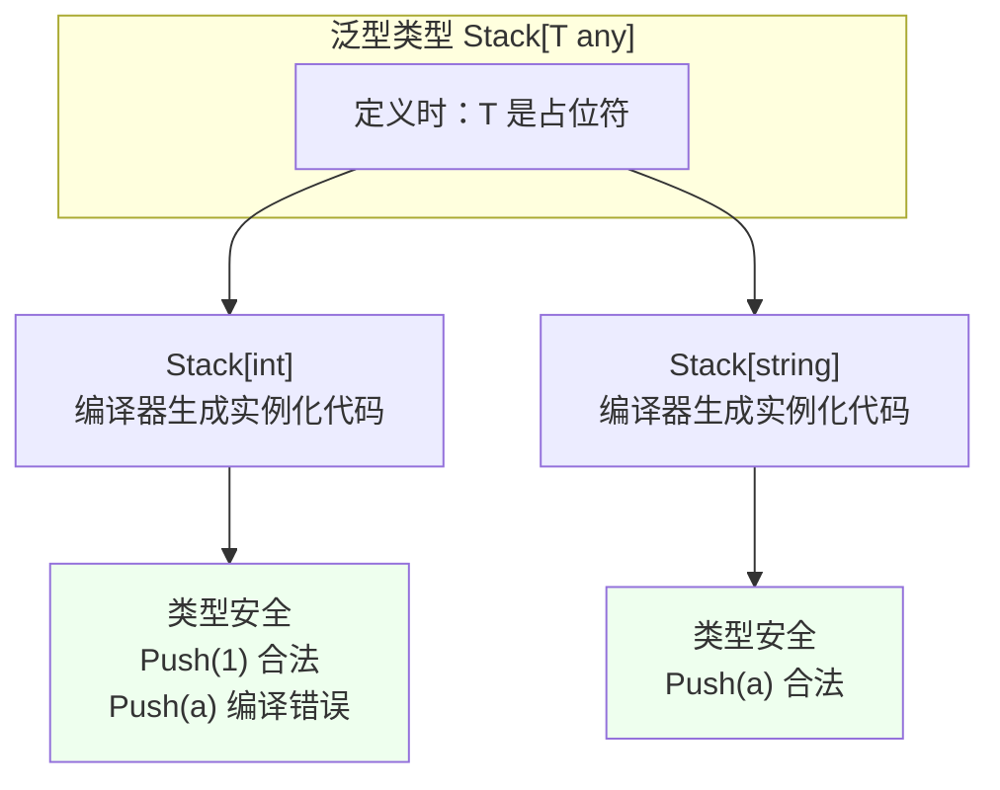
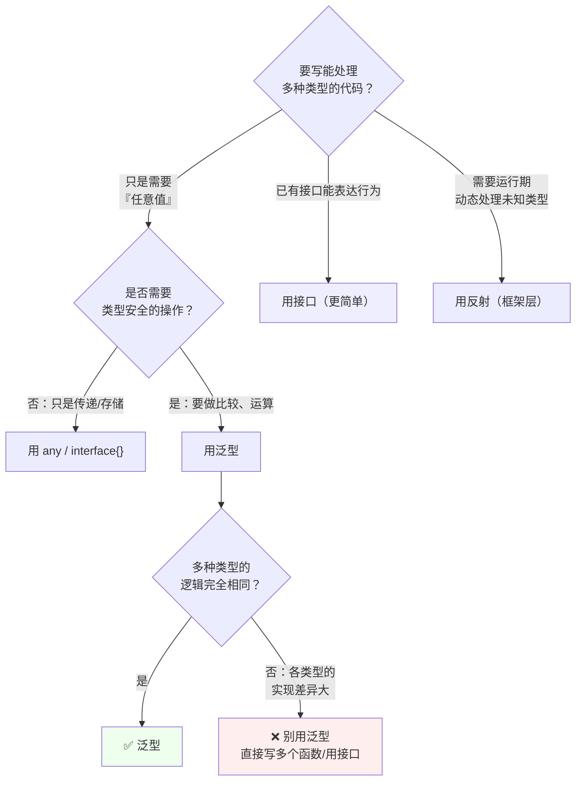
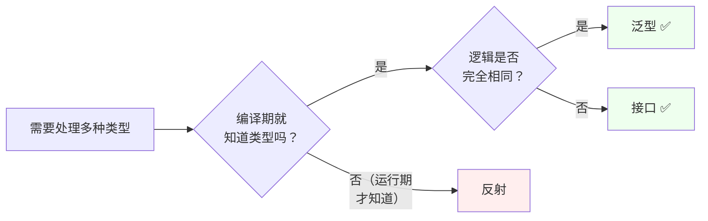

# 泛型与反射

泛型（Go 1.18 引入）和反射，都是为了**写出能处理多种类型的代码**。但二者思路完全相反：

- **泛型**：编译期确定类型，**类型安全、零运行时开销**
- **反射**：运行期检查类型，**灵活但慢、失去编译期检查**

## 泛型 {#generics}

### 为什么需要泛型 {#why-generics}

没有泛型时，想写一个"求最大值"的函数，要么为每种类型写一遍，要么用 `interface{}` 牺牲类型安全：

```go
// ❌ 方案一：为每种类型重复实现
func MaxInt(a, b int) int { if a > b { return a }; return b }
func MaxFloat(a, b float64) float64 { /* 同样的逻辑再来一遍 */ }

// ❌ 方案二：用 interface{}，调用时要断言，还可能传错类型
func MaxAny(a, b any) any {
    // 运行期才知道类型，需要 type switch，且可能传进来不可比较的类型
}

// ✅ 方案三：泛型
func Max[T int | float64](a, b T) T {
    if a > b { return a }
    return b
}
Max(3, 5)          // 5，编译器自动推断 T = int
Max(3.1, 5.2)      // 5.2，T = float64
// Max("a", 1)     // ❌ 编译错误：不满足类型约束
```

### 类型参数语法 {#type-param}

```go
// 单个类型参数
func Print[T any](v T) {
    fmt.Println(v)
}

// 多个类型参数
func Map[T, U any](s []T, f func(T) U) []U {
    res := make([]U, 0, len(s))
    for _, v := range s {
        res = append(res, f(v))
    }
    return res
}

// 显式指定类型参数（推断不出来时必须写）
Print[string]("hello")
Map[int, string]([]int{1, 2}, strconv.Itoa)
```

**类型推断**：绝大多数情况下编译器能自动推断，不需要显式写 `[T]`。推断不出来时（如类型参数只出现在返回值）必须显式指定。

### 类型约束 {#constraints}

`[T any]` 中的 `any` 就是约束，表示"T 可以是任何类型"。

```go
// 内置约束
any          // 任意类型（等价于 interface{}）
comparable   // 支持 == 和 != 的类型（用于 map 的 key、查找等）
```

**自定义约束**：用接口表达

```go
// 基础类型约束：用 | 表示"或"
type Number interface {
    int | int8 | int16 | int32 | int64 | float32 | float64
}

func Sum[T Number](nums []T) T {
    var total T
    for _, n := range nums {
        total += n
    }
    return total
}

// 方法约束：要求 T 有 String() 方法
type Stringer interface {
    String() string
}
func PrintAll[T Stringer](items []T) {
    for _, item := range items {
        fmt.Println(item.String())
    }
}
```

**约束的组合与简化**：

```go
// Go 1.18+ 可以用 ~ 表示"底层类型是该类型的所有类型"
type MyInt int        // 底层是 int

type OrderedInt interface {
    ~int              // 匹配 int 和所有以 int 为底层类型的自定义类型（如 MyInt）
}

// 用标准库的 constraints（需 go get golang.org/x/exp/constraints）
import "golang.org/x/exp/constraints"
func Max[T constraints.Ordered](a, b T) T { /* 支持所有可排序类型 */ }

// 多个约束组合（接口嵌入）
type NumericStringer interface {
    Number
    Stringer
}
```

> [!IMPORTANT]
> `~` 的含义：`~int` 匹配底层类型是 int 的**所有**类型，包括 `type MyInt int`。不用 `~` 的 `int` 只匹配 int 本身。写通用库时通常用 `~int`。

### 泛型类型 {#generic-types}

不只是函数，类型也可以带参数：

```go
// 泛型栈
type Stack[T any] struct {
    items []T
}

func NewStack[T any]() *Stack[T] {
    return &Stack[T]{items: make([]T, 0)}
}

func (s *Stack[T]) Push(v T) {
    s.items = append(s.items, v)
}

func (s *Stack[T]) Pop() (T, bool) {
    if len(s.items) == 0 {
        var zero T         // 零值的惯用写法
        return zero, false
    }
    n := len(s.items)
    v := s.items[n-1]
    s.items = s.items[:n-1]
    return v, true
}

// 使用
s := NewStack[int]()
s.Push(1)
s.Push(2)
v, ok := s.Pop()      // 2, true
```



**注意接收者的写法**：`func (s *Stack[T]) Push(v T)`——类型参数在接收者上要写成 `Stack[T]`，方法体里可以用 `T`。

### 泛型方法（Go 1.27 新特性） {#generic-methods}

**Go 1.27（2026-08 发布）之前，方法不能声明自己的类型参数**，只能声明在类型上。这意味着像 `Map`、`Filter` 这种需要**引入新类型参数**的操作，只能写成包级函数：

```go
// Go 1.26 及更早：只能写成包级函数，用起来不自然
func MapBox[T, U any](b Box[T], f func(T) U) Box[U] { /* ... */ }

result := MapBox(box, strconv.Itoa)     // pkg.Func(x, ...) 形式
```

**Go 1.27 起，方法可以拥有自己的类型参数**：

```go
// Go 1.27+：方法活在它该在的类型上
func (b Box[T]) Map[U any](f func(T) U) Box[U] {
    // 这里有三个类型参数：接收者的 T，以及方法自己的 U
}

result := box.Map(strconv.Itoa).Filter(nonEmpty)    // 自然的链式调用
```

标准库的例子：

```go
// 以前：为每种整数类型各写一个方法
r.Int31N(100)
r.Int63N(100)

// Go 1.27：一个泛型方法搞定
var d time.Duration = r.N(time.Second)   // 推断为 time.Duration
var i int32 = r.N(int32(100))
```

**两条限制**（很重要）：

1. **接口方法不能声明类型参数**——接口的方法集仍然是完全具体的
2. **泛型方法不能满足接口**——不能通过泛型方法"偷偷"实现泛型接口

```go
type Container interface {
    Map(func(int) string) Container    // 接口里的方法不能有 [U any]
}
```

> [!TIP]
> 如果你需要让类型满足接口，就**不要把那个方法写成泛型**——把类型参数放到类型上（`Box[T]`），或者保留一个非泛型的包级函数。

### 泛型的实例化与性能 {#generics-performance}

Go 的泛型采用**单态化（monomorphization）+ 字典（dictionary）混合**策略：

- 值类型（int、float64 等）通常会**生成特化代码**，性能与手写的具体类型版本相当
- 指针/接口类型会共享一份代码，通过"字典"传递类型信息（类似装箱，但有优化）

**结论**：泛型相比 `interface{}` 通常快很多（避免了装箱拆箱和类型断言），接近手写代码。但**不要指望泛型一定更快**——关键收益是**类型安全和代码复用**，而非性能。

### 何时用泛型、何时不用 {#when-to-use}



**适合用泛型**：

- 容器/集合类型（栈、队列、链表、Set、Optional、Result）
- 通用算法（Map/Filter/Reduce/Sort/Max/Min/Contains）
- 类型安全的工具函数（`slices`、`maps` 包就是典型）
- 需要 `comparable` 约束的缓存、查找

**不适合用泛型**（官方明确建议）：

- 只是作为类型约束的接口参数——**用接口更清晰**
- 各类型实现差异很大——泛型会让代码充满 type switch，反而复杂
- 为了让代码"看起来高级"——**Go 官方原则：先用接口，泛型解决不了再用**

> [!WARNING]
> 泛型的代价：
> 1. 编译产物变大（每个实例化生成一份代码）
> 2. 错误信息更难读
> 3. 过度抽象降低可读性
>
> Go 团队的立场是"**泛型是最后手段**"，不要为了泛型而泛型。

### 泛型实战：通用工具函数 {#generics-practice}

```go
package gslice

// 过滤
func Filter[T any](s []T, f func(T) bool) []T {
    res := make([]T, 0, len(s))
    for _, v := range s {
        if f(v) {
            res = append(res, v)
        }
    }
    return res
}

// 去重（要求可比较）
func Unique[T comparable](s []T) []T {
    seen := make(map[T]struct{}, len(s))
    res := make([]T, 0, len(s))
    for _, v := range s {
        if _, ok := seen[v]; ok {
            continue
        }
        seen[v] = struct{}{}
        res = append(res, v)
    }
    return res
}

// 转 map
func ToMap[K comparable, V any](s []V, keyFn func(V) K) map[K]V {
    m := make(map[K]V, len(s))
    for _, v := range s {
        m[keyFn(v)] = v
    }
    return m
}

// 分组
func GroupBy[K comparable, V any](s []V, keyFn func(V) K) map[K][]V {
    m := make(map[K][]V)
    for _, v := range s {
        k := keyFn(v)
        m[k] = append(m[k], v)
    }
    return m
}

// Optional / Result 模式
type Result[T any] struct {
    value T
    err   error
}
func Ok[T any](v T) Result[T]  { return Result[T]{value: v} }
func Err[T any](e error) Result[T] { return Result[T]{err: e} }
func (r Result[T]) Unwrap() (T, error) { return r.value, r.err }
func (r Result[T]) OrElse(def T) T {
    if r.err != nil { return def }
    return r.value
}
```

> [!TIP]
> Go 1.21+ 标准库已有 `slices` 和 `maps` 包（见[第六章](/docs/golang/06-stdlib/#slices-maps)），涵盖了大部分常用操作，**优先用标准库，不要重复造轮子**。

## 反射 {#reflect}

### 核心概念 {#reflect-core}

反射让程序在**运行时**检查类型信息、读写值、调用方法。它是 `encoding/json`、ORM、依赖注入、序列化框架的底层机制。

```go
import "reflect"

var x float64 = 3.4

t := reflect.TypeOf(x)     // reflect.Type：类型的元信息
v := reflect.ValueOf(x)    // reflect.Value：值的包装
```

### Type 与 Kind {#type-vs-kind}

```go
type MyInt int
var m MyInt = 5

t := reflect.TypeOf(m)
fmt.Println(t.Name())      // "MyInt"   ← 类型名（自定义类型才有）
fmt.Println(t.Kind())      // int       ← 底层类别

// Kind 是分类枚举：Int, String, Struct, Slice, Ptr, Interface, Func, Map, Chan...
```

**判断时通常用 `Kind`，不用 `Type`**：

```go
// ❌ 脆弱：只对 MyInt 成立，对 int 不成立
if v.Type() == reflect.TypeOf(MyInt(0)) { }

// ✅ 通用：对所有底层是 int 的类型都成立
if v.Kind() == reflect.Int { }
```

### 反射三定律 {#three-laws}

**定律一：反射可以从接口值得到反射对象**

```go
v := reflect.ValueOf(3.4)     // 参数是 interface{}，装箱后反射读取
```

**定律二：反射可以从反射对象还原接口值**

```go
v := reflect.ValueOf(3.4)
x := v.Interface().(float64)   // 还原并断言
```

**定律三：要修改反射对象，值必须是可设置的（settable）**

```go
var x float64 = 3.4

v := reflect.ValueOf(x)
fmt.Println(v.CanSet())        // false ← 传的是副本，改了也没用
// v.SetFloat(7.1)             // ❌ panic

p := reflect.ValueOf(&x)       // 传指针
e := p.Elem()                  // Elem() 取指针指向的值
fmt.Println(e.CanSet())        // true
e.SetFloat(7.1)
fmt.Println(x)                 // 7.1
```

> [!IMPORTANT]
> 判断能否修改只看 `CanSet()`。常见不可设置的场景：
> - 传了值而非指针
> - struct 的**未导出字段**（小写字段即使通过反射也不能 Set，`CanSet()` 返回 false）
> - 从 map 取出的值（副本）

### 遍历结构体 {#struct-iterate}

```go
type User struct {
    ID    int    `json:"id"`
    Name  string `json:"name"`
    email string // 未导出字段
}

u := User{ID: 1, Name: "Alice", email: "a@b.com"}
t := reflect.TypeOf(u)
v := reflect.ValueOf(u)

for i := 0; i < t.NumField(); i++ {
    field := t.Field(i)
    value := v.Field(i)
    
    fmt.Printf("%s (%s) = %v  tag=%q\n",
        field.Name,            // 字段名
        field.Type.Kind(),     // 类型类别
        value.Interface(),     // 值
        field.Tag.Get("json"), // 标签
    )
    
    // 未导出字段：能读 Kind/Name，但 Interface() 会 panic
    if !field.IsExported() {
        fmt.Println("  └ 未导出字段，不能 Interface()")
        continue
    }
}
```

### 实战一：结构体转 map（简易版） {#struct-to-map}

```go
func StructToMap(obj any) (map[string]any, error) {
    v := reflect.ValueOf(obj)
    if v.Kind() == reflect.Ptr {
        v = v.Elem()
    }
    if v.Kind() != reflect.Struct {
        return nil, fmt.Errorf("expect struct, got %s", v.Kind())
    }
    
    t := v.Type()
    m := make(map[string]any, t.NumField())
    
    for i := 0; i < t.NumField(); i++ {
        field := t.Field(i)
        if !field.IsExported() {
            continue                      // 跳过未导出字段
        }
        
        // 用 json tag 作为 key，没有则用字段名
        name := field.Tag.Get("json")
        if name == "" || name == "-" {
            name = field.Name
        } else if idx := strings.Index(name, ","); idx > 0 {
            name = name[:idx]             // 去掉 omitempty 等选项
        }
        
        m[name] = v.Field(i).Interface()
    }
    return m, nil
}
```

### 实战二：通用校验器 {#validator}

```go
// 读取 validate tag 做校验
type User struct {
    Name  string `json:"name" validate:"required,min=2,max=20"`
    Email string `json:"email" validate:"required"`
    Age   int    `json:"age" validate:"min=0,max=150"`
}

func Validate(obj any) error {
    v := reflect.ValueOf(obj)
    if v.Kind() == reflect.Ptr {
        v = v.Elem()
    }
    t := v.Type()
    
    for i := 0; i < t.NumField(); i++ {
        field := t.Field(i)
        rules := parseRules(field.Tag.Get("validate"))
        value := v.Field(i)
        
        for _, rule := range rules {
            if err := checkRule(field.Name, value, rule); err != nil {
                return err
            }
        }
    }
    return nil
}

func checkRule(name string, v reflect.Value, rule Rule) error {
    switch rule.Name {
    case "required":
        if v.IsZero() {                    // IsZero 判断零值
            return fmt.Errorf("%s 必填", name)
        }
    case "min":
        if v.Kind() == reflect.String && len(v.String()) < rule.Value {
            return fmt.Errorf("%s 长度不足 %d", name, rule.Value)
        }
        if v.Kind() == reflect.Int && int(v.Int()) < rule.Value {
            return fmt.Errorf("%s 不能小于 %d", name, rule.Value)
        }
    }
    return nil
}
```

> [!NOTE]
> 生产环境直接用成熟库 `github.com/go-playground/validator`，上面的例子是为演示反射机制。

### 实战三：动态调用方法 {#call-method}

```go
v := reflect.ValueOf(&service)
m := v.MethodByName("GetUser")        // 按名字找方法

if !m.IsValid() {
    return errors.New("方法不存在")
}

// 构造参数
args := []reflect.Value{
    reflect.ValueOf(context.Background()),
    reflect.ValueOf(int64(123)),
}

// 调用：返回 []reflect.Value
results := m.Call(args)
user := results[0].Interface().(*User)
err := results[1].Interface()          // error 接口，可能是 nil
```

**注意**：`MethodByName` 只能找到**导出方法**（大写开头）。

### 反射的性能代价 {#reflect-perf}

反射比直接调用慢**一到两个数量级**：

```go
// 直接调用：约 1 ns
user.Name = "x"

// 反射设置：约 100+ ns（含类型查找、装箱、权限检查）
reflect.ValueOf(&user).Elem().FieldByName("Name").SetString("x")
```

**优化手段**：

```go
// 1. 缓存 Type/Field 信息（避免重复查找）
var nameFieldIndex = reflect.TypeOf(User{}).Field... 

// 2. 用 FieldByIndex 代替 FieldByName（按索引比按名字快）
fieldIdx := t.Field(...).Index
v.FieldByIndex(fieldIdx)

// 3. 缓存 struct 的解析结果（encoding/json 内部就是这么做的）
type structInfo struct {
    fields []fieldMeta
}
var cache sync.Map    // map[reflect.Type]*structInfo
```

> [!TIP]
> **反射优化的核心思路**：反射的"分析"阶段（遍历字段、读 tag）很慢，但只需要做一次；"执行"阶段（读值、写值）相对快。所以**把分析结果缓存起来**，是标准做法。

## 三者如何选择 {#choose}

| 需求 | 方案 | 理由 |
|------|------|------|
| 多种类型、逻辑相同、编译期可知 | **泛型** | 类型安全、性能好 |
| 需要行为抽象（会飞的东西） | **接口** | 最简单、最 Go 风格 |
| 运行期处理未知类型（序列化、ORM） | **反射** | 别无选择 |
| 只是传递/存储任意值 | `any` | 简单 |



**Go 官方的建议顺序**：接口 → 代码生成（如 `go generate` + stringer）→ 泛型 → 反射（最后手段）。

## 反射的安全边界 {#reflect-safety}

使用反射时必须防御性编程：

```go
// 1. 检查 Kind 再操作，否则 panic
if v.Kind() != reflect.Struct {
    return fmt.Errorf("expected struct, got %v", v.Kind())
}

// 2. 检查 IsValid / IsNil
if !v.IsValid() { return errors.New("invalid value") }
if v.Kind() == reflect.Ptr && v.IsNil() { return errors.New("nil pointer") }

// 3. 检查 CanSet 再写
if !v.CanSet() { return errors.New("cannot set") }

// 4. 检查 NumField 边界
if i >= v.NumField() { return errors.New("field index out of range") }

// 5. 未导出字段只能读 Kind/Name，不能 Interface() 或 Set
if !field.IsExported() { continue }
```

> [!WARNING]
> 反射代码里的 panic 特别难排查，因为报错信息指向 `reflect` 包内部而非你的代码。**每一处反射操作都要有前置检查**。

## 小结 {#summary}

- **泛型**（Go 1.18+）：编译期类型安全，`[T any]` / `[T comparable]` / 自定义约束，适合容器和通用算法
- **泛型方法**（Go 1.27 新特性）：方法可声明自己的类型参数，支持链式调用；但接口方法仍不能有类型参数
- **反射**：`reflect.TypeOf/ValueOf`，`Type` 是类型元信息、`Kind` 是底层类别，判断用 Kind
- **反射三定律**：第三定律最关键——**要修改必须传指针且 `CanSet()`**
- **性能**：反射慢 1~2 个数量级，优化靠缓存分析结果
- **选择顺序**：接口 → 泛型 → 反射（最后手段）

至此 Go 教程七章完成。回顾整条学习路径：

| 章 | 核心能力 |
|----|---------|
| 一 | 基础语法、slice/map/string 底层、defer |
| 二 | 函数与闭包、接收者选择、接口与 nil 陷阱 |
| 三 | 结构体组合、tag 与反射、error 体系、panic/recover |
| 四 | GMP、goroutine、channel、select、sync 全家桶 |
| 五 | context、Worker Pool、Fan-in/out、限流、errgroup |
| 六 | 标准库（io/time/JSON/HTTP）、测试进阶、模块与构建 |
| 七 | 泛型、泛型方法、反射 |

建议通过一个完整项目（如 REST API 服务 + 并发任务处理）把七章串起来实践，同时配合 `go test -race`、`go vet`、`golangci-lint` 养成工程习惯。
