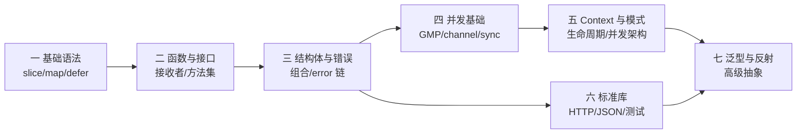

# Golang 教程

Go（Golang）是 Google 开发的静态类型编译语言，以**简洁、高效、并发**著称，广泛用于后端服务、云原生和 DevOps 工具。

本教程不只讲语法，更侧重**开发中的常用知识点与高频陷阱**：slice 的底层共享、map 的并发安全、`defer` 的返回值机制、nil 接口陷阱、值/指针接收者的选择、context 生命周期管理、并发模式选型等，均配有图示与可落地的代码。

## 章节 {.cards}

- [第一章：环境搭建与基础语法](/docs/golang/01-basics/) — 环境变量、零值体系、数组与切片底层、map、字符串、defer 机制
- [第二章：函数、方法与接口](/docs/golang/02-functions/) — 一等公民函数、闭包陷阱、值/指针接收者、方法集、nil 接口
- [第三章：结构体与错误处理](/docs/golang/03-structs/) — 嵌入组合、tag 与反射、逃逸分析、error 体系、panic/recover
- [第四章：并发编程基础](/docs/golang/04-concurrency/) — GMP 模型、goroutine、channel、select、sync 全家桶
- [第五章：Context 与并发模式](/docs/golang/05-context-patterns/) — context 传播链、Worker Pool、Fan-in/out、限流、errgroup
- [第六章：标准库与工程实践](/docs/golang/06-stdlib/) — io/time/JSON/HTTP、测试进阶、fuzz、模块与交叉编译
- [第七章：泛型与反射](/docs/golang/07-generics-reflect/) — 类型参数与约束、泛型方法、reflect 三定律、选型建议

## 学习路径建议

- **零基础**：按一 → 七顺序学习
- **有其他语言经验**：重点看一（defer/slice）、二（nil 接口/接收者）、四（GMP/channel）
- **已在写 Go**：重点看三（error 体系）、五（context 与并发模式）、六（JSON v2 变更、测试）

> [!TIP]
> 环境要求：Go 1.22+（示例按 Go 1.27 编写）。部分特性标注了版本要求，如泛型 1.18+、泛型方法 1.27+、JSON v2 默认行为 1.27+。
