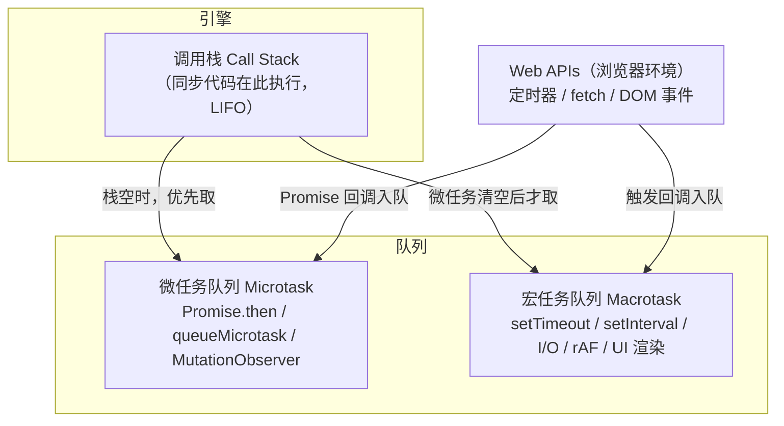
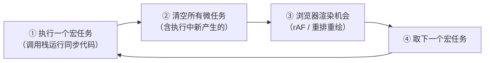
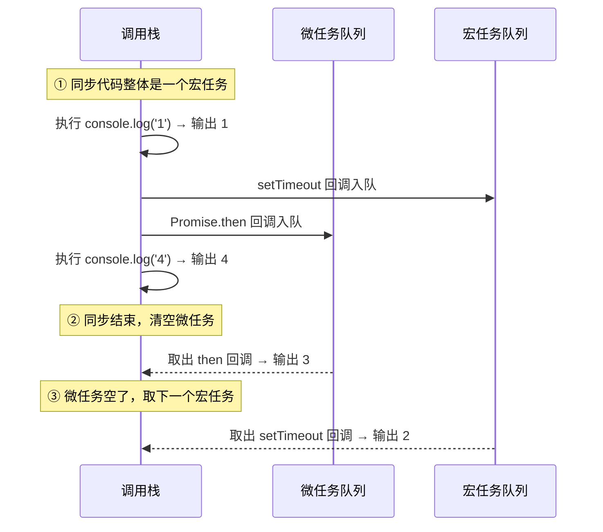

# 异步编程与 Promise

JavaScript 是**单线程**的：同一时刻只执行一段代码。为不阻塞主线程，网络请求、定时器等耗时操作被设计成异步。理解异步模型才能预测代码真实执行顺序。

## 为什么需要异步 {#why-async}

若所有操作都同步执行，一次耗时网络请求会冻结整个页面，用户无法点击滚动。异步让耗时任务在后台进行，结果通过回调/Promise/await 完成后回到主线程。

```javascript
setTimeout(() => console.log('1 秒后执行'), 1000);
console.log('我先执行');  // 立即输出，不被定时器阻塞
```

## 事件循环 {#event-loop}

事件循环（Event Loop）是 JavaScript 异步调度的核心。要真正搞懂 `setTimeout`、`Promise` 的执行顺序，必须先理解它由哪几部分组成、按什么规则运转。

### 三大组件：调用栈与两个队列 {#stack-queue}

整个异步模型由三部分协作：**调用栈（Call Stack）**、**宏任务队列（Macrotask Queue）**、**微任务队列（Microtask Queue）**。



- **调用栈（Call Stack）**：当前正在执行的同步代码依次入栈、出栈，栈先进后出（LIFO）。同一时刻栈里只有一段代码在跑，这就是「单线程」的含义。
- **宏任务（macrotask）**：`setTimeout`/`setInterval`、I/O、`requestAnimationFrame`、UI 渲染、`setImmediate`（Node.js）等，每次事件循环「取一个」来执行。
- **微任务（microtask）**：`Promise.then/catch/finally`、`queueMicrotask`、`MutationObserver` 等，优先级高于宏任务，每个宏任务结束后会**一次性清空**整个微任务队列。

### 一轮循环的执行顺序 {#execution-order}

事件循环周而复始地执行同一套步骤：



> [!NOTE]
> **关键结论**：每个宏任务结束后，都会先清空微任务队列，才进入下一个宏任务。这正是 `Promise.then` 总比下一个 `setTimeout` 先输出的原因——微任务「插队」在宏任务之间。

### 经典输出顺序题 {#ordering-puzzle}

```javascript
console.log('1');                                // 同步
setTimeout(() => console.log('2'), 0);           // 宏任务
Promise.resolve().then(() => console.log('3'));  // 微任务
console.log('4');                                // 同步

// 输出：1  4  3  2
```

按上面的规则推演，过程如下：



微任务里再产生微任务，会一直清空到「队列彻底为空」才罢手：

```javascript
setTimeout(() => console.log('A'), 0);
Promise.resolve().then(() => {
    console.log('B');
    Promise.resolve().then(() => console.log('C')); // 微任务中又产生微任务
});
Promise.resolve().then(() => console.log('D'));

// 输出：B  C  D  A
// 微任务 B 执行时新排入 C，C 会在本轮继续被清空，之后才轮到宏任务 A
```

### requestAnimationFrame 的位置 {#raf-position}

`requestAnimationFrame` 属于**渲染阶段**的回调：浏览器在两次宏任务之间、每次重绘前调用它，用于动画。它与 `setTimeout(0)` 时机接近但语义不同——`rAF` 跟随屏幕刷新率（约 60fps），且页面不可见时会被暂停；`setTimeout` 则受最小延迟（约 4ms）与浏览器节流影响。

> [!TIP]
> 记住优先级口诀：**同步代码 → 微任务 → （渲染）→ 下一个宏任务**。任何一段代码跑完，先清微任务，再谈其他。

## 回调函数 {#callback}

最原始的异步方案是回调：把完成后的处理函数作为参数传入。

```javascript
setTimeout(() => { console.log('1 秒后执行'); }, 1000);
```

### 回调地狱 {#callback-hell}

多层嵌套导致「金字塔」式回调地狱，难以阅读、难以统一错误处理：

```javascript
// 反例
fetchUser(id, (user) => {
    fetchOrders(user.id, (orders) => {
        fetchDetails(orders[0].id, (details) => { render(details); });
    });
});
```

解决方案路径：**回调 → Promise → async/await**。

## Promise {#promise}

Promise 代表一个**未来会完成**的异步操作，三种状态：`pending` → `fulfilled` 或 `rejected`。**状态一旦确定不可逆**。

```javascript
const promise = new Promise((resolve, reject) => {
    setTimeout(() => resolve('成功'), 1000);
});

promise
    .then((result) => console.log(result))
    .catch((err) => console.error(err))
    .finally(() => console.log('结束'));
```

### executor 同步抛错 {#executor-throw}

executor 中**同步抛出的错误**会自动转为 `rejected`：

```javascript
new Promise(() => { throw new Error('同步出错'); })
    .catch((e) => console.log(e.message));  // "同步出错"
```

## Promise 链式调用 {#chaining}

**每个 `then` 都返回新 Promise**，其值是回调的返回值（若返回 Promise 则「展开」）。这是链式调用基础：

```javascript
fetchUser(id)
    .then((user) => fetchOrders(user.id))
    .then((orders) => fetchDetails(orders[0].id))
    .then((details) => console.log(details))
    .catch((err) => console.error('任一环节失败', err));
```

### 错误穿透 {#error-penetration}

链中任一处 `rejected` 会**跳过后续 then**，直接落到最近 `catch`：

```javascript
Promise.resolve(1)
    .then(() => { throw new Error('boom'); })
    .then(() => console.log('不会到这里'))
    .catch((e) => console.log(e.message));  // 捕获到 boom
```

### then 第二参数 vs catch {#then-vs-catch}

`then(onF, onRejected)` 第二个参数能捕获**前面**的错，但**抓不到自己第一个回调里的错**；`catch` 挂在链尾能捕获前面所有错误，也更清晰：

```javascript
// 推荐：链尾统一 catch，then 只写成功逻辑
p.then(() => { throw new Error('x'); })
 .catch((e) => console.log('能抓到', e.message));
```

> [!TIP]
> 习惯上把 `catch` 放在链路末尾统一处理，可读性最好。

## 常用静态方法 {#static-methods}

| 方法 | 何时 resolve | 何时 reject | 返回值 |
|------|-------------|------------|--------|
| `Promise.all` | 全部成功 | **任一失败**即失败 | 成功结果数组（按序） |
| `Promise.allSettled` | 总是 resolve | 永不 reject | 每个状态对象 `{status, value/reason}` |
| `Promise.race` | **首个**落定 | 首个失败即失败 | 首个落定者结果 |
| `Promise.any` | **首个成功** | 全部失败才失败 | 首个成功结果 |

```javascript
Promise.all([p1, p2, p3]);        // 全部成功才成功；一个失败立即失败
Promise.allSettled([p1, p2]);     // 等全部结束，返回各自状态
Promise.race([p1, p2]);           // 第一个完成决定结果（常用于超时）
Promise.any([p1, p2]);            // 第一个成功决定结果
Promise.resolve('ok');            // 直接以成功值创建
Promise.reject(new Error('no'));  // 直接以失败原因创建
```

> [!NOTE]
> `Promise.all` 是「快速失败」：某 reject 整体立即 reject，其余 Promise 仍在后台运行（不会被取消）。

## async / await {#async-await}

`async/await` 是 Promise 的语法糖，让异步代码**看起来像同步**，本质仍是微任务异步。

### 返回值与规则 {#async-rules}

```javascript
async function load() { return 42; }   // 等价于 return Promise.resolve(42)
load().then((v) => console.log(v));     // 42

// 规则：async 函数总是返回 Promise；
//       await 只能在 async 函数（或顶层 await）内使用；
//       await 后若是普通值，会被包成 resolved Promise
```

### 错误处理：await 遇到 reject 的几种方式 {#async-error}

`await` 会把 Promise 的 reject 变成「同步抛异常」，所以最直观的是 `try/catch`。但除此之外还有几种方式，取决于你想让错误「中断流程」还是「就地消化」。

#### 方式一：try/catch（最基础）

```javascript
async function loadUserData(id) {
    try {
        const user = await fetchUser(id);
        const orders = await fetchOrders(user.id);
        const details = await fetchDetails(orders[0].id);
        return details;
    } catch (err) {
        console.error('加载失败', err);
        throw err;   // 可选择继续抛出交由上层
    }
}
```

适合需要区分多种错误、或用 `finally` 做清理（如关连接、隐藏 loading）的场景。

#### 方式二：await 表达式后接 .catch()（就地兜底）

`await` 的是表达式，可以先给表达式接一个 `.catch()`，把错误在源头吞掉或转成默认值，这样 `await` 永远不抛错：

```javascript
// 出错时返回兜底值，不中断流程
const data = await fetchData().catch(() => null);

// 出错时记录日志，仍返回默认对象
const user = await getUser().catch(err => {
    console.error(err);
    return { name: '匿名用户' };
});
```

适合「单个调用失败没关系，给个默认值继续」的场景。

#### 方式三：返回结果对象（错误不进 catch）

约定「不抛异常」，而是返回 `{ data, error }` 结构，调用方显式判断：

```javascript
async function toResult(promise) {
    try {
        return { data: await promise, error: null };
    } catch (error) {
        return { data: null, error };
    }
}

const { data, error } = await toResult(fetchData());
if (error) { /* 处理 */ }
```

好处是错误显式、不会「忘记 catch」；代价是每处调用都要判断 `error`。

#### 方式四：Promise.allSettled（并发允许部分失败）

`Promise.all` 一个 reject 就整体失败；`allSettled` 会等全部结束，每个结果带 `status` 标记，错误在 `reason` 里而非抛异常：

```javascript
const results = await Promise.allSettled([a(), b(), c()]);

for (const r of results) {
    if (r.status === 'fulfilled') console.log('成功', r.value);
    else console.log('失败', r.reason);
}
```

适合并发多个请求、允许部分失败继续处理其余的场景。

#### 方式五：顶层 await 无法 try/catch 时

模块顶层的 `await` 不在函数里，无法用 `try/catch` 包裹，可改用 `.catch()` 或 IIFE：

```javascript
// 顶层 await（ESM）
const data = await fetchData().catch(() => null);

// 或包一层立即执行函数
(async () => {
    try { await fetchData(); } catch (e) { /* ... */ }
})();
```

#### 配合 AbortController 主动取消

超时/主动取消时，捕获后按错误名区分处理：

```javascript
const controller = new AbortController();
setTimeout(() => controller.abort(), 5000);  // 5 秒超时

try {
    await fetch(url, { signal: controller.signal });
} catch (err) {
    if (err.name === 'AbortError') console.log('已取消');
    else throw err;
}
```

| 方式 | 适用场景 |
|------|---------|
| `try/catch` | 区分多种错误、需要 finally 清理 |
| `await x.catch(...)` | 单次失败给默认值/日志，不中断 |
| `{ data, error }` 封装 | 团队约定「不抛异常」，错误显式传递 |
| `Promise.allSettled` | 并发多个请求，允许部分失败 |
| 顶层 `.catch()` / IIFE | 模块顶层无法用 try/catch 时 |

> [!TIP]
> 核心判断：想让错误**中断当前流程**用 `try/catch`；想**就地消化**（给默认值、继续跑）用 `.catch()` 或结果对象；**并发允许部分失败**用 `allSettled`。

### 并行 vs 串行 {#parallel-vs-serial}

后续请求依赖前面结果时用**串行**（依次 await，总耗时是各请求之和）；彼此无依赖时用**并行**（`Promise.all`，总耗时取最慢一个）：

```javascript
// 反例：没依赖却串行，白白多等
const u = await fetchUser(id);
const p = await fetchProfile(id);

// 正解：并行
const [u, p] = await Promise.all([fetchUser(id), fetchProfile(id)]);
```

### await 循环性能 {#await-loop}

循环里逐个 `await` 是串行，数据量大时很慢；考虑「先并发、再等待」：

```javascript
// 慢：串行
for (const id of ids) await process(id);

// 快：并发启动，统一等待
await Promise.all(ids.map((id) => process(id)));
```

### 顶层 await {#top-level-await}

ES 模块顶层可直接 `await`（模块会等待结果再执行后续），常用于初始化配置：

```javascript
// config.js（ESM）
const config = await fetch('/api/config').then(r => r.json());
export default config;
```

## 实战：封装带超时与重试的 fetch {#fetch-with-timeout-retry}

### 超时控制 {#timeout}

用 `Promise.race` 让「请求」与「定时器」赛跑实现超时：

```javascript
function withTimeout(promise, ms) {
    const timer = new Promise((_, reject) =>
        setTimeout(() => reject(new Error('超时')), ms));
    return Promise.race([promise, timer]);
}
withTimeout(fetch('/api/data'), 3000)
    .then((res) => res.json())
    .catch((e) => console.error(e.message));
```

### 重试 {#retry}

指数退避重试，应对偶发网络抖动：

```javascript
async function fetchRetry(url, retries = 3, delay = 500) {
    for (let i = 0; i <= retries; i++) {
        try {
            const res = await fetch(url);
            if (!res.ok) throw new Error(`HTTP ${res.status}`);
            return await res.json();
        } catch (err) {
            if (i === retries) throw err;
            await new Promise(r => setTimeout(r, delay * 2 ** i));  // 退避
        }
    }
}
```

## 并发控制（并发池） {#concurrency-pool}

并发请求过多时直接 `Promise.all` 可能压垮服务端。并发池限制同时进行的任务数：

```javascript
async function pool(tasks, limit = 3) {
    const results = [];
    const executing = new Set();
    for (const [i, task] of tasks.entries()) {
        const p = Promise.resolve().then(() => task()).then(r => { results[i] = r; });
        executing.add(p);
        p.finally(() => executing.delete(p));
        if (executing.size >= limit) await Promise.race(executing);  // 等任意一个完成
    }
    await Promise.all(executing);   // 收尾剩余
    return results;
}
pool(urls.map(u => () => fetch(u).then(r => r.json())), 3);  // 最多 3 并发
```

## AbortController 取消请求 {#abort-controller}

用户切换页面或重复操作时，应主动取消未完成请求，避免浪费与竞态：

```javascript
const controller = new AbortController();
fetch('/api/data', { signal: controller.signal })
    .then((r) => r.json())
    .catch((e) => { if (e.name === 'AbortError') console.log('请求已取消'); });

controller.abort();   // 需要时取消（如组件卸载、输入变化）
```

> [!NOTE]
> `AbortController` 可与超时方案结合：超时后调用 `controller.abort()`，真正中断底层连接，而非仅忽略结果。

## 小结 {#summary}

本章从事件循环的调用栈、宏任务与微任务调度出发，解释 `setTimeout` 与 `Promise.then` 的执行顺序差异；随后深入 Promise 状态不可逆、链式调用与错误穿透，对比 `all/allSettled/race/any` 语义；再讲解 `async/await` 的错误处理多种方式（`try/catch`、就地 `.catch()`、结果对象、`allSettled`、顶层 await 兜底、AbortController 取消），并实战封装带超时/重试的 fetch、并发池。掌握这些便能在真实项目写出健壮可控的异步代码。至此五章教程结束，建议结合文档站其他专题（如框架、工程化）继续深入。
