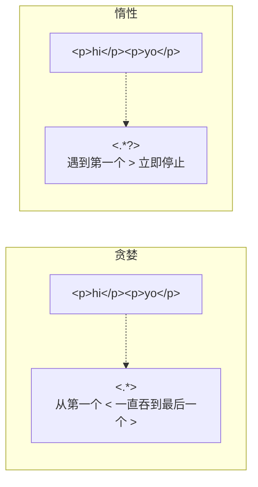
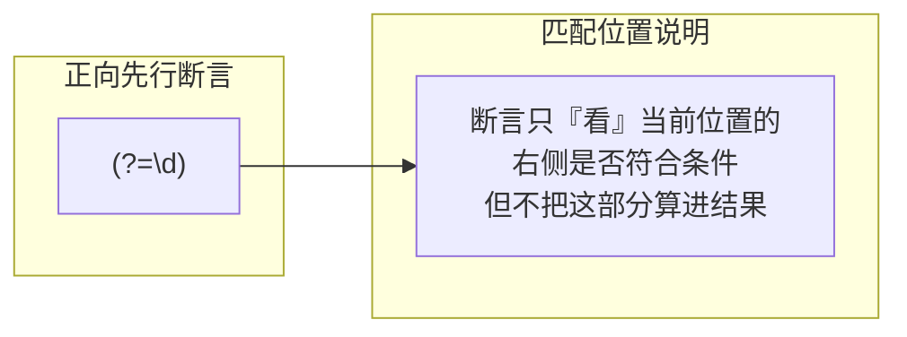
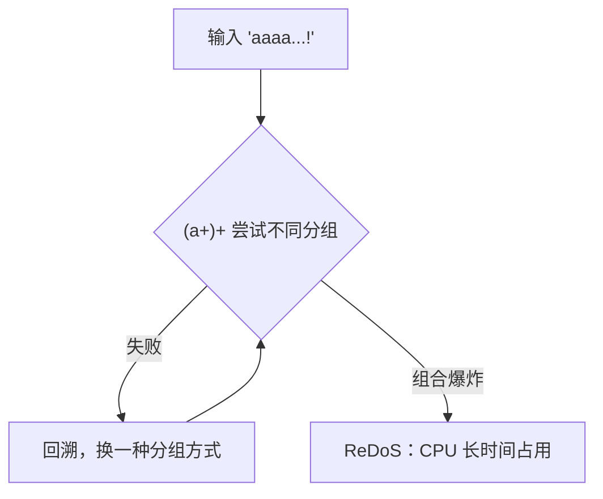

# 正则表达式

正则表达式（Regular Expression，简称 Regex / RegExp）是一套**用模式（pattern）描述字符串**的规则，用于匹配、查找、替换、校验文本。它几乎是所有编程语言通用的一项能力，JavaScript 内置了对它的支持。

## 为什么需要正则 {#why-regex}

当我们要判断「手机号是否合法」「提取 URL 中的参数」「把所有邮箱高亮」这类需求时，用普通的字符串方法（`indexOf`、`split`、`startsWith`）会非常繁琐甚至无法表达。正则用一行模式就能描述一「类」字符串。

```javascript
// 不用正则：判断是否为 11 位纯数字手机号，要写一堆判断
const isPhone = s => s.length === 11 && [...s].every(c => c >= '0' && c <= '9');

// 用正则：一行搞定
const isPhone2 = s => /^1\d{10}$/.test(s);
```

## 创建正则 {#create}

JavaScript 有两种写法：字面量与构造函数。

```javascript
// 1. 字面量（推荐，性能好、可读性高）
const re1 = /\d+/g;

// 2. RegExp 构造函数（模式是动态字符串时使用）
const part = '\\d+';
const re2 = new RegExp(part, 'g');

// 两者等价
re1.source === re2.source; // true，都是 "\\d+"
```

> [!TIP]
> 字面量里 `/` 需要转义写成 `\/`；构造函数里传入的字符串，反斜杠本身还要再转义（`'\\d'` 代表 `\d`）。当模式来自变量或用户输入时用构造函数，否则优先字面量。

## 匹配与替换方法 {#methods}

正则有 `test` / `exec`，字符串有 `match` / `matchAll` / `replace` / `search` / `split`。

```javascript
const re = /cat/;

// 测试是否存在
re.test('concatenate');       // true

// 查找并返回结果
re.exec('a cat and a cat');   // ['cat', index: 2, input: ..., groups: undefined]

// 字符串方法
'concatenate'.match(re);      // ['cat']（无 g 时返回完整信息）
'cat dog cat'.match(/cat/g);  // ['cat', 'cat']（有 g 时只返回所有匹配文本）

'2024-09-06'.replace(/-/g, '/');   // "2024/09/06"
'hello world'.search(/world/);     // 6（找不到返回 -1）
'a,b,c'.split(/,/);                // ['a','b','c']
```

### g 与 y 标志对 exec 的影响 {#exec-flags}

带全局标志 `g` 时，`exec` 会记住上次匹配位置（`lastIndex`），可循环取全部结果：

```javascript
const re = /\d+/g;
let m;
while ((m = re.exec('a1b22c333')) !== null) {
    console.log(m[0]);   // 1  22  333
}
```

> [!WARNING]
> 带 `g` 的正则在 `test`/`exec` 时**有状态**（依赖 `lastIndex`），复用时可能得到交替结果。循环前可 `re.lastIndex = 0` 重置，或用 `String.prototype.matchAll` 避免此坑。

## 元字符与字符类 {#character-class}

正则里 `.` `\d` `\w` 等是「元字符」，代表一类字符。

| 元字符 | 含义 | 等价写法 |
|--------|------|---------|
| `.` | 任意单个字符（除换行） | — |
| `\d` | 数字 | `[0-9]` |
| `\w` | 单词字符（字母数字下划线） | `[A-Za-z0-9_]` |
| `\s` | 空白（空格、Tab、换行等） | `[ \t\r\n\f\v]` |
| `\D` | 非数字 | `[^0-9]` |
| `\W` | 非单词字符 | `[^\w]` |
| `\S` | 非空白 | `[^\s]` |

字符类 `[...]` 表示「匹配括号内任意一个」，可用 `^` 取反、`-` 表示范围：

```javascript
/[aeiou]/;       // 任意一个元音
/[a-z]/;         // 任意小写字母
/[^0-9]/;        // 任意非数字字符
/[0-9a-f]/;      // 十六进制字符
```

### 边界与锚点 {#anchors}

```javascript
/^abc/;   // ^ 匹配字符串开头
/abc$/;   // $ 匹配字符串结尾
/\bcat\b/;// \b 单词边界
```

## 量词与贪婪/惰性 {#quantifiers}

量词指定「前一个元素出现多少次」。

| 量词 | 含义 |
|------|------|
| `*` | 0 次或多次 |
| `+` | 1 次或多次 |
| `?` | 0 次或 1 次 |
| `{n}` | 恰好 n 次 |
| `{n,}` | 至少 n 次 |
| `{n,m}` | n 到 m 次 |

默认量词是**贪婪（greedy）**的：尽可能多匹配。加 `?` 变**惰性（lazy）**：尽可能少匹配。

```javascript
// 贪婪：尽可能多，一直吃到最后一个 >
'<p>hi</p><p>yo</p>'.match(/<.*>/)[0];
// 结果：'<p>hi</p><p>yo</p>'（整个都匹配了！）

// 惰性：尽可能少，遇到第一个 > 就停
'<p>hi</p><p>yo</p>'.match(/<.*?>/)[0];
// 结果：'<p>' ✅
```



> [!WARNING]
> 匹配 HTML 标签用 `<.*>` 是经典错误，会跨越多对标签。**惰性 `<.*?>` 或更严谨的 `[^>]*`** 才是正确写法。

## 分组、捕获与反向引用 {#groups}

用 `(...)` 分组，匹配结果会被**捕获**，可通过 `\1`、`\2` 反向引用，或在 `match` 结果、`replace` 回调里访问。

```javascript
// 捕获组：把「年月日」分别抓出来
const m = '2024-09-06'.match(/(\d{4})-(\d{2})-(\d{2})/);
m[0]; // "2024-09-06"（完整匹配）
m[1]; // "2024"（第 1 组）
m[2]; // "09"
m[3]; // "06"

// 反向引用：匹配重复出现的单词
/(\w+) \1/.test('hello hello');   // true
/(\w+) \1/.test('hello world');   // false

// 命名捕获组（ES2018）
const m2 = '2024-09-06'.match(/(?<year>\d{4})-(?<month>\d{2})-(?<day>\d{2})/);
m2.groups.year;    // "2024"
m2.groups.month;   // "09"
```

### 非捕获组 {#non-capturing}

只想分组、不想要捕获结果（更清晰、略快）用 `(?:...)`：

```javascript
/(?:https?):\/\//;    // 分组但不捕获 http/https 部分
```

## 断言：前瞻与后顾 {#lookaround}

断言（lookaround）只判断「前面/后面是什么」，**不消耗字符**。

| 语法 | 名称 | 含义 |
|------|------|------|
| `(?=...)` | 正向前瞻 | 后面要跟着 … |
| `(?!...)` | 负向前瞻 | 后面不能跟着 … |
| `(?<=...)` | 正向后顾 | 前面是 …（ES2018） |
| `(?<!...)` | 负向后顾 | 前面不是 …（ES2018） |

```javascript
// 前瞻：匹配后面跟着元/美元符号的数字，但不消费货币符号
'$5 $10'.match(/\d+(?=元)/);        // 无

'5元 10元'.match(/\d+(?=元)/g);     // ['5', '10']，只取数字本身

// 负向前瞻：匹配不跟着 .js 的文件名
'index.js app.css'.match(/\w+(?!\.js)/g);  // 注意见下方说明

// 后顾：匹配前面是 $ 的数字
'$5'.match(/(?<=\$)\d+/)[0];        // "5"

// 负向后顾
'price5'.match(/(?<!\$)\d+/)[0];    // "5"
```



> [!NOTE]
> 断言匹配的是「位置」而非「字符」。上例 `\d+(?=元)` 中的 `(?=元)` 确保数字后面紧跟「元」，但最终捕获结果里不包含「元」。

## 标志位 {#flags}

标志加在字面量结尾 `/pattern/flags` 或构造函数第二个参数。

| 标志 | 含义 |
|------|------|
| `g` | 全局匹配（找所有） |
| `i` | 忽略大小写 |
| `m` | 多行模式（`^`/`$` 匹配每行行首行尾） |
| `s` | 单行模式（`.` 也匹配换行） |
| `u` | Unicode 模式（正确处理代理对、`\p{...}`） |
| `y` | 粘性匹配（从 `lastIndex` 处严格匹配） |

```javascript
'Hello'.match(/h/i);        // ['H']（忽略大小写）

const text = 'a\nb\nc';
text.match(/^b/m);          // ['b']（m 让 ^ 匹配每行开头）
text.match(/a.b/s);         // ['a\nb']（s 让 . 匹配换行）

/^\u{1F600}$/u.test('😀');  // true（u 正确处理 emoji 代理对）
```

> [!TIP]
> 处理中文、emoji、Unicode 属性（如 `\p{Letter}`）时务必加 `u` 标志，否则可能匹配到「半个字符」导致意料之外的结果。

## 常用实战例子 {#examples}

### 校验手机号 {#phone}

```javascript
// 中国大陆手机号：1 开头，第二位 3-9，共 11 位
/^1[3-9]\d{9}$/.test('13800138000');  // true
```

### 校验邮箱（简化版） {#email}

```javascript
// 简化邮箱校验（生产建议用专门库或服务端校验）
/^[^\s@]+@[^\s@]+\.[^\s@]+$/.test('foo@bar.com');  // true
```

### 提取 URL 参数 {#query}

```javascript
const qs = '?name=Alice&age=18&city=北京';
const params = {};
for (const [k, v] of new URLSearchParams(qs)) params[k] = v;
// 或纯正则
const re = /[?&]([^=#&]+)=([^&#]*)/g;
for (const m of qs.matchAll(re)) params[m[1]] = decodeURIComponent(m[2]);
```

### 驼峰与下划线互转 {#camel}

```javascript
const toCamel = s => s.replace(/_([a-z])/g, (_, c) => c.toUpperCase());
toCamel('user_name');  // "userName"

const toSnake = s => s.replace(/[A-Z]/g, c => '_' + c.toLowerCase());
toSnake('userName');   // "user_name"
```

### 去空格与首字母大写 {#clean}

```javascript
'  hello   world  '.replace(/\s+/g, ' ').trim();  // "hello world"
'hello'.replace(/^./, c => c.toUpperCase());      // "Hello"
```

### 高亮关键词 {#highlight}

```javascript
function highlight(text, word) {
    return text.replace(new RegExp(word, 'g'), '<mark>$&</mark>');
}
highlight('学习 JavaScript', 'Java');  // "学习 <mark>Java</mark>Script"
```

> [!WARNING]
> 用正则高亮/替换用户输入时，务必先对关键词做转义（`escapeRegExp`），否则特殊字符会被当成元字符。`$&` 在替换字符串中表示「匹配到的完整文本」。

## 性能与 ReDoS {#redos}

嵌套量词的正则（如 `(a+)+$`）遇到不匹配的输入时可能触发**灾难性回溯（ReDoS）**，导致 CPU 卡死。

```javascript
// 危险：嵌套量词 + 大量 'a' + 结尾不匹配，回溯呈指数级
/(a+)+$/.test('a'.repeat(30) + '!');  // 可能极慢
```



> [!TIP]
> 避免嵌套量词、用具体字符类替代 `.`、避免可产生指数回溯的结构；对不可信输入执行正则时，可考虑加超时或限制长度。现代引擎（如 V8）已对部分回溯做了优化，但防御性写法仍值得养成。

## 小结 {#summary}

本章系统讲解了正则在 JavaScript 中的两种创建方式、`test`/`exec`/`match` 等方法、元字符与字符类、量词与贪婪/惰性匹配、分组捕获与反向引用、四类断言、六大标志位，并给出了手机号、邮箱、URL 参数、驼峰转换等常用实例，最后提醒了 ReDoS 回溯陷阱。正则的难点不在语法，而在「把需求翻译成模式」——多写、多用在线工具（如 regex101）验证，才能逐渐熟练。
