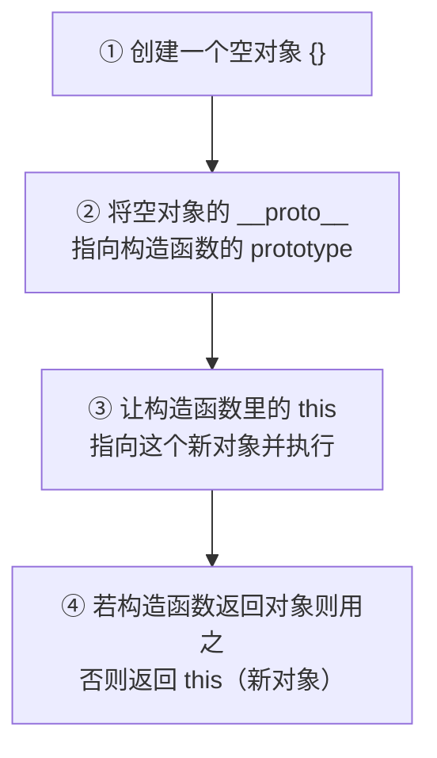
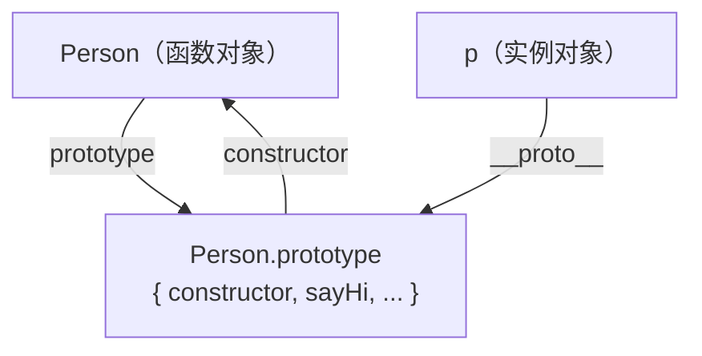
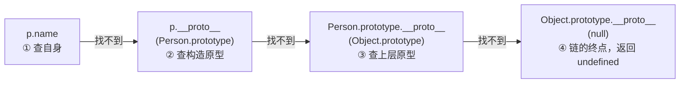
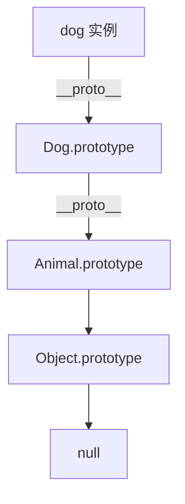
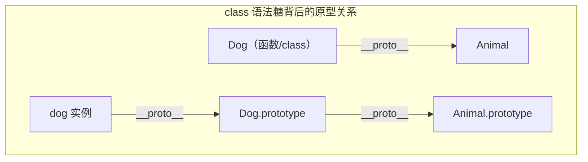
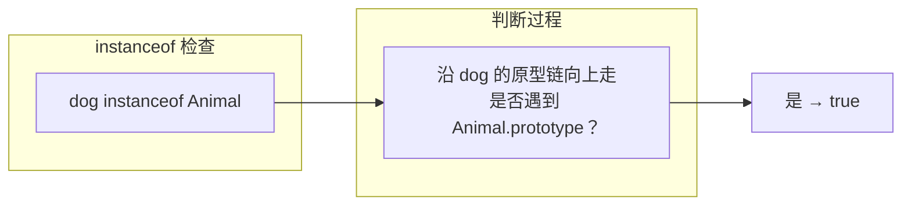

# 原型与原型链

JavaScript 是一门**基于原型（prototype）**的语言。与 Java、C++ 等基于类（class）的语言不同，JS 中的「继承」并非通过类与类的继承实现，而是通过**对象之间的原型链**串联起来。理解原型链是掌握 JS 面向对象、`this`、`instanceof` 乃至一切内建能力的关键。

## 为什么需要原型 {#why-prototype}

当我们用构造函数批量创建对象时，若把方法写在每个实例里，会造成内存浪费：

```javascript
// 反例：每个实例都有一份独立的 sayHi 函数
function Person(name) {
    this.name = name;
    this.sayHi = function () { return 'Hi, ' + this.name; };
}
const a = new Person('Alice');
const b = new Person('Bob');
a.sayHi === b.sayHi;  // false ❗ 两份函数，浪费内存
```

原型解决的就是「**共享方法**」：把方法放到构造函数的 `prototype` 上，所有实例通过原型链共用同一份。

```javascript
// 正例：方法共享
function Person(name) {
    this.name = name;          // 实例私有数据
}
Person.prototype.sayHi = function () { return 'Hi, ' + this.name; };

const a = new Person('Alice');
const b = new Person('Bob');
a.sayHi === b.sayHi;   // true ✅ 同一个函数
```

## 构造函数与 new 做了什么 {#new}

构造函数（约定首字母大写）配合 `new` 创建对象。`new` 的执行过程有四个步骤：



手动模拟 `new` 加深理解：

```javascript
function myNew(Constructor, ...args) {
    const obj = Object.create(Constructor.prototype); // 步骤 ①②
    const result = Constructor.apply(obj, args);      // 步骤 ③
    return result instanceof Object ? result : obj;   // 步骤 ④
}

const p = myNew(Person, 'Carol');
p.sayHi();  // "Hi, Carol"
```

## prototype 与 __proto__ 的区别 {#prototype-vs-proto}

这是最容易混淆的两个概念：

| 属性 | 属于谁 | 含义 |
|------|--------|------|
| `prototype` | **函数**（构造函数） | 一个对象，作为该函数构造出的实例的「原型模板」 |
| `__proto__` | **对象** | 指向「构造它的函数的 prototype」，即对象自己的原型 |

```javascript
function Person(name) { this.name = name; }
const p = new Person('Alice');

Person.prototype;            // 构造函数的原型对象
p.__proto__;                 // 指向 Person.prototype
p.__proto__ === Person.prototype;  // true

// 更推荐用 Object.getPrototypeOf 替代 __proto__
Object.getPrototypeOf(p) === Person.prototype;  // true
```



> [!NOTE]
> `prototype` 是函数的属性，`__proto__` 是对象的属性。二者通常「指向同一个原型对象」。`__proto__` 是历史遗留访问器，规范推荐用 `Object.getPrototypeOf()` / `Object.setPrototypeOf()`。

### constructor 属性 {#constructor}

每个原型对象默认带一个 `constructor`，指回构造函数本身：

```javascript
Person.prototype.constructor === Person;  // true
p.constructor === Person;                 // true（沿原型链找到的）
```

> [!WARNING]
> 若直接 `Person.prototype = { ... }` 整体覆盖原型，会丢失 `constructor`，需手动补回：`Object.assign(Person.prototype, { constructor: Person, sayHi(){...} })`。

## 原型链：属性的查找机制 {#prototype-chain}

访问 `obj.foo` 时，JS 会沿着一条链逐级向上查找：



```javascript
function Person(name) { this.name = name; }
Person.prototype.sayHi = function () { return 'Hi'; };

const p = new Person('Alice');

p.name;        // "Alice"（① 自身找到）
p.sayHi();     // "Hi"（② 原型上找到）
p.toString();  // "[object Object]"（③ Object.prototype 上找到）
p.xxx;         // undefined（④ 一路到 null 都没有）

// 验证链的终点是 null
Object.getPrototypeOf(Object.prototype);  // null
```

所有普通对象最终都指向 `Object.prototype`，再往上就是 `null`——这就是「原型链」名字的由来。

## 用原型实现继承 {#inheritance}

ES6 之前，JS 靠「原型链」实现继承。经典做法分两步：让子类原型继承父类原型，再修正 `constructor`。

```javascript
// 父类
function Animal(name) { this.name = name; }
Animal.prototype.speak = function () { return this.name + ' 叫了一声'; };

// 子类
function Dog(name) { Animal.call(this, name); }        // ① 继承实例属性
Dog.prototype = Object.create(Animal.prototype);       // ② 继承原型方法
Dog.prototype.constructor = Dog;                       // ③ 修正 constructor
Dog.prototype.speak = function () { return this.name + ' 汪汪叫'; }; // 覆盖

const dog = new Dog('旺财');
dog.speak();              // "旺财 汪汪叫"（覆盖了父类方法）
dog instanceof Dog;       // true
dog instanceof Animal;    // true ✅ 沿原型链成立
```



## class 只是语法糖 {#class-syntax}

ES6 的 `class` 本质上是「构造函数 + 原型」的封装，底层仍是原型链。

```javascript
class Animal {
    constructor(name) { this.name = name; }
    speak() { return this.name + ' 叫了一声'; }
}

class Dog extends Animal {
    speak() { return this.name + ' 汪汪叫'; }
    // super 调用父类构造/方法
    constructor(name) { super(name); }
}

const dog = new Dog('旺财');
dog.speak();                       // "旺财 汪汪叫"

typeof Dog;                        // "function"（class 本质是函数）
Object.getPrototypeOf(Dog) === Animal;          // true（静态继承）
Object.getPrototypeOf(Dog.prototype) === Animal.prototype; // true（原型继承）
```



> [!NOTE]
> `class` 方法默认不可枚举、且 `class` 内部严格模式；但它**没有**为语言带来「真正的类」，只是让原型继承写起来更像传统 OOP。

## instanceof 的原理 {#instanceof}

`A instanceof B` 判断的是：**B 的 `prototype` 是否出现在 A 的原型链上**。

```javascript
function Animal() {}
function Dog() {}
Dog.prototype = Object.create(Animal.prototype);

const dog = new Dog();
dog instanceof Dog;      // true（Dog.prototype 在链上）
dog instanceof Animal;   // true（Animal.prototype 也在链上）
dog instanceof Object;   // true（Object.prototype 在链上）
```



> [!WARNING]
> 跨 iframe/窗口的对象，其 `Array.prototype` 来自不同「世界」，`instanceof Array` 可能返回 `false`。此时用 `Array.isArray()` 更可靠。

## 常见陷阱与最佳实践 {#pitfalls}

### 遍历时误触原型 {#for-in}

`for...in` 会遍历原型链上的可枚举属性：

```javascript
function Person(name) { this.name = name; }
Person.prototype.age = 30;         // 原型上的可枚举属性

const p = new Person('Alice');
for (const key in p) {
    console.log(key);              // "name" 和 "age" 都会被打印 ❗
}
Object.keys(p);                     // ['name']（只取自身属性，推荐）
```

> [!TIP]
> 遍历对象属性优先用 `Object.keys()` / `Object.values()` / `Object.entries()`（只含自身可枚举属性），或用 `hasOwnProperty` 过滤。

### 修改原型影响所有实例 {#prototype-mutation}

原型对象是共享的，运行时修改会立即影响已创建的所有实例：

```javascript
function Person(name) { this.name = name; }
const a = new Person('A');
const b = new Person('B');

Person.prototype.greet = function () { return 'hello ' + this.name; };
a.greet();   // "hello A"（后加的属性，旧实例也能用）
```

```javascript
// 实例自身设同名属性会「遮蔽」原型属性，而非修改原型
a.greet = function () { return 'shadow'; };
a.greet();   // "shadow"（遮蔽）
b.greet();   // "hello B"（未受影响）
```

> [!WARNING]
> 不要给内建对象（`Array.prototype`、`Object.prototype` 等）随意扩展属性，会污染全局、导致与其他库冲突（猴子补丁 monkey-patch 的风险）。必要时用 `Symbol` 或独立命名空间隔离。

### 判断属性来源 {#hasown}

```javascript
p.hasOwnProperty('name');            // true（自身属性）
p.hasOwnProperty('toString');        // false（继承自原型）
Object.hasOwn(p, 'name');            // true（ES2022，更推荐）
```

### 对象不一定是「普通」的 {#null-proto}

可用 `Object.create(null)` 创建**无原型**对象，用作纯净的键值容器：

```javascript
const dict = Object.create(null);
dict['__proto__'] = 'safe';   // 不会污染原型链
dict.toString;                 // undefined（没有原型）
```

## 小结 {#summary}

本章从「为什么需要原型」出发，讲解了 `new` 的四步执行过程、`prototype` 与 `__proto__` 的区别、原型链的属性查找机制，以及用原型（和 `class` 语法糖）实现继承、`instanceof` 的底层原理。核心结论一句话：**JS 的继承是对象之间通过 `__proto__` 串成的链，`class` 只是它的语法糖**。掌握这条链，你就真正读懂了 JavaScript 的对象模型。
