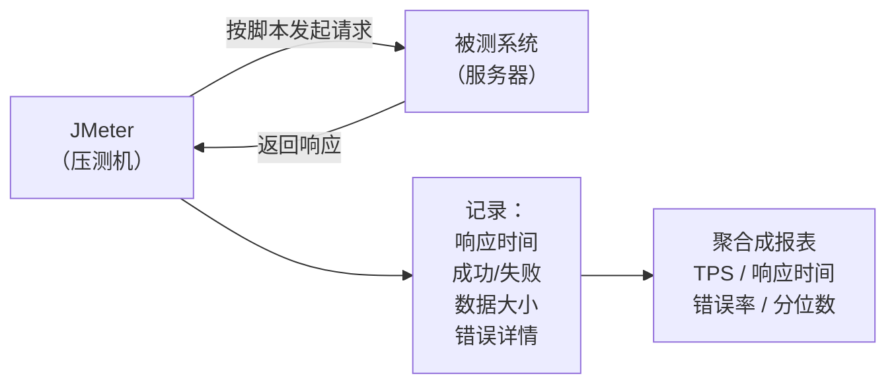
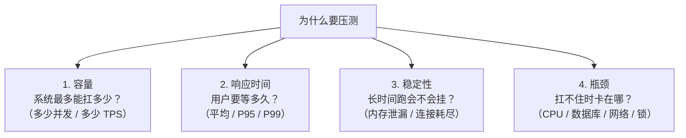
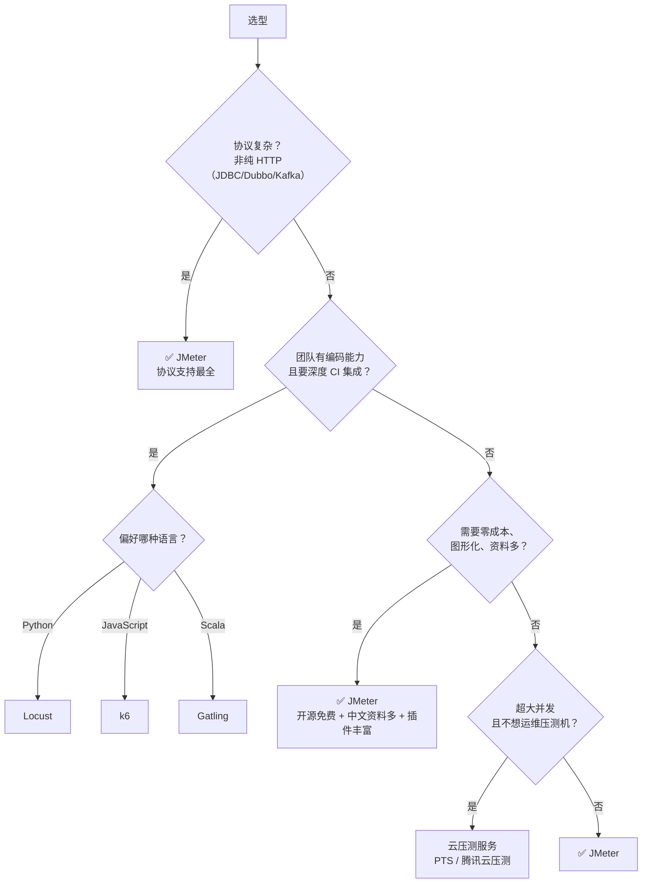
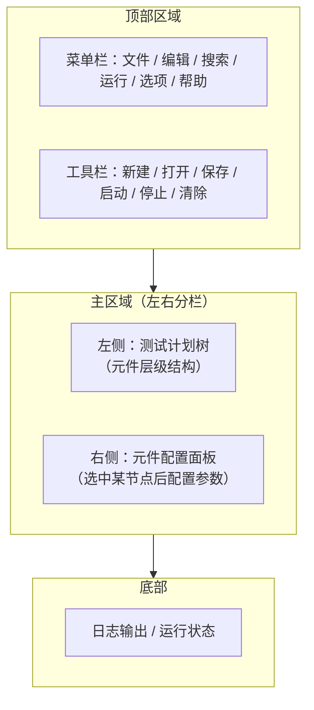
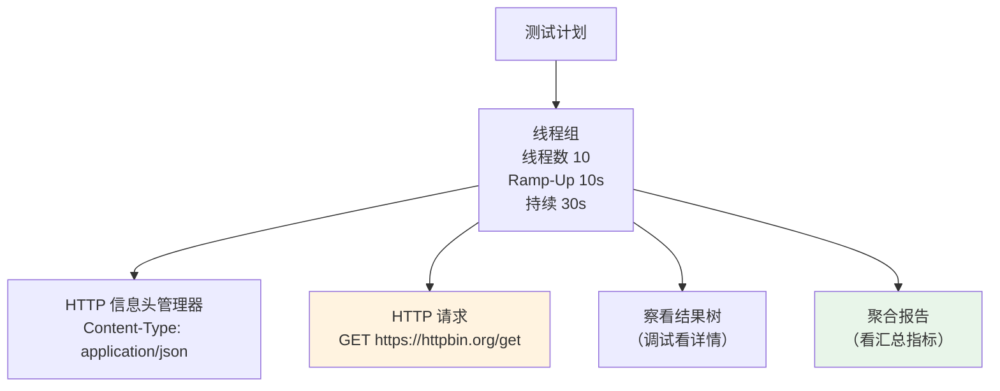
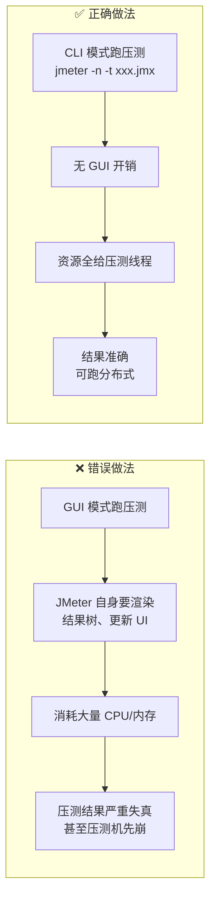

# 第一章：概述、安装与第一个压测

本章目标：装好 JMeter，理解它在性能测试领域的定位，并**跑通第一个完整的压测脚本**。读完你应该能对一个接口发起并发请求，并看到基本的结果数据。

## 一、JMeter 是什么 {#what-is-jmeter}

### 官方定义

Apache JMeter 是一个**纯 Java 编写的开源负载测试工具**，最初用于测试 Web 应用，后来扩展到几乎所有可测的协议。

它的核心工作方式是：



> **关键认知**：JMeter **不渲染页面、不执行 JavaScript**。它只发请求、收响应、记数据。所以：
> - 它测的是**服务端性能**（接口处理能力），不是前端渲染性能
> - 页面上的 JS 执行、CSS 渲染、图片加载耗时，JMeter 看不到
> - 要测前端性能用 Lighthouse / WebPageTest；JMeter 测的是「服务器扛不扛得住」

### 与浏览器压测的本质区别

| 维度 | 浏览器访问 | JMeter 压测 |
| --- | --- | --- |
| 并发能力 | 1 个用户 | 数千「虚拟用户」 |
| 渲染页面 | 会（JS/CSS/图片全加载） | 不会 |
| 静态资源 | 自动请求 | 默认不请求（需显式配置） |
| 资源占用 | 每实例几百 MB | 每线程约 1MB（轻量） |
| 用途 | 功能验证、前端体验 | **服务端容量与稳定性** |

## 二、性能测试要回答的问题 {#why}

在动手之前，先明确压测到底要回答什么。通常就这四个：



**对应五类压测场景**（第三章详述）：

| 场景 | 目的 | 典型做法 |
| --- | --- | --- |
| **基准测试** | 单用户下的性能基线 | 1 线程跑 N 次 |
| **负载测试** | 验证日常/峰值容量是否达标 | 逐步加到目标并发 |
| **压力测试** | 找到系统极限 | 持续加压直到 TPS 下降 |
| **稳定性测试** | 长时间运行是否可靠 | 70% 峰值压力跑 8-24 小时 |
| **破坏性测试** | 超出极限后如何恢复 | 瞬间打满，观察降级与恢复 |

## 三、工具对比与选型 {#comparison}

### 主流性能测试工具

| 工具 | 语言 | 脚本方式 | 单机并发 | 学习成本 | 适用场景 |
| --- | --- | --- | --- | --- | --- |
| **JMeter** | Java | GUI 拖拽 / XML | 数千 | 中 | **通用首选**，协议最全 |
| **LoadRunner** | C | GUI / C 脚本 | 数万 | 高 | 传统企业，商业授权贵 |
| **Gatling** | Scala | Scala DSL 代码 | 数万 | 高 | 需要代码化、CI 集成 |
| **Locust** | Python | Python 代码 | 数万 | 中 | 开发友好，快速编写 |
| **k6** | Go(JS 脚本) | JavaScript | 数万 | 低 | 云原生、CI/CD 集成好 |
| **wrk / ab** | C | 命令行 | 数万 | 低 | 简单 HTTP 打流，无场景 |
| **阿里云 PTS** | — | 云端 | 百万 | 低 | 免运维，按量付费 |

### 什么时候选 JMeter



**JMeter 的优势**：

- ✅ **开源免费**，无授权成本
- ✅ **协议覆盖最全**：HTTP/JDBC/JMS/Dubbo/gRPC/Kafka/FTP/LDAP…
- ✅ **图形化操作**，不写代码也能搭复杂脚本
- ✅ **插件生态成熟**（JMeter Plugins Manager 有 100+ 插件）
- ✅ **中文资料、社区案例最多**，遇到问题容易搜到

**JMeter 的劣势**：

- ❌ **Java 线程模型**，单机并发上限不如 k6/Gatling（协程/异步模型）
- ❌ GUI 模式下资源消耗大（所以压测必须用 CLI）
- ❌ 脚本是 XML，版本管理不友好（diff 很难读）

> **并发量参考**：一台 4 核 8G 的压测机，JMeter 通常能跑 1000-2000 并发线程（取决于请求复杂度与响应大小）。需要更高并发就用分布式压测（第七章）。

## 四、环境准备与安装 {#install}

### 1. JDK 环境

JMeter 是 Java 程序，**必须先装 JDK**（JMeter 5.6 需要 Java 8+，推荐 Java 11 或 17）。

```bash
# 检查 Java
java -version
# 应输出类似：openjdk version "17.0.10" 2024-01-16

# 若未安装：
# macOS
brew install openjdk@17

# Ubuntu/Debian
sudo apt install openjdk-17-jdk

# Windows：下载 Eclipse Temurin / Oracle JDK 安装包
# https://adoptium.net/
```

配置 `JAVA_HOME`：

```bash
# macOS / Linux：写入 ~/.zshrc 或 ~/.bashrc
export JAVA_HOME=$(/usr/libexec/java_home)     # macOS
export JAVA_HOME=/usr/lib/jvm/java-17-openjdk  # Linux
export PATH=$JAVA_HOME/bin:$PATH

# Windows：系统环境变量
# JAVA_HOME = C:\Program Files\Java\jdk-17
# PATH 追加 %JAVA_HOME%\bin
```

> **注意**：JMeter 5.6.x 官方要求 **Java 8 及以上**。用 Java 21 可能遇到某些旧插件不兼容，推荐 **Java 11 或 17**。

### 2. 下载安装 JMeter

```bash
# 官网下载（推荐镜像站更快）
# https://jmeter.apache.org/download_jmeter.cgi
# 清华镜像：https://mirrors.tuna.tsinghua.edu.cn/apache/jmeter/binaries/

# 下载 Binaries 版本（非 source）
wget https://mirrors.tuna.tsinghua.edu.cn/apache/jmeter/binaries/apache-jmeter-5.6.3.zip

# 解压
unzip apache-jmeter-5.6.3.zip
cd apache-jmeter-5.6.3
```

**各平台安装**：

```bash
# ===== macOS =====
brew install jmeter                    # 会自动装依赖
# 或手动解压后
ln -s /path/to/apache-jmeter-5.6.3/bin/jmeter /usr/local/bin/jmeter

# ===== Windows =====
# 1. 解压到 C:\apache-jmeter-5.6.3
# 2. 新增环境变量 JMETER_HOME = C:\apache-jmeter-5.6.3
# 3. PATH 追加 %JMETER_HOME%\bin
# 4. 双击 bin\jmeter.bat 启动

# ===== Linux =====
tar -xzf apache-jmeter-5.6.3.tgz
sudo mv apache-jmeter-5.6.3 /opt/jmeter
echo 'export PATH=/opt/jmeter/bin:$PATH' >> ~/.bashrc
```

### 3. 启动验证

```bash
# macOS / Linux
cd apache-jmeter-5.6.3/bin
./jmeter                 # 启动 GUI

# Windows
jmeter.bat               # 或双击

# 查看版本（CLI）
jmeter -v
```

首次启动会看到 GUI 界面（深色/浅色主题可在 Options → Look and Feel 切换）。

### 4. 目录结构

```
apache-jmeter-5.6.3/
├── bin/                        # 可执行文件与配置
│   ├── jmeter                  # Linux/macOS 启动脚本
│   ├── jmeter.bat              # Windows 启动脚本
│   ├── jmeter.properties       # ★ 核心配置文件
│   ├── jmeter-server           # 分布式压测的 Agent 启动
│   ├── user.properties         # ★ 用户自定义配置（推荐改这里）
│   ├── saveservice.properties  # 结果文件格式配置
│   ├── jmeter.log              # 运行日志
│   └── templates/              # 脚本模板
├── lib/                        # 依赖库
│   ├── ext/                    # ★ 核心组件与插件放这里
│   ├── junit/
│   └── ...
├── docs/                       # 官方文档
├── printable_docs/             # 可打印文档
├── extras/                     # 辅助工具（Ant 任务等）
└── LICENSE / README.md
```

**重点记住三条**：

- **插件 jar 包放 `lib/ext/`**，重启 JMeter 生效
- **改配置优先改 `bin/user.properties`**，而不是直接改 `jmeter.properties`（后者是官方默认，升级会被覆盖）
- **日志看 `bin/jmeter.log`**，GUI 里报错第一时间查它

### 5. 中文语言设置

```bash
# 永久生效：修改 bin/jmeter.properties
language=zh_CN

# 或临时指定
jmeter -Jlanguage=zh_CN
```

GUI 里也可以：Options → Choose Language → Chinese(Simplified)（但重启会失效，建议改配置文件）。

## 五、GUI 界面导览 {#gui}

### 整体布局



### 关键概念：树形结构

JMeter 的脚本是一棵树：

```text
测试计划 (Test Plan)
├── 线程组 (Thread Group)              ← 定义"多少人、跑多久"
│   ├── HTTP 请求默认值 (Config Element)
│   ├── HTTP Cookie 管理器 (Config Element)
│   ├── HTTP 信息头管理器 (Config Element)
│   ├── CSV 数据文件设置 (Config Element)
│   ├── 仅一次控制器 (Logic Controller)
│   │   └── 登录请求 (Sampler)
│   ├── JSON 提取器 (Post Processor)     ← 提取 token
│   ├── 事务控制器 (Logic Controller)
│   │   ├── 查询商品 (Sampler)
│   │   ├── 加入购物车 (Sampler)
│   │   └── 提交订单 (Sampler)
│   ├── 响应断言 (Assertion)
│   ├── 固定定时器 (Timer)
│   └── 察看结果树 (Listener)
│   └── 聚合报告 (Listener)
└── ...
```

**树的层级决定了作用域**——这是 JMeter 最重要的规则之一，第二章会详细讲。

### 工具栏常用按钮

| 按钮 | 快捷键 | 作用 |
| --- | --- | --- |
| 新建 | Ctrl+N | 新建测试计划 |
| 打开 | Ctrl+O | 打开 `.jmx` 文件 |
| 保存 | Ctrl+S | 保存为 `.jmx` |
| **启动** | Ctrl+R | 运行测试计划 |
| **停止** | Ctrl+. | 立即停止（粗暴） |
| **关闭** | Ctrl+, | 等当前迭代结束后停止（优雅） |
| 清除 | Ctrl+E | 清除监听器结果 |
| 清除全部 | Ctrl+Shift+E | 清除所有结果 |

> **停止 vs 关闭**：`停止` 是立刻中断所有线程，可能产生残缺数据；`关闭` 是让线程跑完当前循环后自然退出，数据更完整。**压测时优先用「关闭」**。

## 六、第一个压测：完整实操 {#first-test}

目标：对一个公开测试接口发起 10 并发、持续 30 秒的压测，并查看结果。

我们用 `https://httpbin.org/get`（或你自己的接口）作为被测对象。

### 步骤 1：创建测试计划

启动 JMeter，左侧默认已有一个「测试计划」。

```
测试计划
├─ 名称：我的第一个压测
└─ 用户定义的变量：可先留空
```

### 步骤 2：添加线程组

右键「测试计划」→ 添加 → 线程（用户）→ **线程组**

配置：

| 参数 | 值 | 说明 |
| --- | --- | --- |
| 名称 | 压测线程组 | 自定义 |
| **线程数** | 10 | 虚拟用户数（并发数） |
| **Ramp-Up 时间（秒）** | 10 | 10 秒内逐步启动完 10 个线程（每秒 1 个） |
| **循环次数** | 勾选「永远」+ 调度器 | 或填具体次数 |
| 调度器：持续时间（秒） | 30 | 总共跑 30 秒 |

```mermaid
gantt
    title Ramp-Up = 10s，10 个线程的启动过程
    dateFormat X
    axisFormat %S
    section 线程启动
    线程 1（0s 启动）  :0, 30
    线程 2（1s 启动）  :1, 29
    线程 3（2s 启动）  :2, 28
    线程 5（4s 启动）  :4, 26
    线程 10（9s 启动） :9, 21
```



> **Ramp-Up 的含义**：不是「所有线程同时冲上去」，而是**在 N 秒内均匀启动**。Ramp-Up=10、线程数=10 表示每秒启动 1 个。这更接近真实的用户逐步进入。

### 步骤 3：添加 HTTP 请求

右键线程组 → 添加 → 取样器 → **HTTP 请求**

配置：

| 字段 | 值 |
| --- | --- |
| 名称 | 查询接口 |
| 协议 | `https` |
| 服务器名称或 IP | `httpbin.org` |
| 端口号 | `443` |
| HTTP 请求方法 | `GET` |
| 路径 | `/get` |
| 参数 | 可加 `name=test` |

### 步骤 4：添加 HTTP 信息头管理器（可选但推荐）

右键线程组 → 添加 → 配置元件 → **HTTP 信息头管理器**

添加一行：

```
名称：Content-Type    值：application/json
```

### 步骤 5：添加监听器（看结果）

右键线程组 → 添加 → 监听器 → 至少加这两个：

1. **察看结果树**（View Results Tree）：看每个请求的详情，调试用
2. **聚合报告**（Aggregate Report）：看汇总指标

### 步骤 6：运行并查看

点击工具栏绿色 ▶ 启动按钮（或 Ctrl+R）。

**察看结果树**里可以看到：

- 绿色对勾 = 成功
- 红色叉 = 失败
- 点击某个请求可看：请求数据（Request）、响应数据（Response）

**聚合报告**里会显示：

| 列 | 含义 |
| --- | --- |
| Samples | 总请求数 |
| Average | 平均响应时间（ms） |
| Median | 中位数（50% 分位） |
| 90% Line | 90% 分位数 |
| 95% Line | 95% 分位数 |
| 99% Line | 99% 分位数 |
| Min / Max | 最小 / 最大响应时间 |
| Error % | 错误率 |
| Throughput | 吞吐量（每秒请求数，即 TPS） |
| Received KB/sec | 每秒接收数据量 |
| Sent KB/sec | 每秒发送数据量 |

> 第一次看到这些数字可能没概念——**第六章会专门讲透每个指标的读法**。现在先确认能跑出数据。

### 完整脚本结构



### 保存脚本

Ctrl+S 保存为 `first-test.jmx`。

`.jmx` 文件本质是 XML，可以用文本编辑器打开（但很冗长，不建议手工编辑）。

```xml
<!-- 片段示例，感受一下结构 -->
<ThreadGroup guiclass="ThreadGroupGui" testclass="ThreadGroup" testname="压测线程组">
  <stringProp name="ThreadGroup.num_threads">10</stringProp>
  <stringProp name="ThreadGroup.ramp_time">10</stringProp>
  <boolProp name="ThreadGroup.scheduler">true</boolProp>
  <stringProp name="ThreadGroup.duration">30</stringProp>
</ThreadGroup>
```

## 七、GUI 只是写脚本用的 {#gui-vs-cli}

**这是新手最容易犯的错误：用 GUI 跑压测。**



**JMeter 启动时的官方警告**就是这句话：

> "Don't use GUI mode for load testing! ... Use GUI mode only for test creation and test debugging."

**分工**：

| 阶段 | 用什么 | 原因 |
| --- | --- | --- |
| **写脚本 / 调试** | GUI | 可视化方便，能看请求详情 |
| **正式压测** | CLI（`jmeter -n ...`） | 无 UI 开销，资源全给压测 |
| **大规模压测** | CLI + 分布式 | 单机不够，多台一起打 |

CLI 命令预览（第七章详述）：

```bash
jmeter -n -t first-test.jmx -l result.jtl -e -o ./report
#  -n  非 GUI 模式
#  -t  测试脚本
#  -l  结果文件
#  -e  生成 HTML 报告
#  -o  报告输出目录
```

## 八、配置优化（装完必做）{#config-tuning}

默认的 JMeter 配置比较保守，建议开局就调这几项。编辑 **`bin/user.properties`**（不要改 `jmeter.properties`）：

```properties
# ===== 语言 =====
language=zh_CN

# ===== 结果文件：只存需要的字段，减小文件、提升性能 =====
# 默认 JMeter 会记录很多字段，压测时建议精简
jmeter.save.saveservice.output_format=csv
jmeter.save.saveservice.response_code=true
jmeter.save.saveservice.response_message=false
jmeter.save.saveservice.successful=true
jmeter.save.saveservice.thread_name=true
jmeter.save.saveservice.time=true
jmeter.save.saveservice.latency=true
jmeter.save.saveservice.connect_time=true
jmeter.save.saveservice.bytes=true
jmeter.save.saveservice.sent_bytes=true
jmeter.save.saveservice.url=false
jmeter.save.saveservice.filename=false
jmeter.save.saveservice.hostname=false
jmeter.save.saveservice.label=true
# 注意：response_data / sampler_data / assertions 保持 false
# 存了会把整个响应体写进文件，压测时文件会爆炸式增长

# ===== HTTP 客户端 =====
# 连接超时（毫秒）
httpclient.timeout=10000
# 使用 HttpClient4 的连接复用
httpclient4.time_to_live=60000
httpclient4.validate_after_inactivity=2000

# ===== 结果默认不保存响应数据（重要！）=====
jmeter.save.saveservice.response_data=false
jmeter.save.saveservice.response_data.on_error=false

# ===== 分布式（第七章用）=====
server.rmi.ssl.disable=true
```

**内存配置**（高并发时需要）：

```bash
# bin/jmeter（Linux/macOS）或 bin/jmeter.bat（Windows）
# 修改 HEAP 参数

# Linux/macOS: bin/jmeter 里找到
: "${HEAP:="-Xms1g -Xmx4g -XX:MaxMetaspaceSize=512m"}"

# Windows: bin/jmeter.bat 里
set HEAP=-Xms1g -Xmx4g -XX:MaxMetaspaceSize=512m
```

> 经验值：每 1000 并发线程约需 1GB 堆内存。但也不是越大越好——堆太大会导致 GC 停顿变长，反而影响压测准确性。**一般配 2-4GB 即可**。

## 九、常见问题 {#troubleshooting}

| 现象 | 原因 | 解决 |
| --- | --- | --- |
| 双击 `jmeter.bat` 闪退 | 没装 JDK 或 JAVA_HOME 没配 | 装 JDK 17，配好环境变量 |
| `Not able to find Java executable` | PATH 里没有 java | 检查 `java -version` |
| 界面是英文 | 未设中文 | `bin/user.properties` 加 `language=zh_CN` |
| 响应乱码 | 编码不匹配 | 请求里设 `Content encoding: UTF-8`；或在 `jmeter.properties` 设 `sampleresult.default.encoding=UTF-8` |
| 启动时警告 "Don't use GUI mode" | 正常提示 | 只是提醒，调试时忽略即可 |
| 请求报 `Non HTTP response code: java.net.SocketException` | 连接被拒/超时 | 检查目标服务是否可达、端口是否正确 |
| 证书错误（HTTPS） | 自签名证书 | 临时方案：HTTP 请求里勾选「使用 KeepAlive」无效，需在 `system.properties` 配置信任库，或用 HTTP 请求默认值的高级选项 |
| OutOfMemoryError | 堆内存不够 | 调大 HEAP，或减少线程数/监听器 |

```bash
# 排查网络连通性
ping httpbin.org
curl -v https://httpbin.org/get

# 查看 JMeter 日志
tail -f bin/jmeter.log
```

## 小结 {#summary}

- **JMeter 是什么**：纯 Java 的负载测试工具，通过模拟大量虚拟用户发请求，**度量服务端的处理能力**。它不渲染页面，测的是服务端而非前端。
- **压测要回答四个问题**：容量（最多扛多少）、响应时间（用户等多久）、稳定性（长时间跑挂不挂）、瓶颈（扛不住卡在哪）。
- **选型**：JMeter 胜在协议全、免费、资料多；需要超大并发且要深度 CI 集成可考虑 k6/Locust/Gatling；不想运维压测机用云压测。
- **安装**：先装 JDK 17 → 解压 JMeter → 配 `JAVA_HOME`。插件放 `lib/ext/`，配置改 `bin/user.properties`。
- **第一个脚本**：线程组（10 线程 / Ramp-Up 10s / 30s）→ HTTP 请求 → 察看结果树 + 聚合报告。
- **GUI 只用来写脚本和调试，压测必须用 CLI**——GUI 自身的渲染开销会让结果严重失真。

下一章讲 JMeter 的**核心组件体系与执行顺序**。理解「元件按什么顺序执行、作用范围到哪」，是写出正确脚本的前提——很多诡异问题（变量取不到、关联失败）都源于没搞懂作用域。
