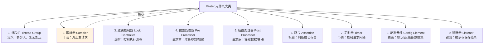
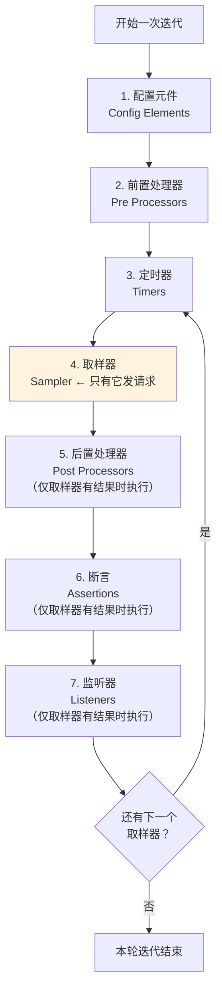
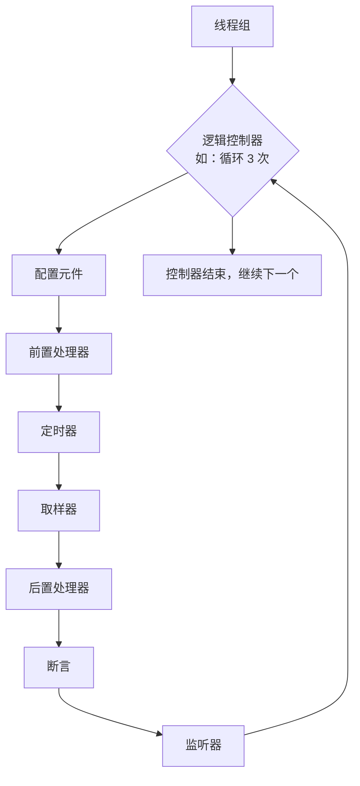
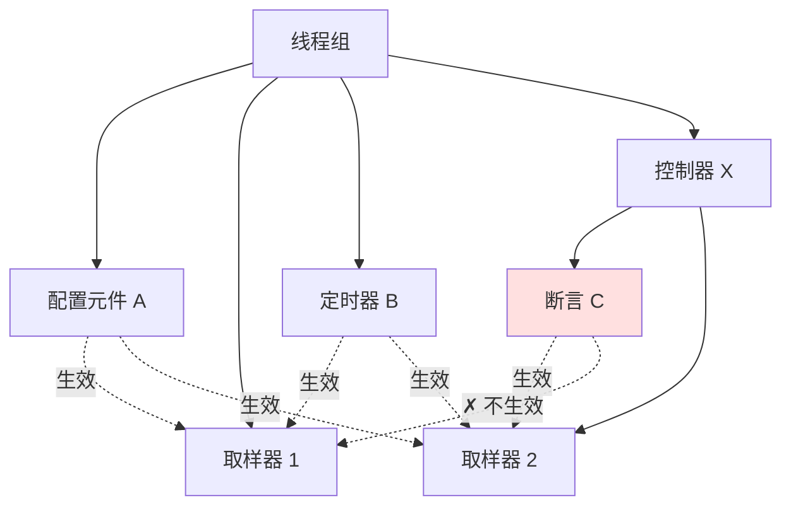
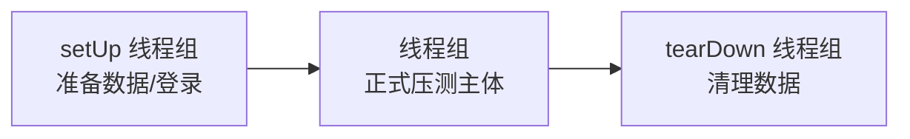
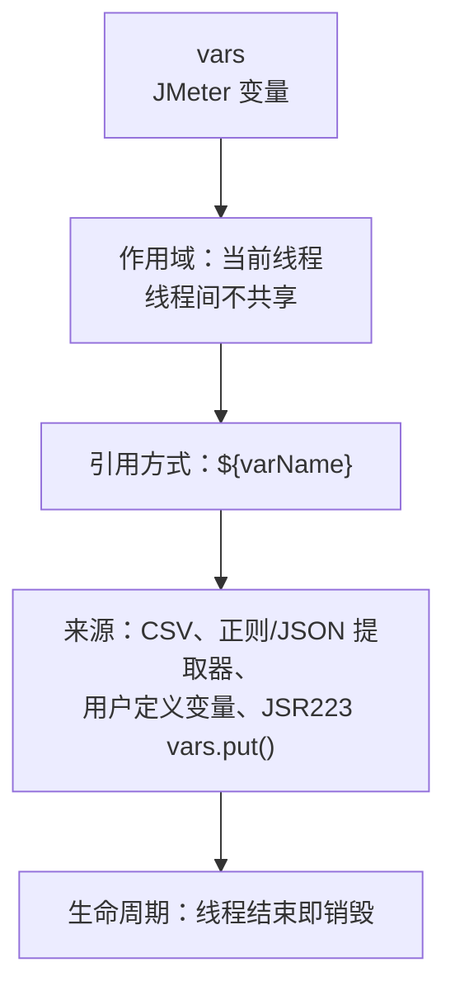
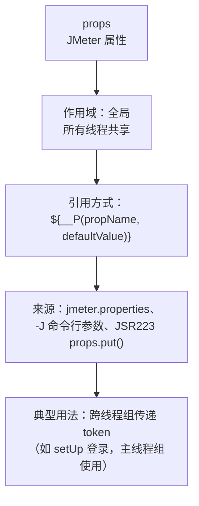
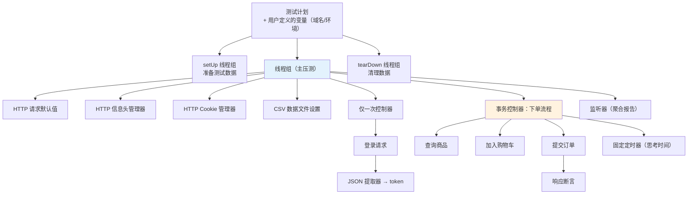

# 第二章：核心组件全景与执行顺序

这一章是**理解 JMeter 的地基**。JMeter 有几十种元件，但本质上只有九类；而真正让人踩坑的不是「某个元件怎么用」，而是**「元件什么时候执行、作用于哪些请求」**。

搞懂本章后，你会明白：
- 为什么 JSON 提取器放在线程组下就取不到值
- 为什么定时器放在某个位置会影响全部请求
- 为什么同一个变量名在不同地方取到的值不一样

## 一、九大类元件总览 {#nine-types}



### 一句话概括每类

| 类别 | 一句话 | 最常用的元件 |
| --- | --- | --- |
| **线程组** | 定义「多少人、怎么加、跑多久」 | 线程组、setUp/tearDown、Stepping/Ultimate 线程组（插件） |
| **取样器** | **唯一真正发请求的元件** | HTTP 请求、JDBC Request、调试取样器 |
| **逻辑控制器** | 编排取样器的执行流程 | 事务控制器、仅一次控制器、If、循环、吞吐量控制器 |
| **前置处理器** | 请求发送**前**做事 | 用户参数、JSR223 前置处理器（加密/签名） |
| **后置处理器** | 请求发送**后**做事 | **JSON 提取器**、正则提取器、边界提取器 |
| **断言** | 判断响应是否正确 | 响应断言、**JSON 断言**、持续时间断言 |
| **定时器** | 控制请求之间的间隔 | 固定定时器、高斯随机、**同步定时器（集合点）** |
| **配置元件** | 提供默认值与数据 | **HTTP 请求默认值**、**CSV Data Set Config**、HTTP Cookie 管理器、HTTP 信息头管理器 |
| **监听器** | 展示/保存结果 | 察看结果树、聚合报告、**Backend Listener** |

> **记忆口诀**：线程组决定「谁」，取样器决定「做什么」，控制器决定「顺序」，前后处理器负责「准备与提取」，断言负责「对错」，定时器负责「快慢」，配置元件负责「材料」，监听器负责「记录」。

## 二、执行顺序（最核心的规则）{#execution-order}

### 规则：元件按固定顺序执行，与树上的添加顺序无关

很多人以为元件按树上的先后顺序执行——**错的**。JMeter 有固定的执行优先级：



**关键点**：

1. **定时器在取样器之前执行**——所以定时器影响的是「它之后要发的请求」，而不是「它之前的」。
2. **后置处理器、断言、监听器只在取样器有响应时执行**（请求失败/超时则不执行）。
3. **配置元件最先执行**——所以 CSV 读取、Cookie 管理器在请求前就准备好了。
4. 同一类型的多个元件，**按树上的先后顺序执行**。

### 举例理解

假设树上有这样的结构（注意：添加顺序是乱的）：

```
线程组
├── 响应断言          ← 第 1 个添加
├── HTTP 请求         ← 第 2 个添加
├── 固定定时器        ← 第 3 个添加
├── JSON 提取器       ← 第 4 个添加
└── HTTP 信息头管理器  ← 第 5 个添加
```

**实际执行顺序是**：

```text
1. HTTP 信息头管理器    （配置元件，第 1 优先级）
2. 固定定时器           （定时器）
3. HTTP 请求            （取样器，发请求）
4. JSON 提取器          （后置处理器，提取数据）
5. 响应断言             （断言，校验）
```

**与添加顺序完全无关**，只与元件类型有关。

### 逻辑控制器的位置

逻辑控制器是唯一能改变这个流程的元件——它作为「容器」，决定**内部哪些取样器执行、执行几次**：



> 简言之：**控制器包裹取样器，控制「要不要执行、执行多少次」；而元件类型决定「在取样器前后按什么顺序执行」。**

## 三、作用域规则（最容易踩坑）{#scope}

### 规则一：父子与兄弟

JMeter 的作用域由**树形层级**决定：

```text
线程组
├── A（元件）
├── 取样器 1
├── B（元件）
└── 控制器 X
    ├── C（元件）
    └── 取样器 2
```

| 元件 | 作用于 |
| --- | --- |
| A、B | 取样器 1（同级）+ 控制器 X 内的取样器 2（下级）→ **作用于所有同级及其下级的取样器** |
| C | 只在控制器 X 内部生效，作用于取样器 2 |

**口诀**：

> **一个元件作用于：它的所有同级兄弟节点中的取样器，以及所有下级的取样器。**
> 换句话说：**元件「向下」和「向同级」生效，不会「向上」生效。**



### 规则二：不同类型的作用域差异

| 元件类型 | 作用域特点 | 常见坑 |
| --- | --- | --- |
| **配置元件** | 作用于同级+下级 | 放错层级导致默认值不生效 |
| **前置处理器** | 作用于**每个**同级+下级的取样器 | 想在某个请求前只跑一次，应放进该请求内部 |
| **后置处理器** | 作用于每个取样器 | **放线程组级别会对所有请求都提取一遍**，通常应放在具体请求下 |
| **断言** | 作用于每个取样器 | 放线程组下会校验所有请求，可能误判 |
| **定时器** | 作用于**每个**取样器之前 | 容易「叠加」：多个定时器会累加 |
| **监听器** | 收集同级+下级所有取样器的结果 | 放根下能收集全部（但压测时应禁用） |

### 典型坑 1：JSON 提取器放在线程组下

```text
❌ 错误：
线程组
├── JSON 提取器      ← 对所有请求都执行提取
├── 登录请求
├── 查询请求
└── 下单请求

结果：每个请求都尝试提取 token，后面的请求会把 token 覆盖成空，导致关联失效
```

```text
✅ 正确：
线程组
├── 登录请求
│   └── JSON 提取器   ← 只挂在登录请求下，只从它的响应里提取
├── 查询请求
└── 下单请求
```

### 典型坑 2：定时器叠加

```text
线程组
├── 固定定时器（1 秒）   ← 作用于下面 3 个请求
├── 请求 A
├── 请求 B
└── 请求 C
```

实际效果：**每个请求前都等 1 秒**，总共 3 秒。若再加一个高斯定时器，会继续累加。

> 若只想让某个请求前等待，把定时器放成该请求的**子节点**。

### 典型坑 3：HTTP 请求默认值放错

```text
❌ 错误：
测试计划
├── HTTP 请求默认值（server: api.example.com）
├── 线程组 A
│   └── 请求 1         ← 取不到默认值（默认值是线程组 A 的"上级/旁支"）
└── 线程组 B
    └── 请求 2
```

```text
✅ 正确：
测试计划
├── HTTP 请求默认值（server: api.example.com）   ← 放在最外层
│
├── 线程组 A
│   └── 请求 1        ← 生效
└── 线程组 B
    └── 请求 2        ← 生效
```

放在**测试计划**下，对所有线程组生效；放某个线程组下，只对该线程组生效。

## 四、各类元件详解 {#details}

### 1. 线程组（Thread Group）

**作用**：定义虚拟用户的数量、启动方式、执行时长。

三种内置类型：

| 类型 | 用途 |
| --- | --- |
| **线程组** Thread Group | 常规压测，最常用 |
| **setUp 线程组** | 正式压测**前**执行（如准备数据、预热、登录取 token） |
| **tearDown 线程组** | 压测**后**执行（如清理数据） |



> 多组默认**并行执行**（可勾选「独立运行每个线程组」改为串行）。

### 2. 取样器（Sampler）

**唯一真正发起请求的元件**。没有取样器就不会有请求，脚本也是无效的。

| 取样器 | 用途 |
| --- | --- |
| **HTTP 请求** | 最常用，REST API、Web 接口 |
| **JDBC Request** | 数据库压测（需先配 JDBC Connection Configuration） |
| **Java 请求** | 自定义 Java 类（如压测自研 SDK） |
| **JSR223 Sampler** | 用 Groovy 写代码发请求（灵活但性能差） |
| **调试取样器** Debug Sampler | **调试神器**：打印当前所有 JMeter 变量 |
| **FTP 请求 / SMTP / TCP** | 对应协议 |
| **WebSocket / gRPC / Dubbo** | 需要装插件 |

> **调试取样器 + 察看结果树** 是排查变量问题的最佳组合。想知道某个变量当前是什么值？加个 Debug Sampler 跑一次就看到了。

### 3. 逻辑控制器（Logic Controller）

**作用**：控制取样器的执行逻辑（分支、循环、分组）。第五章详解，这里列清单：

| 控制器 | 作用 | 典型场景 |
| --- | --- | --- |
| **事务控制器** | 把多个请求合并成一个「事务」统计 | 统计「下单流程」整体耗时 |
| **仅一次控制器** | 内部请求**每个线程只执行一次** | 登录只做一次，后续循环只跑业务 |
| **循环控制器** | 内部请求循环 N 次 | 重复某个操作 |
| **If 控制器** | 条件判断 | 根据变量决定走哪个分支 |
| **吞吐量控制器** | 控制执行比例 | 20% 用户下单、80% 浏览 |
| **随机控制器** | 随机选一个子请求执行 | 模拟用户随机行为 |
| **模块控制器** | 引用其他控制器（复用） | 脚本模块化 |
| **While 控制器** | 条件循环 | 轮询直到某状态 |

### 4. 前置处理器（Pre Processor）

**请求发送前**执行。

| 元件 | 用途 |
| --- | --- |
| **用户参数** | 给每个线程分配不同的参数值 |
| **JSR223 前置处理器** | Groovy 脚本：加密、签名、生成时间戳、计算 MD5 |
| **HTTP URL 重写修饰符** | URL 重写场景（Session 无 Cookie 时） |
| **BeanShell 前置处理器** | 老式脚本（**不推荐**，性能差，用 JSR223 Groovy 替代） |

**典型用法：接口签名**

```groovy
// JSR223 前置处理器（Groovy）
import org.apache.commons.codec.digest.DigestUtils

def appKey = "myAppKey"
def appSecret = "mySecret"
def timestamp = System.currentTimeMillis().toString()
def nonce = UUID.randomUUID().toString().replace("-", "")

// 按约定拼接并签名
def raw = appKey + timestamp + nonce + appSecret
def sign = DigestUtils.md5Hex(raw).toUpperCase()

// 存为 JMeter 变量，后续请求用 ${sign} 引用
vars.put("timestamp", timestamp)
vars.put("nonce", nonce)
vars.put("sign", sign)
```

### 5. 后置处理器（Post Processor）

**请求返回后**执行，最核心的用途是**关联**（提取响应数据供后续请求使用）。第四章详解。

| 元件 | 适用场景 | 性能 |
| --- | --- | --- |
| **JSON 提取器** | JSON 响应 | 好 |
| **正则表达式提取器** | 任意文本 | 中（正则开销） |
| **边界提取器** | 简单左右边界 | **最好** |
| XPath 提取器 | XML/HTML | 差 |
| **JSR223 后置处理器** | 复杂逻辑 | 中 |

### 6. 断言（Assertion）

**判断请求是否真的成功**。

> **极其重要的认知**：JMeter 默认**只要 HTTP 状态码是 2xx/3xx 就算成功**。但接口返回 `{"code": 500, "msg": "系统异常"}` 时，HTTP 状态码仍是 200，JMeter 会判定为成功！
>
> **所以断言必须加**，否则错误率全是 0，压测结论完全不可信。

| 断言 | 用途 |
| --- | --- |
| **响应断言** | 检查响应文本/代码/头是否包含某字符串 |
| **JSON 断言** | 检查 JSON 某字段的值（如 `$.code == 0`） |
| **持续时间断言** | 响应时间超过阈值则失败（最直接的 SLA 校验） |
| **大小断言** | 响应大小范围校验 |
| **BeanShell / JSR223 断言** | 自定义逻辑 |

### 7. 定时器（Timer）

**控制请求之间的等待时间**，模拟用户的「思考时间」。

| 定时器 | 特点 |
| --- | --- |
| **固定定时器** | 固定等待 N 毫秒 |
| **高斯随机定时器** | 随机等待（正态分布），更真实 |
| **均匀随机定时器** | 随机等待（均匀分布） |
| **同步定时器** | **集合点**：等够 N 个线程一起发（制造瞬时并发） |
| **恒定吞吐量定时器** | 控制每分钟请求数（**TPS 整形**） |
| **吞吐量整形定时器**（插件） | 更强大的 TPS 控制，支持阶梯 |

> **不加定时器会怎样**：JMeter 会以最快速度发请求（一个请求返回立刻发下一个），这相当于「机器人疯狂点击」，与真实用户行为差距巨大，压出来的 TPS 会虚高。**除了纯容量探测，一般都要加思考时间。**

### 8. 配置元件（Config Element）

**提供默认值、变量、数据集**，不会发请求。

| 元件 | 用途 | 重要度 |
| --- | --- | --- |
| **HTTP 请求默认值** | 统一配置协议/域名/端口/路径前缀 | ★★★ |
| **HTTP 信息头管理器** | 统一设置 Header（Content-Type、Authorization） | ★★★ |
| **HTTP Cookie 管理器** | 自动管理 Cookie，维持会话 | ★★★ |
| **CSV Data Set Config** | 从文件读取参数（多用户不同账号） | ★★★ |
| **用户定义的变量** | 定义全局变量（如域名、环境） | ★★★ |
| **JDBC Connection Configuration** | 数据库连接池配置 | ★★ |
| **随机变量** | 生成随机数 | ★★ |
| **计数器** | 自增计数器 | ★★ |
| **HTTP 缓存管理器** | 模拟浏览器缓存行为 | ★ |
| **DNS 缓存管理器** | 控制 DNS 解析 | ★ |

### 9. 监听器（Listener）

**展示与保存结果**。

| 监听器 | 用途 | 压测时 |
| --- | --- | --- |
| **察看结果树** | 看每个请求详情 | **必须禁用/删除**（内存杀手） |
| **聚合报告** | 汇总指标表格 | 可用（开销小） |
| **汇总报告** | 更简洁的汇总 | 可用 |
| **图形结果** | 折线图 | GUI 调试用 |
| **响应时间图**（插件） | 响应时间趋势 | ★★ |
| **Transactions per Second**（插件） | TPS 趋势图 | ★★★ |
| **Active Threads Over Time**（插件） | 并发数趋势 | ★★★ |
| **PerfMon Metrics Collector**（插件） | 服务器资源监控 | ★★★ |
| **Backend Listener** | 实时推送到 InfluxDB → Grafana | ★★★ |
| **简单数据写入器** | 把结果写到 `.jtl` 文件 | CLI 模式用 |

> **压测性能铁律**：察看结果树、图形结果这类监听器会在内存里保存**每个请求的完整响应**，几千并发下几分钟就能 OOM。**正式压测前务必删除或禁用。**

## 五、变量与属性（两个作用域）{#variables}

JMeter 里有两种「变量」，混淆它们是常见问题：

### JMeter 变量（vars）



**特点**：每个线程一份拷贝，**线程 A 的 token 不会污染线程 B**。这正是并发压测需要的行为。

```groovy
// JSR223 中操作
vars.put("userId", "12345");          // 写
def uid = vars.get("userId");          // 读
```

### JMeter 属性（props）



**跨线程组传值**（因为 vars 不共享，必须用 props）：

```groovy
// setUp 线程组的 JSR223 后置处理器
props.put("globalToken", vars.get("token"));

// 主线程组引用
// ${__P(globalToken,)}
```

命令行传参：

```bash
jmeter -n -t test.jmx -Jthreads=100 -Jduration=300
# 脚本里用 ${__P(threads,10)} 引用，默认 10
```

### 变量引用语法汇总

| 语法 | 含义 | 示例 |
| --- | --- | --- |
| `${varName}` | 引用 JMeter 变量 | `${token}` |
| `${__P(name,default)}` | 引用 JMeter 属性 | `${__P(threads,10)}` |
| `${__property(name)}` | 同上 | — |
| `${__V(name${i})}` | 嵌套变量引用 | 动态变量名 |
| `${__time(yyyyMMdd)}` | 当前时间 | 时间戳 |
| `${__Random(1,100)}` | 随机数 | 随机 ID |
| `${__UUID()}` | UUID | 唯一标识 |
| `${__threadNum}` | 当前线程号 | 区分用户 |

## 六、元件层级设计的最佳实践 {#best-practice}

### 推荐的脚本结构



### 设计原则

1. **公共配置放最外层**：HTTP 请求默认值、信息头管理器、Cookie 管理器放在**线程组下**（或测试计划下，若多组共享）。
2. **提取器紧跟目标请求**：JSON/正则提取器作为**具体请求的子节点**，不要放线程组下。
3. **断言放具体请求下或事务控制器下**：避免全局断言误判。
4. **定时器位置要想清楚**：放线程组下 = 每个请求都等；放某请求下 = 只对它生效。
5. **用事务控制器聚合业务流程**：让报告里看到「下单」这个业务的整体耗时，而不是散落的三个接口。
6. **调试用 Debug Sampler + 察看结果树，压测前删掉**。
7. **变量名要有意义**：`token`、`orderId`、`userId`，别用 `var1`、`var2`。

## 小结 {#summary}

- **九大类元件**：线程组（谁）、取样器（做什么）、逻辑控制器（流程）、前置处理器（请求前）、后置处理器（请求后）、断言（对错）、定时器（节奏）、配置元件（材料）、监听器（记录）。**只有取样器真正发请求**。
- **执行顺序固定，与添加顺序无关**：配置元件 → 前置处理器 → 定时器 → 取样器 → 后置处理器 → 断言 → 监听器。
- **作用域**：元件作用于**同级及其下级的取样器**，不向上生效。提取器、断言、定时器应挂在具体请求下，放线程组下会作用于所有请求。
- **vars vs props**：`vars` 线程私有（并发安全，用 `${var}` 引用）；`props` 全局共享（跨线程组传值，用 `${__P(name)}` 引用）。
- **断言必须加**：默认只看 HTTP 状态码，业务错误（`code:500` 但 HTTP 200）会被判为成功，导致错误率失真。
- **压测前删除察看结果树**：它会保存完整响应，是压测 OOM 的头号元凶。

下一章讲**线程组与场景设计**——线程数、Ramp-Up、循环次数怎么配，以及五类压测场景（基准/负载/压力/稳定性/破坏性）分别怎么设计。
