# 第三章：线程组与场景设计

「线程数填多少？」——这是 JMeter 新手问得最多的问题。但这个问题本身就不对：**线程数不等于并发数**，它取决于响应时间。本章讲清这些参数的关系，以及不同压测目标该怎么设计场景。

## 一、线程组的三类 {#thread-group-types}

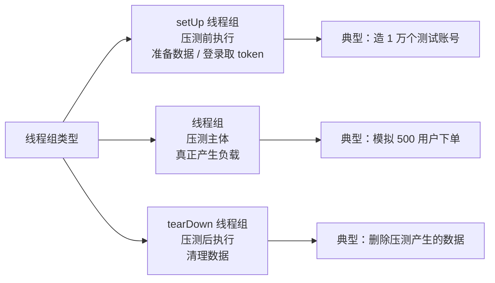

### setUp / tearDown 的执行时机

```mermaid
gantt
    title 三类线程组的执行时序
    dateFormat X
    axisFormat %S
    section 执行
    setUp 线程组（准备）   :0, 10
    线程组（主压测）       :10, 300
    tearDown 线程组（清理）:310, 20
```

- 多个-setUp 线程组之间按顺序执行
- **默认所有线程组并行启动**，若需串行，在测试计划里勾选「独立运行每个线程组（Run Thread Groups consecutively）」
- setUp/tearDown 始终在主线程组之前/之后

**典型用法：全局只登录一次**

```text
setUp 线程组（1 线程，1 循环）
└── 管理员登录请求
    └── JSON 提取器 → 存到 props
        （JSR223: props.put("adminToken", vars.get("token"))）

主线程组（100 线程）
└── 业务请求
    └── 信息头: Authorization = ${__P(adminToken,)}
```

> 这样一个 token 供所有线程复用，避免每次都登录。

## 二、线程组参数详解 {#parameters}

### 参数面板

```text
线程组
├── 线程数（Number of Threads）        ← 虚拟用户数
├── Ramp-Up 时间（秒）                  ← 多久启动完所有线程
├── 循环次数（Loop Count）              ← 每个线程跑几遍
│   └── ☑ 永远（Forever）
├── ☑ 调度器（Scheduler）
│   ├── 持续时间（秒）                   ← 总共跑多久
│   └── 启动延迟（秒）                   ← 延迟多久开始
└── 取样器错误后要执行的动作
    ├── 继续
    ├── 启动下一进程循环
    ├── 停止线程
    ├── 停止测试
    └── 立即停止测试
```

### 参数一：线程数（Number of Threads）

**定义**：模拟的虚拟用户数量，**每个线程独立执行一遍脚本**。

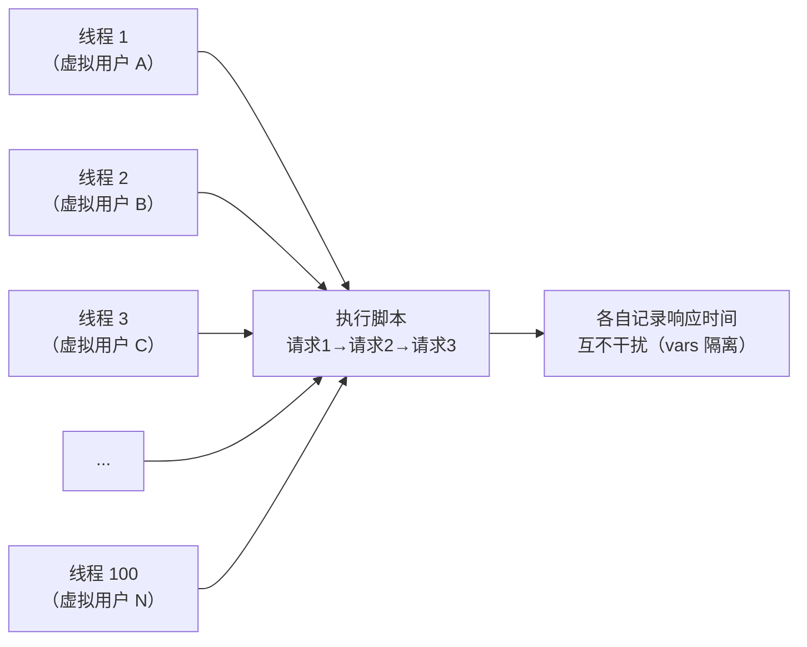

**⚠️ 关键：线程数 ≠ 并发数**

这是最大的误解。真实的「并发数」（同时在处理中的请求数）由 **Little 定律**决定：

```
并发数 = TPS × 平均响应时间
```

举例：

| 线程数 | 平均响应时间 | 实际 TPS | 实际并发（同时在途请求） |
| --- | --- | --- | --- |
| 100 | 100ms | 100 / 0.1 = **1000** | 1000 × 0.1 = **100** |
| 100 | 1000ms（1 秒） | 100 / 1 = **100** | 100 × 1 = **100** |
| 100 | 5000ms（5 秒） | 100 / 5 = **20** | 20 × 5 = **100** |

看出规律了吗？**当线程数固定时，实际并发数恒等于线程数**（因为每个线程在任一时刻最多只有一个请求在途）。但 **TPS 会随着响应时间变慢而暴跌**。

> 所以：
> - **线程数** = JMeter 侧同时运行的「人」的数量
> - **TPS** = 系统实际处理能力 = 线程数 ÷ 响应时间
> - 想提高 TPS，要么加线程，要么优化响应时间

**反过来算**：要压出目标 TPS，需要多少线程？

```
线程数 = 目标 TPS × 预期响应时间（秒）
```

例：目标 500 TPS，预期响应时间 200ms：

```
线程数 = 500 × 0.2 = 100 个线程
```

若响应恶化到 2 秒，同样 100 线程只能压出：

```
TPS = 100 / 2 = 50 TPS   ← 暴跌 10 倍
```

> **这正是「系统变慢 → TPS 下降」的原因**，也是压测中观察性能拐点的基础（第六章详述）。

### 参数二：Ramp-Up 时间

**定义**：所有线程**启动完毕**所需的秒数。

```
Ramp-Up = 10 秒，线程数 = 100
→ 每 0.1 秒启动 1 个线程（10 秒内均匀启动 100 个）
```

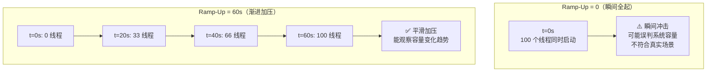

**经验取值**：

| 场景 | Ramp-Up 建议 |
| --- | --- |
| 快速验证脚本 | 1-5 秒 |
| 常规负载测试 | 线程数 / 10 左右（如 100 线程 → 10 秒） |
| 寻找性能拐点 | 线程数 / 5 或更长（慢速加压，观察拐点） |
| 瞬时并发（秒杀） | 0 或很小 + 同步定时器（集合点） |

> **Ramp-Up 太长会怎样**：加压太慢，前期数据没有参考价值，且压测总时长变长。
> **Ramp-Up 太短会怎样**：瞬间冲击，可能直接把系统打死，看不到渐变过程，也无法定位拐点。

### 参数三：循环次数

- **固定次数**：每个线程执行 N 遍脚本后停止。适合「总量固定」的场景（如总共发 10000 个请求）。
- **永远（Forever）**：无限循环，**必须配合调度器的「持续时间」使用**，否则不会自动停止。

```text
✅ 常用组合：循环次数 = 永远 + 调度器持续时间 = 300 秒
   → 100 个线程持续压 5 分钟

✅ 另一种：循环次数 = 10（不勾调度器）
   → 每个线程跑 10 遍就停，总请求数 = 线程数 × 10 × 每轮请求数
```

### 参数四：调度器

| 字段 | 作用 |
| --- | --- |
| 持续时间（秒） | 压测总共跑多久（**最常用**） |
| 启动延迟（秒） | 延迟多久开始（用于错开多个场景，或等待服务预热完成） |

> **注意**：调度器的持续时间**从线程组开始就计时**，包括 Ramp-Up 时间。所以若 Ramp-Up=60s、持续时间=300s，那么满负载的时间实际只有 240 秒。

### 参数五：取样器错误后的动作

| 选项 | 行为 | 适用 |
| --- | --- | --- |
| **继续**（默认） | 出错后继续下一个请求 | 常规压测 |
| 启动下一进程循环 | 跳过本轮剩余请求，进入下一轮 | 业务流程有依赖时 |
| 停止线程 | 当前线程停止 | 该用户的会话已失效 |
| 停止测试 | 等当前迭代结束后停止整个测试 | 发现严重问题时 |
| 立即停止测试 | 立刻中断 | 紧急情况 |

> 一般保持默认「继续」。若登录失败后无 token，后续请求必然全错，可考虑「启动下一进程循环」。

## 三、并发模型：JMeter 是怎么模拟用户的 {#concurrency-model}

### 一个线程 = 一个虚拟用户

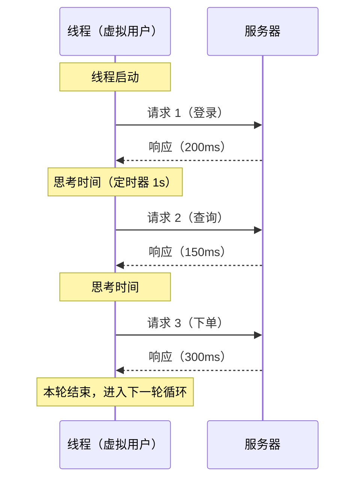

**关键**：线程是**串行**执行脚本的——发完请求 1，等响应，再发请求 2。所以：

- 响应时间越长，线程被占用越久，单位时间能发的请求越少
- 这符合真实用户行为（用户也是看完页面再点下一个）

### 线程数与真实用户数的换算

如果你的业务数据是「日活 10 万，峰值同时在线 5000 人，每人平均 5 分钟操作一次」，要换算成 JMeter 线程数：

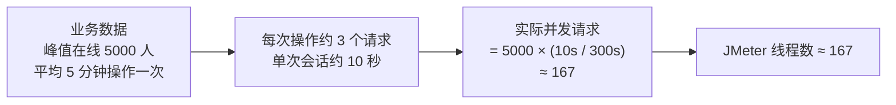

**简化公式**：

```
JMeter 线程数 = 峰值在线用户数 × (用户操作耗时 / 操作间隔)
```

或者更常用的工程做法：**直接用目标 TPS 反推**（见前面的公式）。

## 四、五类压测场景设计 {#scenarios}

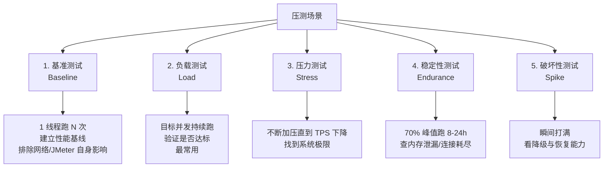

### 场景 1：基准测试（Baseline）

**目的**：在**无并发压力**下测出接口的固有性能，作为后续对比的基线。也用于排除网络延迟、JMeter 自身开销的影响。

| 参数 | 值 |
| --- | --- |
| 线程数 | 1 |
| Ramp-Up | 1 |
| 循环次数 | 100（或持续 60 秒） |
| 定时器 | 无 |

**看什么**：

- 单请求响应时间（如 20ms）
- 如果基线就很慢（如 500ms），说明接口本身有问题，不用加压了，先优化
- 与线上的 APM 数据对比，确认网络链路是否正常

> **基准测试是压测第一步**。很多人上来就 500 并发，结果响应时间 3 秒，却不知道是接口本身慢还是被压垮的。

### 场景 2：负载测试（Load）

**目的**：验证系统在**目标负载**下能否达标。这是最常用的场景。

| 参数 | 值（示例） |
| --- | --- |
| 线程数 | 100（按目标 TPS 反推） |
| Ramp-Up | 30-60 秒 |
| 循环次数 | 永远 |
| 持续时间 | 300-600 秒 |
| 定时器 | 加思考时间（1-3 秒） |

**判断标准**（需提前与业务方确认）：

- 平均响应时间 ≤ 200ms
- P95 ≤ 500ms，P99 ≤ 1000ms
- 错误率 < 0.1%
- TPS 达到目标值

### 场景 3：压力测试（Stress）

**目的**：找到系统的**极限容量**与**性能拐点**。

| 参数 | 值 |
| --- | --- |
| 线程数 | 从低到高逐步增加（阶梯） |
| Ramp-Up | 每档持续 2-5 分钟后加下一档 |
| 持续时间 | 直到 TPS 不再增长或错误率飙升 |

**阶梯加压配置（用 Ultimate Thread Group 插件）**：

```text
Start Threads | Initial Delay | Startup Time | Hold Load | Shutdown Time
     50       |      0        |     30s      |   120s    |      10s
    100       |      0        |     30s      |   120s    |      10s
    200       |      0        |     30s      |   120s    |      10s
    400       |      0        |     30s      |   120s    |      10s
    800       |      0        |     30s      |   120s    |      10s
```

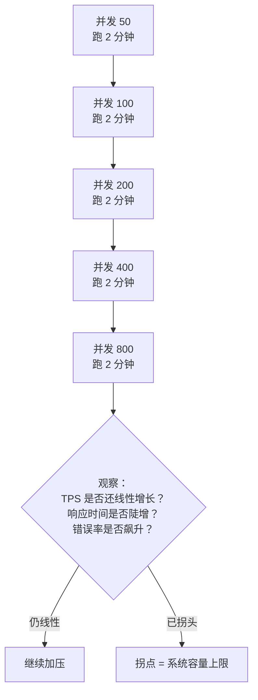

**看什么**：第六章会详细讲**性能拐点**的识别方法。

### 场景 4：稳定性测试（Endurance）

**目的**：长时间运行，发现**内存泄漏、连接池耗尽、磁盘满、日志堆积**等只在长时间才暴露的问题。

| 参数 | 值 |
| --- | --- |
| 线程数 | 峰值容量的 60-80% |
| Ramp-Up | 正常 |
| 持续时间 | **8-24 小时**（至少 4 小时） |

**看什么**：

- 响应时间是否随时间**持续上升**（内存泄漏的典型征兆）
- TPS 是否逐渐下降
- 错误率是否随时间增长
- **服务器监控**：堆内存锯齿是否正常回收、线程数、连接池、磁盘

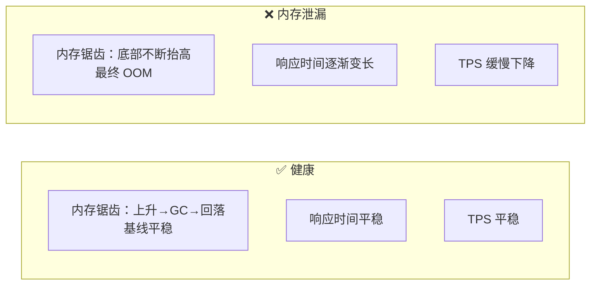

> 稳定性测试**必须配合服务器资源监控**（PerfMon 或 Grafana），否则只能看到「变慢了」，不知道为什么。

### 场景 5：破坏性/尖峰测试（Spike）

**目的**：验证系统**超出极限时**的表现——是优雅降级还是直接崩溃？压力撤除后能否恢复？

| 参数 | 值 |
| --- | --- |
| 线程数 | 瞬间的 2-5 倍峰值 |
| Ramp-Up | **0 或极短**（配合同步定时器） |
| 持续时间 | 短暂（1-5 分钟） |

**看什么**：

- 是否触发限流/熔断/降级
- 错误率峰值与恢复时间
- 压力撤除后，系统多久恢复正常（**恢复能力**比抗压能力更重要）
- 是否有数据不一致、消息堆积

## 五、线程组插件：更灵活的加压 {#plugins}

内置线程组只能「固定线程数 + Ramp-Up」，无法做复杂曲线。安装 **JMeter Plugins Manager** 后可用：

### Stepping Thread Group（步进线程组）

**配置**：

```text
This group will start 100 threads:
First, wait for  10 seconds
Then start       10 threads
Next, add        10 threads every 60 seconds
     using ramp-up 10 seconds
Then hold load for 300 seconds
Finally, stop    10 threads every 10 seconds
```

效果：

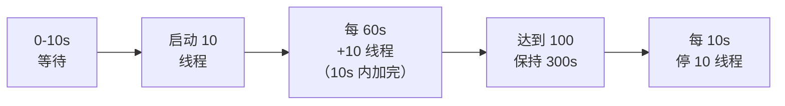

### Ultimate Thread Group（终极线程组）

**最灵活**，用表格定义多段曲线：

| Start Threads | Initial Delay | Startup Time | Hold Load | Shutdown Time |
| --- | --- | --- | --- | --- |
| 50 | 0 | 30 | 120 | 10 |
| 100 | 160 | 30 | 120 | 10 |
| 200 | 320 | 30 | 120 | 10 |

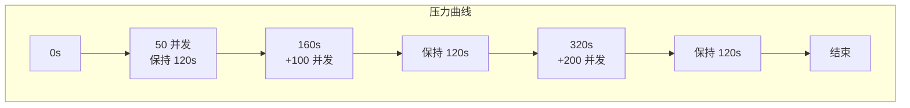

**波浪形压力**（模拟一天中的流量起伏）：

| Start Threads | Initial Delay | Startup Time | Hold Load | Shutdown Time |
| --- | --- | --- | --- | --- |
| 100 | 0 | 60 | 300 | 60 |
| 200 | 420 | 60 | 300 | 60 |
| 50 | 840 | 60 | 300 | 60 |

### Concurrency Thread Group（并发线程组）

与 **吞吐量整形定时器（Throughput Shaping Timer）** 配合使用，能精确控制「目标并发数」而非「线程数」，并自动调整。

> 插件安装：Options → Plugins Manager → Available Plugins → 搜索 `Custom Thread Groups` → 安装 → 重启。

## 六、多场景组合：模拟真实业务配比 {#mixed-scenarios}

真实系统不会只有一种请求。例如电商：

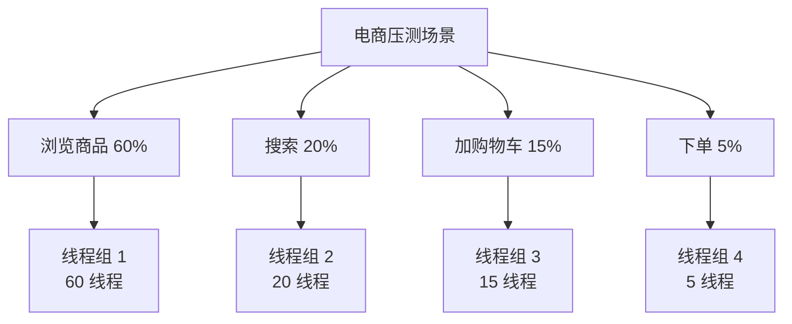

**两种实现方式**：

### 方式一：多个线程组（推荐）

每个业务一个线程组，线程数按比例分配。优点：清晰，可单独看每个业务的性能。

### 方式二：吞吐量控制器

单线程组 + 吞吐量控制器控制各分支比例：

```text
线程组（100 线程）
├── 吞吐量控制器（60%，浏览商品）
│   └── 浏览请求
├── 吞吐量控制器（20%，搜索）
│   └── 搜索请求
├── 吞吐量控制器（15%，加购物车）
│   └── 购物车请求
└── 吞吐量控制器（5%，下单）
    └── 下单请求
```

| 吞吐量控制器模式 | 含义 |
| --- | --- |
| **Percent Executions** | 按执行次数百分比 |
| Total Executions | 总共执行 N 次 |

> 百分比模式下，同一线程会**轮流**进入不同分支，合计 100%。

## 七、场景设计检查清单 {#checklist}

设计完场景后逐项确认：

```text
✅ 压测目标明确（目标 TPS / 响应时间 / 并发数）
✅ 基准测试已完成（知道单请求基线）
✅ 线程数是按目标 TPS 反推的，不是拍脑袋
✅ Ramp-Up 足够长（能观察渐变过程）
✅ 持续时间足够（至少 5 分钟，去掉预热期）
✅ 加了思考时间（贴近真实用户）
✅ 加了断言（否则错误率失真）
✅ 参数化已配置（不能所有用户用同一个账号）
✅ 关联已配置（token 等动态值已提取）
✅ 场景配比符合真实业务
✅ 压测环境与生产配置一致（或明确差异比例）
✅ 已通知相关方（避免压测影响他人）
```

## 小结 {#summary}

- **线程数 ≠ 并发数那么简单**：线程在任一时刻只有一个请求在途，所以「并发数 = 线程数」，但 **TPS = 线程数 ÷ 响应时间**。响应变慢，TPS 立刻下跌。
- **反推公式**：`线程数 = 目标 TPS × 预期响应时间`。要 500 TPS、响应 200ms，就需要 100 线程。
- **Ramp-Up 决定加压节奏**：太短是瞬间冲击，太长前期数据无效。常规取「线程数/10」秒，找拐点用更慢的。
- **循环次数 + 调度器**：常用「永远 + 持续时间 N 秒」。注意持续时间包含 Ramp-Up。
- **五类场景**：基准（1 线程建基线）→ 负载（验证目标）→ 压力（找极限）→ 稳定性（长时间查泄漏）→ 破坏性（看降级恢复）。每类目的不同，参数不同。
- **复杂曲线用插件**：Stepping Thread Group 做步进、Ultimate Thread Group 做任意曲线（含波浪形）。
- **混合场景**：要么多个线程组按比例，要么单组 + 吞吐量控制器。

下一章讲**取样器、参数化与关联**——如何让 100 个虚拟用户用不同的账号登录，以及如何把登录返回的 token 传给后续请求。这是脚本能否真正跑起来的关键。
