# 第四章：取样器、参数化与关联

一个能跑的压测脚本必须解决两个问题：

1. **参数化**：让 100 个虚拟用户用**不同**的数据（不同账号、不同商品 ID），否则测的是缓存命中率 100% 的假象
2. **关联**：把上一个请求的**动态返回值**（如 token、订单号）传给下一个请求

这两个做不好，压测结果毫无意义。

## 一、HTTP 请求取样器 {#http-sampler}

### 基本配置

```text
HTTP 请求
├── 名称：登录接口
├── 协议（Protocol）：https
├── 服务器名称或 IP：api.example.com
├── 端口号：443
├── HTTP 请求方法：POST
├── 路径：/api/v1/login
├── 内容编码：UTF-8
└── 参数 / 消息体数据 / 文件上传
```

### GET 请求：参数放哪

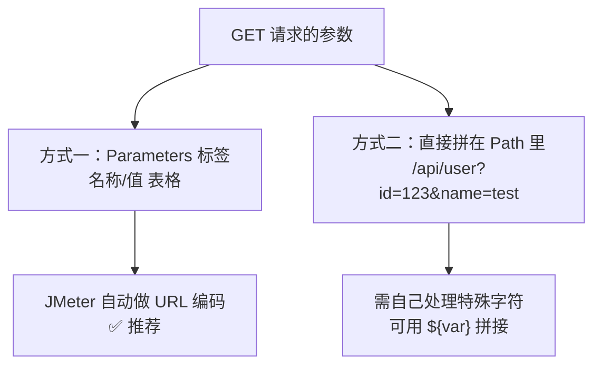

**Parameters 表格**：

| 字段 | 值 | 说明 |
| --- | --- | --- |
| 名称 | `userId` | 参数名 |
| 值 | `${userId}` | 可引用变量 |
| URL 编码？ | ☑ | 中文/特殊字符必须勾 |
| Content-Type | — | GET 时不用填 |

### POST 请求：四种常见格式

#### 1. Form 表单（application/x-www-form-urlencoded）

在 **Parameters** 标签填参数，JMeter 会自动设置 Content-Type。

```
username=test01&password=123456
```

#### 2. JSON（application/json）— 最常用

在 **消息体数据（Body Data）** 里写 JSON，并**必须**加 HTTP 信息头管理器设置 `Content-Type: application/json`：

```json
{
  "username": "${username}",
  "password": "${password}",
  "timestamp": "${__time(yyyyMMddHHmmss)}"
}
```

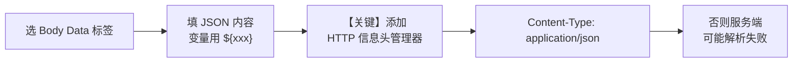

> **新手最常见的坑**：写了 JSON 但没设 Content-Type，服务端按表单解析，报 400 或参数为空。

#### 3. 文件上传（multipart/form-data）

在 **文件上传（Files Upload）** 标签：

| 字段 | 值 |
| --- | --- |
| 文件名称 | `/path/to/test.jpg` |
| 参数名称 | `file`（与后端约定） |
| MIME 类型 | `image/jpeg` |

⚠️ 勾选「Use multipart/form-data for POST」，且**不要**手动加 Content-Type 头（JMeter 会自动带 boundary）。

#### 4. 路径参数（RESTful）

```
/api/order/${orderId}/detail
```

直接把变量写进 Path。

### 高级选项

| 选项 | 用途 |
| --- | --- |
| **跟随重定向** | 自动跟随 3xx 跳转（登录后跳转场景） |
| **自动重定向** | 重定向时不记录中间请求 |
| **使用 KeepAlive** | 复用 TCP 连接（**默认勾选，压测必须开**） |
| **Use multipart/form-data** | 文件上传时勾选 |
| **超时（毫秒）** | 连接超时 / 响应超时 |
| **从 HTML 文件获取所有内含的资源** | 自动下载页面里的图片/CSS/JS（模拟浏览器） |
| **客户端实现** | `HttpClient4`（默认，推荐）或 `Java` |
| **同请求一起发送参数** | 参数直接拼在 URL |

**超时的正确用法**：

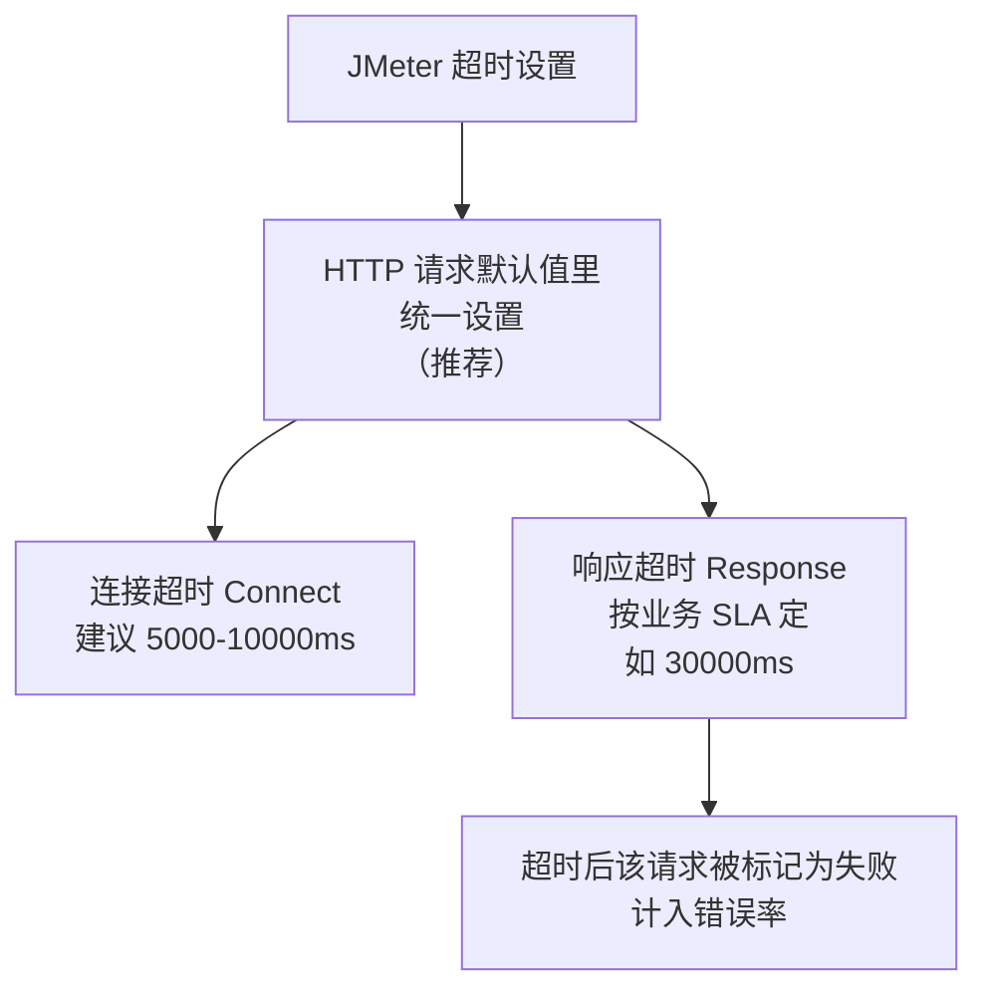

> **不设超时的后果**：服务端卡死时，JMeter 会一直等（默认无限），导致线程全部挂起，压测看起来「很稳」但 TPS 极低——这是极具欺骗性的假象。

### HTTP 请求默认值（强烈推荐）

把公共部分（协议、域名、端口、超时）抽出来，避免每个请求重复填：

```text
线程组
├── HTTP 请求默认值
│   ├── 协议：https
│   ├── 服务器名称：${__P(host,api.example.com)}
│   ├── 端口：443
│   ├── 连接超时：10000
│   └── 响应超时：30000
├── 请求 A（只填路径 /api/login）
└── 请求 B（只填路径 /api/order）
```

**好处**：换环境只改一处（或用 `-Jhost=xxx` 命令行传参）。

### HTTP 信息头管理器

| 常见 Header | 值 |
| --- | --- |
| `Content-Type` | `application/json;charset=UTF-8` |
| `Authorization` | `Bearer ${token}` |
| `User-Agent` | `Mozilla/5.0 ... JMeter` |
| `Accept` | `application/json` |
| `X-Request-Id` | `${__UUID()}` |
| `tenant-id` | `${tenantId}` |

> 放在**线程组下**对所有请求生效；放在某个请求下只对该请求生效。

## 二、其他常用取样器 {#other-samplers}

### JDBC Request（数据库压测）

**第一步**：配置连接池（JDBC Connection Configuration）

```text
JDBC Connection Configuration
├── Variable Name：mysqlDB（★ 后续请求靠这个名字引用）
├── Database URL：jdbc:mysql://host:3306/db?useUnicode=true&characterEncoding=utf8
├── JDBC Driver class：com.mysql.cj.jdbc.Driver
├── Username / Password
├── Max Number of Connections：20（★ 连接池大小，压测时别设太大）
└── Validation Query：SELECT 1
```

> **必须先把数据库驱动 jar（如 `mysql-connector-j-8.x.jar`）放到 `lib/ext/` 并重启 JMeter**。

**第二步**：JDBC Request

```text
JDBC Request
├── Variable Name：mysqlDB（与配置一致）
├── Query Type：Select Statement / Update Statement / Prepared Select
├── SQL：SELECT * FROM orders WHERE user_id = ?
├── Parameter values：${userId}
├── Parameter types：BIGINT
└── Variable names：orderId,amount（把结果列存成变量）
```

**结果使用**：

```
查询返回多行时，变量名会带序号：
orderId_1, orderId_2, orderId_3 ...
orderId_#  = 总行数
引用：${orderId_1}
```

### Java 请求（自定义协议）

适用于压测自研 SDK、RPC 客户端：

1. 写一个类继承 `AbstractJavaSamplerClient`
2. 打成 jar 放 `lib/ext/`
3. 在 JMeter 里选该类

```java
public class MySampler extends AbstractJavaSamplerClient {
    @Override
    public SampleResult runTest(JavaSamplerContext ctx) {
        SampleResult result = new SampleResult();
        result.sampleStart();
        try {
            // 调用你的服务
            String resp = myClient.call();
            result.setSuccessful(true);
            result.setResponseData(resp, "UTF-8");
        } catch (Exception e) {
            result.setSuccessful(false);
            result.setResponseMessage(e.getMessage());
        } finally {
            result.sampleEnd();
        }
        return result;
    }
}
```

### 调试取样器（Debug Sampler）

**排查变量问题的神器**。它会输出当前所有 JMeter 变量的值。

```text
线程组
├── 请求 A
├── 调试取样器          ← 加在这
└── 察看结果树          ← 跑一次看输出
```

输出示例：

```text
JMeterVariables:
token=eyJhbGciOiJIUzI1NiJ9...
userId=10001
orderId=SO20260906001
JMeterProperties:
...
```

> **用完记得删掉或禁用**，否则会污染压测数据。

## 三、参数化：让每个用户用不同数据 {#parameterization}

### 为什么要参数化

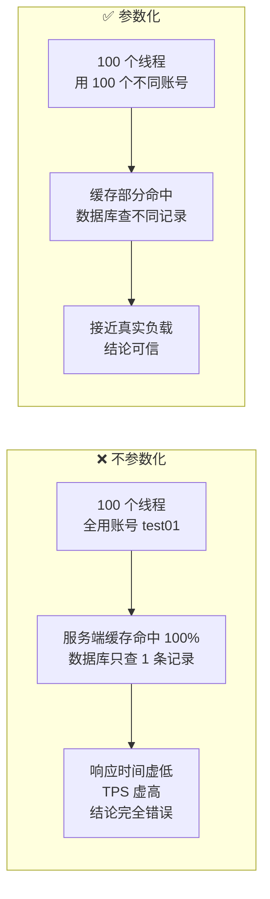

### 方式一：CSV Data Set Config（最常用）

**准备数据文件** `users.csv`：

```csv
username,password,userId
test01,pass123,10001
test02,pass123,10002
test03,pass123,10003
...
test99,pass123,10099
```

**配置**：

```text
CSV Data Set Config
├── 文件名：/data/users.csv（绝对路径，或相对 jmeter 启动目录）
├── 文件编码：UTF-8
├── 变量名称：username,password,userId
├── 分隔符：,
├── 是否允许带引号？：False
├── 遇到文件结束符再次循环？：True（★ 数据不够时循环使用）
├── 遇到文件结束符停止线程？：False
└── 线程共享模式：All threads（★ 见下）
```

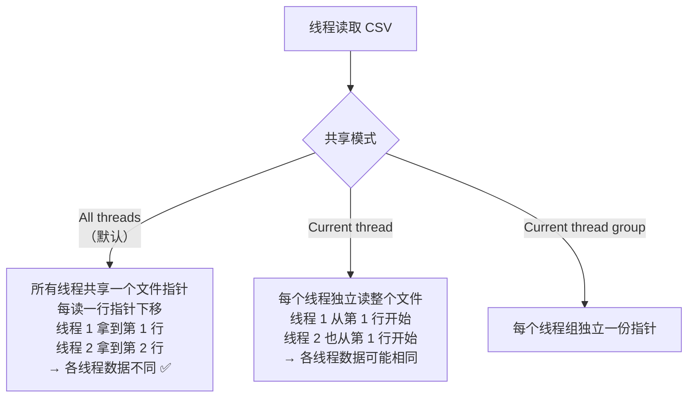

**共享模式选择**：

| 模式 | 场景 |
| --- | --- |
| **All threads**（默认） | 希望每个线程拿到不同数据 → **最常用** |
| Current thread | 每个线程按顺序遍历全部数据（如每个用户要跑完全部商品） |
| Current thread group | 多线程组时，每组独立 |

**循环与停止**：

| 参数组合 | 效果 |
| --- | --- |
| Recycle=True, StopThread=False | 数据读完从头再来，**永不停止**（最常用） |
| Recycle=False, StopThread=False | 读完后变量变成 `<EOF>` |
| Recycle=False, StopThread=True | 读完后线程停止（**数据用尽即停止**，适合固定总量压测） |

> **中文 CSV 乱码**：保存为 UTF-8 编码，且 JMeter 里「文件编码」填 `UTF-8`。Windows 记事本默认 GBK，务必用 Notepad++/VSCode 转码。

### 方式二：用户参数（User Parameters）

适合**数据量小、手工维护**的场景。

```text
用户参数
├── 名称：username    用户_1: test01   用户_2: test02   用户_3: test03
└── 名称：password    用户_1: pass1    用户_2: pass2    用户_3: pass3
```

每列对应一个线程（超过列数后循环取）。

### 方式三：函数助手生成随机值

无需外部文件，**动态生成**。

| 函数 | 作用 | 示例 |
| --- | --- | --- |
| `${__Random(1,10000,)}` | 随机整数 | 随机用户 ID |
| `${__RandomString(8,abcdefghijk,)}` | 随机字符串 | 随机昵称 |
| `${__UUID()}` | UUID | 请求唯一标识 |
| `${__time(yyyyMMddHHmmss,)}` | 当前时间 | 时间戳 |
| `${__timeShift(,,,)}` | 时间偏移 | 相对时间 |
| `${__threadNum}` | 线程号 | 区分用户 |
| `${__counter(TRUE,)}` | 递增计数器 | 全局/线程内序号 |
| `${__RandomDate(,,,)}` | 随机日期 | 生日/时间范围 |
| `${__digest(MD5,...,)}` | 摘要 | 签名 |
| `${__machineIP()}` | 机器 IP | 分布式标识 |

**使用方式**：

1. 菜单栏 → 工具 → **函数助手对话框**
2. 选择函数，填参数，点「生成」
3. 复制生成的字符串粘贴到需要的地方

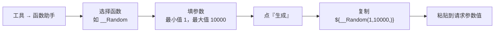

**典型组合用法**：

```
# 唯一订单号：时间戳 + 线程号 + 随机数
orderNo = ${__time(yyyyMMddHHmmss,)}_${__threadNum}_${__Random(1000,9999,)}

# 唯一用户名
username = user_${__time(yyyyMMdd,)} _${__threadNum}

# 手机号（随机 11 位，1 开头）
phone = 1${__Random(3000000000,9999999999,)}
```

### 方式四：计数器（Counter）

```text
计数器
├── Starting value：1
├── 递增：1
├── Maximum value：1000000
├── 数字格式：00000（可选，补零）
├── 引用名称：orderSeq
├── ☑ 与每用户独立的跟踪计数器（每个线程独立计数）
└── ☐ 在每个线程组迭代上重置计数器
```

### 方式五：随机变量（Random Variable）

```text
随机变量
├── 变量名称：randomAge
├── 输出格式：0
├── 最小值：18
├── 最大值：65
├── 种子：（可选，固定种子可复现）
└── ☑ 每线程(用户)独立：True
```

### 参数化方式对比

| 方式 | 数据来源 | 适用 | 优点 | 缺点 |
| --- | --- | --- | --- | --- |
| **CSV Data Set** | 外部文件 | **账号/商品等固定数据集** | 数据可控、可复用 | 需准备文件 |
| 用户参数 | 界面配置 | 少量固定值 | 简单 | 不适合大量数据 |
| **函数助手** | 动态生成 | **随机值/时间戳/UUID** | 无需文件 | 不可控、不可复现 |
| 计数器 | 自增 | 序号、唯一 ID | 保证唯一 | 只有数字 |
| 随机变量 | 随机 | 数值范围 | 简单 | 功能单一 |
| JSR223 | 脚本生成 | 复杂逻辑 | 最灵活 | 有性能开销 |

> **最佳实践**：**账号类用 CSV**（保证存在且真实），**唯一 ID 类用函数/计数器**（保证不重复）。两者常结合使用。

## 四、关联：提取动态数据 {#correlation}

### 什么是关联

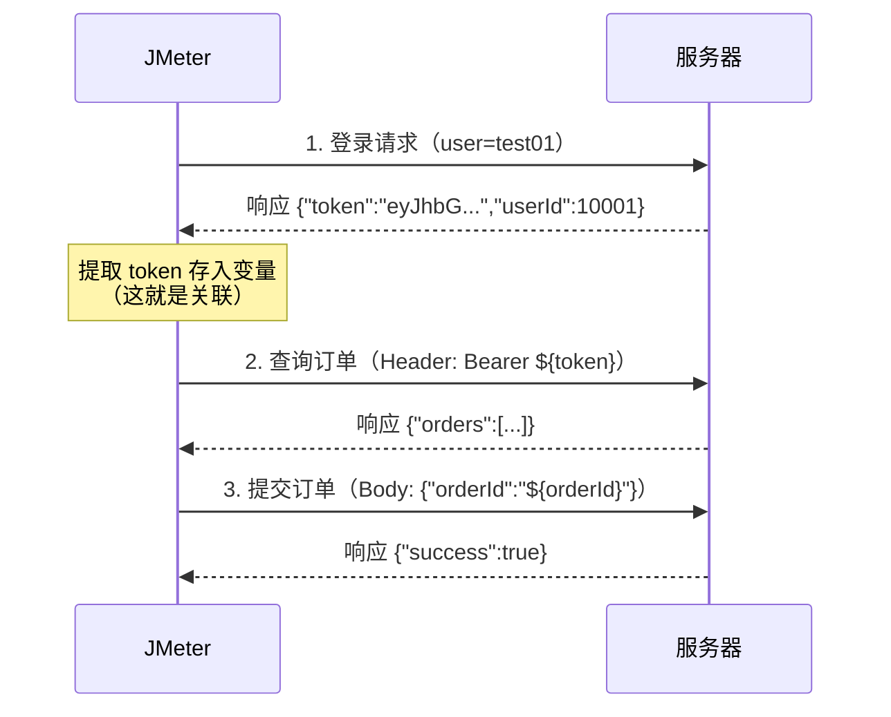

**必须关联的数据**：token/sessionId、订单号、验证码、动态 URL 参数、任何「服务端生成、后续要用」的值。

### 提取器一：JSON 提取器（推荐）

**适用**：响应是 JSON 格式。

```text
JSON 提取器
├── 引用名称：token
├── JSON Path 表达式：$.data.token
├── 匹配数字：1（0=随机，1=第一个，-1=全部）
├── 默认值：NOT_FOUND（可选，取不到时用）
└── Compute concatenation var：False
```

**JSON Path 语法**：

```json
{
  "code": 0,
  "message": "success",
  "data": {
    "token": "eyJhbGciOi...",
    "user": {
      "id": 10001,
      "name": "张三"
    },
    "orders": [
      {"orderId": "SO001", "amount": 99.5},
      {"orderId": "SO002", "amount": 150.0}
    ]
  }
}
```

| 表达式 | 取值 |
| --- | --- |
| `$.code` | `0` |
| `$.data.token` | `eyJhbGciOi...` |
| `$.data.user.id` | `10001` |
| `$.data.orders[0].orderId` | `SO001` |
| `$.data.orders[*].orderId` | 所有 orderId（配合 `-1`） |
| `$..orderId` | 递归查找所有 orderId |
| `$.data.orders[?(@.amount>100)].orderId` | 金额>100 的订单号 |

**匹配数字**：

| 值 | 行为 |
| --- | --- |
| `1` | 取第 1 个匹配（最常用） |
| `0` | 随机取一个 |
| `-1` | 取全部，变量变成 `token_1`、`token_2`...，`token_matchNr` 是总数 |
| `N` | 取第 N 个 |

**验证 JSON Path**：可以在 JMeter 的**察看结果树**里，响应数据标签页选「JSON Path Tester」直接测试表达式。

### 提取器二：正则表达式提取器

**适用**：任意文本（HTML、非结构化响应、JSON 也能用但不如 JSON 提取器直观）。

```text
正则表达式提取器
├── 引用名称：token
├── 正则表达式："token":"(.+?)"
├── 模板：$1$
├── 匹配数字：1
└── 默认值：NOT_FOUND
```

**正则语法要点**：

| 符号 | 含义 |
| --- | --- |
| `(.+?)` | **非贪婪**匹配任意字符（最常用） |
| `(.*?)` | 非贪婪匹配（含空） |
| `([0-9]+)` | 纯数字 |
| `([a-zA-Z0-9_-]+)` | 字母数字下划线 |
| `\d` | 数字 |
| `\w` | 单词字符 |
| `()` | 捕获组，要提取的部分 |
| `$1$` | 模板，取第 1 个捕获组 |
| `$2$` | 取第 2 个捕获组 |

**实战例子**：

```text
响应：<input type="hidden" name="csrf" value="abc123xyz">
正则：name="csrf" value="(.+?)"
提取：$1$ → abc123xyz

响应：{"token":"eyJhbGciOiJIUzI1NiJ9.xxx.yyy"}
正则："token":"(.+?)"
提取：$1$ → eyJhbGciOiJIUzI1NiJ9.xxx.yyy

响应：Location: /order/detail?orderId=SO20260906001
正则：orderId=(\w+)
提取：$1$ → SO20260906001
```

> **性能提示**：正则表达式提取器比 JSON 提取器慢（尤其响应体大时）。能用 JSON 提取器就别用正则。

### 提取器三：边界提取器（Boundary Extractor）

**性能最好**，适合简单左右边界明确的场景。

```text
边界提取器
├── 引用名称：token
├── 左边界："token":"
├── 右边界："
├── 匹配数字：1
└── 默认值：NOT_FOUND
```

比正则快（无正则引擎开销），推荐在大数据量压测时使用。

### 提取器四：XPath 提取器

**适用**：XML / HTML 响应。性能较差，能用其他方式就别用。

```text
XPath 提取器
├── 引用名称：sessionId
├── XPath query：//input[@name='sessionId']/@value
└── 匹配数字：1
```

### 提取器对比

| 提取器 | 适用 | 性能 | 推荐度 |
| --- | --- | --- | --- |
| **JSON 提取器** | JSON 响应 | 好 | ★★★ 首选 |
| **边界提取器** | 简单左右边界 | **最好** | ★★★ 大数据量时 |
| 正则表达式 | 任意文本 | 中 | ★★ 万能但慢 |
| XPath | XML/HTML | 差 | ★ 不得已 |

### 完整关联实战：登录 → 下单

**脚本结构**：

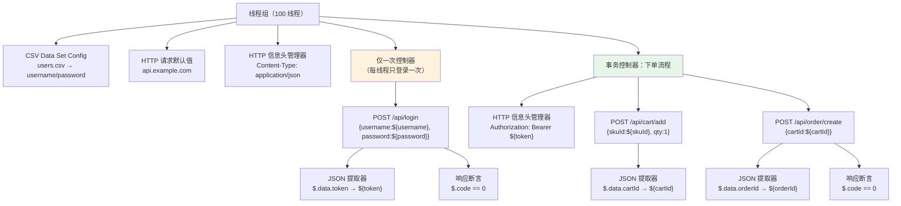

**关键点**：

1. **登录放「仅一次控制器」里**：每个线程只在第一轮登录，后续循环复用 token（真实用户行为）。否则每轮都登录，压测的是登录接口而非业务。
2. **token 提取器挂在登录请求下**（作为子节点），不是放线程组下。
3. **第二个信息头管理器**挂在事务控制器下，只作用于业务请求，带上 token。

### 关联失败的排查

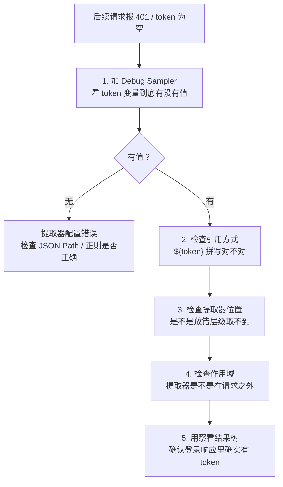

**常见原因**：

| 现象 | 原因 | 解决 |
| --- | --- | --- |
| token 一直为空 | JSON Path 写错 | 用 JSON Path Tester 验证 |
| token 为空字符串 | 登录失败了 | 看登录请求响应，可能账号密码错 |
| 第一轮有值后续没有 | 提取器放错位置（被覆盖） | 提取器挂在登录请求下 |
| 变量显示 `${token}` 字面量 | 变量确实不存在 | 检查变量名大小写 |
| 401 未授权 | Header 格式不对 | 确认是 `Bearer ${token}` 还是直接 `${token}` |

## 五、Cookie 与 Session 管理 {#cookie}

### HTTP Cookie 管理器

**作用**：自动接收、存储、发送 Cookie，**模拟浏览器会话**。

```text
线程组
└── HTTP Cookie 管理器
    ├── Cookie 策略：standard / netscape / compatibility（默认 standard）
    ├── ☑ 每次反复清除 Cookies？（每轮迭代清 Cookie）
    └── 用户定义的 Cookie（可手工添加）
```

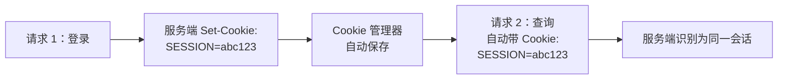

**重要特性**：

- 每个线程（虚拟用户）有**独立的 Cookie 存储**，互不干扰 ✅
- 只要加了这个元件（保持默认配置即可），JMeter 会自动处理
- 放在线程组下，对所有请求生效

| 选项 | 建议 |
| --- | --- |
| 每次反复清除 Cookies？ | 若每轮要重新登录 → 勾选；若复用会话 → 不勾 |

### Session 的两种机制

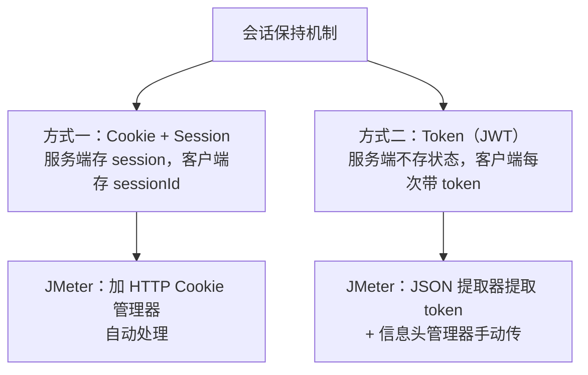

### HTTP 缓存管理器

模拟浏览器的缓存行为（不重复请求已缓存的静态资源）。

> 压测纯接口时一般不需要；压测「模拟浏览器完整加载页面」场景时才用。

### HTTP 授权管理器

用于 Basic/Digest 认证：

```text
HTTP 授权管理器
├── Base URL：https://api.example.com
├── 用户名：admin
├── 密码：123456
├── 域：（Digest 认证时填）
├── Realm：（可选）
└── Mechanism：BASIC_DIGEST / BASIC / DIGEST / KERBEROS
```

## 六、参数化与关联的最佳实践 {#best-practices}

```text
✅ 参数化：
  · 账号/商品等真实数据用 CSV，数据量建议 ≥ 并发数的 2 倍
  · 唯一 ID（订单号、请求号）用函数动态生成，避免主键冲突
  · CSV 文件编码统一 UTF-8
  · CSV 共享模式默认 All threads，让各线程拿不同数据
  · 数据不够时开启 Recycle（循环使用）
  · 用户名/手机号等唯一约束字段必须保证不重复

✅ 关联：
  · 优先用 JSON 提取器，其次边界提取器，最后正则
  · 提取器必须挂在"产生该数据的请求"下作为子节点
  · 设置默认值（如 NOT_FOUND），便于快速发现关联失败
  · 登录放"仅一次控制器"，避免每轮重复登录
  · 用 Debug Sampler 验证变量是否正确提取

✅ 通用：
  · 用「HTTP 请求默认值」抽离域名/端口/超时
  · 用「用户定义的变量」管理环境配置
  · 变量名有意义：token / orderId / userId
  · 调试完删除 Debug Sampler 与察看结果树
```

## 小结 {#summary}

- **HTTP 请求**：GET 参数用 Parameters 表格；POST JSON 必须写 Body Data **并设 Content-Type**；超时一定要配（否则线程挂起产生假象）。
- **参数化四种方式**：CSV Data Set（真实数据集，最常用）、用户参数（少量）、函数助手（动态生成随机值/时间戳/UUID）、计数器（唯一序号）。**账号用 CSV，唯一 ID 用函数**。
- **关联四种提取器**：JSON 提取器（首选）、边界提取器（最快）、正则（万能）、XPath（XML）。提取器必须挂在目标请求**下**。
- **JSON Path**：`$.data.token` 取嵌套、`$.orders[0].id` 取数组、`$..id` 递归。匹配数字 `1` 取第一个、`-1` 取全部。
- **Cookie 管理器**：加上就自动管理会话，每个线程独立存储，不会互相污染。
- **登录放「仅一次控制器」**：每个线程只在首轮登录，后续复用 token，才符合真实用户行为。

下一章讲**逻辑控制器、断言与定时器**——如何编排复杂的业务流程、如何判断请求是否真的成功、如何控制请求的节奏与并发强度。
