# 第五章 逻辑控制器、断言与定时器

写一个简单脚本,线程组 + HTTP 请求就够了。但真实业务是**有顺序、有分支、有重复、有前置依赖**的——这就需要**逻辑控制器**来编排。

脚本跑完后,你还要回答两个问题:**请求真的成功了吗**(用断言)、**节奏对不对**(用定时器)。

本章把"控制器 + 断言 + 定时器"这三件套讲透。

## 本章知识点地图

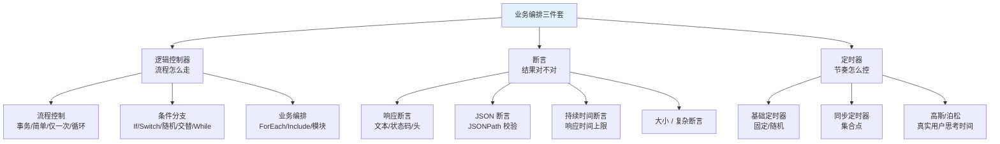

## 5.1 逻辑控制器总览

### 5.1.1 什么是逻辑控制器

**逻辑控制器**(Logic Controller)用来控制**取样器的执行顺序与条件**。它本身不发送请求,但能改变子节点的执行方式。

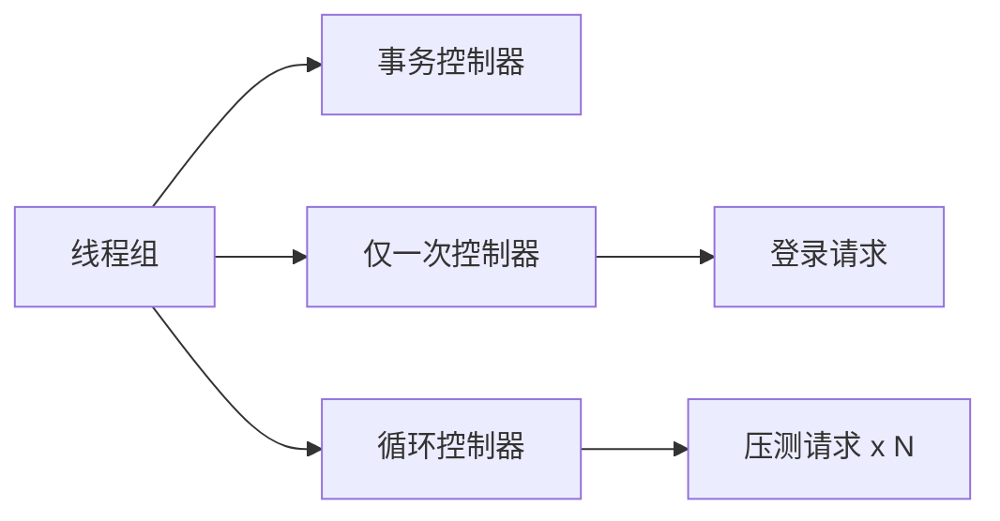

### 5.1.2 控制器的作用域

**重要规则**:控制器只影响**直接子节点**的执行,不会跨级。子节点可以是取样器,也可以是**另一个控制器**。

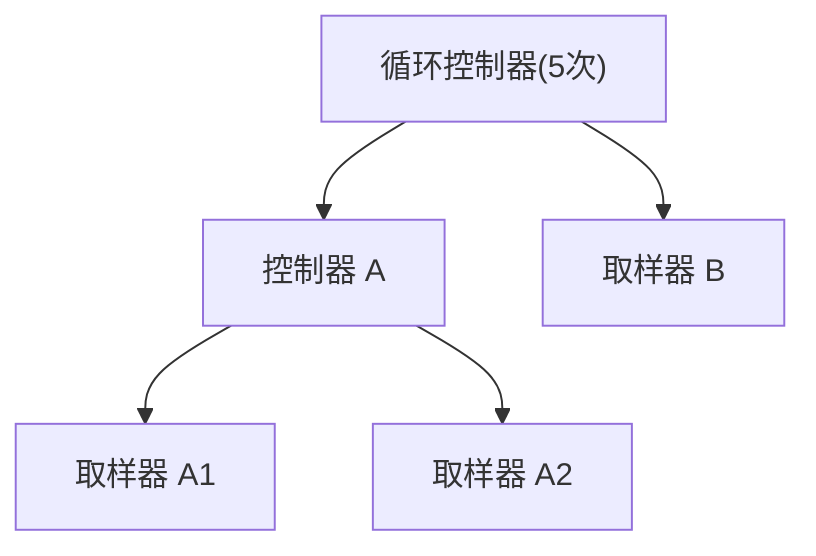

上图中:**A1、A2 各执行 5 次,B 执行 5 次**(都被循环控制)。

### 5.1.3 控制器分类速查表

| 类别 | 控制器 | 作用 |
|------|--------|------|
| **流程控制** | 简单控制器 | 仅作为分组容器 |
| | 事务控制器 | 把多个请求合并为一个"事务"统计 |
| | 仅一次控制器 | 每个线程只执行一次 |
| | 循环控制器 | 子节点循环 N 次 |
| | 交替控制器 | 子节点交替出现 |
| | 随机控制器 | 每次随机选一个子节点执行 |
| | 随机顺序控制器 | 子节点随机顺序全部执行一次 |
| **条件分支** | If 控制器 | 满足条件才执行 |
| | Switch 控制器 | 按变量值选分支 |
| | While 控制器 | 条件为 true 时循环 |
| | 交错控制器 | 按比例分布分支(插件) |
| **业务编排** | ForEach 控制器 | 遍历变量集合 |
| | Include 控制器 | 引入外部 jmx 片段 |
| | Module Controller | 运行时切换到指定片段 |
| | Runtime Controller | 控制运行时长 |

## 5.2 流程控制类控制器

### 5.2.1 简单控制器

**作用**:只起分组作用,不影响执行逻辑。

**适用场景**:把多个相关请求归类,便于阅读。

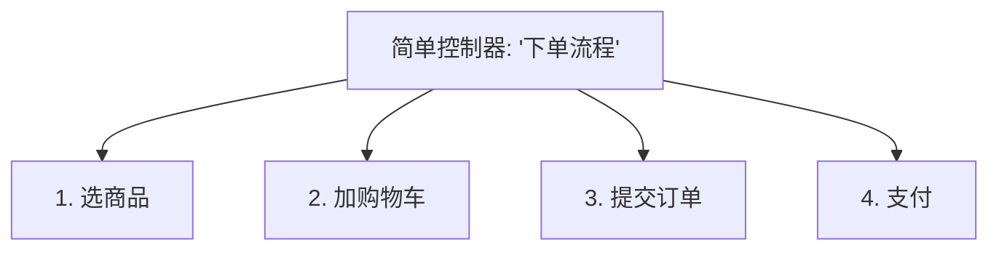

### 5.2.2 事务控制器

**作用**:把多个请求合并为一个"事务",**聚合报告里以合并后的耗时和 TPS 显示**。

**为什么需要**:用户真正关心的是「下单花了多久」,不是「选商品 50ms + 加购物车 80ms + ... 」。

**配置**:
- `Generate parent sample`:勾选后,父事务的样本会出现在报告里
- `Include duration of timer and pre/post processors`:是否把定时器、预处理时间算入事务耗时

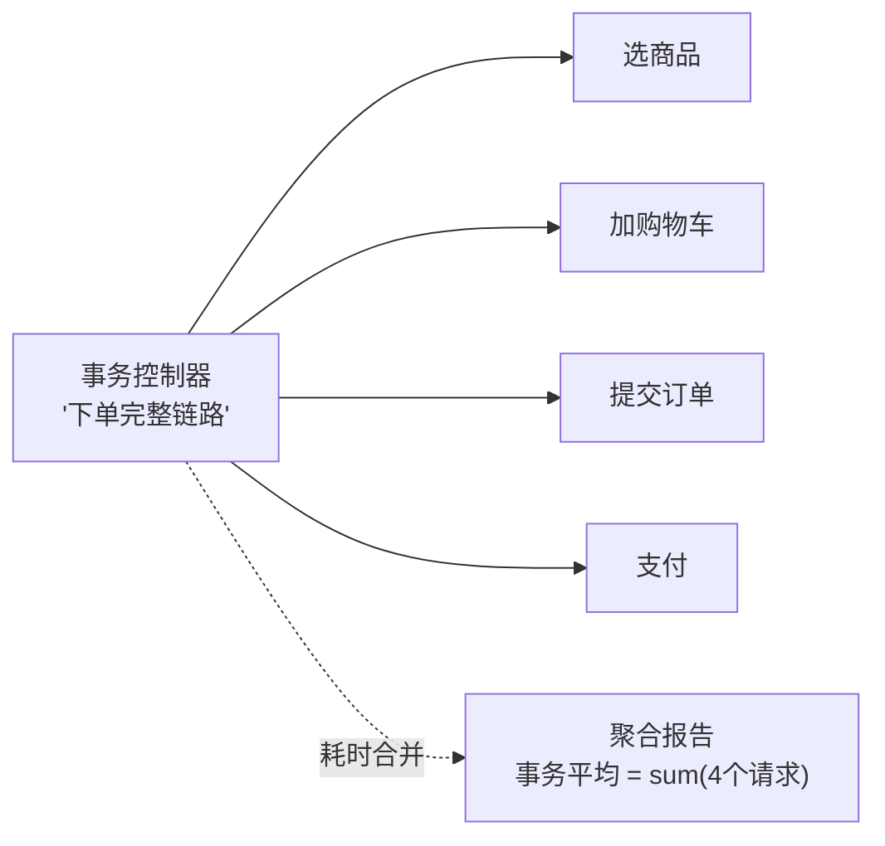

**典型用法**:

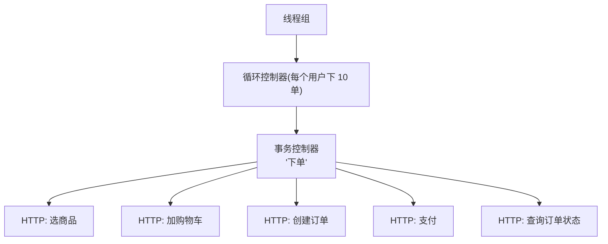

### 5.2.3 仅一次控制器

**作用**:每个**线程**只执行一次内部子节点。

**典型场景**:**登录一次,后续所有请求复用 token**。

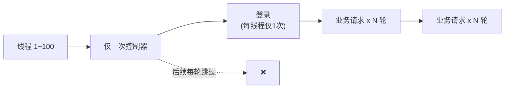

**坑点**:
- 如果线程组设置为**永远循环**(`Loop Count = Forever`),「仅一次控制器」里的子节点**仍只执行一次**——因为作用域是"线程级",不是"迭代级"。
- 想每轮都重新登录?用**循环控制器**+ **If 控制器**配合,或干脆不放进仅一次。

### 5.2.4 循环控制器

**作用**:把子节点执行 N 次。

**两种用法**:
- **固定次数**:`Loop Count = 10` → 跑 10 次
- **永久循环**:`Loop Count = Forever` + 配合 `Break Condition`(如 While 控制器跳出)

**与线程组循环次数的关系**:

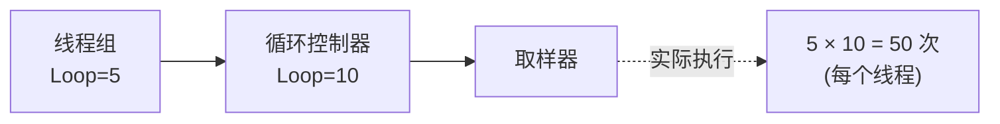

**线程组循环 5 次 × 循环控制器循环 10 次 = 每个线程跑 50 次**(累乘)。

### 5.2.5 交替控制器与随机控制器

**交替控制器**:子节点**轮流**执行——第 1 次跑 A,第 2 次跑 B,第 3 次跑 A...

**随机控制器**:每次随机选**一个**子节点执行。

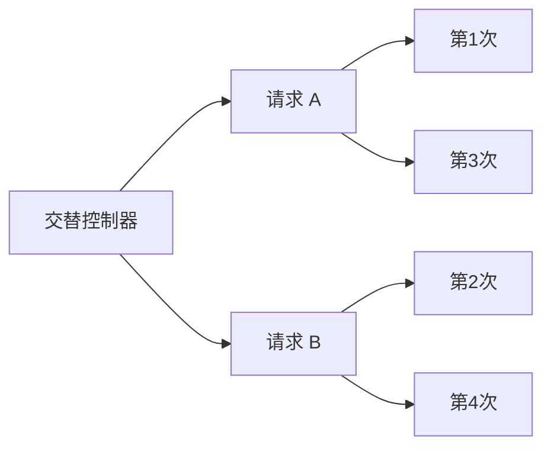

**适用场景**:模拟不同用户走不同分支,比如 50% 用户用支付宝、50% 用微信。

### 5.2.6 随机顺序控制器

**作用**:每次把**所有子节点**执行一遍,但**顺序随机**。

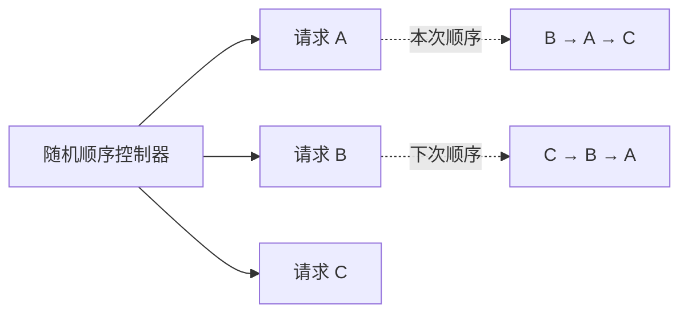

**用途**:测试接口顺序依赖、竞态条件。

## 5.3 条件分支类控制器

### 5.3.1 If 控制器

**作用**:**条件为 true 时**才执行子节点。

**配置示例**(`${__jexl3(...)}` 或 `${__javaScript(...)}`):

```text
"${JMThreadLast}" == "false"
```

**典型场景**:**首次轮次跳过某些前置请求**(如首次已经登录,后续轮次无需再登录)。

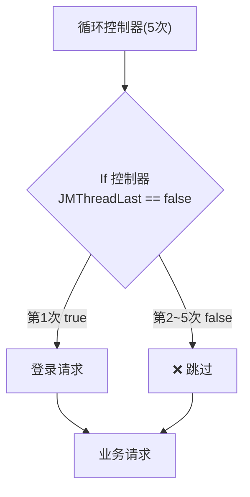

### 5.3.2 Switch 控制器

**作用**:根据**变量值**跳转到对应分支。

**配置**:Switch Value 填变量名 `${switchVar}`,子节点命名为数字 `1`、`2`、`3`...

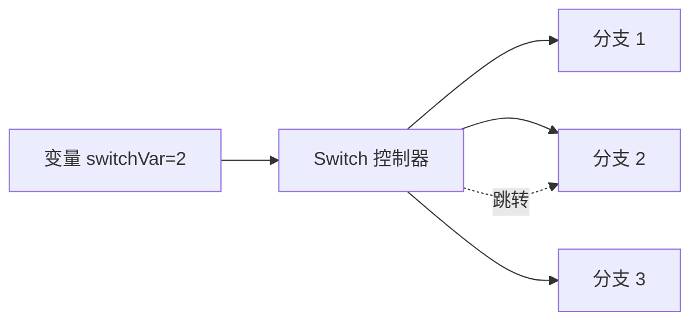

**适用场景**:从 CSV 数据集读 `payType=1/2/3` 走不同支付方式。

### 5.3.3 While 控制器

**作用**:**条件为 true 时**一直循环。

**配置**:`Condition (function or variable)` 填表达式,留空 = 永远循环。

**典型用法**:轮询任务直到状态变更:

```text
Condition: ${taskStatus} != "DONE"
```

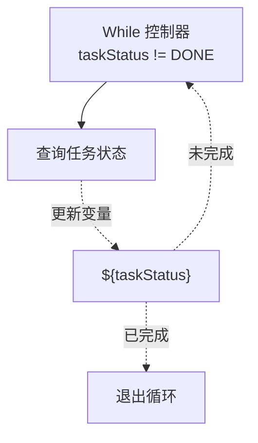

**坑点**:必须有跳出条件,否则死循环压垮服务器。

### 5.3.4 条件分支对比

| 控制器 | 触发条件 | 跳出机制 |
|--------|----------|----------|
| **If** | 进入前判断一次 | — |
| **Switch** | 根据变量选分支 | — |
| **While** | 进入前判断循环 | 内部更新变量改变条件 |
| **ForEach** | 遍历变量集合 | 自动遍历完即退出 |

## 5.4 业务编排类控制器

### 5.4.1 ForEach 控制器

**作用**:**遍历** JSON 提取器或正则提取器返回的**变量集合**(如 `orderId_1`、`orderId_2`、`orderId_3`...)。

**配置**:
- `Input variable prefix`:变量前缀,如 `orderId_`
- `Start index for loop`:从 0 还是 1 开始
- `End index for loop`:0 = 自动取所有
- `Output variable name`:循环变量,内部用 `${outputVar}` 引用

**典型场景**:压测「批量订单查询」接口——从上一个接口拿到 N 个订单 ID,逐个查询。

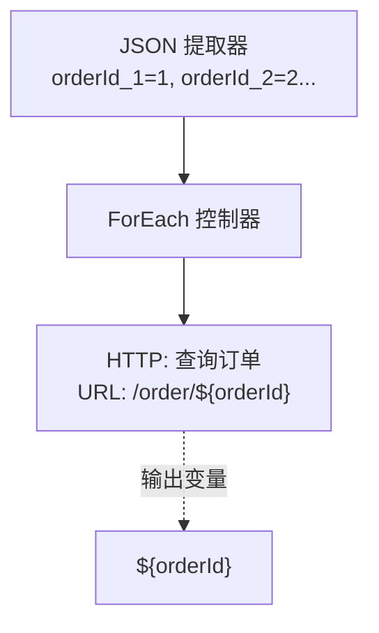

### 5.4.2 Include 控制器

**作用**:把**外部 jmx 文件片段**插入到当前位置。

**用途**:**模块化**——把"登录"、"通用 Header"、"业务签名"等做成可复用片段。

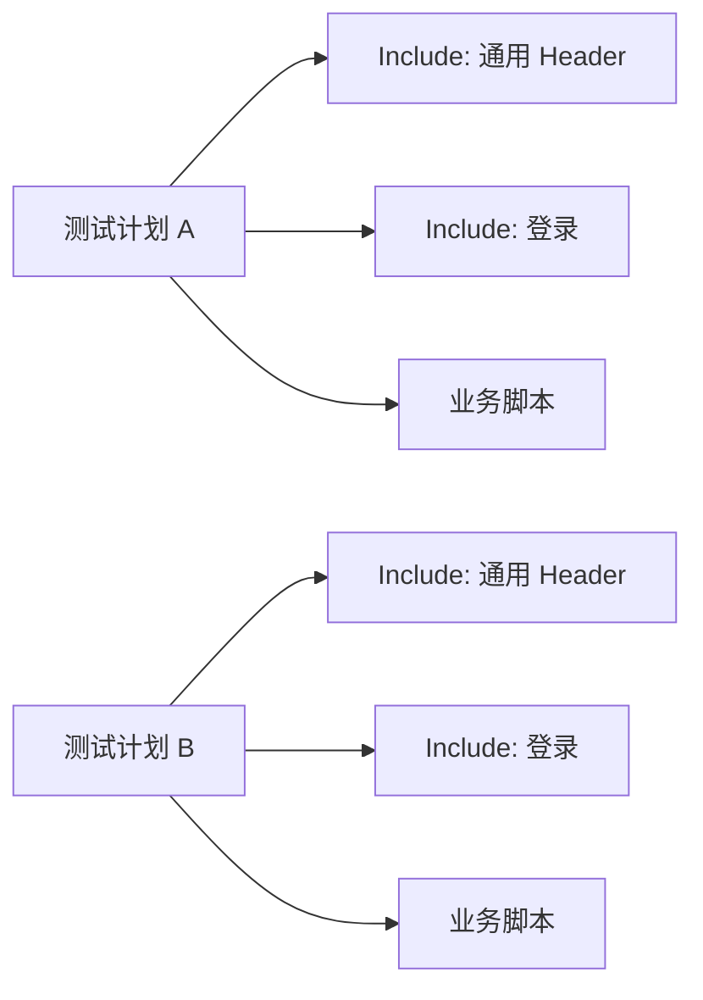

### 5.4.3 Module Controller

**作用**:**运行时**切换到指定的简单控制器或事务控制器。

**与 Include 的区别**:
- **Include**:**编译时**拼装(脚本启动时就把外部 jmx 内容引入)
- **Module Controller**:**运行时**按需跳转(脚本运行期间动态切换)

**典型用法**:**A/B 测试**——同一线程中,一部分用户走 A 流程,另一部分走 B 流程。

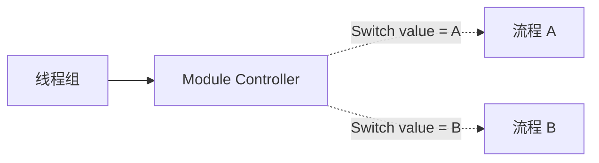

## 5.5 断言总览

### 5.5.1 为什么需要断言

**没有断言的压测 = 自欺欺人**。HTTP 状态 200 不代表业务成功——接口可能返回 200 但 body 是 `{"code": 500, "msg": "服务异常"}`。

**断言 = 业务的"真假"判断**。

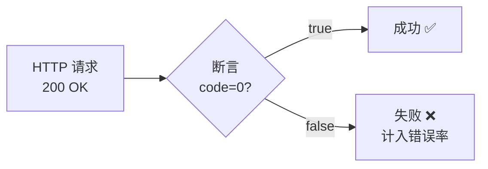

### 5.5.2 断言作用域

**断言只作用于同级和子级的取样器**。放在线程组下 → 全局生效;放在某个请求下 → 仅该请求生效。

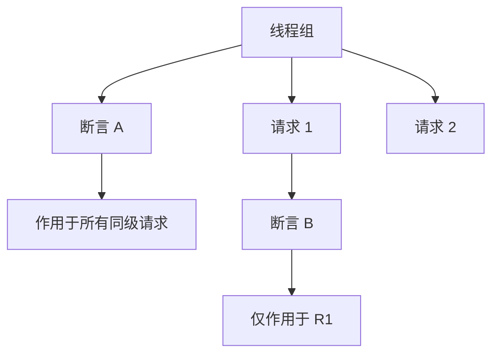

### 5.5.3 常用断言速查表

| 断言 | 适用场景 | 验证内容 |
|------|----------|----------|
| **响应断言** | 通用 | 文本 / 状态码 / 响应头 / 响应码 |
| **JSON 断言** | REST API | JSONPath 表达式取值 |
| **持续时间断言** | 性能 | 响应时间阈值 |
| **大小断言** | 内容校验 | 字节数范围 |
| **BeanShell 断言** | 复杂逻辑 | 自定义 JavaScript/Groovy 脚本 |
| **XPath 断言** | XML 接口 | XPath 表达式 |
| **HTML 断言** | Web 页面 | 标签/属性 |
| **MD5Hex 断言** | 文件下载 | 校验下载内容完整性 |
| **SMIME 断言** | 安全 | 邮件签名校验 |

### 5.5.4 断言失败的影响

**断言失败 = 该请求标记为失败**,但:
- **不会**中断线程(线程继续跑)
- **不会**影响其他请求
- **会**计入聚合报告的**错误率**

## 5.6 响应断言

### 5.6.1 配置详解

**响应断言**(Response Assertion)是最通用的断言,可以校验:

| 字段 | 说明 |
|------|------|
| **Apply to** | Main sample only / Sub-samples / Both |
| **Field to Test** | 响应文本/响应代码/响应信息/响应头/URL/请求数据 |
| **Pattern Matching Rules** | Contains / Matches / Equals / Substring |
| **Patterns to Test** | 待匹配内容(支持正则) |

### 5.6.2 典型用法

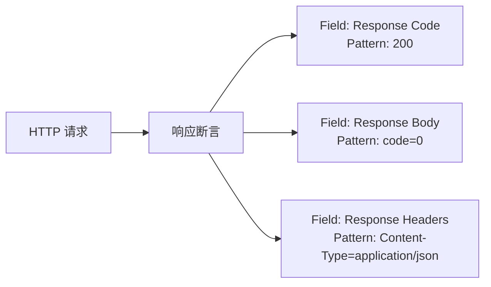

### 5.6.3 状态码与业务码区别

**常见误区**:HTTP 200 + 业务码 500。

```text
HTTP/1.1 200 OK
Content-Type: application/json

{"code": 500, "msg": "内部错误", "data": null}
```

**响应断言配置**:
- 勾选 `Ignore Status`(关键!)——JMeter 默认 HTTP 非 2xx/3xx 会直接标红,这里要忽略 HTTP 状态,改用 body 断言。
- Field: `Response Text`
- Pattern: `"code":0` 或 `"code":0,"msg":"成功"`(双引号要转义)

### 5.6.4 多模式匹配

**模式之间是 OR 关系**——任一匹配就算通过。

**想要 AND**?加**多个响应断言**(每个断言一种条件)。

## 5.7 JSON 断言

### 5.7.1 为什么首选 JSON 断言

REST API 返回 JSON 时,**JSON 断言**比"响应断言 + Contains `"code":0`"更可靠:
- 严格的 JSONPath 解析,避免误判(如 `"code": 100"` 包含 `"code":1` 这种假阳性)。
- 可直接断言**布尔/数字/空值**(响应断言做不了)。

### 5.7.2 JSON Assertion 配置

| 配置 | 说明 |
|------|------|
| **Assert JSON Path exists** | 路径必须存在 |
| **Additionally assert value** | 勾选后可断言值 |
| **Expected value** | 期望值(字符串比较) |
| **Match as regular expression** | 用正则匹配值 |
| **Expected null value** | 期望值为 null |
| **Invert assertion** | 反向断言(值不存在) |

### 5.7.3 典型示例

```json
{"code": 0, "msg": "success", "data": {"userId": 1001, "balance": 99.5}}
```

| 断言 | 配置 |
|------|------|
| code 等于 0 | `$.code`, value = `0` |
| msg 等于 success | `$.msg`, value = `success` |
| userId 存在 | `$.data.userId`, 仅勾选 exists |
| balance 大于 0 | 用正则 `"^([1-9]\\d*\\|\\d+\\.\\d+)$"`,或换 BeanShell |
| data 不为空 | `$.data`, exists |

### 5.7.4 嵌套数组路径

```json
{"code": 0, "data": {"orders": [{"id": 1}, {"id": 2}, {"id": 3}]}}
```

- 取第一个订单 ID:`$.data.orders[0].id`
- 断言数组长度=3:`$.data.orders`, 但 JSON 断言不支持 size,需要 BeanShell。

## 5.8 持续时间断言

### 5.8.1 作用

**断言响应时间**不超过指定阈值。

**配置**:`Apply to` + `Duration in milliseconds`

### 5.8.2 典型用法

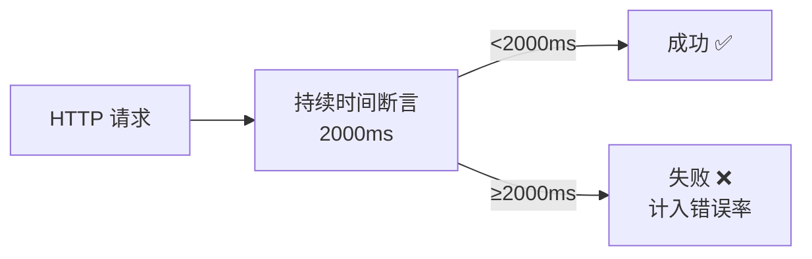

### 5.8.3 与性能阈值的区别

| | 持续时间断言 | 聚合报告里的 P99 |
|---|--------------|------------------|
| **作用** | 每条样本是否超时 | 整体统计的分位数 |
| **粒度** | 单请求 | 整体 |
| **用途** | 标记业务"是否合格" | 评估"性能水平" |

**两者配合使用**:持续时间断言保证业务底线,聚合报告衡量性能等级。

### 5.8.4 实战组合

**推荐配置**(核心接口):
- **响应断言**:HTTP 200 + body 含 `"code":0`
- **JSON 断言**:业务字段校验
- **持续时间断言**:`Xms`(根据 SLA,如 2000ms)

**三个断言同时通过才算成功**,否则计入错误率。

## 5.9 大小断言与 BeanShell 断言

### 5.9.1 大小断言

**作用**:校验响应体大小在指定范围内(字节数)。

**用途**:返回列表的接口"必须返回 N 条数据"。

```text
Field: Response Body
Size in bytes: 100~50000
```

### 5.9.2 BeanShell 断言

**作用**:用 Java/Groovy 写**任意复杂**的断言逻辑。

**适用场景**:
- JSON 断言搞不定的复杂校验(如数组长度范围、跨字段逻辑)。
- 需要根据**当前时间**或**上下文**做判断。
- 需要调用**外部工具**(如调用 Redis 检查数据)。

**示例**:断言 `data.orders` 数组长度在 [1, 100] 之间:

```java
import com.jayway.jsonpath.JsonPath;

String response = prev.getResponseDataAsString();
Integer count = JsonPath.read(response, "$.data.orders.length()");

if (count == null || count < 1 || count > 100) {
    Failure = true;
    FailureMessage = "订单数量不在 1~100 之间, 实际: " + count;
}
```

### 5.9.3 BeanShell 常用变量

| 变量 | 说明 |
|------|------|
| `prev` | 上一个取样结果(SampleResult) |
| `prev.getResponseDataAsString()` | 响应体字符串 |
| `prev.getResponseCode()` | HTTP 状态码 |
| `prev.getResponseHeaders()` | 响应头 |
| `prev.getLatency()` | 延迟(ms) |
| `vars` | JMeter 变量映射 |
| `props` | JMeter 全局属性 |
| `log` | 日志输出 |

### 5.9.4 性能提示

**BeanShell 断言**每条样本都跑一次脚本,大量并发下可能成为瓶颈。**优先用 JSON 断言**,只在不得已时用 BeanShell。

## 5.10 定时器总览

### 5.10.1 定时器的作用

**定时器**(Timer)用来控制**请求之间的间隔**或**集合**等待。

```mermaid
flowchart LR
    R1["请求 1"] --> T["定时器"]
    T --> W["等待 X ms"]
    W --> R2["请求 2"]
```

### 5.10.2 定时器作用域

**同断言**——只作用于**同级和子级取样器**。

### 5.10.3 定时器分类速查表

| 类别 | 定时器 | 作用 |
|------|--------|------|
| **基础** | 固定定时器 | 每次等固定时间 |
| | 统一随机定时器 | 在区间内随机等待 |
| | 高斯随机定时器 | 正态分布随机等待(贴近真实) |
| | 泊松随机定时器 | 泊松分布(更精细建模) |
| **同步** | 同步定时器 | 集合点(并发) |
| **扩展** | 精确吞吐量定时器 | 控制 TPS 上限 |
| | 常量吞吐量定时器 | 控制 TPS 上限(老版本) |
| **JSR223** | JSR223 定时器 | 脚本实现(高级) |

## 5.11 基础定时器

### 5.11.1 固定定时器

**作用**:每次请求后**固定等待**指定毫秒。

```text
Thread Delay (in milliseconds): 1000
```

**用途**:简单的限速(每秒 1 次),但**不反映真实用户思考时间**(人是会走神的)。

### 5.11.2 统一随机定时器

**作用**:每次在区间内**随机等待**。

```text
Random Delay Maximum (in milliseconds): 1000
Constant Delay Offset (in milliseconds): 500
```

**实际等待时间**:`offset + random(0, max)`,即 500~1500ms 之间均匀分布。

### 5.11.3 高斯随机定时器

**作用**:正态分布随机等待,贴近真实用户行为。

```text
Deviation (in milliseconds): 100   # 标准差
Constant Delay Offset (in milliseconds): 800  # 偏移
```

**实际等待时间**:`offset + N(0, deviation)`,约 68% 在 [offset-σ, offset+σ],约 95% 在 [offset-2σ, offset+2σ]。

**例**:offset=800ms, deviation=200ms → 约 68% 等待 600~1000ms, 约 95% 等待 400~1200ms。

### 5.11.4 泊松随机定时器

**作用**:**泊松分布**(Poisson)随机等待,适合精确建模"事件间隔"。

**与高斯的区别**:高斯围绕均值对称,泊松是右偏(更多短等待,少量长等待)。

```mermaid
flowchart TD
    A["定时器选哪个?"] --> B{"要求严格贴合<br/>真实用户?"}
    B -->|否| C["统一随机<br/>最简单"]
    B -->|是| D{"需要建模<br/>等待间隔?"}
    D -->|否| E["高斯随机<br/>最常用"]
    D -->|是| F["泊松随机<br/>最精确"]
```

### 5.11.5 定时器的负作用

**坑点**:定时器会让"线程数 ≠ TPS"。

**100 线程 + 每次固定等 1000ms** = 实际 TPS ≈ 100。
**100 线程 + 每次固定等 100ms** = 实际 TPS ≈ 1000。

**精确控 TPS 用「精确吞吐量定时器」**,不要靠算线程数。

## 5.12 同步定时器(集合点)

### 5.12.1 什么是集合点

**集合点**(Rendezvous Point)让多个线程**在同一时刻**发起请求,瞬间制造**并发峰值**。

**与定时器的区别**:
- 定时器:让**单个线程**慢下来
- 同步定时器:让**多个线程**一起冲

### 5.12.2 同步定时器配置

```text
Number of Simulated Users to Group by: 50  # 集合 50 个线程一起放行
Timeout in milliseconds: 0                  # 0=永久等,>0=超时则放行
```

```mermaid
flowchart TD
    T1["线程 1"] --> S["同步定时器<br/>(等待 50 个)"]
    T2["线程 2"] --> S
    T3["线程 N..."] --> S
    S -.50个到齐.-> R["同时发起<br/>瞬时并发"]
```

### 5.12.3 典型场景

**秒杀、抢购**这类业务需要瞬时峰值压测,普通线程组做不到——因为线程是分散启动的,无法保证"同一时刻 1000 人同时点"。

### 5.12.4 Timeout 的取舍

| Timeout | 行为 |
|---------|------|
| **0**(默认) | 永久等待,直到集齐 N 个线程 |
| **>0** | 等不到 N 个就**超时放行已有线程** |

**推荐**:压测场景设置一个合理的 Timeout(如 5000ms),避免少量线程被无限挂起。

## 5.13 精确吞吐量定时器

### 5.13.1 作用

**精准控制 TPS**(Throughput),不管线程数多少,每秒钟最多发 N 个请求。

**与「高吞吐量目标」的区别**:
- 目标吞吐量:基于**总样本数**的目标,实际可能不准
- 精确吞吐量定时器:基于**每次执行时间**动态调度,精度更高

### 5.13.2 配置

```text
Target Throughput (in samples per minute): 6000  # 每分钟 6000 = 100 TPS
Throughput Period (in seconds): 1
```

### 5.13.3 工作原理

```mermaid
flowchart LR
    R1["请求 1"] --> TT["精确吞吐量定时器<br/>100 TPS"]
    TT -.动态计算.-> D["距离下一个<br/>slot 还需等 X ms"]
    D --> R2["请求 2"]
```

JMeter 内部按**1/TPS = 10ms**的节奏放行请求,**自适应延迟**——不堆 CPU,精度高。

### 5.13.4 适用场景

- **阶梯加压**:用 Throughput Period 配合多个定时器实现。
- **稳压**:压到目标 TPS 后,保持一段时间,观察稳定性。

## 5.14 综合示例:秒杀场景

### 5.14.1 场景描述

**业务**:2000 人同一时刻抢 100 件商品。
**目标**:验证系统在瞬时 2000 并发下不宕机,响应时间合理。

### 5.14.2 脚本结构

```mermaid
flowchart TD
    TG["线程组<br/>线程数 2000<br/>Ramp-Up 5s"] --> O["仅一次控制器"]
    O --> L["登录<br/>获取 token"]
    O -.每线程一次.-> SQ["同步定时器<br/>2000 线程"]
    SQ --> TC["事务控制器<br/>'秒杀'"]
    TC --> R1["HTTP: 查询库存"]
    TC --> R2["HTTP: 提交订单"]
    TC --> RA1["响应断言<br/>code=0"]
    TC --> RA2["持续时间断言<br/><3000ms"]
```

### 5.14.3 关键配置

| 组件 | 配置 | 说明 |
|------|------|------|
| 线程组 | 线程数 2000,Ramp-Up 5s | 5 秒内拉起所有线程 |
| 同步定时器 | Group=2000, Timeout=10000 | 等齐 2000 线程一起冲,或 10s 超时放行 |
| 事务控制器 | Generate parent sample = true | 合并为单事务统计 |
| 响应断言 | body 含 `"code":0` | 业务成功 |
| 持续时间断言 | 3000ms | 单请求超时即失败 |

### 5.14.4 注意事项

```mermaid
flowchart LR
    A["秒杀压测前置准备"] --> B["确认压测环境<br/>≠ 生产真实数据"]
    A --> C["限流配置<br/>临时调高"]
    A --> D["监控齐全<br/>服务端/中间件/DB"]
    A --> E["事后回滚<br/>数据清理"]
```

## 5.15 综合示例:登录后轮询

### 5.15.1 场景描述

**业务**:提交一个异步任务,轮询直到任务状态变 `DONE` 或超时。

### 5.15.2 脚本结构

```mermaid
flowchart TD
    TG["线程组(每个用户模拟 1 次)"] --> LOG["登录"]
    LOG --> SUB["提交任务<br/>→ taskId"]
    SUB --> W["While 控制器<br/>taskStatus != DONE<br/>且 pollCount < 30"]
    W --> POL["查询任务状态"]
    POL -.更新变量.-> V["${taskStatus}"]
    W -.完成或超时.-> END["结束"]
```

### 5.15.3 配置关键

**While 控制器条件**:`${__javaScript("${taskStatus}" != "DONE" && ${pollCount} < 30)}`

**查询请求里加 BeanShell 后置处理器**:
```java
import com.jayway.jsonpath.JsonPath;

String body = prev.getResponseDataAsString();
vars.put("taskStatus", JsonPath.read(body, "$.data.status"));
int count = Integer.parseInt(vars.get("pollCount"));
vars.put("pollCount", String.valueOf(count + 1));
```

## 5.16 常见坑与最佳实践

### 5.16.1 断言常见坑

```text
❌ HTTP 200 = 业务成功
✅ 必须断言业务码(code=0 等)

❌ 只断言 body contains "success"
✅ 用 JSON 断言精确取值

❌ 同一断言校验多个逻辑
✅ 一个断言一个职责,便于定位失败原因

❌ 断言配置 Ignore Status 但写错 body 模式
✅ 跑前用"察看结果树"逐条验证断言逻辑
```

### 5.16.2 控制器常见坑

```text
❌ 仅一次控制器里放循环请求
✅ 明确"每个线程仅 1 次"的语义

❌ 循环控制器里套循环控制器,数字算不清
✅ 用 JMeter 插件 jp@gc 的 Stepping Thread Group 替代

❌ Switch 控制器 Switch Value 填常量数字
✅ 填变量名 ${var},从 CSV 读取不同分支
```

### 5.16.3 定时器常见坑

```text
❌ 同步定时器 Group > 线程数 → 永久等待
✅ Group ≤ 线程数,并设合理 Timeout

❌ 高斯定时器 deviation 远大于 offset → 出现负数等待
✅ deviation ≤ offset,避免负数

❌ 多个定时器叠加(固定 + 随机 + 同步)
✅ 同一作用域只用一种定时器,行为才可控

❌ 用定时器精确控 TPS
✅ 用「精确吞吐量定时器」
```

### 5.16.4 性能影响

**定时器和断言对压测机的开销**:

```mermaid
flowchart LR
    A["无定时器+无断言"] --> B["CPU 1x"]
    A --> C["加定时器"]
    C --> D["CPU ≈ 1x(只是 sleep)"]
    A --> E["加 BeanShell 断言"]
    E --> F["CPU 2~5x(脚本开销)"]
```

**调优原则**:
- 优先用 JMeter 内置断言(JSON、持续时间)
- 大量并发时**减少断言**
- 调试阶段用 GUI,跑压测用 **CLI 模式**(无 GUI 模式开销减半)

## 小结 {#summary}

- **逻辑控制器**改变取样器执行顺序:事务控制器合并统计、仅一次控制器登录复用、ForEach 控制器遍历集合、If/While 实现条件分支。
- **断言是业务校验**:响应断言(通用)+ JSON 断言(首选 REST)+ 持续时间断言(性能底线)+ BeanShell(兜底)。
- **定时器控制节奏**:高斯随机贴近真实用户、同步定时器制造瞬时并发、精确吞吐量定时器精准控 TPS。
- **作用域很重要**:同一组件在不同位置作用范围不同,放置前想清楚"我要影响谁"。

下一章讲**性能指标知识点**——很多人跑完压测只会看「平均响应时间」,而这个数字恰恰是**最容易骗人**的指标。我们会系统讲清 TPS、P99、错误率、Little 定律、性能拐点等核心概念,让你看数字就能判断系统真实状态。