# 第六章 性能指标知识点

> 这是本教程的**核心章节**。

很多人跑完压测只会看「平均响应时间」「TPS」「错误率」三个数字。
**问题是**:这些数字单独看几乎没有意义,组合起来也要按正确方式解读。
而且——**平均响应时间是最容易骗人的指标**。

这一章把**所有性能指标**掰开讲透:含义、单位、计算方式、常见误区、组合解读。看完之后,你再看任何一份压测报告,都能判断它到底说明什么、还缺什么。

## 本章知识点地图

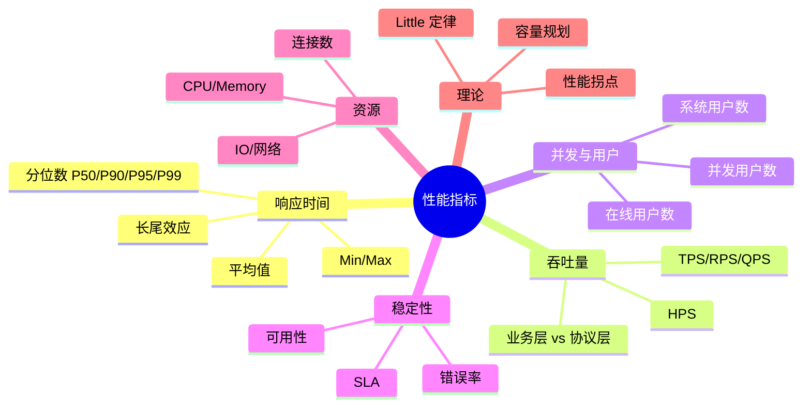

## 6.1 为什么"平均响应时间"骗人

### 6.1.1 一个反直觉的例子

**场景**:1000 个请求,其中 990 个 100ms 返回,10 个 5000ms 返回。

- **平均响应时间** = (990 × 100 + 10 × 5000) / 1000 = **149ms**
- **中位数(P50)** = **100ms**(大部分用户实际感受)
- **P99** = **5000ms**(1% 的最慢用户,可能是老板或重要客户)
- **P999** = **5000ms**(可能更高)

**问:系统响应快不快?**

- 看平均:**149ms 很快啊** ✅(领导看着满意)
- 看 P99:**5 秒,慢得要死** ❌(用户投诉)

**答**:系统对 99% 的用户很快,对最关键的 1% 极慢。**平均数掩盖了长尾**。

### 6.1.2 平均数的三大罪状

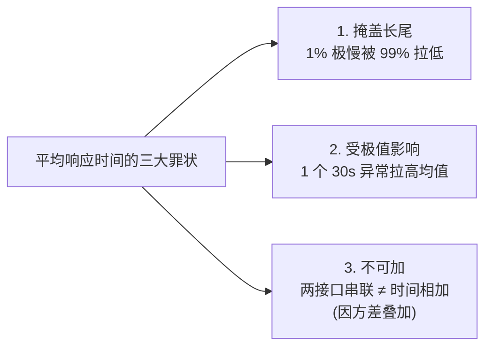

### 6.1.3 正确做法

**永远不要只报平均响应时间**。一份合格的压测报告必须包含:

| 指标 | 含义 |
|------|------|
| **Min / Max** | 极值范围 |
| **Mean** | 平均(参考) |
| **Median(P50)** | 中位数,典型用户感受 |
| **P90 / P95 / P99 / P999** | 分位数,长尾用户感受 |
| **标准差** | 离散程度 |

**经验法则**:**P99 < 3 × P50** 通常是健康系统的标志。

## 6.2 响应时间指标族详解

### 6.2.1 完整指标清单

JMeter 聚合报告里通常能看到:

| 字段 | 含义 |
|------|------|
| **Sample#** | 样本序号 |
| **Start Time** | 样本开始时间 |
| **Thread Name** | 线程名 |
| **Label** | 取样器名 |
| **Sample Time(ms)** | 单个样本响应时间 |
| **Status** | 成功/失败标志 |
| **Bytes** | 响应字节数 |
| **Sent Bytes** | 发送字节数 |
| **Latency** | 延迟(到首个字节时间) |
| **Connect Time** | 连接建立时间 |

### 6.2.2 Min / Max / Mean

- **Min**:最快一次,通常不关心(说明不了问题)
- **Max**:最慢一次,反映**最差情况**(异常数据或 GC 暂停)
- **Mean**:平均,**最容易骗人**

### 6.2.3 中位数 Median(P50)

**定义**:把所有响应时间从小到大排列,**正中间那个**就是 P50。

**含义**:**典型用户**的响应时间。一半用户比这快,一半比这慢。

**为什么 P50 比 Mean 更稳定**:
- 不受极端值影响(把最慢的删掉 P50 几乎不变)
- 反映"大多数人"的真实体验

### 6.2.4 分位数 P90 / P95 / P99 / P999

**定义**:**百分之 N 的请求**响应时间不超过这个值。

| 分位数 | 含义 | 业务视角 |
|--------|------|----------|
| **P50(中位数)** | 一半请求快于这个时间 | 普通用户感受 |
| **P90** | 90% 请求快于这个时间 | 大多数用户体验 |
| **P95** | 95% 请求快于这个时间 | 关键用户体验(常见 SLA) |
| **P99** | 99% 请求快于这个时间 | 长尾用户/付费用户/对延迟敏感场景 |
| **P999** | 99.9% 请求快于这个时间 | 极端长尾(高频交易、金融支付) |

**视觉化理解**:

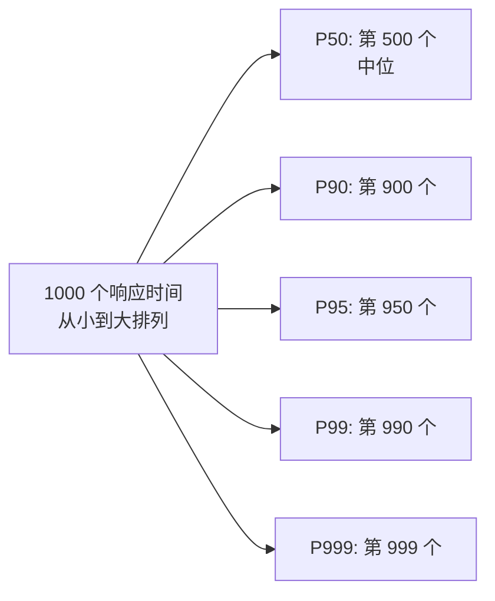

### 6.2.5 工业实践:SLA 的常见数字

| 业务类型 | 典型 P99 SLA |
|----------|--------------|
| **搜索引擎** | < 200ms |
| **电商首页** | < 500ms |
| **支付核心链路** | < 1s |
| **后台管理** | < 3s |
| **报表导出** | < 10s |
| **批量任务** | < 60s |

**P99 是 SLA 的常见锚点**,因为它捕捉了长尾但排除了极小概率异常。

### 6.2.6 百分位数计算方法

**两种主流算法**:

| 算法 | 思路 | 优缺点 |
|------|------|--------|
| **Nearest Rank**(最近等级) | 直接取对应序号 | 简单,但样本少时不准 |
| **Linear Interpolation**(线性插值) | 在两个样本间插值 | 精度高,Excel/多数工具默认 |

JMeter 使用最近等级 + 排序,**只对"完成响应"的样本**计算——失败请求不计入响应时间。

### 6.2.7 百分位数的反推:TopN

**P99 = 500ms** 等价于**最慢的 1%(Top 1%)响应时间 ≤ 500ms**。

```text
请求总数: 10000
P99 = 500ms  →  10000 × 1% = 100 个请求 > 500ms(允许的)
P999 = 800ms →  10000 × 0.1% = 10 个请求 > 800ms
```

## 6.3 吞吐量指标族

### 6.3.1 常见概念辨析

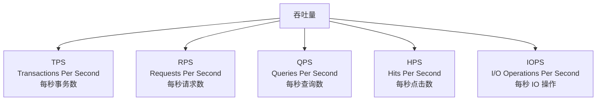

### 6.3.2 关系与区别

| 术语 | 统计单位 | 适用场景 | 与事务关系 |
|------|----------|----------|------------|
| **RPS** | HTTP 请求 | 压测 Web 接口 | 1 TPS = N RPS(N = 事务内请求数) |
| **QPS** | 数据库查询 | 压测 DB | 单接口可能产生多次 SQL |
| **HPS** | 页面/接口点击 | 业务侧统计 | 模糊概念 |
| **TPS** | 业务事务 | 性能评估 | 衡量业务处理能力 |
| **IOPS** | 磁盘/存储 | 存储性能 | 底层性能 |

### 6.3.3 核心区分:TPS ≠ RPS

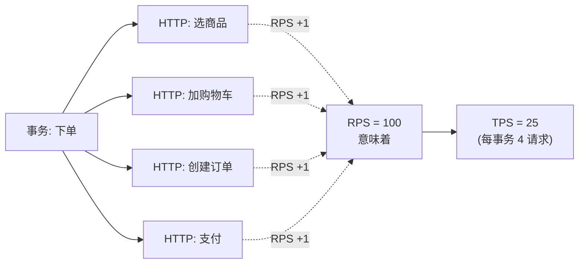

**TPS 才是衡量系统容量的核心指标**——RPS 是工具视角,TPS 是用户视角。

### 6.3.4 JMeter 中如何计算

**默认 RPS**:聚合报告的 **Throughput** 列 = 样本数 / 总时间(秒)

**真正的 TPS**:用**事务控制器**包业务请求,勾选 `Generate parent sample`,此时 Throughput 列就是 TPS。

```text
聚合报告:
Label          Samples  Throughput
HTTP 选商品    4000     100/sec
HTTP 创建订单  4000     100/sec
下单事务       4000     100/sec      ← 这才是 TPS
```

### 6.3.5 吞吐量的天花板

**吞吐量不可能无限增长**——硬件(网卡、CPU、DB 连接池)有上限。

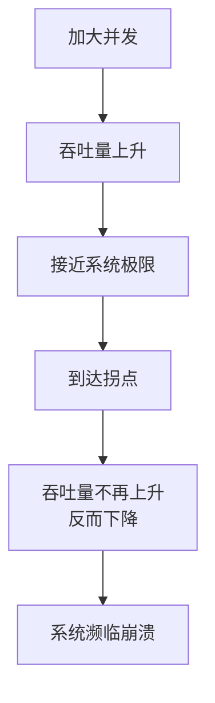

**压测的目的之一就是找到这个拐点**。

### 6.3.6 吞吐量的可视化

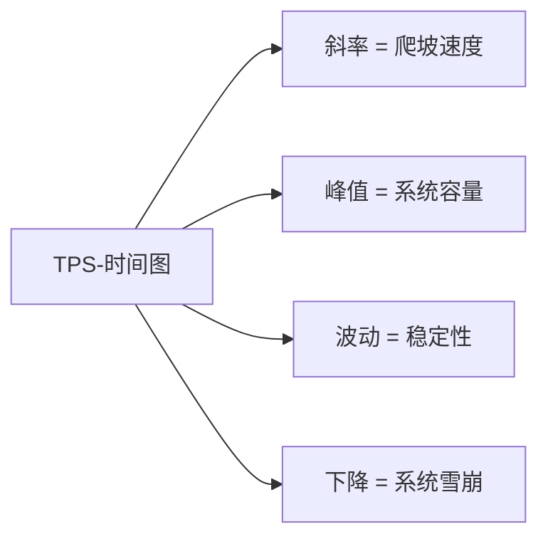

## 6.4 并发数 vs 用户数 vs 在线数

### 6.4.1 三个"数"的区别

| 术语 | 定义 | 典型比例 |
|------|------|----------|
| **系统用户数** | 注册的总用户数 | 1,000,000 |
| **在线用户数** | 当前已登录的用户(可能闲着) | 100,000 |
| **并发用户数** | 正在执行操作的活跃用户 | 1,000 |
| **请求并发数** | 同一时刻真正发往服务器的请求 | 5,000(每个用户 5 请求) |

### 6.4.2 关系图

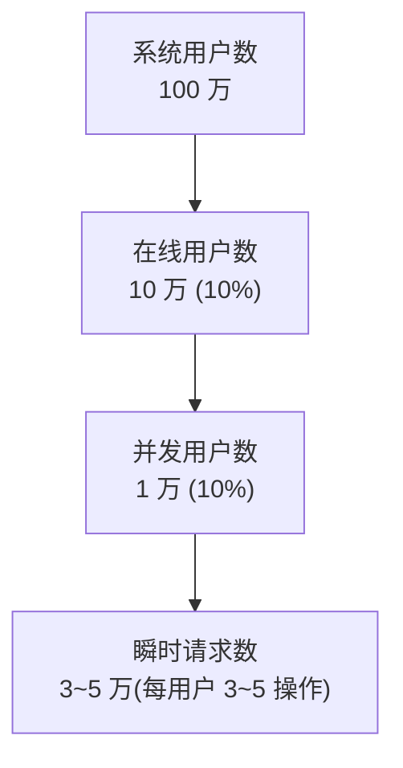

**经验法则**:并发用户数 ≈ 在线用户数的 10%, 瞬时请求数 ≈ 并发用户数的 3~5 倍。

### 6.4.3 JMeter 线程数 ≠ 真正的并发

**JMeter 线程数**:同时**保持活跃**的虚拟用户数。

但因为定时器的存在,**瞬时并发请求数 ≠ 线程数**:
- 100 线程 + 每次固定等 1000ms → 实际 RPS ≈ 100(每秒 1 次)
- 100 线程 + 同步定时器 Group=100 → 瞬时并发 100,但持续时间短
- 100 线程 + 无定时器 → **瞬时并发可能 100**(取决于响应时间)

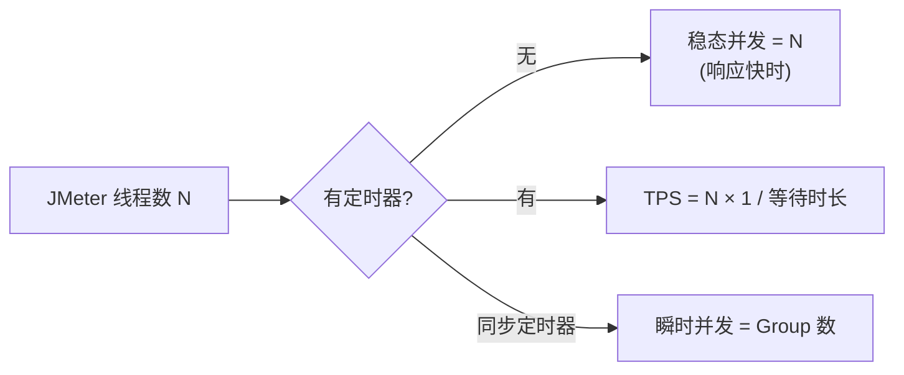

### 6.4.4 并发数估算公式

**C = (Think Time + RT) / RT × 在线用户数 × 活动率**

```text
例:
在线用户数 10000,活动率 10% → 并发用户数 1000
Think Time 5s, RT 0.5s
C = (5 + 0.5) / 0.5 × 10000 × 10% = 11000
```

## 6.5 错误率与可用性

### 6.5.1 错误率定义

```text
错误率 = 失败样本数 / 总样本数 × 100%
```

**JMeter 的"失败"包含**:
- HTTP 状态码非 2xx/3xx
- 断言失败
- 网络异常(超时、连接拒绝)
- 业务码异常(若配置了断言)

### 6.5.2 错误率等级

| 错误率 | 系统状态 |
|--------|----------|
| **0.01% 以下** | 正常波动 |
| **0.1%** | 需关注 |
| **1%** | 系统承压边缘 |
| **5%** | 严重恶化 |
| **>10%** | 系统濒临崩溃 |

### 6.5.3 可用性 SLA

| SLA | 年度停机 | 描述 |
|-----|----------|------|
| **99%** | 87.6 小时 | 不达标 |
| **99.9%** | 8.76 小时 | 一般业务 |
| **99.95%** | 4.38 小时 | 重要业务 |
| **99.99%** | 52.6 分钟 | 关键业务 |
| **99.999%**(五个 9) | 5.26 分钟 | 金融级 |

**压测目标**:SLA 4 个 9 时,P99 失败率 ≤ 0.01%(99.99% 成功率)。

### 6.5.4 错误的分类

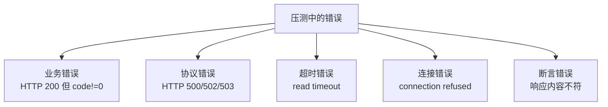

**区分**:每种错误的根因不同,**别一上来就调服务器**——可能是脚本断言写错了。

### 6.5.5 错误率与吞吐量的"剪刀差"

**性能拐点的标志**:错误率上升 + TPS 持平或下降。

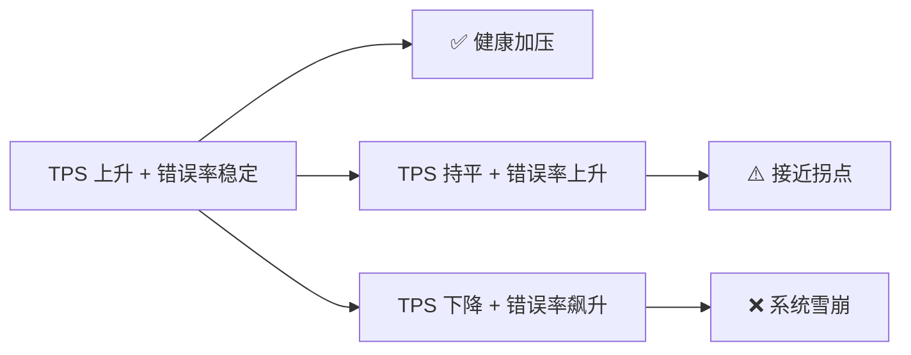

## 6.6 资源利用率指标

### 6.6.1 服务器资源

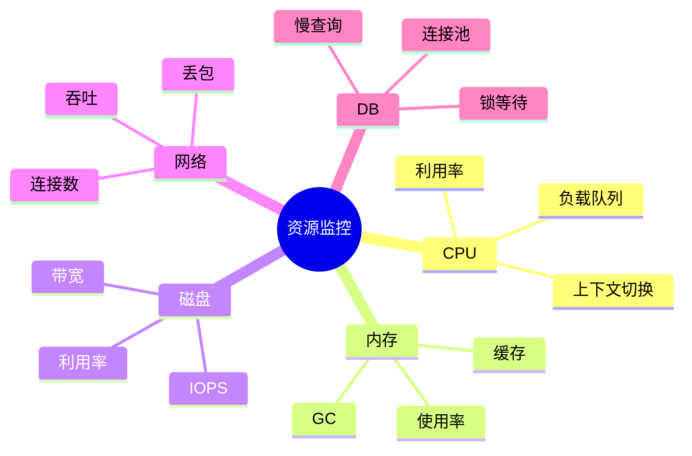

### 6.6.2 CPU 利用率

| 利用率 | 含义 |
|--------|------|
| **< 50%** | 充裕 |
| **50%~70%** | 健康运行 |
| **70%~85%** | 接近瓶颈 |
| **> 85%** | 高负载(可能丢请求) |
| **> 95%** | 严重饱和 |

**注意**:**CPU 高 ≠ CPU 是瓶颈**——可能是 IO 等待。

```text
top 命令看到:
Cpu(s): 85.0% us, 10.0% sy, 0.0% ni, 5.0% id, 0.0% wa
                                              ↑↑↑
                                          空闲率 5%
                                          真正的空闲率
```

**95% 满载 + 5% idle 才是真正饱和**,不是看 us(user)。

### 6.6.3 内存

- **使用率**:不要看百分比,要结合**绝对值 + 趋势**
- **Swap**:一旦开始 swap,系统已经濒临崩溃(磁盘 IO 替代内存,慢 1000 倍)
- **GC**:Java 应用重点关注

**Java GC 监控**:

| 指标 | 含义 | 警戒线 |
|------|------|----------|
| **年轻代 GC 频率** | 每秒/分钟多少次 | > 10次/秒为频繁 |
| **Full GC 频率** | 整堆回收 | > 1次/小时为问题 |
| **单次 GC 停顿** | STW 时长 | > 200ms 影响 RT |
| **老年代使用率** | 老年代占用 | > 80% 接近 OOM |

### 6.6.4 磁盘 IO

| 指标 | 含义 |
|------|------|
| **IOPS** | 每秒读写次数(随机 IO 关注) |
| **带宽(MB/s)** | 每秒读写量(顺序 IO 关注) |
| **await** | 单次 IO 平均等待时间(单位 ms) |
| **%util** | 设备利用率 |

**%util = 100% 不一定是瓶颈**——看 await 是否飙升(>10ms 算高)。

### 6.6.5 网络

- **带宽(Mbps)**:吞吐上限
- **连接数**:TIME_WAIT 大量堆积是常态
- **丢包率**:> 0.1% 算问题
- **TCP 重传率**:> 1% 算问题

### 6.6.6 数据库

**MySQL 重点关注**:

| 指标 | 含义 |
|------|------|
| **QPS** | 数据库查询数 |
| **TPS** | 事务数(InnoDB) |
| **慢查询** | > 100ms 的查询 |
| **连接数** | Threads_connected / max_connections |
| **锁等待** | InnoDB row lock waits |
| **Buffer Pool 命中率** | > 99% 为健康 |

### 6.6.7 资源与性能的关系

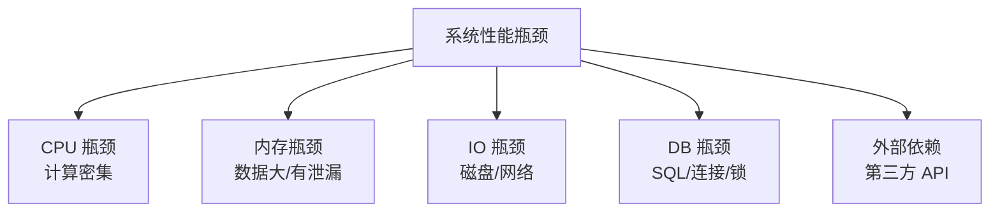

**性能调优的"经验优先级"**:**DB 瓶颈 > IO 瓶颈 > 锁瓶颈 > CPU 瓶颈**——大部分系统都死在数据库上。

## 6.7 Little 定律:性能理论基石

### 6.7.1 定律陈述

**Little's Law**(利特尔定律):

```text
系统中的平均数量 = 到达速率 × 平均停留时间
```

应用到性能领域:

```text
并发数(系统内请求数) = 吞吐量(TPS) × 响应时间(秒)
```

### 6.7.2 直观理解


**如果**:
- 每秒到达 100 个请求
- 每个请求平均停留 0.5 秒

**则**:**平均并发 = 100 × 0.5 = 50 个请求在系统中**(任意时刻)。

### 6.7.3 三者的关系

```text
L = λ × W
L: 系统平均实体数(并发数)
λ: 平均到达速率(TPS)
W: 平均停留时间(响应时间,秒)
```

**任何两者确定,第三者就确定**。这是性能建模的基石。

### 6.7.4 实战应用

**场景**:已知系统 P99 响应时间 = 200ms,要求支撑 5000 TPS,问需要多少线程?

```text
L = λ × W = 5000 × 0.2 = 1000
```

**答**:服务器需要能同时处理 1000 个请求(线程池 ≥ 1000)。

**反过来**:已知服务器线程池 200,TPS 目标 5000,问响应时间上限?

```text
W = L / λ = 200 / 5000 = 0.04 秒 = 40ms
```

**答**:单请求必须 < 40ms 才达标——否则线程被打满,新请求排队,TPS 反而下降。

### 6.7.5 推导性能拐点

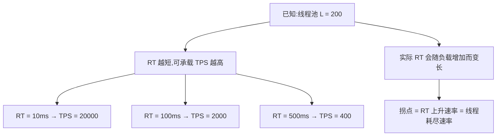

**结论**:**缩短 RT 比增加线程更有效**——因为 L 有限,W 越短,λ 越大。

### 6.7.6 用排队论看系统

**M/M/1 排队模型**(最简单):

```text
平均等待时间 = ρ / (1 - ρ) × 平均服务时间
ρ = λ × μ (利用率)
```

**ρ 接近 1 时,等待时间指数增长**:

| ρ(利用率) | 平均等待 |
|-----------|----------|
| 0.5 | 1 × 服务时间 |
| 0.8 | 4 × 服务时间 |
| 0.9 | 9 × 服务时间 |
| 0.95 | 19 × 服务时间 |
| 0.99 | 99 × 服务时间 |

**应用**:**CPU 利用率 80% 是警戒线,90% 已濒临崩溃**——这就是为什么互联网公司不会让 CPU 满跑。

## 6.8 性能拐点

### 6.8.1 什么是性能拐点

**性能拐点**:吞吐量随并发增加,**增速放缓、持平、转下降**的那个点。

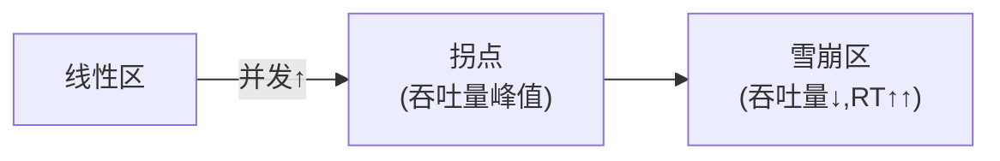

### 6.8.2 拐点的四个阶段

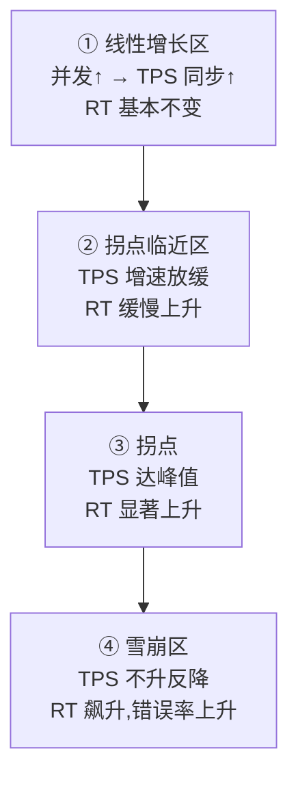

### 6.8.3 拐点的判定方法

**单指标判定**(任一):

| 指标 | 拐点特征 |
|------|----------|
| **TPS** | 增速放缓 → 持平 → 下降 |
| **响应时间** | 突然增长(> 线性预测) |
| **错误率** | 突然升高 |
| **资源** | CPU > 80%,IO 等待明显 |

**多指标联合**:
- TPS 持平 + RT 飙升 = **拐点**
- TPS 下降 + 错误率飙升 = **雪崩**

### 6.8.4 拐点的价值

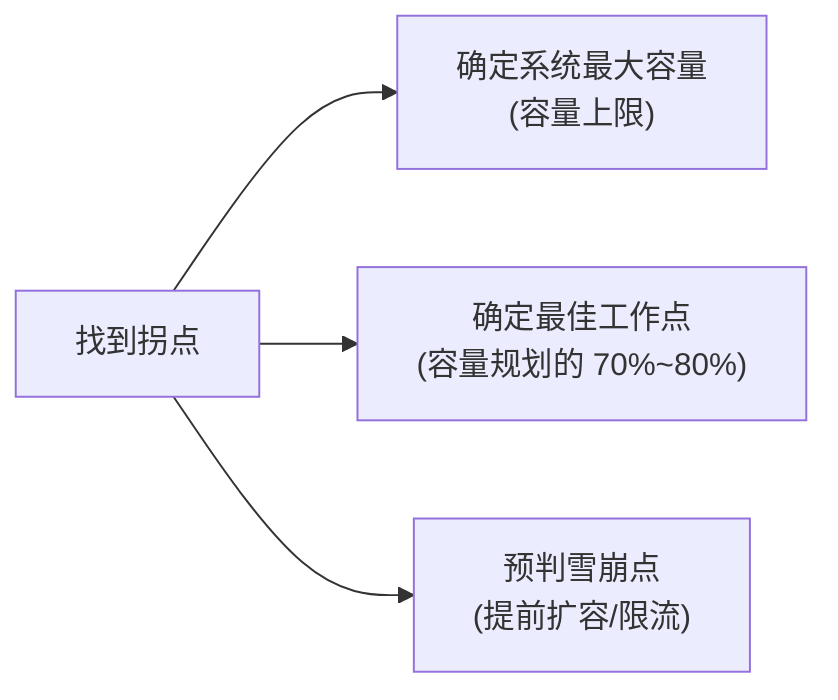

**最佳工作点**:拐点的 60%~70%。**给系统留余量**,避免抖动到雪崩区。

### 6.8.5 拐点可视化

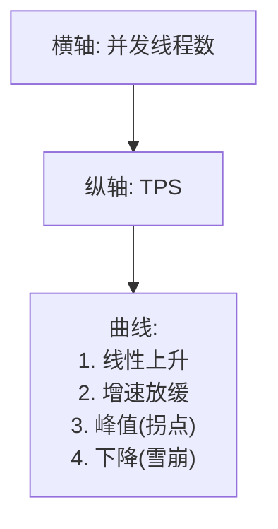

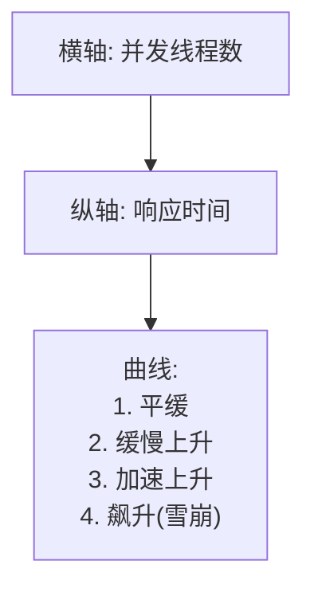

## 6.9 容量规划

### 6.9.1 容量规划的目标

**回答问题**:**业务要 X 用户,系统需要多少资源?**

```mermaid
flowchart TD
    A["业务目标<br/>100 万 DAU<br/>每用户 10 次操作"] --> B["TPS 估算"]
    B --> C["服务器/DB/缓存估算"]
    C --> D["成本估算"]
```

### 6.9.2 自顶向下容量规划

**步骤**:

1. **业务建模**:DAU、峰值 QPS、用户行为分布
2. **峰值计算**:二八法则(80% 流量集中在 20% 时间)
3. **单实例能力**:压测得到单服务器最大 TPS
4. **机器数量**:峰值 QPS × 安全系数 / 单实例能力

**例**:
```text
DAU = 100 万
平均每人每天 10 次操作 = 1000 万次/天
峰值集中在 20% 时间(每天 4.8 小时高峰) = 1000 万 / 17280 秒 = 578 TPS
峰值倍数(早高峰是均值的 3 倍) = 578 × 3 = 1735 TPS
安全系数(留 30% 余量) = 1735 / 0.7 = 2479 TPS
单实例最大 800 TPS
机器数量 = 2479 / 800 = 3.1 → 4 台
```

### 6.9.3 自底向上容量规划

**步骤**:

1. **单接口压测**:测出每个核心接口的单实例 TPS
2. **业务链路压测**:模拟真实业务,测端到端 TPS
3. **混合场景**:不同比例的接口压测
4. **推算总体**:按比例累加得到总 TPS 需求

### 6.9.4 容量规划的不确定性

```mermaid
flowchart TD
    A["实际容量 ≠ 压测容量"] --> B["数据规模差异<br/>(压测库 vs 生产库)"]
    A --> C["业务复杂度差异"]
    A --> D["流量分布差异"]
    A --> E["第三方依赖差异"]
```

**应对**:**生产灰度 + 全链路压测**——最终用真实流量验证。

## 6.10 性能测试类型

### 6.10.1 五大类型

| 类型 | 目的 | 方法 |
|------|------|------|
| **基准测试(Benchmark)** | 验证基线性能 | 单接口、单用户、对比历史版本 |
| **负载测试(Load)** | 验证正常负载下表现 | 模拟预期业务量 |
| **压力测试(Stress)** | 找到性能拐点 | 持续加压,直到系统崩 |
| **容量测试(Capacity)** | 确定最大支撑能力 | 二分法找极限 |
| **稳定性测试(Soak)** | 验证长时间运行稳定性 | 持续压测 24h+ |

### 6.10.2 各类测试的关注点

```mermaid
flowchart TD
    A["性能测试类型"] --> B["基准<br/>关注: 版本对比"]
    A --> C["负载<br/>关注: SLA 是否达标"]
    A --> D["压力<br/>关注: 拐点位置"]
    A --> E["容量<br/>关注: 最大容量"]
    A --> F["稳定性<br/>关注: 内存泄漏/资源耗尽"]
```

### 6.10.3 测试方法学:逐步加压 vs 阶跃加压

**逐步加压**(Ramp-Up):线性增加并发,适合找拐点。

```mermaid
flowchart LR
    T1["0 秒: 10 并发"] --> T2["100 秒: 100 并发"]
    T2 --> T3["200 秒: 200 并发"]
    T3 --> T4["300 秒: 300 并发"]
```

**阶跃加压**(Step):固定台阶,每台阶保持一段时间。

```mermaid
flowchart LR
    T1["0-300s: 100 并发"] --> T2["300-600s: 200 并发"]
    T2 --> T3["600-900s: 300 并发"]
```

**混合加压**:先阶跃摸底,再逐步精细化。

## 6.11 性能瓶颈定位

### 6.11.1 黄金流程

```mermaid
flowchart TD
    A["压测出现拐点"] --> B["看 CPU"]
    B -->|"高"| C["CPU 瓶颈<br/>profile/火焰图"]
    B -->|"不高"| D["看 IO"]
    D -->|"高"| E["IO 瓶颈<br/>iostat/iotop"]
    D -->|"不高"| F["看 DB"]
    F -->|"慢查询多"| G["DB 瓶颈<br/>SQL 优化/索引"]
    F -->|"正常"| H["看外部依赖"]
    H -->|"慢"| I["第三方慢"]
    H -->|"正常"| J["看应用层<br/>锁/GC"]
```

### 6.11.2 USE 方法

**Brendan Gregg 的 USE 方法**:对**每个资源**,检查 **Utilization**(利用率)、**Saturation**(饱和度)、**Errors**(错误)。

```text
资源类型:
- CPU
- 内存
- 磁盘
- 网络
- 控制器
- 互斥锁

每类资源查三个维度:
- Utilization: 多忙?(> 80% 警戒)
- Saturation: 多挤?(队列长度、等待数)
- Errors: 多少错误?(错误计数)
```

### 6.11.3 自顶向下 vs 自底向上

| 方向 | 思路 | 工具 |
|------|------|------|
| **自顶向下** | 先看业务 → 应用 → DB → 硬件 | 业务监控 + APM |
| **自底向上** | 先看硬件 → OS → 应用 → 业务 | top/iostat + profiling |

**压测定位瓶颈推荐自顶向下**——从用户视角到系统底层逐步深入。

### 6.11.4 常见误区

```text
❌ 只看 CPU,CPU 不高就以为没问题
✅ CPU/IO/DB/锁都要看

❌ 应用机器慢就加机器
✅ 先定位瓶颈,加机器可能没用(DB 慢加多少应用机器都没用)

❌ 看 P99 长就调 GC
✅ P99 长可能是 DB 锁、第三方慢、磁盘抖动

❌ 压测曲线线性就觉得健康
✅ 拐点在更高并发处,线性只是当前负载下没问题
```

## 6.12 性能报告核心要素

### 6.12.1 一份合格的压测报告必须包含

```mermaid
mindmap
    root((压测报告))
        测试背景
            测试目的
            测试范围
            测试环境
        测试方案
            场景设计
            压测配置
            数据准备
        测试结果
            TPS-并发曲线
            RT-并发曲线
            错误率
            资源利用率
        结论
            是否达标
            系统容量
            风险点
```

### 6.12.2 关键图表

**1. TPS-并发曲线**:找拐点

```mermaid
flowchart LR
    A["X: 并发数"] --> B["Y: TPS"]
    B --> C["峰值即系统容量"]
```

**2. 响应时间分位数柱状图**:看长尾

```mermaid
flowchart LR
    A["P50/P90/P95/P99"] --> B["柱状对比"]
    B --> C["长尾 = 不健康"]
```

**3. 资源利用率时序图**:看峰值时刻

```mermaid
flowchart LR
    A["CPU/内存/IO 时序"] --> B["找峰值点"]
    B --> C["拐点时刻资源瓶颈"]
```

**4. 错误率分布饼图**:分类错误

```mermaid
flowchart LR
    A["业务错误 / 协议错误 / 超时 / 断言"] --> B["占比饼图"]
    B --> C["定位主要问题"]
```

## 6.13 性能反模式

### 6.13.1 报告只报"平均"

```text
❌ 压测结果: 平均响应时间 200ms,TPS 1000
✅ 压测结果:
   P50: 150ms, P90: 300ms, P95: 450ms, P99: 800ms
   TPS: 1000 (峰值 1200)
   错误率: 0.5%
   拐点: 1500 并发
   资源峰值: CPU 78%, DB 连接 85%
```

### 6.13.2 单线程数报容量

```text
❌ 系统容量 1000 TPS(200 线程压测得出)
✅ 200 线程 1000 TPS,单实例约 800 TPS(线性区推算)
   加 1 台 800 → 总 1600 TPS,加 2 台 2400 TPS
   但 DB 共享,所以实际 DB 才是瓶颈,加机器无效
```

### 6.13.3 没压到拐点就报"通过"

```text
❌ 100 并发压测 OK,系统满足业务
✅ 100 并发只是预期负载的 30%,拐点在哪里?瓶颈在哪里?
   不知道 → 风险未知
```

### 6.13.4 用开发环境压测推生产容量

```text
❌ 开发机器单实例 1000 TPS → 生产需要 5 台
✅ 开发机器配置 ≠ 生产,DB/网络都不同
   必须在生产等配环境压测,或做容量换算
```

## 小结 {#summary}

- **响应时间指标族**:Min/Max/Mean 没用,要看 **P50/P90/P95/P99/P999**;长尾才是真实体验。
- **吞吐量核心是 TPS**,不是 RPS——事务控制器合并统计才是 TPS。
- **错误率等级**:0.1% 警戒,1% 严重,10% 雪崩。
- **资源**:CPU 80% 警戒、IO await 关注、DB 慢查询是大坑。
- **Little 定律**:`并发 = TPS × RT`,三者知二推三,是性能建模基石。
- **拐点**:线性区→拐点→雪崩区,目标是找到拐点并工作在拐点的 60%~70%。
- **报告必须含**:分位数 + TPS-并发曲线 + 资源利用率 + 拐点位置 + 风险点。

下一章讲**压测执行与结果分析**——怎么用 CLI 模式跑压测、怎么部署分布式压测集群、怎么看实时监控、用什么工具生成专业 HTML 报告。