# 第七章 压测执行与结果分析

脚本准备好了,场景也设计好了——**怎么把它跑起来,跑得稳,跑得对?**

本章解决**执行层**的问题:用 CLI 模式避免 GUI 性能损失、部署分布式集群突破单机瓶颈、用 InfluxDB+Grafana 做实时监控、用 JMeter 插件生成专业的 HTML 报告。

## 本章知识点地图

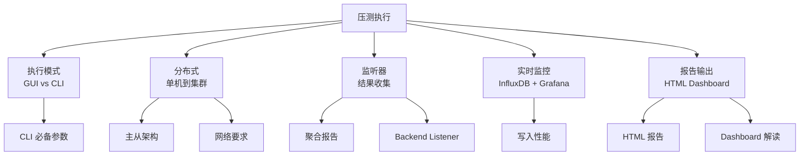

## 7.1 GUI 模式 vs CLI 模式

### 7.1.1 两种模式的本质区别

| 模式 | 用途 | 性能开销 | 监听器 | 资源消耗 |
|------|------|----------|--------|----------|
| **GUI 模式** | 调试脚本、运行小规模压测 | **高**(界面渲染) | 可视化 | 高 |
| **CLI 模式** | 生产压测、大规模压测 | **极低** | 仅后台监听 | 低 |

**压测黄金规则**:**永远用 CLI 模式跑正式压测**。GUI 模式只用来调试脚本。

### 7.1.2 GUI 模式的性能损耗

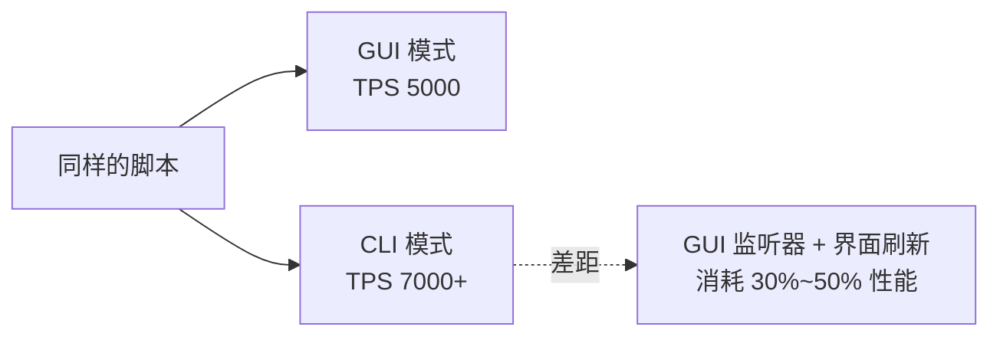

**为什么会慢**:
- 监听器实时渲染(每次请求都更新表格)
- Swing/AWT 界面绘制占用 CPU
- 大量样本时,内存暴涨,GC 频繁

### 7.1.3 GUI 模式适用场景

| 场景 | 是否用 GUI |
|------|------------|
| 调试脚本、验证关联 | ✅ GUI |
| 验证断言逻辑 | ✅ GUI |
| **正式压测(>100 并发)** | ❌ CLI |
| 长时间稳定性测试 | ❌ CLI |
| 分布式压测 | ❌ CLI(只能在控制台) |
| 调试单个请求 | ✅ GUI |

### 7.1.4 CLI 模式基本启动

```bash
jmeter -n -t script.jmx -l result.jtl
```

参数说明:
- `-n`:CLI 模式(非 GUI)
- `-t script.jmx`:测试计划文件
- `-l result.jtl`:结果文件(可省,自动生成)

### 7.1.5 CLI 模式示例

**最简单的压测命令**:

```bash
jmeter -n -t order-test.jmx -l order-2026-09-05.jtl
```

**指定远程主机(分布式)**:

```bash
jmeter -n -t order-test.jmx -R 192.168.1.101,192.168.1.102 -l order.jtl
```

**生成 HTML 报告**:

```bash
jmeter -n -t order-test.jmx -l order.jtl -e -o report/
```

## 7.2 命令行参数详解

### 7.2.1 完整参数清单

| 参数 | 含义 | 示例 |
|------|------|------|
| `-n` | CLI 模式 | -n |
| `-t <file>` | 测试计划文件 | -t test.jmx |
| `-l <file>` | 结果文件(.jtl/.csv/.xml) | -l result.jtl |
| `-h <host>` | 远程主机 IP(单台) | -h 192.168.1.101 |
| `-H <file>` | 远程主机列表文件 | -H slaves.txt |
| `-R <hosts>` | 远程主机列表(逗号分隔) | -R "h1,h2,h3" |
| `-G <file>` | 分布式测试结果聚合文件 | -G total.jtl |
| `-r` | 启动所有 `-Jremote_hosts` 配置的从机 | -r |
| `-e` | 测试结束后生成 HTML 报告 | -e |
| `-o <dir>` | HTML 报告输出目录 | -o report/ |
| `-J <prop>=<val>` | 设置 JMeter 属性 | -Jthreads=100 |
| `-L <level>` | 日志级别 | -L DEBUG |
| `-d <dir>` | JMeter HOME | -d /opt/jmeter |
| `-X` | 测试结束时退出 JMeter | -X |

### 7.2.2 常用参数组合

**本地压测 + 生成报告**:

```bash
jmeter -n -t order.jmx -e -o report/2026-09-05/
```

**分布式压测 + 不生成报告**:

```bash
jmeter -n -t order.jmx -R 192.168.1.101,192.168.1.102 -l order.jtl
```

**调试模式**(带日志):

```bash
jmeter -n -t order.jmx -L DEBUG -l debug.jtl
```

**用变量覆盖脚本参数**:

```bash
jmeter -n -t order.jmx -Jthreads=200 -JrampUp=60 -Jduration=300 -l result.jtl
```

### 7.2.3 命令行参数优先级

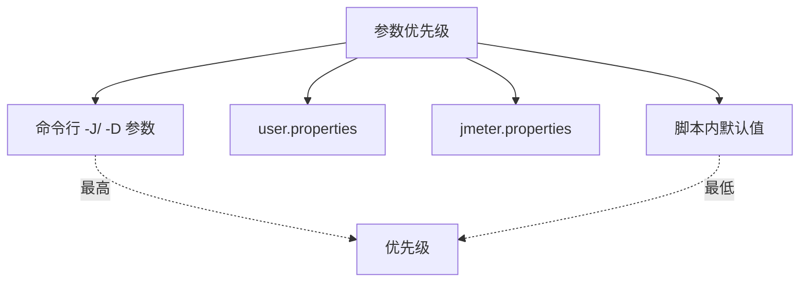

**-J**(JMeter 属性)优先级最高,适合覆盖脚本里的可变参数。

### 7.2.4 环境变量与 JVM 调优

**JMeter 自身也是 Java 应用,需要 JVM 调优**:

```bash
export JVM_ARGS="-Xms4g -Xmx4g -XX:MaxMetaspaceSize=512m"
jmeter -n -t test.jmx
```

**典型配置**:
- 压测机内存:**≥ 8 GB**
- 堆内存:**4~6 GB**
- GC:**G1GC**(避免 CMS 的 STW)

```bash
export JVM_ARGS="-Xms4g -Xmx4g -XX:+UseG1GC -XX:MaxGCPauseMillis=100"
```

### 7.2.5 远程执行命令 SSH

```bash
# 在远程主机执行 JMeter 从机
ssh user@192.168.1.101 "jmeter-server -Djava.rmi.server.hostname=192.168.1.101"
```

## 7.3 分布式压测架构

### 7.3.1 为什么需要分布式

**单机瓶颈**:单台 JMeter 客户端的**线程数上限**受限于:

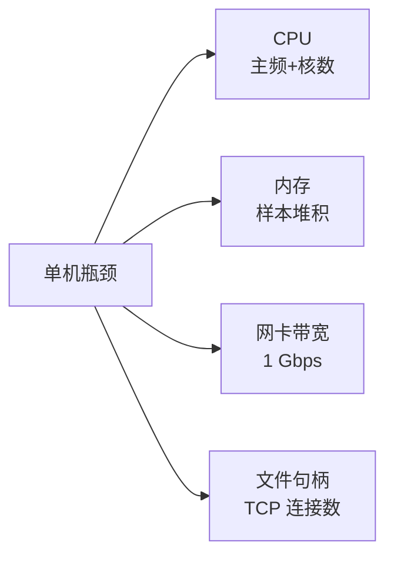

**典型上限**:
- 单机 1000~2000 并发线程(CPU 强)
- 实际 RPS 上限:**5000~10000**(HTTP 短请求)
- 长连接、复杂脚本:**更低**

**业务目标**:支撑 10000 TPS?单机做不到——需要**多机并行**。

### 7.3.2 分布式架构

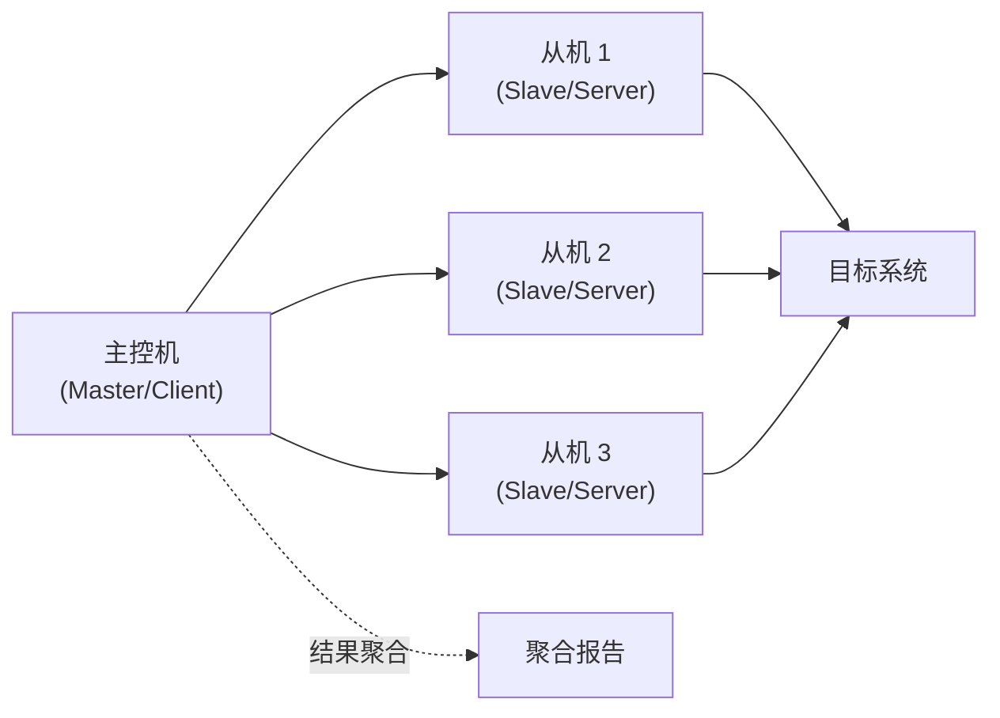

**核心思想**:**控制与执行分离**
- **主控机**:调度、聚合结果、不发请求
- **从机**:实际发请求、向目标系统压测
- **结果汇聚**:所有从机的结果汇总到主控机

### 7.3.3 RMI 通信原理

**JMeter 分布式基于 RMI**(Java Remote Method Invocation):

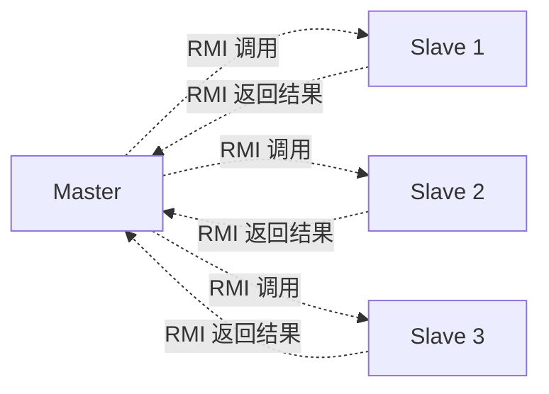

**RMI 端口分配**(默认):
- **1099**:RMI 注册端口(可配置)
- **0(动态)**:实际数据传输端口(每 slave 一个)
- **5000 / 5009 / ...**:RMI 对象端口

**关键点**:**所有从机的 RMI 端口必须对主控机开放**。

### 7.3.4 网络拓扑

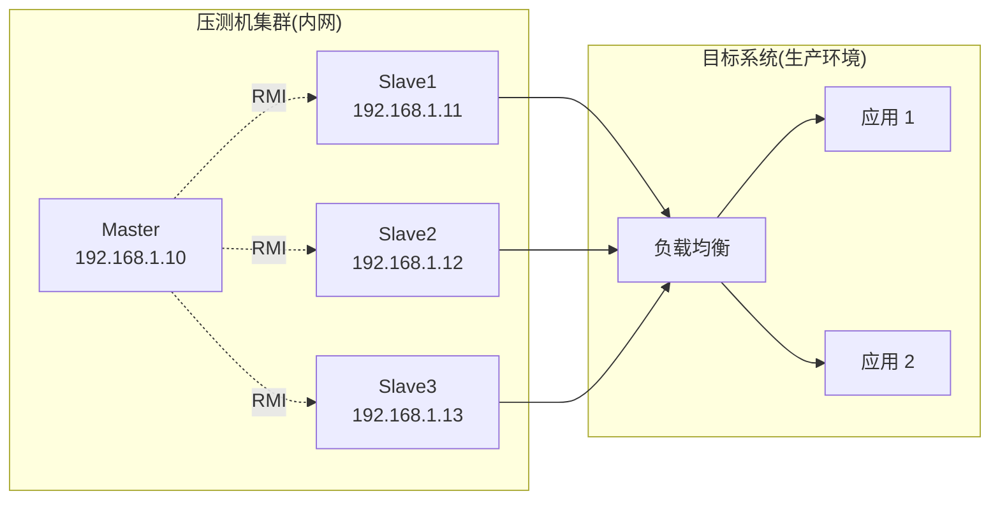

### 7.3.5 网络要求

**压测机之间**:
- 互通:**双向**网络通
- 带宽:内网 ≥ 1 Gbps
- 延迟:< 5ms(局域网)

**压测机到目标系统**:
- 必须能访问目标 IP:端口
- 公网/内网视环境而定

**防火墙**:
- 开放主控机 → 从机:RMI 端口(默认 1099,需配置更多)
- 开放从机 → 主控机:同上

### 7.3.6 分布式 vs 真实流量

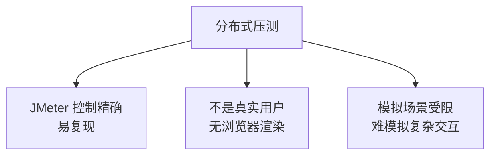

**真实流量回放**(更高级方案):
- GoReplay / Tcpcopy
- 真实用户操作录制
- 生产流量镜像

**取舍**:**JMeter 适合"主动建模",流量回放适合"被动复现"**。

## 7.4 分布式部署步骤

### 7.4.1 部署清单

```text
硬件:
- 主控机:1 台(CPU 弱也可)
- 从机:N 台(CPU 强 + 大内存)
- 网络:同子网互通

软件(每台):
- JDK 8+(推荐 11 或 17)
- JMeter 5.6.x
- 同版本(主从必须一致)
```

### 7.4.2 从机配置(jmeter.properties)

```properties
# 从机模式
server_mode=true
server_port=1099
server.rmi.localport=1099

# RMI 主机名(关键!从机自己的 IP)
remote_hosts=127.0.0.1
```

**关键**:`server.rmi.localhostname` 必须设为**从机的对外 IP**,否则主控机连不上。

### 7.4.3 主控机配置(jmeter.properties)

```properties
# 所有从机的 IP
remote_hosts=192.168.1.11,192.168.1.12,192.168.1.13
```

### 7.4.4 启动从机

```bash
# 在每台从机执行
jmeter-server -Djava.rmi.server.hostname=192.168.1.11
```

参数说明:`-Djava.rmi.server.hostname` 指定从机对外 IP(关键)。

### 7.4.5 启动主控机并执行分布式测试

```bash
# 方式 1:命令行直接指定从机
jmeter -n -t test.jmx -R 192.168.1.11,192.168.1.12 -l result.jtl

# 方式 2:启动时连接所有配置好的从机
jmeter -n -t test.jmx -r -l result.jtl
```

### 7.4.6 分布式部署常见问题

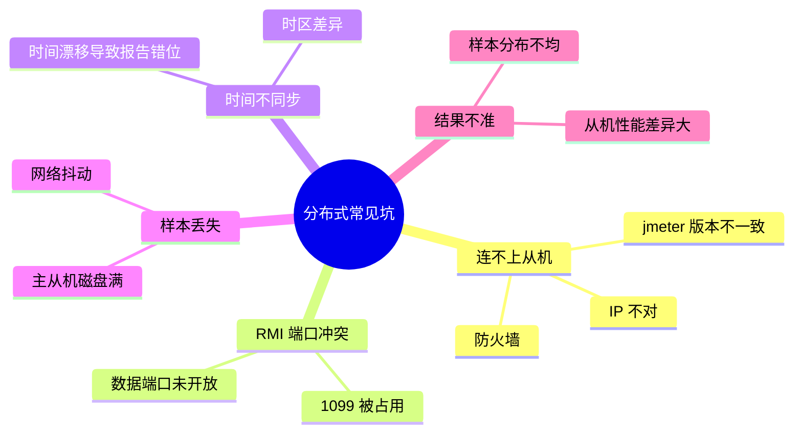

### 7.4.7 防火墙配置

**Linux(iptables)**:

```bash
# 开放 RMI 端口
iptables -A INPUT -p tcp --dport 1099 -j ACCEPT
iptables -A INPUT -p tcp --dport 50000:50100 -j ACCEPT

# 永久保存
service iptables save
```

**CentOS 7+(firewalld)**:

```bash
firewall-cmd --zone=public --add-port=1099/tcp --permanent
firewall-cmd --zone=public --add-port=50000-50100/tcp --permanent
firewall-cmd --reload
```

### 7.4.8 分布式最佳实践

| 项目 | 建议 |
|------|------|
| **从机数量** | 2~10 台,太多主控机压力大 |
| **从机规格** | 同配置,避免性能差异 |
| **脚本分发** | 主从脚本保持一致(Git 管理) |
| **时间同步** | NTP 服务,误差 < 1s |
| **数据文件** | CSV 放在主控机,从机共享(NFS) |
| **结果聚合** | 用 `-l result.jtl`,而非 GUI 监听器 |

## 7.5 监听器选择

### 7.5.1 为什么监听器是性能杀手

**JMeter 监听器**(Listener)在每次样本完成后**做计算/写入/渲染**,大量样本下会成为瓶颈。

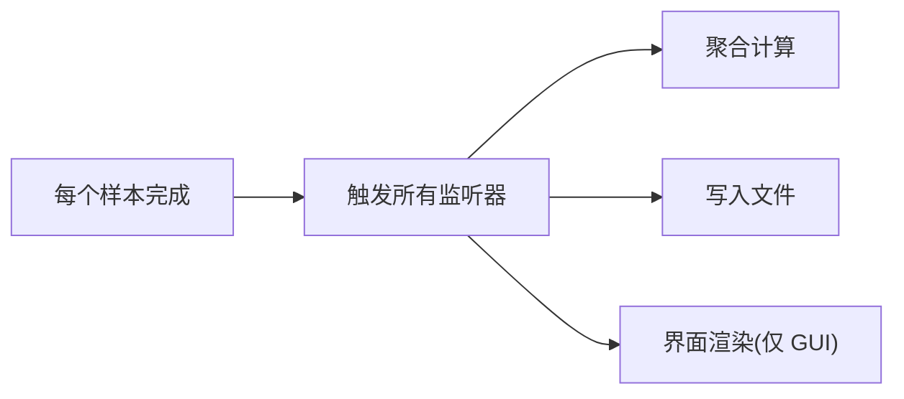

**经验**:**监听器越多,JMeter 越慢**。生产压测只用 1~2 个监听器。

### 7.5.2 监听器速查表

| 监听器 | 用途 | 开销 | 推荐度 |
|--------|------|------|--------|
| **察看结果树** | 看每个请求详情 | **极高** | 仅调试 |
| **聚合报告** | 关键指标汇总 | 中 | ✅ 必备 |
| **汇总报告** | 简化聚合 | 中 | ✅ 备选 |
| **图形结果** | RT 时序图 | 中 | ✅ 可视化 |
| **后端监听器** | 推到 InfluxDB | 低 | ✅ 推荐 |
| **BeanShell 监听器** | 自定义处理 | **高** | 谨慎 |
| **简单数据写入** | 写 CSV | 低 | 备选 |
| **Save Response to File** | 保存响应 | **极高** | 几乎不用 |

### 7.5.3 监听器的"陷阱"

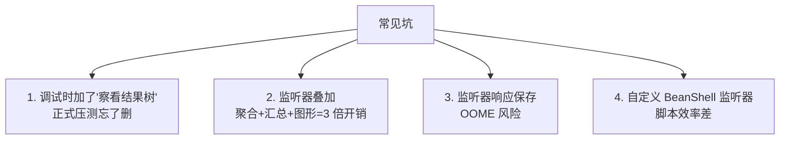

**铁律**:**正式压测前删除所有监听器,改用 CLI + 命令行参数**。

### 7.5.4 推荐的监听器组合

**GUI 调试阶段**:
- 聚合报告(看实时指标)
- 察看结果树(看失败请求详情,**仅失败时显示**——配置"仅日志错误")

**CLI 正式压测**:
- 后端监听器(InfluxDB)
- 简单数据写入(写 jtl 文件)
- HTML Dashboard 报告(结束后生成)

## 7.6 聚合报告详解

### 7.6.1 字段含义

| 字段 | 含义 |
|------|------|
| **Label** | 取样器名(可重命名) |
| **# Samples** | 样本数 |
| **Average** | 平均响应时间(ms) |
| **Median** | 中位数(P50) |
| **90% Line** | P90 |
| **95% Line** | P95 |
| **99% Line** | P99 |
| **Min** | 最小值 |
| **Maximum** | 最大值 |
| **Error %** | 错误率 |
| **Throughput** | 吞吐量(每秒请求数) |
| **Received KB/sec** | 接收带宽 |
| **Sent KB/sec** | 发送带宽 |

### 7.6.2 一份示例报告解读

```text
Label             Samples  Avg  Med  90%  95%  99%  Min  Max  Err%  TPS
HTTP 选商品       10000    45   40   60   80   150  10   800  0.0%  500
HTTP 创建订单     10000    120  100  180  250  500  50   1500 0.5%  500
下单事务(整体)    10000    180  160  280  400  900  80   2000 0.5%  500
```

**解读**:
- 选商品简单稳定:RT 40~60ms,无错误
- 创建订单较慢:RT 100~180ms,0.5% 错误率(轻微)
- 整体事务 P99 900ms → **P99 SLA 评估**:900ms < 1s,**达标**

### 6.6.3 报告中看什么

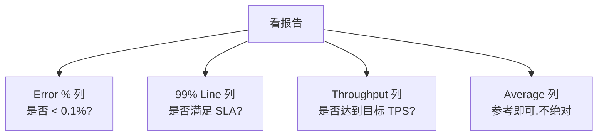

## 7.7 后端监听器(Backend Listener)

### 7.7.1 作用

**把 JMeter 指标实时推送到外部系统**(InfluxDB / Graphite / Elasticsearch),用于 Grafana 实时展示。

**与"聚合报告"的区别**:
- **聚合报告**:**测试结束后**给汇总数据
- **后端监听器**:**测试过程中**每 N 秒推一次实时数据

### 7.7.2 配置

```text
Backend Listener implementation: InfluxDB Backend Listener

# InfluxDB 配置
influxdbMetricsSender: org.apache.jmeter.visualizers.backend.influxdb.HttpMetricsSender
influxdbUrl: http://192.168.1.50:8086/write?db=jmeter
application: order-service
transaction: order_create
samplersList: .*   # 监控所有取样器
useRegexForSamplerList: true
```

### 7.7.3 工作原理


**推送间隔**:默认 2 秒(可在 jmeter.properties 中调整 `backend_influxdb.send_interval`)

### 7.7.4 推送的指标

| 指标 | 含义 |
|------|------|
| `<sampler>.ok.count` | 成功样本累计数 |
| `<sampler>.ko.count` | 失败样本累计数 |
| `<sampler>.count` | 总样本累计数 |
| `<sampler>.mean` | 平均响应时间 |
| `<sampler>.min` | 最小响应时间 |
| `<sampler>.max` | 最大响应时间 |
| `<sampler>.pct50` | 中位数 |
| `<sampler>.pct90` | P90 |
| `<sampler>.pct95` | P95 |
| `<sampler>.pct99` | P99 |
| `<sampler>.throughput` | TPS |
| `<sampler>.receivedBytes` | 接收字节累计 |

## 7.8 InfluxDB + Grafana 实时监控

### 7.8.1 部署架构

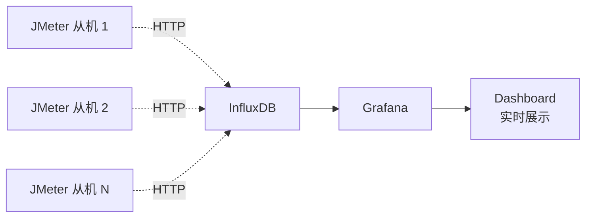

### 7.8.2 InfluxDB 部署

**Docker 一键启动**:

```bash
docker run -d --name influxdb \
  -p 8086:8086 \
  -v influxdb:/var/lib/influxdb \
  influxdb:1.8
```

**创建数据库**:

```bash
curl -XPOST 'http://localhost:8086/query' --data-urlencode 'q=CREATE DATABASE jmeter'
```

### 7.8.3 Grafana 配置

**添加 InfluxDB 数据源**:

```text
Type: InfluxDB
URL: http://localhost:8086
Database: jmeter
```

**导入 JMeter Dashboard**:

Grafana 官方仓库提供了现成的 JMeter Dashboard:

```text
Dashboard ID: 5496 (Apache JMeter Dashboard)
或: 1152 (JMeter Load Test Dashboard)
```

**导入方法**:Grafana → + → Import → 输入 Dashboard ID → 选数据源。

### 7.8.4 关键 Dashboard 图表

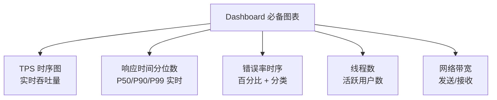

### 7.8.5 自定义 Panel 查询

**InfluxDB 查询语法**(Flux 旧版本):

```sql
SELECT mean("value") FROM "jmeter" 
WHERE "transaction" = 'order_create' 
  AND time > now() - 5m 
GROUP BY time(2s), "statistic"
```

**统计字段含义**:
- `statistic = ok.count`:成功数
- `statistic = pct99`:P99
- `statistic = throughput`:TPS

### 7.8.6 监控的陷阱

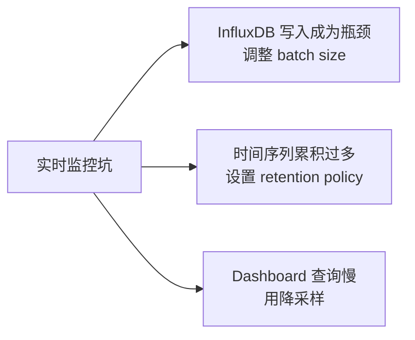

**InfluxDB 调优**:

```properties
[http]
  max-enqueued-points = 100000
  batch-size = 5000
  flush-interval = "1s"
```

## 7.9 HTML Dashboard 报告

### 7.9.1 生成报告

**测试结束后生成**:

```bash
jmeter -n -t test.jmx -l result.jtl -e -o report/
```

**测试前已有结果文件,补充生成**:

```bash
jmeter -g result.jtl -o report/
```

### 7.9.2 报告结构

```text
report/
├── index.html                  # 入口页
├── content/
│   ├── js/
│   ├── css/
│   └── images/
└── statistics.json
```

**部署**:整个 `report/` 目录可作为**静态网站**部署(任何 HTTP 服务器)。

### 7.9.3 Dashboard 解读

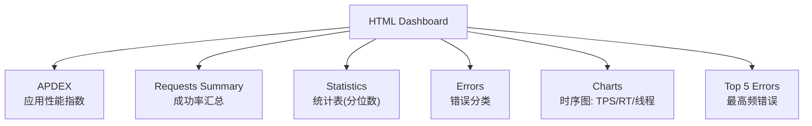

### 7.9.4 APDEX 指数

**APDEX**(Application Performance Index):将响应时间满意度量化为 0~1 的分数。

```text
APDEX = (满意数 + 容忍数/2) / 总样本

T(目标响应时间):
- 响应时间 ≤ T → 满意
- T < 响应时间 ≤ 4T → 容忍
- 响应时间 > 4T → 失望
```

| APDEX | 满意度 |
|-------|--------|
| 0.85~1.00 | 优秀 |
| 0.70~0.85 | 良好 |
| 0.50~0.70 | 一般 |
| < 0.50 | 差 |

### 7.9.5 报告配置优化(jmeter.properties)

```properties
# APDEX 阈值(单位 ms)
jmeter.reportgenerator.apdex_threshold=500

# 报告标题
jmeter.reportgenerator.report_title=订单服务压测报告

# 报告输出目录
jmeter.reportgenerator.output_directory=report

# 图表粒度
jmeter.reportgenerator.graph.responseTimePercentiles.set.title=P95/P99 趋势
```

### 7.9.6 报告的局限

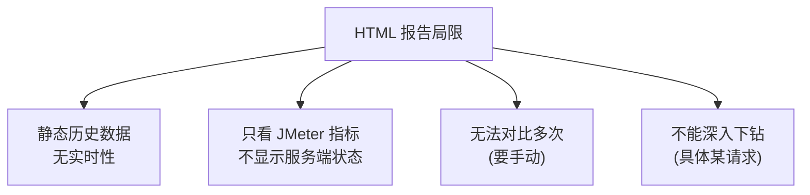

**生产压测推荐**:InfluxDB + Grafana + HTML 报告**两者结合**。

## 7.10 监听器与报告的对比

| 维度 | GUI 监听器 | HTML 报告 | InfluxDB+Grafana |
|------|------------|-----------|------------------|
| **实时性** | ✅ 实时 | ❌ 测试后 | ✅ 实时 |
| **历史回看** | ❌ | ✅ | ✅(取决于 retention) |
| **分布式** | ❌(主控机) | ✅ | ✅ |
| **可视化** | 基础 | 丰富 | ✅ |
| **多机聚合** | ❌ | ✅ | ✅ |
| **下钻分析** | ✅ | 有限 | 有限 |

**生产推荐**:**InfluxDB + Grafana 实时 + HTML 报告归档**。

## 7.11 JMeter Plugin 生态

### 7.11.1 必装插件

**1. JMeter Plugins Manager**(插件管理):

下载地址:https://jmeter-plugins.org/wiki/PluginsManager/

安装:`lib/ext/` 下放 `jmeter-plugins-manager-1.6.jar`,重启 JMeter。

**2. 常用插件**:

| 插件 | 作用 |
|------|------|
| **3 Basic Graphs** | 响应时间/活动线程/TPS 时序图 |
| **Custom Thread Groups** | 阶梯/波浪/最终线程组 |
| **PerfMon** | 服务端资源监控(CPU/内存/IO) |
| **Command-Line Plot** | 命令行生成图表 |
| **jpgc-graphs** | 高级图表 |
| **WebSocket** | WebSocket 取样器 |
| **JDBC** | 数据库压测增强 |

### 7.11.2 PerfMon 服务端监控

**JMeter 自身只能监控客户端**,服务端资源(CPU/内存/IO)需要 **PerfMon Metrics Collector**。

**工作原理**:


**服务端 Agent 部署**:

```bash
# 下载 Server Agent
wget https://github.com/undera/perfmon-agent/releases/download/2.2.3/ServerAgent-2.2.3.zip

# 解压并启动
unzip ServerAgent-2.2.3.zip
cd ServerAgent-2.2.3
./startAgent.sh
```

**默认端口**:4444(TCP/UDP)

**JMeter 端**:
- 添加监听器:`jp@gc - PerfMon Metrics Collector`
- 配置:`Host = 目标服务器IP`,`Port = 4444`
- 选择监控指标:`CPU/Memory/Network IO/Disk IO`

### 7.11.3 阶梯线程组

**Stepping Thread Group**(插件)替代原生线程组的进阶加压:


**优势**:**配置清晰**(每台阶线程数、持续时间),适合精细找拐点。

### 7.11.4 Ultimate Thread Group

**更灵活的加压配置**:

```mermaid
flowchart LR
    A["多线程组并行"] --> B["波形加压<br/>(升-平-降)"]
    A --> C["多个分组独立配置"]
    A --> D["复杂场景模拟"]
```

## 7.12 结果文件格式

### 7.12.1 JTL 格式

**JTL 是 JMeter 的结果文件标准**,三种格式可选:

| 格式 | 大小 | 性能 | 适用 |
|------|------|------|------|
| **CSV** | 小 | 快 | **默认,推荐** |
| **XML** | 大 | 慢 | 复杂场景 |
| **JSON** | 中 | 中 | 编程处理 |

**CSV 字段**:
```csv
timeStamp,elapsed,label,responseCode,success,bytes,threadName,...
1700000000000,120,HTTP 选商品,200,true,1234,线程 1-1,...
```

### 7.12.2 配置 jtl 格式(jmeter.properties)

```properties
jmeter.save.saveservice.output_format=csv

# 配置 CSV 字段
jmeter.save.saveservice.print_field_names=true
jmeter.save.saveservice.label=true
jmeter.save.saveservice.response_code=true
jmeter.save.saveservice.response_data=false  # 不存响应体
jmeter.save.saveservice.successful=true
jmeter.save.saveservice.thread_name=true
jmeter.save.saveservice.time=true
jmeter.save.saveservice.timestamp=true
jmeter.save.saveservice.latency=true
jmeter.save.saveservice.bytes=true
jmeter.save.saveservice.hostname=false
jmeter.save.saveservice.assertion_results_failure_message=false
```

**性能关键**:**关闭 response_data 保存**,否则大量响应体会撑爆磁盘。

### 7.12.3 结果文件处理

**Python 分析脚本**(pandas):

```python
import pandas as pd

df = pd.read_csv('result.jtl')

# P99
p99 = df['elapsed'].quantile(0.99)

# 错误率
error_rate = (~df['success']).sum() / len(df)

# TPS(按时间窗口)
df['time_window'] = pd.to_datetime(df['timeStamp'], unit='ms').dt.floor('1s')
tps = df.groupby('time_window').size()
```

## 7.13 压测执行检查清单

### 7.13.1 压测前清单

```text
□ 脚本在 GUI 下跑通,无错误
□ 所有断言都已验证
□ 参数化文件已就位(CSV/函数)
□ 监听器已精简(只保留必要的)
□ CLI 模式测试过一次,确认 jtl 输出正常
□ 目标环境已就绪(应用启动、数据初始化)
□ 监控已就位(Prom/Grafana 看服务端)
□ 限流已临时调高(避免假压测失败)
□ 通知相关方(开发、运维、值班)
□ 备份重要数据(压测可能写脏数据)
```

### 7.13.2 压测中清单

```text
□ 实时观察 Grafana(服务端 CPU/内存)
□ 实时观察 JMeter 指标
□ 注意错误率(> 1% 立即暂停)
□ 注意响应时间(突变要警觉)
□ 同步观察应用日志(异常堆栈)
□ 同步观察 DB 监控(慢查询、连接数)
□ 不同时段记录数据(基线、峰值、降压)
```

### 7.13.3 压测后清单

```text
□ 停止压测,导出最终报告
□ 保存 jtl 文件(后续分析)
□ 保存 Grafana Dashboard 截图
□ 清理压测数据(测试账号/订单)
□ 还原限流配置
□ 编写压测报告
□ 反馈优化建议给开发
□ 归档脚本(Git 提交)
```

## 7.14 常见问题排查

### 7.14.1 JMeter 客户端问题

| 现象 | 可能原因 | 解决 |
|------|----------|------|
| 端口占用 | JMeter 启动失败 | 查 1099 / 4444 / 5000 等 |
| OOM | 大量样本/响应体保存 | 关闭 response_data,降低堆 |
| GUI 卡顿 | 样本太多 | 用 CLI 模式 |
| 断言全失败 | 环境差异 | 检查服务器状态 |

### 7.14.2 分布式问题

| 现象 | 可能原因 | 解决 |
|------|----------|------|
| 连不上从机 | 防火墙/IP 错 | 检查 firewall、hostname 配置 |
| 样本丢失 | 网络中断 | 降低并发,减少网络流量 |
| 结果不对齐 | 时间不同步 | NTP 同步 |

### 7.14.3 服务端问题

| 现象 | 可能原因 | 解决 |
|------|----------|------|
| RT 突然飙升 | GC / DB 慢 / 第三方 | 看 GC 日志、慢查询 |
| 错误率暴涨 | 连接池耗尽 / DB 死锁 | 应用日志、APM 工具 |
| TPS 上不去 | 带宽 / 磁盘 IO | 网络监控、磁盘监控 |

## 小结 {#summary}

- **CLI 模式必备**:`-n -t -l -e -o`,GUI 只用于调试。
- **分布式**:**主控调度 + 从机执行**,基于 RMI;单机瓶颈由 CPU/内存/带宽决定。
- **监听器是性能杀手**:生产压测只用 1~2 个(后端监听器 + 简单数据写入);调试后**必须删除**。
- **InfluxDB + Grafana**:实时监控;**PerfMon 插件**:服务端资源监控。
- **HTML 报告**:**测试后归档**,包含 APDEX、Statistics、错误分类等。
- **结果文件**:**关闭 response_data 字段**(磁盘/性能关键)。
- **检查清单**:压测前/中/后,逐步核对。

下一章是最后一章——**实战案例与疑难排错**。我们用一个完整的"电商下单全链路"压测案例,串起前面所有知识点,并整理 JMeter 自身的调优技巧和常见坑。