# 第八章 实战案例与疑难排错

最后一章用**一个完整的实战案例**把前面所有知识点串起来:从需求分析、脚本搭建、分布式部署、监控对接,到结果分析、瓶颈定位、调优验证。

最后整理**JMeter 自身的调优技巧**和**常见疑难问题**清单,方便速查。

## 本章知识点地图

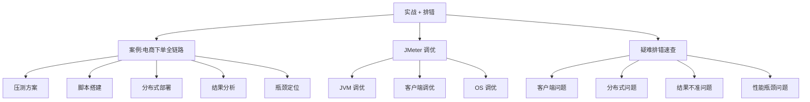

## 8.1 实战案例背景

### 8.1.1 业务背景

**电商下单全链路**:用户登录 → 浏览商品 → 加入购物车 → 提交订单 → 支付 → 查询订单状态。

**业务诉求**:
- **双 11 大促**:预估峰值流量 5000 TPS
- **SLA**:核心链路 P99 < 1s,业务成功率 > 99.95%
- **目标**:验证系统能否支撑 5000 TPS,以及拐点位置

### 8.1.2 系统架构

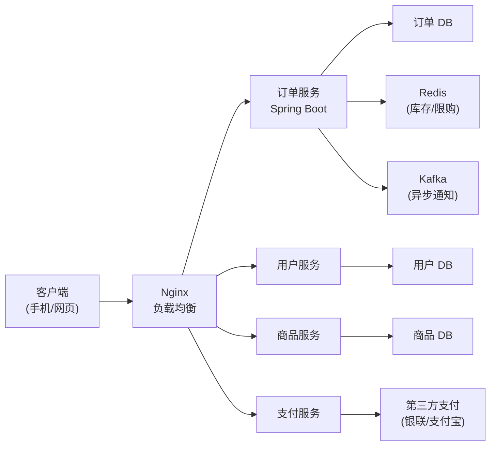

**关键依赖**:
- 3 个数据库(MySQL)
- 1 个 Redis(缓存 + 分布式锁)
- 1 个 Kafka(异步消息)
- 1 个外部依赖(支付)

### 8.1.3 压测范围

| 服务 | 是否压测 | 说明 |
|------|----------|------|
| Nginx | 不直接 | 通过它打,看它本身压力 |
| 订单服务 | ✅ | 核心路径 |
| 用户服务 | ✅ | 登录关联 |
| 商品服务 | ✅ | 浏览关联 |
| 支付服务 | ✅ | 支付调用 |
| Redis | ✅ | 间接 |
| MySQL | ✅ | 间接 |
| Kafka | ✅ | 间接 |
| 第三方支付 | ❌ | **Mock**(避免真实扣款) |

**Mock 第三方支付**:用**Mock 服务**或 JMeter 自带的 Dummy Sampler,避免真实支付。

## 8.2 压测方案设计

### 8.2.1 测试目标

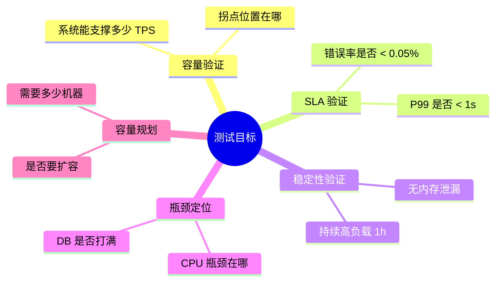

### 8.2.2 场景设计

**场景 1:正常下单**


**场景 2:并发抢库存(秒杀)**


**场景 3:浏览型压力**(单独压浏览)

**场景 4:登录压力**(单独压登录,验证 Session)

### 8.2.3 数据准备

| 数据 | 数量 | 来源 |
|------|------|------|
| 测试用户 | 10000 | 自动生成 |
| 测试商品 | 1000 | 数据库脚本 |
| 初始库存 | 每商品 10000 件 | SQL 初始化 |
| CSV 账号 | users.csv 10 万行 | 脚本生成 |

**用户数据生成脚本**(Python):

```python
import csv

with open('users.csv', 'w', newline='') as f:
    writer = csv.writer(f)
    writer.writerow(['username', 'password', 'userId'])
    for i in range(100000):
        writer.writerow([f'user{i:06d}', 'Pass@123', i + 1])
```

### 8.2.4 测试策略

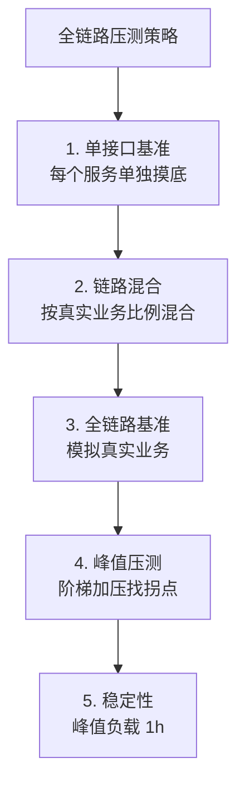

### 8.2.5 验收标准

| 指标 | 目标 | 不达标后果 |
|------|------|------------|
| **核心链路 P99** | < 1000ms | 优化 |
| **TPS** | ≥ 5000 | 扩容 |
| **业务成功率** | > 99.95% | 修复 |
| **服务端 CPU** | < 75% | 扩容 |
| **DB 连接数** | < 80% 池容量 | 调大 |
| **无内存泄漏** | 1h 堆稳定 | 修复 |

## 8.3 脚本搭建详解

### 8.3.1 完整脚本结构

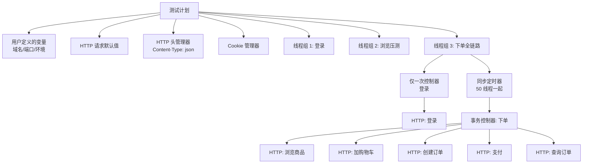

### 8.3.2 关键配置

**1. 测试计划变量**:

| 变量 | 值 | 用途 |
|------|----|------|
| `${__P(domain,api.example.com)}` | 压测域名 | CLI 参数覆盖 |
| `${__P(port,8080)}` | 端口 | CLI 参数覆盖 |
| `${__P(env,test)}` | 环境标识 | 用于日志 |

**2. CSV 数据集(users.csv)**:

```text
username,password,userId
user000001,Pass@123,1
user000002,Pass@123,2
...
```

**配置**:`Recycle on EOF = True`,`Stop thread on EOF = False`(让线程持续使用,循环复用)。

**3. JSON 提取器**(登录后取 token):

```json
{
  "token": "eyJhbGc...",
  "userId": 1
}
```

```json
JSON Path: $.token
Match Numbers: 1
Default Value: NOT_FOUND
```

**4. 关联 header**(把 token 注入到后续请求):

```text
Header Name: Authorization
Header Value: Bearer ${token}
```

**5. 断言配置**:

| 请求 | 断言 |
|------|------|
| 登录 | 响应码=200 + JSON `code=0` + `$.token` 存在 |
| 浏览商品 | 响应码=200 + JSON `code=0` |
| 创建订单 | 响应码=200 + JSON `code=0` + `$.orderId` 存在 |
| 支付 | 响应码=200 + JSON `code=0` |
| 查询订单 | 响应码=200 + JSON `$.status = "PAID"` |

### 8.3.3 线程组配置

```text
线程数: 200
Ramp-Up: 30s(线性增加)
循环次数: 永远
调度器:
  启动延迟: 0s
  持续时间: 1800s(30 分钟)
```

**为什么用调度器**:用循环次数难以精确控制时长,调度器更精准。

### 8.3.4 同步定时器(模拟峰值)

```text
线程组内加同步定时器:
  Number of Simulated Users to Group by: 50
  Timeout in milliseconds: 5000
```

**含义**:50 个线程集齐才一起放行(制造瞬时并发),最多等 5 秒。

### 8.3.5 事务控制器

```text
事务名称: 下单全链路
Generate parent sample: ✅
Include duration of timer and pre/post processors: ✅
```

**作用**:聚合报告里的"下单全链路"是合并耗时,而不是 5 个请求各算一次。

### 8.3.6 完整测试计划文件结构

```text
test-plan/
├── order-stress.jmx              # 主脚本
├── users.csv                     # 用户数据
├── goods.csv                     # 商品数据(可选)
├── config/
│   ├── env-test.properties        # 测试环境配置
│   └── env-prod.properties       # 生产环境配置
├── scripts/                      # 分布式压测脚本
│   ├── start-slaves.sh
│   └── run-test.sh
├── results/
│   └── 2026-09-05/               # 按日期归档
└── reports/
    └── 2026-09-05/               # HTML 报告归档
```

## 8.4 分布式部署实战

### 8.4.1 机器规划

| 角色 | IP | 规格 | 数量 |
|------|-----|------|------|
| 主控机 | 192.168.1.10 | 4C8G | 1 |
| 从机 | 192.168.1.11~14 | 8C16G | 4 |
| 目标系统 | 192.168.2.0/24 | 已有 | — |

**为什么从机配置高于主控机**:主控机只调度,从机才真正发请求。

### 8.4.2 环境统一

**所有机器执行**:

```bash
# 1. 安装 JDK 11
yum install -y java-11-openjdk

# 2. 安装 JMeter 5.6
cd /opt
wget https://dlcdn.apache.org//jmeter/binaries/apache-jmeter-5.6.3.tgz
tar xf apache-jmeter-5.6.3.tgz
mv apache-jmeter-5.6.3 jmeter

# 3. 配置环境变量
cat >> /root/.bashrc <<'EOF'
export JMETER_HOME=/opt/jmeter
export PATH=$JMETER_HOME/bin:$PATH
EOF
source /root/.bashrc

# 4. 验证
jmeter --version
```

### 8.4.3 从机配置

**jmeter.properties 修改**(所有从机):

```properties
server_mode=true
server_port=1099
server.rmi.localhostname=192.168.1.11  # 改为本机 IP

# 分布式配置(主控机填这里)
remote_hosts=192.168.1.10
```

**启动从机**:

```bash
nohup jmeter-server -Djava.rmi.server.hostname=192.168.1.11 > /var/log/jmeter-server.log 2>&1 &
```

### 8.4.4 主控机配置

**jmeter.properties**:

```properties
remote_hosts=192.168.1.11,192.168.1.12,192.168.1.13,192.168.1.14

# HTML 报告配置
jmeter.reportgenerator.apdex_threshold=500
jmeter.reportgenerator.report_title=电商下单全链路压测
```

### 8.4.5 验证分布式

```bash
# 在主控机执行
jmeter -n -t test.jmx -R 192.168.1.11,192.168.1.12 -l test.jtl -X
```

**预期日志**:

```text
Creating summariser <summary>
Created the tree successfully using order-stress.jmx
Configuring remote engine: 192.168.1.11
Configuring remote engine: 192.168.1.12
Starting distributed workers
    192.168.1.11
    192.168.1.12
```

**看到从机 IP 表示分布式连通**。

### 8.4.6 启动正式压测

**后台运行脚本**:

```bash
#!/bin/bash
# run-test.sh

SLAVE_LIST="192.168.1.11,192.168.1.12,192.168.1.13,192.168.1.14"
TEST_PLAN="order-stress.jmx"
RESULT_DIR="results/$(date +%Y%m%d_%H%M%S)"
JTL_FILE="$RESULT_DIR/result.jtl"
REPORT_DIR="$RESULT_DIR/report"

mkdir -p $RESULT_DIR

# 启动压测
jmeter -n -t $TEST_PLAN -R $SLAVE_LIST -l $JTL_FILE -e -o $REPORT_DIR

echo "压测完成"
echo "报告路径: $REPORT_DIR"
```

**启动**:

```bash
chmod +x run-test.sh
nohup ./run-test.sh > /var/log/stress.log 2>&1 &
```

### 8.4.7 实时监控

**Grafana 实时 Dashboard 配置**:

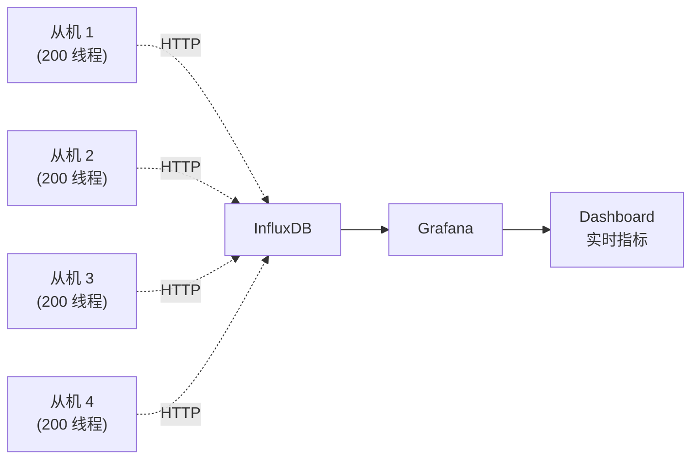

**配置 Backend Listener**(脚本中):

```text
Backend Listener implementation: InfluxDB Backend Listener
influxdbMetricsSender: org.apache.jmeter.visualizers.backend.influxdb.HttpMetricsSender
influxdbUrl: http://192.168.1.50:8086/write?db=jmeter
application: order-stress
transaction: 下单全链路
```

## 8.5 压测过程监控

### 8.5.1 实时观察要点

**看 Grafana 的 5 个核心指标**:

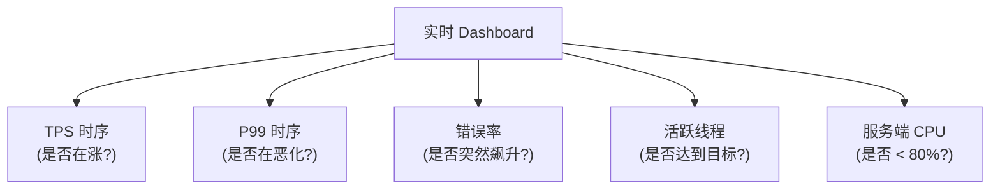

### 8.5.2 异常处理决策

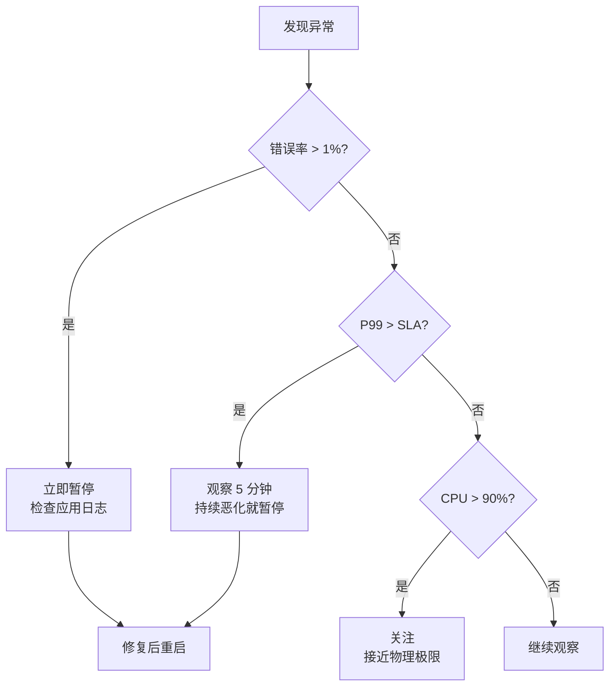

### 8.5.3 压测中可调整的参数

**不停压测动态调整**:

| 参数 | 调整方法 |
|------|----------|
| 线程数 | 重新启动压测(无法动态) |
| Ramp-Up | 重新启动压测 |
| **CSV 数据集** | 可热替换(慎用) |
| **环境变量** | 通过 `-J` 参数覆盖 |
| **第三方 Mock** | 可热替换 |

## 8.6 压测结果分析

### 8.6.1 示例结果数据

**TPS-并发曲线**(简化):

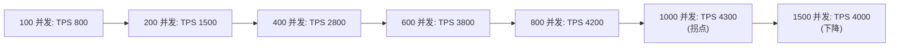

**拐点位置**:约 1000 并发,TPS 峰值 4300。

### 8.6.2 响应时间分析

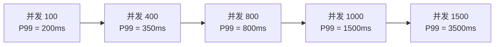

**P99 SLA = 1000ms** → **800 并发时仍达标,1000 并发时恶化**。

### 8.6.3 资源利用率分析

| 资源 | 拐点时利用率 | 是否瓶颈 |
|------|--------------|----------|
| **应用 CPU** | 78% | ⚠️ 接近 |
| **DB CPU** | 92% | ✅ **是瓶颈** |
| **DB 连接数** | 85% (170/200) | ⚠️ 接近 |
| **DB 慢查询** | 200/s | ✅ **问题** |
| **Redis** | 30% | ❌ |
| **网络** | 200Mbps / 1Gbps | ❌ |

**结论**:**数据库是瓶颈**。

### 8.6.4 错误率分析

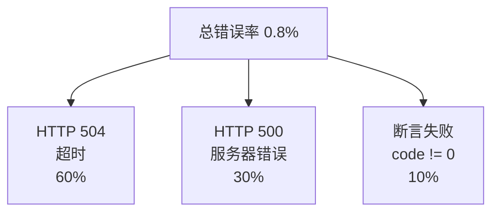

**错误类型分布**:
- 60% 是超时(说明 RT 飙升)
- 30% 是 HTTP 500(说明 DB 慢导致应用报错)
- 10% 是断言失败(业务异常)

### 8.6.5 调优方向

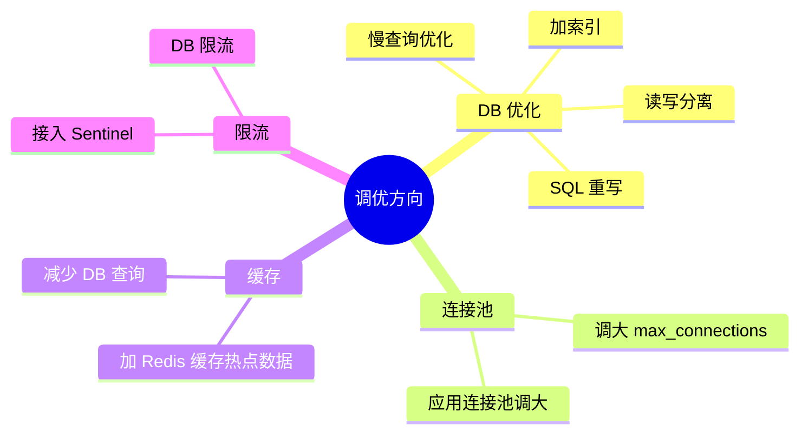

## 8.7 瓶颈定位案例

### 8.7.1 慢 SQL 定位

**MySQL 慢查询分析**:

```sql
-- 开启慢查询日志
SET GLOBAL slow_query_log = 'ON';
SET GLOBAL long_query_time = 1;  -- 1 秒以上记录

-- 查看慢查询
SELECT * FROM mysql.slow_log ORDER BY start_time DESC LIMIT 10;
```

**压测中发现 TOP 3 慢 SQL**:

| SQL | 平均耗时 | 调用次数 | 优化 |
|-----|----------|----------|------|
| `SELECT * FROM orders WHERE user_id = ?` | 350ms | 5000/s | 加索引 |
| `UPDATE goods SET stock = stock - 1 WHERE id = ?` | 280ms | 3000/s | 行锁优化 |
| `INSERT INTO order_log ...` | 150ms | 2000/s | 异步写 |

### 8.7.2 JVM GC 分析

**压测中观察 GC 日志**:

```text
[GC (Allocation Failure)  524288K->327680K(786432K), 0.0456789 secs]
[Full GC (Ergonomics)  786432K->524288K(786432K), 0.2345678 secs]
```

**Full GC 频率**:5 次/分钟 → **过于频繁**。

**调优**:

```bash
# 增加堆内存
-Xms8g -Xmx8g

# G1 GC 配置
-XX:+UseG1GC
-XX:MaxGCPauseMillis=100
-XX:InitiatingHeapOccupancyPercent=45
```

### 8.7.3 线程状态分析

**jstack 分析**:

```bash
# 找 BLOCKED 线程
jstack <pid> | grep BLOCKED -A 10
```

**典型结果**:

```text
"orderHandler-123" #123 daemon prio=5 BLOCKED
  at java.util.concurrent.locks.ReentrantLock.lock(ReentrantLock.java)
  - waiting to lock <0x000000076b2c8e58>
  at com.example.service.OrderService.createOrder
```

**结论**:**业务锁竞争**——多个线程抢同一把锁,导致阻塞。

### 8.7.4 锁等待分析

**数据库锁等待**:

```sql
SELECT * FROM information_schema.INNODB_TRX 
WHERE trx_state = 'RUNNING' AND trx_started < NOW() - INTERVAL 10 SECOND;
```

**查看具体锁**:

```sql
SELECT * FROM performance_schema.data_locks LIMIT 10;
SELECT * FROM performance_schema.data_lock_waits LIMIT 10;
```

### 8.7.5 调优效果对比

**第一轮压测**(基线):
- 拐点 1000 并发,TPS 峰值 4300,P99 1500ms

**调优后**(第二轮):
- 加索引 + 缓存 + JVM 调优
- 拐点 1500 并发,TPS 峰值 6200,P99 800ms

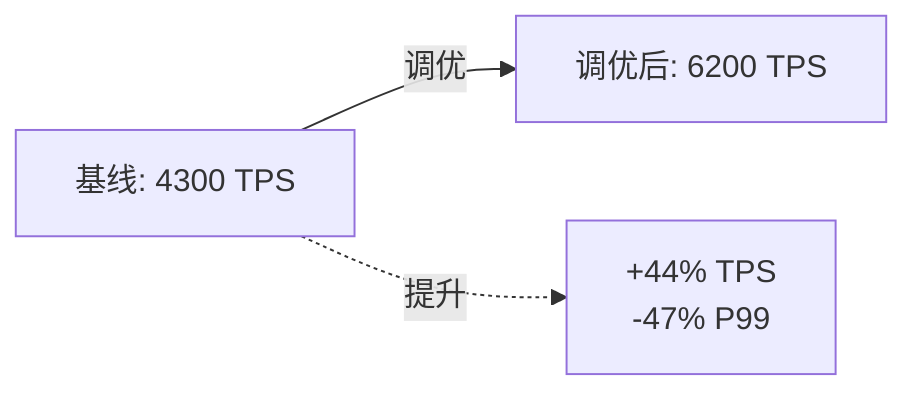

## 8.8 JMeter 客户端调优

### 8.8.1 JVM 调优

**jmeter.bat / jmeter.sh** 修改:

```bash
# 堆内存(根据机器调整)
HEAP="-Xms4g -Xmx4g"

# GC 配置
GC_ARGS="-XX:+UseG1GC -XX:MaxGCPauseMillis=100 -XX:+ParallelRefProcEnabled"

# 元空间
META="-XX:MaxMetaspaceSize=512m"

# OOM 时 dump
OOM="-XX:+HeapDumpOnOutOfMemoryError -XX:HeapDumpPath=/var/log/jmeter-oom.hprof"

JVM_ARGS="$HEAP $GC_ARGS $META $OOM"
```

### 8.8.2 jmeter.properties 调优

```properties
# HTTP 客户端实现(推荐 HTTPClient4)
httpclient4.time_to_connect=10000
httpclient4.time_to_read=30000
httpclient4.so_timeout=30000

# 关闭不必要功能
jmeter.save.saveservice.response_data=false  # 不存响应体
jmeter.save.saveservice.samplerData=false

# 监听器缓存
view.results.tree.max_results=500  # 默认 500,可调低
view.results.tree.render_text=false

# 后端监听器
backend_influxdb.send_interval=2  # 推送间隔秒
```

### 8.8.3 操作系统调优(Linux)

**文件句柄**:

```bash
# 查看当前
ulimit -n

# 临时调整
ulimit -n 65535

# 永久调整 /etc/security/limits.conf
echo '* soft nofile 65535' >> /etc/security/limits.conf
echo '* hard nofile 65535' >> /etc/security/limits.conf
```

**内核参数**:

```bash
# /etc/sysctl.conf
net.core.somaxconn = 65535
net.ipv4.tcp_max_syn_backlog = 65535
net.ipv4.tcp_tw_reuse = 1
net.ipv4.tcp_fin_timeout = 30

# 应用
sysctl -p
```

### 8.8.4 减少客户端瓶颈

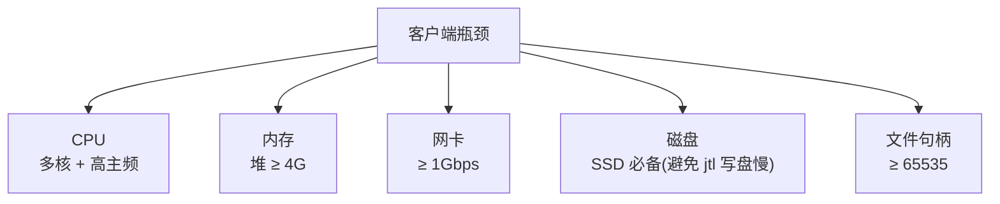

### 8.8.5 压测机选型

**推荐配置**(单台):

| 项目 | 最低 | 推荐 |
|------|------|------|
| CPU | 8 核 | 16 核(主频 ≥ 2.5GHz) |
| 内存 | 16 GB | 32 GB |
| 网卡 | 1 Gbps | 10 Gbps |
| 磁盘 | SSD | NVMe SSD |
| OS | CentOS 7+ | Ubuntu 20.04+ |
| JDK | OpenJDK 11 | OpenJDK 17 LTS |

## 8.9 服务端调优配合

### 8.9.1 压测环境的"预热"

**正式压测前必做**:

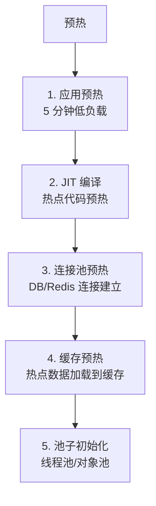

**为什么**:
- JVM JIT 编译需要"热点样本"——没预热,首次执行慢
- DB 连接池建立耗时——首次请求慢
- Redis 缓存为空——首次查询打 DB

### 8.9.2 服务端 JVM 调优

**Spring Boot 应用启动参数**:

```bash
java -jar order-service.jar \
  -Xms4g -Xmx4g \
  -XX:+UseG1GC \
  -XX:MaxGCPauseMillis=100 \
  -XX:+ParallelRefProcEnabled \
  -XX:+HeapDumpOnOutOfMemoryError \
  -XX:HeapDumpPath=/var/log/oom.hprof \
  -Djava.rmi.server.hostname=192.168.2.10
```

### 8.9.3 服务端 Tomcat 调优

```yaml
# application.yml
server:
  tomcat:
    threads:
      max: 400        # 容器线程数
      min-spare: 50
    accept-count: 200  # 等待队列
    max-connections: 10000
    connection-timeout: 10000
```

**线程数计算**:经验值 = (CPU 核数 × 2) + 1。16 核机器约 33 个线程足够——但要结合业务 IO 密集程度。

### 8.9.4 数据库调优

**MySQL 关键参数**:

```ini
# /etc/my.conf
[mysqld]
innodb_buffer_pool_size = 8G           # 缓冲池(主内存 70%)
innodb_log_file_size = 2G              # redo log
max_connections = 1000                 # 最大连接
innodb_flush_log_at_trx_commit = 2     # 性能优先(2 丢 1s 数据)
query_cache_size = 0                   # MySQL 8+ 已移除
tmp_table_size = 256M
max_heap_table_size = 256M
```

**连接池**(HikariCP):

```yaml
spring:
  datasource:
    hikari:
      maximum-pool-size: 50      # DB 连接池
      minimum-idle: 10
      connection-timeout: 30000
      idle-timeout: 600000
      max-lifetime: 1800000
```

### 8.9.5 Redis 调优

```conf
# redis.conf
maxmemory 4gb
maxmemory-policy allkeys-lru

# 网络
tcp-backlog 511
timeout 300
tcp-keepalive 60

# 持久化(性能优先关掉)
save ""
```

## 8.10 压测报告模板

### 8.10.1 报告结构

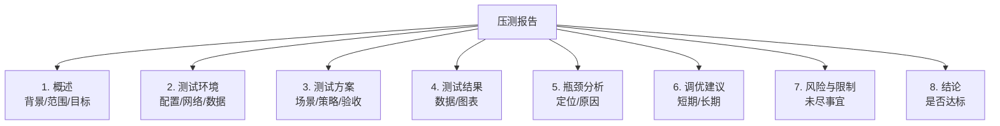

### 8.10.2 核心数据模板

```markdown
## 5. 测试结果

### 5.1 拐点定位

| 并发数 | TPS | P50(ms) | P90(ms) | P99(ms) | 错误率 |
|--------|-----|---------|---------|---------|--------|
| 100    | 800 | 80      | 120     | 200     | 0.01%  |
| 400    | 2800| 120     | 250     | 350     | 0.05%  |
| 800    | 3800| 180     | 500     | 800     | 0.20%  |
| **1000** | **4300** | 280 | 800 | 1500 | 0.50% | ← 拐点
| 1500   | 4000| 450 | 1500 | 3500 | 0.80% |

### 5.2 资源利用

| 资源 | 拐点时利用率 | 是否瓶颈 |
|------|--------------|----------|
| 应用 CPU | 78% | 警戒 |
| DB CPU | 92% | **是** |
| DB 连接 | 85% | 警戒 |
| Redis | 30% | 否 |

### 5.3 错误类型分布

- HTTP 504 超时:60%
- HTTP 500:30%
- 断言失败:10%

## 6. 调优建议

### 短期
- [ ] 优化 TOP 3 慢 SQL(预计提升 20%)
- [ ] 增大 DB 连接池到 80(预计错误率 -50%)

### 长期
- [ ] 引入读写分离
- [ ] 加缓存(Redis)缓存热点数据
- [ ] 微服务拆分,缓解单一 DB 压力

## 7. 风险

- 第三方支付为 Mock,真实环境可能有差异
- 压测期间未做生产真实数据迁移,部分缓存场景未覆盖
```

### 8.10.3 报告关键图表

**必备图表**:
1. **TPS-并发曲线图**(找拐点)
2. **P99-并发曲线图**(看响应时间恶化)
3. **错误率-并发曲线图**
4. **资源利用率时序图**
5. **错误类型饼图**

### 8.10.4 报告分发

- **邮件发送**:PDF 版本(渲染 HTML 报告)
- **Confluence / Wiki**:HTML 嵌入
- **即时通讯群**:简要结论 + 报告链接

## 8.11 常见疑难问题速查

### 8.11.1 JMeter 启动问题

| 现象 | 原因 | 解决 |
|------|------|------|
| 启动报错 "Port already in use" | 1099 端口占用 | `netstat -ano | findstr 1099`(Win)或`lsof -i :1099`(Linux)查 PID,杀掉 |
| OOM | 堆太小或样本太多 | 加大 `-Xmx`,关闭响应体保存 |
| Java 版本错误 | JMeter 与 JDK 不匹配 | JMeter 5.6 需 JDK 8+(推荐 11/17) |

### 8.11.2 脚本调试问题

| 现象 | 原因 | 解决 |
|------|------|------|
| 关联变量取不到值 | JSON 路径错 | 用"Debug Sampler"打印所有变量 |
| 参数化全部失败 | CSV 路径错 | 用绝对路径或 `${__CSVRead(...)}` |
| 断言全失败 | 服务器实际不可用 | 先 Postman/curl 验证 |
| 中文乱码 | 编码不一致 | 设 `Content-Type: application/json;charset=UTF-8` + 文件编码 UTF-8 |

### 8.11.3 分布式问题

| 现象 | 原因 | 解决 |
|------|------|------|
| 主控连不上从机 | 防火墙/IP 错 | 检查 iptables + `server.rmi.localhostname` |
| 样本丢失 | 从机磁盘满 | 监控磁盘,清理 |
| 时间不同步 | NTP 没配 | 安装 NTP,误差 < 1s |
| 结果不准 | 从机性能差异大 | 统一从机配置 |

### 8.11.4 性能结果异常

| 现象 | 原因 | 解决 |
|------|------|------|
| P99 极高但 P50 低 | 长尾,可能是 GC 或外部依赖 | 看 GC 日志 + 第三方监控 |
| TPS 上不去但 CPU 低 | 锁竞争/IO 等待 | jstack + iostat |
| 错误率全 HTTP 500 | 应用崩溃 | 看应用日志 |
| 错误率全断言失败 | 业务异常或断言写错 | 单独验证接口 |

### 8.11.5 网络问题

| 现象 | 原因 | 解决 |
|------|------|------|
| 连接被拒绝 | 服务端限流或挂了 | 看服务端状态 |
| 连接超时 | 网络慢或服务端 RT 高 | `tcping` 测延迟 |
| DNS 解析慢 | DNS 服务器问题 | 改用 IP 压测 |

### 8.11.6 内存泄漏

**压测稳定性测试常见问题**:

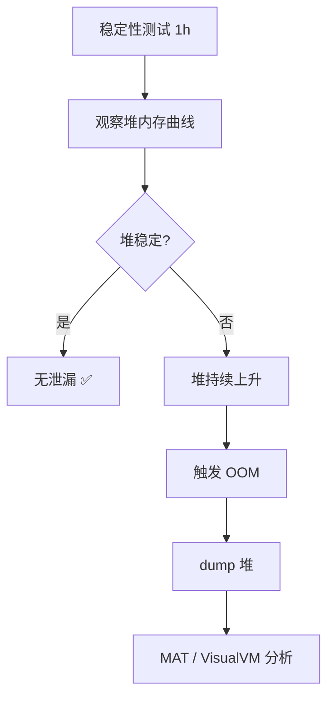

**MAT 分析步骤**:

```bash
# 1. dump 堆(应用启动参数加)
-XX:+HeapDumpOnOutOfMemoryError -XX:HeapDumpPath=/tmp/oom.hprof

# 2. 用 MAT 打开 hprof 文件
# Look for "Leak Suspects" → 查看可疑对象

# 3. 重点关注
# - 静态集合类(Map/List)
# - 线程局部变量未清理
# - 监听器/回调未注销
# - 资源(连接/流)未关闭
```

## 8.12 常见反模式

### 8.12.1 报告反模式

```text
❌ "系统最大 5000 TPS"
✅ "5000 TPS 时,P99 800ms,错误率 0.05%(满足 SLA),
    加压到 6000 TPS 后 P99 飙升至 2s(超过 SLA)"

❌ "压测通过,可以上线"
✅ "压测发现 DB 是瓶颈,优化后 TPS 提升 40%,
    建议上线前完成 DB 索引调整和缓存预热"

❌ 只报平均响应时间
✅ 报 P50/P90/P95/P99 全套
```

### 8.12.2 执行反模式

```text
❌ GUI 模式跑正式压测
✅ CLI 模式跑正式压测

❌ 一台机器打到底
✅ 分布式压测,单机 ≤ 1000 并发

❌ 不预热直接压
✅ 先低负载预热 5 分钟

❌ 压测期间不监控服务端
✅ 同时看应用 + DB + 中间件 + 缓存

❌ 压测完不清理数据
✅ 清理测试数据,还原配置
```

### 8.12.3 设计反模式

```text
❌ 一次压测覆盖所有场景
✅ 分场景:基线/峰值/稳定性

❌ 第三方依赖打真实
✅ Mock 第三方,只压自己系统

❌ 用开发账号压测
✅ 独立的测试账号体系

❌ 压测完不留脚本
✅ 脚本 Git 管理,可复现
```

## 8.13 完整工作流总结

### 8.13.1 完整流程图

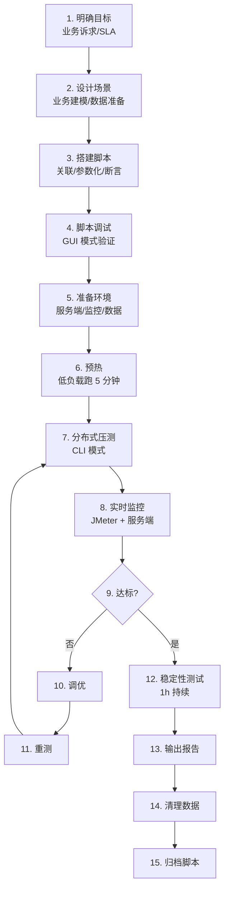

### 8.13.2 时间投入参考

| 阶段 | 占比 | 备注 |
|------|------|------|
| 场景设计 | 10% | 业务理解最重要 |
| 脚本搭建 | 25% | 关联/参数化 |
| 环境准备 | 10% | 包括服务端/数据/监控 |
| 压测执行 | 15% | 多次反复 |
| **结果分析 + 调优** | **35%** | **最耗时** |
| 报告输出 | 5% | 模板化 |

**核心洞察**:**分析和调优占 1/3 以上**——压测不只是"跑起来"。

## 8.14 持续性能保障

### 8.14.1 CI/CD 集成

**每次发版自动跑基准测试**:

```yaml
# .gitlab-ci.yml
performance_test:
  stage: test
  script:
    - jmeter -n -t benchmark.jmx -l result.jtl
    - python compare.py result.jtl baseline.jtl
  artifacts:
    paths:
      - result.jtl
      - report/
```

**对比基准**:**新版本 vs 上一版本**,性能不能退化超过 10%。

### 8.14.2 生产全链路压测

**高级阶段**:线上真实环境全链路压测。

```mermaid
flowchart TD
    A["生产全链路压测"] --> B["流量隔离<br/>影子表/影子服务"]
    A --> C["流量复制<br/>Nginx Tap / GoReplay"]
    A --> D["流量标记<br/>Header/X-Forwarded-For"]
    A --> E["数据隔离<br/>测试账号/虚拟商品"]
```

**关键原则**:**不污染生产数据 + 不影响真实用户**。

### 8.14.3 性能监控平台化

```mermaid
flowchart LR
    A["压测平台"] --> B["环境管理"]
    A --> C["脚本管理"]
    A --> D["执行调度"]
    A --> E["结果对比"]
    A --> F["报告归档"]
```

**开源参考**:
- [JMeter + InfluxDB + Grafana](https://github.com/johrstrom/jmeter-influxdb-grafana)
- [NGrinder](https://github.com/naver/ngrinder)(基于 JMeter 的压测平台)
- [Skywalking](https://skywalking.apache.org/)(APM,服务端监控)

## 小结 {#summary}

- **全链路压测**:**业务建模 → 脚本搭建 → 分布式部署 → 实时监控 → 调优迭代**。
- **瓶颈定位**:USE 法 + 自顶向下;DB 是常见瓶颈,慢 SQL 是常见根因。
- **客户端调优**:**JVM 堆 ≥ 4G + G1GC + 文件句柄 65535 + SSD**。
- **服务端调优**:**JVM 调优 + Tomcat 线程池 + DB 连接池 + Redis 缓存**。
- **稳定性测试**:**1h 持续压测 + 观察堆曲线 + MAT 分析内存泄漏**。
- **报告**:分位数 + 拐点位置 + 资源利用 + 调优建议。
- **常见坑**:GUI 跑压测、不预热、第三方打真实、不监控服务端。

到这里,整个 JMeter 教程就结束了。

回顾全 8 章:

```mermaid
mindmap
    root((JMeter 教程))
        入门
            概述与安装
            组件全景
            场景设计
        进阶
            关联参数化
            控制器断言定时器
        核心
            性能指标
            Little 定律
            拐点定位
        实战
            CLI 与分布式
            InfluxDB Grafana
            实战案例与调优
```

**关键里程碑**:
- **第 1~4 章**:能写脚本、能跑起来
- **第 5~6 章**:能设计场景、能看懂数字
- **第 7~8 章**:能分布式执行、能定位瓶颈、能调优

希望这份教程能让你**在工作中真正用起来**——看完不是终点,**跑起来才是开始**。