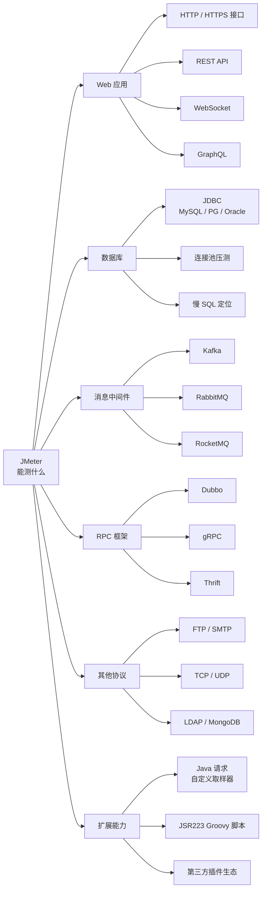
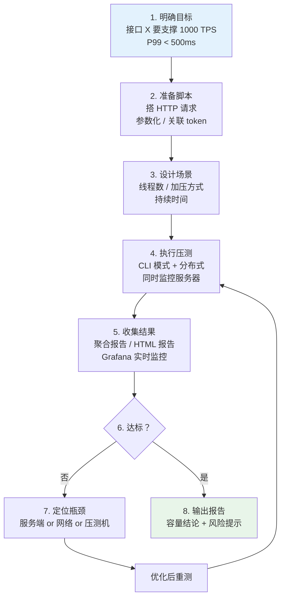

# JMeter 性能测试教程

Apache JMeter 是业界使用最广泛的**开源性能测试工具**。它基于 Java，能压测 HTTP、数据库、消息队列、RPC 等几乎所有协议，且不依赖浏览器，单机可模拟数千并发。

本教程不是「点这里、填那个」的按钮说明书，而是按**实际压测工作的流程**组织：从搭脚本、设计场景、跑压测，到**看懂指标、定位瓶颈**——重点解决「压测跑完了，然后呢？」这个最常见的问题。

## 谁适合看这份教程

- 后端/测试工程师，需要做接口压测但只用过 Postman
- 能跑起 JMeter，但看不懂聚合报告里的数字意味着什么
- 压测数据出来了，不知道多少 TPS 算合格、P99 多少算正常
- 需要给团队/领导输出一份有说服力的压测报告

## JMeter 能做什么

## 一次完整压测的工作流

## 章节 {.cards}

- [第一章：概述、安装与第一个压测](/docs/jmeter/01-overview-install/) — JMeter 是什么、工具对比、环境搭建、GUI 界面、第一个测试计划
- [第二章：核心组件全景与执行顺序](/docs/jmeter/02-components/) — 九大类组件、**执行顺序与作用域**（JMeter 最大难点）
- [第三章：线程组与场景设计](/docs/jmeter/03-thread-group-scenario/) — 线程属性、加压模型、五类压测场景、并发数怎么算
- [第四章：取样器、参数化与关联](/docs/jmeter/04-samplers-correlation/) — 各类请求、CSV 参数化、token 关联、Cookie 管理
- [第五章：逻辑控制器、断言与定时器](/docs/jmeter/05-controllers-assertions/) — 流程控制、结果校验、思考时间与集合点
- [第六章：性能指标知识点](/docs/jmeter/06-metrics/) — **分位数、TPS、并发、错误率、Little 定律、性能拐点**
- [第七章：压测执行与结果分析](/docs/jmeter/07-run-reports/) — CLI/分布式、监听器、HTML 报告、Grafana 实时监控
- [第八章：实战案例与疑难排错](/docs/jmeter/08-practice-troubleshooting/) — 下单全链路实战、JMeter 自身调优、常见坑

## 阅读建议

- **急着干活**：第 1、3、4 章能让你跑起来；第 7 章告诉你怎么看结果。
- **想真懂压测**：**第 6 章是核心**。很多人跑完压测只会看「平均响应时间」，而这个数字恰恰是最容易骗人的指标。
- **要做企业级压测**：第 7、8 章的分布式部署、服务端监控、JMeter 自身调优是必须的。

> 本教程以 **JMeter 5.6.x** 为准（当前主流版本），界面与命令在 5.x 系列中基本一致。所有示例均可在 Windows / macOS / Linux 上复现。
