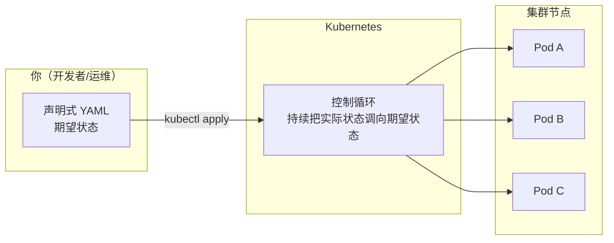
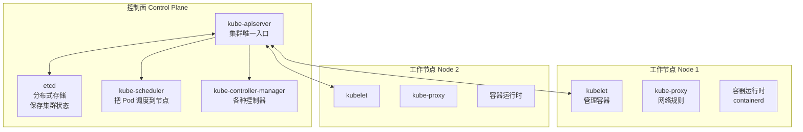

# 架构与集群接入

进公司的第一件事，就是**把 kubectl 连上测试/生产集群**。本章先建立 K8s 的整体认知（控制面 vs 节点），再手把手讲清 kubectl 的配置机制（kubeconfig），最后给出本地练手集群（kind）与多集群切换的实操。

## K8s 是什么 {#what}

Kubernetes 是一个**容器编排系统**：你把「要跑几个副本、需要多少资源、端口怎么暴露」用声明式 YAML 描述清楚，K8s 负责**自动调度、自愈、滚动升级、弹性伸缩**。



核心思想：**你不直接操作容器，而是描述「期望状态」，K8s 自动实现**。这与 Docker Swarm 的 service 理念一致，但抽象层次更高、生态更强。

## 集群架构 {#architecture}

一个 K8s 集群由**控制面（Control Plane）**和**工作节点（Worker Node）**组成。



### 控制面组件 {#control-plane}

| 组件 | 作用 | 类比 |
|------|------|------|
| **kube-apiserver** | 集群唯一入口，所有请求（kubectl、控制器、节点）都经过它 | 前台接待 |
| **etcd** | 分布式 KV 存储，保存集群全部状态 | 数据库 |
| **kube-scheduler** | 决定新 Pod 落在哪个节点（看资源、亲和性、污点） | 排班系统 |
| **kube-controller-manager** | 运行各种控制器（Deployment、ReplicaSet、Node 等） | 各部门主管 |
| **cloud-controller-manager** | 对接云厂商（LB、磁盘），本地集群没有 | 外部接口 |

### 节点组件 {#node}

| 组件 | 作用 |
|------|------|
| **kubelet** | 每个节点的「管家」，确保容器按 Pod 定义运行、上报状态 |
| **kube-proxy** | 维护节点上的网络规则（iptables/IPVS），实现 Service 转发 |
| **容器运行时** | 实际跑容器的引擎，通常是 **containerd**（Docker 已不再是默认） |

> 关键认知：**kubectl 只和 apiserver 通信**，不直接操作容器。所有对集群的改动，本质都是「请求 apiserver 修改 etcd 里的期望状态」，再由控制器把实际状态拉向期望状态。

## 安装 kubectl 与集群访问 {#kubectl}

### 安装 kubectl

```bash
# macOS
brew install kubectl

# Linux
curl -LO "https://dl.k8s.io/release/$(curl -L -s https://dl.k8s.io/release/stable.txt)/bin/linux/amd64/kubectl"
sudo install -o root -g root -m 0755 kubectl /usr/local/bin/kubectl

# Windows（用 choco 或直接下载 exe）
choco install kubernetes-cli

# 验证
kubectl version --client
```

### kubeconfig 机制 {#kubeconfig}

kubectl 通过 **kubeconfig** 文件（默认 `~/.kube/config`）知道该连哪个集群、用什么身份。它包含三要素：

- **clusters**：集群的 API 地址 + CA 证书
- **users**：用户身份（证书 / token）
- **contexts**：cluster + user 的绑定关系（「用 A 身份连 B 集群」）

```yaml
# ~/.kube/config 结构示意
apiVersion: v1
kind: Config
clusters:
  - name: prod-cluster
    cluster:
      server: https://10.0.0.10:6443
      certificate-authority-data: <base64 的 CA>
contexts:
  - name: prod
    context:
      cluster: prod-cluster
      user: prod-user
      namespace: default
users:
  - name: prod-user
    user:
      client-certificate-data: <base64 的客户端证书>
      client-key-data: <base64 的私钥>
current-context: prod
```

### 如何拿到企业集群的 kubeconfig {#get-kubeconfig}

入职时通常从以下途径获取：

```bash
# 方式 1：同事/运维直接给你一个 kubeconfig 文件
mkdir -p ~/.kube
cp ~/Downloads/prod-config ~/.kube/config

# 方式 2：云厂商 CLI 拉取（以阿里云 ACK 为例）
aliyun cs GET /k8s/<cluster-id>/user_config > ~/.kube/config

# 方式 3：AWS EKS
aws eks update-kubeconfig --name my-cluster --region us-east-1

# 方式 4：自建集群，从 master 节点拷贝
scp root@master:/etc/kubernetes/admin.conf ~/.kube/config
```

拿到后验证：

```bash
kubectl cluster-info
# Kubernetes control plane is running at https://10.0.0.10:6443

kubectl get nodes
# NAME         STATUS   ROLES           AGE   VERSION
# node-1       Ready    control-plane   30d   v1.30.0
# node-2       Ready    <none>          30d   v1.30.0

# 查看当前连接的哪个集群、什么身份
kubectl config current-context
kubectl config view --minify
```

## 本地练手：kind 集群 {#kind}

生产集群不能乱动，学习/开发用本地 **kind**（Kubernetes in Docker）最方便——它在 Docker 容器里跑一个完整的 K8s 集群。

```bash
# 安装 kind
brew install kind                     # macOS
# Linux: 从 GitHub release 下载二进制

# 创建单节点集群
kind create cluster --name dev
# 会输出 kubectl context 已切换的提示

# 验证
kubectl get nodes
# NAME                 STATUS   ROLES           AGE   VERSION
# kind-control-plane   Ready    control-plane   1m    v1.30.0

# 创建多节点集群（1 控制面 + 2 节点）
cat <<'EOF' | kind create cluster --name multi --config -
kind: Cluster
apiVersion: kind.x-k8s.io/v1alpha4
nodes:
  - role: control-plane
  - role: worker
  - role: worker
EOF

# 列出所有 kind 集群
kind get clusters

# 删除集群
kind delete cluster --name dev
```

> kind 用 Docker 作为节点，所以需要先装 Docker。想裸机跑多节点也可以选 minikube 或 k3s，但 kind 是最省事的。

## 多集群 context 切换 {#context}

公司通常有 dev / staging / prod 多个集群。把它们的配置合并进一个 kubeconfig，用 context 切换：

```bash
# 把多个 kubeconfig 合并
export KUBECONFIG=~/.kube/config:~/dev-config:~/prod-config
kubectl config view --flatten > ~/.kube/config-merged
mv ~/.kube/config-merged ~/.kube/config

# 查看所有 context
kubectl config get-contexts
# CURRENT   NAME       CLUSTER        AUTHINFO     NAMESPACE
# *         dev        dev-cluster    dev-user     default
#           staging    staging-cluster staging-user default
#           prod       prod-cluster   prod-user    default

# 切换 context
kubectl config use-context prod

# 只对单条命令临时指定 context（不切换默认）
kubectl --context prod get pods

# 给 context 改名（更好记）
kubectl config rename-context dev dev-aliyun
```

### 高危操作防呆 {#guard}

**在生产集群误操作是重大事故**，务必养成习惯：

```bash
# 1. 用一个工具实时显示当前 context（如 kube-ps1，把 [prod] 显示在命令行提示符）
# 安装 kube-ps1 后，提示符变成：
# [k8s: prod|default] $

# 2. 对生产 context 单独建别名，强制带确认
alias kprod='kubectl --context prod'

# 3. 关键命令前先确认 context
kubectl config current-context   # 每次删/改前先看这里

# 4. 只读优先：用 --dry-run=client 预览，再用 -o yaml 看会改什么
kubectl delete pod my-app --dry-run=client -o yaml
```

## 常用对象速览 {#objects}

| 对象 | 作用 | 工作中何时用 |
|------|------|-------------|
| Pod | 最小调度单元（1+ 容器） | 排查、调试 |
| Deployment | 无状态应用（可水平扩展） | 发布 Web/API 服务 |
| StatefulSet | 有状态应用（稳定标识） | 数据库、消息队列 |
| DaemonSet | 每节点跑一个 | 日志收集、监控 agent |
| Job / CronJob | 一次性/定时任务 | 数据迁移、批处理 |
| Service | 服务发现与负载均衡 | 暴露服务给集群内/外 |
| Ingress | 七层路由（域名 → 服务） | 对外暴露 HTTP 服务 |
| ConfigMap / Secret | 配置与敏感信息 | 注入配置 |
| PV / PVC | 持久化存储 | 数据库磁盘 |
| Namespace | 资源隔离 | 分环境/分团队 |

## 小结 {#summary}

本章建立了 K8s 的两大认知——**声明式期望状态**与**控制面/节点分工**，并解决了「入职第一件事」：安装 kubectl、拿到 kubeconfig、连上集群、多集群切换。**高危操作前先 `kubectl config current-context` 确认连的是哪个集群**。下一章开始发布你的第一个应用：从 Pod 到 Deployment 的滚动更新与回滚。
