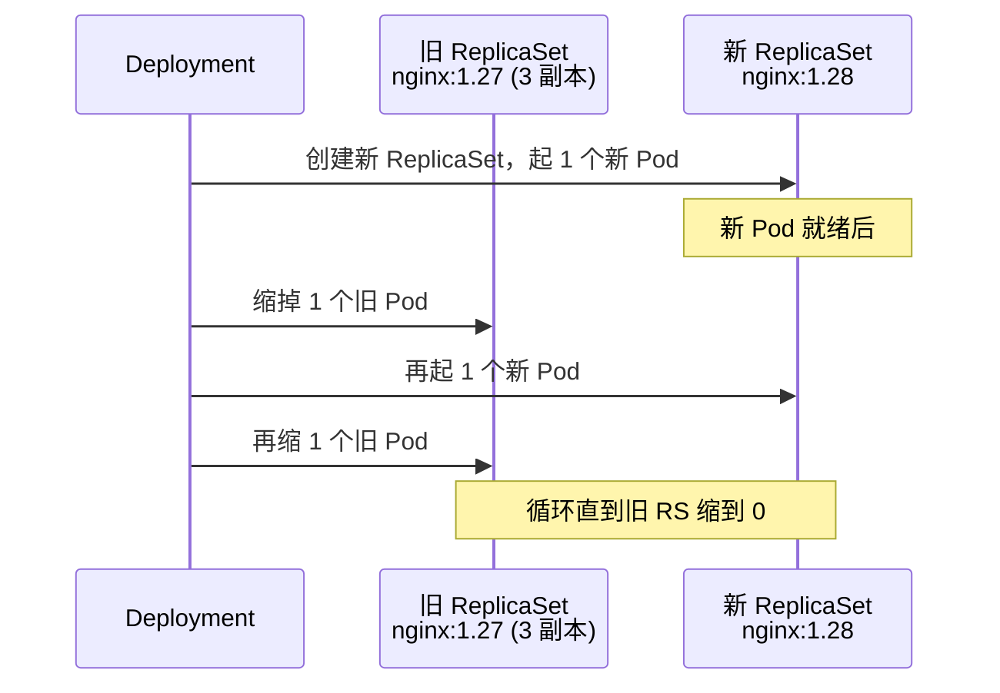
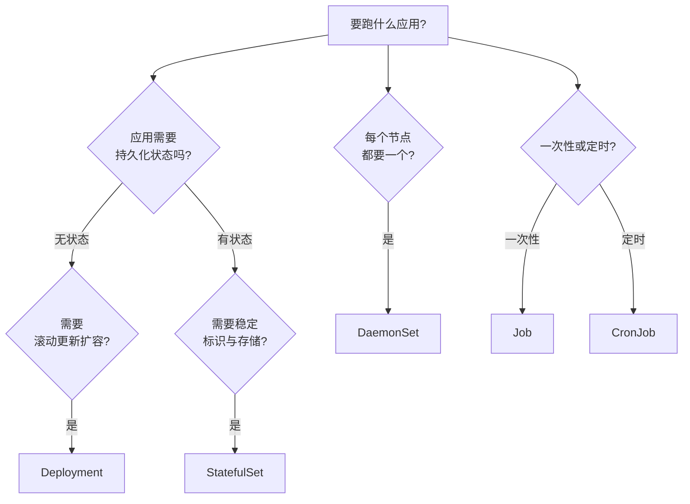

# Pod 与工作负载

日常发布应用，90% 的时间都在和 **Deployment** 打交道。本章从最小单元 Pod 讲起，重点吃透 Deployment 的滚动更新与回滚，再补齐 StatefulSet / DaemonSet / Job / CronJob 这些「按场景选型」的工作负载，最后讲探针（活多久、能不能服务的关键）。

## Pod：最小调度单元 {#pod}

Pod 是 K8s 的**最小调度与运行单元**，一个 Pod 里可以放一个或多个容器（共享网络和存储）。**但日常你几乎不直接创建 Pod，而是通过 Deployment 等控制器管理**。

### 用命令快速起一个 Pod

```bash
# 最简：起一个 nginx Pod
kubectl run my-nginx --image=nginx:1.27 --port=80

# 查看
kubectl get pods
# NAME       READY   STATUS    RESTARTS   AGE
# my-nginx   1/1     Running   0          30s

# 查看详情
kubectl describe pod my-nginx

# 查看日志
kubectl logs my-nginx

# 进入容器
kubectl exec -it my-nginx -- sh

# 端口转发（本地访问 Pod）
kubectl port-forward pod/my-nginx 8080:80
# 浏览器打开 http://localhost:8080

# 删除
kubectl delete pod my-nginx
```

### Pod 的 YAML 结构 {#pod-yaml}

```yaml
apiVersion: v1
kind: Pod
metadata:
  name: my-nginx
  labels:
    app: my-nginx
spec:
  containers:
    - name: nginx
      image: nginx:1.27
      ports:
        - containerPort: 80
      env:
        - name: ENV_NAME
          value: "production"
      resources:
        requests:
          memory: "64Mi"
          cpu: "100m"        # 100m = 0.1 核
        limits:
          memory: "128Mi"
          cpu: "500m"
      livenessProbe:
        httpGet:
          path: /healthz
          port: 80
```

### Pod 的相位与状态 {#pod-status}

`kubectl get pods` 的 STATUS 列是排障的第一线索：

| 状态 | 含义 | 常见原因 |
|------|------|---------|
| `Pending` | 已创建但未调度/未就绪 | 资源不足、镜像拉取中、无可用节点 |
| `Running` | 至少一个容器在运行 | 正常（但未必就绪） |
| `Succeeded` | 所有容器正常退出（一次性任务） | Job 完成 |
| `Failed` | 容器异常退出 | 启动报错、OOM |
| `Unknown` | 节点失联无法获取状态 | 节点宕机 |

> `READY` 列的 `0/1` 表示「1 个容器里 0 个就绪」，往往和探针（liveness/readiness）配置有关。

## Deployment：无状态应用的主战场 {#deployment}

Deployment 是生产最常用的控制器，提供**滚动更新、回滚、扩缩容**。

### 创建 Deployment

```yaml
# deploy.yaml
apiVersion: apps/v1
kind: Deployment
metadata:
  name: web
  labels:
    app: web
spec:
  replicas: 3
  selector:
    matchLabels:
      app: web
  template:                    # Pod 模板
    metadata:
      labels:
        app: web
    spec:
      containers:
        - name: web
          image: nginx:1.27
          ports:
            - containerPort: 80
          resources:
            requests:
              cpu: 100m
              memory: 128Mi
            limits:
              cpu: 500m
              memory: 256Mi
```

```bash
kubectl apply -f deploy.yaml

kubectl get deployments
# NAME   READY   UP-TO-DATE   AVAILABLE   AGE
# web    3/3     3            3           10s

# Deployment 会自动创建 ReplicaSet 和 Pod
kubectl get replicasets
kubectl get pods -l app=web
```

> `selector.matchLabels` 必须和 `template.metadata.labels` 匹配，否则 apply 会报错。

### 扩缩容 {#scale}

```bash
# 命令式
kubectl scale deployment web --replicas=5

# 声明式（改 yaml 里的 replicas 再 apply，推荐）
kubectl edit deployment web   # 或直接改文件
kubectl apply -f deploy.yaml
```

### 更新镜像与滚动更新 {#rolling-update}

```bash
# 更新镜像（触发滚动更新）
kubectl set image deployment/web web=nginx:1.28

# 或改 yaml 里的 image 后 apply
kubectl apply -f deploy.yaml

# 查看滚动更新进度
kubectl rollout status deployment/web
# Waiting for rollout to finish: 1 out of 3 new replicas have been updated...
# deployment "web" successfully rolled out

# 查看历史版本
kubectl rollout history deployment/web
```



默认是「一次换一个」的滚动更新（`maxSurge=25%`、`maxUnavailable=25%`），可以自定义：

```yaml
spec:
  strategy:
    type: RollingUpdate
    rollingUpdate:
      maxSurge: 1             # 更新时最多多出 1 个 Pod
      maxUnavailable: 0       # 更新期间不允许任何 Pod 不可用
```

### 回滚 {#rollback}

```bash
# 查看历史
kubectl rollout history deployment/web
# REVISION  CHANGE-CAUSE
# 1         <none>
# 2         <none>

# 回滚到上一个版本
kubectl rollout undo deployment/web

# 回滚到指定版本
kubectl rollout undo deployment/web --to-revision=1

# 暂停/恢复（避免一次应用多次改动）
kubectl rollout pause deployment/web
kubectl rollout resume deployment/web
```

> 想让 `CHANGE-CAUSE` 显示内容，更新时加 `--record` 或写注解（新版 K8s 用 `kubectl apply` 的 annotation）。

## StatefulSet：有状态应用 {#statefulset}

数据库、消息队列等**需要稳定网络标识 + 稳定存储 + 有序启停**的场景，用 StatefulSet。

```yaml
# statefulset.yaml
apiVersion: apps/v1
kind: StatefulSet
metadata:
  name: mysql
spec:
  serviceName: mysql          # 必须指定一个 headless Service
  replicas: 3
  selector:
    matchLabels:
      app: mysql
  template:
    metadata:
      labels:
        app: mysql
    spec:
      containers:
        - name: mysql
          image: mysql:8
          ports:
            - containerPort: 3306
          volumeMounts:
            - name: data
              mountPath: /var/lib/mysql
  volumeClaimTemplates:        # 每个 Pod 一个独立的 PVC
    - metadata:
        name: data
      spec:
        accessModes: ["ReadWriteOnce"]
        storageClassName: standard
        resources:
          requests:
            storage: 10Gi
```

StatefulSet 与 Deployment 的关键区别：

| 特性 | Deployment | StatefulSet |
|------|-----------|-------------|
| Pod 命名 | `web-<随机hash>` | `mysql-0`、`mysql-1`（稳定、有序） |
| 网络标识 | 随机 | 稳定（`mysql-0.mysql`） |
| 存储 | 共享（可选） | 每个 Pod 独立 PVC |
| 启停顺序 | 并行 | 有序（0→1→2，删时 2→1→0） |
| 典型场景 | Web/API/无状态 | 数据库/消息队列/分布式存储 |

```bash
kubectl get pods -l app=mysql
# NAME      READY   STATUS    RESTARTS   AGE
# mysql-0   1/1     Running   0          1m
# mysql-1   1/1     Running   0          50s
# mysql-2   1/1     Running   0          40s
# 注意命名是 mysql-0 而不是随机 hash
```

## DaemonSet：每节点一个 {#daemonset}

日志采集（filebeat/fluentd）、监控 agent（node-exporter）、网络插件（CNI）等**每个节点都要跑一个**的场景用 DaemonSet。

```yaml
# daemonset.yaml
apiVersion: apps/v1
kind: DaemonSet
metadata:
  name: node-exporter
spec:
  selector:
    matchLabels:
      name: node-exporter
  template:
    metadata:
      labels:
        name: node-exporter
    spec:
      hostNetwork: true       # 用宿主机网络采集指标
      hostPID: true
      containers:
        - name: node-exporter
          image: prom/node-exporter:latest
          ports:
            - containerPort: 9100
```

```bash
kubectl apply -f daemonset.yaml
kubectl get daemonset
# 每个节点都会起一个，新增节点自动补上
```

## Job 与 CronJob：一次性与定时任务 {#job-cronjob}

```yaml
# job.yaml —— 一次性任务（如数据迁移）
apiVersion: batch/v1
kind: Job
metadata:
  name: migrate-db
spec:
  backoffLimit: 3             # 失败重试次数
  template:
    spec:
      restartPolicy: Never    # Job 必须 Never 或 OnFailure
      containers:
        - name: migrate
          image: my-migrate:1.0
          command: ["node", "migrate.js"]
```

```yaml
# cronjob.yaml —— 定时任务（如每天凌晨备份）
apiVersion: batch/v1
kind: CronJob
metadata:
  name: daily-backup
spec:
  schedule: "0 2 * * *"       # 每天凌晨 2 点（Cron 五段式）
  jobTemplate:
    spec:
      template:
        spec:
          restartPolicy: OnFailure
          containers:
            - name: backup
              image: my-backup:1.0
```

```bash
kubectl apply -f job.yaml
kubectl get jobs
kubectl logs job/migrate-db          # 查看 Job 日志

kubectl apply -f cronjob.yaml
kubectl get cronjobs
kubectl get jobs                     # CronJob 会按 schedule 生成 Job

# 手动触发一次 CronJob
kubectl create job --from=cronjob/daily-backup manual-backup
```

Cron 五段式：`分 时 日 月 周`，如 `*/5 * * * *`（每 5 分钟）、`0 9 * * 1-5`（工作日 9 点）。

## 探针：让 K8s 知道容器「好不好」 {#probes}

探针是生产稳定性关键，三种类型：

| 探针 | 作用 | 失败后果 |
|------|------|---------|
| **livenessProbe** | 容器是否「活着」 | 失败 → 重启容器 |
| **readinessProbe** | 容器是否「能接流量」 | 失败 → 从 Service 摘除，但**不重启** |
| **startupProbe** | 启动是否完成（慢启动保护） | 失败前，其他探针不生效 |

```yaml
spec:
  containers:
    - name: web
      image: my-web:1.0
      # 启动探针：给应用 60s 启动时间，期间不触发 liveness
      startupProbe:
        httpGet:
          path: /healthz
          port: 8080
        failureThreshold: 30
        periodSeconds: 10
      # 存活探针：进程假死时重启
      livenessProbe:
        httpGet:
          path: /healthz
          port: 8080
        initialDelaySeconds: 15
        periodSeconds: 10
      # 就绪探针：没就绪不接流量
      readinessProbe:
        httpGet:
          path: /ready
          port: 8080
        periodSeconds: 5
```

### 探针的三种探测方式 {#probe-types}

```yaml
# 1. HTTP GET（最常用）
livenessProbe:
  httpGet:
    path: /healthz
    port: 8080
    httpHeaders:
      - name: Custom-Header
        value: Awesome

# 2. TCP 探测（只测端口通不通）
readinessProbe:
  tcpSocket:
    port: 3306

# 3. 命令探测（容器内执行命令）
livenessProbe:
  exec:
    command: ["cat", "/tmp/healthy"]
```

### 探针常见坑 {#probe-pitfalls}

1. **没有就绪探针**：容器起来了但应用还在初始化，流量就进来了，导致请求 500。**一定要配 readinessProbe**。
2. **liveness 检查太重**：liveness 失败会重启容器，检查项别放太重逻辑（如查数据库），否则抖动引发雪崩。
3. **慢启动被 liveness 误杀**：应用启动超过 `initialDelaySeconds` 就被重启。用 **startupProbe** 解决。
4. **探针指向错误端口**：探针一直失败，容器反复重启。先 `kubectl describe pod` 看探针报错。

## 快速选型 {#workload-chooser}



## 小结 {#summary}

本章覆盖了日常发布的核心：**Deployment 是绝对主力**（滚动更新 + 回滚 + 扩容），StatefulSet 管有状态应用，DaemonSet 管每节点一个，Job/CronJob 管批处理。**探针是生产稳定性的底线**——尤其 readinessProbe 决定流量会不会打到没准备好的容器。下一章解决「应用跑起来了，怎么让外界访问到它」：Service 与 Ingress。
