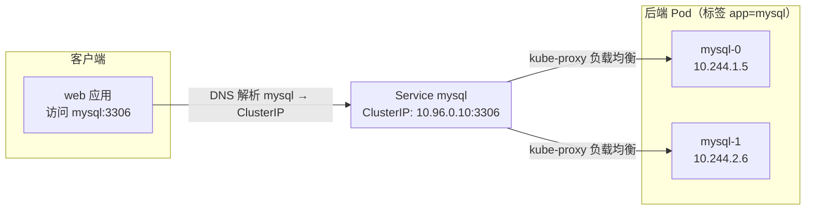
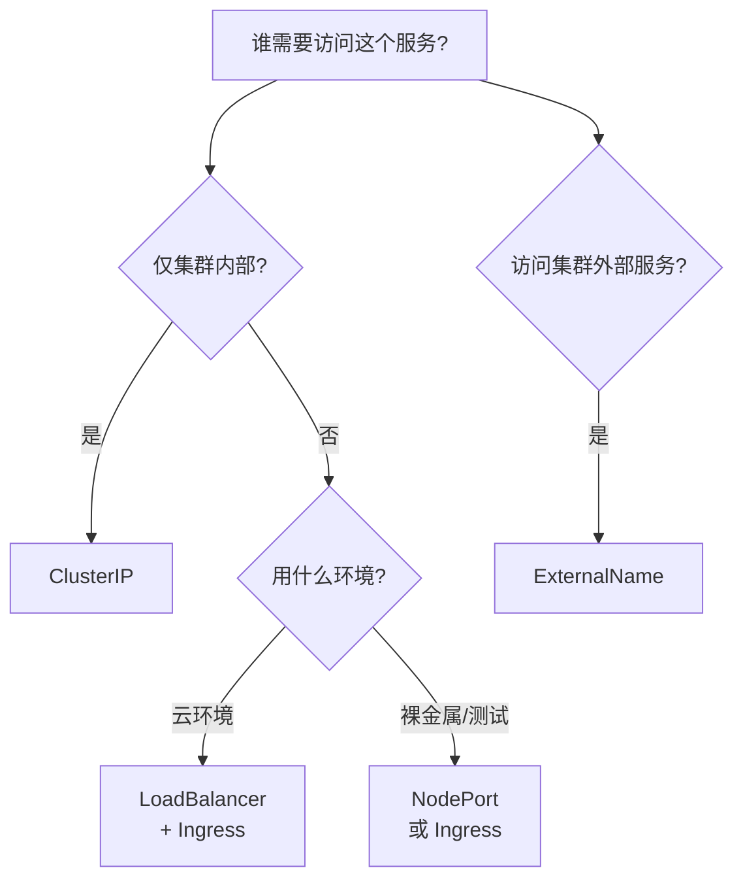
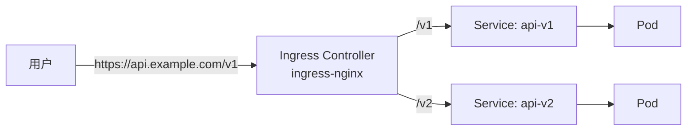

# 服务暴露与网络

Pod 是「易失」的——重启、扩容都会换 IP。K8s 用 **Service** 提供稳定的访问入口，用 **Ingress** 提供七层路由。本章解决工作中最高频的问题：「服务怎么被集群内访问」「怎么暴露给外部」「怎么做域名路由」。

## Service：稳定的访问入口 {#service}

Service 通过**标签选择器**把一组 Pod 聚合成一个稳定的虚拟 IP（ClusterIP），客户端访问这个 IP，流量自动负载均衡到健康的 Pod。



### 创建一个 Service

```yaml
# service.yaml
apiVersion: v1
kind: Service
metadata:
  name: web
spec:
  selector:
    app: web               # 选择标签 app=web 的 Pod
  ports:
    - port: 80             # Service 对外端口
      targetPort: 8080     # 后端 Pod 端口
      protocol: TCP
```

```bash
kubectl apply -f service.yaml

kubectl get svc
# NAME   TYPE        CLUSTER-IP      EXTERNAL-IP   PORT(S)   AGE
# web    ClusterIP   10.96.0.10      <none>        80/TCP    10s

# 查看 Service 关联了哪些 Pod（Endpoints）
kubectl get endpoints web
# NAME   ENDPOINTS
# web    10.244.1.5:8080,10.244.2.6:8080
```

> Service 的 `selector` 必须和 Deployment 的 Pod 标签匹配，否则 Endpoints 为空，流量转发不到任何 Pod。

## Service 的四种类型 {#service-types}

| 类型 | 作用 | 典型场景 |
|------|------|---------|
| **ClusterIP**（默认） | 集群内部访问 | 微服务间互相调用 |
| **NodePort** | 通过节点 IP:端口访问 | 测试、裸金属简单暴露 |
| **LoadBalancer** | 云厂商创建 LB | 生产对外暴露（云环境） |
| **ExternalName** | 把服务映射到外部域名 | 调用集群外服务 |

### ClusterIP（默认，最常用）

```yaml
spec:
  type: ClusterIP
  selector:
    app: web
  ports:
    - port: 80
      targetPort: 8080
```

集群内任何 Pod 都能通过 `web.default.svc.cluster.local` 或简写 `web` 访问。

### NodePort

```yaml
spec:
  type: NodePort
  selector:
    app: web
  ports:
    - port: 80
      targetPort: 8080
      nodePort: 30080    # 30000-32767 范围，可选
```

```bash
kubectl get svc web
# NAME   TYPE       CLUSTER-IP     EXTERNAL-IP   PORT(S)        AGE
# web    NodePort   10.96.0.10     <none>        80:30080/TCP   10s

# 通过任意节点 IP:30080 访问
curl http://<node-ip>:30080
```

### LoadBalancer

云环境（AWS EKS / 阿里云 ACK / GKE）下，自动创建云负载均衡器：

```yaml
spec:
  type: LoadBalancer
  selector:
    app: web
  ports:
    - port: 80
      targetPort: 8080
```

```bash
kubectl get svc web
# NAME   TYPE           CLUSTER-IP     EXTERNAL-IP       PORT(S)        AGE
# web    LoadBalancer   10.96.0.10     a1b2c3d4.elb.amazonaws.com  80:30080/TCP   1m
# EXTERNAL-IP 出现后即可用该域名/公网 IP 访问
```

### ExternalName

集群内用「服务名」访问集群外的服务（如 RDS、外部 API）：

```yaml
apiVersion: v1
kind: Service
metadata:
  name: my-rds
spec:
  type: ExternalName
  externalName: mydb.rds.amazonaws.com
```

集群内 Pod 访问 `my-rds` 会被解析到 `mydb.rds.amazonaws.com`。

## Service 类型选择决策 {#service-choose}



## 服务发现：CoreDNS {#coredns}

K8s 内置 CoreDNS，自动为每个 Service 生成 DNS 记录，Pod 里直接写服务名即可访问：

```bash
# 完整域名
<service>.<namespace>.svc.cluster.local

# 同 namespace 内可简写
<service>

# 跨 namespace 用
<service>.<namespace>

# 验证：在一个 Pod 里解析另一个 Service
kubectl exec -it web-xxx -- nslookup mysql.default.svc.cluster.local
# Name:    mysql.default.svc.cluster.local
# Address: 10.96.0.20
```

| 记录 | 格式 | 示例 |
|------|------|------|
| Service A 记录 | `svc.ns.svc.cluster.local` | `web.default.svc.cluster.local` |
| Pod 记录 | `pod-ip.ns.pod.cluster.local` | `10-244-1-5.default.pod.cluster.local` |

## Headless Service {#headless}

`clusterIP: None` 的 Service 叫 Headless Service，不分配虚拟 IP，DNS 直接返回**每个 Pod 的 IP**。StatefulSet 依赖它做稳定标识：

```yaml
apiVersion: v1
kind: Service
metadata:
  name: mysql-headless
spec:
  clusterIP: None          # 关键
  selector:
    app: mysql
  ports:
    - port: 3306
```

```bash
# 解析会返回所有 Pod IP
nslookup mysql-headless
# Address: 10.244.1.5
# Address: 10.244.2.6
```

## Ingress：七层路由与域名 {#ingress}

Service 解决「稳定访问」，但**一个域名、路径路由、TLS 终止**要靠 **Ingress**。Ingress 是「规则」，真正干活的叫 **Ingress Controller**（如 ingress-nginx、traefik、云厂商 ALB）。



### 安装 Ingress Controller

```bash
# 以 ingress-nginx 为例（最常用）
kubectl apply -f https://raw.githubusercontent.com/kubernetes/ingress-nginx/main/deploy/static/provider/cloud/deploy.yaml

# 验证
kubectl get pods -n ingress-nginx
kubectl get svc -n ingress-nginx
```

### 编写 Ingress 规则

```yaml
# ingress.yaml
apiVersion: networking.k8s.io/v1
kind: Ingress
metadata:
  name: web-ingress
  annotations:
    nginx.ingress.kubernetes.io/rewrite-target: /
spec:
  ingressClassName: nginx
  rules:
    - host: app.example.com          # 域名
      http:
        paths:
          - path: /                  # 路径
            pathType: Prefix
            backend:
              service:
                name: web            # 后端 Service
                port:
                  number: 80
```

```bash
kubectl apply -f ingress.yaml
kubectl get ingress
# NAME          CLASS   HOSTS             ADDRESS        PORTS   AGE
# web-ingress   nginx   app.example.com   192.168.1.20   80      10s
```

### 多域名 / 多路径路由 {#routing}

```yaml
spec:
  ingressClassName: nginx
  rules:
    - host: api.example.com
      http:
        paths:
          - path: /v1
            pathType: Prefix
            backend:
              service:
                name: api-v1
                port: { number: 80 }
          - path: /v2
            pathType: Prefix
            backend:
              service:
                name: api-v2
                port: { number: 80 }
    - host: admin.example.com
      http:
        paths:
          - path: /
            pathType: Prefix
            backend:
              service:
                name: admin
                port: { number: 80 }
```

### TLS 证书 {#tls}

```bash
# 1. 创建 Secret 存证书
kubectl create secret tls web-tls \
  --cert=cert.pem \
  --key=key.pem

# 2. Ingress 引用
```

```yaml
spec:
  tls:
    - hosts:
        - app.example.com
      secretName: web-tls
  rules:
    - host: app.example.com
      http:
        paths:
          - path: /
            pathType: Prefix
            backend:
              service:
                name: web
                port: { number: 80 }
```

> 生产环境 TLS 证书一般用 cert-manager 自动签发/续期 Let's Encrypt，手动创建 Secret 只在临时场景用。

## NetworkPolicy：网络隔离 {#networkpolicy}

默认 K8s 集群内**所有 Pod 互通**，安全要求高时需要 NetworkPolicy 做东西向隔离：

```yaml
# networkpolicy.yaml —— 只允许 app=web 的 Pod 访问 db
apiVersion: networking.k8s.io/v1
kind: NetworkPolicy
metadata:
  name: db-policy
spec:
  podSelector:
    matchLabels:
      app: db
  policyTypes:
    - Ingress
  ingress:
    - from:
        - podSelector:
            matchLabels:
              app: web
      ports:
        - protocol: TCP
          port: 3306
```

```bash
kubectl apply -f networkpolicy.yaml
kubectl get networkpolicy
```

> ⚠️ NetworkPolicy 需要 CNI 插件支持（Calico、Cilium 等）。默认的 flannel 不一定支持，先确认集群 CNI。

## 网络故障排查 {#network-troubleshoot}

```bash
# 1. Service 通不通：先看 Endpoints 有没有
kubectl get endpoints web
# 空 ENDPOINTS 说明 selector 没匹配到 Pod，检查标签

# 2. 用临时 Pod 测连通性
kubectl run test --rm -it --image=nicolaka/netshoot -- sh
# 进 Pod 后：
curl http://web:80          # 测 Service
nslookup web                # 测 DNS
curl http://10.244.1.5:8080 # 直接测 Pod IP

# 3. 看 Service 详情
kubectl describe svc web

# 4. 看 Ingress 是否生效
kubectl describe ingress web-ingress
kubectl logs -n ingress-nginx <ingress-controller-pod>
```

## 小结 {#summary}

本章覆盖了 K8s 网络的「稳定入口」体系：**Service 提供稳定 IP 与负载均衡**（四种类型按场景选），**CoreDNS 提供服务发现**（Pod 里写服务名即可），**Ingress 提供七层路由与 TLS**（域名 → 路径 → Service）。排障时记住一句：**Service 不通先看 Endpoints 是否为空**，那几乎都是标签 selector 不匹配。下一章讲配置注入（ConfigMap/Secret）与持久化存储（PV/PVC）。
