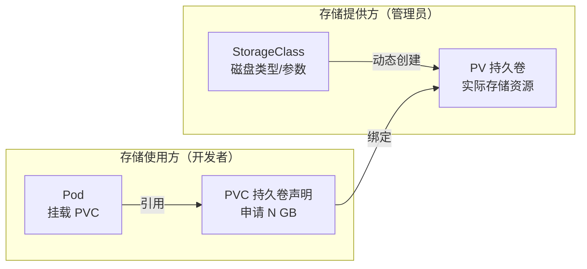

# 配置与存储

应用的配置（环境变量、配置文件）不能硬编码进镜像，敏感信息（密码、密钥）更不能。K8s 用 **ConfigMap**（普通配置）和 **Secret**（敏感信息）解耦「配置」与「代码」。存储方面用 **PV/PVC** 抽象出「申请存储」与「提供存储」的分离。本章讲清这两大主题的生产用法。

## ConfigMap：普通配置 {#configmap}

### 从文件 / 字面量创建

```bash
# 从字面量创建
kubectl create configmap app-config \
  --from-literal=APP_ENV=production \
  --from-literal=LOG_LEVEL=info

# 从文件创建（文件名作为 key）
kubectl create configmap app-config --from-file=app.properties

# 从多个文件创建（整个目录）
kubectl create configmap app-config --from-file=config/

# 查看
kubectl get configmap
kubectl describe configmap app-config
kubectl get configmap app-config -o yaml
```

对应的 YAML：

```yaml
apiVersion: v1
kind: ConfigMap
metadata:
  name: app-config
data:
  APP_ENV: production
  LOG_LEVEL: info
  app.properties: |
    db.host=mysql.default.svc.cluster.local
    db.port=3306
```

### 三种使用方式 {#configmap-usage}

```yaml
spec:
  containers:
    - name: web
      image: my-web:1.0
      # 方式 1：注入为环境变量
      envFrom:
        - configMapRef:
            name: app-config
      # 方式 2：单个 key 注入为环境变量（改名）
      env:
        - name: MY_ENV
          valueFrom:
            configMapKeyRef:
              name: app-config
              key: APP_ENV
      # 方式 3：挂载为文件
      volumeMounts:
        - name: config-volume
          mountPath: /etc/config
          readOnly: true
  volumes:
    - name: config-volume
      configMap:
        name: app-config
```

> **方式 1（envFrom）最常用**：把整个 ConfigMap 所有 key 注入环境变量。

### 热更新与注意事项 {#configmap-note}

- **挂载成文件**的 ConfigMap 会**自动热更新**（K8s 定期同步），但应用需自己 watch 文件变化。
- **注入成环境变量**的 ConfigMap **不会热更新**，必须重启 Pod。
- 想触发滚动重启（改配置后重启所有 Pod）：

```bash
# 加一个会变的 annotation，触发 Deployment 滚动重启
kubectl rollout restart deployment/web
```

## Secret：敏感信息 {#secret}

Secret 与 ConfigMap 用法几乎一样，区别是**面向敏感数据**（密码、token、证书），且默认 **base64 编码**（不是加密，要理解这个前提）。

### 创建 Secret

```bash
# 从字面量创建
kubectl create secret generic db-secret \
  --from-literal=username=admin \
  --from-literal=password='S3cr3t!'

# 从文件创建
kubectl create secret generic db-secret \
  --from-file=./username \
  --from-file=./password

# TLS 证书专用
kubectl create secret tls web-tls --cert=cert.pem --key=key.pem

# Docker 私有仓库凭据
kubectl create secret docker-registry my-registry \
  --docker-server=registry.example.com \
  --docker-username=user \
  --docker-password=pass

# 查看（注意：值是 base64 编码的）
kubectl get secret db-secret -o yaml
```

### 在 Pod 中使用 Secret

```yaml
spec:
  containers:
    - name: web
      image: my-web:1.0
      # 方式 1：注入环境变量
      env:
        - name: DB_PASSWORD
          valueFrom:
            secretKeyRef:
              name: db-secret
              key: password
      # 方式 2：挂载为文件（每个 key 一个文件）
      volumeMounts:
        - name: secrets
          mountPath: /run/secrets
          readOnly: true
  volumes:
    - name: secrets
      secret:
        secretName: db-secret
```

### Secret 安全须知 {#secret-security}

1. **Secret 只是 base64 编码，不是加密**——能 `kubectl get` 的人都能解码。真正的安全依赖 **RBAC 权限控制**（谁有权限读 Secret）。
2. 生产环境用更安全的方案：**Sealed Secrets**、**External Secrets Operator**（对接 Vault/AWS Secrets Manager）或云厂商密钥托管。
3. 环境变量注入的 Secret 可能泄露在进程信息里，敏感场景优先用文件挂载。

## Volume 与 PV/PVC {#pv-pvc}

容器文件系统是临时的，Pod 删除就没了。持久化存储的完整链路：



### PV 与 PVC

- **PV（PersistentVolume）**：集群级存储资源，由管理员或 StorageClass 动态创建。
- **PVC（PersistentVolumeClaim）**：开发者「申请存储」的声明（要多大、什么访问模式）。
- **StorageClass**：定义「如何动态创建 PV」（用什么云盘、什么参数）。

```yaml
# pvc.yaml —— 开发者视角，只需写 PVC
apiVersion: v1
kind: PersistentVolumeClaim
metadata:
  name: data-pvc
spec:
  accessModes:
    - ReadWriteOnce        # 单节点读写
  storageClassName: standard
  resources:
    requests:
      storage: 10Gi
```

```bash
kubectl apply -f pvc.yaml
kubectl get pvc
# NAME       STATUS   VOLUME      CAPACITY   ACCESS MODES   STORAGECLASS
# data-pvc   Bound    pvc-xxx     10Gi       RWO            standard
# STATUS 为 Bound 表示已成功绑定 PV
```

### 访问模式 {#access-modes}

| 模式 | 含义 | 典型场景 |
|------|------|---------|
| `ReadWriteOnce`（RWO） | 单节点读写 | 普通数据库、单实例应用 |
| `ReadOnlyMany`（ROX） | 多节点只读 | 共享配置文件、静态资源 |
| `ReadWriteMany`（RWX） | 多节点读写 | 共享文件系统（NFS、对象存储） |

> 注意：RWO 是「单节点」而非「单 Pod」，同一节点的多个 Pod 仍可共享。

### 在 Deployment 中使用 PVC

```yaml
spec:
  containers:
    - name: mysql
      image: mysql:8
      volumeMounts:
        - name: data
          mountPath: /var/lib/mysql
  volumes:
    - name: data
      persistentVolumeClaim:
        claimName: data-pvc
```

### 动态存储：StorageClass {#storageclass}

生产环境几乎都用 StorageClass 动态创建 PV（不用手写 PV）：

```bash
# 查看集群有哪些 StorageClass
kubectl get storageclass
# NAME                 PROVISIONER            RECLAIMPOLICY   VOLUMEBINDINGMODE
# standard (default)   ebs.csi.aws.com        Delete          WaitForFirstConsumer
# 云厂商都内置了默认 StorageClass
```

常见 StorageClass 的 provisioner：

| 云/环境 | provisioner | 备注 |
|---------|-------------|------|
| AWS EKS | `ebs.csi.aws.com` | EBS 块存储 |
| 阿里云 ACK | `diskplugin.csi.alibabacloud.com` | 云盘 |
| GKE | `pd.csi.storage.gke.io` | Persistent Disk |
| 本地 kind | `rancher.io/local-path` | 本地路径 |

## 有状态应用持久化实战：MySQL {#mysql-practice}

把前面知识串起来，部署一个带持久化的 MySQL：

```yaml
# mysql.yaml
apiVersion: v1
kind: Service
metadata:
  name: mysql
spec:
  clusterIP: None            # headless，供 StatefulSet 用
  selector:
    app: mysql
  ports:
    - port: 3306
---
apiVersion: apps/v1
kind: StatefulSet
metadata:
  name: mysql
spec:
  serviceName: mysql
  replicas: 1
  selector:
    matchLabels:
      app: mysql
  template:
    metadata:
      labels:
        app: mysql
    spec:
      containers:
        - name: mysql
          image: mysql:8
          env:
            - name: MYSQL_ROOT_PASSWORD
              valueFrom:
                secretKeyRef:
                  name: db-secret
                  key: password
          ports:
            - containerPort: 3306
          volumeMounts:
            - name: data
              mountPath: /var/lib/mysql
  volumeClaimTemplates:      # 每个副本自动创建一个 PVC
    - metadata:
        name: data
      spec:
        accessModes: ["ReadWriteOnce"]
        storageClassName: standard
        resources:
          requests:
            storage: 20Gi
```

```bash
kubectl apply -f mysql.yaml
kubectl get statefulset mysql
kubectl get pvc                 # 看到自动创建的 data-mysql-0
# NAME             STATUS   VOLUME      CAPACITY   ACCESS MODES
# data-mysql-0     Bound    pvc-xxx     20Gi       RWO

# 验证持久化：删掉 Pod，数据不丢
kubectl delete pod mysql-0
kubectl get pod mysql-0          # StatefulSet 自动重建，PVC 不变
```

## 配置与存储选型速查 {#cheatsheet}

| 需求 | 用什么 |
|------|--------|
| 普通配置（环境变量、配置文件） | ConfigMap |
| 密码/token/证书 | Secret |
| 应用临时数据 | emptyDir（Pod 删除即丢） |
| 应用持久数据 | PVC + StorageClass |
| 数据库/有状态 | StatefulSet + volumeClaimTemplates |
| 每个节点独立本地盘 | hostPath（慎用，有安全风险） |

## 小结 {#summary}

本章解决了「配置」和「存储」两大生产基础：**ConfigMap 放普通配置、Secret 放敏感信息**（记住 Secret 只是 base64 编码，安全靠 RBAC）；**PVC 申请存储、StorageClass 动态创建 PV**，StatefulSet 用 volumeClaimTemplates 让每个副本都有独立磁盘。下一章讲资源调度（requests/limits、QoS）与弹性伸缩（HPA），这是「应用跑得稳不稳、花不花冤枉钱」的关键。
