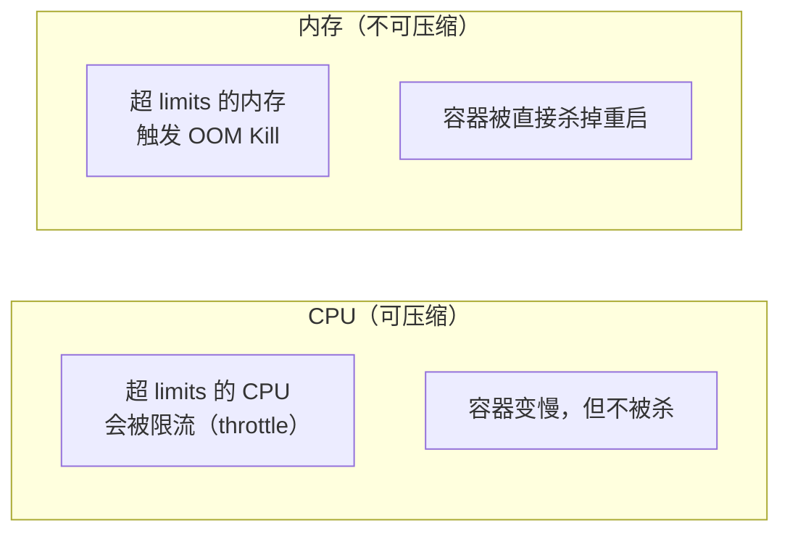

# 资源调度与弹性伸缩

「应用为什么被 OOM 杀掉」「Pod 为什么调度不到我想要的节点」「怎么按流量自动扩容」——这三个问题是生产运维的高频问题。本章从资源请求（requests/limits）讲起，到调度约束（selector/亲和性/污点），再到自动扩缩容（HPA）。

## requests 与 limits：资源的「承诺」与「上限」 {#requests-limits}

```yaml
spec:
  containers:
    - name: web
      image: my-web:1.0
      resources:
        requests:            # 调度承诺：保证分配的量
          cpu: 100m          # 0.1 核
          memory: 128Mi      # 128MB
        limits:              # 运行上限：超过会被限制/杀死
          cpu: 500m          # 0.5 核
          memory: 256Mi
```

| 字段 | 含义 | 作用 |
|------|------|------|
| `requests` | 容器**至少需要**的资源 | 调度器据此决定 Pod 落到哪个节点 |
| `limits` | 容器**最多能用**的资源 | 超限时 CPU 被限流、内存被 OOM Kill |

### CPU 与内存的「超额」行为不同 {#cpu-vs-mem}



- **CPU 超限**：进程被 throttle（限流），运行变慢但不会死。
- **内存超限**：直接 **OOM Kill**，Pod 重启，`kubectl get pods` 的 RESTARTS 会增加。

> 关键经验：**内存 limits 要谨慎设置**。设太低会导致频繁 OOM，设太高（或内存 requests > limits）又可能造成节点内存压力时 Pod 被优先驱逐。

### QoS 等级 {#qos}

K8s 根据 requests/limits 的设置给 Pod 划分 QoS 等级，决定**节点资源紧张时先杀谁**：

| QoS 等级 | 条件 | 驱逐优先级 |
|---------|------|-----------|
| **Guaranteed** | 每个容器 requests == limits | 最低（最后被杀） |
| **Burstable** | requests < limits，或部分容器没设 | 中 |
| **BestEffort** | 完全没设 requests/limits | 最高（最先被杀） |

```yaml
# Guaranteed：requests 和 limits 完全相等
resources:
  requests:
    cpu: 500m
    memory: 256Mi
  limits:
    cpu: 500m
    memory: 256Mi
```

> 生产实践：**关键服务至少设 requests**（保证有调度资源 + 提升 QoS）；有状态/数据库服务考虑设 Guaranteed。

## 调度约束 {#scheduling}

### NodeSelector：按标签选节点

```bash
# 给节点打标签
kubectl label nodes node-1 disktype=ssd

# 查看节点标签
kubectl get nodes --show-labels
```

```yaml
spec:
  nodeSelector:
    disktype: ssd          # 只调度到有 disktype=ssd 标签的节点
```

### 亲和性（Affinity）：更灵活的调度 {#affinity}

NodeSelector 只能「硬匹配」，亲和性支持**软偏好**与更多操作符：

```yaml
spec:
  affinity:
    nodeAffinity:
      requiredDuringSchedulingIgnoredDuringExecution:   # 硬约束（必须满足）
        nodeSelectorTerms:
          - matchExpressions:
              - key: disktype
                operator: In
                values: ["ssd"]
      preferredDuringSchedulingIgnoredDuringExecution:  # 软偏好（尽量满足）
        - weight: 1
          preference:
            matchExpressions:
              - key: zone
                operator: In
                values: ["zone-a"]
```

**Pod 反亲和性**：让 Pod 尽量分散到不同节点（高可用关键）：

```yaml
spec:
  affinity:
    podAntiAffinity:
      requiredDuringSchedulingIgnoredDuringExecution:
        - labelSelector:
            matchLabels:
              app: web
          topologyKey: kubernetes.io/hostname    # 按主机分散
```

> 高可用实践：**数据库/关键服务用 podAntiAffinity 让副本分散到不同节点**，避免单节点故障导致全部副本宕机。

### 污点与容忍（Taint & Toleration）{#taint}

污点（Taint）让节点「排斥」Pod，容忍（Toleration）让 Pod 能「忍受」污点。常用于**专用节点**（如 GPU 节点只跑 AI 任务）。

```bash
# 给节点加污点（格式：key=value:effect）
kubectl taint nodes node-gpu gpu=true:NoSchedule

# 效果：默认 Pod 都不会调度到这个节点
```

```yaml
spec:
  tolerations:
    - key: "gpu"
      operator: "Equal"
      value: "true"
      effect: "NoSchedule"
```

三种 effect：

| effect | 含义 |
|--------|------|
| `NoSchedule` | 新 Pod 不调度到该节点 |
| `PreferNoSchedule` | 尽量不调度（软） |
| `NoExecute` | 不调度 + 驱逐已有 Pod |

```bash
# 移除污点
kubectl taint nodes node-gpu gpu=true:NoSchedule-
```

> 常见坑：master/control-plane 节点默认有污点 `node-role.kubernetes.io/control-plane:NoSchedule`，所以业务 Pod 不会跑到控制面。若想用控制面跑业务，需加对应 toleration（不推荐）。

## HPA：自动扩缩容 {#hpa}

**HPA（HorizontalPodAutoscaler）** 根据 CPU/内存或自定义指标自动调整副本数。

```bash
# 先创建 HPA（基于 CPU 自动扩容）
kubectl autoscale deployment web --cpu-percent=60 --min=2 --max=10

# 或写 YAML
```

```yaml
# hpa.yaml
apiVersion: autoscaling/v2
kind: HorizontalPodAutoscaler
metadata:
  name: web
spec:
  scaleTargetRef:
    apiVersion: apps/v1
    kind: Deployment
    name: web
  minReplicas: 2
  maxReplicas: 10
  metrics:
    - type: Resource
      resource:
        name: cpu
        target:
          type: Utilization
          averageUtilization: 60     # 平均 CPU 到 60% 就扩容
```

```bash
kubectl apply -f hpa.yaml
kubectl get hpa
# NAME   REFERENCE        TARGETS         MINPODS   MAXPODS   REPLICAS
# web    Deployment/web   45%/60%         2         10        2

# 模拟负载后，副本自动增加
kubectl get hpa web --watch
```

### HPA 的生效前提 {#hpa-prereq}

1. **必须设 resources.requests**（HPA 按 requests 的百分比算 CPU 利用率），没设会报错。
2. 集群需装 **metrics-server**（提供 CPU/内存指标）：

```bash
# 安装 metrics-server（kind/minikube 常见缺失）
kubectl apply -f https://github.com/kubernetes-sigs/metrics-server/releases/latest/download/components.yaml

# 验证
kubectl top nodes
kubectl top pods
```

### 扩缩容的「稳定窗口」 {#stabilization}

HPA 默认有冷却期（避免频繁抖动）：扩容后 3 分钟不再缩容，缩容后 5 分钟不再扩容。可自定义：

```yaml
spec:
  behavior:
    scaleDown:
      stabilizationWindowSeconds: 300   # 缩容前观察 5 分钟
      policies:
        - type: Percent
          value: 50
          periodSeconds: 60             # 每分钟最多缩 50%
    scaleUp:
      stabilizationWindowSeconds: 0     # 扩容立即
      policies:
        - type: Percent
          value: 100
          periodSeconds: 15             # 每 15 秒最多翻倍
```

## PDB：保护可用性 {#pdb}

**PDB（PodDisruptionBudget）** 限制「自愿中断」（节点维护、滚动更新）时最多同时下线几个 Pod，保证服务不中断：

```yaml
# pdb.yaml
apiVersion: policy/v1
kind: PodDisruptionBudget
metadata:
  name: web-pdb
spec:
  minAvailable: 2          # 至少保持 2 个可用（或 maxUnavailable: 1）
  selector:
    matchLabels:
      app: web
```

```bash
kubectl apply -f pdb.yaml
kubectl get pdb
# NAME      MIN AVAILABLE   MAX UNAVAILABLE   ALLOWED DISRUPTIONS
# web-pdb   2               N/A               1
```

> 节点维护（`kubectl drain node`）时，若驱逐会导致可用副本低于 minAvailable，操作会被阻塞——这正是 PDB 的保护作用。

## 资源调度实战清单 {#checklist}

| 场景 | 方案 |
|------|------|
| 保证调度资源 | 设 `resources.requests` |
| 防内存泄漏拖垮节点 | 设 `resources.limits` |
| 关键服务抗驱逐 | requests == limits（Guaranteed） |
| Pod 落到特定节点 | nodeSelector / nodeAffinity |
| 副本分散到不同节点 | podAntiAffinity + `kubernetes.io/hostname` |
| 专用节点（GPU） | Taint + Toleration |
| 按流量自动扩容 | HPA + metrics-server |
| 维护时不中断服务 | PDB |

## 小结 {#summary}

本章覆盖「资源」与「调度」两条主线：**requests/limits 决定资源分配与 QoS**（内存超限会被 OOM Kill，CPU 超限只被限流）；**调度约束**（selector/亲和性/污点）决定 Pod 落在哪；**HPA 实现自动扩容**（前提是设了 requests + 装了 metrics-server）；**PDB 保护维护期间的可用性**。这些都是「生产服务稳定 + 成本可控」的基石。下一章进入最实用的部分：线上出问题怎么排障。
